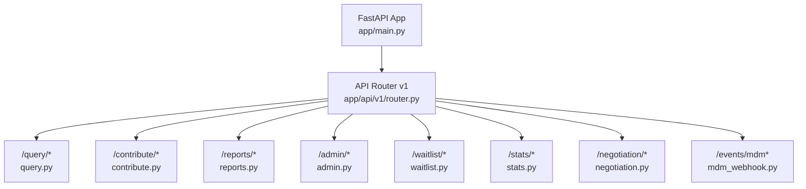
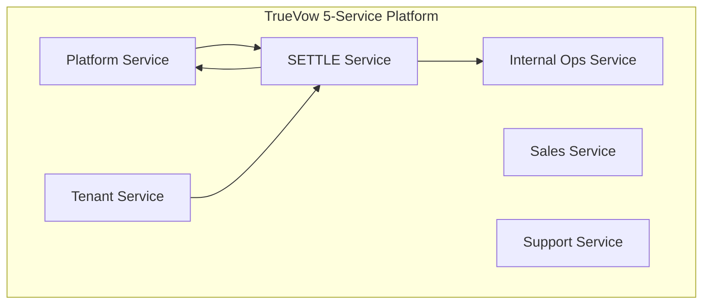
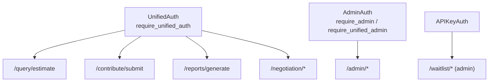

# API Documentation

<cite>
**Referenced Files in This Document**
- [README.md](file://README.md)
- [app/main.py](file://app/main.py)
- [app/api/v1/router.py](file://app/api/v1/router.py)
- [app/api/v1/endpoints/query.py](file://app/api/v1/endpoints/query.py)
- [app/api/v1/endpoints/contribute.py](file://app/api/v1/endpoints/contribute.py)
- [app/api/v1/endpoints/reports.py](file://app/api/v1/endpoints/reports.py)
- [app/api/v1/endpoints/admin.py](file://app/api/v1/endpoints/admin.py)
- [app/api/v1/endpoints/waitlist.py](file://app/api/v1/endpoints/waitlist.py)
- [app/api/v1/endpoints/stats.py](file://app/api/v1/endpoints/stats.py)
- [app/api/v1/endpoints/negotiation.py](file://app/api/v1/endpoints/negotiation.py)
- [app/api/v1/endpoints/mdm_webhook.py](file://app/api/v1/endpoints/mdm_webhook.py)
- [app/models/case_bank.py](file://app/models/case_bank.py)
- [app/models/reports.py](file://app/models/reports.py)
- [app/core/auth.py](file://app/core/auth.py)
- [app/core/config.py](file://app/core/config.py)
</cite>

## Table of Contents
1. [Introduction](#introduction)
2. [Project Structure](#project-structure)
3. [Core Components](#core-components)
4. [Architecture Overview](#architecture-overview)
5. [Detailed Component Analysis](#detailed-component-analysis)
6. [Dependency Analysis](#dependency-analysis)
7. [Performance Considerations](#performance-considerations)
8. [Troubleshooting Guide](#troubleshooting-guide)
9. [Conclusion](#conclusion)
10. [Appendices](#appendices)

## Introduction
This document provides comprehensive API documentation for the SETTLE Service, covering all v1 endpoints grouped by function: query estimation, contribution submission, report generation, administrative functions, waitlist management, statistics, negotiation timeline, and MDM webhook integration. It specifies HTTP methods, URL patterns, request/response schemas, authentication requirements, rate limiting, versioning, and integration patterns with TrueVow services.

## Project Structure
The API surface is organized under a single router that mounts endpoint groups by functional domain. Public endpoints are available without authentication, while authenticated endpoints require either an API key or a Clerk JWT. Administrative endpoints require admin-level credentials.

**Diagram sources**
- [app/main.py:134-135](file://app/main.py#L134-L135)
- [app/api/v1/router.py:10-24](file://app/api/v1/router.py#L10-L24)

**Section sources**
- [app/api/v1/router.py:1-26](file://app/api/v1/router.py#L1-L26)
- [app/main.py:134-135](file://app/main.py#L134-L135)

## Core Components
- Unified authentication supports:
  - API Key (legacy): Authorization: Bearer settle_xxx or X-API-Key: settle_xxx
  - Clerk JWT (new): Authorization: Bearer eyJxxx
  - Admin endpoints require admin-level credentials
- Versioning: All endpoints are under /api/v1
- Rate limiting: Enabled by default with configurable limits
- Service-to-service integration: Requires X-Service-Name and request correlation headers

**Section sources**
- [app/core/auth.py:340-485](file://app/core/auth.py#L340-L485)
- [app/core/config.py:196-199](file://app/core/config.py#L196-L199)
- [README.md:241-252](file://README.md#L241-L252)

## Architecture Overview
The SETTLE Service participates in the TrueVow 5-service architecture. It integrates with Platform, Internal Ops, Sales, Support, and Tenant services. Administrative functions integrate with the SaaS Admin platform.

**Diagram sources**
- [README.md:28-73](file://README.md#L28-L73)
- [README.md:184-209](file://README.md#L184-L209)

**Section sources**
- [README.md:184-209](file://README.md#L184-L209)

## Detailed Component Analysis

### Query Estimation
- Purpose: Estimate settlement ranges using comparable cases with percentile calculations or multipliers.
- Authentication: Supports API Key and Clerk JWT; logs user_id, tenant_id, and auth method.
- Request: EstimateRequest fields include jurisdiction, case_type, injury_category, medical_bills, and optional filters.
- Response: EstimateResponse includes percentiles, number of comparable cases, confidence level, comparable_cases, and metadata.
- Health: GET /api/v1/query/health

JSON Schemas
- Request: EstimateRequest
  - Fields: jurisdiction, case_type, injury_category (array), medical_bills (number), optional filters
  - Validation: jurisdiction must contain comma; injury_category length >= 1
- Response: EstimateResponse
  - Fields: percentile_25, median, percentile_75, percentile_95, n_cases, confidence, comparable_cases (array), range_justification (optional), query_id (optional), queried_at, response_time_ms (optional)

Authentication
- API Key: Authorization: Bearer settle_xxx or X-API-Key: settle_xxx
- Clerk JWT: Authorization: Bearer eyJxxx
- Audit: Logs auth_method, user_id, tenant_id, scope

Rate Limiting
- Enabled globally; default 60/min

Example Requests
- POST /api/v1/query/estimate
  - Headers: Authorization: Bearer settle_xxx
  - Body: EstimateRequest JSON
- GET /api/v1/query/health

Error Codes
- 400: Validation errors or missing required fields
- 401: Invalid or missing authentication
- 500: Internal server error

**Section sources**
- [app/api/v1/endpoints/query.py:20-117](file://app/api/v1/endpoints/query.py#L20-L117)
- [app/models/case_bank.py:69-139](file://app/models/case_bank.py#L69-L139)
- [app/core/auth.py:340-485](file://app/core/auth.py#L340-L485)
- [app/core/config.py:196-199](file://app/core/config.py#L196-L199)

### Contribution Submission
- Purpose: Submit anonymized settlement data for inclusion in the database.
- Workflow: Validate, anonymize, generate blockchain hash, store with pending status, track Founding Member stats, emit behavioral event.
- Authentication: Unified auth; admin-level access grants special privileges.
- Request: ContributionRequest fields include venue, injury/treatment, financial, liability, outcome, and consent.
- Response: ContributionResponse includes contribution_id, blockchain_hash, message, optional founding_member_status, status, created_at.
- Stats: GET /api/v1/contribute/stats (public)
- Health: GET /api/v1/contribute/health

JSON Schemas
- Request: ContributionRequest
  - Required: jurisdiction, case_type, injury_category (array), medical_bills, defendant_category, outcome_type, outcome_amount_range
  - Validation: jurisdiction format; outcome_amount_range must be one of predefined buckets
- Response: ContributionResponse
  - Fields: contribution_id, blockchain_hash, message, founding_member_status (optional), status, created_at

Compliance
- No PHI/PII; no free-text narratives; only drop-down values and bucketed amounts; consent required

Example Requests
- POST /api/v1/contribute/submit
  - Headers: Authorization: Bearer settle_xxx
  - Body: ContributionRequest JSON
- GET /api/v1/contribute/stats
- GET /api/v1/contribute/health

Error Codes
- 400: Validation or compliance failure
- 401: Invalid or missing authentication
- 500: Internal server error

**Section sources**
- [app/api/v1/endpoints/contribute.py:51-163](file://app/api/v1/endpoints/contribute.py#L51-L163)
- [app/models/case_bank.py:141-203](file://app/models/case_bank.py#L141-L203)
- [app/core/auth.py:340-485](file://app/core/auth.py#L340-L485)

### Report Generation
- Purpose: Generate SETTLE™ 4-page reports (PDF/JSON/HTML) with settlement range, comparable cases, justification, and compliance statements.
- Authentication: Requires unified auth.
- Request: ReportRequest supports query_id or estimate_id plus format selection; inline query parameters allowed if no query_id.
- Response: ReportResponse includes report_id, query_id, report_url, ots_hash, format, generated_at, optional summary for JSON.
- Template: GET /api/v1/reports/template returns template structure.
- Health: GET /api/v1/reports/health

JSON Schemas
- Request: ReportRequest
  - Fields: query_id (optional), estimate_id (optional), format ("pdf","json","html")
  - Validation: format must be one of allowed values
- Response: ReportResponse
  - Fields: report_id, query_id (optional), report_url, ots_hash, format, generated_at, summary (optional), message

Example Requests
- POST /api/v1/reports/generate
  - Headers: Authorization: Bearer settle_xxx
  - Body: ReportRequest JSON
- GET /api/v1/reports/template
- GET /api/v1/reports/health

Error Codes
- 400: Missing required identifiers or invalid parameters
- 401: Invalid or missing authentication
- 500: Internal server error

**Section sources**
- [app/api/v1/endpoints/reports.py:23-258](file://app/api/v1/endpoints/reports.py#L23-L258)
- [app/models/reports.py:57-100](file://app/models/reports.py#L57-L100)
- [app/models/case_bank.py:110-139](file://app/models/case_bank.py#L110-L139)

### Administrative Functions (SaaS Admin)
- Purpose: Administer contributions, Founding Members, API keys, and analytics.
- Authentication: Admin-level unified auth required.
- Endpoints:
  - Contributions: GET /api/v1/admin/contributions/pending, GET /api/v1/admin/contributions/{id}, POST /api/v1/admin/contributions/{id}/approve, POST /api/v1/admin/contributions/{id}/reject?reason=...
  - Founding Members: GET /api/v1/admin/founding-members, GET /api/v1/admin/founding-members/{id}, POST /api/v1/admin/founding-members/{id}/status?status=..., GET /api/v1/admin/founding-members/contributions?month=...
  - API Keys: POST /api/v1/admin/api-keys/create?tenant_id=...&access_level=..., GET /api/v1/admin/api-keys/{tenant_id}, POST /api/v1/admin/api-keys/{key_id}/rotate, DELETE /api/v1/admin/api-keys/{key_id}
  - Analytics: GET /api/v1/admin/analytics/dashboard, GET /api/v1/admin/analytics/usage?start_date=&end_date=, GET /api/v1/admin/analytics/contributions, GET /api/v1/admin/analytics/compliance, GET /api/v1/admin/analytics/data-quality
  - Health: GET /api/v1/admin/health

JSON Schemas
- Pending Contributions Response: contributions (array), total, limit, offset
- Contribution Details Response: full contribution record
- Approval/Rejection Responses: status, contribution_id, timestamps, messages
- Founding Members: members (array), total, limit, offset, max_members
- API Key Management: tenant_id, api_key, key_id, access_level, created_at/rotated_at/status
- Analytics: dashboards and metrics for contributions, usage, compliance, data quality

Example Requests
- GET /api/v1/admin/contributions/pending?limit=50&offset=0
- POST /api/v1/admin/contributions/{id}/approve
- POST /api/v1/admin/api-keys/create?tenant_id=...&access_level=standard
- GET /api/v1/admin/analytics/dashboard

Error Codes
- 401/403: Insufficient permissions or invalid admin credentials
- 404: Resource not found
- 500: Internal server error

**Section sources**
- [app/api/v1/endpoints/admin.py:31-755](file://app/api/v1/endpoints/admin.py#L31-L755)

### Waitlist Management
- Purpose: Public join form and admin management of waitlist entries.
- Authentication:
  - Public: POST /api/v1/waitlist/join (no auth)
  - Admin: GET/GET/POST/POST with APIKeyAuth (requires X-API-Key)
- Endpoints:
  - Public: POST /api/v1/waitlist/join (join waitlist)
  - Admin: GET /api/v1/waitlist/entries, GET /api/v1/waitlist/entries/{entry_id}, POST /api/v1/waitlist/entries/{entry_id}/approve, POST /api/v1/waitlist/entries/{entry_id}/reject

JSON Schemas
- Join Request: firm_name, contact_name, email, phone (optional), practice_areas (array), jurisdiction (optional), referral_source (optional)
- Join Response: waitlist_id, message, position (optional)
- Entry Details: id, firm_name, contact_name, email, phone, practice_areas, jurisdiction, status, created_at, reviewed_at, reviewed_by

Example Requests
- POST /api/v1/waitlist/join
  - Body: WaitlistJoinRequest JSON
- POST /api/v1/waitlist/entries/{entry_id}/approve
  - Headers: X-API-Key: ...
  - Body: WaitlistApprovalRequest JSON

Error Codes
- 400: Duplicate email or invalid state transitions
- 401: Missing or invalid API key for admin endpoints
- 404: Entry not found
- 500: Internal server error

**Section sources**
- [app/api/v1/endpoints/waitlist.py:62-417](file://app/api/v1/endpoints/waitlist.py#L62-L417)

### Statistics
- Purpose: Public statistics for Founding Member program and database coverage.
- Endpoints:
  - GET /api/v1/stats/founding-members (program stats)
  - GET /api/v1/stats/database (database stats)

JSON Schemas
- Founding Member Stats: total_members, active_members, slots_remaining, total_capacity, total_contributions, total_queries, total_reports
- Database Stats: total_contributions, approved_contributions, pending_contributions, flagged_contributions, jurisdictions_covered, states_covered

Example Requests
- GET /api/v1/stats/founding-members
- GET /api/v1/stats/database

Error Codes
- 500: Database unavailable or query failure (returns zeros in mock mode)

**Section sources**
- [app/api/v1/endpoints/stats.py:41-181](file://app/api/v1/endpoints/stats.py#L41-L181)

### Negotiation Timeline
- Purpose: Manage negotiation events, timelines, settlements, and offer analysis.
- Authentication: Requires unified auth.
- Endpoints:
  - POST /api/v1/negotiation/events (add event)
  - GET /api/v1/negotiation/{case_id}/timeline (timeline)
  - POST /api/v1/negotiation/{case_id}/settlement (record settlement)
  - GET /api/v1/negotiation/{case_id}/analysis?settlement_median=... (offer analysis)
  - GET /api/v1/negotiation/{case_id}/summary?settlement_median=... (executive summary)

JSON Schemas
- Event Create: event_type, amount (optional), party (optional), notes (optional), event_at (optional)
- Timeline Response: case_id, events (array), current_round, last_offer_amount (optional), last_offer_party (optional)
- Settlement Record: settlement_amount, settlement_date, insurer (optional), notes (optional)
- Offer Analysis: has_data, total_rounds, settlement_median, offers (array), trend (optional)
- Summary: status, rounds_completed, current_position (optional), typical_pattern (optional), settlement_amount (optional), outcome_vs_model (optional)

Example Requests
- POST /api/v1/negotiation/events?case_id=...
  - Body: NegotiationEventCreate JSON
- GET /api/v1/negotiation/{case_id}/timeline
- POST /api/v1/negotiation/{case_id}/settlement
- GET /api/v1/negotiation/{case_id}/analysis?settlement_median=...

Error Codes
- 400: Invalid event data or settlement recording failure
- 401: Invalid or missing authentication
- 404: No negotiation data available
- 500: Internal server error

**Section sources**
- [app/api/v1/endpoints/negotiation.py:87-246](file://app/api/v1/endpoints/negotiation.py#L87-L246)

### MDM Webhook Integration
- Purpose: Receive lifecycle events from MDM (SaaS Admin) to maintain case snapshots and emit billing events.
- Authentication: Requires X-API-Key header matching SaaS Admin service key.
- Endpoints:
  - POST /api/v1/events/mdm (receive webhook)
  - GET /api/v1/events/mdm/health (health check)

Webhook Payloads
- case.created: case_id, tenant_id, incident_type, injury_category, county, state, policy_limit_band (optional), insurer (optional), litigation_stage, medical_specials_band (optional), liability_strength
- case.updated: case_id, tenant_id, updated_fields (object)
- case.settled: case_id, tenant_id, settlement_amount, settlement_date, insurer (optional)

Processing
- case.created: create snapshot if not exists, emit billing event, record settle_events
- case.updated: update snapshot with allowed fields, record settle_events
- case.settled: mark snapshot inactive, record settle_events

Example Requests
- POST /api/v1/events/mdm
  - Headers: X-API-Key: ...
  - Body: JSON payload based on event_type

Error Codes
- 400: Invalid JSON or missing event_type
- 401: Invalid X-API-Key
- 500: Internal server error

**Section sources**
- [app/api/v1/endpoints/mdm_webhook.py:73-325](file://app/api/v1/endpoints/mdm_webhook.py#L73-L325)

## Dependency Analysis
- Authentication dependencies:
  - UnifiedAuth supports API Key and Clerk JWT with audit logging
  - Admin endpoints enforce admin-level access
- Data models:
  - Pydantic models define request/response schemas for all endpoints
- Configuration:
  - Rate limiting, service URLs, timeouts, and feature flags are centrally managed
- Cross-service integration:
  - Service-to-service headers: X-Service-Name, X-Request-ID, X-Request-Timestamp
  - Integrates with Platform, Internal Ops, and SaaS Admin services

**Diagram sources**
- [app/core/auth.py:340-485](file://app/core/auth.py#L340-L485)
- [app/api/v1/router.py:14-21](file://app/api/v1/router.py#L14-L21)

**Section sources**
- [app/core/auth.py:340-485](file://app/core/auth.py#L340-L485)
- [app/core/config.py:258-318](file://app/core/config.py#L258-L318)

## Performance Considerations
- Response time targets:
  - Query estimation: p95 < 1 second
  - Report generation: p95 < 2 seconds
- Rate limiting: Enabled by default (60/min)
- Background tasks: Audit logging and async operations are fire-and-forget to minimize latency
- Monitoring: Sentry integration enabled in staging/production environments

**Section sources**
- [app/core/config.py:232-233](file://app/core/config.py#L232-L233)
- [app/core/config.py:196-199](file://app/core/config.py#L196-L199)
- [app/main.py:32-40](file://app/main.py#L32-L40)

## Troubleshooting Guide
Common Issues and Remedies
- Authentication failures:
  - API Key: Ensure Authorization header uses Bearer settle_xxx or X-API-Key header; verify key is active and not expired
  - Clerk JWT: Confirm Authorization header uses Bearer eyJxxx; verify scope and roles
  - Admin endpoints: Verify admin-level access
- Validation errors:
  - Query: Check jurisdiction format and required fields
  - Contribution: Ensure outcome_amount_range matches allowed buckets and jurisdiction format
  - Report: Provide either query_id or estimate_id; specify valid format
- Rate limiting:
  - Reduce request frequency or adjust RATE_LIMIT_PER_MINUTE
- Service-to-service:
  - Include X-Service-Name, X-Request-ID, X-Request-Timestamp headers
- MDM webhook:
  - Verify X-API-Key matches SaaS Admin service key; ensure JSON payload includes event_type

Audit and Logging
- All auth events are logged to settle_auth_audit_log for traceability

**Section sources**
- [app/core/auth.py:34-90](file://app/core/auth.py#L34-L90)
- [app/models/case_bank.py:86-92](file://app/models/case_bank.py#L86-L92)
- [app/models/case_bank.py:170-180](file://app/models/case_bank.py#L170-L180)
- [app/models/reports.py:70-77](file://app/models/reports.py#L70-L77)
- [app/core/config.py:196-199](file://app/core/config.py#L196-L199)
- [README.md:241-252](file://README.md#L241-L252)

## Conclusion
The SETTLE Service provides a robust, bar-compliant, API-first platform for settlement intelligence. Its unified authentication, comprehensive data models, and integration patterns enable seamless collaboration across TrueVow services while maintaining strict privacy and performance standards.

## Appendices

### Authentication Methods
- API Key
  - Header: Authorization: Bearer settle_xxx or X-API-Key: settle_xxx
  - Scope: api_key
- Clerk JWT
  - Header: Authorization: Bearer eyJxxx
  - Scope: tenant or internal
- Admin
  - Admin-level access required for /admin endpoints

**Section sources**
- [app/core/auth.py:340-485](file://app/core/auth.py#L340-L485)

### Service-to-Service Integration Headers
- X-Service-Name: truevow-tenant-service
- X-Request-ID: Unique request identifier
- X-Request-Timestamp: ISO 8601 timestamp

**Section sources**
- [README.md:241-252](file://README.md#L241-L252)

### Rate Limiting and Versioning
- Rate Limiting: Enabled; default 60 requests per minute
- Versioning: All endpoints under /api/v1

**Section sources**
- [app/core/config.py:196-199](file://app/core/config.py#L196-L199)
- [app/main.py:102-109](file://app/main.py#L102-L109)