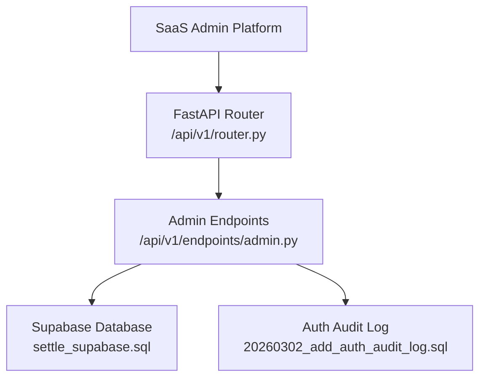
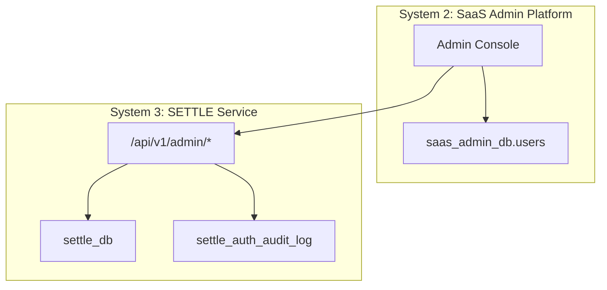
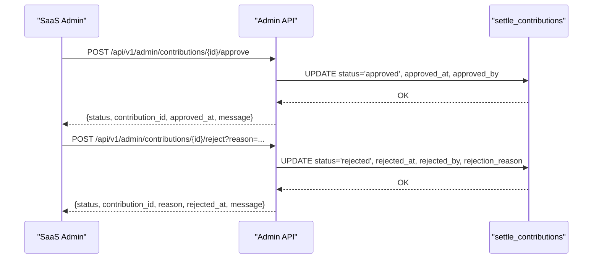
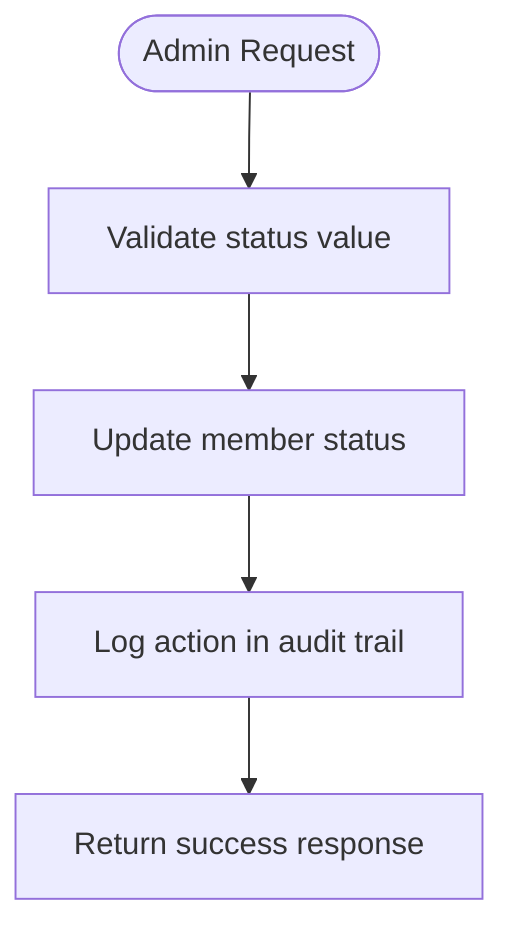
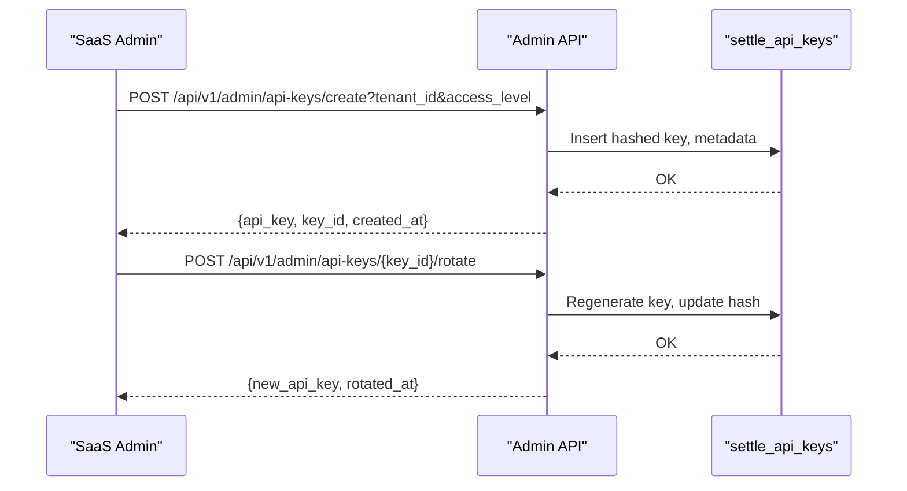
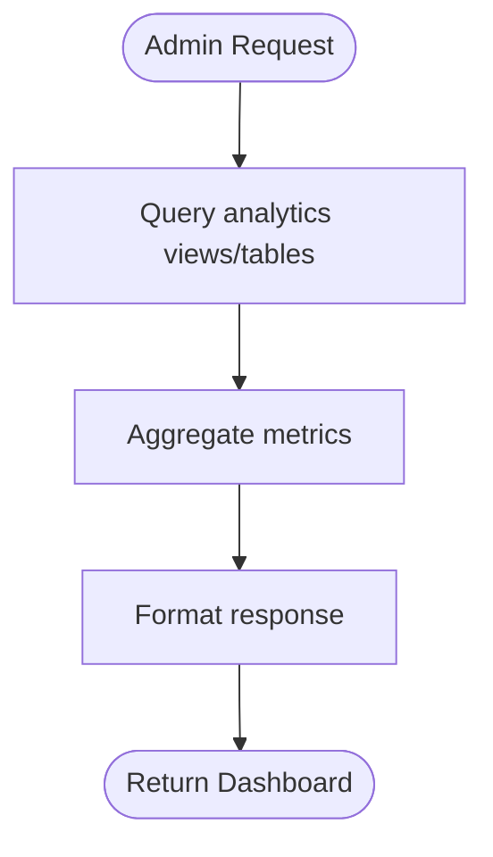
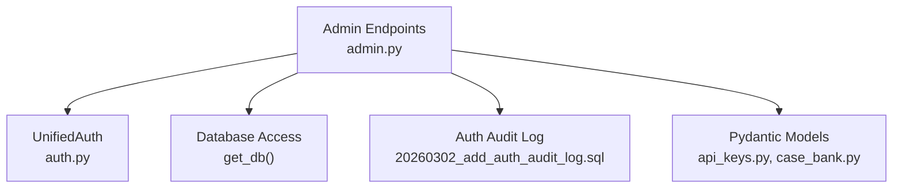
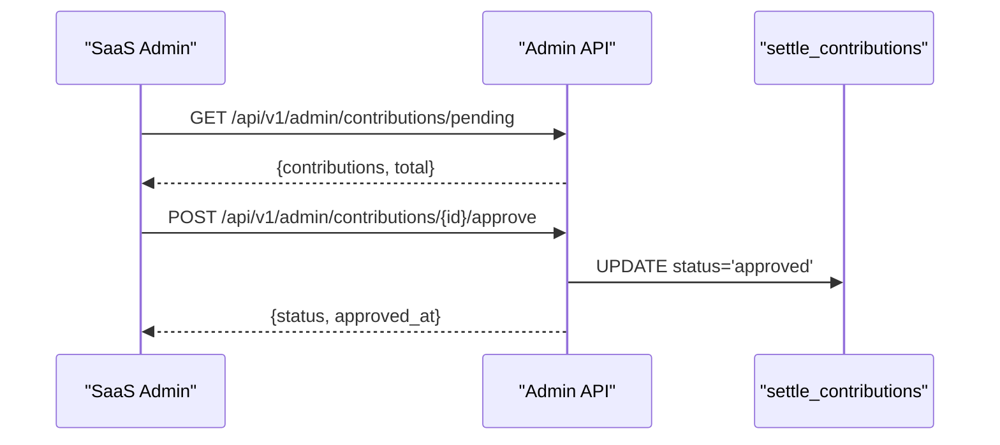
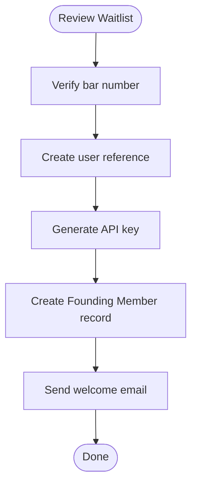

# Administrative API

<cite>
**Referenced Files in This Document**
- [admin.py](file://app/api/v1/endpoints/admin.py)
- [router.py](file://app/api/v1/router.py)
- [SAAS_ADMIN_API_CONTRACT.md](file://docs/integration/SAAS_ADMIN_API_CONTRACT.md)
- [SETTLE_ADMIN_ARCHITECTURE.md](file://docs/architecture/SETTLE_ADMIN_ARCHITECTURE.md)
- [api_keys.py](file://app/models/api_keys.py)
- [case_bank.py](file://app/models/case_bank.py)
- [settle_supabase.sql](file://database/schemas/settle_supabase.sql)
- [20260302_add_auth_audit_log.sql](file://database/migrations/20260302_add_auth_audit_log.sql)
- [event_emitter.py](file://app/core/event_emitter.py)
- [auth.py](file://app/core/auth.py)
</cite>

## Table of Contents
1. [Introduction](#introduction)
2. [Project Structure](#project-structure)
3. [Core Components](#core-components)
4. [Architecture Overview](#architecture-overview)
5. [Detailed Component Analysis](#detailed-component-analysis)
6. [Dependency Analysis](#dependency-analysis)
7. [Performance Considerations](#performance-considerations)
8. [Troubleshooting Guide](#troubleshooting-guide)
9. [Conclusion](#conclusion)
10. [Appendices](#appendices)

## Introduction
This document provides comprehensive API documentation for the administrative endpoints used by the SaaS Admin platform. It covers endpoints under /api/v1/admin/ for managing contributions, Founding Members, API keys, and analytics. It also documents administrative workflows for approving/rejecting contributions, managing user access, and monitoring service health. The documentation includes request schemas, permission requirements, and audit trail functionality, along with integration patterns to TrueVow’s SaaS Admin platform and enterprise management systems.

## Project Structure
The administrative API is implemented as part of the FastAPI application and mounted under the /api/v1/admin/ route prefix. The router wires the admin module into the main API router.

**Diagram sources**
- [router.py:1-26](file://app/api/v1/router.py#L1-L26)
- [admin.py:1-25](file://app/api/v1/endpoints/admin.py#L1-L25)
- [settle_supabase.sql:1-200](file://database/schemas/settle_supabase.sql#L1-L200)
- [20260302_add_auth_audit_log.sql:1-37](file://database/migrations/20260302_add_auth_audit_log.sql#L1-L37)

**Section sources**
- [router.py:1-26](file://app/api/v1/router.py#L1-L26)

## Core Components
- Admin endpoints module: Implements contribution review, Founding Member management, API key lifecycle, and analytics dashboards.
- Authentication and authorization: Unified admin authentication supports both API key and JWT-based contexts.
- Data models: Pydantic models define request/response shapes for API keys and contributions.
- Database schema: Supabase schema defines tables and constraints for contributions, API keys, Founding Members, queries, reports, and waitlist.
- Audit logging: Auth audit log table captures administrative actions and permission checks.

**Section sources**
- [admin.py:1-756](file://app/api/v1/endpoints/admin.py#L1-L756)
- [auth.py:836-863](file://app/core/auth.py#L836-L863)
- [api_keys.py:1-147](file://app/models/api_keys.py#L1-L147)
- [case_bank.py:1-269](file://app/models/case_bank.py#L1-L269)
- [settle_supabase.sql:27-137](file://database/schemas/settle_supabase.sql#L27-L137)
- [20260302_add_auth_audit_log.sql:6-37](file://database/migrations/20260302_add_auth_audit_log.sql#L6-L37)

## Architecture Overview
The SaaS Admin platform manages the SETTLE Service through administrative endpoints. The architecture separates concerns across three systems: Tenant Applications, SaaS Admin Platform, and SETTLE Service. Administrative actions originate in SaaS Admin and call into the SETTLE Service’s /api/v1/admin/ endpoints.

**Diagram sources**
- [SETTLE_ADMIN_ARCHITECTURE.md:48-138](file://docs/architecture/SETTLE_ADMIN_ARCHITECTURE.md#L48-L138)
- [admin.py:1-25](file://app/api/v1/endpoints/admin.py#L1-L25)
- [settle_supabase.sql:27-137](file://database/schemas/settle_supabase.sql#L27-L137)
- [20260302_add_auth_audit_log.sql:6-37](file://database/migrations/20260302_add_auth_audit_log.sql#L6-L37)

## Detailed Component Analysis

### Contribution Management Endpoints
Administrative endpoints for reviewing and acting on contributions.

- GET /api/v1/admin/contributions/pending
  - Pagination parameters: limit (default 50, max 100), offset (default 0)
  - Returns: contributions list, total count, and pagination metadata
  - Requires: unified admin authentication
  - Notes: Uses database queries against settle_contributions with status = 'pending'

- GET /api/v1/admin/contributions/{contribution_id}
  - Returns: full contribution details including jurisdiction, case_type, financial data, outcome, contributor info, compliance fields, and flags
  - Requires: unified admin authentication

- POST /api/v1/admin/contributions/{contribution_id}/approve
  - Updates status to 'approved', sets approved_at and approved_by
  - Requires: unified admin authentication
  - Notes: Logs approval action in audit trail

- POST /api/v1/admin/contributions/{contribution_id}/reject?reason={string}
  - Updates status to 'rejected', sets rejected_at, rejected_by, and rejection_reason
  - Requires: unified admin authentication
  - Notes: Logs rejection action in audit trail

**Diagram sources**
- [admin.py:146-272](file://app/api/v1/endpoints/admin.py#L146-L272)
- [settle_supabase.sql:31-113](file://database/schemas/settle_supabase.sql#L31-L113)

**Section sources**
- [admin.py:31-144](file://app/api/v1/endpoints/admin.py#L31-L144)
- [admin.py:146-272](file://app/api/v1/endpoints/admin.py#L146-L272)
- [case_bank.py:15-63](file://app/models/case_bank.py#L15-L63)

### Founding Member Management Endpoints
Endpoints for Founding Member program administration.

- GET /api/v1/admin/founding-members
  - Query parameters: status (active, inactive, suspended), limit (default 100, max 500), offset (default 0)
  - Returns: members list, total count, and max_members (2100)
  - Requires: unified admin authentication
  - Notes: Currently returns empty lists pending implementation

- GET /api/v1/admin/founding-members/{member_id}
  - Returns: member details and contribution history
  - Requires: unified admin authentication
  - Notes: Not yet implemented (501)

- POST /api/v1/admin/founding-members/{member_id}/status?status={string}&reason={string}
  - Updates member status to active, inactive, or suspended
  - Requires: unified admin authentication
  - Notes: Not yet implemented (501)

- GET /api/v1/admin/founding-members/contributions?month={string}
  - Returns monthly contribution tracking across members
  - Requires: unified admin authentication
  - Notes: Not yet implemented (501)

**Diagram sources**
- [admin.py:344-384](file://app/api/v1/endpoints/admin.py#L344-L384)
- [settle_supabase.sql:203-236](file://database/schemas/settle_supabase.sql#L203-L236)

**Section sources**
- [admin.py:278-418](file://app/api/v1/endpoints/admin.py#L278-L418)
- [settle_supabase.sql:203-236](file://database/schemas/settle_supabase.sql#L203-L236)

### API Key Management Endpoints
Endpoints for managing SETTLE API keys.

- POST /api/v1/admin/api-keys/create?tenant_id={uuid}&access_level={string}
  - Creates a new API key for a tenant with specified access level
  - Returns: tenant_id, api_key (displayed once), key_id, access_level, created_at
  - Requires: unified admin authentication
  - Notes: Not yet implemented (501)

- GET /api/v1/admin/api-keys/{tenant_id}
  - Retrieves a tenant's API key for administrative reference
  - Requires: unified admin authentication
  - Notes: Not yet implemented (501)

- POST /api/v1/admin/api-keys/{key_id}/rotate
  - Rotates (regenerates) an API key
  - Returns: key_id, new_api_key, rotated_at
  - Requires: unified admin authentication
  - Notes: Not yet implemented (501)

- DELETE /api/v1/admin/api-keys/{key_id}
  - Revokes (deletes) an API key
  - Returns: key_id, status, revoked_at
  - Requires: unified admin authentication
  - Notes: Not yet implemented (501)

**Diagram sources**
- [admin.py:425-550](file://app/api/v1/endpoints/admin.py#L425-L550)
- [settle_supabase.sql:142-182](file://database/schemas/settle_supabase.sql#L142-L182)
- [api_keys.py:11-76](file://app/models/api_keys.py#L11-L76)

**Section sources**
- [admin.py:425-550](file://app/api/v1/endpoints/admin.py#L425-L550)
- [api_keys.py:11-76](file://app/models/api_keys.py#L11-L76)
- [settle_supabase.sql:142-182](file://database/schemas/settle_supabase.sql#L142-L182)

### Analytics and Reporting Endpoints
Administrative dashboards and analytics.

- GET /api/v1/admin/analytics/dashboard
  - Returns: founding_members totals, contribution stats, query/report volumes, database coverage
  - Requires: unified admin authentication
  - Notes: Not yet implemented (501)

- GET /api/v1/admin/analytics/usage?start_date={string}&end_date={string}
  - Returns: usage metrics across periods
  - Requires: unified admin authentication
  - Notes: Not yet implemented (501)

- GET /api/v1/admin/analytics/contributions
  - Returns: contribution statistics and data gaps
  - Requires: unified admin authentication
  - Notes: Not yet implemented (501)

- GET /api/v1/admin/analytics/compliance
  - Returns: compliance metrics including PII detections and anonymization verification
  - Requires: unified admin authentication
  - Notes: Not yet implemented (501)

- GET /api/v1/admin/analytics/data-quality
  - Returns: data quality metrics including outliers and confidence scores
  - Requires: unified admin authentication
  - Notes: Not yet implemented (501)

**Diagram sources**
- [admin.py:556-736](file://app/api/v1/endpoints/admin.py#L556-L736)
- [settle_supabase.sql:357-379](file://database/schemas/settle_supabase.sql#L357-L379)

**Section sources**
- [admin.py:556-736](file://app/api/v1/endpoints/admin.py#L556-L736)

### Health Check Endpoint
- GET /api/v1/admin/health
  - Returns service status and list of operational endpoints
  - No authentication required

**Section sources**
- [admin.py:738-754](file://app/api/v1/endpoints/admin.py#L738-L754)

## Dependency Analysis
Administrative endpoints depend on unified authentication, database access, and audit logging.

**Diagram sources**
- [admin.py:20-24](file://app/api/v1/endpoints/admin.py#L20-L24)
- [auth.py:836-863](file://app/core/auth.py#L836-L863)
- [20260302_add_auth_audit_log.sql:6-37](file://database/migrations/20260302_add_auth_audit_log.sql#L6-L37)
- [api_keys.py:1-147](file://app/models/api_keys.py#L1-L147)
- [case_bank.py:1-269](file://app/models/case_bank.py#L1-L269)

**Section sources**
- [admin.py:20-24](file://app/api/v1/endpoints/admin.py#L20-L24)
- [auth.py:836-863](file://app/core/auth.py#L836-L863)
- [20260302_add_auth_audit_log.sql:6-37](file://database/migrations/20260302_add_auth_audit_log.sql#L6-L37)

## Performance Considerations
- Pagination: Use limit and offset parameters to control payload sizes for listing endpoints.
- Indexes: Database tables include indexes optimized for common queries (e.g., jurisdiction, case_type, status).
- Asynchronous operations: Endpoints use async database access; ensure database connection pooling is configured appropriately.
- Audit logging overhead: Auth audit log writes are enabled; monitor write throughput during high-volume admin operations.

[No sources needed since this section provides general guidance]

## Troubleshooting Guide
- Authentication failures: Ensure requests include a valid admin API key in the Authorization header.
- Database unavailability: Some endpoints return 503 when the database is unavailable; retry after service restoration.
- Not implemented errors: Several endpoints currently return 501; implement backend logic or adjust expectations accordingly.
- Audit trail verification: Confirm auth audit log entries are being written for administrative actions.

**Section sources**
- [admin.py:89-94](file://app/api/v1/endpoints/admin.py#L89-L94)
- [admin.py:333](file://app/api/v1/endpoints/admin.py#L333)
- [admin.py:481](file://app/api/v1/endpoints/admin.py#L481)
- [admin.py:507](file://app/api/v1/endpoints/admin.py#L507)
- [admin.py:537](file://app/api/v1/endpoints/admin.py#L537)
- [20260302_add_auth_audit_log.sql:6-37](file://database/migrations/20260302_add_auth_audit_log.sql#L6-L37)

## Conclusion
The administrative API provides a comprehensive interface for SaaS Admin platform to manage contributions, Founding Members, API keys, and analytics. While several endpoints are placeholders awaiting backend implementation, the documented schemas and workflows enable integration planning and development. Unified authentication and audit logging ensure secure and traceable administrative operations.

[No sources needed since this section summarizes without analyzing specific files]

## Appendices

### Administrative Workflows

#### Approve/Reject Contributions
- Admin reviews pending contributions via the dashboard.
- Admin selects approve or reject with a reason.
- Backend updates contribution status and logs the action.

**Diagram sources**
- [admin.py:31-94](file://app/api/v1/endpoints/admin.py#L31-L94)
- [admin.py:146-197](file://app/api/v1/endpoints/admin.py#L146-L197)

#### Founding Member Enrollment
- Admin reviews waitlist entries and enrolls qualifying attorneys.
- Backend creates user reference, generates API key, and records Founding Member status.

**Diagram sources**
- [SETTLE_ADMIN_ARCHITECTURE.md:430-515](file://docs/architecture/SETTLE_ADMIN_ARCHITECTURE.md#L430-L515)

### Integration Patterns with SaaS Admin and Enterprise Systems
- Cross-database operations: Administrative actions may require calling SETTLE Service APIs from SaaS Admin due to separate databases.
- Event emission: SETTLE Service emits behavioral events to SaaS Admin for analytics and reporting.
- Audit logging: Auth audit log captures administrative actions for compliance and monitoring.

**Section sources**
- [SETTLE_ADMIN_ARCHITECTURE.md:613-646](file://docs/architecture/SETTLE_ADMIN_ARCHITECTURE.md#L613-L646)
- [event_emitter.py:1-88](file://app/core/event_emitter.py#L1-L88)
- [20260302_add_auth_audit_log.sql:6-37](file://database/migrations/20260302_add_auth_audit_log.sql#L6-L37)

### Request/Response Schemas

#### Contribution Approval
- Request: POST /api/v1/admin/contributions/{contribution_id}/approve
- Response: {status, contribution_id, approved_at, message}

#### Contribution Rejection
- Request: POST /api/v1/admin/contributions/{contribution_id}/reject?reason={string}
- Response: {status, contribution_id, reason, rejected_at, message}

#### API Key Creation
- Request: POST /api/v1/admin/api-keys/create?tenant_id={uuid}&access_level={string}
- Response: {tenant_id, api_key, key_id, access_level, created_at}

#### API Key Rotation
- Request: POST /api/v1/admin/api-keys/{key_id}/rotate
- Response: {key_id, new_api_key, rotated_at}

#### API Key Revocation
- Request: DELETE /api/v1/admin/api-keys/{key_id}
- Response: {key_id, status, revoked_at}

**Section sources**
- [admin.py:146-272](file://app/api/v1/endpoints/admin.py#L146-L272)
- [admin.py:425-550](file://app/api/v1/endpoints/admin.py#L425-L550)
- [api_keys.py:62-76](file://app/models/api_keys.py#L62-L76)

### Permission Requirements
- Admin access: require_unified_admin dependency ensures only authorized administrators can access admin endpoints.
- Roles and scopes: UnifiedAuth supports roles (admin) and scopes (tenant, internal) for flexible authorization.

**Section sources**
- [auth.py:836-863](file://app/core/auth.py#L836-L863)
- [admin.py:35](file://app/api/v1/endpoints/admin.py#L35)
- [admin.py:100](file://app/api/v1/endpoints/admin.py#L100)
- [admin.py:212](file://app/api/v1/endpoints/admin.py#L212)
- [admin.py:495](file://app/api/v1/endpoints/admin.py#L495)
- [admin.py:525](file://app/api/v1/endpoints/admin.py#L525)

### Audit Trail Functionality
- Auth audit log table: Captures request_id, event_type, endpoint, method, IP, user agent, auth method, scope, permission checked, response status, and details.
- Row-level security: Policies restrict access to service_role.
- Integration: Administrative actions trigger audit log entries for compliance and monitoring.

**Section sources**
- [20260302_add_auth_audit_log.sql:6-37](file://database/migrations/20260302_add_auth_audit_log.sql#L6-L37)