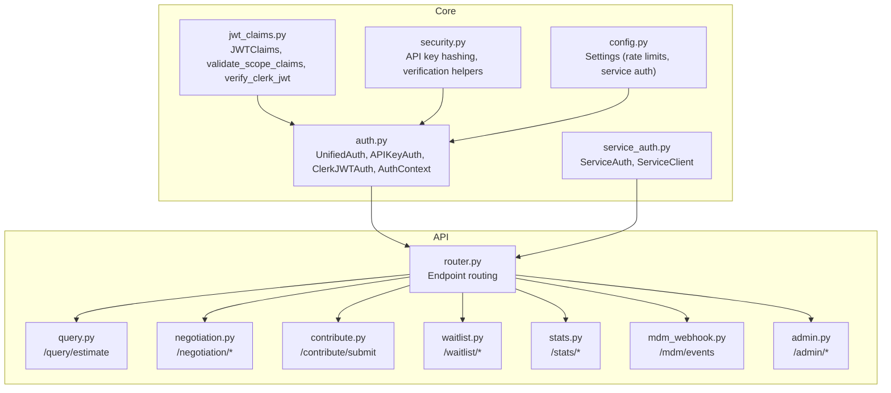
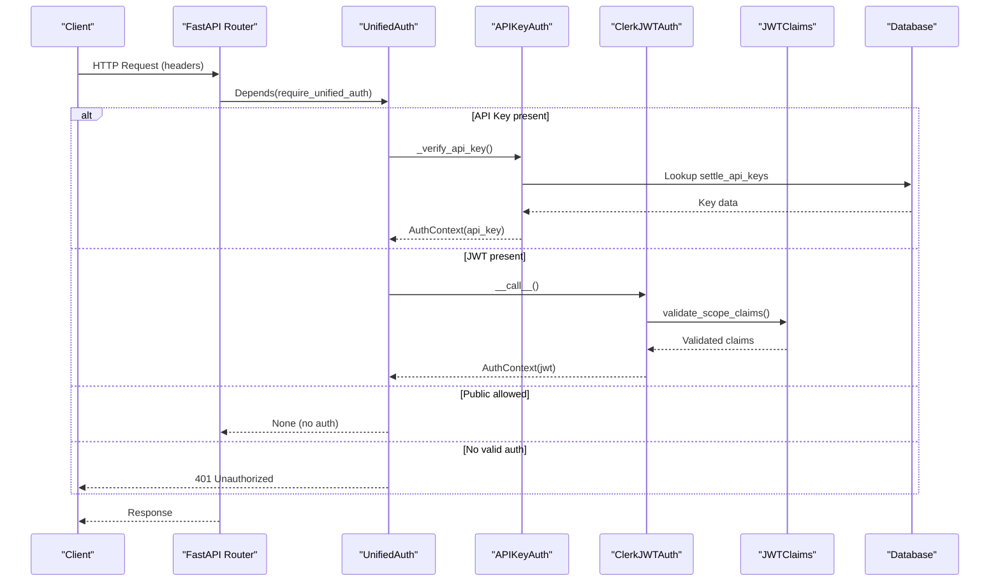
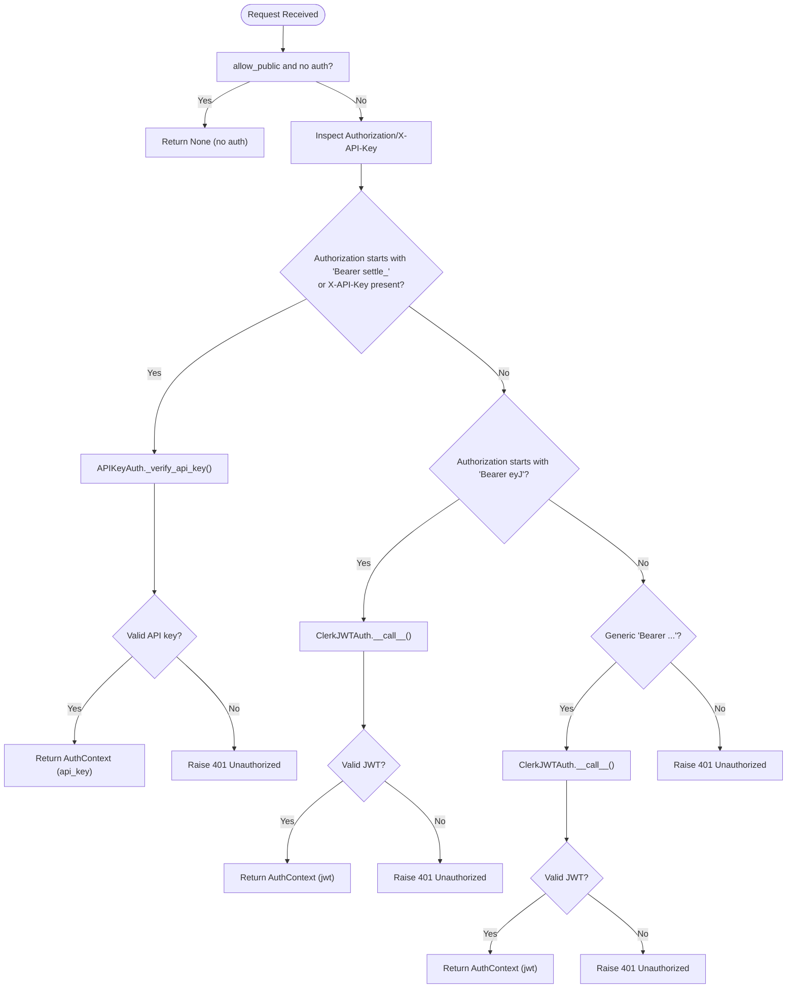
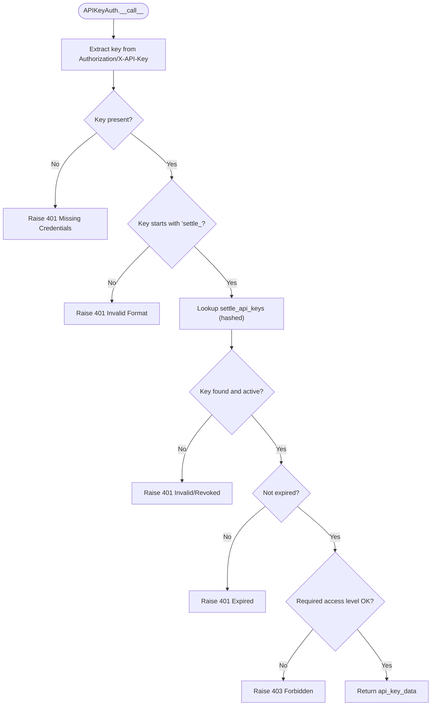
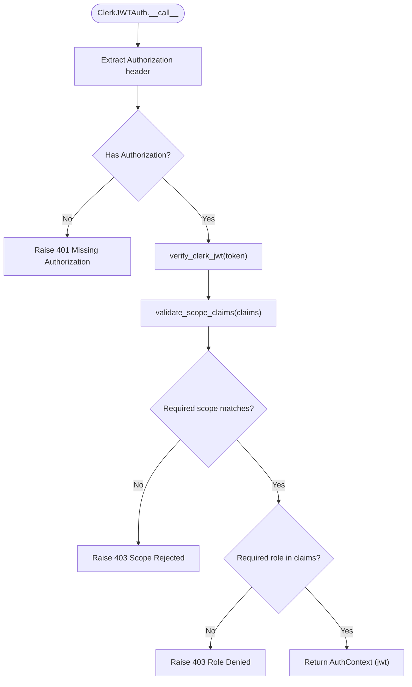
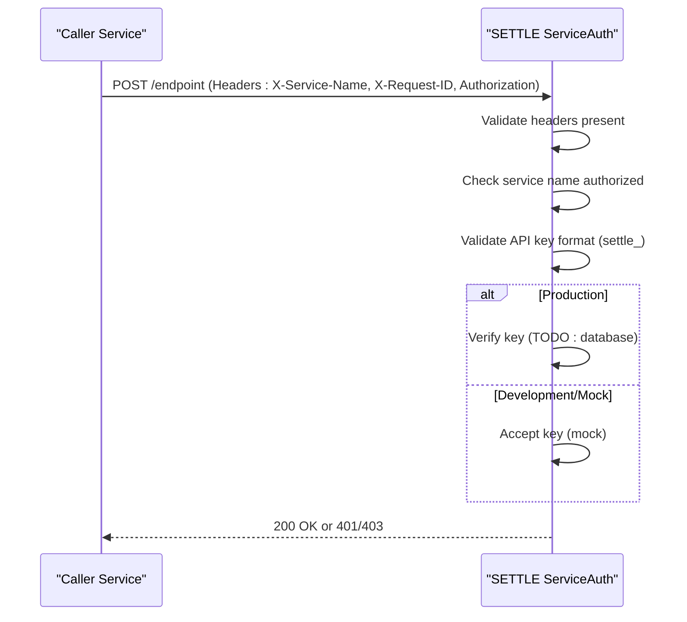
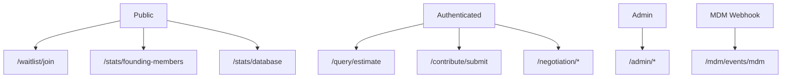
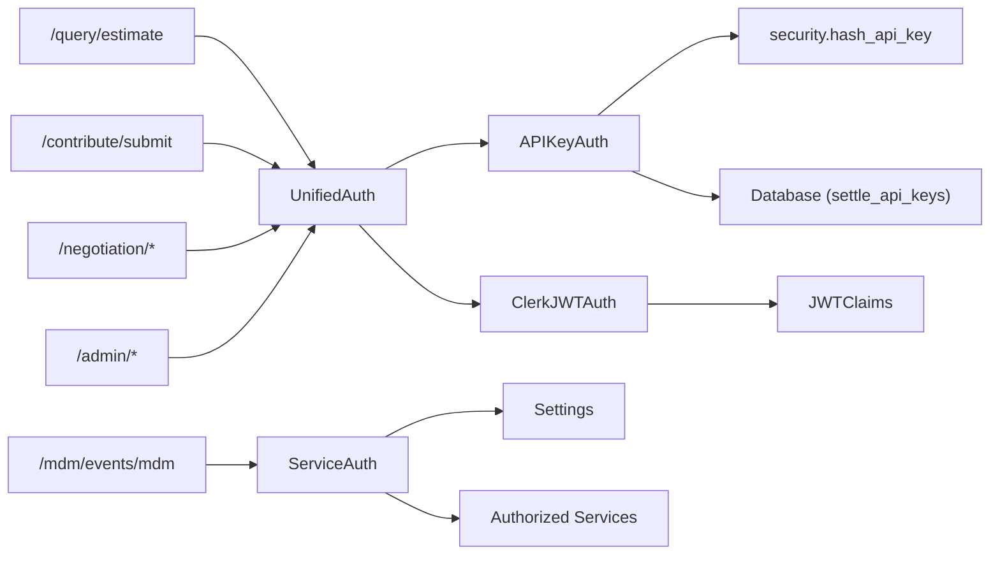

# Authentication Requirements

<cite>
**Referenced Files in This Document**
- [auth.py](file://app/core/auth.py)
- [jwt_claims.py](file://app/core/jwt_claims.py)
- [security.py](file://app/core/security.py)
- [service_auth.py](file://app/core/service_auth.py)
- [config.py](file://app/core/config.py)
- [router.py](file://app/api/v1/router.py)
- [query.py](file://app/api/v1/endpoints/query.py)
- [contribute.py](file://app/api/v1/endpoints/contribute.py)
- [waitlist.py](file://app/api/v1/endpoints/waitlist.py)
- [stats.py](file://app/api/v1/endpoints/stats.py)
- [negotiation.py](file://app/api/v1/endpoints/negotiation.py)
- [mdm_webhook.py](file://app/api/v1/endpoints/mdm_webhook.py)
- [admin.py](file://app/api/v1/endpoints/admin.py)
- [api_keys.py](file://app/models/api_keys.py)
- [service_registry.py](file://app/core/service_registry.py)
</cite>

## Table of Contents
1. [Introduction](#introduction)
2. [Project Structure](#project-structure)
3. [Core Components](#core-components)
4. [Architecture Overview](#architecture-overview)
5. [Detailed Component Analysis](#detailed-component-analysis)
6. [Dependency Analysis](#dependency-analysis)
7. [Performance Considerations](#performance-considerations)
8. [Troubleshooting Guide](#troubleshooting-guide)
9. [Conclusion](#conclusion)
10. [Appendices](#appendices)

## Introduction
This document defines the authentication requirements for the SETTLE Service API. It covers the dual authentication system supporting:
- API Key (legacy, still widely used)
- Clerk JWT (modern, used by TrueVow services and customer portal)

It explains:
- Header requirements and token formats
- Security claims and scopes
- Endpoint categorization (public vs. authenticated)
- Error responses for invalid credentials
- Integration patterns with TrueVow service registry
- Rate limiting and access control mechanisms

## Project Structure
The authentication system spans core modules and endpoint routers:
- Core authentication: UnifiedAuth, APIKeyAuth, ClerkJWTAuth, AuthContext
- JWT claims and validation: JWTClaims, validate_scope_claims, verify_clerk_jwt
- Security utilities: API key hashing, verification helpers
- Service-to-service authentication: ServiceAuth, ServiceClient
- Configuration: Settings for auth modes, rate limits, service integration
- Endpoint grouping: Public endpoints (no auth), authenticated endpoints (API key or JWT), admin endpoints (admin-only), MDM webhook (X-API-Key)

**Diagram sources**
- [auth.py:1-867](file://app/core/auth.py#L1-L867)
- [jwt_claims.py:1-327](file://app/core/jwt_claims.py#L1-L327)
- [security.py:1-208](file://app/core/security.py#L1-L208)
- [service_auth.py:1-376](file://app/core/service_auth.py#L1-L376)
- [config.py:1-351](file://app/core/config.py#L1-L351)
- [router.py:1-26](file://app/api/v1/router.py#L1-L26)

**Section sources**
- [router.py:1-26](file://app/api/v1/router.py#L1-L26)

## Core Components
- UnifiedAuth: Accepts either API Key or Clerk JWT. Supports optional allow_public for public endpoints.
- APIKeyAuth: Validates legacy API keys, checks format, expiry, revocation, and access level.
- ClerkJWTAuth: Validates Clerk JWTs, enforces scope and role checks.
- AuthContext: Unified representation of authenticated identity across both methods.
- JWTClaims: Pydantic model for JWT claims with scope validation.
- ServiceAuth: Validates service-to-service requests with X-Service-Name, X-Request-ID, and Authorization.
- ServiceClient: Outgoing client for service-to-service calls with standardized headers.
- Settings: Centralized configuration for auth modes, rate limits, and service integration.

**Section sources**
- [auth.py:340-485](file://app/core/auth.py#L340-L485)
- [auth.py:487-796](file://app/core/auth.py#L487-L796)
- [jwt_claims.py:41-91](file://app/core/jwt_claims.py#L41-L91)
- [jwt_claims.py:97-223](file://app/core/jwt_claims.py#L97-L223)
- [service_auth.py:20-181](file://app/core/service_auth.py#L20-L181)
- [config.py:196-247](file://app/core/config.py#L196-L247)

## Architecture Overview
The dual authentication system routes requests through UnifiedAuth, which:
- Detects API Key (Bearer settle_xxx) or X-API-Key
- Detects Clerk JWT (Bearer eyJ...) or generic Bearer (default to JWT)
- Falls back to allow_public when configured
- Enforces scope and role checks for JWT
- Logs all auth events to audit trail

**Diagram sources**
- [auth.py:370-485](file://app/core/auth.py#L370-L485)
- [auth.py:487-796](file://app/core/auth.py#L487-L796)
- [jwt_claims.py:97-223](file://app/core/jwt_claims.py#L97-L223)

## Detailed Component Analysis

### Unified Authentication Flow
- Determines auth method by header inspection:
  - Authorization starts with "Bearer settle_" → API Key
  - X-API-Key header present → API Key
  - Authorization starts with "Bearer eyJ" → Clerk JWT
  - Generic "Bearer ..." → Clerk JWT
  - allow_public=True with no auth → no auth required
- On success, returns AuthContext with auth_method, user_id, tenant_id, access_level, scope, and raw data for audit.

**Diagram sources**
- [auth.py:370-485](file://app/core/auth.py#L370-L485)

**Section sources**
- [auth.py:340-485](file://app/core/auth.py#L340-L485)

### API Key Authentication
- Header formats:
  - Authorization: Bearer settle_xxx
  - X-API-Key: settle_xxx
- Validation steps:
  - Presence and format (must start with "settle_")
  - Database lookup via hashed key
  - Expiry and revocation checks
  - Access level enforcement (admin, founding_member, standard, premium, external)
- Audit logging on success/failure.

**Diagram sources**
- [auth.py:513-627](file://app/core/auth.py#L513-L627)
- [security.py:39-66](file://app/core/security.py#L39-L66)

**Section sources**
- [auth.py:487-796](file://app/core/auth.py#L487-L796)
- [security.py:39-66](file://app/core/security.py#L39-L66)

### Clerk JWT Authentication
- Header format:
  - Authorization: Bearer eyJ...
- Validation:
  - Scope enforcement ("internal" or "tenant")
  - Role enforcement (e.g., admin, billing_admin, member, director, manager)
  - Claims validation (iss, sub, email, scope, and scope-specific fields)
- Audit logging on success/failure.

**Diagram sources**
- [auth.py:190-334](file://app/core/auth.py#L190-L334)
- [jwt_claims.py:97-223](file://app/core/jwt_claims.py#L97-L223)

**Section sources**
- [auth.py:165-334](file://app/core/auth.py#L165-L334)
- [jwt_claims.py:97-223](file://app/core/jwt_claims.py#L97-L223)

### Service-to-Service Authentication
- Headers required:
  - X-Service-Name: Calling service name (must be in authorized list)
  - X-Request-ID: UUID
  - Authorization: Bearer settle_xxx
- Optional service filtering via constructor argument.
- Development bypass via settings flags.

**Diagram sources**
- [service_auth.py:53-181](file://app/core/service_auth.py#L53-L181)

**Section sources**
- [service_auth.py:20-181](file://app/core/service_auth.py#L20-L181)

### Endpoint Groups and Authentication Requirements
- Public endpoints (no auth required):
  - /api/v1/waitlist/join
  - /api/v1/stats/founding-members
  - /api/v1/stats/database
- Authenticated endpoints (API key or JWT):
  - /api/v1/query/estimate
  - /api/v1/contribute/submit
  - /api/v1/negotiation/*
- Admin endpoints (admin-only):
  - /api/v1/admin/*
- MDM webhook (X-API-Key):
  - /api/v1/mdm/events/mdm

**Diagram sources**
- [router.py:10-24](file://app/api/v1/router.py#L10-L24)
- [waitlist.py:62-126](file://app/api/v1/endpoints/waitlist.py#L62-L126)
- [stats.py:41-182](file://app/api/v1/endpoints/stats.py#L41-L182)
- [query.py:20-108](file://app/api/v1/endpoints/query.py#L20-L108)
- [contribute.py:51-135](file://app/api/v1/endpoints/contribute.py#L51-L135)
- [negotiation.py:87-247](file://app/api/v1/endpoints/negotiation.py#L87-L247)
- [admin.py:31-95](file://app/api/v1/endpoints/admin.py#L31-L95)
- [mdm_webhook.py:73-114](file://app/api/v1/endpoints/mdm_webhook.py#L73-L114)

**Section sources**
- [router.py:10-24](file://app/api/v1/router.py#L10-L24)
- [waitlist.py:62-126](file://app/api/v1/endpoints/waitlist.py#L62-L126)
- [stats.py:41-182](file://app/api/v1/endpoints/stats.py#L41-L182)
- [query.py:20-108](file://app/api/v1/endpoints/query.py#L20-L108)
- [contribute.py:51-135](file://app/api/v1/endpoints/contribute.py#L51-L135)
- [negotiation.py:87-247](file://app/api/v1/endpoints/negotiation.py#L87-L247)
- [admin.py:31-95](file://app/api/v1/endpoints/admin.py#L31-L95)
- [mdm_webhook.py:73-114](file://app/api/v1/endpoints/mdm_webhook.py#L73-L114)

### Header Requirements and Token Formats
- API Key:
  - Authorization: Bearer settle_xxx
  - X-API-Key: settle_xxx
  - Format: must start with "settle_"
- Clerk JWT:
  - Authorization: Bearer eyJ... (Clerk JWT)
  - Scope: "internal" or "tenant"
  - Roles: scope-specific (e.g., admin, billing_admin, member; internal roles include director, manager, etc.)
- Service-to-Service:
  - X-Service-Name: service name (must be authorized)
  - X-Request-ID: UUID
  - Authorization: Bearer settle_xxx
- MDM Webhook:
  - X-API-Key: service key (configured in settings)

**Section sources**
- [auth.py:370-485](file://app/core/auth.py#L370-L485)
- [jwt_claims.py:41-91](file://app/core/jwt_claims.py#L41-L91)
- [service_auth.py:53-181](file://app/core/service_auth.py#L53-L181)
- [mdm_webhook.py:76-89](file://app/api/v1/endpoints/mdm_webhook.py#L76-L89)

### Security Claims and Scopes
- JWTClaims supports:
  - scope: "internal" or "tenant"
  - tenant scope: tenant_id, tenant_role
  - internal scope: internal_role, optional internal_function
  - Standard claims: sub, email, iat, exp
- validate_scope_claims enforces:
  - Presence of scope
  - Internal JWT must include internal_role and exclude tenant_id
  - Tenant JWT must include tenant_id and tenant_role and exclude internal_role

**Section sources**
- [jwt_claims.py:41-91](file://app/core/jwt_claims.py#L41-L91)
- [jwt_claims.py:97-223](file://app/core/jwt_claims.py#L97-L223)

### Error Responses for Invalid Credentials
- 401 Unauthorized:
  - Missing Authorization header for JWT
  - Missing API key or invalid format
  - Invalid/expired/revoked API key
  - Invalid JWT signature or claims
- 403 Forbidden:
  - Scope mismatch (required scope does not match JWT scope)
  - Role mismatch (required role not present)
  - Insufficient permissions for admin endpoints
- 400 Bad Request:
  - Missing X-Service-Name or X-Request-ID for service-to-service
  - Missing X-API-Key for MDM webhook
- 429 Too Many Requests:
  - Rate limit exceeded (when enabled)

**Section sources**
- [auth.py:208-334](file://app/core/auth.py#L208-L334)
- [auth.py:545-627](file://app/core/auth.py#L545-L627)
- [service_auth.py:86-139](file://app/core/service_auth.py#L86-L139)
- [mdm_webhook.py:86-100](file://app/api/v1/endpoints/mdm_webhook.py#L86-L100)
- [security.py:160-195](file://app/core/security.py#L160-L195)

### Integration Patterns with TrueVow Service Registry
- Service registration and heartbeat:
  - ServiceRegistryClient registers SETTLE with the registry and maintains heartbeat
  - HeartbeatTask runs periodically to keep service alive
- Service discovery and integration contracts:
  - Discover modules and services by event
  - Register integration contracts between services
- Service-to-service clients:
  - ServiceClient automatically adds X-Service-Name, X-Request-ID, X-Request-Timestamp, and Authorization headers
  - Used to call other TrueVow services (platform, internal ops, sales, support, tenant)

**Section sources**
- [service_registry.py:47-244](file://app/core/service_registry.py#L47-L244)
- [service_registry.py:246-355](file://app/core/service_registry.py#L246-L355)
- [service_auth.py:183-376](file://app/core/service_auth.py#L183-L376)

### Rate Limiting Policies and Access Control
- Rate limiting:
  - Enabled via settings.RATE_LIMIT_ENABLED
  - Founding Members have unlimited access (bypasses limits)
  - Requests limit enforced per API key
- Access levels:
  - API key access levels: founding_member, standard, premium, admin, external
  - Admin-only endpoints require admin access level
  - Founding Member endpoints require founding_member or admin access level
- Configuration:
  - settings.RATE_LIMIT_PER_MINUTE controls requests per minute
  - settings.FOUNDING_MEMBER_UNLIMITED_ACCESS enables unlimited access for founding members

**Section sources**
- [config.py:196-247](file://app/core/config.py#L196-L247)
- [security.py:160-195](file://app/core/security.py#L160-L195)
- [api_keys.py:11-40](file://app/models/api_keys.py#L11-L40)
- [auth.py:732-796](file://app/core/auth.py#L732-L796)

## Dependency Analysis
- UnifiedAuth depends on:
  - APIKeyAuth for API key validation
  - ClerkJWTAuth for JWT validation
  - AuthContext for unified identity
- APIKeyAuth depends on:
  - security.hash_api_key for key hashing
  - database lookup for settle_api_keys
- ClerkJWTAuth depends on:
  - jwt_claims.validate_scope_claims for claims validation
  - jwt_claims.verify_clerk_jwt for signature verification
- ServiceAuth depends on:
  - settings for service auth configuration
  - authorized service list for validation
- Endpoints depend on:
  - require_unified_auth for authenticated endpoints
  - require_admin for admin endpoints
  - APIKeyAuth for admin-only endpoints

**Diagram sources**
- [auth.py:340-485](file://app/core/auth.py#L340-L485)
- [auth.py:487-796](file://app/core/auth.py#L487-L796)
- [jwt_claims.py:97-223](file://app/core/jwt_claims.py#L97-L223)
- [service_auth.py:53-181](file://app/core/service_auth.py#L53-L181)

**Section sources**
- [auth.py:340-485](file://app/core/auth.py#L340-L485)
- [auth.py:487-796](file://app/core/auth.py#L487-L796)
- [jwt_claims.py:97-223](file://app/core/jwt_claims.py#L97-L223)
- [service_auth.py:53-181](file://app/core/service_auth.py#L53-L181)

## Performance Considerations
- API key verification performs a database lookup; consider caching hashed keys and last_used_at updates as fire-and-forget tasks to minimize latency.
- JWT verification is currently a placeholder; implement Clerk JWKS-based signature verification to avoid repeated network calls.
- Rate limiting is configurable; enable only when needed to reduce overhead.
- Service-to-service calls use timeouts; ensure downstream services are resilient to delays.

[No sources needed since this section provides general guidance]

## Troubleshooting Guide
- 401 Unauthorized:
  - Ensure Authorization header is present and correctly formatted (Bearer settle_xxx or Bearer eyJ...).
  - For API keys, confirm the key starts with "settle_" and is not expired or revoked.
  - For JWT, verify the token is signed by Clerk and contains valid scope and roles.
- 403 Forbidden:
  - Check required scope and role for the endpoint.
  - Verify tenant/internal roles align with endpoint requirements.
- 400 Bad Request:
  - For service-to-service, ensure X-Service-Name and X-Request-ID are provided.
  - For MDM webhook, ensure X-API-Key matches the configured service key.
- 429 Too Many Requests:
  - Check your API key's requests_limit and whether you qualify for unlimited access as a Founding Member.

**Section sources**
- [auth.py:208-334](file://app/core/auth.py#L208-L334)
- [auth.py:545-627](file://app/core/auth.py#L545-L627)
- [service_auth.py:86-139](file://app/core/service_auth.py#L86-L139)
- [mdm_webhook.py:86-100](file://app/api/v1/endpoints/mdm_webhook.py#L86-L100)
- [security.py:160-195](file://app/core/security.py#L160-L195)

## Conclusion
The SETTLE Service employs a robust dual authentication system:
- Legacy API keys for existing integrations
- Modern Clerk JWTs for TrueVow services and customer portal
- Strict scope and role enforcement
- Comprehensive audit logging
- Service-to-service authentication with standardized headers
- Configurable rate limiting and access control

This design ensures secure, auditable, and scalable API access across public, authenticated, and admin endpoints, while integrating seamlessly with the TrueVow service registry ecosystem.

[No sources needed since this section summarizes without analyzing specific files]

## Appendices

### Practical Authentication Examples
- API Key (Authorization header):
  - Authorization: Bearer settle_xxx
- API Key (X-API-Key header):
  - X-API-Key: settle_xxx
- Clerk JWT:
  - Authorization: Bearer eyJ... (Clerk JWT)
- Service-to-Service:
  - X-Service-Name: truevow-platform-service
  - X-Request-ID: <UUID>
  - Authorization: Bearer settle_xxx
- MDM Webhook:
  - X-API-Key: <service_key>

**Section sources**
- [auth.py:370-485](file://app/core/auth.py#L370-L485)
- [service_auth.py:53-181](file://app/core/service_auth.py#L53-L181)
- [mdm_webhook.py:76-89](file://app/api/v1/endpoints/mdm_webhook.py#L76-L89)