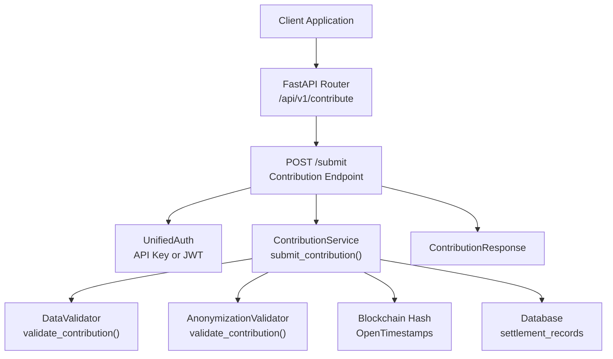
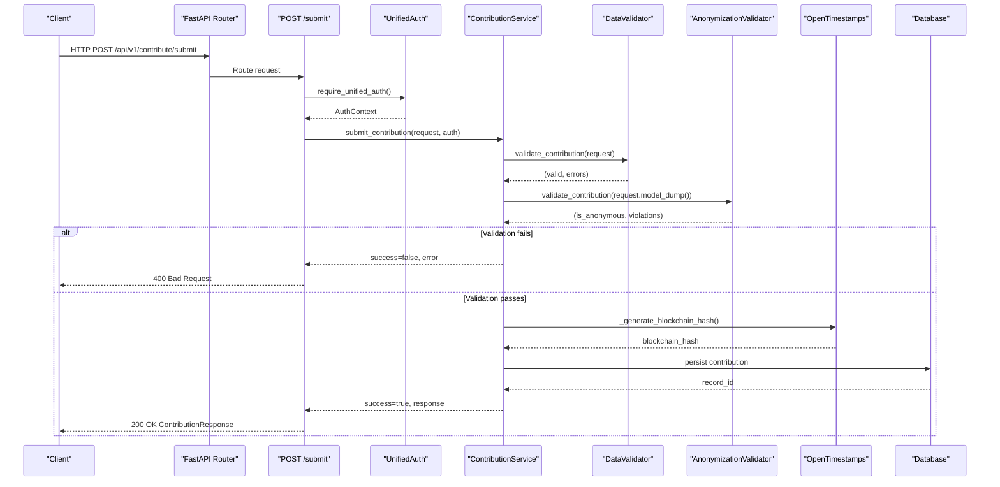
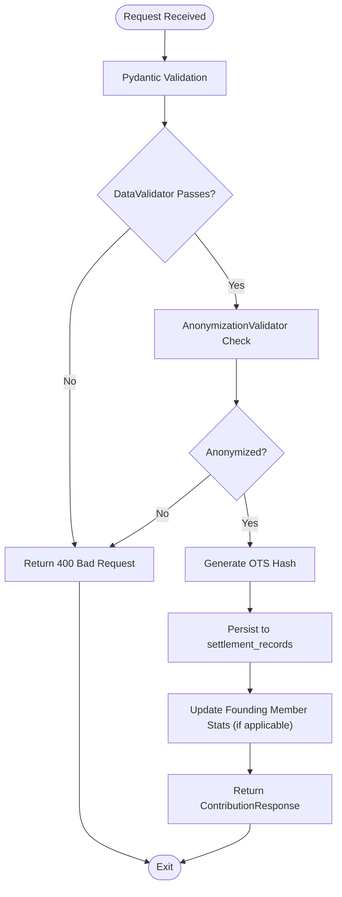
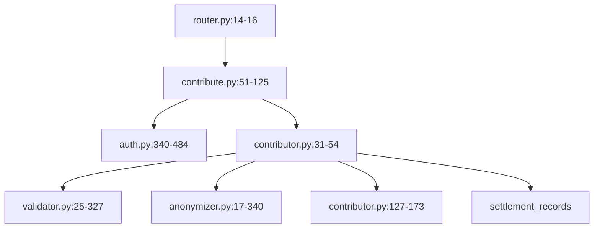

# Contribution Submission API

<cite>
**Referenced Files in This Document**
- [contribute.py](file://app/api/v1/endpoints/contribute.py)
- [router.py](file://app/api/v1/router.py)
- [auth.py](file://app/core/auth.py)
- [contributor.py](file://app/services/contributor.py)
- [contribution_service.py](file://app/services/contribution_service.py)
- [anonymizer.py](file://app/services/anonymizer.py)
- [validator.py](file://app/services/validator.py)
- [case_bank.py](file://app/models/case_bank.py)
- [ffd820027e8c_add_contribution_type_to_settlement_.py](file://alembic/versions/ffd820027e8c_add_contribution_type_to_settlement_.py)
</cite>

## Table of Contents
1. [Introduction](#introduction)
2. [Project Structure](#project-structure)
3. [Core Components](#core-components)
4. [Architecture Overview](#architecture-overview)
5. [Detailed Component Analysis](#detailed-component-analysis)
6. [Dependency Analysis](#dependency-analysis)
7. [Performance Considerations](#performance-considerations)
8. [Troubleshooting Guide](#troubleshooting-guide)
9. [Conclusion](#conclusion)
10. [Appendices](#appendices)

## Introduction
This document provides comprehensive API documentation for the data contribution submission endpoint POST /api/v1/contribute/submit. It covers request validation, anonymization processes, blockchain timestamping, and the end-to-end contribution workflow from initial submission through validation, anonymization, and final approval. It also documents request schemas, validation rules for legal data, PHI/PII detection, quality assurance checks, response formats, error codes, retry mechanisms, and integration patterns with legal research platforms.

## Project Structure
The contribution submission API is part of the FastAPI application under app/api/v1/endpoints/contribute.py. It integrates with:
- Authentication via UnifiedAuth (API Key or Clerk JWT)
- Data validation using DataValidator and AnonymizationValidator
- Blockchain timestamping using OpenTimestamps utilities
- Database persistence via the settlement_records table

**Diagram sources**
- [router.py:14-16](file://app/api/v1/router.py#L14-L16)
- [contribute.py:51-125](file://app/api/v1/endpoints/contribute.py#L51-L125)
- [auth.py:340-484](file://app/core/auth.py#L340-L484)
- [contributor.py:55-125](file://app/services/contributor.py#L55-L125)
- [validator.py:52-138](file://app/services/validator.py#L52-L138)
- [anonymizer.py:92-180](file://app/services/anonymizer.py#L92-L180)

**Section sources**
- [router.py:14-16](file://app/api/v1/router.py#L14-L16)
- [contribute.py:51-125](file://app/api/v1/endpoints/contribute.py#L51-L125)

## Core Components
- Endpoint: POST /api/v1/contribute/submit
- Request Model: ContributionRequest (Pydantic)
- Response Model: ContributionResponse (Pydantic)
- Services:
  - ContributionService: orchestrates validation, anonymization, blockchain hashing, and persistence
  - DataValidator: validates jurisdiction format, drop-down selections, financial ranges, and business logic
  - AnonymizationValidator: enforces strict PHI/PII removal and ensures bar-compliant anonymization
- Authentication: UnifiedAuth supporting API Key and Clerk JWT
- Database: settlement_records table with contribution_type column

**Section sources**
- [case_bank.py:141-203](file://app/models/case_bank.py#L141-L203)
- [contributor.py:31-54](file://app/services/contributor.py#L31-L54)
- [validator.py:25-138](file://app/services/validator.py#L25-L138)
- [anonymizer.py:17-180](file://app/services/anonymizer.py#L17-L180)
- [ffd820027e8c_add_contribution_type_to_settlement_.py:21-26](file://alembic/versions/ffd820027e8c_add_contribution_type_to_settlement_.py#L21-L26)

## Architecture Overview
The contribution workflow is designed for legal research platforms to submit anonymized, bar-compliant settlement data. The endpoint validates input, ensures anonymization, timestamps via OpenTimestamps, stores the record, tracks Founding Member stats, and returns a confirmation with blockchain receipt.

**Diagram sources**
- [contribute.py:51-125](file://app/api/v1/endpoints/contribute.py#L51-L125)
- [auth.py:340-484](file://app/core/auth.py#L340-L484)
- [contributor.py:55-125](file://app/services/contributor.py#L55-L125)
- [validator.py:52-138](file://app/services/validator.py#L52-L138)
- [anonymizer.py:92-180](file://app/services/anonymizer.py#L92-L180)

## Detailed Component Analysis

### Endpoint: POST /api/v1/contribute/submit
- Purpose: Accept anonymous settlement data contributions from legal research platforms
- Authentication: require_unified_auth supports API Key or Clerk JWT
- Workflow:
  1. Validate request using Pydantic model and DataValidator
  2. Enforce anonymization using AnonymizationValidator
  3. Generate blockchain hash via OpenTimestamps
  4. Persist to database (status=pending)
  5. Track Founding Member stats (if applicable)
  6. Return ContributionResponse with blockchain receipt

**Diagram sources**
- [contribute.py:51-125](file://app/api/v1/endpoints/contribute.py#L51-L125)
- [contributor.py:55-125](file://app/services/contributor.py#L55-L125)
- [validator.py:52-138](file://app/services/validator.py#L52-L138)
- [anonymizer.py:92-180](file://app/services/anonymizer.py#L92-L180)

**Section sources**
- [contribute.py:51-125](file://app/api/v1/endpoints/contribute.py#L51-L125)

### Request Schema: ContributionRequest
- Jurisdiction: "County, ST" format (validated)
- Case Type: From predefined list
- Injury Category: At least one item (multi-select)
- Primary Diagnosis: Optional drop-down
- Treatment Type: Optional multi-select
- Duration of Treatment: Optional drop-down
- Imaging Findings: Optional multi-select
- Medical Bills: Non-negative float
- Lost Wages: Optional non-negative float
- Policy Limits: Optional drop-down
- Defendant Category: Drop-down
- Outcome Type: Drop-down
- Outcome Amount Range: Bucketed range
- Consent Confirmed: Boolean (required)

Allowed Values:
- Case Types: Motor Vehicle Accident, Motorcycle Accident, Truck Accident, Pedestrian Accident, Bicycle Accident, Premises Liability (Slip/Trip/Fall), Dog Bite, Medical Malpractice, Nursing Home Abuse, Product Liability, Workers Compensation, Wrongful Death, Other
- Outcome Ranges: $0-$50k, $50k-$100k, $100k-$150k, $150k-$225k, $225k-$300k, $300k-$600k, $600k-$1M, $1M+
- Outcome Types: Settlement, Jury Verdict, Arbitration Award, Mediation, Judge's Decision
- Defendant Categories: Individual, Business, Government Entity, Unknown
- Policy Limits: $15k/$30k, $25k/$50k, $50k/$100k, $100k/$300k, $250k/$500k, $1M/$2M, $1M+, Unknown
- Duration of Treatment: <3 months, 3-6 months, 6-12 months, 1-2 years, 2+ years

Validation Rules:
- Jurisdiction must be "County, ST" with valid state code
- Outcome Amount Range must be one of allowed buckets
- Medical Bills must be ≥ 0 and within acceptable range
- At least one injury category required
- Consent must be confirmed

**Section sources**
- [case_bank.py:141-189](file://app/models/case_bank.py#L141-L189)
- [validator.py:52-138](file://app/services/validator.py#L52-L138)

### Response Schema: ContributionResponse
- contribution_id: UUID
- blockchain_hash: String (OTS receipt hash)
- message: Confirmation message
- founding_member_status: Optional stats object (if applicable)
- status: pending
- created_at: Timestamp

**Section sources**
- [case_bank.py:191-203](file://app/models/case_bank.py#L191-L203)

### Data Validation: DataValidator
- Jurisdiction format and state code validation
- Drop-down selection validation
- Financial amount ranges and bounds
- Business logic checks (e.g., outlier detection)
- Outlier warnings for extreme ratios

**Section sources**
- [validator.py:25-327](file://app/services/validator.py#L25-L327)

### Anonymization: AnonymizationValidator
- Forbidden patterns: SSN, DOB, phone, email, case numbers, MRN, addresses
- Prohibited free-text narratives and specific identifiers
- Allowed: drop-down values, generic categories, bucketed amounts
- Jurisdiction format validation ("County, ST")
- Consent confirmation requirement
- Financial reasonableness checks

**Section sources**
- [anonymizer.py:17-340](file://app/services/anonymizer.py#L17-L340)

### Blockchain Timestamping: OpenTimestamps
- Canonical JSON representation of contribution
- SHA-256 hashing
- OpenTimestamps receipt hash generation (placeholder implementation)
- Timestamp extraction utilities (placeholder)

**Section sources**
- [contributor.py:127-173](file://app/services/contributor.py#L127-L173)
- [contributor.py:300-338](file://app/services/contributor.py#L300-L338)

### Database Persistence: settlement_records
- Columns include contribution_type, jurisdiction, case_type, injury_category, outcome fields, financials, timestamps, and status
- Index on contribution_type for filtering

**Section sources**
- [ffd820027e8c_add_contribution_type_to_settlement_.py:21-26](file://alembic/versions/ffd820027e8c_add_contribution_type_to_settlement_.py#L21-L26)

## Dependency Analysis

**Diagram sources**
- [contribute.py:51-125](file://app/api/v1/endpoints/contribute.py#L51-L125)
- [auth.py:340-484](file://app/core/auth.py#L340-L484)
- [contributor.py:31-54](file://app/services/contributor.py#L31-L54)
- [validator.py:25-327](file://app/services/validator.py#L25-L327)
- [anonymizer.py:17-340](file://app/services/anonymizer.py#L17-L340)
- [router.py:14-16](file://app/api/v1/router.py#L14-L16)

**Section sources**
- [contribute.py:51-125](file://app/api/v1/endpoints/contribute.py#L51-L125)
- [auth.py:340-484](file://app/core/auth.py#L340-L484)
- [contributor.py:31-54](file://app/services/contributor.py#L31-L54)
- [validator.py:25-327](file://app/services/validator.py#L25-L327)
- [anonymizer.py:17-340](file://app/services/anonymizer.py#L17-L340)
- [router.py:14-16](file://app/api/v1/router.py#L14-L16)

## Performance Considerations
- Validation and anonymization are CPU-bound; keep payload sizes reasonable
- OpenTimestamps submission is network-bound; consider timeouts and retries
- Database writes occur after validation; ensure indexing on frequently filtered columns (e.g., contribution_type)
- Asynchronous tasks for auxiliary operations (e.g., leverage reward) prevent blocking the main request path

## Troubleshooting Guide
Common Issues and Resolutions:
- 400 Bad Request
  - Cause: Validation or anonymization failure
  - Resolution: Review error messages and correct fields per allowed values and formats
- 401 Unauthorized
  - Cause: Missing or invalid API key/JWT
  - Resolution: Provide valid API key (settle_xxx) or Clerk JWT in Authorization header
- 403 Forbidden
  - Cause: Insufficient permissions or scope
  - Resolution: Ensure proper access level or tenant/internal scope
- 500 Internal Server Error
  - Cause: Unexpected server-side failure
  - Resolution: Retry with exponential backoff; check logs for details

Retry Mechanisms:
- Implement exponential backoff for transient failures
- Re-submit validated and anonymized payload
- Verify blockchain hash independently using provided receipt

**Section sources**
- [contribute.py:127-134](file://app/api/v1/endpoints/contribute.py#L127-L134)
- [auth.py:477-484](file://app/core/auth.py#L477-L484)

## Conclusion
The Contribution Submission API provides a robust, secure, and auditable pathway for legal research platforms to contribute anonymized settlement data. It enforces strict validation and anonymization rules, timestamps contributions cryptographically, and persists them for manual review and approval. The documented schemas, validation rules, and integration patterns enable reliable and compliant data contributions.

## Appendices

### API Definition: POST /api/v1/contribute/submit
- Authentication: Bearer settle_xxx (API Key) or Bearer eyJ... (Clerk JWT)
- Content-Type: application/json
- Request Body: ContributionRequest
- Response: ContributionResponse
- Success: 200 OK
- Errors: 400 Bad Request, 401 Unauthorized, 403 Forbidden, 500 Internal Server Error

**Section sources**
- [contribute.py:51-125](file://app/api/v1/endpoints/contribute.py#L51-L125)
- [auth.py:340-484](file://app/core/auth.py#L340-L484)

### Example Request Payload (Properly Formatted)
- Jurisdiction: "Maricopa County, AZ"
- Case Type: "Motor Vehicle Accident"
- Injury Category: ["Spinal Injury"]
- Outcome Type: "Settlement"
- Outcome Amount Range: "$100k-$150k"
- Medical Bills: 75000.00
- Defendant Category: "Business"
- Consent Confirmed: true

**Section sources**
- [validator.py:52-138](file://app/services/validator.py#L52-L138)
- [anonymizer.py:92-180](file://app/services/anonymizer.py#L92-L180)

### Integration Patterns with Legal Research Platforms
- Batch submissions: Validate and anonymize locally before sending
- Retry logic: On 400/422, fix validation errors; on 5xx, retry with backoff
- Monitoring: Track contribution_id and blockchain_hash for verification
- Compliance: Ensure all submissions meet PHI/PII-free requirements and drop-down constraints

**Section sources**
- [contributor.py:55-125](file://app/services/contributor.py#L55-L125)
- [validator.py:25-327](file://app/services/validator.py#L25-L327)
- [anonymizer.py:17-340](file://app/services/anonymizer.py#L17-L340)