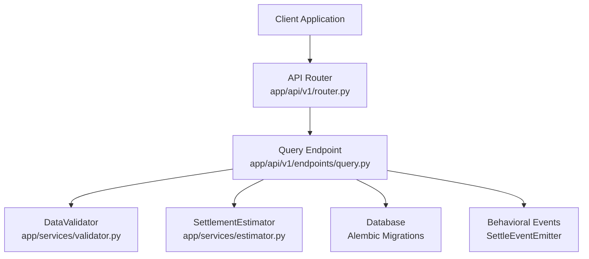
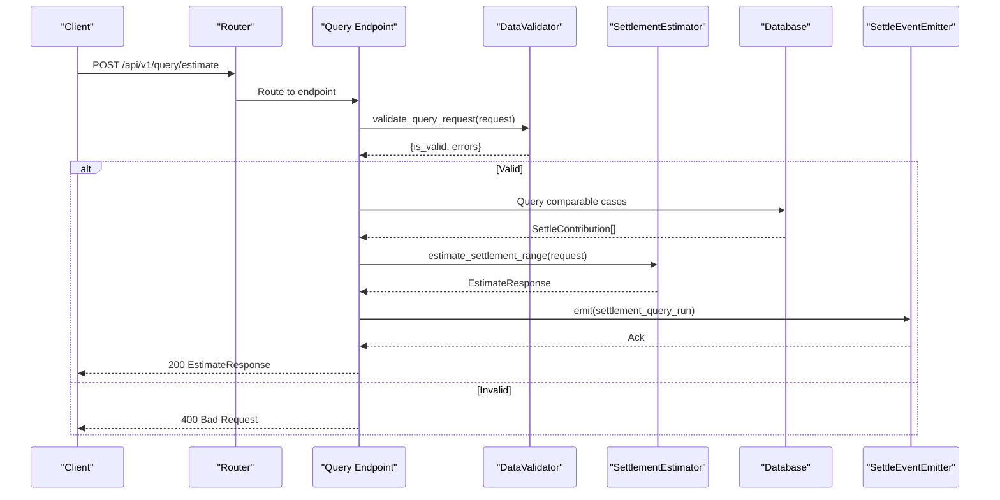
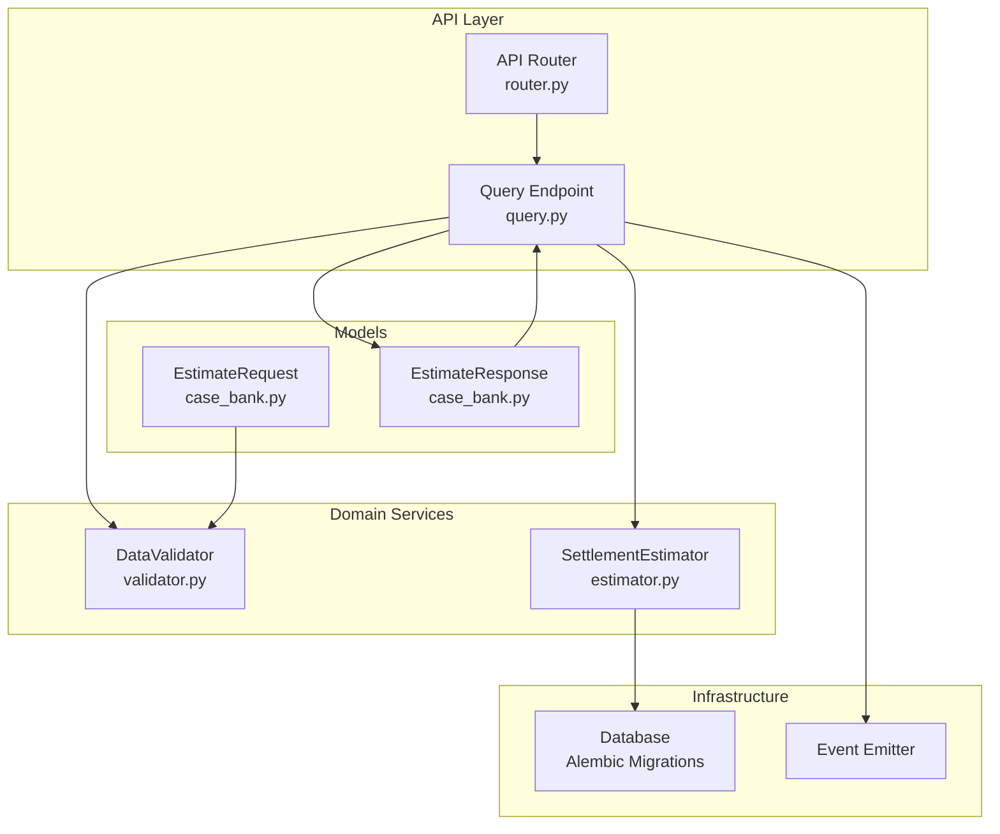

# Query Estimation API

<cite>
**Referenced Files in This Document**
- [query.py](file://app/api/v1/endpoints/query.py)
- [router.py](file://app/api/v1/router.py)
- [case_bank.py](file://app/models/case_bank.py)
- [validator.py](file://app/services/validator.py)
- [estimator.py](file://app/services/estimator.py)
- [API_DOCUMENTATION.md](file://docs/API_DOCUMENTATION.md)
- [comprehensive_test_suite.py](file://tests/comprehensive_test_suite.py)
- [test_estimator.py](file://tests/test_estimator.py)
- [33175e3b6200_add_settlement_records_table.py](file://alembic/versions/33175e3b6200_add_settlement_records_table.py)
- [6244ebfd45df_add_settle_case_snapshots_table.py](file://alembic/versions/6244ebfd45df_add_settle_case_snapshots_table.py)
</cite>

## Table of Contents
1. [Introduction](#introduction)
2. [Project Structure](#project-structure)
3. [Core Components](#core-components)
4. [Architecture Overview](#architecture-overview)
5. [Detailed Component Analysis](#detailed-component-analysis)
6. [Dependency Analysis](#dependency-analysis)
7. [Performance Considerations](#performance-considerations)
8. [Troubleshooting Guide](#troubleshooting-guide)
9. [Conclusion](#conclusion)
10. [Appendices](#appendices)

## Introduction
This document provides comprehensive API documentation for the settlement query estimation endpoint. It covers the POST /api/v1/query/estimate endpoint, including request parameters, settlement criteria, response format, input validation rules, percentile calculation methods, confidence scoring, error handling, performance characteristics, query optimization techniques, supported jurisdiction filters, and real-time processing capabilities. Integration examples for attorney applications and case management systems are included.

## Project Structure
The query estimation feature is implemented as part of the FastAPI application under the v1 API namespace. The endpoint is registered in the main router and delegates to a dedicated service for computation and validation.



**Diagram sources**
- [router.py:1-26](file://app/api/v1/router.py#L1-L26)
- [query.py:1-119](file://app/api/v1/endpoints/query.py#L1-L119)
- [validator.py:1-327](file://app/services/validator.py#L1-L327)
- [estimator.py:1-443](file://app/services/estimator.py#L1-L443)

**Section sources**
- [router.py:1-26](file://app/api/v1/router.py#L1-L26)
- [query.py:1-119](file://app/api/v1/endpoints/query.py#L1-L119)

## Core Components
- Endpoint: POST /api/v1/query/estimate
- Request Model: EstimateRequest
- Response Model: EstimateResponse
- Validation: DataValidator
- Estimation: SettlementEstimator
- Authentication: API Key or JWT (unified auth)
- Event Emission: Behavioral analytics

Key responsibilities:
- Validate incoming query parameters
- Compute settlement ranges using percentile or multiplier fallback
- Assign confidence levels based on comparable case count
- Return anonymized comparable cases for reporting
- Emit behavioral telemetry

**Section sources**
- [query.py:20-108](file://app/api/v1/endpoints/query.py#L20-L108)
- [case_bank.py:69-139](file://app/models/case_bank.py#L69-L139)
- [validator.py:286-326](file://app/services/validator.py#L286-L326)
- [estimator.py:60-117](file://app/services/estimator.py#L60-L117)

## Architecture Overview
The query estimation pipeline integrates routing, validation, estimation, and event emission.



**Diagram sources**
- [query.py:48-98](file://app/api/v1/endpoints/query.py#L48-L98)
- [validator.py:286-326](file://app/services/validator.py#L286-L326)
- [estimator.py:60-117](file://app/services/estimator.py#L60-L117)

## Detailed Component Analysis

### Endpoint Definition: POST /api/v1/query/estimate
- Method: POST
- Path: /api/v1/query/estimate
- Authentication: API Key or JWT (unified auth)
- Purpose: Estimate settlement range based on comparable cases
- Response: EstimateResponse

Behavioral notes:
- Logs authenticated user and request metadata
- Emits a behavioral event with jurisdiction, confidence, and case count
- Returns within <1 second (p95)

**Section sources**
- [query.py:20-108](file://app/api/v1/endpoints/query.py#L20-L108)
- [API_DOCUMENTATION.md:175-231](file://docs/API_DOCUMENTATION.md#L175-L231)

### Request Parameters: EstimateRequest
Fields:
- jurisdiction: string (required)
  - Format: "County Name, ST" (e.g., "Maricopa County, AZ")
  - Validation: Comma-separated, state must be 2-letter code
- case_type: string (required)
  - Must be one of predefined case types
- injury_category: array<string> (required, min 1)
  - Multi-select injury categories
- medical_bills: number (required, ≥ 0)
- Optional filters:
  - primary_diagnosis: string
  - treatment_type: array<string>
  - duration_of_treatment: string
  - imaging_findings: array<string>
  - lost_wages: number (≥ 0)
  - policy_limits: string
  - defendant_category: string

Validation rules:
- Required fields present
- Jurisdiction format validated
- Medical bills within allowed range
- Optional fields validated against allowed sets

**Section sources**
- [case_bank.py:69-93](file://app/models/case_bank.py#L69-L93)
- [validator.py:286-326](file://app/services/validator.py#L286-L326)

### Response Format: EstimateResponse
Fields:
- percentile_25: number
- median: number
- percentile_75: number
- percentile_95: number
- n_cases: integer
- confidence: string ("high", "medium", "low")
- comparable_cases: array<ComparableCase>
  - anonymized comparable cases for reporting
- range_justification: string (optional)
  - explanation of methodology and results
- query_id: uuid (optional)
- queried_at: datetime
- response_time_ms: integer (optional)

**Section sources**
- [case_bank.py:110-139](file://app/models/case_bank.py#L110-L139)

### Input Validation Rules
- Required fields: jurisdiction, case_type, injury_category, medical_bills
- Jurisdiction format: "County, ST" with valid 2-letter state code
- Medical bills: minimum threshold enforced
- Optional fields validated against predefined dropdown lists
- Consent confirmation required for contributions (not applicable here)

Error responses:
- 400 Bad Request with validation errors
- 401 Unauthorized for missing/invalid credentials
- 500 Internal Server Error for unexpected failures

**Section sources**
- [validator.py:286-326](file://app/services/validator.py#L286-L326)
- [query.py:62-67](file://app/api/v1/endpoints/query.py#L62-L67)
- [API_DOCUMENTATION.md:226-230](file://docs/API_DOCUMENTATION.md#L226-L230)

### Percentile Calculation Methods
Two calculation strategies are used depending on the number of comparable cases:

1) Percentile-based calculation (n ≥ 15):
- Extract outcome amounts from bucketed ranges (midpoint conversion)
- Calculate percentiles: 25th, median (50th), 75th, 95th
- Adjust for medical bills if significantly different (partial adjustment)
- Confidence: high (30+), medium (15-29), low (<15)

2) Multiplier fallback (n < 15):
- Determine severity level based on medical bills
- Apply industry standard multipliers (min, typical, high)
- Generate conservative range (typical multiplier applied to medical bills)

Bucket midpoint conversion:
- "$0-$50k" → 25000
- "$50k-$100k" → 75000
- "$100k-$150k" → 125000
- "$150k-$225k" → 187500
- "$225k-$300k" → 262500
- "$300k-$600k" → 450000
- "$600k-$1M" → 800000
- "$1M+" → 1500000

Representative case selection:
- Select cases across settlement range (low, medium, high)
- Prioritize recent cases
- Limit to 10 cases

**Section sources**
- [estimator.py:148-210](file://app/services/estimator.py#L148-L210)
- [estimator.py:212-262](file://app/services/estimator.py#L212-L262)
- [estimator.py:264-289](file://app/services/estimator.py#L264-L289)
- [estimator.py:291-343](file://app/services/estimator.py#L291-L343)

### Confidence Scoring
Confidence thresholds:
- High: 30+ comparable cases
- Medium: 15-29 comparable cases
- Low: <15 comparable cases (fallback to multipliers)

Note: The estimator currently uses a simplified thresholding approach. A more advanced confidence scoring mechanism exists in another module with weighted factors (sample size, jurisdiction match, similarity), but the query endpoint uses the simpler threshold-based method.

**Section sources**
- [estimator.py:44-49](file://app/services/estimator.py#L44-L49)
- [estimator.py:194-200](file://app/services/estimator.py#L194-L200)

### Supported Jurisdiction Filters
Matching criteria (in order of priority):
1. Jurisdiction (county + state)
2. Case type (if provided)
3. Injury category/type
4. Medical bills range (±50%)
5. Status = 'approved' only

Note: The current implementation uses mock data generation. The actual database query is marked as TODO and will implement the above matching criteria.

**Section sources**
- [estimator.py:118-146](file://app/services/estimator.py#L118-L146)

### Real-time Processing Capabilities
- Response time target: <1 second (p95)
- Response time measurement included in EstimateResponse
- Asynchronous processing with database connection
- Non-blocking event emission

Performance validation:
- Unit tests confirm response time < 1000ms
- Health check endpoint available

**Section sources**
- [query.py:39-46](file://app/api/v1/endpoints/query.py#L39-L46)
- [test_estimator.py:84-102](file://tests/test_estimator.py#L84-L102)
- [query.py:110-117](file://app/api/v1/endpoints/query.py#L110-L117)

### Error Handling
Common error scenarios:
- 400 Bad Request: Invalid query parameters
- 401 Unauthorized: Missing or invalid API key/JWT
- 405 Method Not Allowed: Wrong HTTP method
- 415 Unsupported Media Type: Invalid content type
- 500 Internal Server Error: Unexpected failures

Validation coverage:
- Missing required fields
- Invalid jurisdiction format
- Out-of-range medical bills
- Unsupported values for dropdown fields

**Section sources**
- [query.py:62-67](file://app/api/v1/endpoints/query.py#L62-L67)
- [query.py:100-107](file://app/api/v1/endpoints/query.py#L100-L107)
- [comprehensive_test_suite.py:656-676](file://tests/comprehensive_test_suite.py#L656-L676)

### Query Optimization Techniques
- Representative case sampling: Select diverse cases across the settlement spectrum
- Recent case prioritization: Prefer more recent comparable cases
- Bucket midpoint conversion: Efficient numerical representation of outcome ranges
- Threshold-based fallback: Use multipliers when data is sparse
- Asynchronous event emission: Non-blocking telemetry

Indexing considerations (database migrations):
- settlement_records: fingerprint, query-friendly indexes
- settle_case_snapshots: active case filtering, query-friendly indexes

**Section sources**
- [estimator.py:291-343](file://app/services/estimator.py#L291-L343)
- [33175e3b6200_add_settlement_records_table.py:21-43](file://alembic/versions/33175e3b6200_add_settlement_records_table.py#L21-L43)
- [6244ebfd45df_add_settle_case_snapshots_table.py:21-40](file://alembic/versions/6244ebfd45df_add_settle_case_snapshots_table.py#L21-L40)

### Integration Examples

#### Example 1: Basic Query
Request:
```json
{
  "jurisdiction": "Maricopa County, AZ",
  "case_type": "Motor Vehicle Accident",
  "injury_category": ["Spinal Injury"],
  "medical_bills": 85000.00
}
```

Response:
```json
{
  "percentile_25": 150000.00,
  "median": 325000.00,
  "percentile_75": 550000.00,
  "percentile_95": 850000.00,
  "n_cases": 47,
  "confidence": "high",
  "comparable_cases": [],
  "response_time_ms": 234
}
```

#### Example 2: Low Confidence Fallback
Request:
```json
{
  "jurisdiction": "Test County, WY",
  "case_type": "Rare Case Type",
  "injury_category": ["Rare Injury Type"],
  "medical_bills": 25000.00
}
```

Response:
```json
{
  "percentile_25": 37500.00,
  "median": 50000.00,
  "percentile_75": 75000.00,
  "percentile_95": 112500.00,
  "n_cases": 5,
  "confidence": "low",
  "comparable_cases": [],
  "range_justification": "Using industry standard multipliers (only 5 comparable cases available)"
}
```

#### Example 3: Case Management System Integration
```javascript
// Pseudo-code for integrating with case management systems
const estimateSettlement = async (caseData) => {
  const response = await fetch('https://settle-api.truevow.law/api/v1/query/estimate', {
    method: 'POST',
    headers: {
      'Authorization': 'Bearer YOUR_API_KEY',
      'Content-Type': 'application/json'
    },
    body: JSON.stringify({
      jurisdiction: `${caseData.county}, ${caseData.state}`,
      case_type: caseData.caseType,
      injury_category: caseData.injuryCategories,
      medical_bills: caseData.medicalBills,
      treatment_type: caseData.treatments,
      duration_of_treatment: caseData.treatmentDuration
    })
  });

  if (response.ok) {
    const result = await response.json();
    return {
      estimatedRange: {
        p25: result.percentile_25,
        median: result.median,
        p75: result.percentile_75,
        p95: result.percentile_95
      },
      confidence: result.confidence,
      comparableCases: result.comparable_cases
    };
  } else {
    throw new Error(`Estimate failed: ${response.status}`);
  }
};
```

**Section sources**
- [API_DOCUMENTATION.md:182-219](file://docs/API_DOCUMENTATION.md#L182-L219)

## Dependency Analysis
The query estimation endpoint has clear separation of concerns:



**Diagram sources**
- [query.py:1-119](file://app/api/v1/endpoints/query.py#L1-L119)
- [router.py:1-26](file://app/api/v1/router.py#L1-L26)
- [validator.py:1-327](file://app/services/validator.py#L1-L327)
- [estimator.py:1-443](file://app/services/estimator.py#L1-L443)
- [case_bank.py:1-269](file://app/models/case_bank.py#L1-L269)

**Section sources**
- [query.py:1-119](file://app/api/v1/endpoints/query.py#L1-L119)
- [validator.py:1-327](file://app/services/validator.py#L1-L327)
- [estimator.py:1-443](file://app/services/estimator.py#L1-L443)

## Performance Considerations
- Response time target: <1 second (p95)
- Implemented response time measurement in EstimateResponse
- Asynchronous event emission prevents blocking
- Representative case sampling limits payload size
- Bucket midpoint conversion enables efficient percentile calculation
- Database indexing planned for optimal query performance

## Troubleshooting Guide
Common issues and resolutions:

1) Validation Failures (400 Bad Request)
- Ensure jurisdiction follows "County, ST" format
- Verify medical_bills is within allowed range
- Confirm required fields are present
- Check case_type and injury_category against allowed values

2) Authentication Issues (401 Unauthorized)
- Verify API key format and validity
- Ensure proper Authorization header format
- Check API key access level permissions

3) Performance Issues
- Monitor response_time_ms in response
- Verify database connectivity and indexing
- Consider reducing optional filters for faster queries

4) Data Quality Concerns
- Low confidence (n < 15) indicates fallback to multipliers
- Review comparable_cases for representativeness
- Consider expanding jurisdiction or case type filters

**Section sources**
- [query.py:62-67](file://app/api/v1/endpoints/query.py#L62-L67)
- [query.py:100-107](file://app/api/v1/endpoints/query.py#L100-L107)
- [test_estimator.py:84-102](file://tests/test_estimator.py#L84-L102)

## Conclusion
The settlement query estimation endpoint provides a robust, real-time solution for attorney applications and case management systems. It offers percentile-based estimates when sufficient comparable data exists and falls back to industry-standard multipliers when data is limited. The implementation includes comprehensive validation, clear error handling, and performance targets suitable for production use. Future enhancements will focus on connecting to the actual database with optimized queries and expanded jurisdiction coverage.

## Appendices

### API Reference Summary
- Endpoint: POST /api/v1/query/estimate
- Authentication: API Key or JWT
- Request: EstimateRequest JSON
- Response: EstimateResponse JSON
- Success: 200 OK
- Errors: 400, 401, 405, 415, 500

### Data Models Reference
EstimateRequest fields:
- jurisdiction: string (required)
- case_type: string (required)
- injury_category: array<string> (required)
- medical_bills: number (required)
- Optional: primary_diagnosis, treatment_type, duration_of_treatment, imaging_findings, lost_wages, policy_limits, defendant_category

EstimateResponse fields:
- percentile_25, median, percentile_75, percentile_95: numbers
- n_cases: integer
- confidence: string
- comparable_cases: array
- range_justification: string (optional)
- query_id: uuid (optional)
- queried_at: datetime
- response_time_ms: integer (optional)

**Section sources**
- [case_bank.py:69-139](file://app/models/case_bank.py#L69-L139)
- [API_DOCUMENTATION.md:175-231](file://docs/API_DOCUMENTATION.md#L175-L231)