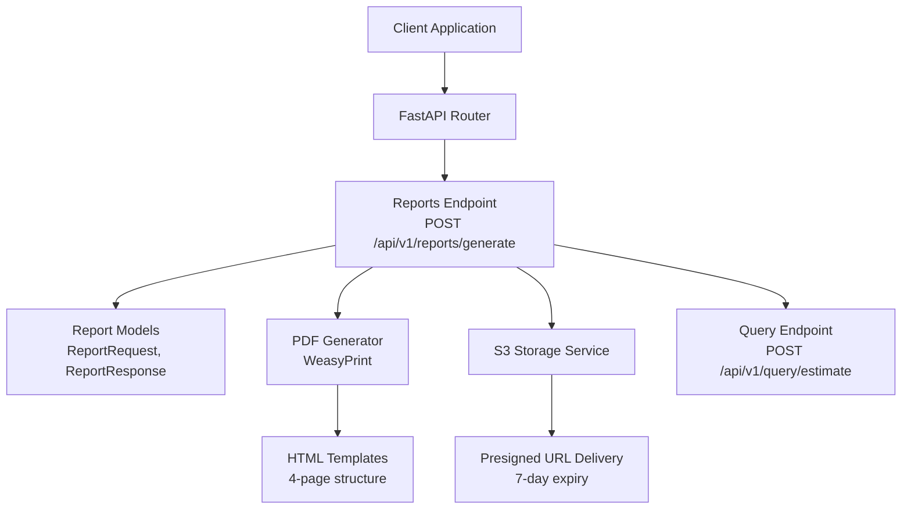
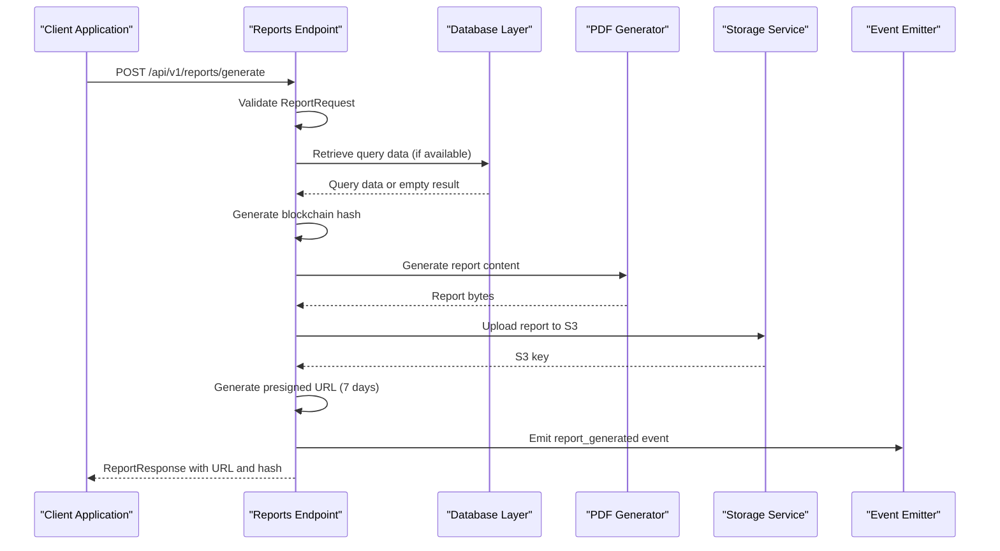
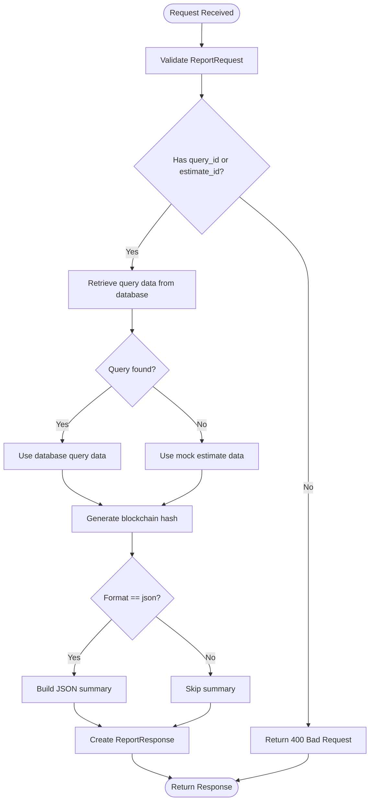
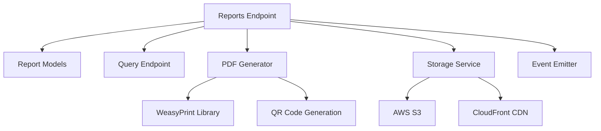

# Report Generation API

<cite>
**Referenced Files in This Document**
- [reports.py](file://app/api/v1/endpoints/reports.py)
- [router.py](file://app/api/v1/router.py)
- [reports.py](file://app/models/reports.py)
- [pdf_generator.py](file://app/services/reports/pdf_generator.py)
- [s3_service.py](file://app/services/storage/s3_service.py)
- [query.py](file://app/api/v1/endpoints/query.py)
- [API_DOCUMENTATION.md](file://docs/API_DOCUMENTATION.md)
- [579516014f19_add_settlement_reports_and_query_cache_.py](file://alembic/versions/579516014f19_add_settlement_reports_and_query_cache_.py)
</cite>

## Table of Contents
1. [Introduction](#introduction)
2. [Project Structure](#project-structure)
3. [Core Components](#core-components)
4. [Architecture Overview](#architecture-overview)
5. [Detailed Component Analysis](#detailed-component-analysis)
6. [Dependency Analysis](#dependency-analysis)
7. [Performance Considerations](#performance-considerations)
8. [Troubleshooting Guide](#troubleshooting-guide)
9. [Conclusion](#conclusion)
10. [Appendices](#appendices)

## Introduction
This document provides comprehensive API documentation for the professional report generation endpoints, focusing on the POST /api/v1/reports/generate endpoint. It covers report templates, PDF generation parameters, delivery options, customization, comparative analysis features, formatting controls, request schemas, supported output formats, branding options, generation timing, caching mechanisms, storage options, and integration patterns with legal case management systems.

## Project Structure
The report generation feature is implemented as part of the FastAPI application under the v1 API namespace. The key components include:
- Endpoint controller for report generation
- Data models for requests and responses
- PDF generation service using WeasyPrint
- Storage service for S3-backed report delivery
- Supporting query endpoint for settlement estimation

**Diagram sources**
- [router.py:1-26](file://app/api/v1/router.py#L1-L26)
- [reports.py:23-198](file://app/api/v1/endpoints/reports.py#L23-L198)
- [pdf_generator.py:18-622](file://app/services/reports/pdf_generator.py#L18-L622)
- [s3_service.py:16-317](file://app/services/storage/s3_service.py#L16-L317)
- [query.py:20-98](file://app/api/v1/endpoints/query.py#L20-L98)

**Section sources**
- [router.py:1-26](file://app/api/v1/router.py#L1-L26)
- [reports.py:23-198](file://app/api/v1/endpoints/reports.py#L23-L198)

## Core Components
This section outlines the primary components involved in report generation and their responsibilities.

- Reports Endpoint Controller
  - Handles POST /api/v1/reports/generate
  - Validates request parameters
  - Retrieves query data from database or uses mock data
  - Generates OpenTimestamps blockchain hash
  - Creates report URL and returns structured response

- Report Data Models
  - ReportRequest: Defines input schema for report generation
  - ReportResponse: Defines output schema for report generation
  - ReportSummary: Provides summary data for JSON format

- PDF Generation Service
  - Generates professional 4-page PDF reports
  - Uses WeasyPrint for HTML-to-PDF conversion
  - Implements QR code generation for blockchain verification
  - Provides mock PDF generation when WeasyPrint is unavailable

- Storage Service
  - Manages S3-backed report storage
  - Generates presigned URLs with 7-day expiration
  - Implements automatic cleanup for expired reports
  - Provides encryption at rest and storage class optimization

**Section sources**
- [reports.py:23-198](file://app/api/v1/endpoints/reports.py#L23-L198)
- [reports.py:57-121](file://app/models/reports.py#L57-L121)
- [pdf_generator.py:18-622](file://app/services/reports/pdf_generator.py#L18-L622)
- [s3_service.py:16-317](file://app/services/storage/s3_service.py#L16-L317)

## Architecture Overview
The report generation architecture follows a layered approach with clear separation of concerns:

**Diagram sources**
- [reports.py:23-198](file://app/api/v1/endpoints/reports.py#L23-L198)
- [pdf_generator.py:41-86](file://app/services/reports/pdf_generator.py#L41-L86)
- [s3_service.py:60-155](file://app/services/storage/s3_service.py#L60-L155)

## Detailed Component Analysis

### POST /api/v1/reports/generate Endpoint
The report generation endpoint accepts a ReportRequest and produces a ReportResponse containing the generated report metadata and delivery information.

#### Request Schema
The ReportRequest model defines the input parameters for report generation:

- query_id: Optional UUID referencing a previous query
- estimate_id: Optional legacy identifier
- format: String specifying output format (pdf, json, html)
- injury_type: Optional case parameter
- state: Optional case parameter
- county: Optional case parameter
- medical_bills: Optional financial parameter

Validation ensures the format is one of the supported values.

#### Response Schema
The ReportResponse model provides:
- report_id: Generated UUID for the report
- query_id: Associated query identifier
- report_url: Download URL (valid for 7 days)
- ots_hash: OpenTimestamps blockchain hash
- format: Output format used
- summary: JSON summary when format=json
- message: Status message with download instructions

#### Report Generation Flow

**Diagram sources**
- [reports.py:23-198](file://app/api/v1/endpoints/reports.py#L23-L198)
- [reports.py:57-121](file://app/models/reports.py#L57-L121)

**Section sources**
- [reports.py:23-198](file://app/api/v1/endpoints/reports.py#L23-L198)
- [reports.py:57-121](file://app/models/reports.py#L57-L121)

### Report Templates and Structure
The system provides a standardized 4-page report template structure:

#### Page 1: Settlement Range Summary
- Case overview with jurisdiction, injury type, and medical bills
- Settlement range (unweighted and weighted percentiles)
- Confidence level indicator
- Number of comparable cases used

#### Page 2: Comparable Cases Analysis
- Table of 10-15 anonymized similar cases
- Columns: Jurisdiction, Case Type, Injury Category, Medical Bills, Outcome Range, Outcome Year
- Strict PHI compliance with no narratives or identifying information

#### Page 3: Range Justification
- Methodology explanation (percentile vs multiplier approach)
- County clustering analysis
- Adjustment factors (medical bills, policy limits)
- Confidence level explanation with data quality metrics

#### Page 4: Compliance & Integrity
- Zero PHI statement
- OpenTimestamps blockchain hash for verification
- Legal disclaimer: "Descriptive statistics only, not legal advice"
- Attorney safety guarantees

**Section sources**
- [reports.py:28-57](file://app/api/v1/endpoints/reports.py#L28-L57)
- [reports.py:200-247](file://app/api/v1/endpoints/reports.py#L200-L247)

### PDF Generation Parameters and Formatting Controls
The PDF generation service implements comprehensive formatting controls:

#### HTML Template Structure
- Professional 8.5" x 11" letter format with 0.5" margins
- Four-page layout with page breaks
- Responsive typography with Helvetica/Arial font stack
- Consistent color scheme with gradient headers

#### Styling and Layout Elements
- Header section with SETTLE™ branding
- Summary boxes for case overview and settlement ranges
- Range display with prominent amount presentation
- Comparative cases table with alternating row colors
- Informational and warning boxes for compliance messaging
- Footer with page numbers and copyright information

#### QR Code Integration
- Blockchain verification QR code embedded in PDF
- Base64-encoded PNG images for offline verification
- OpenTimestamps verification URL generation

**Section sources**
- [pdf_generator.py:87-508](file://app/services/reports/pdf_generator.py#L87-L508)

### Delivery Options and Storage Mechanisms
The system supports multiple delivery formats with robust storage infrastructure:

#### Supported Output Formats
- PDF: Professional print-ready documents with embedded blockchain verification
- JSON: Structured data payload for programmatic consumption
- HTML: Web-friendly format for browser display

#### Storage and Distribution
- S3-backed storage with date-based folder organization
- Automatic encryption at rest (AES-256)
- Presigned URLs with configurable expiration (default: 7 days)
- Storage class optimization (STANDARD_IA for infrequent access)
- Automatic cleanup of expired reports (30-day retention)

#### URL Generation and Security
- CloudFront domain support for CDN distribution
- Signed URLs for secure access control
- Expiration-based access restrictions
- Mock mode for development environments

**Section sources**
- [s3_service.py:60-155](file://app/services/storage/s3_service.py#L60-L155)
- [s3_service.py:183-262](file://app/services/storage/s3_service.py#L183-L262)

### Comparative Analysis Features
The report generation incorporates advanced comparative analysis capabilities:

#### Data Filtering and Matching
- Jurisdictional matching (county and state)
- Case type filtering with predefined categories
- Injury category alignment with multi-select support
- Medical bills range filtering (±50% tolerance)
- Outcome recency analysis (past 5 years)

#### Statistical Analysis Methods
- Percentile-based range calculation (25th, median, 75th, 95th percentiles)
- Multiplier fallback methodology for small sample sizes
- Confidence scoring based on sample size and data quality
- Comparative case clustering by county and case type

#### Data Quality Controls
- Anonymization validation to prevent PHI leakage
- Outlier detection and flagging
- Confidence score assessment
- Peer-reviewed methodology alignment

**Section sources**
- [query.py:20-98](file://app/api/v1/endpoints/query.py#L20-L98)

### Report Customization Options
The system provides several customization options for report generation:

#### Inline Query Parameters
When no query_id is provided, the endpoint accepts inline case parameters:
- injury_type: Specific injury classification
- state: Jurisdiction state
- county: Optional county specification
- medical_bills: Financial parameter for case analysis

#### Formatting Controls
- Page layout customization through HTML/CSS
- Color scheme and branding integration
- Table formatting and pagination
- QR code placement and styling

#### Delivery Preferences
- Format selection (pdf, json, html)
- URL expiration configuration
- Storage location preferences
- Access control mechanisms

**Section sources**
- [reports.py:64-68](file://app/models/reports.py#L64-L68)

### Integration Patterns with Legal Case Management Systems
The report generation API supports seamless integration with legal case management systems:

#### Authentication and Authorization
- API key authentication for programmatic access
- Founding member tier with unlimited access
- Standard and premium tiers with rate limits
- Admin API keys for SaaS platform integration

#### Workflow Integration
- Preceding settlement estimation via /api/v1/query/estimate
- Automated report generation after case evaluation
- Integration with case management system workflows
- Audit trail through OpenTimestamps blockchain

#### Data Exchange Formats
- JSON payloads for programmatic consumption
- PDF export for traditional legal workflows
- HTML format for web-based case management systems
- Structured summary data for database integration

**Section sources**
- [API_DOCUMENTATION.md:45-72](file://docs/API_DOCUMENTATION.md#L45-L72)
- [query.py:20-98](file://app/api/v1/endpoints/query.py#L20-L98)

## Dependency Analysis
The report generation system exhibits clear dependency relationships:

**Diagram sources**
- [reports.py:23-198](file://app/api/v1/endpoints/reports.py#L23-L198)
- [pdf_generator.py:18-622](file://app/services/reports/pdf_generator.py#L18-L622)
- [s3_service.py:16-317](file://app/services/storage/s3_service.py#L16-L317)

### Component Coupling and Cohesion
- High cohesion within each component module
- Loose coupling through well-defined interfaces
- Clear separation between generation, storage, and delivery concerns
- Minimal circular dependencies

### External Dependencies
- WeasyPrint for HTML-to-PDF conversion
- boto3 for AWS S3 integration
- qrcode for blockchain verification QR codes
- OpenTimestamps for cryptographic verification

**Section sources**
- [reports.py:23-198](file://app/api/v1/endpoints/reports.py#L23-L198)
- [pdf_generator.py:18-622](file://app/services/reports/pdf_generator.py#L18-L622)
- [s3_service.py:16-317](file://app/services/storage/s3_service.py#L16-L317)

## Performance Considerations
The report generation system is optimized for performance and scalability:

### Response Time Expectations
- Report generation: <2 seconds (p95)
- Query estimation: <1 second (p95)
- PDF generation: Optimized through WeasyPrint
- Database queries: Efficient indexing on query cache

### Caching Mechanisms
The system implements multi-layered caching:
- Settlement query cache with expiration (settlement_query_cache table)
- Report storage with S3 object caching
- Database query result caching
- CDN caching for static resources

### Storage Optimization
- S3 STANDARD_IA storage class for cost-effective long-term storage
- Automatic cleanup of expired reports (30-day retention)
- Date-based folder organization for efficient retrieval
- Compression and encryption at rest

### Scalability Features
- Stateless endpoint design
- Horizontal scaling through load balancing
- Asynchronous event emission
- Database connection pooling

**Section sources**
- [reports.py:56](file://app/api/v1/endpoints/reports.py#L56)
- [query.py:41](file://app/api/v1/endpoints/query.py#L41)
- [579516014f19_add_settlement_reports_and_query_cache_.py:21-56](file://alembic/versions/579516014f19_add_settlement_reports_and_query_cache_.py#L21-L56)

## Troubleshooting Guide
Common issues and their resolutions:

### Report Generation Failures
- **Missing query data**: Ensure a valid query_id is provided or inline parameters are complete
- **WeasyPrint not available**: System falls back to mock PDF generation
- **Database connectivity**: Check database connection and query cache table existence
- **API key authentication**: Verify API key validity and access level

### Storage and Delivery Issues
- **S3 upload failures**: Check AWS credentials and bucket permissions
- **Expired URLs**: Regenerate presigned URLs or adjust expiration settings
- **File not found**: Verify S3 key format and storage cleanup policies
- **CDN delivery problems**: Check CloudFront configuration and domain setup

### Performance Problems
- **Slow report generation**: Monitor WeasyPrint availability and system resources
- **Database timeouts**: Review query cache performance and indexing
- **Memory issues**: Optimize PDF generation and streaming
- **Rate limiting**: Implement client-side retry logic with exponential backoff

### Debugging and Monitoring
- Enable detailed logging for report generation workflow
- Monitor OpenTimestamps hash generation and verification
- Track event emissions for behavioral analytics
- Review storage statistics and cleanup operations

**Section sources**
- [reports.py:190-197](file://app/api/v1/endpoints/reports.py#L190-L197)
- [s3_service.py:37-58](file://app/services/storage/s3_service.py#L37-L58)

## Conclusion
The Report Generation API provides a comprehensive, professional solution for automated settlement analysis reporting. With its standardized 4-page template structure, robust PDF generation capabilities, secure storage infrastructure, and flexible delivery options, it enables legal case management systems to integrate high-quality settlement intelligence seamlessly. The system's emphasis on compliance, performance, and scalability makes it suitable for production deployment in legal technology environments.

## Appendices

### API Reference Summary
- **Endpoint**: POST /api/v1/reports/generate
- **Authentication**: API Key required
- **Content-Type**: application/json
- **Response**: ReportResponse with report metadata and delivery URL
- **Formats**: pdf, json, html
- **Delivery**: S3 storage with 7-day presigned URL access

### Database Schema References
- settlement_reports table: Stores report metadata and computed values
- settlement_query_cache table: Caches query results for performance
- Indexes on query_hash and expiration fields for efficient lookups

### Security and Compliance
- OpenTimestamps blockchain verification for integrity
- Zero PHI/PII data handling
- Encryption at rest and in transit
- Audit trails through event emissions
- Bar-compliant design across all 50 states