# Utility Endpoints

<cite>
**Referenced Files in This Document**
- [README.md](file://README.md)
- [router.py](file://app/api/v1/router.py)
- [waitlist.py](file://app/api/v1/endpoints/waitlist.py)
- [stats.py](file://app/api/v1/endpoints/stats.py)
- [negotiation.py](file://app/api/v1/endpoints/negotiation.py)
- [mdm_webhook.py](file://app/api/v1/endpoints/mdm_webhook.py)
- [negotiation_service.py](file://app/services/negotiation_service.py)
- [auth.py](file://app/core/auth.py)
- [config.py](file://app/core/config.py)
- [settle_supabase.sql](file://database/schemas/settle_supabase.sql)
- [add_waitlist_table.sql](file://database/migrations/add_waitlist_table.sql)
- [6a4cea9d2e18_add_negotiation_timeline_table.py](file://alembic/versions/6a4cea9d2e18_add_negotiation_timeline_table.py)
</cite>

## Table of Contents
1. [Introduction](#introduction)
2. [Project Structure](#project-structure)
3. [Core Components](#core-components)
4. [Architecture Overview](#architecture-overview)
5. [Detailed Component Analysis](#detailed-component-analysis)
6. [Dependency Analysis](#dependency-analysis)
7. [Performance Considerations](#performance-considerations)
8. [Troubleshooting Guide](#troubleshooting-guide)
9. [Conclusion](#conclusion)

## Introduction
This document provides comprehensive API documentation for utility and support endpoints within the TrueVow SETTLE Service. It covers:
- Waitlist management endpoints for user onboarding and access requests
- Statistics aggregation endpoints for usage analytics and performance metrics
- Negotiation tracking endpoints for settlement timeline management
- MDM webhook endpoints for external system integration

These endpoints are designed to integrate seamlessly with the TrueVow ecosystem services and support both public access and authenticated administration.

## Project Structure
The API endpoints are organized under the v1 API router with clear separation between public, authenticated, and administrative routes:

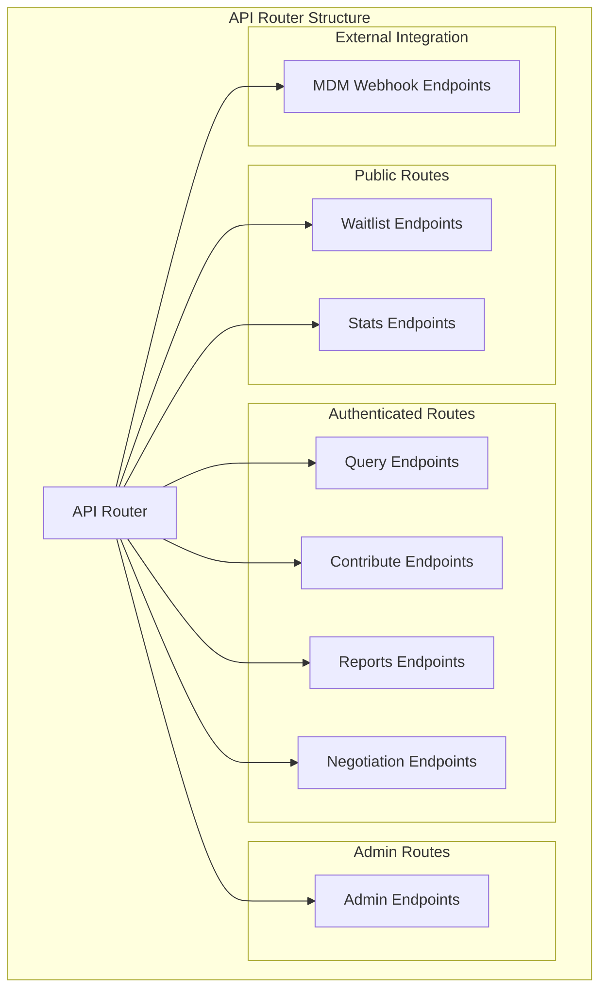

**Diagram sources**
- [router.py:10-24](file://app/api/v1/router.py#L10-L24)

**Section sources**
- [router.py:1-26](file://app/api/v1/router.py#L1-L26)
- [README.md:89-114](file://README.md#L89-L114)

## Core Components
The utility endpoints are built around four primary functional areas:

### Authentication Framework
The system supports dual authentication methods:
- API Key Authentication for legacy integrations and administrative access
- Clerk JWT Authentication for modern tenant and internal operations

### Data Models
Each endpoint group maintains consistent request/response models:
- Pydantic models for type safety and validation
- Structured response schemas for predictable API contracts
- Comprehensive error handling with HTTP status codes

### Database Integration
Endpoints interact with a centralized Supabase/PostgreSQL database:
- Provider-agnostic configuration abstraction
- Row-level security policies for data protection
- Optimized indexing for performance

**Section sources**
- [auth.py:340-485](file://app/core/auth.py#L340-L485)
- [config.py:23-351](file://app/core/config.py#L23-L351)

## Architecture Overview
The utility endpoints operate within TrueVow's 5-service enterprise architecture:

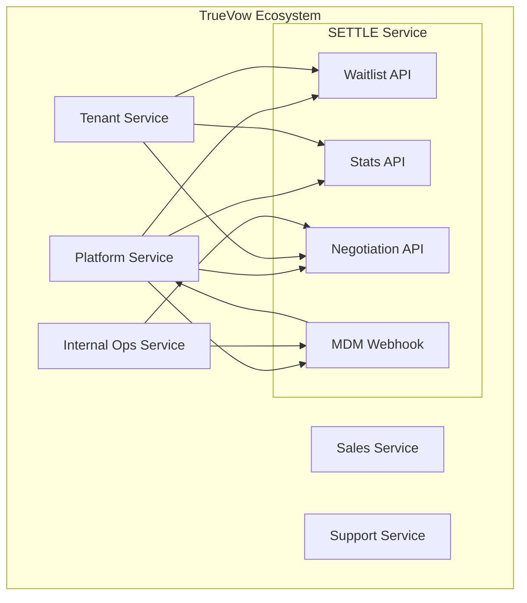

**Diagram sources**
- [README.md:28-73](file://README.md#L28-L73)
- [mdm_webhook.py:73-114](file://app/api/v1/endpoints/mdm_webhook.py#L73-L114)

## Detailed Component Analysis

### Waitlist Management Endpoints
The waitlist system manages pre-onboarding access requests with comprehensive approval workflows.

#### Public Waitlist Join Endpoint
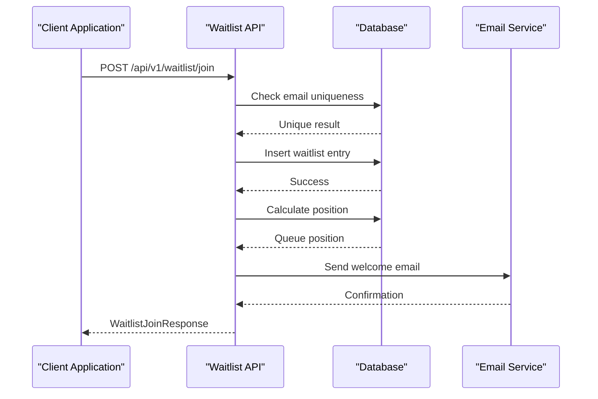

**Diagram sources**
- [waitlist.py:62-126](file://app/api/v1/endpoints/waitlist.py#L62-L126)

#### Administrative Waitlist Management
Administrative endpoints provide comprehensive oversight of waitlist operations:

| Endpoint | Method | Description |
|----------|--------|-------------|
| `/api/v1/waitlist/entries` | GET | List all waitlist entries with filtering and pagination |
| `/api/v1/waitlist/entries/{entry_id}` | GET | Retrieve specific waitlist entry details |
| `/api/v1/waitlist/entries/{entry_id}/approve` | POST | Approve waitlist entry and create founding member |
| `/api/v1/waitlist/entries/{entry_id}/reject` | POST | Reject waitlist entry with optional notes |

#### Request/Response Schemas
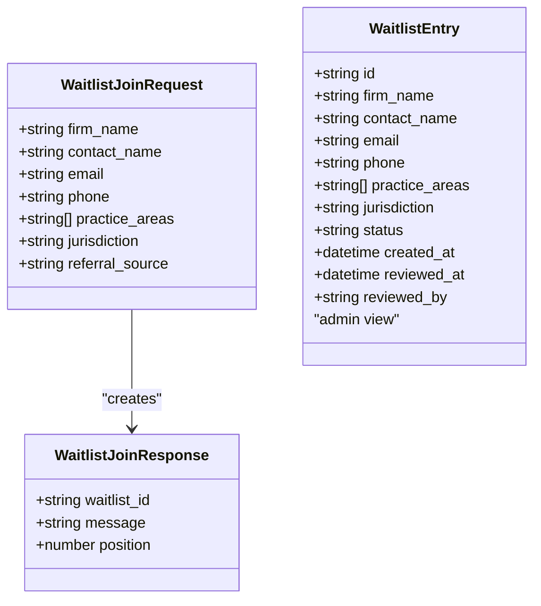

**Diagram sources**
- [waitlist.py:23-54](file://app/api/v1/endpoints/waitlist.py#L23-L54)

**Section sources**
- [waitlist.py:62-418](file://app/api/v1/endpoints/waitlist.py#L62-L418)
- [settle_supabase.sql:318-351](file://database/schemas/settle_supabase.sql#L318-L351)

### Statistics Aggregation Endpoints
The statistics endpoints provide comprehensive analytics about SETTLE service usage and database coverage.

#### Founding Member Statistics
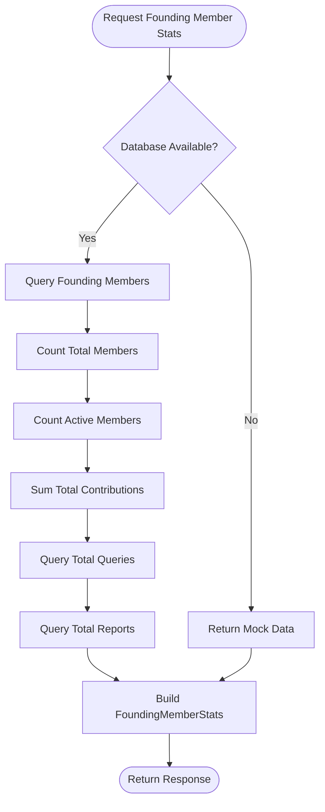

**Diagram sources**
- [stats.py:41-107](file://app/api/v1/endpoints/stats.py#L41-L107)

#### Database Statistics
The database statistics endpoint provides coverage metrics and contribution analysis:

| Endpoint | Method | Description |
|----------|--------|-------------|
| `/api/v1/stats/founding-members` | GET | Public founding member program statistics |
| `/api/v1/stats/database` | GET | Public database coverage and contribution statistics |

#### Response Models
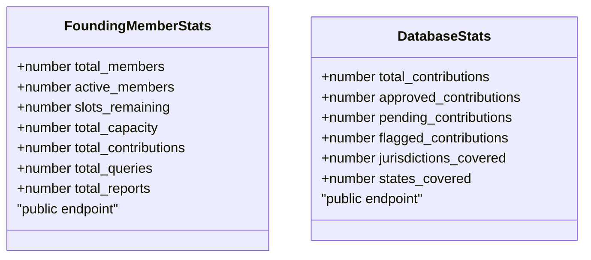

**Diagram sources**
- [stats.py:20-40](file://app/api/v1/endpoints/stats.py#L20-L40)

**Section sources**
- [stats.py:41-182](file://app/api/v1/endpoints/stats.py#L41-L182)

### Negotiation Tracking Endpoints
The negotiation endpoints manage settlement timeline tracking with comprehensive analysis capabilities.

#### Negotiation Timeline Management
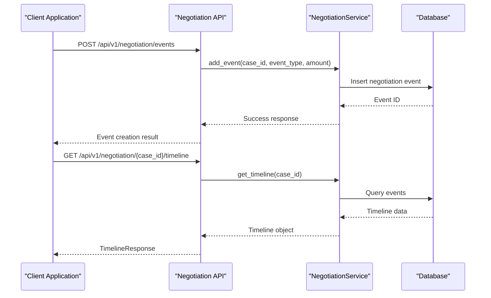

**Diagram sources**
- [negotiation.py:87-150](file://app/api/v1/endpoints/negotiation.py#L87-L150)
- [negotiation_service.py:72-121](file://app/services/negotiation_service.py#L72-L121)

#### Negotiation Event Types
The system tracks four primary negotiation event types:

| Event Type | Description | Amount Field | Party Field |
|------------|-------------|--------------|-------------|
| `demand_sent` | Initial demand letter sent | Optional | Required |
| `insurer_offer` | Insurance company offer received | Required | Required |
| `attorney_counter` | Attorney counteroffer | Required | Required |
| `settlement_recorded` | Final settlement recorded | Required | Required |

#### Advanced Analytics Endpoints
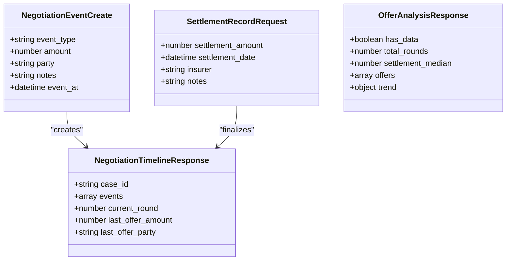

**Diagram sources**
- [negotiation.py:27-81](file://app/api/v1/endpoints/negotiation.py#L27-L81)

**Section sources**
- [negotiation.py:87-247](file://app/api/v1/endpoints/negotiation.py#L87-L247)
- [negotiation_service.py:61-383](file://app/services/negotiation_service.py#L61-L383)

### MDM Webhook Integration
The MDM webhook endpoints enable bidirectional integration with the TrueVow SaaS Admin platform.

#### Webhook Event Types
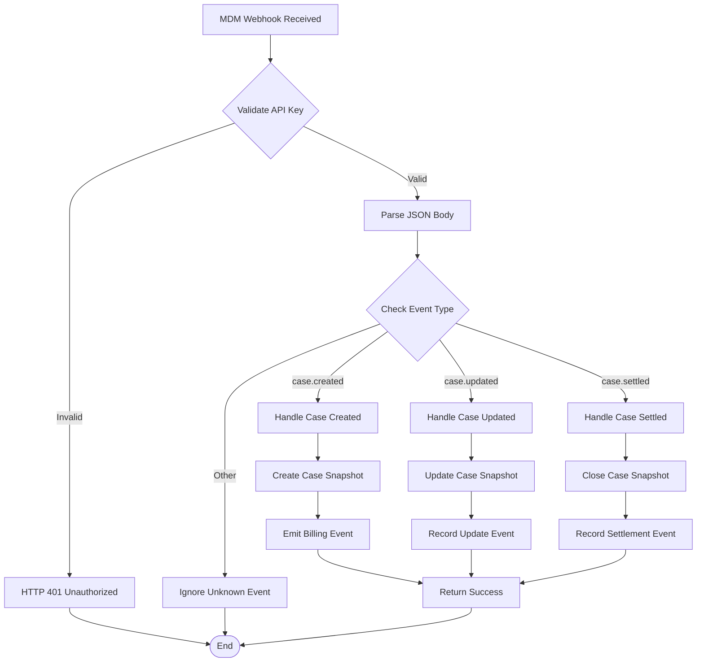

**Diagram sources**
- [mdm_webhook.py:73-114](file://app/api/v1/endpoints/mdm_webhook.py#L73-L114)

#### Webhook Payload Models
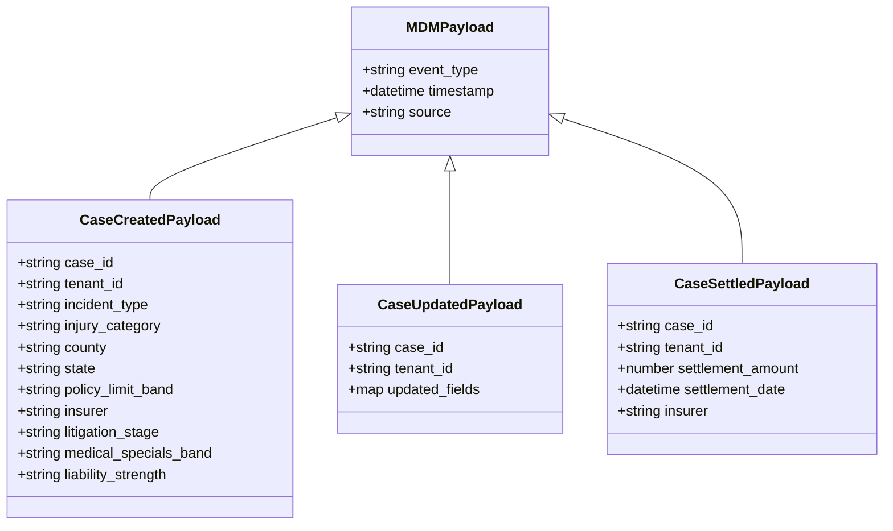

**Diagram sources**
- [mdm_webhook.py:31-67](file://app/api/v1/endpoints/mdm_webhook.py#L31-L67)

**Section sources**
- [mdm_webhook.py:73-326](file://app/api/v1/endpoints/mdm_webhook.py#L73-L326)

## Dependency Analysis
The utility endpoints demonstrate clear separation of concerns and minimal coupling:

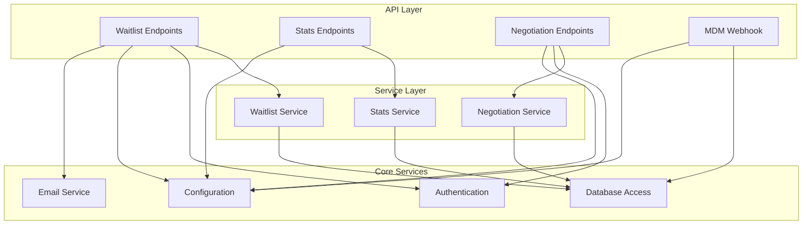

**Diagram sources**
- [router.py:5-6](file://app/api/v1/router.py#L5-L6)
- [auth.py:340-485](file://app/core/auth.py#L340-L485)

**Section sources**
- [router.py:5-24](file://app/api/v1/router.py#L5-L24)
- [auth.py:340-485](file://app/core/auth.py#L340-L485)

## Performance Considerations
The utility endpoints are designed with several performance optimization strategies:

### Database Optimization
- **Indexing Strategy**: Strategic indexes on frequently queried columns (email, status, joined_at)
- **Connection Pooling**: Configurable database pool sizes for concurrent access
- **Query Optimization**: Efficient SQL queries with proper filtering and pagination

### Caching and Mock Modes
- **Mock Data Support**: Automatic fallback to mock data when database is unavailable
- **Rate Limiting**: Built-in rate limiting to prevent abuse
- **CORS Configuration**: Flexible CORS settings for cross-origin requests

### Authentication Performance
- **Dual Authentication**: Efficient switching between API key and JWT authentication
- **Async Operations**: Non-blocking database operations where possible
- **Audit Logging**: Asynchronous audit logging to minimize request latency

## Troubleshooting Guide

### Common Issues and Solutions

#### Authentication Failures
- **API Key Issues**: Verify API key format (`settle_xxxxxxxxx`) and active status
- **JWT Validation**: Check token validity and scope requirements
- **Header Problems**: Ensure proper header formatting (Authorization, X-API-Key)

#### Database Connectivity
- **Connection Errors**: Verify database URL and credentials in environment variables
- **Migration Issues**: Check database schema version and run migrations if needed
- **Timeouts**: Review database connection pool settings and query performance

#### Service Integration
- **Cross-Service Communication**: Verify service URLs and API keys in configuration
- **Webhook Delivery**: Check webhook endpoint accessibility and authentication
- **Event Processing**: Monitor event queues and retry mechanisms

### Error Response Patterns
All endpoints follow consistent error response patterns:
- **HTTP 401**: Authentication required or invalid credentials
- **HTTP 403**: Insufficient permissions or access denied
- **HTTP 404**: Resource not found
- **HTTP 400**: Bad request or validation errors
- **HTTP 500**: Internal server errors

**Section sources**
- [auth.py:477-484](file://app/core/auth.py#L477-L484)
- [config.py:244-351](file://app/core/config.py#L244-L351)

## Conclusion
The utility endpoints provide a comprehensive foundation for SETTLE service operations within the TrueVow ecosystem. They offer:

- **Robust Waitlist Management**: Complete onboarding workflow with approval automation
- **Transparent Statistics**: Real-time analytics for service usage and coverage
- **Advanced Negotiation Tracking**: Detailed settlement timeline management with AI-powered insights
- **Seamless Integration**: Bidirectional webhook support for external system coordination

The modular architecture ensures maintainability, while the dual authentication system supports both legacy integrations and modern tenant workflows. The endpoints are designed for scalability and performance, with comprehensive error handling and monitoring capabilities.

Future enhancements could include additional analytics endpoints, expanded webhook capabilities, and enhanced integration patterns with the broader TrueVow ecosystem services.