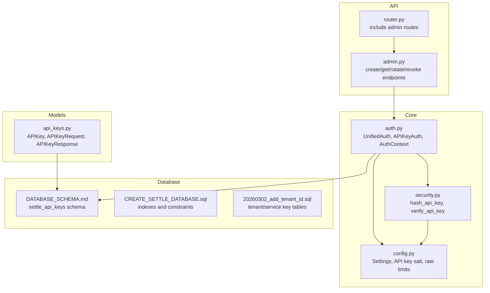
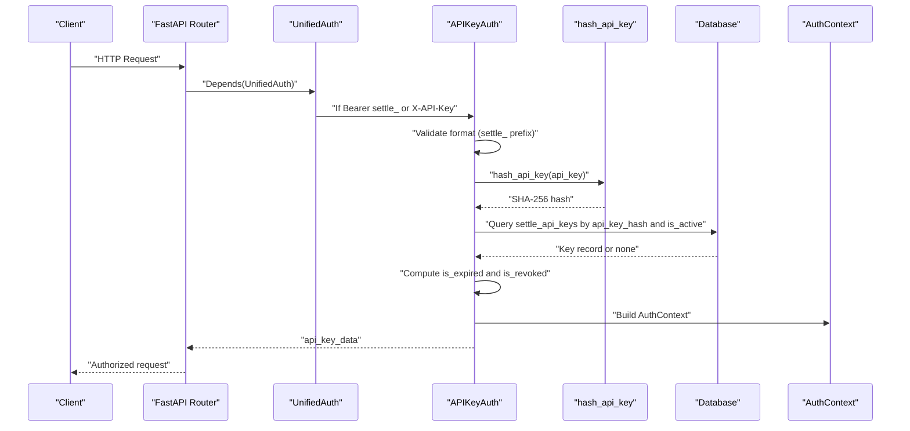
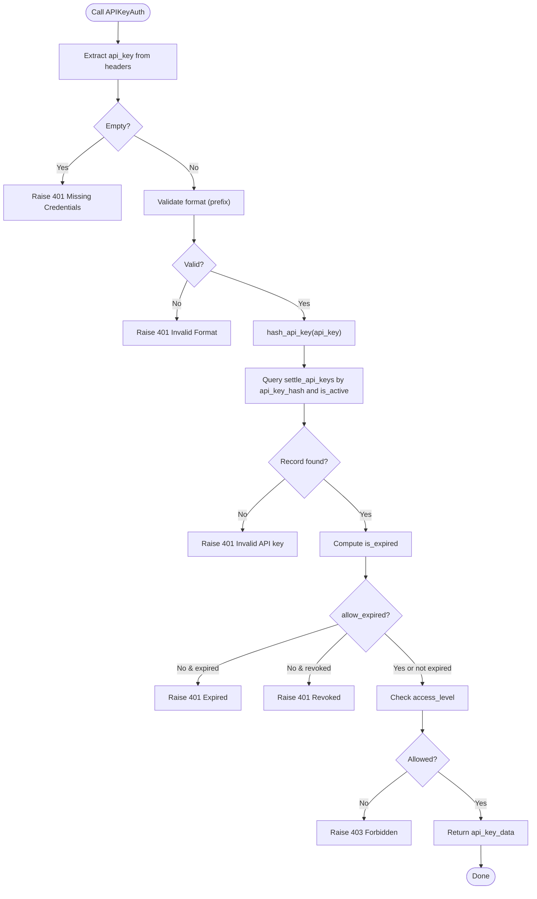
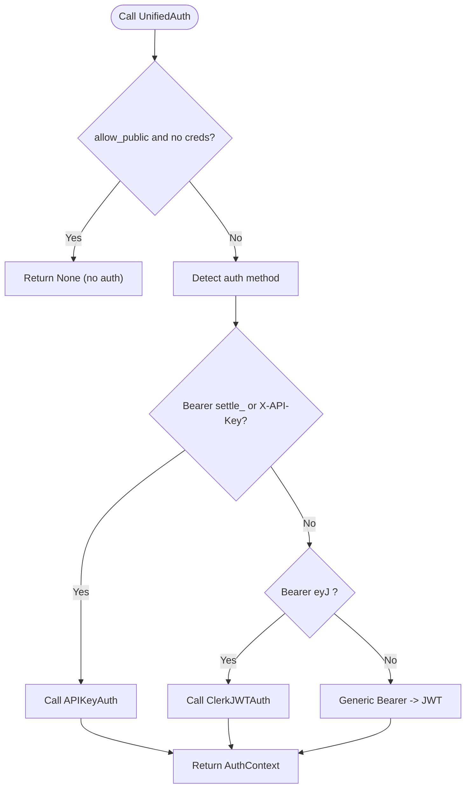
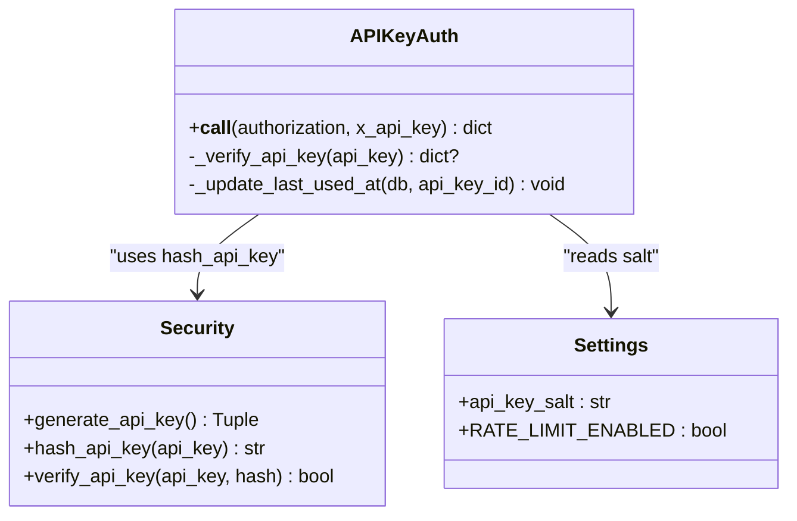
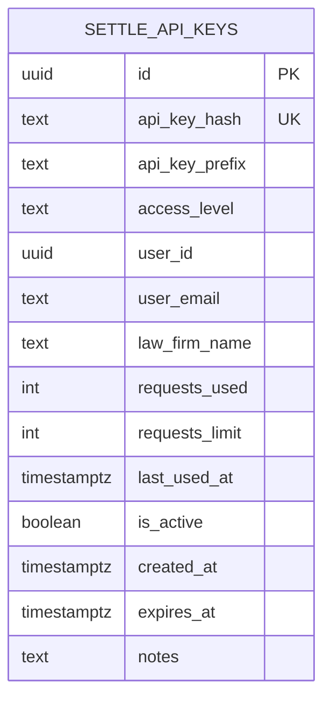
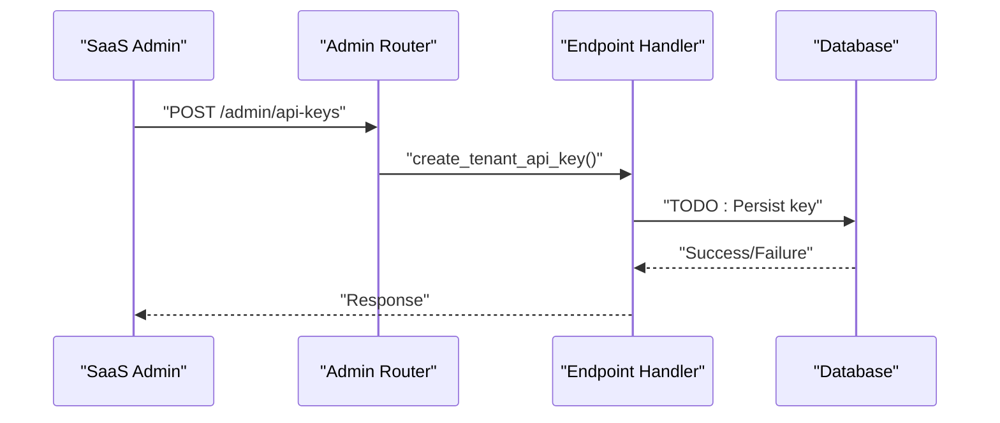
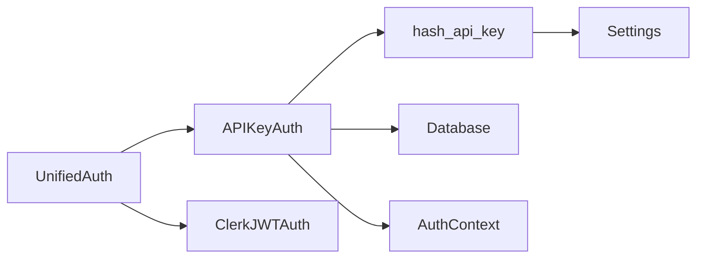

# API Key Authentication

<cite>
**Referenced Files in This Document**
- [auth.py](file://app/core/auth.py)
- [security.py](file://app/core/security.py)
- [config.py](file://app/core/config.py)
- [api_keys.py](file://app/models/api_keys.py)
- [DATABASE_SCHEMA.md](file://docs/DATABASE_SCHEMA.md)
- [CREATE_SETTLE_DATABASE.sql](file://database/CREATE_SETTLE_DATABASE.sql)
- [20260302_add_tenant_id.sql](file://database/migrations/20260302_add_tenant_id.sql)
- [admin.py](file://app/api/v1/endpoints/admin.py)
- [router.py](file://app/api/v1/router.py)
- [main.py](file://app/main.py)
</cite>

## Table of Contents
1. [Introduction](#introduction)
2. [Project Structure](#project-structure)
3. [Core Components](#core-components)
4. [Architecture Overview](#architecture-overview)
5. [Detailed Component Analysis](#detailed-component-analysis)
6. [Dependency Analysis](#dependency-analysis)
7. [Performance Considerations](#performance-considerations)
8. [Troubleshooting Guide](#troubleshooting-guide)
9. [Conclusion](#conclusion)

## Introduction
This document explains the API key authentication system in the SETTLE Service. It covers the verification process, access level validation, security protocols, key format requirements, database storage, expiration handling, and integration patterns. It also documents the APIKeyAuth dependency class usage, access checks, and outlines examples of key creation, validation, and revocation. Finally, it describes the hash-based verification system, rate limiting integration, and security best practices for managing API keys.

## Project Structure
The API key authentication spans several modules:
- Core authentication and context management
- Security utilities for hashing and verification
- Configuration for environment and feature flags
- Data models for API keys and Founding Members
- Database schema and migration artifacts
- Admin endpoints for key lifecycle operations
- Router wiring for API exposure

**Diagram sources**
- [auth.py:1-867](file://app/core/auth.py#L1-L867)
- [security.py:1-208](file://app/core/security.py#L1-L208)
- [config.py:1-351](file://app/core/config.py#L1-L351)
- [api_keys.py:1-147](file://app/models/api_keys.py#L1-L147)
- [DATABASE_SCHEMA.md:182-265](file://docs/DATABASE_SCHEMA.md#L182-L265)
- [CREATE_SETTLE_DATABASE.sql:160-199](file://database/CREATE_SETTLE_DATABASE.sql#L160-L199)
- [20260302_add_tenant_id.sql:33-85](file://database/migrations/20260302_add_tenant_id.sql#L33-L85)
- [admin.py:1-200](file://app/api/v1/endpoints/admin.py#L1-L200)
- [router.py:1-26](file://app/api/v1/router.py#L1-L26)

**Section sources**
- [auth.py:1-867](file://app/core/auth.py#L1-L867)
- [security.py:1-208](file://app/core/security.py#L1-L208)
- [config.py:1-351](file://app/core/config.py#L1-L351)
- [api_keys.py:1-147](file://app/models/api_keys.py#L1-L147)
- [DATABASE_SCHEMA.md:182-265](file://docs/DATABASE_SCHEMA.md#L182-L265)
- [CREATE_SETTLE_DATABASE.sql:160-199](file://database/CREATE_SETTLE_DATABASE.sql#L160-L199)
- [20260302_add_tenant_id.sql:33-85](file://database/migrations/20260302_add_tenant_id.sql#L33-L85)
- [admin.py:1-200](file://app/api/v1/endpoints/admin.py#L1-L200)
- [router.py:1-26](file://app/api/v1/router.py#L1-L26)

## Core Components
- APIKeyAuth: FastAPI dependency that validates API keys from Authorization or X-API-Key headers, enforces access levels, and handles expiration and revocation checks.
- UnifiedAuth: Unified dependency that accepts either API Key or Clerk JWT, routing to appropriate auth method.
- AuthContext: Unified authentication context carrying auth method, user identity, tenant scope, access level, and scope classification.
- Security utilities: Hashing and verification functions for API key integrity and timing-safe comparison.
- Configuration: Salt for hashing, rate limiting flags, and environment controls.
- Data models: APIKey, APIKeyRequest, APIKeyResponse, FoundingMember, and related validators.
- Database schema: settle_api_keys table with indexes, constraints, and usage tracking fields.

**Section sources**
- [auth.py:487-796](file://app/core/auth.py#L487-L796)
- [auth.py:96-159](file://app/core/auth.py#L96-L159)
- [security.py:23-66](file://app/core/security.py#L23-L66)
- [config.py:167-200](file://app/core/config.py#L167-L200)
- [api_keys.py:11-147](file://app/models/api_keys.py#L11-L147)
- [DATABASE_SCHEMA.md:182-265](file://docs/DATABASE_SCHEMA.md#L182-L265)

## Architecture Overview
The API key authentication pipeline integrates with the broader dual-auth system supporting both API keys and Clerk JWT. Requests are routed through UnifiedAuth, which detects API key vs JWT and delegates to APIKeyAuth or Clerk JWT auth. APIKeyAuth hashes the provided key, queries the database, updates usage metadata asynchronously, and enforces access level and expiration checks.

**Diagram sources**
- [auth.py:340-485](file://app/core/auth.py#L340-L485)
- [auth.py:487-729](file://app/core/auth.py#L487-L729)
- [security.py:39-50](file://app/core/security.py#L39-L50)
- [DATABASE_SCHEMA.md:182-265](file://docs/DATABASE_SCHEMA.md#L182-L265)

## Detailed Component Analysis

### APIKeyAuth Dependency Class
APIKeyAuth validates API keys from headers, performs format checks, hashes the key, queries the database, and enforces access level and expiration constraints. It supports optional allowance for expired keys and returns a structured dictionary for downstream use.

Key behaviors:
- Header extraction from Authorization or X-API-Key
- Format validation (must start with a specific prefix)
- Hash-based lookup in settle_api_keys
- Expiration and revocation checks
- Access level enforcement
- Asynchronous last_used_at update

**Diagram sources**
- [auth.py:513-627](file://app/core/auth.py#L513-L627)
- [auth.py:629-707](file://app/core/auth.py#L629-L707)
- [security.py:39-50](file://app/core/security.py#L39-L50)

**Section sources**
- [auth.py:487-729](file://app/core/auth.py#L487-L729)
- [security.py:23-66](file://app/core/security.py#L23-L66)

### Unified Authentication Routing
UnifiedAuth determines whether a request uses API Key or Clerk JWT. It supports:
- API Key detection via Bearer settle_ or X-API-Key
- Clerk JWT detection via Bearer eyJ (and generic Bearer fallback)
- Public endpoints via allow_public flag
- Audit logging for all auth attempts

**Diagram sources**
- [auth.py:340-485](file://app/core/auth.py#L340-L485)

**Section sources**
- [auth.py:340-485](file://app/core/auth.py#L340-L485)

### Access Level Validation and Checks
Access levels supported by the system include founding_member, standard, premium, admin, and external. APIKeyAuth enforces required access levels, while specialized helpers like get_admin_api_key and get_founding_member_api_key provide role-based gating for sensitive endpoints.

Validation logic:
- Required access levels enforced via constructor parameter
- Admin and Founding Member helpers for endpoint protection
- AuthContext exposes access_level for higher-level decisions

**Section sources**
- [auth.py:732-795](file://app/core/auth.py#L732-L795)
- [api_keys.py:52-59](file://app/models/api_keys.py#L52-L59)

### API Key Format Requirements and Hash-Based Verification
- Format: Keys must start with a specific prefix recognized by UnifiedAuth/APIKeyAuth.
- Storage: Keys are stored as SHA-256 hashes with a salt from configuration.
- Verification: Timing-safe comparison prevents timing attacks.

**Diagram sources**
- [security.py:23-66](file://app/core/security.py#L23-L66)
- [auth.py:487-729](file://app/core/auth.py#L487-L729)
- [config.py:167-183](file://app/core/config.py#L167-L183)

**Section sources**
- [security.py:23-66](file://app/core/security.py#L23-L66)
- [auth.py:556-565](file://app/core/auth.py#L556-L565)
- [config.py:167-183](file://app/core/config.py#L167-L183)

### Database Storage Mechanism and Schema
The settle_api_keys table stores hashed keys, prefixes, access levels, usage metrics, status flags, and optional expiration. Indexes optimize lookups by access level, activity, prefix, user, and email. Constraints enforce valid access levels and non-negative counters.

Key fields:
- api_key_hash: SHA-256 hash of the key
- api_key_prefix: First 8 characters for display
- access_level: Enumerated access tier
- user_id, user_email, law_firm_name: User info
- requests_used, requests_limit: Usage tracking
- is_active, created_at, expires_at: Status and lifecycle
- last_used_at: Last usage timestamp

**Diagram sources**
- [DATABASE_SCHEMA.md:182-265](file://docs/DATABASE_SCHEMA.md#L182-L265)
- [CREATE_SETTLE_DATABASE.sql:160-199](file://database/CREATE_SETTLE_DATABASE.sql#L160-L199)

**Section sources**
- [DATABASE_SCHEMA.md:182-265](file://docs/DATABASE_SCHEMA.md#L182-L265)
- [CREATE_SETTLE_DATABASE.sql:160-199](file://database/CREATE_SETTLE_DATABASE.sql#L160-L199)

### Expiration Handling and Usage Tracking
- Expiration: Computed by comparing stored expires_at to current time; can be bypassed via allow_expired flag.
- Revocation: Detected via is_active flag; revoked keys are rejected.
- Usage tracking: requests_used increments on successful operations; last_used_at updated asynchronously.

**Section sources**
- [auth.py:580-600](file://app/core/auth.py#L580-L600)
- [auth.py:678-687](file://app/core/auth.py#L678-L687)
- [auth.py:709-729](file://app/core/auth.py#L709-L729)

### API Key Lifecycle Operations (Admin Endpoints)
The admin module defines endpoints for managing API keys:
- Create tenant API key (placeholder)
- Get tenant API key (placeholder)
- Rotate API key (placeholder)
- Revoke API key (placeholder)

Note: Current implementations are placeholders and not yet wired to the database.

**Diagram sources**
- [admin.py:453-464](file://app/api/v1/endpoints/admin.py#L453-L464)
- [admin.py:466-490](file://app/api/v1/endpoints/admin.py#L466-L490)
- [admin.py:492-533](file://app/api/v1/endpoints/admin.py#L492-L533)
- [admin.py:522-533](file://app/api/v1/endpoints/admin.py#L522-L533)

**Section sources**
- [admin.py:453-533](file://app/api/v1/endpoints/admin.py#L453-L533)
- [router.py:20-21](file://app/api/v1/router.py#L20-L21)

### Rate Limiting Integration
Rate limiting is configurable and intended to integrate with Redis. Founding Members receive unlimited access. Standard checks compare requests_used against requests_limit and raise 429 Too Many Requests when exceeded.

Current behavior:
- Rate limiting enabled/disabled via settings
- Founding Member override
- Placeholder for Redis integration

**Section sources**
- [config.py:196-199](file://app/core/config.py#L196-L199)
- [security.py:160-195](file://app/core/security.py#L160-L195)

### Security Protocols and Best Practices
- Salted SHA-256 hashing with timing-safe comparison
- Prefix-based format validation
- Expiration and revocation checks
- Audit logging for all auth events
- Environment-aware behavior (mock mode, skip auth)
- Request ID propagation for tracing

**Section sources**
- [security.py:39-66](file://app/core/security.py#L39-L66)
- [auth.py:34-90](file://app/core/auth.py#L34-L90)
- [main.py:121-132](file://app/main.py#L121-L132)

## Dependency Analysis
The authentication stack exhibits clear separation of concerns:
- APIKeyAuth depends on security.hash_api_key and database access
- UnifiedAuth orchestrates API key and JWT flows
- AuthContext normalizes authentication state
- Configuration supplies salts and flags
- Models define data contracts and validation

**Diagram sources**
- [auth.py:340-485](file://app/core/auth.py#L340-L485)
- [auth.py:487-729](file://app/core/auth.py#L487-L729)
- [security.py:39-50](file://app/core/security.py#L39-L50)
- [config.py:167-183](file://app/core/config.py#L167-L183)

**Section sources**
- [auth.py:340-729](file://app/core/auth.py#L340-L729)
- [security.py:39-50](file://app/core/security.py#L39-L50)
- [config.py:167-183](file://app/core/config.py#L167-L183)

## Performance Considerations
- Hash-based lookup avoids plaintext key storage
- Asynchronous last_used_at updates prevent request latency
- Indexes on api_key_hash, access_level, and is_active improve query performance
- Consider Redis-backed rate limiting for high-throughput scenarios

[No sources needed since this section provides general guidance]

## Troubleshooting Guide
Common issues and resolutions:
- 401 Unauthorized: Missing or invalid Authorization/X-API-Key header; verify key format and presence
- 401 Invalid API key: Key not found or revoked; confirm database record and is_active flag
- 401 API key expired: Check expires_at and renew key if necessary
- 403 Insufficient permissions: Verify access_level meets required threshold
- 429 Too Many Requests: Respect requests_limit or upgrade access level

Audit logs and request IDs help trace failures.

**Section sources**
- [auth.py:412-437](file://app/core/auth.py#L412-L437)
- [auth.py:570-627](file://app/core/auth.py#L570-L627)
- [security.py:160-195](file://app/core/security.py#L160-L195)
- [main.py:121-132](file://app/main.py#L121-L132)

## Conclusion
The SETTLE Service implements a robust, hash-based API key authentication system with strong security practices, clear access control, and extensible architecture. APIKeyAuth provides comprehensive validation, while UnifiedAuth integrates seamlessly with Clerk JWT. The database schema and indexes support efficient lookups, and audit logging ensures compliance. Admin endpoints outline the planned lifecycle operations for API keys, with placeholders ready for database integration. Rate limiting and environment flags enable flexible deployment configurations.