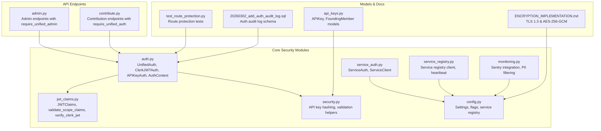
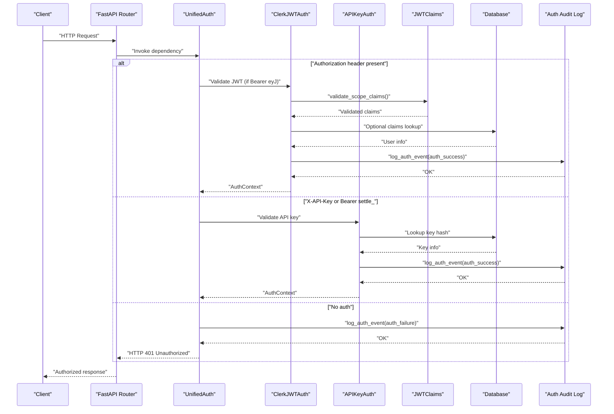
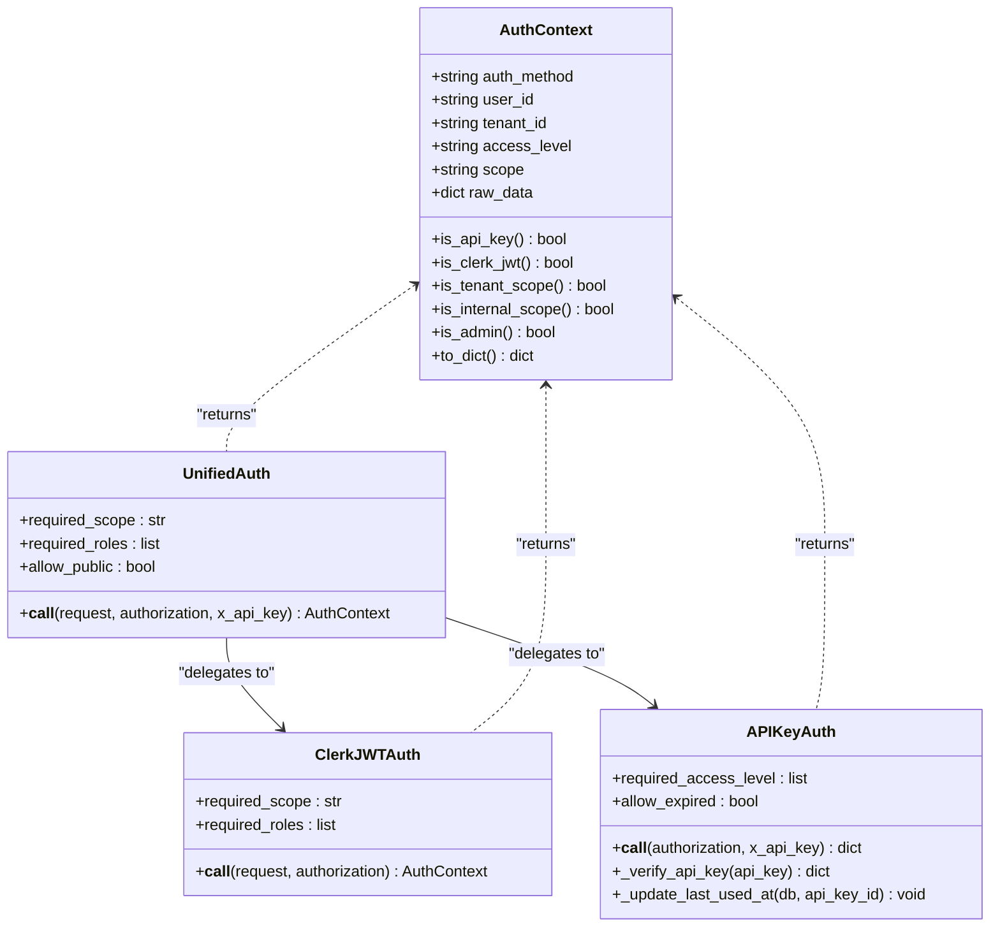
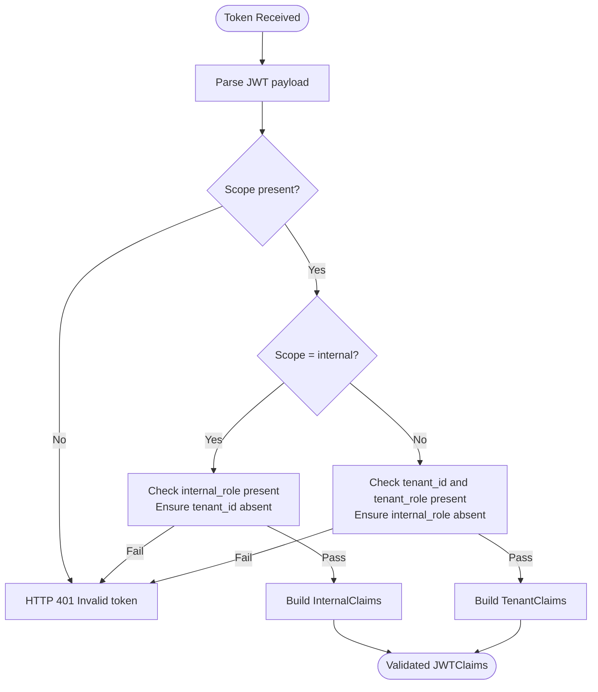
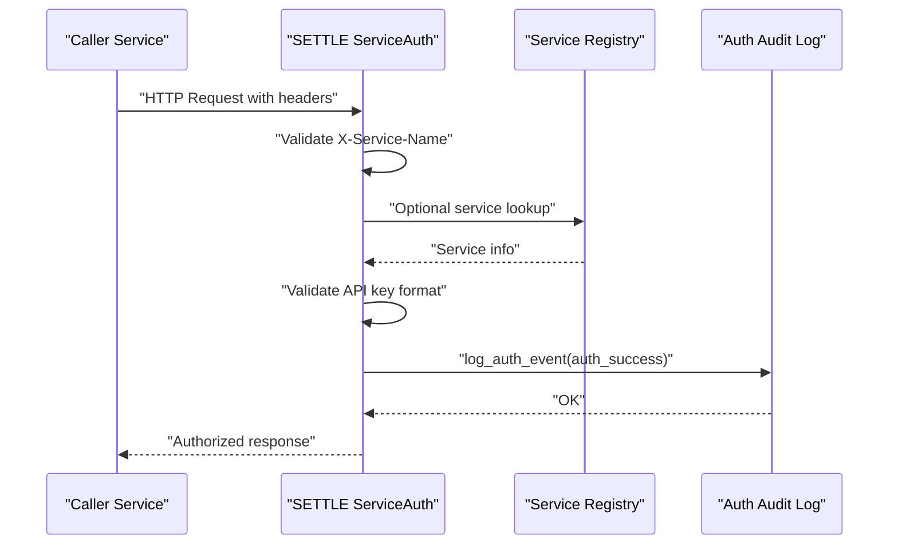
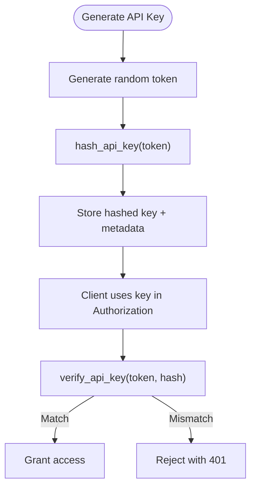
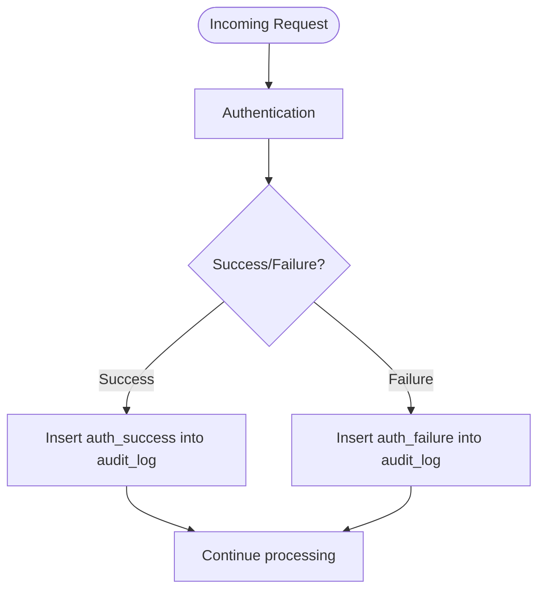
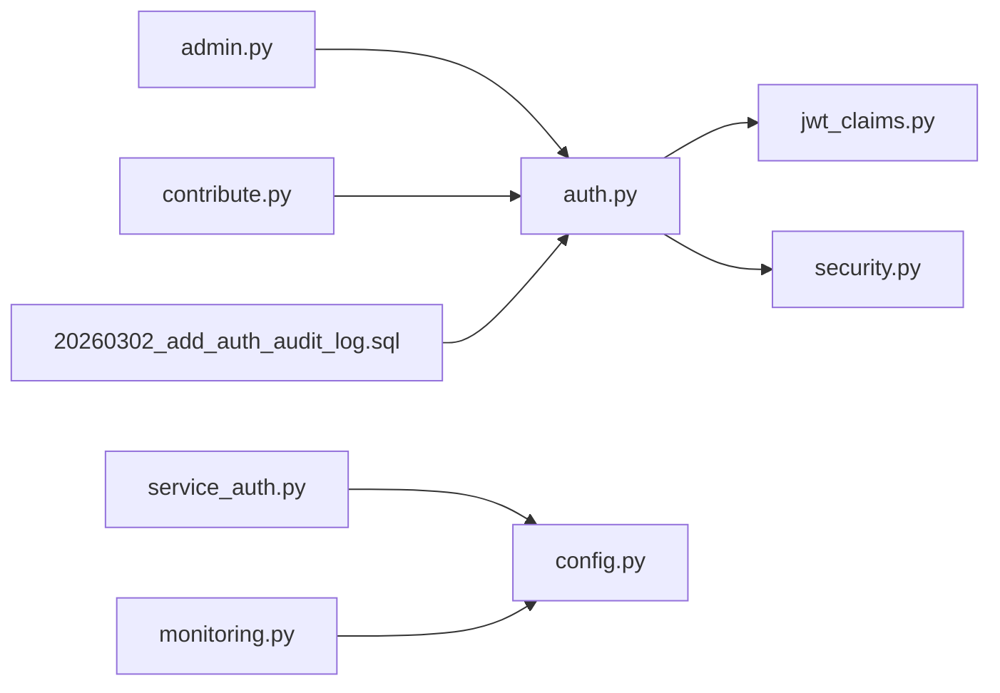

# Authentication & Security

<cite>
**Referenced Files in This Document**
- [auth.py](file://app/core/auth.py)
- [jwt_claims.py](file://app/core/jwt_claims.py)
- [security.py](file://app/core/security.py)
- [service_auth.py](file://app/core/service_auth.py)
- [config.py](file://app/core/config.py)
- [service_registry.py](file://app/core/service_registry.py)
- [monitoring.py](file://app/core/monitoring.py)
- [api_keys.py](file://app/models/api_keys.py)
- [admin.py](file://app/api/v1/endpoints/admin.py)
- [contribute.py](file://app/api/v1/endpoints/contribute.py)
- [ENCRYPTION_IMPLEMENTATION.md](file://docs/security/ENCRYPTION_IMPLEMENTATION.md)
- [test_route_protection.py](file://tests/security/test_route_protection.py)
- [20260302_add_auth_audit_log.sql](file://database/migrations/20260302_add_auth_audit_log.sql)
</cite>

## Table of Contents
1. [Introduction](#introduction)
2. [Project Structure](#project-structure)
3. [Core Components](#core-components)
4. [Architecture Overview](#architecture-overview)
5. [Detailed Component Analysis](#detailed-component-analysis)
6. [Dependency Analysis](#dependency-analysis)
7. [Performance Considerations](#performance-considerations)
8. [Troubleshooting Guide](#troubleshooting-guide)
9. [Conclusion](#conclusion)
10. [Appendices](#appendices)

## Introduction
This document provides comprehensive security documentation for the SETTLE Service authentication and access control systems. It covers the dual authentication architecture supporting both API keys and Clerk JWTs, service-to-service authentication, JWT claims processing, audit logging, encryption implementation, compliance requirements, and operational security practices. It also outlines best practices, threat mitigations, and incident response procedures aligned with TrueVow’s Security Contract v1.

## Project Structure
Security-related components are organized across core modules, API endpoints, models, and documentation:
- Core authentication and authorization: UnifiedAuth, ClerkJWTAuth, APIKeyAuth, AuthContext
- JWT claims and validation: JWTClaims, validate_scope_claims, verify_clerk_jwt
- Service-to-service authentication: ServiceAuth, ServiceClient
- Configuration and flags: Settings for auth modes, service auth, and monitoring
- Audit logging: Auth audit log table and logging helpers
- Encryption guidance: TLS 1.3 and AES-256-GCM implementation guide
- Monitoring and compliance: Sentry integration with PII filtering
- Security tests: Route protection and audit log schema validation

**Diagram sources**
- [auth.py:1-867](file://app/core/auth.py#L1-L867)
- [jwt_claims.py:1-327](file://app/core/jwt_claims.py#L1-L327)
- [security.py:1-208](file://app/core/security.py#L1-L208)
- [service_auth.py:1-376](file://app/core/service_auth.py#L1-L376)
- [config.py:1-351](file://app/core/config.py#L1-L351)
- [monitoring.py:1-306](file://app/core/monitoring.py#L1-L306)
- [service_registry.py:1-355](file://app/core/service_registry.py#L1-L355)
- [admin.py:1-756](file://app/api/v1/endpoints/admin.py#L1-L756)
- [contribute.py:1-164](file://app/api/v1/endpoints/contribute.py#L1-L164)
- [api_keys.py:1-147](file://app/models/api_keys.py#L1-L147)
- [ENCRYPTION_IMPLEMENTATION.md:1-814](file://docs/security/ENCRYPTION_IMPLEMENTATION.md#L1-L814)
- [test_route_protection.py:1-188](file://tests/security/test_route_protection.py#L1-L188)
- [20260302_add_auth_audit_log.sql:1-37](file://database/migrations/20260302_add_auth_audit_log.sql#L1-L37)

**Section sources**
- [auth.py:1-867](file://app/core/auth.py#L1-L867)
- [jwt_claims.py:1-327](file://app/core/jwt_claims.py#L1-L327)
- [security.py:1-208](file://app/core/security.py#L1-L208)
- [service_auth.py:1-376](file://app/core/service_auth.py#L1-L376)
- [config.py:1-351](file://app/core/config.py#L1-L351)
- [monitoring.py:1-306](file://app/core/monitoring.py#L1-L306)
- [service_registry.py:1-355](file://app/core/service_registry.py#L1-L355)
- [admin.py:1-756](file://app/api/v1/endpoints/admin.py#L1-L756)
- [contribute.py:1-164](file://app/api/v1/endpoints/contribute.py#L1-L164)
- [api_keys.py:1-147](file://app/models/api_keys.py#L1-L147)
- [ENCRYPTION_IMPLEMENTATION.md:1-814](file://docs/security/ENCRYPTION_IMPLEMENTATION.md#L1-L814)
- [test_route_protection.py:1-188](file://tests/security/test_route_protection.py#L1-L188)
- [20260302_add_auth_audit_log.sql:1-37](file://database/migrations/20260302_add_auth_audit_log.sql#L1-L37)

## Core Components
- Dual authentication architecture:
  - UnifiedAuth: Accepts either API key or Clerk JWT with configurable scope and roles.
  - ClerkJWTAuth: Validates Clerk JWTs, enforces scope and role checks, and logs events.
  - APIKeyAuth: Validates API keys, checks access level, expiry, and revocation.
  - AuthContext: Unified representation of authenticated identity and access attributes.
- JWT claims processing:
  - JWTClaims model supports both internal and tenant scopes with strict validation.
  - validate_scope_claims enforces scope-specific claim requirements.
  - verify_clerk_jwt is a placeholder for Clerk signature verification.
- Service-to-service authentication:
  - ServiceAuth validates service identity, required headers, and API key format.
  - ServiceClient encapsulates outbound service requests with standardized headers.
- Configuration and flags:
  - Settings controls AUTH_MODE, PERMISSION_FAIL_OPEN, service auth toggles, and monitoring.
- Audit logging:
  - Auth audit log table schema and logging helper ensure comprehensive audit trails.
- Encryption and compliance:
  - TLS 1.3 in transit and AES-256-GCM at rest guidance with cloud-native options.
- Monitoring and compliance:
  - Sentry integration with PII filtering and breadcrumbing for secure error reporting.

**Section sources**
- [auth.py:340-485](file://app/core/auth.py#L340-L485)
- [auth.py:165-334](file://app/core/auth.py#L165-L334)
- [auth.py:487-796](file://app/core/auth.py#L487-L796)
- [jwt_claims.py:41-223](file://app/core/jwt_claims.py#L41-L223)
- [jwt_claims.py:229-285](file://app/core/jwt_claims.py#L229-L285)
- [service_auth.py:20-181](file://app/core/service_auth.py#L20-L181)
- [service_auth.py:183-376](file://app/core/service_auth.py#L183-L376)
- [config.py:46-50](file://app/core/config.py#L46-L50)
- [config.py:315-318](file://app/core/config.py#L315-L318)
- [monitoring.py:85-132](file://app/core/monitoring.py#L85-L132)
- [20260302_add_auth_audit_log.sql:6-37](file://database/migrations/20260302_add_auth_audit_log.sql#L6-L37)

## Architecture Overview
The authentication system enforces a layered defense:
- Endpoint protection: All non-public routes depend on explicit authentication.
- Dual identity: Users authenticated via API key or Clerk JWT with unified context.
- Scope and role enforcement: Internal vs tenant scopes and role-based access.
- Service-to-service trust: Verified service identities and API keys for inter-service calls.
- Audit and observability: Comprehensive audit logging and error monitoring with PII safeguards.

**Diagram sources**
- [auth.py:370-485](file://app/core/auth.py#L370-L485)
- [auth.py:190-334](file://app/core/auth.py#L190-L334)
- [auth.py:513-627](file://app/core/auth.py#L513-L627)
- [jwt_claims.py:97-223](file://app/core/jwt_claims.py#L97-L223)
- [20260302_add_auth_audit_log.sql:6-37](file://database/migrations/20260302_add_auth_audit_log.sql#L6-L37)

## Detailed Component Analysis

### Dual Authentication Architecture
- UnifiedAuth orchestrates authentication selection and validation:
  - Detects API key (Bearer settle_xxx or X-API-Key) or JWT (Bearer eyJ...).
  - Delegates to APIKeyAuth or ClerkJWTAuth accordingly.
  - Supports allow_public for truly open endpoints.
- ClerkJWTAuth:
  - Enforces optional scope and role checks.
  - Logs auth outcomes and failures for audit.
- APIKeyAuth:
  - Validates format, checks expiry and revocation, and enforces access levels.
  - Updates last_used_at asynchronously to minimize latency.
- AuthContext:
  - Provides unified access to user_id, tenant_id, access_level, scope, and raw data for auditing.

**Diagram sources**
- [auth.py:96-158](file://app/core/auth.py#L96-L158)
- [auth.py:340-485](file://app/core/auth.py#L340-L485)
- [auth.py:165-334](file://app/core/auth.py#L165-L334)
- [auth.py:487-796](file://app/core/auth.py#L487-L796)

**Section sources**
- [auth.py:340-485](file://app/core/auth.py#L340-L485)
- [auth.py:165-334](file://app/core/auth.py#L165-L334)
- [auth.py:487-796](file://app/core/auth.py#L487-L796)

### JWT Claims Processing
- JWTClaims supports both internal and tenant scopes with required claims:
  - Internal: scope=internal, internal_role, optional org_id/internal_function.
  - Tenant: scope=tenant, tenant_id, tenant_role, optional org_id.
- validate_scope_claims enforces scope-specific rules and rejects malformed tokens.
- verify_clerk_jwt is currently a placeholder; production implementation should verify signatures and claims.

**Diagram sources**
- [jwt_claims.py:97-223](file://app/core/jwt_claims.py#L97-L223)
- [jwt_claims.py:229-285](file://app/core/jwt_claims.py#L229-L285)

**Section sources**
- [jwt_claims.py:41-223](file://app/core/jwt_claims.py#L41-L223)
- [jwt_claims.py:229-285](file://app/core/jwt_claims.py#L229-L285)

### Service-to-Service Authentication
- ServiceAuth validates:
  - Required headers: X-Service-Name, X-Request-ID, X-Request-Timestamp.
  - Authorized service names and optional role-based restrictions.
  - API key format (settle_...) and production verification hooks.
- ServiceClient standardizes outbound requests with:
  - Content-Type, X-Service-Name, X-Request-ID, X-Request-Timestamp.
  - Authorization header for service API key.
  - Robust error handling and timeouts.

**Diagram sources**
- [service_auth.py:53-181](file://app/core/service_auth.py#L53-L181)
- [service_registry.py:100-110](file://app/core/service_registry.py#L100-L110)
- [20260302_add_auth_audit_log.sql:6-37](file://database/migrations/20260302_add_auth_audit_log.sql#L6-L37)

**Section sources**
- [service_auth.py:20-181](file://app/core/service_auth.py#L20-L181)
- [service_auth.py:183-376](file://app/core/service_auth.py#L183-L376)
- [service_registry.py:47-110](file://app/core/service_registry.py#L47-L110)

### API Key Management
- Generation and hashing:
  - generate_api_key returns a new key and its hash using a salted SHA-256.
  - hash_api_key applies salt from settings for secure storage.
- Validation and usage:
  - verify_api_key uses constant-time comparison to prevent timing attacks.
  - APIKeyAuth enforces access levels, expiry, and revocation.
- Models:
  - APIKey and FoundingMember models define schema and validation rules for API keys and membership.

**Diagram sources**
- [security.py:23-66](file://app/core/security.py#L23-L66)
- [api_keys.py:11-41](file://app/models/api_keys.py#L11-L41)

**Section sources**
- [security.py:23-66](file://app/core/security.py#L23-L66)
- [api_keys.py:11-41](file://app/models/api_keys.py#L11-L41)

### Audit Logging and Compliance
- Auth audit log schema includes:
  - request_id, event_type, tenant_id, clerk_user_id, endpoint, method, IP, UA, auth_method, scope, permission_checked, response_status, details, created_at.
  - Row-level security policy for service_role.
- Logging helper:
  - log_auth_event inserts entries into the audit table and tolerates DB unavailability.
- Compliance:
  - Sentry integration filters PII and sensitive data before sending to monitoring systems.

**Diagram sources**
- [auth.py:34-90](file://app/core/auth.py#L34-L90)
- [20260302_add_auth_audit_log.sql:6-37](file://database/migrations/20260302_add_auth_audit_log.sql#L6-L37)
- [monitoring.py:85-132](file://app/core/monitoring.py#L85-L132)

**Section sources**
- [auth.py:34-90](file://app/core/auth.py#L34-L90)
- [20260302_add_auth_audit_log.sql:6-37](file://database/migrations/20260302_add_auth_audit_log.sql#L6-L37)
- [monitoring.py:85-132](file://app/core/monitoring.py#L85-L132)

### Encryption Implementation and Data Protection
- TLS 1.3 in transit:
  - Recommended reverse proxies (Nginx/Caddy) and managed platforms (Fly.io/AWS ALB).
  - Security headers and HSTS enforcement.
- AES-256-GCM at rest:
  - Cloud-native encryption (Supabase, AWS RDS with KMS, GCP Cloud SQL).
  - Optional client-side file encryption using AES-256-GCM with associated data.
- Key management:
  - Environment variables for development, Secrets Manager/Vault for production.
- Compliance:
  - HIPAA, CCPA, SOC 2 Type II readiness with encryption and audit.

**Section sources**
- [ENCRYPTION_IMPLEMENTATION.md:18-294](file://docs/security/ENCRYPTION_IMPLEMENTATION.md#L18-L294)
- [ENCRYPTION_IMPLEMENTATION.md:297-585](file://docs/security/ENCRYPTION_IMPLEMENTATION.md#L297-L585)
- [ENCRYPTION_IMPLEMENTATION.md:655-736](file://docs/security/ENCRYPTION_IMPLEMENTATION.md#L655-L736)

### Service Registry Integration and Heartbeat Monitoring
- ServiceRegistryClient:
  - Registers services, publishes modules, discovers services, and manages integrations.
  - Sends heartbeats periodically and handles graceful shutdown.
- HeartbeatTask:
  - Background task to maintain liveness with configurable intervals.
- Configuration:
  - SERVICE_REGISTRY_URL, SERVICE_HEARTBEAT_INTERVAL_S, and service auth flags.

**Section sources**
- [service_registry.py:47-244](file://app/core/service_registry.py#L47-L244)
- [config.py:51-54](file://app/core/config.py#L51-L54)
- [config.py:315-318](file://app/core/config.py#L315-L318)

### Endpoint-Level Security Patterns
- Admin endpoints:
  - require_unified_admin enforces admin-level access for sensitive operations.
- Contribution endpoints:
  - require_unified_auth protects contribution submission with dual auth.
- Public health endpoints:
  - Explicitly exposed without authentication for monitoring.

**Section sources**
- [admin.py:31-95](file://app/api/v1/endpoints/admin.py#L31-L95)
- [admin.py:146-272](file://app/api/v1/endpoints/admin.py#L146-L272)
- [contribute.py:51-135](file://app/api/v1/endpoints/contribute.py#L51-L135)

## Dependency Analysis
- Cohesion and coupling:
  - auth.py centralizes authentication logic and delegates to jwt_claims.py and security.py.
  - service_auth.py depends on config.py for service settings and uses httpx for client calls.
  - monitoring.py integrates with Sentry and filters sensitive data.
- External dependencies:
  - Clerk JWT verification (placeholder) and database access via Supabase-like interface.
  - Service registry via HTTP API with API key authentication.
- Potential risks:
  - verify_clerk_jwt placeholder must be implemented before production.
  - Service auth verification is not yet enforced in production (TODO comments).
  - Rate limiting and API key usage tracking are placeholders.

**Diagram sources**
- [auth.py:18-25](file://app/core/auth.py#L18-L25)
- [jwt_claims.py:8-14](file://app/core/jwt_claims.py#L8-L14)
- [security.py:15-16](file://app/core/security.py#L15-L16)
- [service_auth.py:15-16](file://app/core/service_auth.py#L15-L16)
- [config.py:14-16](file://app/core/config.py#L14-L16)
- [monitoring.py:14-16](file://app/core/monitoring.py#L14-L16)
- [admin.py:20-21](file://app/api/v1/endpoints/admin.py#L20-L21)
- [contribute.py:11-12](file://app/api/v1/endpoints/contribute.py#L11-L12)
- [20260302_add_auth_audit_log.sql:6-37](file://database/migrations/20260302_add_auth_audit_log.sql#L6-L37)

**Section sources**
- [auth.py:18-25](file://app/core/auth.py#L18-L25)
- [jwt_claims.py:8-14](file://app/core/jwt_claims.py#L8-L14)
- [security.py:15-16](file://app/core/security.py#L15-L16)
- [service_auth.py:15-16](file://app/core/service_auth.py#L15-L16)
- [config.py:14-16](file://app/core/config.py#L14-L16)
- [monitoring.py:14-16](file://app/core/monitoring.py#L14-L16)
- [admin.py:20-21](file://app/api/v1/endpoints/admin.py#L20-L21)
- [contribute.py:11-12](file://app/api/v1/endpoints/contribute.py#L11-L12)
- [20260302_add_auth_audit_log.sql:6-37](file://database/migrations/20260302_add_auth_audit_log.sql#L6-L37)

## Performance Considerations
- Asynchronous updates:
  - APIKeyAuth updates last_used_at in the background to avoid request latency.
- Minimal overhead:
  - AuthContext consolidates identity data to reduce repeated lookups.
- Monitoring:
  - Sentry sampling rates configurable to balance performance and observability.
- Recommendations:
  - Implement Clerk JWT verification to avoid placeholder overhead.
  - Add caching for frequently accessed service metadata.
  - Use connection pooling and async DB drivers for audit logging.

[No sources needed since this section provides general guidance]

## Troubleshooting Guide
- Authentication failures:
  - Missing or invalid Authorization/X-API-Key headers trigger 401 responses.
  - Scope mismatches and role checks produce 403 responses with detailed messages.
- Service auth issues:
  - Missing required headers (X-Service-Name, X-Request-ID) cause 400/403 errors.
  - Unauthorized service names are rejected with a list of authorized services.
- Audit logging:
  - If DB is unavailable, audit insertion is skipped but does not block requests.
  - Verify settle_auth_audit_log table exists and indexes are present.
- Security tests:
  - Route protection tests ensure all non-public routes have auth dependencies.
  - Auth mode guard and permission fail-open flag validation are enforced.

**Section sources**
- [auth.py:207-334](file://app/core/auth.py#L207-L334)
- [auth.py:466-484](file://app/core/auth.py#L466-L484)
- [service_auth.py:86-181](file://app/core/service_auth.py#L86-L181)
- [test_route_protection.py:22-73](file://tests/security/test_route_protection.py#L22-L73)
- [test_route_protection.py:152-187](file://tests/security/test_route_protection.py#L152-L187)
- [20260302_add_auth_audit_log.sql:6-37](file://database/migrations/20260302_add_auth_audit_log.sql#L6-L37)

## Conclusion
The SETTLE Service implements a robust dual authentication architecture with clear separation of concerns, comprehensive audit logging, and strong service-to-service trust boundaries. While Clerk JWT verification and service auth enforcement are placeholders for production, the foundational components and documentation provide a secure baseline. Adhering to the encryption and compliance guidance, maintaining strict route protection, and implementing the remaining security features will achieve production-grade security aligned with TrueVow’s Security Contract v1.

[No sources needed since this section summarizes without analyzing specific files]

## Appendices

### Best Practices and Threat Mitigations
- Always enforce explicit authentication on endpoints.
- Use HTTPS/TLS 1.3 and secure headers.
- Apply least privilege with scope and role checks.
- Protect against timing attacks with constant-time comparisons.
- Log all auth events and monitor anomalies.
- Regularly rotate encryption keys and audit access.

[No sources needed since this section provides general guidance]

### Security Incident Response Procedures
- Immediate actions:
  - Disable compromised API keys and revoke access.
  - Rotate encryption keys and reissue service API keys.
- Investigation:
  - Review auth audit logs for event_type, scope, and permission_checked.
  - Correlate with Sentry breadcrumbs and error events.
- Communication:
  - Notify affected tenants and stakeholders per compliance requirements.
  - Document remediation steps and timeline.

[No sources needed since this section provides general guidance]