# Encryption & Compliance

<cite>
**Referenced Files in This Document**
- [ENCRYPTION_IMPLEMENTATION.md](file://docs/security/ENCRYPTION_IMPLEMENTATION.md)
- [security.py](file://app/core/security.py)
- [config.py](file://app/core/config.py)
- [anonymizer.py](file://app/services/anonymizer.py)
- [test_anonymizer.py](file://tests/test_anonymizer.py)
- [test_route_protection.py](file://tests/security/test_route_protection.py)
- [20260302_add_auth_audit_log.sql](file://database/migrations/20260302_add_auth_audit_log.sql)
- [monitoring.py](file://app/core/monitoring.py)
- [admin.py](file://app/api/v1/endpoints/admin.py)
</cite>

## Table of Contents
1. [Introduction](#introduction)
2. [Project Structure](#project-structure)
3. [Core Components](#core-components)
4. [Architecture Overview](#architecture-overview)
5. [Detailed Component Analysis](#detailed-component-analysis)
6. [Dependency Analysis](#dependency-analysis)
7. [Performance Considerations](#performance-considerations)
8. [Troubleshooting Guide](#troubleshooting-guide)
9. [Conclusion](#conclusion)
10. [Appendices](#appendices)

## Introduction
This document provides comprehensive documentation for the encryption implementation and compliance requirements of the SETTLE Service. It covers encryption algorithms, key management, data protection measures, anonymization processes, privacy safeguards, audit logging, and compliance validation aligned with standards such as HIPAA and SOC 2 Type II. It also outlines integration points with external compliance frameworks and security certification processes.

## Project Structure
The encryption and compliance capabilities are implemented across several layers:
- Security configuration and API key authentication
- Anonymization validator for PHI/PII prevention
- Encryption implementation guide and reference code
- Audit logging schema and tests
- Monitoring hooks for sensitive data filtering

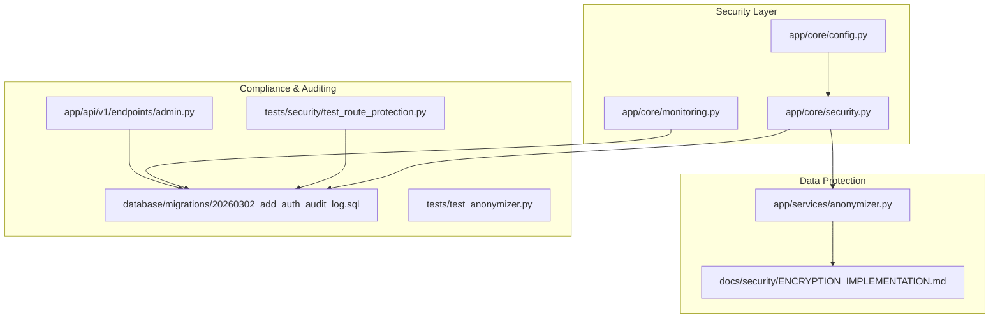

**Diagram sources**
- [config.py:1-351](file://app/core/config.py#L1-L351)
- [security.py:1-208](file://app/core/security.py#L1-L208)
- [monitoring.py:76-116](file://app/core/monitoring.py#L76-L116)
- [anonymizer.py:1-340](file://app/services/anonymizer.py#L1-L340)
- [ENCRYPTION_IMPLEMENTATION.md:1-814](file://docs/security/ENCRYPTION_IMPLEMENTATION.md#L1-L814)
- [20260302_add_auth_audit_log.sql:1-38](file://database/migrations/20260302_add_auth_audit_log.sql#L1-L38)
- [test_route_protection.py:1-188](file://tests/security/test_route_protection.py#L1-L188)
- [test_anonymizer.py:1-201](file://tests/test_anonymizer.py#L1-L201)
- [admin.py:682-725](file://app/api/v1/endpoints/admin.py#L682-L725)

**Section sources**
- [config.py:1-351](file://app/core/config.py#L1-L351)
- [security.py:1-208](file://app/core/security.py#L1-L208)
- [monitoring.py:76-116](file://app/core/monitoring.py#L76-L116)
- [anonymizer.py:1-340](file://app/services/anonymizer.py#L1-L340)
- [ENCRYPTION_IMPLEMENTATION.md:1-814](file://docs/security/ENCRYPTION_IMPLEMENTATION.md#L1-L814)
- [20260302_add_auth_audit_log.sql:1-38](file://database/migrations/20260302_add_auth_audit_log.sql#L1-L38)
- [test_route_protection.py:1-188](file://tests/security/test_route_protection.py#L1-L188)
- [test_anonymizer.py:1-201](file://tests/test_anonymizer.py#L1-L201)
- [admin.py:682-725](file://app/api/v1/endpoints/admin.py#L682-L725)

## Core Components
- TLS 1.3 in transit: Implemented via reverse proxy or managed platforms; documented with configuration examples and verification steps.
- AES-256-GCM at rest: Supported through cloud providers (Supabase, AWS RDS with KMS), local disk encryption (LUKS), and file-level encryption for reports/backups.
- Key management: Environment variables for development, AWS Secrets Manager or HashiCorp Vault for production, with rotation policies recommended.
- API key authentication: Strong bearer token validation with hashing and rate-limiting hooks.
- Anonymization validator: Regex-based detection of PHI/PII and enforcement of drop-down categories and bucketed ranges.
- Audit logging: Dedicated schema with indexes and row-level security; tests verify presence and required fields.
- Monitoring hooks: Filtering of sensitive data before reporting to error tracking systems.

**Section sources**
- [ENCRYPTION_IMPLEMENTATION.md:18-295](file://docs/security/ENCRYPTION_IMPLEMENTATION.md#L18-L295)
- [ENCRYPTION_IMPLEMENTATION.md:297-592](file://docs/security/ENCRYPTION_IMPLEMENTATION.md#L297-L592)
- [ENCRYPTION_IMPLEMENTATION.md:595-707](file://docs/security/ENCRYPTION_IMPLEMENTATION.md#L595-L707)
- [ENCRYPTION_IMPLEMENTATION.md:710-778](file://docs/security/ENCRYPTION_IMPLEMENTATION.md#L710-L778)
- [security.py:23-122](file://app/core/security.py#L23-L122)
- [anonymizer.py:17-340](file://app/services/anonymizer.py#L17-L340)
- [20260302_add_auth_audit_log.sql:6-38](file://database/migrations/20260302_add_auth_audit_log.sql#L6-L38)
- [monitoring.py:85-116](file://app/core/monitoring.py#L85-L116)

## Architecture Overview
The encryption and compliance architecture follows defense-in-depth:
- Transport security enforced at the edge (TLS 1.3).
- Data-at-rest protection through provider-managed encryption or local disk encryption.
- Application-layer encryption for sensitive files and backups.
- Strong identity and access controls via API keys and rate limits.
- Comprehensive audit logging and compliance monitoring.

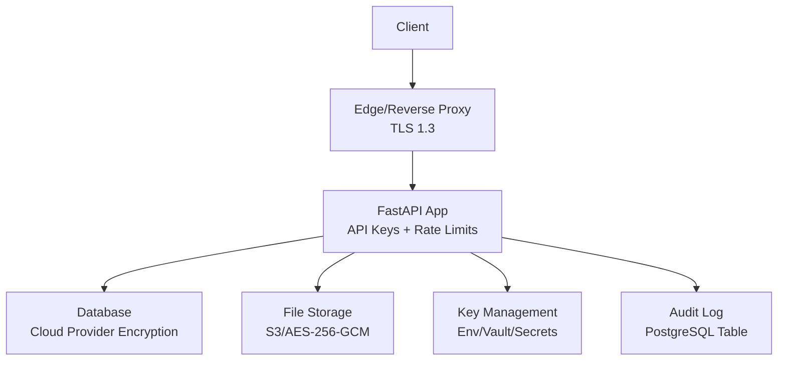

**Diagram sources**
- [ENCRYPTION_IMPLEMENTATION.md:30-220](file://docs/security/ENCRYPTION_IMPLEMENTATION.md#L30-L220)
- [ENCRYPTION_IMPLEMENTATION.md:381-470](file://docs/security/ENCRYPTION_IMPLEMENTATION.md#L381-L470)
- [ENCRYPTION_IMPLEMENTATION.md:595-651](file://docs/security/ENCRYPTION_IMPLEMENTATION.md#L595-L651)
- [ENCRYPTION_IMPLEMENTATION.md:655-707](file://docs/security/ENCRYPTION_IMPLEMENTATION.md#L655-L707)
- [security.py:68-122](file://app/core/security.py#L68-L122)
- [20260302_add_auth_audit_log.sql:6-38](file://database/migrations/20260302_add_auth_audit_log.sql#L6-L38)

## Detailed Component Analysis

### TLS 1.3 In Transit
- Implements TLS 1.3 with strong ciphers and HSTS.
- Supports reverse proxy (Nginx/Caddy), managed load balancers (AWS/GCP), and managed platforms (Fly.io/Heroic/Railway).
- Includes verification commands and expected outputs.

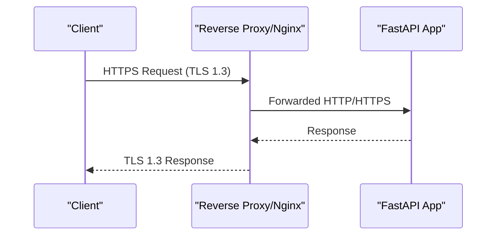

**Diagram sources**
- [ENCRYPTION_IMPLEMENTATION.md:30-220](file://docs/security/ENCRYPTION_IMPLEMENTATION.md#L30-L220)

**Section sources**
- [ENCRYPTION_IMPLEMENTATION.md:18-295](file://docs/security/ENCRYPTION_IMPLEMENTATION.md#L18-L295)

### AES-256-GCM At Rest
- Cloud provider encryption (Supabase, AWS RDS with KMS, GCP Cloud SQL) with automatic AES-256-GCM.
- Local disk encryption via LUKS with AES-XTS.
- File-level encryption using Python cryptography AESGCM for reports/backups.
- S3 encryption with server-side encryption and optional KMS.

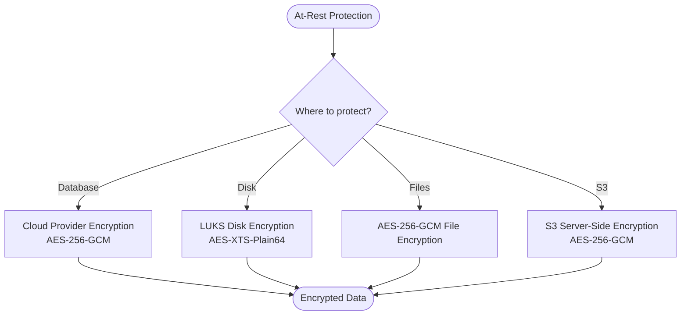

**Diagram sources**
- [ENCRYPTION_IMPLEMENTATION.md:297-592](file://docs/security/ENCRYPTION_IMPLEMENTATION.md#L297-L592)
- [ENCRYPTION_IMPLEMENTATION.md:595-651](file://docs/security/ENCRYPTION_IMPLEMENTATION.md#L595-L651)

**Section sources**
- [ENCRYPTION_IMPLEMENTATION.md:297-592](file://docs/security/ENCRYPTION_IMPLEMENTATION.md#L297-L592)
- [ENCRYPTION_IMPLEMENTATION.md:595-651](file://docs/security/ENCRYPTION_IMPLEMENTATION.md#L595-L651)

### Key Management
- Development: Environment variables for encryption keys.
- Production: AWS Secrets Manager or HashiCorp Vault.
- Rotation: Recommended cadence of 90 days.

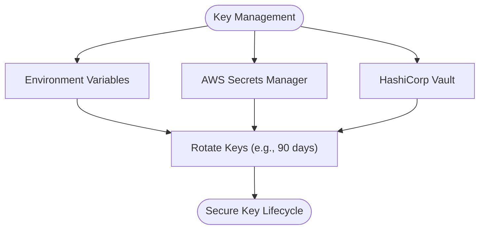

**Diagram sources**
- [ENCRYPTION_IMPLEMENTATION.md:655-707](file://docs/security/ENCRYPTION_IMPLEMENTATION.md#L655-L707)

**Section sources**
- [ENCRYPTION_IMPLEMENTATION.md:655-707](file://docs/security/ENCRYPTION_IMPLEMENTATION.md#L655-L707)

### API Key Authentication and Rate Limits
- Generates and hashes API keys.
- Validates Authorization header format and scheme.
- Provides hooks for rate limiting and founding member privileges.

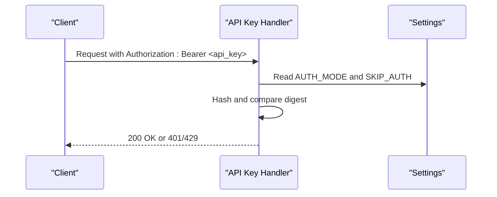

**Diagram sources**
- [security.py:23-122](file://app/core/security.py#L23-L122)
- [config.py:46-50](file://app/core/config.py#L46-L50)

**Section sources**
- [security.py:23-122](file://app/core/security.py#L23-L122)
- [config.py:46-50](file://app/core/config.py#L46-L50)

### Anonymization Validator
- Enforces strict rules to prevent PHI/PII.
- Detects SSNs, DOBs, phone numbers, emails, case numbers, MRNs, addresses, and specific business identifiers.
- Requires drop-down values and bucketed outcome ranges.
- Includes liability-language detection and sanitization for legacy data.

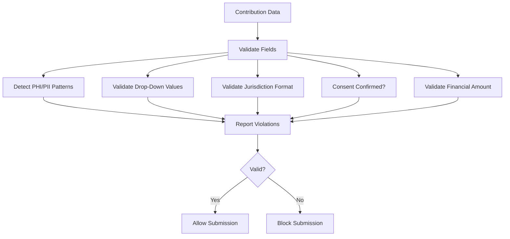

**Diagram sources**
- [anonymizer.py:92-181](file://app/services/anonymizer.py#L92-L181)

**Section sources**
- [anonymizer.py:17-340](file://app/services/anonymizer.py#L17-L340)
- [test_anonymizer.py:10-201](file://tests/test_anonymizer.py#L10-L201)

### Audit Logging Infrastructure
- Dedicated PostgreSQL table for auth audit logs with required fields and indexes.
- Row-level security and service role policy.
- Tests verify migration existence and required fields.

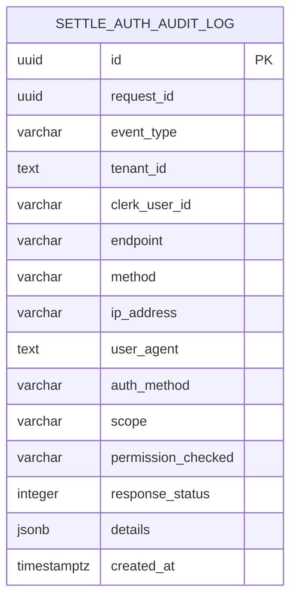

**Diagram sources**
- [20260302_add_auth_audit_log.sql:6-38](file://database/migrations/20260302_add_auth_audit_log.sql#L6-L38)

**Section sources**
- [20260302_add_auth_audit_log.sql:6-38](file://database/migrations/20260302_add_auth_audit_log.sql#L6-L38)
- [test_route_protection.py:152-187](file://tests/security/test_route_protection.py#L152-L187)

### Monitoring Hooks for Privacy
- Filters sensitive data (headers, query strings, request bodies) before sending events to error tracking systems.

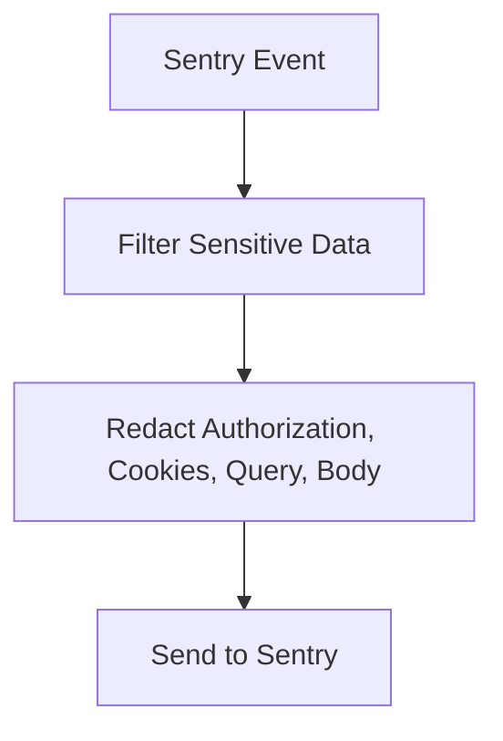

**Diagram sources**
- [monitoring.py:85-116](file://app/core/monitoring.py#L85-L116)

**Section sources**
- [monitoring.py:85-116](file://app/core/monitoring.py#L85-L116)

### Compliance Validation and Reporting
- HIPAA and SOC 2 Type II coverage checklist.
- Admin endpoints for compliance analytics and data quality metrics.

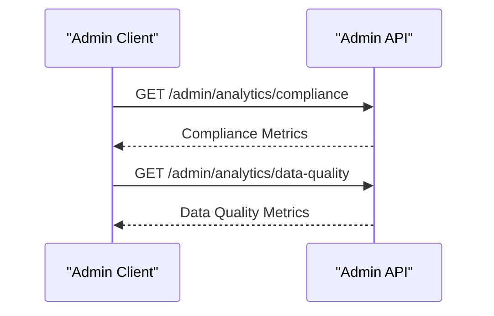

**Diagram sources**
- [admin.py:682-725](file://app/api/v1/endpoints/admin.py#L682-L725)

**Section sources**
- [ENCRYPTION_IMPLEMENTATION.md:781-795](file://docs/security/ENCRYPTION_IMPLEMENTATION.md#L781-L795)
- [admin.py:682-725](file://app/api/v1/endpoints/admin.py#L682-L725)

## Dependency Analysis
- Security depends on configuration settings for auth modes and flags.
- Anonymization validator is used by contribution ingestion flows.
- Audit logging is enforced by tests and database migrations.
- Monitoring hooks depend on Sentry SDK availability and configuration.

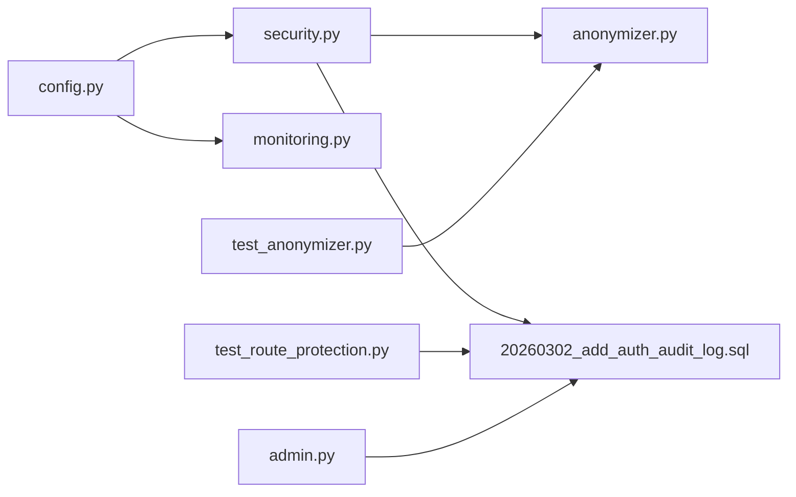

**Diagram sources**
- [config.py:46-50](file://app/core/config.py#L46-L50)
- [security.py:15-17](file://app/core/security.py#L15-L17)
- [monitoring.py:76-82](file://app/core/monitoring.py#L76-L82)
- [anonymizer.py:10-14](file://app/services/anonymizer.py#L10-L14)
- [20260302_add_auth_audit_log.sql:6-38](file://database/migrations/20260302_add_auth_audit_log.sql#L6-L38)
- [test_route_protection.py:152-187](file://tests/security/test_route_protection.py#L152-L187)
- [test_anonymizer.py:7-8](file://tests/test_anonymizer.py#L7-L8)
- [admin.py:682-725](file://app/api/v1/endpoints/admin.py#L682-L725)

**Section sources**
- [config.py:46-50](file://app/core/config.py#L46-L50)
- [security.py:15-17](file://app/core/security.py#L15-L17)
- [monitoring.py:76-82](file://app/core/monitoring.py#L76-L82)
- [anonymizer.py:10-14](file://app/services/anonymizer.py#L10-L14)
- [20260302_add_auth_audit_log.sql:6-38](file://database/migrations/20260302_add_auth_audit_log.sql#L6-L38)
- [test_route_protection.py:152-187](file://tests/security/test_route_protection.py#L152-L187)
- [test_anonymizer.py:7-8](file://tests/test_anonymizer.py#L7-L8)
- [admin.py:682-725](file://app/api/v1/endpoints/admin.py#L682-L725)

## Performance Considerations
- Prefer cloud provider encryption for minimal application overhead.
- Use AEAD ciphers (AES-GCM) for authenticated encryption with hardware acceleration support.
- Minimize audit log writes by batching where feasible.
- Apply rate limiting to reduce load while maintaining compliance.

## Troubleshooting Guide
- TLS 1.3 verification failures: Confirm reverse proxy configuration and certificate installation; use curl/openssl/nmap tests.
- Database encryption not enabled: Verify provider settings (Supabase, AWS RDS, GCP Cloud SQL) and KMS key configuration.
- File encryption errors: Ensure AESGCM key is present and correctly formatted; confirm nonce handling during encryption/decryption.
- API key validation failures: Check Authorization header format and scheme; verify environment flags for development vs. production.
- Anonymization violations: Review regex patterns and allowed dropdown lists; adjust submissions accordingly.
- Audit log table issues: Confirm migration ran and required fields exist; verify row-level security policies.

**Section sources**
- [ENCRYPTION_IMPLEMENTATION.md:265-294](file://docs/security/ENCRYPTION_IMPLEMENTATION.md#L265-L294)
- [ENCRYPTION_IMPLEMENTATION.md:440-448](file://docs/security/ENCRYPTION_IMPLEMENTATION.md#L440-L448)
- [ENCRYPTION_IMPLEMENTATION.md:587-592](file://docs/security/ENCRYPTION_IMPLEMENTATION.md#L587-L592)
- [security.py:85-122](file://app/core/security.py#L85-L122)
- [anonymizer.py:92-181](file://app/services/anonymizer.py#L92-L181)
- [test_route_protection.py:152-187](file://tests/security/test_route_protection.py#L152-L187)

## Conclusion
The SETTLE Service implements robust encryption and compliance controls across transport, data-at-rest, and application layers. It enforces strict anonymization, maintains comprehensive audit logs, and integrates privacy safeguards into monitoring. Adhering to the recommended configurations and operational procedures ensures alignment with HIPAA and SOC 2 Type II requirements.

## Appendices
- Compliance checklist and next steps are documented in the encryption implementation guide.

**Section sources**
- [ENCRYPTION_IMPLEMENTATION.md:739-807](file://docs/security/ENCRYPTION_IMPLEMENTATION.md#L739-L807)