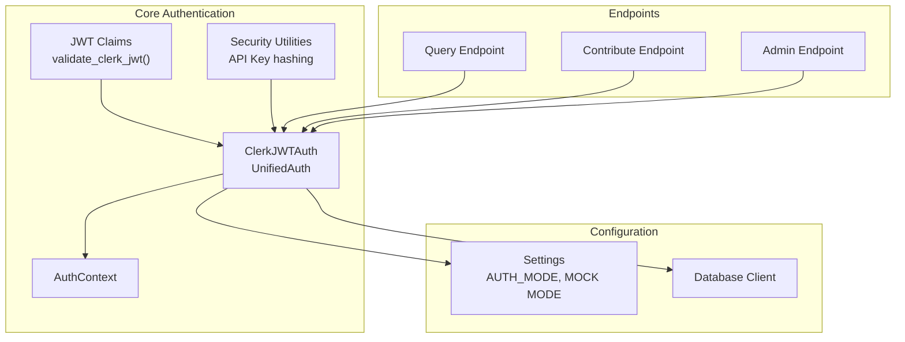
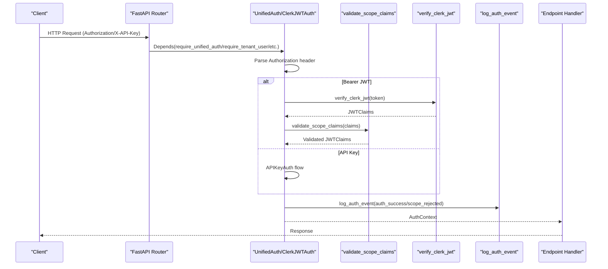
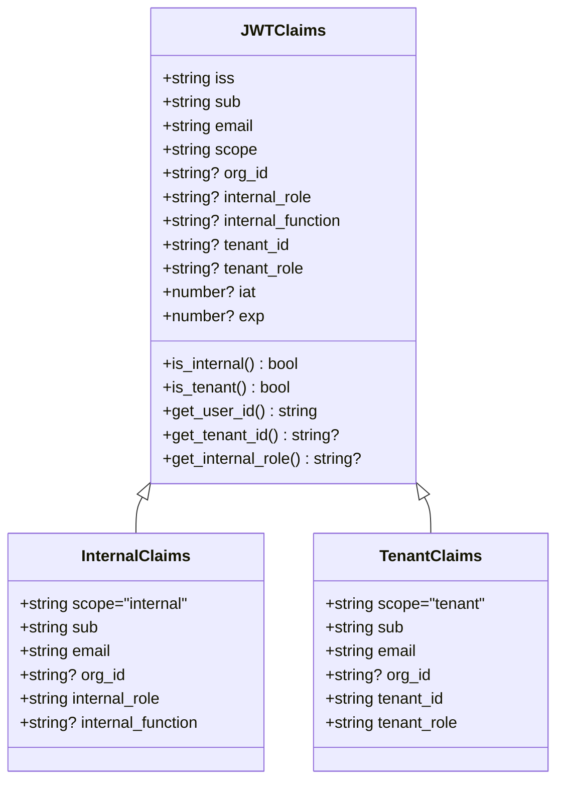
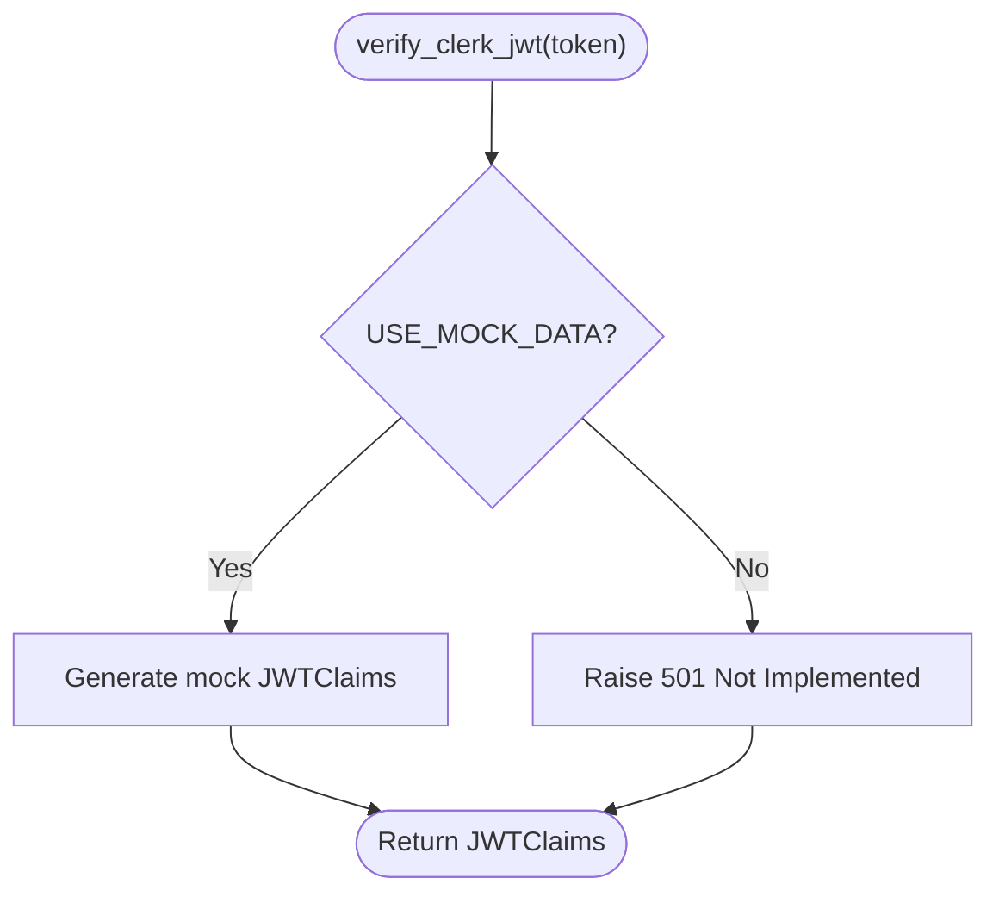
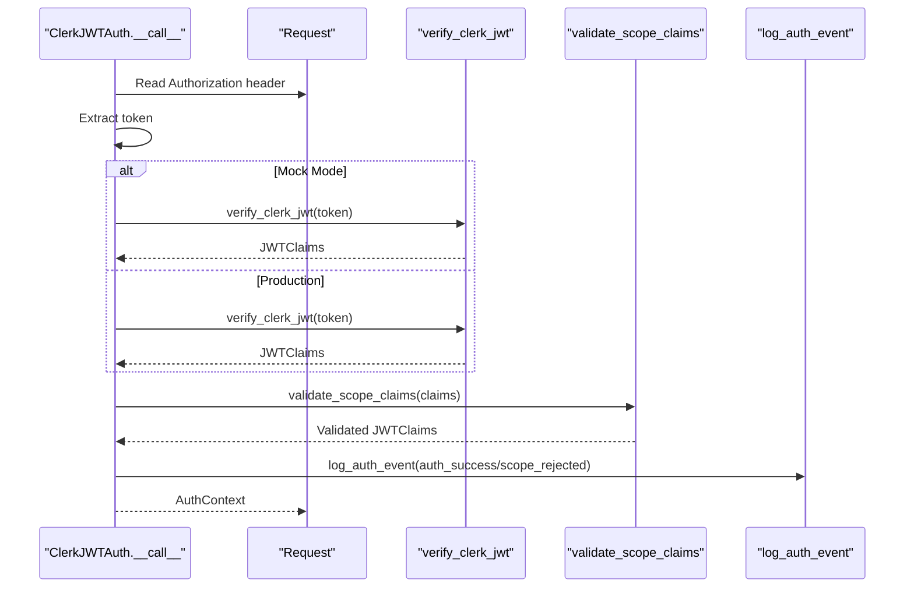
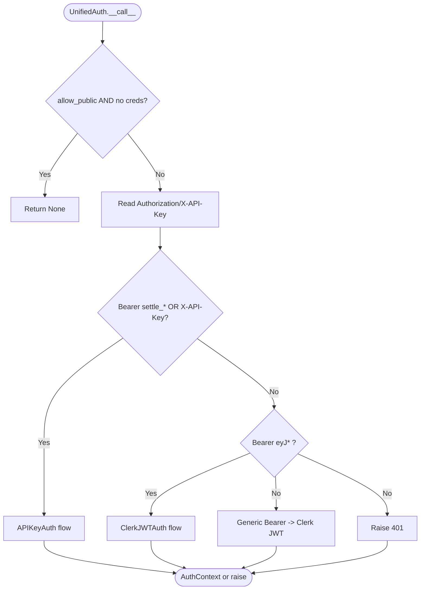
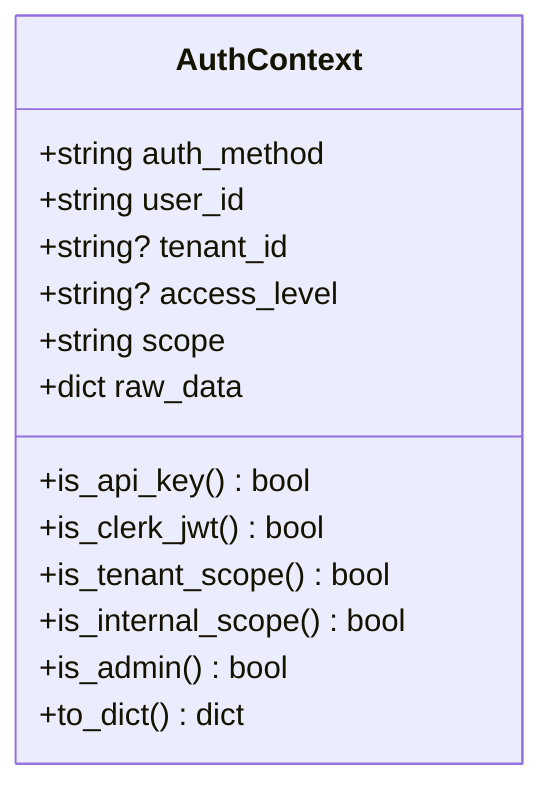
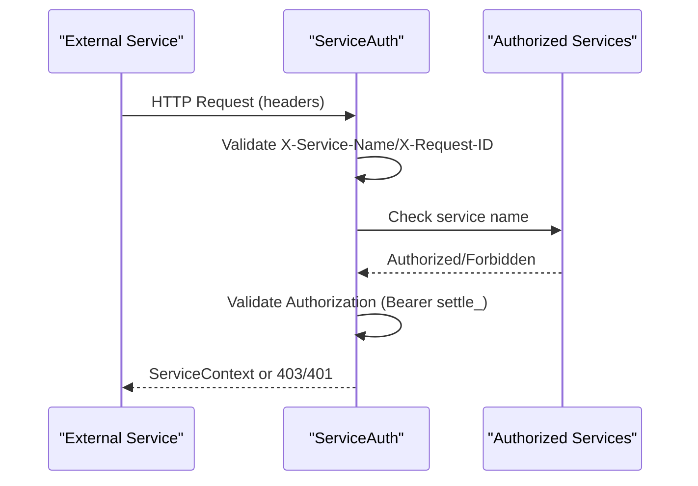
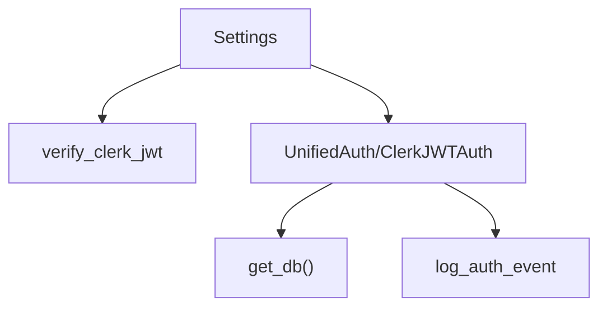

# JWT Authentication

<cite>
**Referenced Files in This Document**
- [jwt_claims.py](file://app/core/jwt_claims.py)
- [auth.py](file://app/core/auth.py)
- [service_auth.py](file://app/core/service_auth.py)
- [security.py](file://app/core/security.py)
- [config.py](file://app/core/config.py)
- [router.py](file://app/api/v1/router.py)
- [main.py](file://app/main.py)
- [query.py](file://app/api/v1/endpoints/query.py)
- [contribute.py](file://app/api/v1/endpoints/contribute.py)
- [admin.py](file://app/api/v1/endpoints/admin.py)
- [database.py](file://app/core/database.py)
- [test_route_protection.py](file://tests/security/test_route_protection.py)
</cite>

## Table of Contents
1. [Introduction](#introduction)
2. [Project Structure](#project-structure)
3. [Core Components](#core-components)
4. [Architecture Overview](#architecture-overview)
5. [Detailed Component Analysis](#detailed-component-analysis)
6. [Dependency Analysis](#dependency-analysis)
7. [Performance Considerations](#performance-considerations)
8. [Troubleshooting Guide](#troubleshooting-guide)
9. [Conclusion](#conclusion)
10. [Appendices](#appendices)

## Introduction
This document explains the Clerk JWT authentication system for the SETTLE Service. It covers JWT verification, claim validation, scope-based access control, tenant context extraction, and role-based authorization. It also documents integration patterns with Clerk authentication, tenant isolation, and internal service authentication. The system supports dual authentication modes: Clerk JWT for customer portal and internal operations, and legacy API keys for existing integrations.

## Project Structure
The authentication system spans several modules:
- JWT claims and validation logic
- Clerk JWT authentication dependency
- Unified authentication supporting both API keys and Clerk JWT
- Service-to-service authentication
- Configuration and security controls
- Endpoint usage examples

**Diagram sources**
- [jwt_claims.py:1-327](file://app/core/jwt_claims.py#L1-L327)
- [auth.py:165-334](file://app/core/auth.py#L165-L334)
- [auth.py:340-485](file://app/core/auth.py#L340-L485)
- [security.py:1-208](file://app/core/security.py#L1-L208)
- [config.py:23-351](file://app/core/config.py#L23-L351)
- [database.py:412-463](file://app/core/database.py#L412-L463)

**Section sources**
- [router.py:1-26](file://app/api/v1/router.py#L1-L26)
- [main.py:1-157](file://app/main.py#L1-L157)

## Core Components
- JWTClaims: Unified model for both internal and tenant scopes with helpers to determine scope and extract identifiers.
- validate_scope_claims: Enforces scope-specific claim rules (presence of required claims, mutual exclusivity).
- verify_clerk_jwt: Placeholder for Clerk JWT signature verification; includes mock mode for testing.
- ClerkJWTAuth: FastAPI dependency that validates Clerk JWT, enforces scope and role requirements, logs auth events, and produces AuthContext.
- UnifiedAuth: FastAPI dependency that accepts either API Key or Clerk JWT, with optional scope and role enforcement.
- AuthContext: Unified representation of authenticated identity across both auth methods.
- ServiceAuth: Service-to-service authentication enforcing authorized callers and API key validation.
- Security utilities: API key generation, hashing, and verification helpers.
- Configuration: AUTH_MODE guard, mock mode flags, and service integration settings.

**Section sources**
- [jwt_claims.py:41-91](file://app/core/jwt_claims.py#L41-L91)
- [jwt_claims.py:97-223](file://app/core/jwt_claims.py#L97-L223)
- [jwt_claims.py:229-285](file://app/core/jwt_claims.py#L229-L285)
- [auth.py:165-334](file://app/core/auth.py#L165-L334)
- [auth.py:340-485](file://app/core/auth.py#L340-L485)
- [service_auth.py:20-181](file://app/core/service_auth.py#L20-L181)
- [security.py:23-66](file://app/core/security.py#L23-L66)
- [config.py:46-49](file://app/core/config.py#L46-L49)
- [config.py:322-334](file://app/core/config.py#L322-L334)

## Architecture Overview
The authentication architecture integrates Clerk JWT and API key authentication under a unified framework. Clerk JWT is validated and transformed into an AuthContext. API keys are supported for backward compatibility. Service-to-service authentication is handled separately with dedicated headers and API keys.

**Diagram sources**
- [auth.py:340-485](file://app/core/auth.py#L340-L485)
- [auth.py:165-334](file://app/core/auth.py#L165-L334)
- [jwt_claims.py:97-223](file://app/core/jwt_claims.py#L97-L223)
- [jwt_claims.py:229-285](file://app/core/jwt_claims.py#L229-L285)

## Detailed Component Analysis

### JWT Claims and Validation
- JWTClaims encapsulates both internal and tenant scopes with optional fields. Helpers determine scope and extract identifiers.
- validate_scope_claims enforces strict rules:
  - Scope presence is mandatory.
  - Internal scope requires internal_role and disallows tenant_id.
  - Tenant scope requires tenant_id and tenant_role, and disallows internal_role.
  - Invalid scope raises an authentication error.
- get_tenant_context extracts a normalized context for audit logging.

**Diagram sources**
- [jwt_claims.py:21-41](file://app/core/jwt_claims.py#L21-L41)
- [jwt_claims.py:41-91](file://app/core/jwt_claims.py#L41-L91)

**Section sources**
- [jwt_claims.py:21-91](file://app/core/jwt_claims.py#L21-L91)
- [jwt_claims.py:97-223](file://app/core/jwt_claims.py#L97-L223)
- [jwt_claims.py:292-327](file://app/core/jwt_claims.py#L292-L327)

### Clerk JWT Verification Workflow
- verify_clerk_jwt is currently a placeholder. In mock mode, it returns deterministic claims based on token content to facilitate testing.
- In production, the implementation should:
  - Fetch Clerk JWKS from the Clerk domain.
  - Verify JWT signature using the public key.
  - Validate issuer, audience, and expiration claims.
- The current implementation raises a "not implemented" error in production mode.

**Diagram sources**
- [jwt_claims.py:229-285](file://app/core/jwt_claims.py#L229-L285)

**Section sources**
- [jwt_claims.py:229-285](file://app/core/jwt_claims.py#L229-L285)

### Clerk JWT Authentication Dependency
- ClerkJWTAuth validates Clerk JWTs from the Authorization header:
  - Extracts token, optionally stripping "Bearer ".
  - In mock mode, accepts any token and parses it for testing.
  - In production, delegates to verify_clerk_jwt (currently not implemented).
  - Enforces required_scope if specified.
  - Enforces required_roles if specified.
  - Logs auth events for failures and successes.
  - Produces AuthContext with user_id, tenant_id, access_level, scope, and email.

**Diagram sources**
- [auth.py:165-334](file://app/core/auth.py#L165-L334)
- [jwt_claims.py:97-223](file://app/core/jwt_claims.py#L97-L223)
- [jwt_claims.py:229-285](file://app/core/jwt_claims.py#L229-L285)

**Section sources**
- [auth.py:165-334](file://app/core/auth.py#L165-L334)

### Unified Authentication (API Key or Clerk JWT)
- UnifiedAuth determines the auth method from headers:
  - If Authorization starts with "Bearer settle_" or X-API-Key present → API Key.
  - If Authorization starts with "Bearer eyJ" → Clerk JWT.
  - Otherwise → error unless allow_public is True.
- Supports required_scope and required_roles for JWT, and required_access_level for API Key.
- Provides convenience dependencies:
  - require_unified_auth: any authenticated user.
  - require_unified_admin: admin-level access.
  - require_tenant_user: tenant-scoped users.
  - require_internal_user: internal employees.

**Diagram sources**
- [auth.py:340-485](file://app/core/auth.py#L340-L485)

**Section sources**
- [auth.py:340-485](file://app/core/auth.py#L340-L485)

### Role-Based Authorization and Scope Control
- Scope enforcement:
  - require_tenant_user enforces scope="tenant".
  - require_internal_user enforces scope="internal".
- Role enforcement:
  - For tenant scope: tenant_role used for access checks.
  - For internal scope: internal_role used for access checks.
- Admin determination:
  - For API Key: access_level must be "admin".
  - For Clerk JWT: admin roles include "admin" and "billing_admin" for tenants, and "director", "manager", "admin" for internals.

**Diagram sources**
- [auth.py:96-159](file://app/core/auth.py#L96-L159)

**Section sources**
- [auth.py:96-159](file://app/core/auth.py#L96-L159)
- [auth.py:137-148](file://app/core/auth.py#L137-L148)

### Service-to-Service Authentication
- ServiceAuth validates inbound service requests:
  - Requires X-Service-Name, X-Request-ID, and Authorization headers.
  - Validates service name against an authorized list.
  - Optionally restricts to specific services.
  - Accepts any properly formatted API key in mock mode; production verification is pending.
- ServiceClient provides standardized headers and error handling for outbound service calls.

**Diagram sources**
- [service_auth.py:20-181](file://app/core/service_auth.py#L20-L181)

**Section sources**
- [service_auth.py:20-181](file://app/core/service_auth.py#L20-L181)

### API Key Authentication and Security Utilities
- API key generation and hashing:
  - generate_api_key returns a random key and its hash.
  - hash_api_key applies a salted SHA-256.
  - verify_api_key compares digests securely.
- APIKeyAuth dependency:
  - Validates Authorization header or X-API-Key.
  - Supports required_access_level and optional allow_expired.
  - Performs database lookup in production (placeholder in current code).
- Security contract compliance:
  - All auth events are logged to an audit trail.
  - AUTH_MODE must be "clerk" in production.

**Section sources**
- [security.py:23-66](file://app/core/security.py#L23-L66)
- [auth.py:487-796](file://app/core/auth.py#L487-L796)
- [main.py:42-49](file://app/main.py#L42-L49)

### Endpoint Integration Examples
- Query endpoint demonstrates:
  - Using require_unified_auth to accept either API Key or Clerk JWT.
  - Logging authenticated user and scope for audit.
- Contribute endpoint demonstrates:
  - Using require_unified_auth with tenant context.
  - Emitting behavioral events with tenant/user context.
- Admin endpoints demonstrate:
  - require_unified_admin for admin-level access.
  - Comprehensive administrative workflows.

**Section sources**
- [query.py:20-108](file://app/api/v1/endpoints/query.py#L20-L108)
- [contribute.py:51-135](file://app/api/v1/endpoints/contribute.py#L51-L135)
- [admin.py:31-272](file://app/api/v1/endpoints/admin.py#L31-L272)

## Dependency Analysis
- Configuration-driven behavior:
  - AUTH_MODE guard prevents local auth in production.
  - USE_MOCK_DATA enables mock JWT and API key behavior for testing.
- Database integration:
  - get_db provides a REST client abstraction; many auth flows return None in mock mode.
- Audit logging:
  - log_auth_event persists auth events to a dedicated audit table.

**Diagram sources**
- [config.py:46-49](file://app/core/config.py#L46-L49)
- [config.py:322-334](file://app/core/config.py#L322-L334)
- [jwt_claims.py:229-285](file://app/core/jwt_claims.py#L229-L285)
- [auth.py:340-485](file://app/core/auth.py#L340-L485)
- [database.py:412-463](file://app/core/database.py#L412-L463)

**Section sources**
- [config.py:46-49](file://app/core/config.py#L46-L49)
- [config.py:322-334](file://app/core/config.py#L322-L334)
- [database.py:412-463](file://app/core/database.py#L412-L463)

## Performance Considerations
- Mock mode simplifies testing but bypasses real verification.
- Database operations are retried with exponential backoff where appropriate.
- Audit logging is performed asynchronously where possible to minimize latency.
- Consider caching verified JWT metadata and implementing efficient JWKS retrieval in production.

## Troubleshooting Guide
- Missing Authorization header:
  - Clerk JWT flow returns 401 with WWW-Authenticate header.
- Invalid JWT:
  - verify_clerk_jwt raises 401; production mode currently raises 501 due to unimplemented verification.
- Scope mismatch:
  - 403 when required_scope does not match JWT scope.
- Role mismatch:
  - 403 when required_roles do not include the user's role.
- API key issues:
  - 401 for missing or invalid API key; 403 for insufficient access level.
- Security contract compliance:
  - AUTH_MODE must be "clerk" in production; otherwise startup fails.
  - Audit log table migration must exist and contain required fields.

**Section sources**
- [auth.py:208-248](file://app/core/auth.py#L208-L248)
- [auth.py:250-304](file://app/core/auth.py#L250-L304)
- [jwt_claims.py:282-285](file://app/core/jwt_claims.py#L282-L285)
- [main.py:42-49](file://app/main.py#L42-L49)
- [test_route_protection.py:116-147](file://tests/security/test_route_protection.py#L116-L147)

## Conclusion
The SETTLE Service implements a robust, dual-mode authentication system supporting Clerk JWT and legacy API keys. JWT claims are validated rigorously by scope and role, with tenant isolation and internal employee differentiation. The system enforces security contracts, logs all auth events, and provides service-to-service authentication for enterprise integration. While Clerk JWT signature verification remains pending, the modular design facilitates secure production deployment.

## Appendices

### Example Usage Patterns
- JWT Token Usage:
  - Authorization: Bearer eyJ...
  - Scope enforcement: require_tenant_user or require_internal_user
  - Role enforcement: require_unified_admin
- Scope Validation:
  - require_tenant_user enforces scope="tenant"
  - require_internal_user enforces scope="internal"
- Role-Based Access Checks:
  - Admin roles: "admin" (tenant), "director"/"manager"/"admin" (internal)
  - Access level checks via API Key dependencies

**Section sources**
- [auth.py:836-863](file://app/core/auth.py#L836-L863)
- [auth.py:137-148](file://app/core/auth.py#L137-L148)