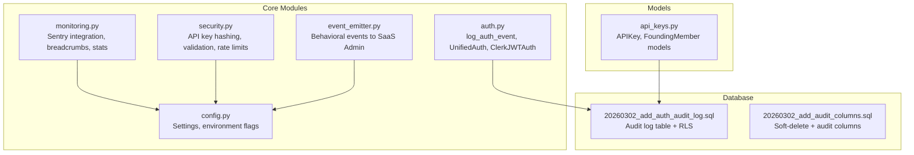
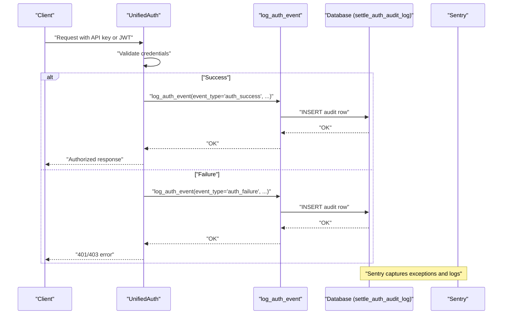
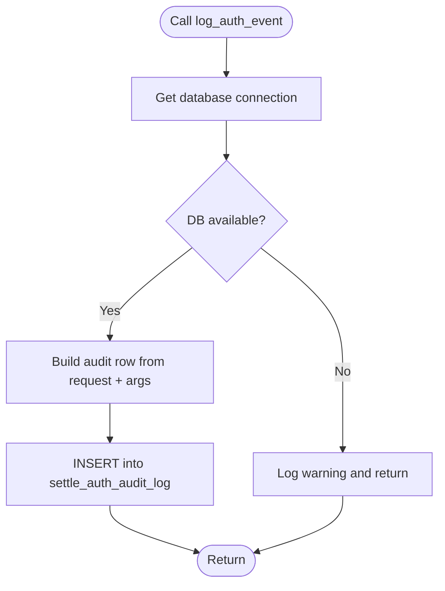
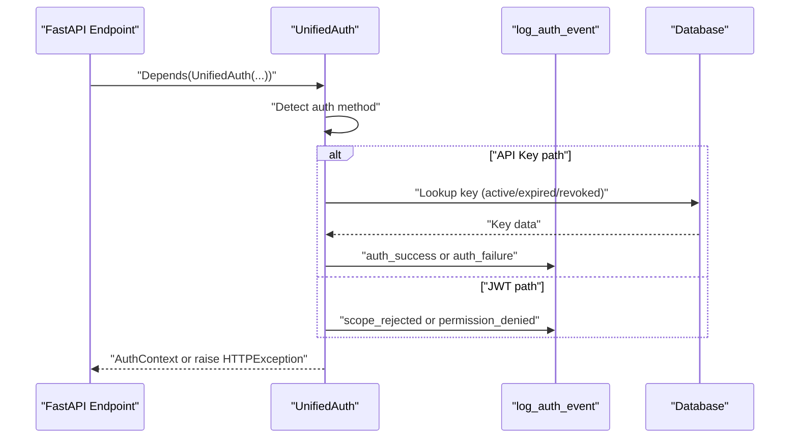
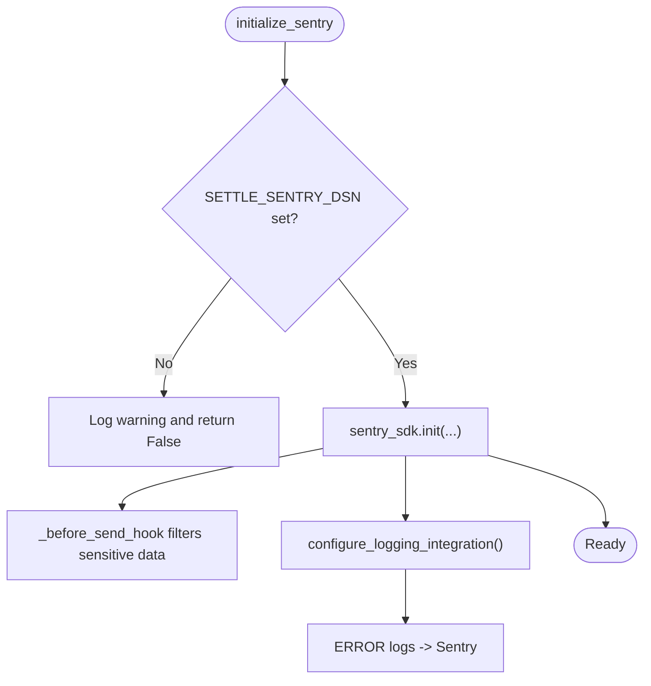
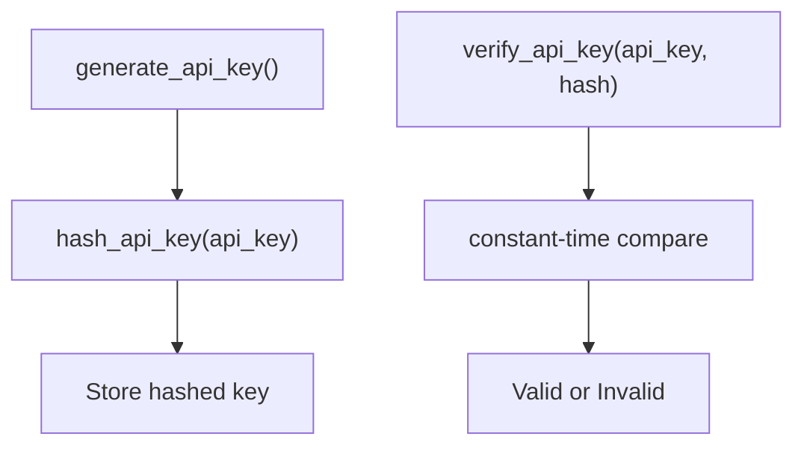
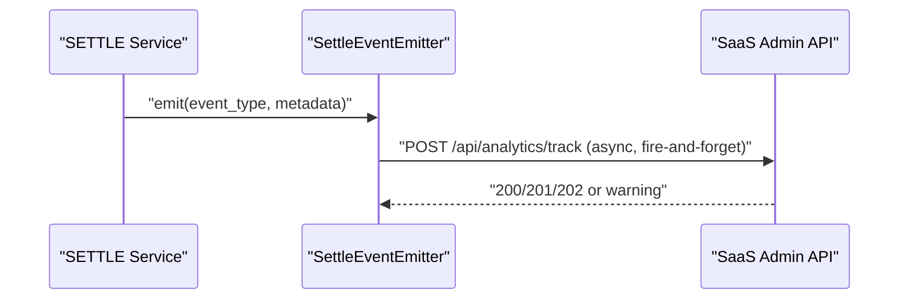
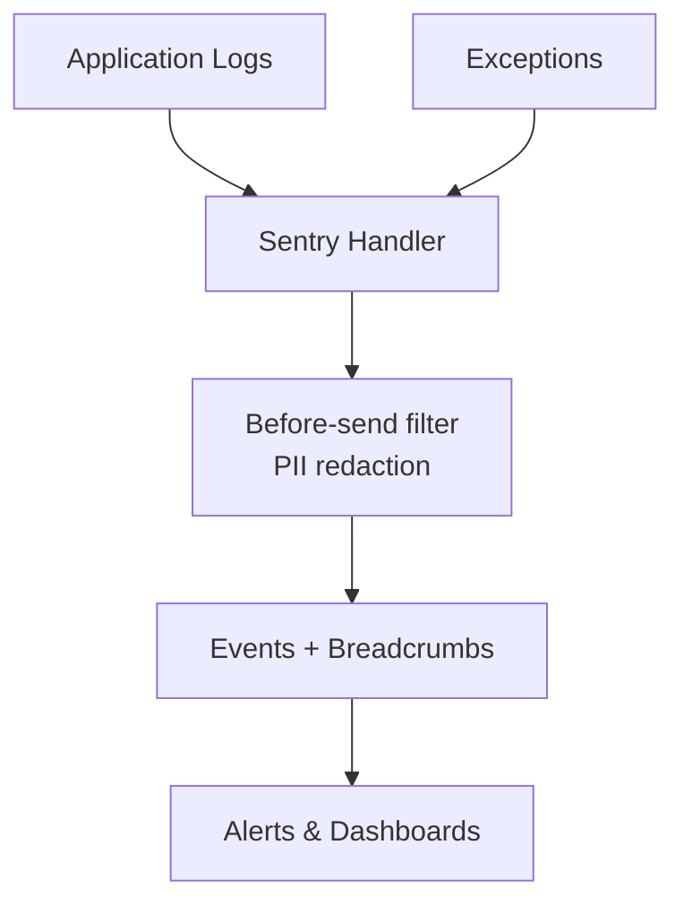
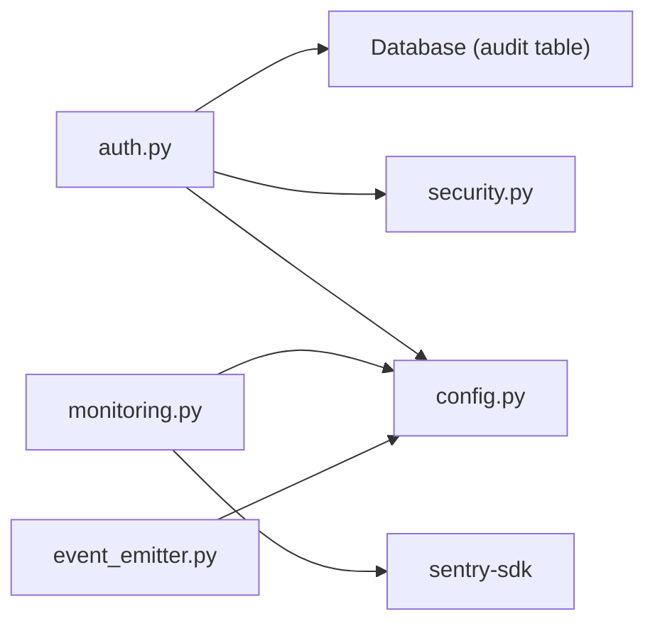

# Security Audit & Logging

<cite>
**Referenced Files in This Document**
- [auth.py](file://app/core/auth.py)
- [monitoring.py](file://app/core/monitoring.py)
- [security.py](file://app/core/security.py)
- [config.py](file://app/core/config.py)
- [20260302_add_auth_audit_log.sql](file://database/migrations/20260302_add_auth_audit_log.sql)
- [20260302_add_audit_columns.sql](file://database/migrations/20260302_add_audit_columns.sql)
- [api_keys.py](file://app/models/api_keys.py)
- [event_emitter.py](file://app/core/event_emitter.py)
- [test_route_protection.py](file://tests/security/test_route_protection.py)
- [ENCRYPTION_IMPLEMENTATION.md](file://docs/security/ENCRYPTION_IMPLEMENTATION.md)
</cite>

## Table of Contents
1. [Introduction](#introduction)
2. [Project Structure](#project-structure)
3. [Core Components](#core-components)
4. [Architecture Overview](#architecture-overview)
5. [Detailed Component Analysis](#detailed-component-analysis)
6. [Dependency Analysis](#dependency-analysis)
7. [Performance Considerations](#performance-considerations)
8. [Troubleshooting Guide](#troubleshooting-guide)
9. [Conclusion](#conclusion)
10. [Appendices](#appendices)

## Introduction
This document describes the security audit logging and monitoring systems for the SETTLE service. It focuses on the log_auth_event function, audit trail requirements, and security event tracking aligned with TrueVow Security Contract v1. It also explains event categorization, data retention policies, the audit log schema, security incident detection, and monitoring integration. Examples of audit log entries and security event types are included, along with compliance reporting guidance and integration with external monitoring systems.

## Project Structure
The security and audit logging capabilities are implemented across several modules:
- Authentication and audit logging: app/core/auth.py
- Monitoring and error tracking: app/core/monitoring.py
- API key security utilities: app/core/security.py
- Configuration: app/core/config.py
- Audit log schema and RLS: database/migrations/20260302_add_auth_audit_log.sql
- Audit columns migration: database/migrations/20260302_add_audit_columns.sql
- API key models: app/models/api_keys.py
- Behavioral event emission: app/core/event_emitter.py
- Security contract compliance tests: tests/security/test_route_protection.py
- Encryption and transport security: docs/security/ENCRYPTION_IMPLEMENTATION.md

**Diagram sources**
- [auth.py:34-90](file://app/core/auth.py#L34-L90)
- [monitoring.py:14-306](file://app/core/monitoring.py#L14-L306)
- [security.py:23-208](file://app/core/security.py#L23-L208)
- [config.py:23-351](file://app/core/config.py#L23-L351)
- [20260302_add_auth_audit_log.sql:1-38](file://database/migrations/20260302_add_auth_audit_log.sql#L1-L38)
- [20260302_add_audit_columns.sql:1-157](file://database/migrations/20260302_add_audit_columns.sql#L1-L157)
- [api_keys.py:11-147](file://app/models/api_keys.py#L11-L147)
- [event_emitter.py:44-88](file://app/core/event_emitter.py#L44-L88)

**Section sources**
- [auth.py:1-867](file://app/core/auth.py#L1-L867)
- [monitoring.py:1-306](file://app/core/monitoring.py#L1-L306)
- [security.py:1-208](file://app/core/security.py#L1-L208)
- [config.py:1-351](file://app/core/config.py#L1-L351)
- [20260302_add_auth_audit_log.sql:1-38](file://database/migrations/20260302_add_auth_audit_log.sql#L1-L38)
- [20260302_add_audit_columns.sql:1-157](file://database/migrations/20260302_add_audit_columns.sql#L1-L157)
- [api_keys.py:1-147](file://app/models/api_keys.py#L1-L147)
- [event_emitter.py:1-88](file://app/core/event_emitter.py#L1-L88)

## Core Components
- Audit logging function: log_auth_event writes authentication events to settle_auth_audit_log with fields for request context, identity, scope, and outcome.
- Authentication pipeline: UnifiedAuth supports both API key and Clerk JWT, invoking log_auth_event on success and failure.
- Monitoring integration: Sentry initialization, filtering, breadcrumbs, and automatic logging handler.
- Configuration flags: AUTH_MODE, PERMISSION_FAIL_OPEN, and environment-aware behavior.
- Audit schema: Database migration defines the audit log table with indexes and row-level security.
- Behavioral events: SettleEventEmitter emits feature-level events to SaaS Admin without blocking the main operation.

**Section sources**
- [auth.py:34-90](file://app/core/auth.py#L34-L90)
- [auth.py:340-485](file://app/core/auth.py#L340-L485)
- [monitoring.py:14-306](file://app/core/monitoring.py#L14-L306)
- [config.py:46-50](file://app/core/config.py#L46-L50)
- [20260302_add_auth_audit_log.sql:6-31](file://database/migrations/20260302_add_auth_audit_log.sql#L6-L31)
- [event_emitter.py:44-88](file://app/core/event_emitter.py#L44-L88)

## Architecture Overview
The security audit and monitoring architecture integrates authentication, audit logging, and error tracking:

**Diagram sources**
- [auth.py:340-485](file://app/core/auth.py#L340-L485)
- [auth.py:34-90](file://app/core/auth.py#L34-L90)
- [20260302_add_auth_audit_log.sql:6-22](file://database/migrations/20260302_add_auth_audit_log.sql#L6-L22)
- [monitoring.py:135-205](file://app/core/monitoring.py#L135-L205)

## Detailed Component Analysis

### Audit Log Schema and Compliance
- Table: settle_auth_audit_log with primary key id, request_id, event_type, tenant_id, clerk_user_id, endpoint, method, ip_address, user_agent, auth_method, scope, permission_checked, response_status, details (JSONB), and created_at.
- Indexes: tenant_id, clerk_user_id, request_id, event_type, endpoint, created_at.
- Row Level Security: service_role has full access; policy allows service_role to perform all operations.

Compliance alignment:
- TrueVow Security Contract v1 mandates that all auth events are logged to an audit trail. The schema and indexes support efficient querying and retention.

Retention:
- Retention policy is not defined in the schema. Define a policy externally (e.g., scheduled job to archive/delete older rows) to meet organizational requirements.

**Section sources**
- [20260302_add_auth_audit_log.sql:6-38](file://database/migrations/20260302_add_auth_audit_log.sql#L6-L38)
- [test_route_protection.py:152-187](file://tests/security/test_route_protection.py#L152-L187)

### log_auth_event Function
Purpose:
- Persist authentication events to the audit log regardless of outcome, ensuring traceability per TrueVow Security Contract v1.

Key behaviors:
- Extracts request context (request_id, endpoint, method, IP, UA).
- Writes event_type, tenant_id, clerk_user_id, auth_method, scope, permission_checked, response_status, and details.
- Graceful failure: logs errors but does not block authentication.

**Diagram sources**
- [auth.py:34-90](file://app/core/auth.py#L34-L90)
- [20260302_add_auth_audit_log.sql:6-22](file://database/migrations/20260302_add_auth_audit_log.sql#L6-L22)

**Section sources**
- [auth.py:34-90](file://app/core/auth.py#L34-L90)

### Authentication Pipeline and Audit Triggers
- UnifiedAuth selects between API key and JWT paths, validates scopes and roles, and invokes log_auth_event on success or failure.
- ClerkJWTAuth verifies JWT, enforces scope and role checks, and logs outcomes.
- APIKeyAuth validates API key format, checks database state (active, expired, revoked), and logs outcomes.

**Diagram sources**
- [auth.py:340-485](file://app/core/auth.py#L340-L485)
- [auth.py:165-334](file://app/core/auth.py#L165-L334)
- [auth.py:487-730](file://app/core/auth.py#L487-L730)

**Section sources**
- [auth.py:340-485](file://app/core/auth.py#L340-L485)
- [auth.py:165-334](file://app/core/auth.py#L165-L334)
- [auth.py:487-730](file://app/core/auth.py#L487-L730)

### Monitoring Integration and Security Incident Detection
- Sentry initialization with environment, sampling rates, and FastAPI/Starlette integrations.
- Before-send hook filters sensitive data (headers, query string, body, user PII).
- Automatic logging handler forwards ERROR-level logs to Sentry.
- Breadcrumbs capture contextual debugging data.
- Stats endpoint exposes monitoring status.

**Diagram sources**
- [monitoring.py:14-83](file://app/core/monitoring.py#L14-L83)
- [monitoring.py:85-133](file://app/core/monitoring.py#L85-L133)
- [monitoring.py:260-288](file://app/core/monitoring.py#L260-L288)

**Section sources**
- [monitoring.py:14-306](file://app/core/monitoring.py#L14-L306)

### API Key Security Utilities
- API key generation and hashing with salted SHA-256.
- Validation against stored hash using constant-time comparison.
- Development-mode bypass and rate-limit checks (placeholder).
- API key info retrieval and founding member checks.

**Diagram sources**
- [security.py:23-66](file://app/core/security.py#L23-L66)

**Section sources**
- [security.py:23-208](file://app/core/security.py#L23-L208)

### Behavioral Events Emission
- SettleEventEmitter emits feature-level events to SaaS Admin with metadata and never raises.
- Supported event types: settlement_query_run, report_generated, report_exported, contribution_submitted.

**Diagram sources**
- [event_emitter.py:56-88](file://app/core/event_emitter.py#L56-L88)

**Section sources**
- [event_emitter.py:44-88](file://app/core/event_emitter.py#L44-L88)

### Audit Trail Requirements and Data Retention
- Requirement: All authentication events must be logged per TrueVow Security Contract v1.
- Schema: settle_auth_audit_log includes request_id, event_type, tenant_id, clerk_user_id, endpoint, method, ip_address, user_agent, auth_method, scope, permission_checked, response_status, details, created_at.
- Indexes: optimize querying by tenant_id, clerk_user_id, request_id, event_type, endpoint, created_at.
- RLS: service_role has full access to the table.

Retention:
- Not defined in schema. Implement a retention policy externally (e.g., purge after N months) and maintain compliance records.

**Section sources**
- [auth.py:48-49](file://app/core/auth.py#L48-L49)
- [20260302_add_auth_audit_log.sql:6-31](file://database/migrations/20260302_add_auth_audit_log.sql#L6-L31)
- [test_route_protection.py:152-187](file://tests/security/test_route_protection.py#L152-L187)

### Event Categorization and Examples
Common event types:
- auth_success: Successful authentication via API key or JWT.
- auth_failure: Missing or invalid credentials.
- scope_rejected: JWT scope mismatch.
- permission_denied: Role-based access control failure.

Example audit log entries (descriptive):
- Authentication success:
  - request_id: UUID
  - event_type: auth_success
  - tenant_id: "org_..." or null
  - clerk_user_id: "user_..."
  - endpoint: "/api/contributions"
  - method: "POST"
  - auth_method: "clerk_jwt" or "api_key"
  - scope: "tenant" or "internal" or "api_key"
  - response_status: 200
  - details: {}
- Scope rejection:
  - event_type: scope_rejected
  - details: {"required_scope": "tenant"}
  - response_status: 403

**Section sources**
- [auth.py:210-216](file://app/core/auth.py#L210-L216)
- [auth.py:256-265](file://app/core/auth.py#L256-L265)
- [auth.py:287-297](file://app/core/auth.py#L287-L297)
- [auth.py:412-418](file://app/core/auth.py#L412-L418)
- [auth.py:469-475](file://app/core/auth.py#L469-L475)

### Security Incident Detection and Monitoring Integration
- Sentry captures exceptions and logs with PII filtering.
- Breadcrumbs provide contextual debugging.
- Stats endpoint exposes monitoring status (DSN presence, environment, version).
- Transport and storage encryption guidance ensures secure data handling.

**Diagram sources**
- [monitoring.py:260-288](file://app/core/monitoring.py#L260-L288)
- [monitoring.py:85-133](file://app/core/monitoring.py#L85-L133)
- [ENCRYPTION_IMPLEMENTATION.md:1-814](file://docs/security/ENCRYPTION_IMPLEMENTATION.md#L1-L814)

**Section sources**
- [monitoring.py:14-306](file://app/core/monitoring.py#L14-L306)
- [ENCRYPTION_IMPLEMENTATION.md:1-814](file://docs/security/ENCRYPTION_IMPLEMENTATION.md#L1-L814)

### Compliance Reporting
- TrueVow Security Contract v1: All auth events logged.
- Bar-compliant design: No PHI, no client identifiers, no liability assessment, only descriptive statistics.
- Verified compliance: California Formal Op. 2021-206, New York Ethics Op. 2019-4, Florida Advisory Op. 21-1, Texas Ethics Op. 679, DOJ 2023 Antitrust Guidelines.

**Section sources**
- [auth.py:8-9](file://app/core/auth.py#L8-L9)
- [README.md:267-282](file://README.md#L267-L282)

## Dependency Analysis
- log_auth_event depends on:
  - app/core/database (get_db) for writing to settle_auth_audit_log
  - request object for context (URL, method, client, headers)
- UnifiedAuth and ClerkJWTAuth depend on:
  - app/core/jwt_claims for JWT validation and scope/role checks
  - app/core/security for API key hashing/validation
- Monitoring depends on:
  - app/core/config for environment and DSN
  - sentry-sdk for error tracking and breadcrumbs
- Behavioral events depend on:
  - app/core/config for SaaS Admin service URL/API key

**Diagram sources**
- [auth.py:34-90](file://app/core/auth.py#L34-L90)
- [monitoring.py:14-83](file://app/core/monitoring.py#L14-L83)
- [event_emitter.py:50-55](file://app/core/event_emitter.py#L50-L55)

**Section sources**
- [auth.py:34-90](file://app/core/auth.py#L34-L90)
- [monitoring.py:14-83](file://app/core/monitoring.py#L14-L83)
- [event_emitter.py:50-55](file://app/core/event_emitter.py#L50-L55)

## Performance Considerations
- Fire-and-forget audit logging: log_auth_event avoids blocking authentication on DB failures.
- Asynchronous updates: APIKeyAuth schedules last_used_at updates in background.
- Sentry sampling: traces_sample_rate and profiles_sample_rate configurable to balance observability and overhead.
- Indexes on audit log: tenant_id, clerk_user_id, request_id, event_type, endpoint, created_at improve query performance.

[No sources needed since this section provides general guidance]

## Troubleshooting Guide
Common issues and resolutions:
- Missing or invalid credentials:
  - Verify Authorization header format and token validity.
  - Check UnifiedAuth and APIKeyAuth error messages and log_auth_event entries.
- JWT scope/role failures:
  - Confirm required_scope and required_roles match user claims.
  - Review log_auth_event entries for scope_rejected and permission_denied.
- Sentry not capturing:
  - Ensure SETTLE_SENTRY_DSN is set and importable.
  - Check before_send hook filtering and logging integration.
- Audit log not written:
  - Confirm database connectivity and settle_auth_audit_log availability.
  - Check for exceptions in log_auth_event and review Sentry for errors.

**Section sources**
- [auth.py:210-216](file://app/core/auth.py#L210-L216)
- [auth.py:256-265](file://app/core/auth.py#L256-L265)
- [auth.py:287-297](file://app/core/auth.py#L287-L297)
- [monitoring.py:14-83](file://app/core/monitoring.py#L14-L83)
- [monitoring.py:85-133](file://app/core/monitoring.py#L85-L133)

## Conclusion
The SETTLE service implements comprehensive security audit logging and monitoring aligned with TrueVow Security Contract v1. The log_auth_event function ensures all authentication events are recorded, while Sentry provides robust error tracking and incident detection. The audit log schema supports efficient querying and compliance, and behavioral events integrate with the SaaS Admin platform. Transport and storage encryption guidance further strengthens security posture.

[No sources needed since this section summarizes without analyzing specific files]

## Appendices

### Audit Log Schema Reference
- settle_auth_audit_log fields:
  - id: UUID (PK)
  - request_id: UUID
  - event_type: VARCHAR(50)
  - tenant_id: TEXT
  - clerk_user_id: VARCHAR(255)
  - endpoint: VARCHAR(500)
  - method: VARCHAR(10)
  - ip_address: VARCHAR(45)
  - user_agent: TEXT
  - auth_method: VARCHAR(20)
  - scope: VARCHAR(20)
  - permission_checked: VARCHAR(100)
  - response_status: INTEGER
  - details: JSONB
  - created_at: TIMESTAMPTZ

Indexes:
- idx_auth_audit_tenant
- idx_auth_audit_user
- idx_auth_audit_request
- idx_auth_audit_event
- idx_auth_audit_endpoint
- idx_auth_audit_created

RLS:
- service_role ALL

**Section sources**
- [20260302_add_auth_audit_log.sql:6-31](file://database/migrations/20260302_add_auth_audit_log.sql#L6-L31)

### API Key Models
- APIKey: hashed key, access_level, user_email, law_firm_name, requests_used, requests_limit, last_used_at, is_active, created_at, expires_at, notes.
- FoundingMember: email, law_firm_name, bar_number, state, api_key_id, status, joined_at, stats, referral_source, notes.

**Section sources**
- [api_keys.py:11-147](file://app/models/api_keys.py#L11-L147)

### Security Contract v1 Compliance Checklist
- All auth events logged to settle_auth_audit_log.
- Audit log table exists with required fields and indexes.
- RLS configured for service_role.
- Transport encryption (TLS 1.3) and storage encryption (AES-256-GCM) implemented.
- Monitoring with Sentry and PII filtering enabled.

**Section sources**
- [auth.py:8-9](file://app/core/auth.py#L8-L9)
- [test_route_protection.py:152-187](file://tests/security/test_route_protection.py#L152-L187)
- [ENCRYPTION_IMPLEMENTATION.md:1-814](file://docs/security/ENCRYPTION_IMPLEMENTATION.md#L1-L814)