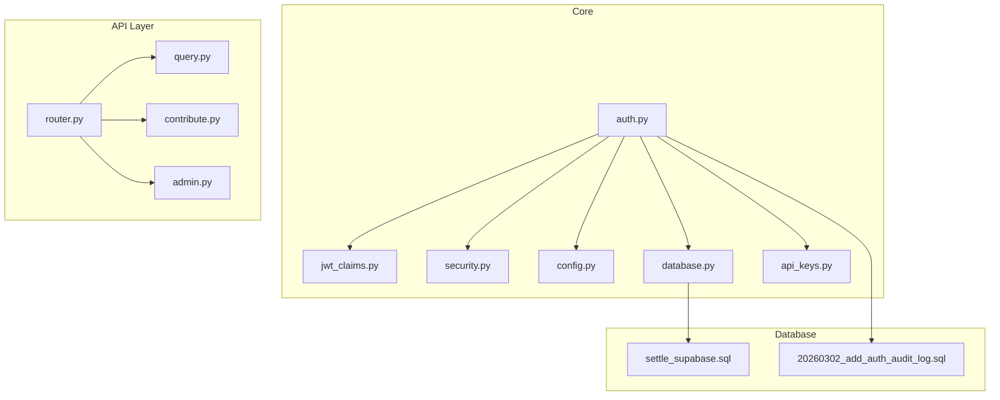
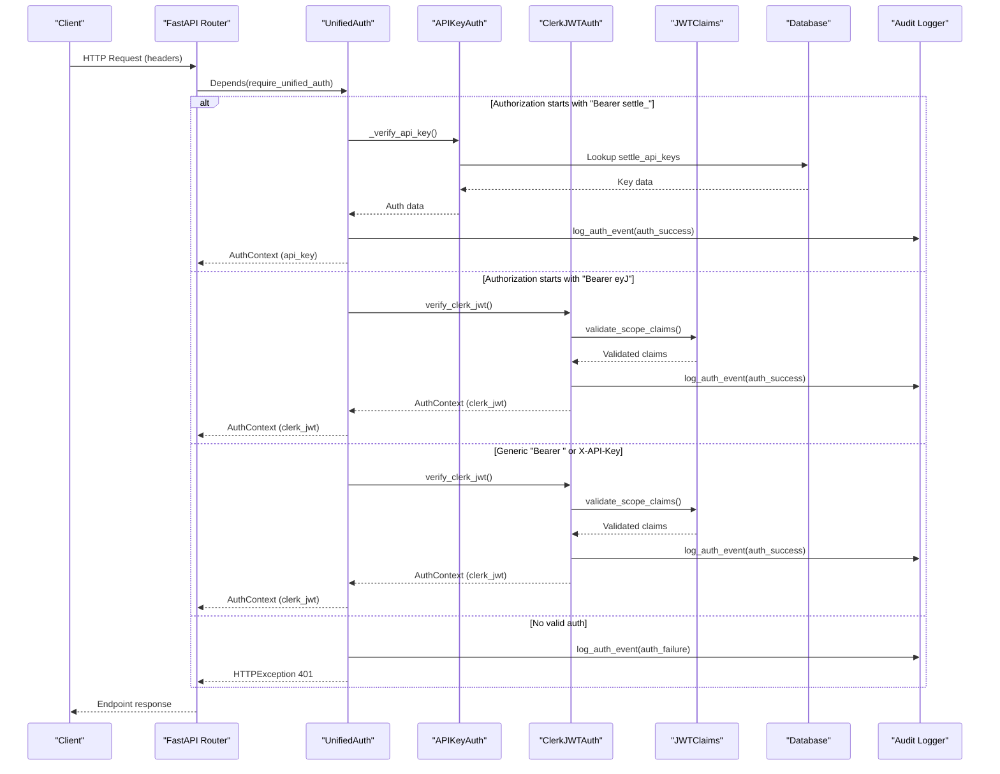
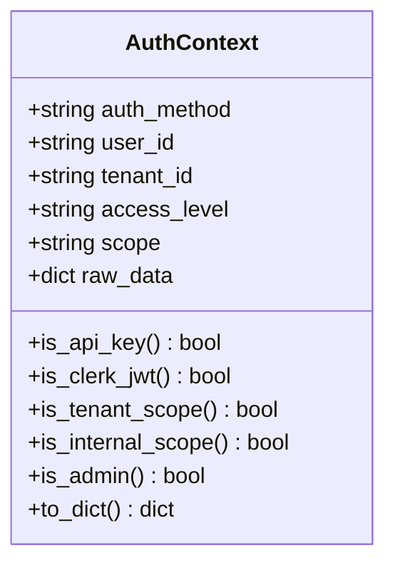
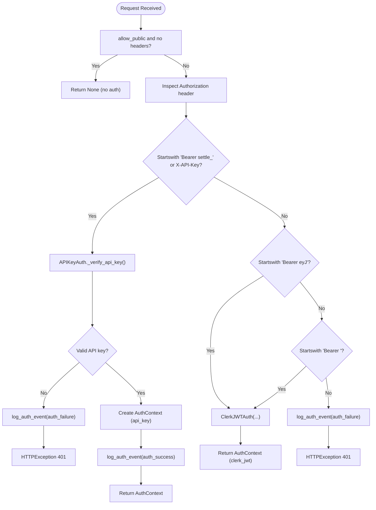
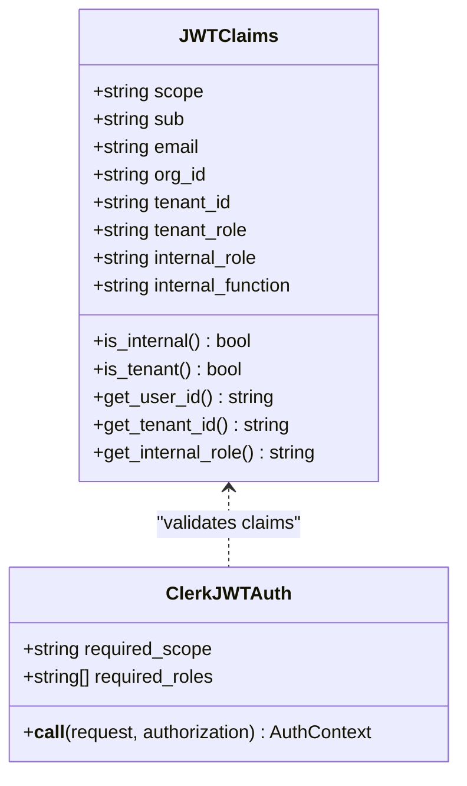
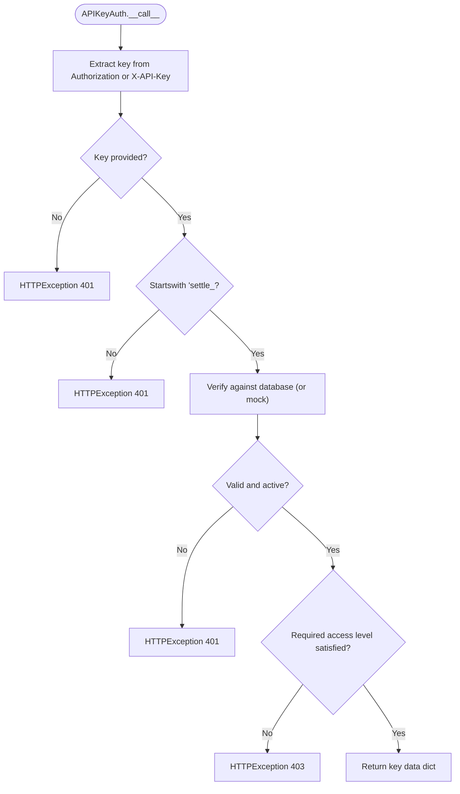
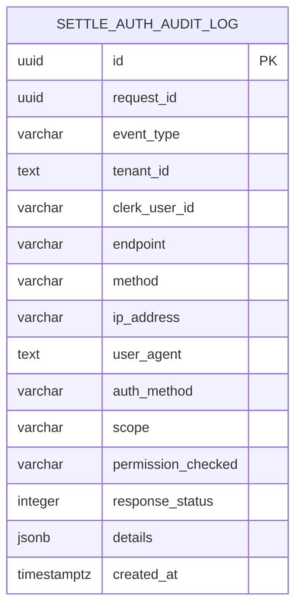
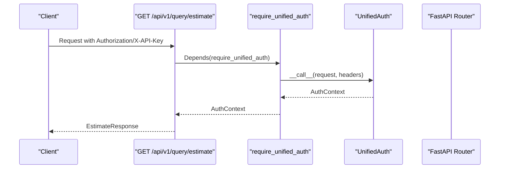
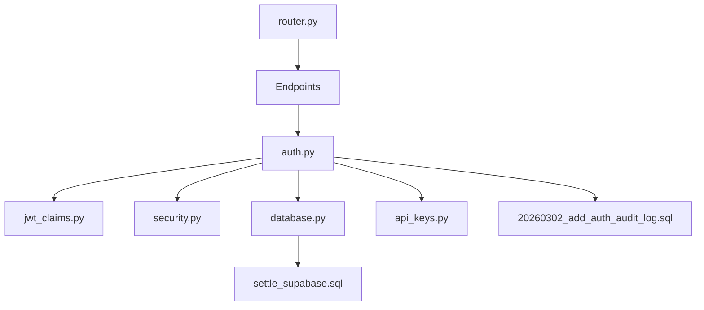

# Unified Authentication System

<cite>
**Referenced Files in This Document**
- [auth.py](file://app/core/auth.py)
- [jwt_claims.py](file://app/core/jwt_claims.py)
- [security.py](file://app/core/security.py)
- [config.py](file://app/core/config.py)
- [database.py](file://app/core/database.py)
- [api_keys.py](file://app/models/api_keys.py)
- [router.py](file://app/api/v1/router.py)
- [query.py](file://app/api/v1/endpoints/query.py)
- [contribute.py](file://app/api/v1/endpoints/contribute.py)
- [admin.py](file://app/api/v1/endpoints/admin.py)
- [main.py](file://app/main.py)
- [20260302_add_auth_audit_log.sql](file://database/migrations/20260302_add_auth_audit_log.sql)
- [settle_supabase.sql](file://database/schemas/settle_supabase.sql)
</cite>

## Table of Contents
1. [Introduction](#introduction)
2. [Project Structure](#project-structure)
3. [Core Components](#core-components)
4. [Architecture Overview](#architecture-overview)
5. [Detailed Component Analysis](#detailed-component-analysis)
6. [Dependency Analysis](#dependency-analysis)
7. [Performance Considerations](#performance-considerations)
8. [Troubleshooting Guide](#troubleshooting-guide)
9. [Conclusion](#conclusion)

## Introduction
This document describes the unified authentication system that seamlessly supports both API key and Clerk JWT authentication methods. It explains the authentication priority system, method detection logic, and how the system orchestrates authentication flows while maintaining consistent audit logging and shared security protocols. The AuthContext class serves as the unified representation of authenticated identities across both methods, enabling endpoints to work uniformly regardless of whether a caller authenticated via API key or JWT.

## Project Structure
The authentication system spans several modules:
- Core authentication logic and dependencies
- JWT claims validation and scope handling
- Security utilities for API key hashing and verification
- Configuration and environment controls
- Database abstraction and audit logging infrastructure
- Endpoint integration demonstrating unified authentication usage

**Diagram sources**
- [auth.py:1-867](file://app/core/auth.py#L1-L867)
- [jwt_claims.py:1-327](file://app/core/jwt_claims.py#L1-L327)
- [security.py:1-208](file://app/core/security.py#L1-L208)
- [config.py:1-351](file://app/core/config.py#L1-L351)
- [database.py:1-549](file://app/core/database.py#L1-L549)
- [api_keys.py:1-147](file://app/models/api_keys.py#L1-L147)
- [router.py:1-26](file://app/api/v1/router.py#L1-L26)
- [query.py:1-119](file://app/api/v1/endpoints/query.py#L1-L119)
- [contribute.py:1-164](file://app/api/v1/endpoints/contribute.py#L1-L164)
- [admin.py:1-756](file://app/api/v1/endpoints/admin.py#L1-L756)
- [settle_supabase.sql:1-505](file://database/schemas/settle_supabase.sql#L1-L505)
- [20260302_add_auth_audit_log.sql:1-38](file://database/migrations/20260302_add_auth_audit_log.sql#L1-L38)

**Section sources**
- [auth.py:1-867](file://app/core/auth.py#L1-L867)
- [router.py:1-26](file://app/api/v1/router.py#L1-L26)

## Core Components
- AuthContext: Unified authentication context carrying auth method, user identity, tenant scope, access level, and raw data for audit.
- UnifiedAuth: Orchestrates authentication by detecting the method from headers and delegating to APIKeyAuth or ClerkJWTAuth accordingly.
- ClerkJWTAuth: Validates Clerk JWTs, enforces scope and role requirements, and produces AuthContext.
- APIKeyAuth: Validates legacy API keys, enforces access levels, and returns structured key data.
- Audit logging: Centralized logging of all auth events to a dedicated audit table with consistent fields and indexes.

Key capabilities:
- Seamless switching between API key and JWT based on header prefixes
- Consistent AuthContext across both methods for downstream logic
- Role-based and scope-based authorization enforcement
- Comprehensive audit trail for compliance

**Section sources**
- [auth.py:96-159](file://app/core/auth.py#L96-L159)
- [auth.py:340-485](file://app/core/auth.py#L340-L485)
- [auth.py:165-334](file://app/core/auth.py#L165-L334)
- [auth.py:487-729](file://app/core/auth.py#L487-L729)
- [auth.py:34-90](file://app/core/auth.py#L34-L90)

## Architecture Overview
The unified authentication architecture integrates with FastAPI dependencies and leverages shared security primitives. The system prioritizes method detection from request headers, validates credentials, and logs events consistently.

**Diagram sources**
- [auth.py:370-485](file://app/core/auth.py#L370-L485)
- [auth.py:487-729](file://app/core/auth.py#L487-L729)
- [auth.py:165-334](file://app/core/auth.py#L165-L334)
- [jwt_claims.py:97-223](file://app/core/jwt_claims.py#L97-L223)
- [database.py:412-463](file://app/core/database.py#L412-L463)

## Detailed Component Analysis

### AuthContext Class
AuthContext encapsulates the authenticated identity and associated metadata. It provides helper methods to determine auth method, scope, and administrative privileges, ensuring consistent behavior across API key and JWT flows.

**Diagram sources**
- [auth.py:96-159](file://app/core/auth.py#L96-L159)

**Section sources**
- [auth.py:96-159](file://app/core/auth.py#L96-L159)

### Unified Authentication Orchestration
UnifiedAuth determines the authentication method based on header inspection and delegates to the appropriate validator. It supports:
- API Key detection via Authorization header prefix "Bearer settle_" or X-API-Key header
- JWT detection via Authorization header prefix "Bearer eyJ" or generic "Bearer "
- Optional public endpoints when allow_public is enabled

**Diagram sources**
- [auth.py:370-485](file://app/core/auth.py#L370-L485)

**Section sources**
- [auth.py:370-485](file://app/core/auth.py#L370-L485)

### JWT Authentication and Claims Validation
ClerkJWTAuth validates Clerk JWTs, enforces scope and role requirements, and produces AuthContext. JWTClaims defines the unified claims model supporting both internal and tenant scopes.

**Diagram sources**
- [jwt_claims.py:41-92](file://app/core/jwt_claims.py#L41-L92)
- [jwt_claims.py:229-285](file://app/core/jwt_claims.py#L229-L285)
- [auth.py:165-334](file://app/core/auth.py#L165-L334)

**Section sources**
- [jwt_claims.py:41-223](file://app/core/jwt_claims.py#L41-L223)
- [auth.py:165-334](file://app/core/auth.py#L165-L334)

### API Key Authentication and Validation
APIKeyAuth validates legacy API keys, enforces access levels, and returns structured key data. It supports mock mode and database-backed verification.

**Diagram sources**
- [auth.py:513-627](file://app/core/auth.py#L513-L627)

**Section sources**
- [auth.py:487-729](file://app/core/auth.py#L487-L729)

### Audit Logging Consistency
All authentication events are logged to a dedicated audit table with standardized fields and indexes. The log function captures request context, user agent, IP, and detailed event metadata.

**Diagram sources**
- [20260302_add_auth_audit_log.sql:6-22](file://database/migrations/20260302_add_auth_audit_log.sql#L6-L22)

**Section sources**
- [auth.py:34-90](file://app/core/auth.py#L34-L90)
- [20260302_add_auth_audit_log.sql:1-38](file://database/migrations/20260302_add_auth_audit_log.sql#L1-L38)

### Endpoint Authentication Patterns
Endpoints integrate unified authentication through FastAPI dependencies. Examples:
- Query estimation supports both API key and JWT
- Contribution submission uses unified auth and emits behavioral events
- Admin endpoints enforce unified admin access

**Diagram sources**
- [query.py:20-98](file://app/api/v1/endpoints/query.py#L20-L98)
- [auth.py:838-841](file://app/core/auth.py#L838-L841)

**Section sources**
- [query.py:20-98](file://app/api/v1/endpoints/query.py#L20-L98)
- [contribute.py:51-125](file://app/api/v1/endpoints/contribute.py#L51-L125)
- [admin.py:31-89](file://app/api/v1/endpoints/admin.py#L31-L89)

## Dependency Analysis
The authentication system exhibits clear separation of concerns:
- auth.py depends on jwt_claims.py for JWT validation, security.py for API key hashing, and database.py for audit logging
- jwt_claims.py provides JWTClaims and validation functions
- security.py provides API key generation and hashing utilities
- database.py abstracts database operations and provides audit logging infrastructure
- API endpoints depend on unified authentication dependencies exported from auth.py

**Diagram sources**
- [auth.py:1-867](file://app/core/auth.py#L1-L867)
- [jwt_claims.py:1-327](file://app/core/jwt_claims.py#L1-L327)
- [security.py:1-208](file://app/core/security.py#L1-L208)
- [database.py:1-549](file://app/core/database.py#L1-L549)
- [api_keys.py:1-147](file://app/models/api_keys.py#L1-L147)
- [router.py:1-26](file://app/api/v1/router.py#L1-L26)
- [settle_supabase.sql:1-505](file://database/schemas/settle_supabase.sql#L1-L505)
- [20260302_add_auth_audit_log.sql:1-38](file://database/migrations/20260302_add_auth_audit_log.sql#L1-L38)

**Section sources**
- [auth.py:1-867](file://app/core/auth.py#L1-L867)
- [jwt_claims.py:1-327](file://app/core/jwt_claims.py#L1-L327)
- [security.py:1-208](file://app/core/security.py#L1-L208)
- [database.py:1-549](file://app/core/database.py#L1-L549)
- [api_keys.py:1-147](file://app/models/api_keys.py#L1-L147)
- [router.py:1-26](file://app/api/v1/router.py#L1-L26)
- [settle_supabase.sql:1-505](file://database/schemas/settle_supabase.sql#L1-L505)
- [20260302_add_auth_audit_log.sql:1-38](file://database/migrations/20260302_add_auth_audit_log.sql#L1-L38)

## Performance Considerations
- API key verification uses asynchronous database lookups with fire-and-forget updates for last_used_at to minimize latency.
- JWT verification is currently a placeholder and should be implemented with Clerk JWKS validation in production.
- Audit logging is performed asynchronously to avoid blocking request processing.
- Database client caching reduces repeated connection overhead.

## Troubleshooting Guide
Common authentication issues and resolutions:
- Missing Authorization header or invalid format: Ensure Authorization header follows "Bearer <token>" or provide X-API-Key header.
- Invalid API key format: API keys must start with "settle_"; verify key generation and transmission.
- Expired or revoked API key: Check settle_api_keys table for active status and expiration dates.
- JWT scope mismatch: Verify JWT scope matches endpoint requirements ("tenant" or "internal").
- Role permission denied: Confirm user role satisfies required roles for the endpoint.
- Audit logging failures: The system continues operation even if audit logging fails; check database connectivity and schema.

Operational checks:
- Environment configuration: AUTH_MODE must be "clerk" in production per security contract.
- Request ID middleware: Each request receives a unique X-Request-ID for tracing.
- Health endpoints: Use service-specific health checks to validate operational status.

**Section sources**
- [auth.py:410-423](file://app/core/auth.py#L410-L423)
- [auth.py:545-599](file://app/core/auth.py#L545-L599)
- [auth.py:250-272](file://app/core/auth.py#L250-L272)
- [auth.py:274-304](file://app/core/auth.py#L274-L304)
- [main.py:42-49](file://app/main.py#L42-L49)
- [main.py:121-130](file://app/main.py#L121-L130)

## Conclusion
The unified authentication system provides a robust, extensible foundation for supporting both legacy API keys and modern JWT-based authentication. Through AuthContext, UnifiedAuth, and consistent audit logging, it ensures seamless method switching, strong security guarantees, and comprehensive compliance tracking. The modular design enables straightforward integration into new endpoints while maintaining shared security protocols and audit consistency.