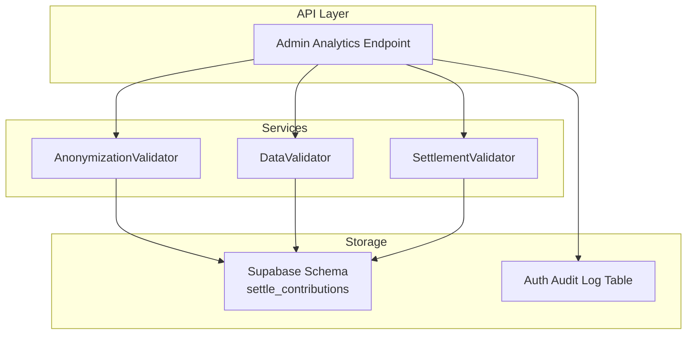
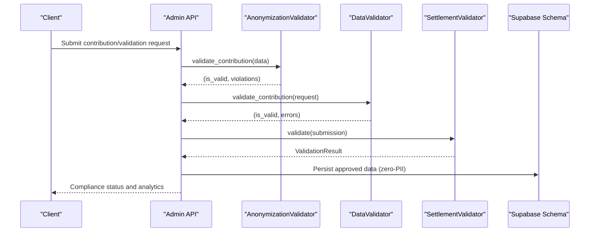
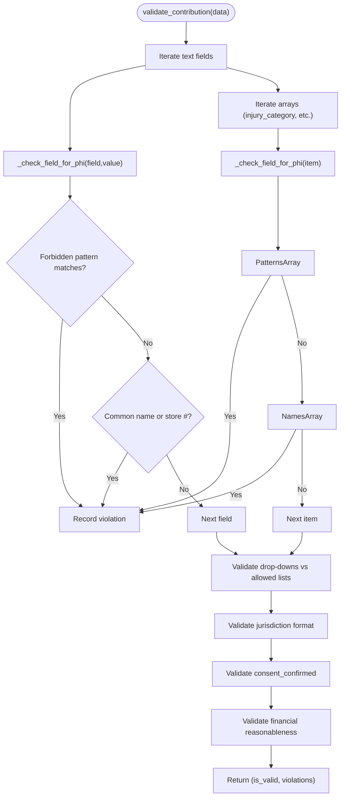
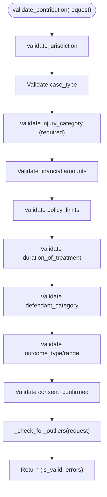
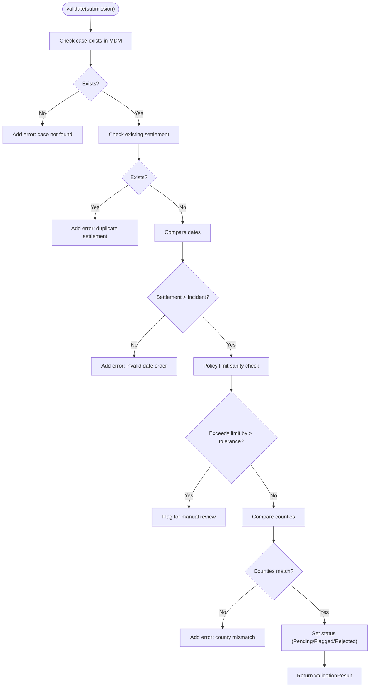
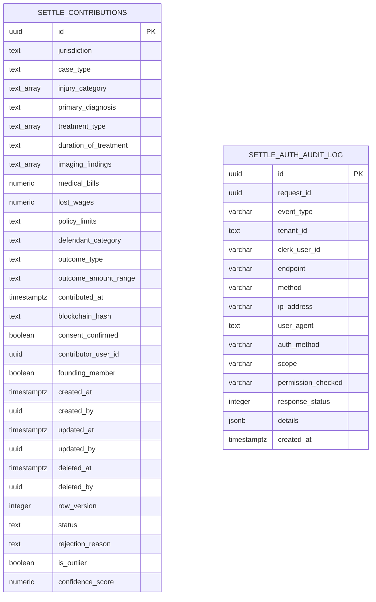
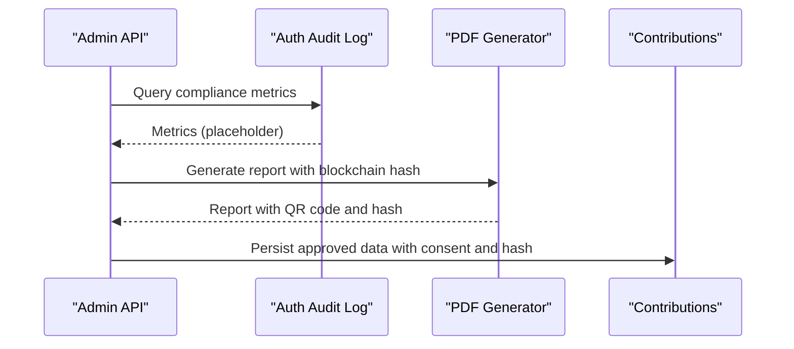
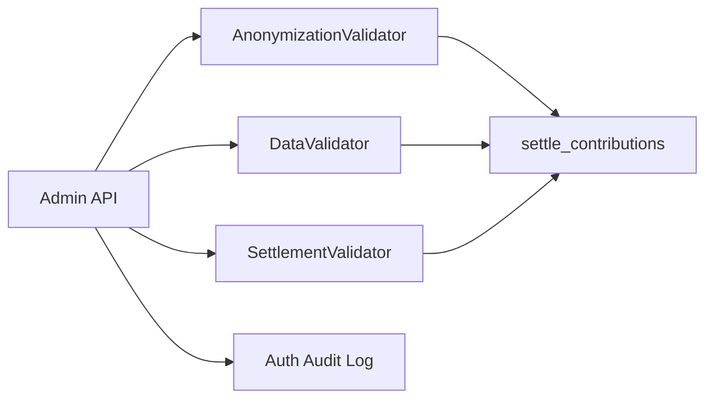

# Anonymization & Compliance

<cite>
**Referenced Files in This Document**
- [anonymizer.py](file://app/services/anonymizer.py)
- [test_anonymizer.py](file://tests/test_anonymizer.py)
- [validator.py](file://app/services/validator.py)
- [settlement_validator.py](file://app/services/settlement_validator.py)
- [admin.py](file://app/api/v1/endpoints/admin.py)
- [settle_supabase.sql](file://database/schemas/settle_supabase.sql)
- [20260302_add_auth_audit_log.sql](file://database/migrations/20260302_add_auth_audit_log.sql)
- [ENCRYPTION_IMPLEMENTATION.md](file://docs/security/ENCRYPTION_IMPLEMENTATION.md)
- [pdf_generator.py](file://app/services/reports/pdf_generator.py)
- [README.md](file://scripts/data-collection/README.md)
- [test_customer_scenarios.py](file://tests/test_customer_scenarios.py)
- [config.py](file://app/core/config.py)
- [main.py](file://app/main.py)
</cite>

## Table of Contents
1. [Introduction](#introduction)
2. [Project Structure](#project-structure)
3. [Core Components](#core-components)
4. [Architecture Overview](#architecture-overview)
5. [Detailed Component Analysis](#detailed-component-analysis)
6. [Dependency Analysis](#dependency-analysis)
7. [Performance Considerations](#performance-considerations)
8. [Troubleshooting Guide](#troubleshooting-guide)
9. [Conclusion](#conclusion)
10. [Appendices](#appendices)

## Introduction
This document describes the Anonymization and Compliance system for protecting PHI/PII and ensuring bar-compliant data handling. It covers detection and removal algorithms, legal compliance framework, data sanitization techniques, regulatory adherence, automated detection mechanisms, anonymization workflows, validation checks, compliance monitoring, audit trails, and implementation guidelines for extending anonymization rules while maintaining compliance.

## Project Structure
The anonymization and compliance capabilities are implemented primarily in:
- AnonymizationValidator service for PHI/PII detection and drop-down validation
- DataValidator for structural and business rule validation
- SettlementValidator for settlement-level integrity and verification
- Database schema enforcing zero-PII storage and audit-ready fields
- Audit logging and reporting supporting compliance verification

**Diagram sources**
- [admin.py:682-725](file://app/api/v1/endpoints/admin.py#L682-L725)
- [anonymizer.py:17-340](file://app/services/anonymizer.py#L17-L340)
- [validator.py:25-327](file://app/services/validator.py#L25-L327)
- [settlement_validator.py:59-264](file://app/services/settlement_validator.py#L59-L264)
- [settle_supabase.sql:31-113](file://database/schemas/settle_supabase.sql#L31-L113)
- [20260302_add_auth_audit_log.sql:6-37](file://database/migrations/20260302_add_auth_audit_log.sql#L6-L37)

**Section sources**
- [anonymizer.py:1-340](file://app/services/anonymizer.py#L1-L340)
- [validator.py:1-327](file://app/services/validator.py#L1-L327)
- [settlement_validator.py:1-264](file://app/services/settlement_validator.py#L1-L264)
- [settle_supabase.sql:1-505](file://database/schemas/settle_supabase.sql#L1-L505)
- [20260302_add_auth_audit_log.sql:1-38](file://database/migrations/20260302_add_auth_audit_log.sql#L1-L38)
- [admin.py:682-725](file://app/api/v1/endpoints/admin.py#L682-L725)

## Core Components
- AnonymizationValidator: Detects PHI/PII via regex patterns and prohibited terms, validates jurisdiction format, drop-down values, and financial reasonableness. Provides optional sanitization for legacy data cleanup.
- DataValidator: Enforces structural and business rules for contribution requests, including jurisdiction format, required fields, value ranges, and outlier detection.
- SettlementValidator: Enforces dataset integrity for settlement submissions, including MDM linkage, uniqueness, temporal consistency, policy limits, and county matching.
- Database Schema: Defines settle_contributions with zero-PII constraints, audit fields, and indexes; supports blockchain hash and consent fields.
- Audit Logging: Records authentication and access events with required fields for compliance.
- Reporting and Verification: Generates reports with blockchain verification metadata for audibility.

**Section sources**
- [anonymizer.py:17-340](file://app/services/anonymizer.py#L17-L340)
- [validator.py:25-327](file://app/services/validator.py#L25-L327)
- [settlement_validator.py:59-264](file://app/services/settlement_validator.py#L59-L264)
- [settle_supabase.sql:31-113](file://database/schemas/settle_supabase.sql#L31-L113)
- [20260302_add_auth_audit_log.sql:6-37](file://database/migrations/20260302_add_auth_audit_log.sql#L6-L37)
- [pdf_generator.py:471-491](file://app/services/reports/pdf_generator.py#L471-L491)

## Architecture Overview
The anonymization pipeline integrates with data validation and settlement verification to ensure only anonymized, bar-compliant data enters the dataset. Admin endpoints expose compliance analytics and monitoring.

**Diagram sources**
- [admin.py:682-725](file://app/api/v1/endpoints/admin.py#L682-L725)
- [anonymizer.py:92-180](file://app/services/anonymizer.py#L92-L180)
- [validator.py:52-138](file://app/services/validator.py#L52-L138)
- [settlement_validator.py:78-135](file://app/services/settlement_validator.py#L78-L135)
- [settle_supabase.sql:31-113](file://database/schemas/settle_supabase.sql#L31-L113)

## Detailed Component Analysis

### AnonymizationValidator
- Purpose: Prevent PHI/PII leakage by detecting patterns and prohibited content; enforce bar-safe drop-downs and jurisdiction formatting.
- Detection mechanisms:
  - Regex-based patterns for SSN, DOB, phone, email, case numbers, MRN, and street addresses.
  - Prohibited terms and common names heuristics.
  - Jurisdiction format validation ("County, ST").
  - Drop-down value enforcement and bucketed outcome ranges.
  - Financial reasonableness checks.
- Sanitization: Optional placeholder for legacy data cleanup; production should reject submissions containing PHI/PII.
- Liability language detection: Identifies forbidden phrases indicating fault or liability.

**Diagram sources**
- [anonymizer.py:92-180](file://app/services/anonymizer.py#L92-L180)
- [anonymizer.py:182-215](file://app/services/anonymizer.py#L182-L215)

**Section sources**
- [anonymizer.py:17-340](file://app/services/anonymizer.py#L17-L340)
- [test_anonymizer.py:10-201](file://tests/test_anonymizer.py#L10-L201)

### DataValidator
- Purpose: Structural and business rule validation for contribution requests.
- Key validations:
  - Jurisdiction format and state code.
  - Required fields and multi-select requirements.
  - Financial bounds and reasonableness.
  - Outcome ranges and policy limits.
  - Consent confirmation.
  - Outlier detection with warnings for manual review.

**Diagram sources**
- [validator.py:52-138](file://app/services/validator.py#L52-L138)
- [validator.py:226-262](file://app/services/validator.py#L226-L262)

**Section sources**
- [validator.py:25-327](file://app/services/validator.py#L25-L327)

### SettlementValidator
- Purpose: Dataset integrity for settlement submissions prior to reward attribution.
- Rules:
  - Case must exist in MDM snapshot.
  - Only one settlement per case.
  - Settlement date must follow incident date.
  - Policy limit sanity check with tolerance.
  - Incident and settlement counties must match.
- Verification lifecycle: Pending, Flagged (manual review), Verified, Rejected.

**Diagram sources**
- [settlement_validator.py:78-135](file://app/services/settlement_validator.py#L78-L135)

**Section sources**
- [settlement_validator.py:59-264](file://app/services/settlement_validator.py#L59-L264)

### Database Schema and Audit Trail
- settle_contributions enforces zero-PII by design: drop-downs, bucketed outcomes, and strict constraints.
- Audit-ready fields include timestamps, consent confirmation, blockchain hash, and status tracking.
- Auth audit log table captures request context for compliance monitoring.

**Diagram sources**
- [settle_supabase.sql:31-113](file://database/schemas/settle_supabase.sql#L31-L113)
- [20260302_add_auth_audit_log.sql:6-37](file://database/migrations/20260302_add_auth_audit_log.sql#L6-L37)

**Section sources**
- [settle_supabase.sql:27-137](file://database/schemas/settle_supabase.sql#L27-L137)
- [20260302_add_auth_audit_log.sql:1-38](file://database/migrations/20260302_add_auth_audit_log.sql#L1-L38)

### Compliance Monitoring and Reporting
- Admin analytics endpoint exposes compliance metrics placeholders for PII detections, anonymization verification, and compliance violations.
- Reports embed blockchain verification metadata for audibility and tamper-proof timestamping.

**Diagram sources**
- [admin.py:682-725](file://app/api/v1/endpoints/admin.py#L682-L725)
- [pdf_generator.py:471-491](file://app/services/reports/pdf_generator.py#L471-L491)
- [settle_supabase.sql:71-73](file://database/schemas/settle_supabase.sql#L71-L73)

**Section sources**
- [admin.py:682-725](file://app/api/v1/endpoints/admin.py#L682-L725)
- [pdf_generator.py:471-491](file://app/services/reports/pdf_generator.py#L471-L491)

## Dependency Analysis
- AnonymizationValidator depends on regex patterns and predefined allowed lists; it logs violations and returns structured feedback.
- DataValidator coordinates jurisdiction, value-range, and selection validations; it also flags outliers.
- SettlementValidator interacts with the database to check MDM snapshots and existing settlements, applying integrity rules.
- Admin API aggregates compliance insights and surfaces them to administrators.

**Diagram sources**
- [anonymizer.py:17-340](file://app/services/anonymizer.py#L17-L340)
- [validator.py:25-327](file://app/services/validator.py#L25-L327)
- [settlement_validator.py:59-264](file://app/services/settlement_validator.py#L59-L264)
- [admin.py:682-725](file://app/api/v1/endpoints/admin.py#L682-L725)
- [settle_supabase.sql:31-113](file://database/schemas/settle_supabase.sql#L31-L113)
- [20260302_add_auth_audit_log.sql:6-37](file://database/migrations/20260302_add_auth_audit_log.sql#L6-L37)

**Section sources**
- [anonymizer.py:17-340](file://app/services/anonymizer.py#L17-L340)
- [validator.py:25-327](file://app/services/validator.py#L25-L327)
- [settlement_validator.py:59-264](file://app/services/settlement_validator.py#L59-L264)
- [admin.py:682-725](file://app/api/v1/endpoints/admin.py#L682-L725)

## Performance Considerations
- Regex-based detection is efficient for typical contribution sizes; avoid excessively broad patterns to prevent false positives.
- Array validation scales linearly with multi-select fields; keep allowed lists curated and bounded.
- Database constraints and indexes in the schema support fast queries and reduce validation overhead.
- Logging and audit writes should be asynchronous or buffered to minimize latency.

## Troubleshooting Guide
- PHI/PII detection failures:
  - Validate regex patterns and ensure case-insensitive matching is applied consistently.
  - Confirm prohibited terms and common names lists are maintained and updated.
- Jurisdiction format errors:
  - Ensure input follows "County, ST" and state codes are two uppercase letters.
- Drop-down and bucket validation errors:
  - Verify values exactly match allowed lists and bucket ranges.
- Financial reasonableness:
  - Confirm amounts fall within configured bounds and are not extreme outliers.
- Settlement validation rejections:
  - Check MDM snapshot presence, ensure no duplicate settlement, correct date ordering, and matching counties.
- Compliance analytics:
  - Admin endpoints currently return placeholders; implement backend analytics to populate metrics.

**Section sources**
- [anonymizer.py:92-180](file://app/services/anonymizer.py#L92-L180)
- [validator.py:140-224](file://app/services/validator.py#L140-L224)
- [settlement_validator.py:78-135](file://app/services/settlement_validator.py#L78-L135)
- [admin.py:682-725](file://app/api/v1/endpoints/admin.py#L682-L725)

## Conclusion
The Anonymization and Compliance system enforces strict PHI/PII prevention, bar-safe data handling, and dataset integrity. Through automated detection, validation, and audit-ready storage, it supports regulatory adherence and transparency. Extending rules should remain conservative, prioritize false-negative safety, and integrate with logging and reporting for verifiability.

## Appendices

### Automated Detection Mechanisms
- PHI/PII detection via regex patterns and prohibited term matching.
- Jurisdiction format enforcement and drop-down value validation.
- Financial reasonableness checks and outlier warnings.
- Settlement integrity rules and verification lifecycle.

**Section sources**
- [anonymizer.py:182-215](file://app/services/anonymizer.py#L182-L215)
- [validator.py:140-224](file://app/services/validator.py#L140-L224)
- [settlement_validator.py:78-135](file://app/services/settlement_validator.py#L78-L135)

### Anonymization Workflows and Validation Checks
- Contribution validation workflow: field-level checks, array expansion, dropdown/bucket validation, jurisdiction and consent checks, financial reasonableness.
- Settlement validation workflow: MDM existence, uniqueness, temporal consistency, policy limit sanity, and county alignment.

**Section sources**
- [anonymizer.py:92-180](file://app/services/anonymizer.py#L92-L180)
- [validator.py:52-138](file://app/services/validator.py#L52-L138)
- [settlement_validator.py:78-135](file://app/services/settlement_validator.py#L78-L135)

### Compliance Validation System and Audit Trails
- Admin analytics endpoint for compliance metrics.
- Auth audit log table capturing request context for monitoring.
- Reporting with blockchain verification metadata for audibility.

**Section sources**
- [admin.py:682-725](file://app/api/v1/endpoints/admin.py#L682-L725)
- [20260302_add_auth_audit_log.sql:6-37](file://database/migrations/20260302_add_auth_audit_log.sql#L6-L37)
- [pdf_generator.py:471-491](file://app/services/reports/pdf_generator.py#L471-L491)

### Legal Documentation and Regulatory Adherence
- Encryption implementation guidance for in-transit and at-rest protection.
- Data collection legal disclaimer emphasizing anonymization and bar compliance.

**Section sources**
- [ENCRYPTION_IMPLEMENTATION.md:781-812](file://docs/security/ENCRYPTION_IMPLEMENTATION.md#L781-L812)
- [README.md:183-191](file://scripts/data-collection/README.md#L183-L191)

### Implementation Guidelines for Extending Anonymization Rules
- Keep regex patterns precise and scoped to reduce false positives.
- Maintain allowed lists centrally and version-controlled; validate against them rigorously.
- Add new prohibited terms carefully and document rationale.
- Integrate new validations early in the pipeline to fail fast.
- Ensure logging and audit trails capture extended checks for compliance verification.

**Section sources**
- [anonymizer.py:31-47](file://app/services/anonymizer.py#L31-L47)
- [validator.py:37-44](file://app/services/validator.py#L37-L44)
- [config.py:46-49](file://app/core/config.py#L46-L49)
- [main.py:42-49](file://app/main.py#L42-L49)