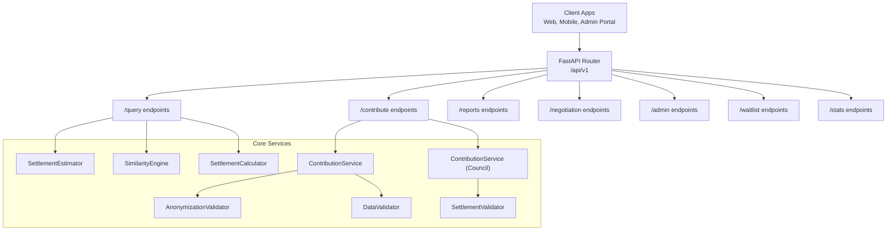
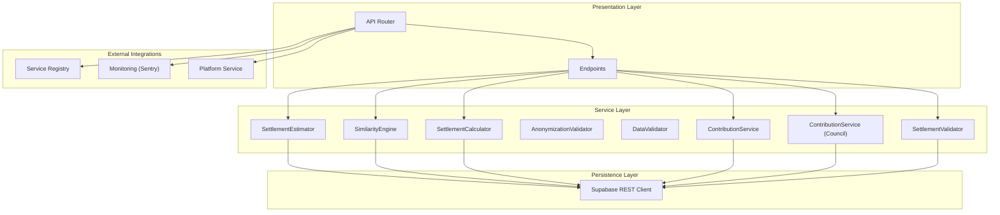
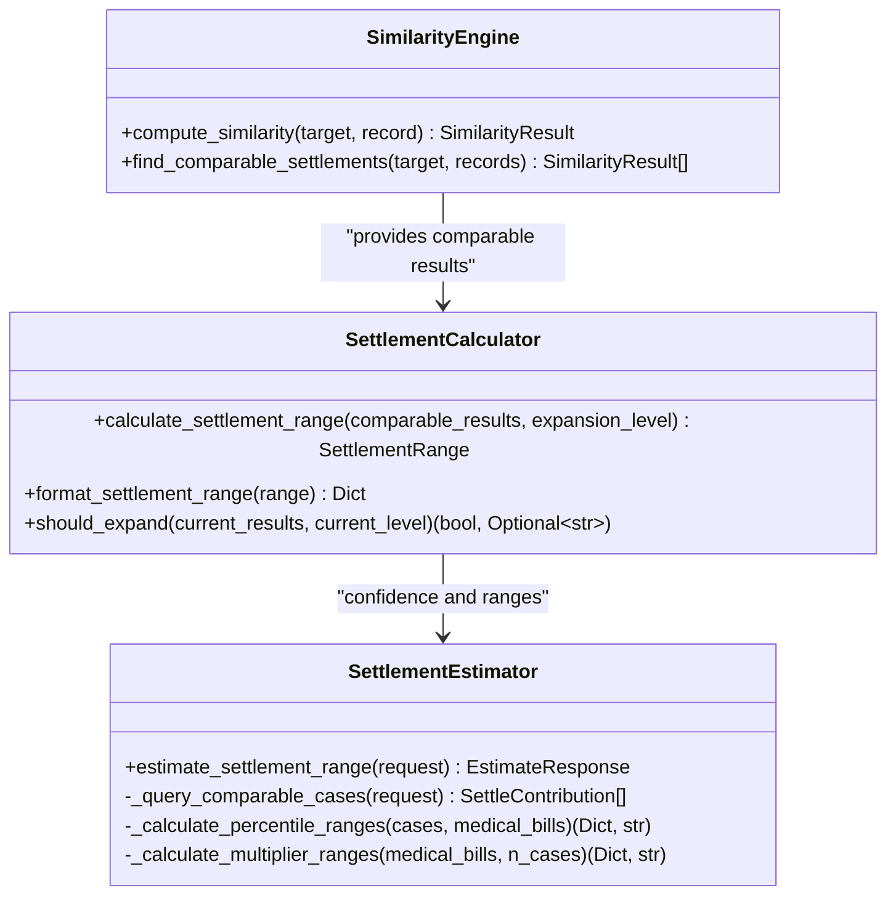
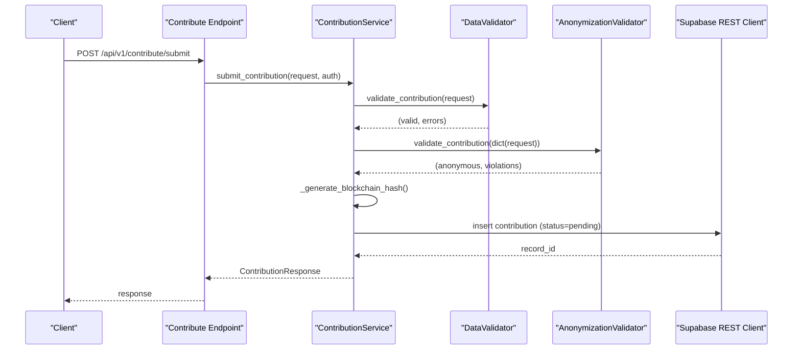
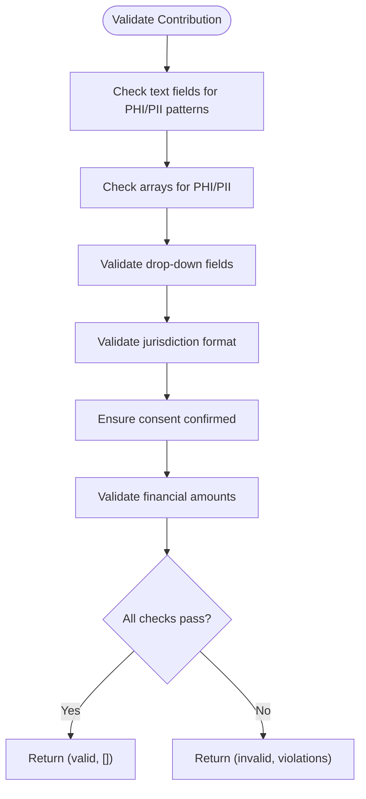
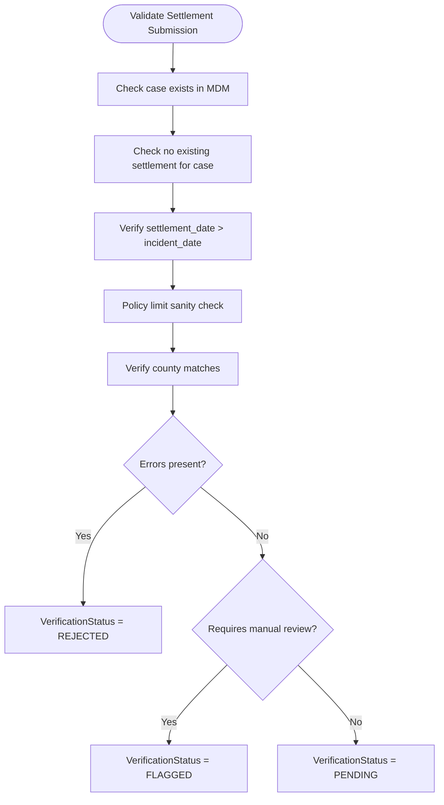
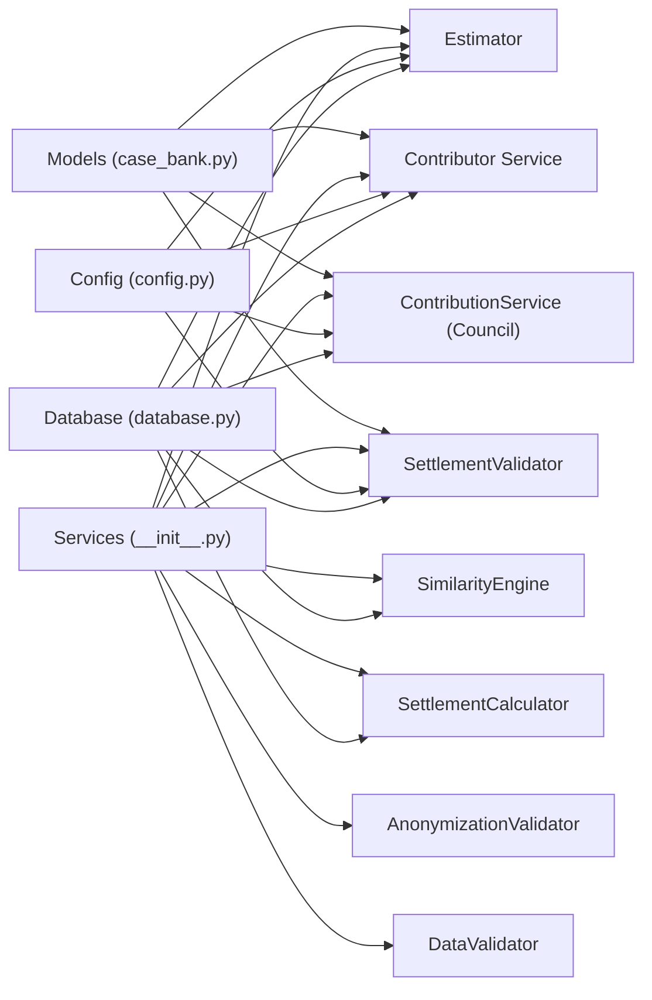

# Core Services

<cite>
**Referenced Files in This Document**
- [app/main.py](file://app/main.py)
- [app/api/v1/router.py](file://app/api/v1/router.py)
- [app/api/v1/endpoints/contribute.py](file://app/api/v1/endpoints/contribute.py)
- [app/models/case_bank.py](file://app/models/case_bank.py)
- [app/core/config.py](file://app/core/config.py)
- [app/core/database.py](file://app/core/database.py)
- [app/services/__init__.py](file://app/services/__init__.py)
- [app/services/estimator.py](file://app/services/estimator.py)
- [app/services/similarity_engine.py](file://app/services/similarity_engine.py)
- [app/services/settlement_calculator.py](file://app/services/settlement_calculator.py)
- [app/services/anonymizer.py](file://app/services/anonymizer.py)
- [app/services/validator.py](file://app/services/validator.py)
- [app/services/contributor.py](file://app/services/contributor.py)
- [app/services/contribution_service.py](file://app/services/contribution_service.py)
- [app/services/settlement_validator.py](file://app/services/settlement_validator.py)
</cite>

## Table of Contents
1. [Introduction](#introduction)
2. [Project Structure](#project-structure)
3. [Core Components](#core-components)
4. [Architecture Overview](#architecture-overview)
5. [Detailed Component Analysis](#detailed-component-analysis)
6. [Dependency Analysis](#dependency-analysis)
7. [Performance Considerations](#performance-considerations)
8. [Troubleshooting Guide](#troubleshooting-guide)
9. [Conclusion](#conclusion)
10. [Appendices](#appendices)

## Introduction
This document explains the core business services of the SETTLE Service, focusing on the settlement intelligence engine, data contribution workflow, anonymization processes, and validation systems. It documents the service architecture, interdependencies, and data flow patterns, and provides implementation details for each service component, including configuration options, performance characteristics, and integration patterns. It also addresses service lifecycle management and error handling strategies.

## Project Structure
The SETTLE Service is a FastAPI application that exposes public and authenticated endpoints under a unified router. The application initializes monitoring, registers with a service registry, enforces authentication, and wires core services for settlement estimation, similarity scoring, anonymization, and validation.

**Diagram sources**
- [app/api/v1/router.py:1-26](file://app/api/v1/router.py#L1-L26)
- [app/api/v1/endpoints/contribute.py:1-164](file://app/api/v1/endpoints/contribute.py#L1-L164)
- [app/services/estimator.py:1-443](file://app/services/estimator.py#L1-L443)
- [app/services/similarity_engine.py:1-441](file://app/services/similarity_engine.py#L1-L441)
- [app/services/settlement_calculator.py:1-257](file://app/services/settlement_calculator.py#L1-L257)
- [app/services/anonymizer.py:1-340](file://app/services/anonymizer.py#L1-L340)
- [app/services/validator.py:1-327](file://app/services/validator.py#L1-L327)
- [app/services/contributor.py:1-339](file://app/services/contributor.py#L1-L339)
- [app/services/contribution_service.py:1-388](file://app/services/contribution_service.py#L1-L388)
- [app/services/settlement_validator.py:1-264](file://app/services/settlement_validator.py#L1-L264)

**Section sources**
- [app/main.py:1-157](file://app/main.py#L1-L157)
- [app/api/v1/router.py:1-26](file://app/api/v1/router.py#L1-L26)

## Core Components
- Settlement Intelligence Engine: Computes percentile-based settlement ranges from comparable cases, with confidence scoring and optional query expansion.
- Data Contribution Workflow: Validates, anonymizes, hashes, stores, and tracks contributions; supports Founding Member stats and blockchain receipts.
- Anonymization Validator: Enforces strict PHI/PII removal and bar-compliant drop-down selection.
- Validation Systems: DataValidator ensures correctness and completeness; SettlementValidator enforces integrity rules and verification workflows.
- Similarity Engine: Deterministic scoring of comparable cases using structured legal signals.

**Section sources**
- [app/services/estimator.py:1-443](file://app/services/estimator.py#L1-L443)
- [app/services/similarity_engine.py:1-441](file://app/services/similarity_engine.py#L1-L441)
- [app/services/settlement_calculator.py:1-257](file://app/services/settlement_calculator.py#L1-L257)
- [app/services/anonymizer.py:1-340](file://app/services/anonymizer.py#L1-L340)
- [app/services/validator.py:1-327](file://app/services/validator.py#L1-L327)
- [app/services/contributor.py:1-339](file://app/services/contributor.py#L1-L339)
- [app/services/contribution_service.py:1-388](file://app/services/contribution_service.py#L1-L388)
- [app/services/settlement_validator.py:1-264](file://app/services/settlement_validator.py#L1-L264)

## Architecture Overview
The service follows a layered architecture:
- Presentation: FastAPI endpoints route requests to services.
- Services: Business logic for estimation, similarity, anonymization, validation, and contribution handling.
- Persistence: Supabase REST client abstraction for database operations.
- Integrations: Service registry, monitoring, and cross-service communication.

**Diagram sources**
- [app/main.py:1-157](file://app/main.py#L1-L157)
- [app/api/v1/router.py:1-26](file://app/api/v1/router.py#L1-L26)
- [app/core/database.py:1-549](file://app/core/database.py#L1-L549)
- [app/core/config.py:1-351](file://app/core/config.py#L1-L351)

## Detailed Component Analysis

### Settlement Intelligence Engine
The settlement intelligence engine combines three complementary services:
- SimilarityEngine: Computes deterministic similarity scores between a target case and historical records.
- SettlementCalculator: Calculates percentile-based ranges (25th, median, 75th) and confidence scores, with optional query expansion.
- SettlementEstimator: Provides a percentile-based estimation workflow with fallback multipliers and confidence thresholds.

**Diagram sources**
- [app/services/similarity_engine.py:188-418](file://app/services/similarity_engine.py#L188-L418)
- [app/services/settlement_calculator.py:41-209](file://app/services/settlement_calculator.py#L41-L209)
- [app/services/estimator.py:25-116](file://app/services/estimator.py#L25-L116)

Key implementation details:
- Similarity scoring uses weighted factors (incident type, injury category, jurisdiction, medical specials, liability strength, litigation stage, policy limit) with adjacency matrices and thresholds.
- Percentile calculation uses nearest-rank method; confidence scoring aggregates sample size, jurisdiction match, and average similarity.
- Estimator switches between percentile calculation (≥15 cases) and multipliers (fallback) with confidence thresholds.

**Section sources**
- [app/services/similarity_engine.py:188-441](file://app/services/similarity_engine.py#L188-L441)
- [app/services/settlement_calculator.py:41-257](file://app/services/settlement_calculator.py#L41-L257)
- [app/services/estimator.py:25-443](file://app/services/estimator.py#L25-L443)

### Data Contribution Workflow
The contribution workflow validates, anonymizes, generates a blockchain receipt, stores the record, and tracks Founding Member stats. It integrates DataValidator and AnonymizationValidator, and prepares a blockchain hash using OpenTimestamps semantics.

**Diagram sources**
- [app/api/v1/endpoints/contribute.py:51-125](file://app/api/v1/endpoints/contribute.py#L51-L125)
- [app/services/contributor.py:55-125](file://app/services/contributor.py#L55-L125)
- [app/services/validator.py:52-138](file://app/services/validator.py#L52-L138)
- [app/services/anonymizer.py:92-180](file://app/services/anonymizer.py#L92-L180)
- [app/core/database.py:265-334](file://app/core/database.py#L265-L334)

Additional workflow for Council contributions:
- ContributionService (Council) validates required fields, detects duplicates via fingerprint hashing, stores records, and tracks monthly submissions.

**Section sources**
- [app/api/v1/endpoints/contribute.py:51-125](file://app/api/v1/endpoints/contribute.py#L51-L125)
- [app/services/contributor.py:31-294](file://app/services/contributor.py#L31-L294)
- [app/services/contribution_service.py:69-314](file://app/services/contribution_service.py#L69-L314)

### Anonymization Processes
AnonymizationValidator enforces strict compliance:
- Prohibits PHI/PII (SSN, DOB, phone, email, addresses), specific identifiers, and free-text narratives.
- Requires drop-down selections and bucketed amounts.
- Validates jurisdiction format and financial reasonableness.
- Provides sanitization helpers for legacy data cleanup (not for production ingestion).

**Diagram sources**
- [app/services/anonymizer.py:92-180](file://app/services/anonymizer.py#L92-L180)

**Section sources**
- [app/services/anonymizer.py:17-340](file://app/services/anonymizer.py#L17-L340)

### Validation Systems
Two complementary validators ensure data integrity:
- DataValidator: Validates formats, ranges, selections, and outliers for incoming contributions and queries.
- SettlementValidator: Enforces dataset integrity rules for settlement submissions and manages verification statuses.

**Diagram sources**
- [app/services/settlement_validator.py:78-135](file://app/services/settlement_validator.py#L78-L135)

**Section sources**
- [app/services/validator.py:25-327](file://app/services/validator.py#L25-L327)
- [app/services/settlement_validator.py:59-264](file://app/services/settlement_validator.py#L59-L264)

### Confidence Scoring and Quality Assurance
Confidence scoring aggregates three factors:
- Sample size: Weighted contribution based on thresholds.
- Jurisdiction match: Scores based on expansion level.
- Average similarity: Scaled from 60–100 to 0–30.

Quality assurance includes:
- Outlier detection for settlements vs. medical expenses and injury severity.
- Threshold-based confidence levels for percentile estimation.
- Manual review flags for policy limit deviations.

**Section sources**
- [app/services/settlement_calculator.py:117-191](file://app/services/settlement_calculator.py#L117-L191)
- [app/services/contribution_service.py:321-387](file://app/services/contribution_service.py#L321-L387)
- [app/services/estimator.py:148-210](file://app/services/estimator.py#L148-L210)

## Dependency Analysis
The service layer composes specialized components with clear boundaries:
- Services depend on models for request/response contracts.
- Database operations are abstracted via a REST client.
- Configuration drives feature flags, integrations, and monitoring.

**Diagram sources**
- [app/services/__init__.py:1-17](file://app/services/__init__.py#L1-L17)
- [app/models/case_bank.py:1-269](file://app/models/case_bank.py#L1-L269)
- [app/core/config.py:1-351](file://app/core/config.py#L1-L351)
- [app/core/database.py:1-549](file://app/core/database.py#L1-L549)

**Section sources**
- [app/services/__init__.py:1-17](file://app/services/__init__.py#L1-L17)
- [app/models/case_bank.py:1-269](file://app/models/case_bank.py#L1-L269)
- [app/core/config.py:1-351](file://app/core/config.py#L1-L351)
- [app/core/database.py:1-549](file://app/core/database.py#L1-L549)

## Performance Considerations
- Estimation latency: Response time is captured and bounded by configuration-defined thresholds.
- Query expansion: SettlementCalculator progressively expands search scope to improve sample size.
- Database operations: Retry decorator and REST client minimize transient failures.
- Feature flags: Enable/disable expensive features (PDF generation, blockchain verification) per environment.

[No sources needed since this section provides general guidance]

## Troubleshooting Guide
Common issues and strategies:
- Validation failures: Review DataValidator and AnonymizationValidator error lists; ensure jurisdiction format, drop-down selections, and financial ranges meet constraints.
- Duplicate contributions: ContributionService (Council) fingerprints normalized fields; verify duplicate detection logic.
- Settlement verification rejections: SettlementValidator enforces MDM existence, uniqueness, temporal order, policy limits, and county alignment.
- Database connectivity: Use health check and retry logic; confirm Supabase credentials and URL resolution.
- Monitoring: Sentry initialization depends on environment; verify DSN and sampling rates.

**Section sources**
- [app/services/validator.py:52-138](file://app/services/validator.py#L52-L138)
- [app/services/anonymizer.py:92-180](file://app/services/anonymizer.py#L92-L180)
- [app/services/contribution_service.py:212-222](file://app/services/contribution_service.py#L212-L222)
- [app/services/settlement_validator.py:78-135](file://app/services/settlement_validator.py#L78-L135)
- [app/core/database.py:509-538](file://app/core/database.py#L509-L538)
- [app/main.py:31-40](file://app/main.py#L31-L40)

## Conclusion
The SETTLE Service’s core business services form a robust pipeline: anonymization and validation ensure data quality, similarity and percentile engines deliver actionable intelligence, and contribution workflows maintain integrity and auditability. Configuration and monitoring enable safe operations across environments, while modular services promote maintainability and extensibility.

[No sources needed since this section summarizes without analyzing specific files]

## Appendices

### Configuration Options
Key configuration categories:
- Environment and security: AUTH_MODE enforcement, permissions, and secrets.
- Database: Provider-agnostic URLs and keys, pool sizing, and timeouts.
- Integrations: Service registry, monitoring, and cross-service API keys.
- Features: PDF generation, blockchain verification, auto-approval toggle.
- Performance: Response time caps and rate limiting.

**Section sources**
- [app/core/config.py:23-351](file://app/core/config.py#L23-L351)

### Data Models Overview
Core models define request/response contracts and validation constants:
- EstimateRequest/EstimateResponse for settlement range estimation.
- ContributionRequest/ContributionResponse for contributions.
- SettleContribution for database persistence.
- Validation constants for drop-down options and ranges.

**Section sources**
- [app/models/case_bank.py:69-269](file://app/models/case_bank.py#L69-L269)