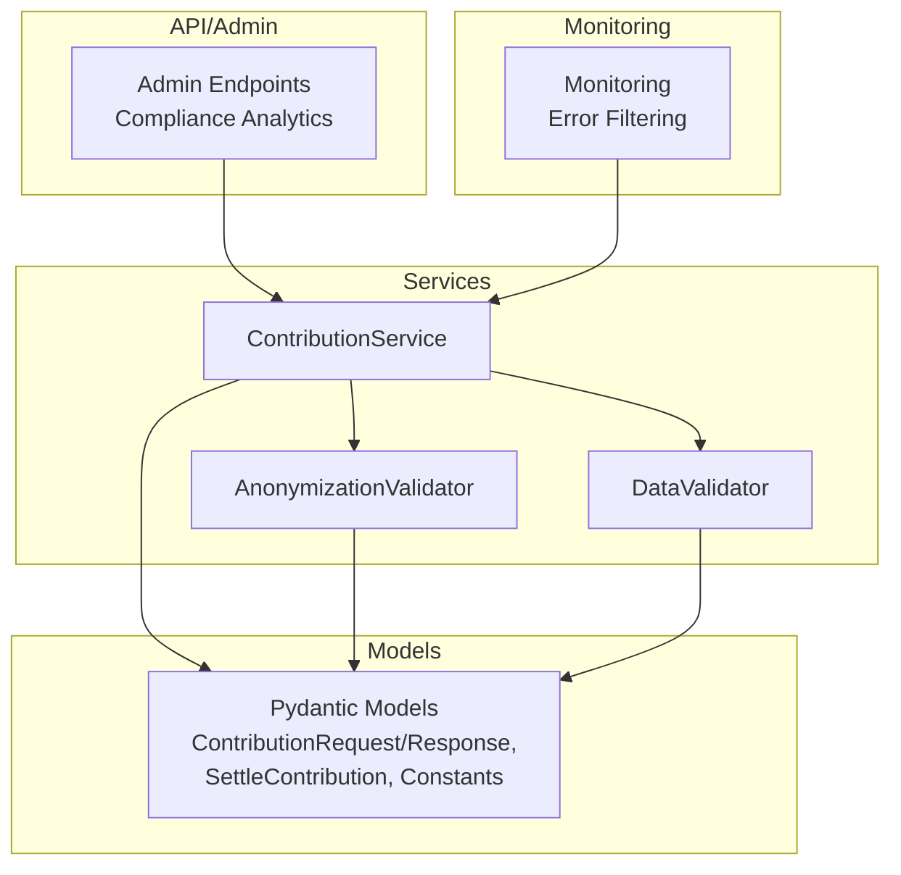
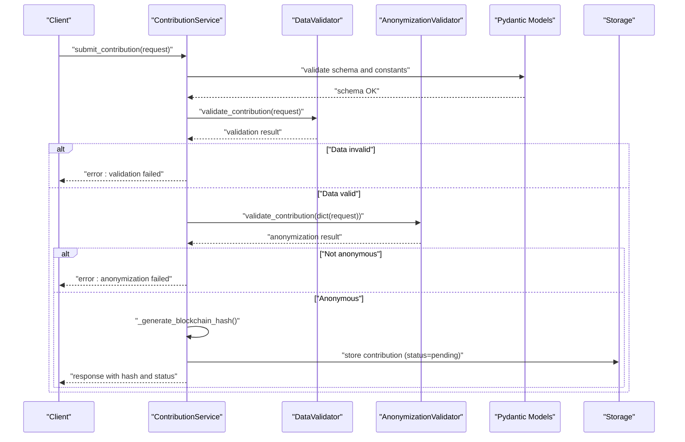
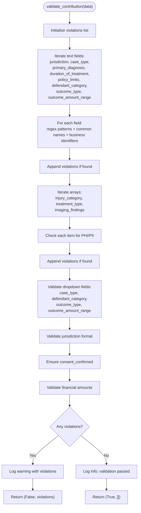
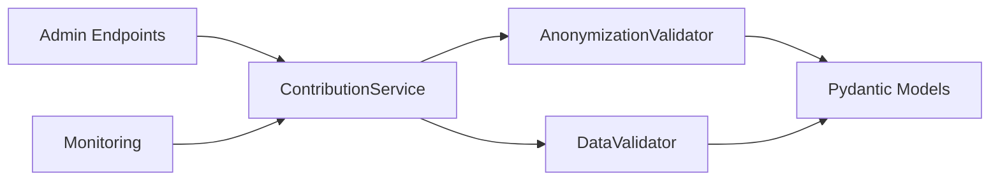

# Anonymization & Compliance

<cite>
**Referenced Files in This Document**
- [anonymizer.py](file://app/services/anonymizer.py)
- [validator.py](file://app/services/validator.py)
- [contributor.py](file://app/services/contributor.py)
- [case_bank.py](file://app/models/case_bank.py)
- [test_anonymizer.py](file://tests/test_anonymizer.py)
- [admin.py](file://app/api/v1/endpoints/admin.py)
- [monitoring.py](file://app/core/monitoring.py)
</cite>

## Table of Contents
1. [Introduction](#introduction)
2. [Project Structure](#project-structure)
3. [Core Components](#core-components)
4. [Architecture Overview](#architecture-overview)
5. [Detailed Component Analysis](#detailed-component-analysis)
6. [Dependency Analysis](#dependency-analysis)
7. [Performance Considerations](#performance-considerations)
8. [Troubleshooting Guide](#troubleshooting-guide)
9. [Conclusion](#conclusion)

## Introduction
This document describes the anonymization and compliance system for the SETTLE service. It focuses on the AnonymizationValidator implementation, including Protected Health Information (PHI) and Personally Identifiable Information (PII) detection, data masking techniques, and legal compliance requirements. It also documents anonymization rules for different data types, redaction strategies, compliance with legal frameworks, integration with validation systems, error handling for violations, and performance considerations for large datasets and real-time processing.

## Project Structure
The anonymization and compliance system spans several modules:
- AnonymizationValidator: Detects PHI/PII and enforces anonymization rules.
- DataValidator: Enforces data completeness, correctness, and business logic constraints.
- ContributionService: Orchestrates contribution submission, integrates validators, and generates blockchain hashes.
- Pydantic models: Define request/response schemas and validation constants.
- Tests: Validate anonymization behavior and compliance checks.
- Admin endpoints: Provide compliance monitoring metrics.
- Monitoring: Redacts sensitive data before error reporting.

**Diagram sources**
- [anonymizer.py:17-340](file://app/services/anonymizer.py#L17-L340)
- [validator.py:25-327](file://app/services/validator.py#L25-L327)
- [contributor.py:31-125](file://app/services/contributor.py#L31-L125)
- [case_bank.py:141-269](file://app/models/case_bank.py#L141-L269)
- [admin.py:682-706](file://app/api/v1/endpoints/admin.py#L682-L706)
- [monitoring.py:85-116](file://app/core/monitoring.py#L85-L116)

**Section sources**
- [anonymizer.py:1-340](file://app/services/anonymizer.py#L1-L340)
- [validator.py:1-327](file://app/services/validator.py#L1-L327)
- [contributor.py:1-339](file://app/services/contributor.py#L1-L339)
- [case_bank.py:1-269](file://app/models/case_bank.py#L1-L269)
- [admin.py:682-706](file://app/api/v1/endpoints/admin.py#L682-L706)
- [monitoring.py:85-116](file://app/core/monitoring.py#L85-L116)

## Core Components
- AnonymizationValidator
  - Detects PHI/PII via regex patterns and common names.
  - Enforces allowed drop-down values and bucketed outcomes.
  - Validates jurisdiction format and financial reasonableness.
  - Provides optional sanitization for legacy data cleanup.
  - Flags forbidden liability language.
- DataValidator
  - Ensures required fields, correct types, and value ranges.
  - Validates jurisdiction format and state codes.
  - Checks financial limits and flags outliers.
- ContributionService
  - Integrates DataValidator and AnonymizationValidator.
  - Generates blockchain hash (OpenTimestamps placeholder) for auditability.
  - Manages contribution lifecycle and status updates.
- Pydantic Models
  - Define allowed values for case types, outcomes, durations, and policy limits.
  - Enforce jurisdiction format and outcome range constraints.

**Section sources**
- [anonymizer.py:17-340](file://app/services/anonymizer.py#L17-L340)
- [validator.py:25-327](file://app/services/validator.py#L25-L327)
- [contributor.py:31-125](file://app/services/contributor.py#L31-L125)
- [case_bank.py:209-269](file://app/models/case_bank.py#L209-L269)

## Architecture Overview
The anonymization and compliance pipeline validates contributions in a strict order to prevent PHI/PII leakage and ensure bar-compliant data.

**Diagram sources**
- [contributor.py:55-125](file://app/services/contributor.py#L55-L125)
- [validator.py:52-138](file://app/services/validator.py#L52-L138)
- [anonymizer.py:92-180](file://app/services/anonymizer.py#L92-L180)
- [case_bank.py:141-189](file://app/models/case_bank.py#L141-L189)

## Detailed Component Analysis

### AnonymizationValidator
- Purpose: Ensure contributions are fully anonymized and bar-compliant.
- Key rules enforced:
  - No PHI/PII: Names, SSNs, DOBs, MRNs, case numbers, addresses, phones, emails, CPT/ICD codes.
  - No free-text narratives describing injuries or fault.
  - Only allowed values: drop-down selections, generic categories, bucketed amounts.
- Detection mechanisms:
  - Regex-based patterns for SSN, DOB, phone, email, case numbers, addresses.
  - Common names list for person name detection.
  - Forbidden liability language detection.
  - Jurisdiction format validation ("County, ST").
  - Financial reasonableness check ($1–$10M).
- Redaction strategy:
  - Sanitization replaces detected patterns with placeholders for legacy cleanup.
  - Production should reject submissions containing PHI/PII, not sanitize.
- Outputs:
  - Boolean validity and list of violations for downstream handling.

**Diagram sources**
- [anonymizer.py:92-180](file://app/services/anonymizer.py#L92-L180)
- [anonymizer.py:182-215](file://app/services/anonymizer.py#L182-L215)
- [anonymizer.py:217-261](file://app/services/anonymizer.py#L217-L261)

**Section sources**
- [anonymizer.py:17-340](file://app/services/anonymizer.py#L17-L340)

### DataValidator
- Purpose: Ensure data completeness, correctness, and business logic alignment.
- Validations:
  - Required fields and multi-select selections.
  - Jurisdiction format and state code validation.
  - Financial limits and reasonableness checks.
  - Outcome ranges and policy limits from allowed lists.
  - Outlier detection for manual review.
- Integration: Used by ContributionService prior to anonymization checks.

**Section sources**
- [validator.py:25-327](file://app/services/validator.py#L25-L327)
- [case_bank.py:209-269](file://app/models/case_bank.py#L209-L269)

### ContributionService
- Purpose: Orchestrate the end-to-end contribution workflow.
- Workflow:
  1. Validate schema and constants (Pydantic models).
  2. Run DataValidator.
  3. Run AnonymizationValidator.
  4. Generate blockchain hash (placeholder for OpenTimestamps).
  5. Persist contribution (status=pending).
  6. Update Founding Member stats if applicable.
- Error handling:
  - Stops and returns errors on validation failures.
  - Logs warnings and errors for transparency.

**Section sources**
- [contributor.py:31-125](file://app/services/contributor.py#L31-L125)

### Pydantic Models and Allowed Values
- ContributionRequest/Response define required fields, value constraints, and allowed buckets.
- Constants (VALID_* lists) enforce controlled vocabularies for case types, outcomes, durations, and policy limits.

**Section sources**
- [case_bank.py:141-189](file://app/models/case_bank.py#L141-L189)
- [case_bank.py:209-269](file://app/models/case_bank.py#L209-L269)

### Admin Compliance Monitoring
- Admin endpoints expose compliance analytics placeholders for tracking anonymization verification rates, PII detections, and blockchain hash generation.

**Section sources**
- [admin.py:682-706](file://app/api/v1/endpoints/admin.py#L682-L706)

### Error Handling and Sensitive Data Filtering
- Monitoring module redacts sensitive headers, query strings, and request bodies before sending events to error tracking to maintain bar compliance.

**Section sources**
- [monitoring.py:85-116](file://app/core/monitoring.py#L85-L116)

## Dependency Analysis
- ContributionService depends on DataValidator and AnonymizationValidator.
- AnonymizationValidator references Pydantic models for allowed values and jurisdiction constraints.
- DataValidator references Pydantic models for allowed values and jurisdiction constraints.
- Admin endpoints depend on ContributionService for analytics.
- Monitoring filters sensitive data from error reports.

**Diagram sources**
- [contributor.py:52-53](file://app/services/contributor.py#L52-L53)
- [anonymizer.py:31-90](file://app/services/anonymizer.py#L31-L90)
- [validator.py:12-20](file://app/services/validator.py#L12-L20)
- [admin.py:682-706](file://app/api/v1/endpoints/admin.py#L682-L706)
- [monitoring.py:85-116](file://app/core/monitoring.py#L85-L116)

**Section sources**
- [contributor.py:52-53](file://app/services/contributor.py#L52-L53)
- [anonymizer.py:31-90](file://app/services/anonymizer.py#L31-L90)
- [validator.py:12-20](file://app/services/validator.py#L12-L20)
- [admin.py:682-706](file://app/api/v1/endpoints/admin.py#L682-L706)
- [monitoring.py:85-116](file://app/core/monitoring.py#L85-L116)

## Performance Considerations
- Regex-based detection scales linearly with input length; keep patterns minimal and anchored.
- Array fields are iterated; consider batching and streaming for large datasets.
- Jurisdiction and financial validations are O(1); negligible overhead.
- Outlier detection uses simple arithmetic; cache midpoints if reused frequently.
- Real-time processing:
  - Use asynchronous validation where appropriate (e.g., database checks).
  - Offload blockchain hash generation to external services for throughput.
  - Employ rate limiting and circuit breakers around external integrations.
- Large datasets:
  - Partition validation into stages and parallelize independent checks.
  - Use indexing on jurisdiction/state fields for faster filtering.
  - Consider approximate matching for names only if strictness allows.

## Troubleshooting Guide
Common issues and resolutions:
- Validation fails due to jurisdiction format:
  - Ensure "County, ST" format with two-letter state code.
- Invalid dropdown values:
  - Confirm values match allowed lists (case types, outcome types, outcome ranges, durations, policy limits).
- Financial amounts out of range:
  - Keep medical bills between $1 and $10M; lost wages non-negative and below configured cap.
- PHI/PII detected:
  - Remove or redact names, SSNs, DOBs, MRNs, case numbers, addresses, phones, emails.
  - Avoid free-text narratives describing injuries or fault.
- Liability language found:
  - Replace phrases indicating fault or liability with neutral summaries.
- Sanitization vs. rejection:
  - Production should reject submissions containing PHI/PII; sanitization is for legacy cleanup only.
- Error reporting:
  - Sensitive data is redacted before logging to error tracking.

**Section sources**
- [validator.py:140-181](file://app/services/validator.py#L140-L181)
- [validator.py:183-224](file://app/services/validator.py#L183-L224)
- [anonymizer.py:217-261](file://app/services/anonymizer.py#L217-L261)
- [anonymizer.py:263-301](file://app/services/anonymizer.py#L263-L301)
- [monitoring.py:85-116](file://app/core/monitoring.py#L85-L116)

## Conclusion
The anonymization and compliance system enforces strict PHI/PII prevention and bar-compliant data handling through layered validation. AnonymizationValidator detects prohibited content and ensures allowed values and formats, while DataValidator guarantees completeness and reasonableness. ContributionService orchestrates the workflow, integrates validators, and prepares contributions for storage and future verification. Admin endpoints and monitoring support ongoing compliance oversight and secure error reporting. For large-scale and real-time deployments, optimize regex patterns, leverage asynchronous processing, and integrate external services for blockchain hashing and outlier analysis.