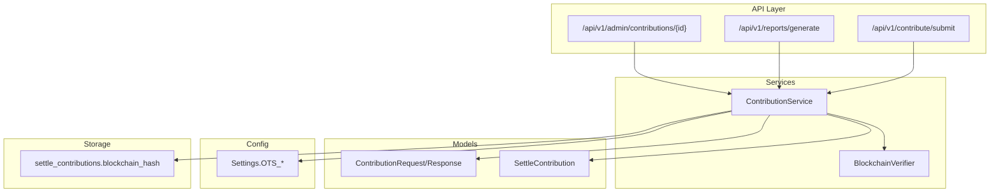
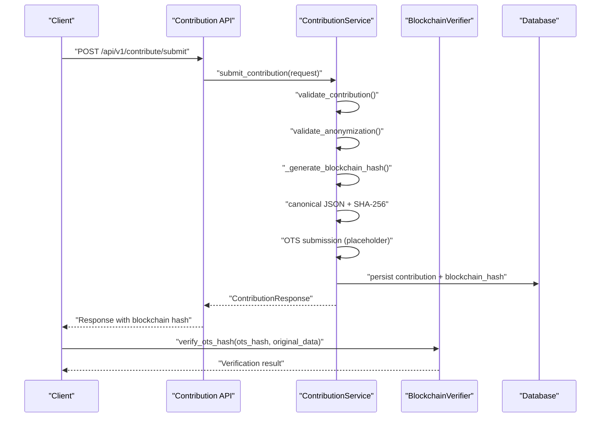
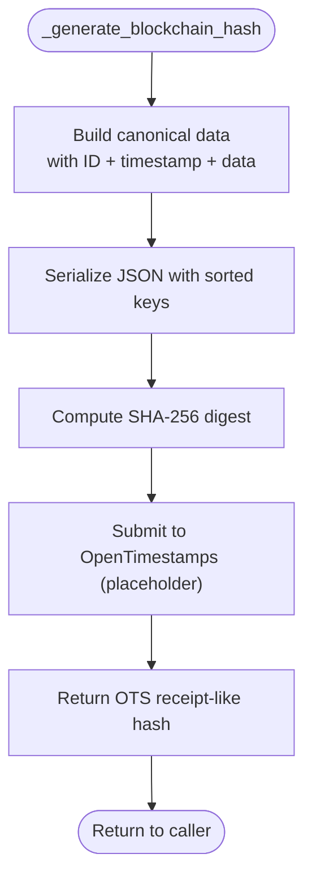
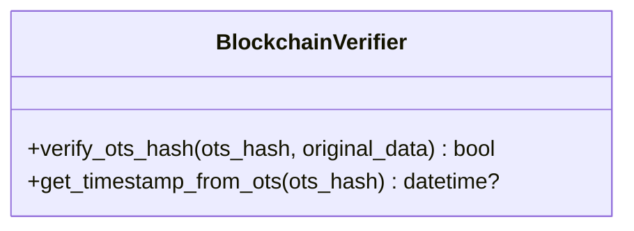
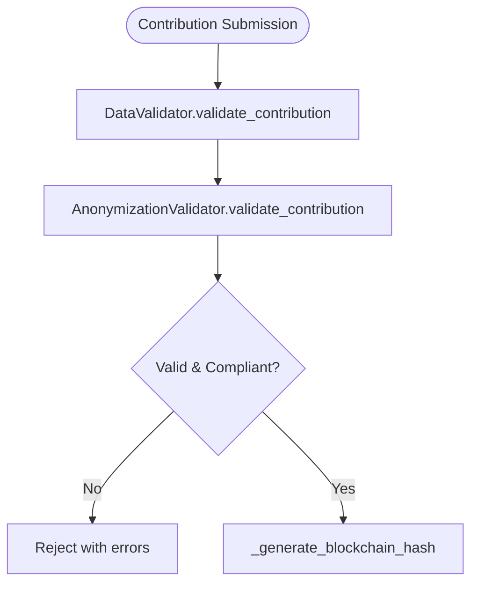
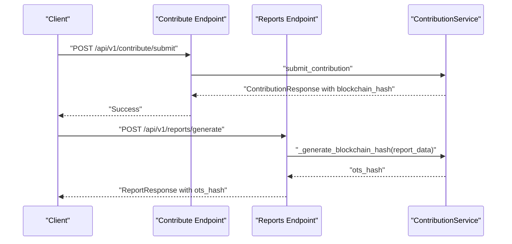
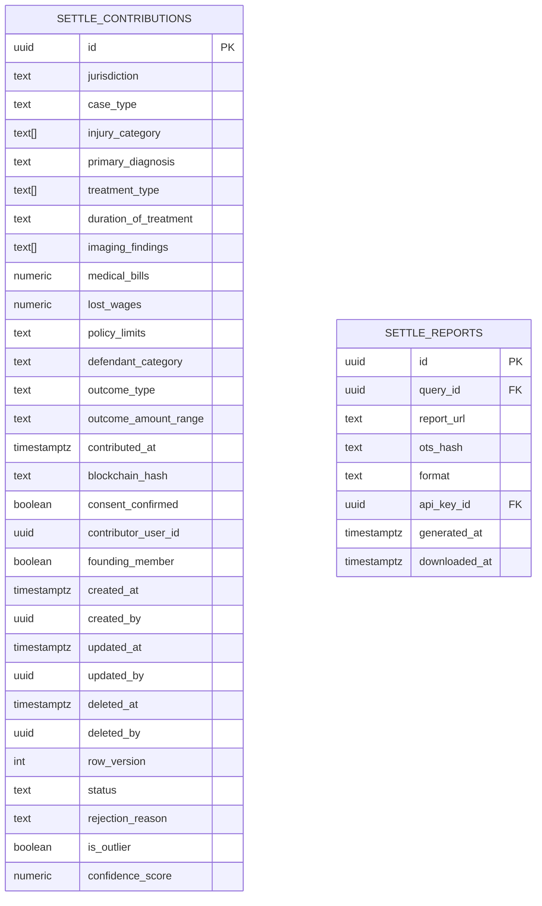
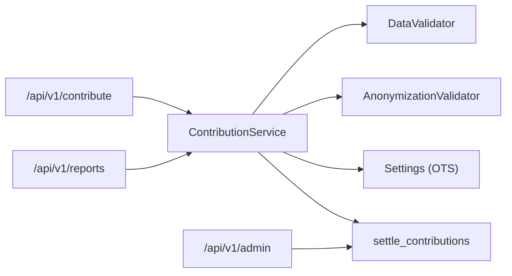

# Blockchain Integration

<cite>
**Referenced Files in This Document**
- [contributor.py](file://app/services/contributor.py)
- [config.py](file://app/core/config.py)
- [case_bank.py](file://app/models/case_bank.py)
- [contribute.py](file://app/api/v1/endpoints/contribute.py)
- [reports.py](file://app/api/v1/endpoints/reports.py)
- [admin.py](file://app/api/v1/endpoints/admin.py)
- [validator.py](file://app/services/validator.py)
- [anonymizer.py](file://app/services/anonymizer.py)
- [settle_supabase.sql](file://database/schemas/settle_supabase.sql)
</cite>

## Table of Contents
1. [Introduction](#introduction)
2. [Project Structure](#project-structure)
3. [Core Components](#core-components)
4. [Architecture Overview](#architecture-overview)
5. [Detailed Component Analysis](#detailed-component-analysis)
6. [Dependency Analysis](#dependency-analysis)
7. [Performance Considerations](#performance-considerations)
8. [Troubleshooting Guide](#troubleshooting-guide)
9. [Conclusion](#conclusion)

## Introduction
This document describes the blockchain integration system using OpenTimestamps within the SETTLE service. It explains how canonical data representation and SHA-256 hashing are used to produce blockchain receipts, how OpenTimestamps verification is modeled, and how timestamps are extracted for auditability. It also documents the current implementation state (with placeholder logic), outlines integration challenges, error handling approaches, and fallback mechanisms for verification failures.

## Project Structure
The blockchain integration spans several layers:
- API endpoints orchestrate contribution and report generation workflows
- Services encapsulate business logic, including data validation, anonymization, and blockchain hash generation
- Models define request/response shapes and database entities
- Configuration exposes OpenTimestamps-related settings
- Database schema stores blockchain hashes alongside contribution records

**Diagram sources**
- [contribute.py:51-125](file://app/api/v1/endpoints/contribute.py#L51-L125)
- [reports.py:23-188](file://app/api/v1/endpoints/reports.py#L23-L188)
- [contributor.py:31-125](file://app/services/contributor.py#L31-L125)
- [config.py:188-191](file://app/core/config.py#L188-L191)
- [settle_supabase.sql:31-113](file://database/schemas/settle_supabase.sql#L31-L113)

**Section sources**
- [contribute.py:51-125](file://app/api/v1/endpoints/contribute.py#L51-L125)
- [reports.py:23-188](file://app/api/v1/endpoints/reports.py#L23-L188)
- [contributor.py:31-125](file://app/services/contributor.py#L31-L125)
- [config.py:188-191](file://app/core/config.py#L188-L191)
- [settle_supabase.sql:31-113](file://database/schemas/settle_supabase.sql#L31-L113)

## Core Components
- ContributionService orchestrates contribution submission, validation, anonymization, blockchain hash generation, persistence, and Founding Member tracking.
- BlockchainVerifier is a utility class designed to verify OpenTimestamps hashes and extract timestamps from receipts.
- Configuration exposes OpenTimestamps feature flags and calendar endpoint.
- Database schema persists blockchain hashes on contributions and reports.

Key implementation highlights:
- Canonical JSON creation with deterministic sorting
- SHA-256 hashing of canonicalized data
- Placeholder OpenTimestamps submission and verification
- Timestamp extraction utilities

**Section sources**
- [contributor.py:31-125](file://app/services/contributor.py#L31-L125)
- [contributor.py:127-192](file://app/services/contributor.py#L127-L192)
- [contributor.py:300-337](file://app/services/contributor.py#L300-L337)
- [config.py:188-191](file://app/core/config.py#L188-L191)
- [settle_supabase.sql:71-72](file://database/schemas/settle_supabase.sql#L71-L72)

## Architecture Overview
The blockchain integration follows a deterministic pipeline:
1. Data validation and anonymization
2. Canonical JSON construction
3. SHA-256 hashing
4. OpenTimestamps submission (placeholder)
5. Receipt storage and retrieval

**Diagram sources**
- [contribute.py:51-125](file://app/api/v1/endpoints/contribute.py#L51-L125)
- [contributor.py:55-125](file://app/services/contributor.py#L55-L125)
- [contributor.py:127-192](file://app/services/contributor.py#L127-L192)
- [contributor.py:300-337](file://app/services/contributor.py#L300-L337)
- [settle_supabase.sql:71-72](file://database/schemas/settle_supabase.sql#L71-L72)

## Detailed Component Analysis

### ContributionService: Hash Generation and Verification
- Generates a canonical JSON object containing contribution identity, timestamp, and data payload
- Produces a SHA-256 digest of the canonical JSON
- Submits to OpenTimestamps (placeholder logic returns a prefixed hash)
- Provides asynchronous verification method (placeholder)
- Emits behavioral events upon successful submission

**Diagram sources**
- [contributor.py:127-173](file://app/services/contributor.py#L127-L173)

**Section sources**
- [contributor.py:55-125](file://app/services/contributor.py#L55-L125)
- [contributor.py:127-192](file://app/services/contributor.py#L127-L192)

### BlockchainVerifier: Verification and Timestamp Extraction
- Static method to verify an OpenTimestamps hash against original data
- Static method to extract a timestamp from an OTS receipt (placeholder returns current time)
- Intended for external verification and audit trails

**Diagram sources**
- [contributor.py:300-337](file://app/services/contributor.py#L300-L337)

**Section sources**
- [contributor.py:300-337](file://app/services/contributor.py#L300-L337)

### Data Validation and Anonymization
- DataValidator ensures required fields, value ranges, and business constraints
- AnonymizationValidator enforces strict PHI/PII prevention and drop-down compliance

**Diagram sources**
- [validator.py:52-138](file://app/services/validator.py#L52-L138)
- [anonymizer.py:92-180](file://app/services/anonymizer.py#L92-L180)

**Section sources**
- [validator.py:52-138](file://app/services/validator.py#L52-L138)
- [anonymizer.py:92-180](file://app/services/anonymizer.py#L92-L180)

### API Workflows: Contribution and Report Generation
- Contribution endpoint validates, anonymizes, generates a blockchain hash, persists the record, and emits events
- Report generation endpoint builds a report-specific canonical payload, computes a blockchain hash, and returns it with the report

**Diagram sources**
- [contribute.py:51-125](file://app/api/v1/endpoints/contribute.py#L51-L125)
- [reports.py:23-188](file://app/api/v1/endpoints/reports.py#L23-L188)
- [contributor.py:127-173](file://app/services/contributor.py#L127-L173)

**Section sources**
- [contribute.py:51-125](file://app/api/v1/endpoints/contribute.py#L51-L125)
- [reports.py:23-188](file://app/api/v1/endpoints/reports.py#L23-L188)

### Database Schema: Blockchain Hash Storage
- The contributions table includes a blockchain_hash column for storing OTS receipts
- Reports table includes an ots_hash column for report integrity

**Diagram sources**
- [settle_supabase.sql:31-113](file://database/schemas/settle_supabase.sql#L31-L113)
- [settle_supabase.sql:287-310](file://database/schemas/settle_supabase.sql#L287-L310)

**Section sources**
- [settle_supabase.sql:31-113](file://database/schemas/settle_supabase.sql#L31-L113)
- [settle_supabase.sql:287-310](file://database/schemas/settle_supabase.sql#L287-L310)

## Dependency Analysis
- API endpoints depend on ContributionService for business logic
- ContributionService depends on DataValidator, AnonymizationValidator, and configuration for OTS settings
- Database schema defines where blockchain hashes are persisted
- Admin endpoints surface contribution details including blockchain hashes for oversight

**Diagram sources**
- [contribute.py:51-125](file://app/api/v1/endpoints/contribute.py#L51-L125)
- [reports.py:23-188](file://app/api/v1/endpoints/reports.py#L23-L188)
- [contributor.py:31-125](file://app/services/contributor.py#L31-L125)
- [config.py:188-191](file://app/core/config.py#L188-L191)
- [settle_supabase.sql:31-113](file://database/schemas/settle_supabase.sql#L31-L113)
- [admin.py:97-135](file://app/api/v1/endpoints/admin.py#L97-L135)

**Section sources**
- [contribute.py:51-125](file://app/api/v1/endpoints/contribute.py#L51-L125)
- [reports.py:23-188](file://app/api/v1/endpoints/reports.py#L23-L188)
- [contributor.py:31-125](file://app/services/contributor.py#L31-L125)
- [config.py:188-191](file://app/core/config.py#L188-L191)
- [settle_supabase.sql:31-113](file://database/schemas/settle_supabase.sql#L31-L113)
- [admin.py:97-135](file://app/api/v1/endpoints/admin.py#L97-L135)

## Performance Considerations
- Canonical JSON serialization and SHA-256 hashing are lightweight operations suitable for high-throughput scenarios
- OpenTimestamps submission is currently a placeholder; production deployments should account for network latency and retry/backoff strategies
- Database writes should leverage prepared statements and batch inserts where appropriate
- Consider caching frequently accessed verification results for read-heavy workloads

## Troubleshooting Guide
Common issues and mitigations:
- Validation failures: Inspect DataValidator and AnonymizationValidator error messages to identify missing fields, out-of-range values, or PHI/PII violations
- Hash generation failures: Confirm canonical JSON construction and deterministic sorting; ensure SHA-256 hashing is applied to UTF-8 encoded canonical JSON
- Verification failures: Since verification is currently a placeholder, implement robust error handling for network timeouts and malformed receipts
- Database persistence: Ensure blockchain_hash columns are populated and indexed appropriately for audit queries

Operational checks:
- Verify OpenTimestamps feature flags and calendar URL in configuration
- Confirm database schema includes blockchain_hash columns for contributions and reports
- Monitor behavioral events emitted during contribution submission

**Section sources**
- [validator.py:52-138](file://app/services/validator.py#L52-L138)
- [anonymizer.py:92-180](file://app/services/anonymizer.py#L92-L180)
- [contributor.py:127-192](file://app/services/contributor.py#L127-L192)
- [config.py:188-191](file://app/core/config.py#L188-L191)
- [settle_supabase.sql:71-72](file://database/schemas/settle_supabase.sql#L71-L72)

## Conclusion
The blockchain integration leverages canonical JSON and SHA-256 hashing to produce verifiable receipts compatible with OpenTimestamps. While the OpenTimestamps submission and verification are currently placeholders, the architecture supports straightforward integration of a production calendar client and receipt verification library. The database schema and API endpoints are aligned to persist and expose blockchain hashes for transparency and auditability. Future enhancements should focus on resilient network operations, comprehensive error handling, and robust verification workflows.