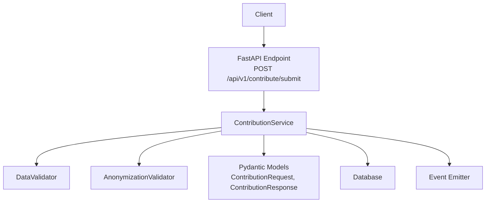
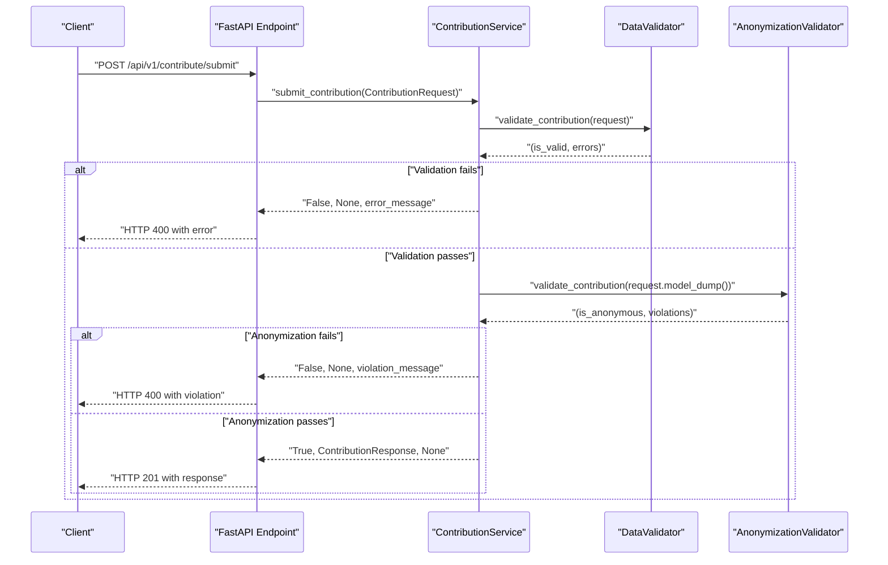
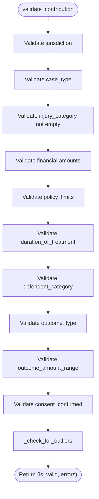
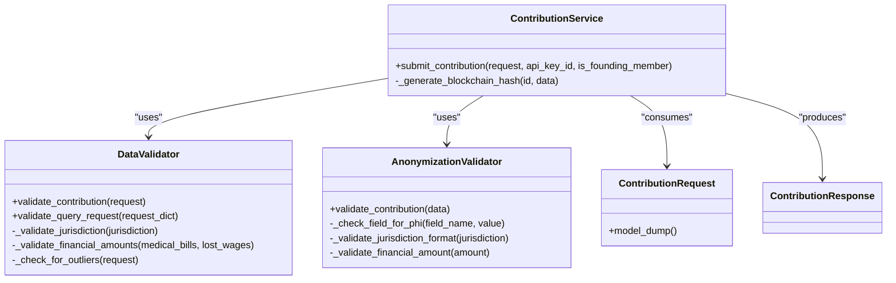

# Contribution Validation

<cite>
**Referenced Files in This Document**
- [validator.py](file://app/services/validator.py)
- [settlement_validator.py](file://app/services/settlement_validator.py)
- [anonymizer.py](file://app/services/anonymizer.py)
- [contributor.py](file://app/services/contributor.py)
- [case_bank.py](file://app/models/case_bank.py)
- [contribute.py](file://app/api/v1/endpoints/contribute.py)
- [test_validator.py](file://tests/test_validator.py)
</cite>

## Table of Contents
1. [Introduction](#introduction)
2. [Project Structure](#project-structure)
3. [Core Components](#core-components)
4. [Architecture Overview](#architecture-overview)
5. [Detailed Component Analysis](#detailed-component-analysis)
6. [Dependency Analysis](#dependency-analysis)
7. [Performance Considerations](#performance-considerations)
8. [Troubleshooting Guide](#troubleshooting-guide)
9. [Conclusion](#conclusion)

## Introduction
This document describes the contribution validation subsystem that ensures data completeness, correctness, and compliance for settlement contributions. It covers:
- DataValidator for contribution and query validation
- AnonymizationValidator for PHI/PII prevention
- Integration with Pydantic models for serialization/deserialization
- Validation rules for settlement data fields, required fields, and constraints
- Error handling, message formatting, and pipeline execution
- Performance optimization and caching strategies
- Error propagation mechanisms

## Project Structure
The validation subsystem spans services, models, and API endpoints:
- Services: DataValidator, AnonymizationValidator, ContributionService, SettlementValidator
- Models: Pydantic models for request/response and constants for dropdown options
- API: FastAPI endpoints that orchestrate validation and error handling

**Diagram sources**
- [contribute.py:51-125](file://app/api/v1/endpoints/contribute.py#L51-L125)
- [contributor.py:55-125](file://app/services/contributor.py#L55-L125)
- [validator.py:52-138](file://app/services/validator.py#L52-L138)
- [anonymizer.py:92-180](file://app/services/anonymizer.py#L92-L180)
- [case_bank.py:141-202](file://app/models/case_bank.py#L141-L202)

**Section sources**
- [contribute.py:51-125](file://app/api/v1/endpoints/contribute.py#L51-L125)
- [contributor.py:31-125](file://app/services/contributor.py#L31-L125)
- [validator.py:25-138](file://app/services/validator.py#L25-L138)
- [anonymizer.py:17-180](file://app/services/anonymizer.py#L17-L180)
- [case_bank.py:141-202](file://app/models/case_bank.py#L141-L202)

## Core Components
- DataValidator: Validates contribution completeness, jurisdiction format, case/outcome types, financial ranges, policy limits, duration of treatment, defendant category, outcome amount range, and consent. Includes outlier detection and warning logs.
- AnonymizationValidator: Enforces strict anonymization rules to prevent PHI/PII and forbidden language; validates jurisdiction format and financial reasonableness.
- ContributionService: Orchestrates validation, anonymization, blockchain hash generation, persistence, and founding member stats; propagates errors to the API layer.
- Pydantic models: Define typed request/response shapes, enforce field constraints, and provide automatic serialization/deserialization.

**Section sources**
- [validator.py:25-138](file://app/services/validator.py#L25-L138)
- [anonymizer.py:17-180](file://app/services/anonymizer.py#L17-L180)
- [contributor.py:31-125](file://app/services/contributor.py#L31-L125)
- [case_bank.py:141-202](file://app/models/case_bank.py#L141-L202)

## Architecture Overview
The validation pipeline executes in the API endpoint and service layer:

**Diagram sources**
- [contribute.py:78-104](file://app/api/v1/endpoints/contribute.py#L78-L104)
- [contributor.py:72-87](file://app/services/contributor.py#L72-L87)
- [validator.py:52-138](file://app/services/validator.py#L52-L138)
- [anonymizer.py:92-180](file://app/services/anonymizer.py#L92-L180)

## Detailed Component Analysis

### DataValidator
Responsibilities:
- Completeness checks: required fields, non-empty arrays, consent confirmation
- Data type and format validation: jurisdiction format, numeric ranges
- Business rule enforcement: outcome range buckets, policy limits, duration of treatment, defendant category, case type
- Outlier detection: statistical anomalies flagged for manual review

Key validation rules:
- Jurisdiction must be "County, ST" with 2-letter state code
- At least one injury category required
- Medical bills must be within [$1, $10M]; lost wages non-negative and ≤ $5M
- Outcome amount range must be one of predefined buckets
- Consent must be confirmed
- Policy limits and duration of treatment must be from allowed lists
- Defendant category and outcome type must be from allowed lists

Error handling and messages:
- Aggregates errors into a list; returns (is_valid, errors)
- Logs warnings for outliers and validation failures
- Error messages enumerate allowed values for dropdowns

Pipeline execution:
- validate_contribution orchestrates all checks
- _validate_jurisdiction enforces format and state code
- _validate_financial_amounts enforces numeric bounds
- _check_for_outliers computes multipliers and flags anomalies

**Diagram sources**
- [validator.py:52-138](file://app/services/validator.py#L52-L138)
- [validator.py:140-181](file://app/services/validator.py#L140-L181)
- [validator.py:183-224](file://app/services/validator.py#L183-L224)
- [validator.py:226-262](file://app/services/validator.py#L226-L262)

**Section sources**
- [validator.py:25-138](file://app/services/validator.py#L25-L138)
- [validator.py:140-181](file://app/services/validator.py#L140-L181)
- [validator.py:183-224](file://app/services/validator.py#L183-L224)
- [validator.py:226-262](file://app/services/validator.py#L226-L262)

### AnonymizationValidator
Responsibilities:
- Prevents PHI/PII: SSN, DOB, phone, email, case numbers, MRN, addresses
- Prohibits free-text narratives and specific identifiers
- Enforces allowed dropdown values and bucketed outcomes
- Validates jurisdiction format and financial reasonableness
- Flags forbidden liability language

Error handling and messages:
- Returns (is_valid, violations)
- Violations enumerate forbidden patterns and disallowed values

Integration:
- Used by ContributionService after DataValidator passes

**Section sources**
- [anonymizer.py:17-180](file://app/services/anonymizer.py#L17-L180)
- [anonymizer.py:217-261](file://app/services/anonymizer.py#L217-L261)
- [contributor.py:79-87](file://app/services/contributor.py#L79-L87)

### ContributionService
Responsibilities:
- Orchestration of validation and anonymization
- Blockchain hash generation (OpenTimestamps placeholder)
- Persistence and founding member stats updates
- Error propagation to API layer

Execution:
- On success: returns ContributionResponse with contribution_id and blockchain hash
- On failure: returns (False, None, error_message)

**Section sources**
- [contributor.py:55-125](file://app/services/contributor.py#L55-L125)
- [contributor.py:127-173](file://app/services/contributor.py#L127-L173)

### Pydantic Models and Serialization
- ContributionRequest: Typed request model with field validators for jurisdiction format and outcome range buckets
- ContributionResponse: Typed response model
- EstimateRequest: Query request model with constraints
- Constants: VALID_* lists for dropdown options used by DataValidator

Serialization/deserialization:
- FastAPI automatically serializes/deserializes using Pydantic models
- model_dump() converts validated models to dictionaries for anonymization

**Section sources**
- [case_bank.py:141-188](file://app/models/case_bank.py#L141-L188)
- [case_bank.py:191-202](file://app/models/case_bank.py#L191-L202)
- [case_bank.py:69-84](file://app/models/case_bank.py#L69-L84)
- [case_bank.py:209-268](file://app/models/case_bank.py#L209-L268)
- [contributor.py:80-83](file://app/services/contributor.py#L80-L83)

### API Endpoint Integration
- POST /api/v1/contribute/submit validates input, invokes ContributionService, and handles errors
- On validation/anonymization failure: returns HTTP 400 with structured error details
- On success: returns HTTP 201 with ContributionResponse

**Section sources**
- [contribute.py:51-125](file://app/api/v1/endpoints/contribute.py#L51-L125)

### SettlementValidator (Dataset Integrity)
While focused on contribution validation here, SettlementValidator enforces dataset integrity for settlement records:
- Case must exist in MDM
- Only one settlement per case
- Settlement date must follow incident date
- Policy limit sanity check with tolerance
- County must match incident and settlement locations

Verification workflow:
- validate returns ValidationResult with errors/warnings and verification status
- verify_settlement/reject_settlement update verification_status
- get_verified_count counts verified settlements for rewards

**Section sources**
- [settlement_validator.py:59-135](file://app/services/settlement_validator.py#L59-L135)
- [settlement_validator.py:167-227](file://app/services/settlement_validator.py#L167-L227)
- [settlement_validator.py:229-263](file://app/services/settlement_validator.py#L229-L263)

## Dependency Analysis

**Diagram sources**
- [validator.py:25-138](file://app/services/validator.py#L25-L138)
- [anonymizer.py:17-180](file://app/services/anonymizer.py#L17-L180)
- [contributor.py:31-125](file://app/services/contributor.py#L31-L125)
- [case_bank.py:141-202](file://app/models/case_bank.py#L141-L202)

**Section sources**
- [validator.py:25-138](file://app/services/validator.py#L25-L138)
- [anonymizer.py:17-180](file://app/services/anonymizer.py#L17-L180)
- [contributor.py:31-125](file://app/services/contributor.py#L31-L125)
- [case_bank.py:141-202](file://app/models/case_bank.py#L141-L202)

## Performance Considerations
- Validation complexity:
  - DataValidator: O(1) per field; overall linear in number of validated fields
  - AnonymizationValidator: O(n) over text fields and arrays; regex scanning cost depends on input length
- Caching strategies:
  - QueryCacheService caches settlement query results for 24 hours keyed by normalized parameters
  - SettlementValidator could cache MDM and settlement existence checks if database calls become hotspots
- Optimization opportunities:
  - Precompile regex patterns in AnonymizationValidator
  - Normalize jurisdiction/state parsing once per request
  - Batch database checks for SettlementValidator if multiple validations are performed
  - Use Redis/memcached for frequently accessed dropdown option lookups (currently loaded from constants)

[No sources needed since this section provides general guidance]

## Troubleshooting Guide
Common validation failures and resolution steps:
- Jurisdiction format errors: Ensure "County, ST" format with 2-letter state code
- Missing required fields: Provide all required fields and non-empty arrays
- Invalid dropdown values: Choose from allowed lists (case types, outcome ranges, etc.)
- Financial amount out of range: Keep medical bills between $1 and $10M; lost wages non-negative and ≤ $5M
- Consent not confirmed: Set consent_confirmed to True
- Anonymization violations: Remove PHI/PII; avoid free-text narratives; use allowed dropdown values
- Outlier warnings: Review outcome vs. medical bills ratio; provide justification if unusual but legitimate

Error propagation:
- API layer catches service errors and returns HTTP 400 with structured details
- Logging captures validation failures and warnings for diagnostics

**Section sources**
- [validator.py:133-136](file://app/services/validator.py#L133-L136)
- [anonymizer.py:175-178](file://app/services/anonymizer.py#L175-L178)
- [contribute.py:99-104](file://app/api/v1/endpoints/contribute.py#L99-L104)
- [test_validator.py:11-31](file://tests/test_validator.py#L11-L31)
- [test_validator.py:34-53](file://tests/test_validator.py#L34-L53)
- [test_validator.py:56-97](file://tests/test_validator.py#L56-L97)
- [test_validator.py:100-139](file://tests/test_validator.py#L100-L139)

## Conclusion
The contribution validation subsystem combines Pydantic-driven schema validation with custom business logic to ensure data integrity, compliance, and anonymity. The modular design separates concerns across DataValidator, AnonymizationValidator, and ContributionService, while the API layer provides clear error propagation and logging. Performance can be further optimized through caching and regex normalization, and SettlementValidator complements contribution validation by enforcing dataset-level constraints.