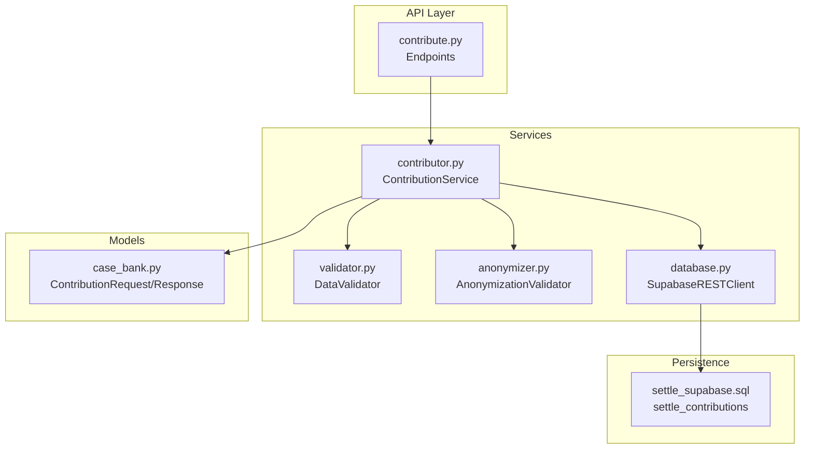
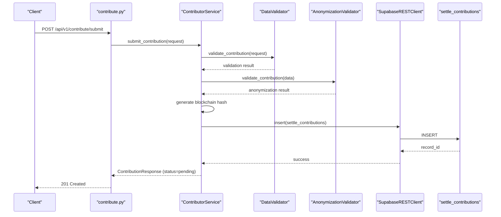
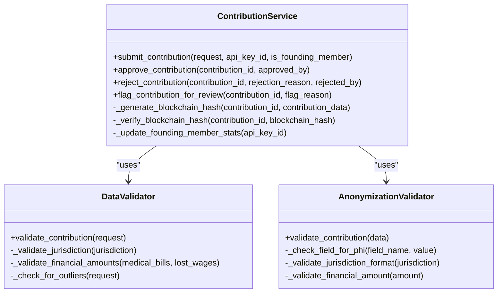
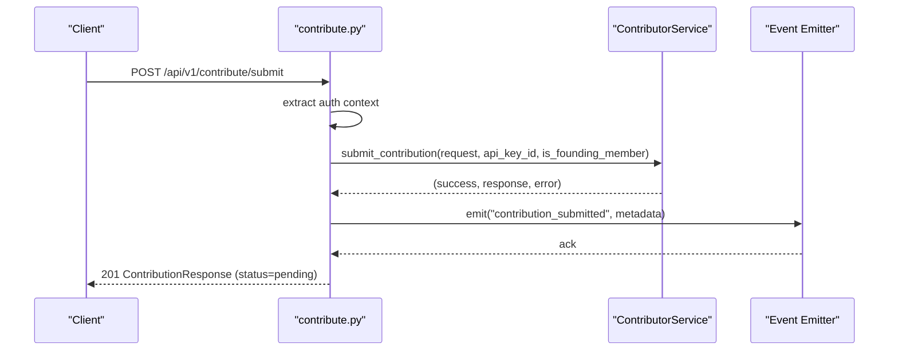
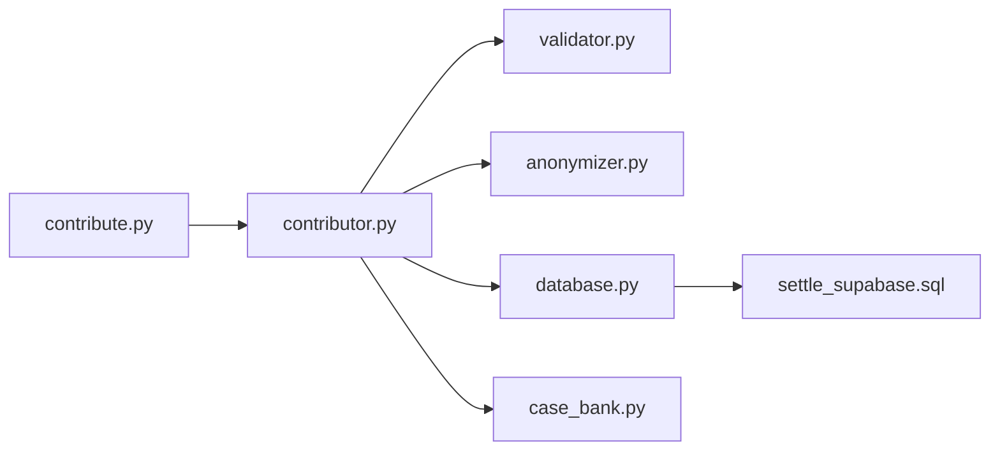

# Contribution Workflow Management

<cite>
**Referenced Files in This Document**
- [contribution_service.py](file://app/services/contribution_service.py)
- [contributor.py](file://app/services/contributor.py)
- [contribute.py](file://app/api/v1/endpoints/contribute.py)
- [case_bank.py](file://app/models/case_bank.py)
- [database.py](file://app/core/database.py)
- [validator.py](file://app/services/validator.py)
- [anonymizer.py](file://app/services/anonymizer.py)
- [settle_supabase.sql](file://database/schemas/settle_supabase.sql)
- [CREATE_SETTLE_DATABASE.sql](file://database/CREATE_SETTLE_DATABASE.sql)
- [client.py](file://app/services/integrations/internal_ops/client.py)
</cite>

## Table of Contents
1. [Introduction](#introduction)
2. [Project Structure](#project-structure)
3. [Core Components](#core-components)
4. [Architecture Overview](#architecture-overview)
5. [Detailed Component Analysis](#detailed-component-analysis)
6. [Dependency Analysis](#dependency-analysis)
7. [Performance Considerations](#performance-considerations)
8. [Troubleshooting Guide](#troubleshooting-guide)
9. [Conclusion](#conclusion)

## Introduction
This document describes the complete contribution workflow management system for settlement intelligence contributions. It covers the ContributionService implementation, contribution lifecycle stages, status tracking, workflow orchestration, submission pipeline from validation through approval, pending review states, administrative actions, contribution ID generation, metadata management, audit trail creation, integration with external services, notification systems, and database operations for contribution tracking.

## Project Structure
The contribution workflow spans several modules:
- API endpoints define the public and admin interfaces for contributions
- Services encapsulate business logic for validation, anonymization, blockchain hashing, and administrative actions
- Models define request/response contracts and validation constants
- Core database utilities provide a REST-based client abstraction
- Validators enforce data correctness and compliance
- Database schemas define persistence and audit fields

**Diagram sources**
- [contribute.py:51-125](file://app/api/v1/endpoints/contribute.py#L51-L125)
- [contributor.py:31-125](file://app/services/contributor.py#L31-L125)
- [validator.py:25-138](file://app/services/validator.py#L25-L138)
- [anonymizer.py:17-180](file://app/services/anonymizer.py#L17-L180)
- [database.py:220-372](file://app/core/database.py#L220-L372)
- [case_bank.py:141-203](file://app/models/case_bank.py#L141-L203)
- [settle_supabase.sql:31-113](file://database/schemas/settle_supabase.sql#L31-L113)

**Section sources**
- [contribute.py:1-164](file://app/api/v1/endpoints/contribute.py#L1-L164)
- [contributor.py:1-339](file://app/services/contributor.py#L1-L339)
- [validator.py:1-327](file://app/services/validator.py#L1-L327)
- [anonymizer.py:1-340](file://app/services/anonymizer.py#L1-L340)
- [database.py:1-549](file://app/core/database.py#L1-L549)
- [case_bank.py:1-269](file://app/models/case_bank.py#L1-L269)
- [settle_supabase.sql:1-200](file://database/schemas/settle_supabase.sql#L1-L200)

## Core Components
- ContributionService orchestrates the end-to-end contribution workflow, including validation, anonymization, blockchain hash generation, database persistence, and administrative actions.
- DataValidator enforces correctness, completeness, and business rule compliance.
- AnonymizationValidator ensures contributions meet bar-compliant anonymization standards.
- SupabaseRESTClient abstracts database operations via REST, enabling flexible integration and retry logic.
- API endpoints expose public and admin interfaces for contribution submission and administrative actions.
- Models define typed request/response contracts and validation constants.

**Section sources**
- [contributor.py:31-125](file://app/services/contributor.py#L31-L125)
- [validator.py:25-138](file://app/services/validator.py#L25-L138)
- [anonymizer.py:17-180](file://app/services/anonymizer.py#L17-L180)
- [database.py:220-372](file://app/core/database.py#L220-L372)
- [case_bank.py:141-203](file://app/models/case_bank.py#L141-L203)

## Architecture Overview
The contribution workflow follows a strict pipeline:
1. Validation: DataValidator checks required fields, value ranges, and business rules.
2. Anonymization: AnonymizationValidator verifies bar-compliant anonymization and rejects PHI/PII.
3. Blockchain Hash: A deterministic hash is generated for cryptographic proof.
4. Persistence: Records are inserted into the database with status set to pending.
5. Administrative Actions: Admin endpoints approve, reject, or flag contributions.
6. Notifications: Integration with internal ops and email notifications.

**Diagram sources**
- [contribute.py:51-125](file://app/api/v1/endpoints/contribute.py#L51-L125)
- [contributor.py:55-125](file://app/services/contributor.py#L55-L125)
- [validator.py:52-138](file://app/services/validator.py#L52-L138)
- [anonymizer.py:92-180](file://app/services/anonymizer.py#L92-L180)
- [database.py:265-293](file://app/core/database.py#L265-L293)
- [settle_supabase.sql:31-113](file://database/schemas/settle_supabase.sql#L31-L113)

## Detailed Component Analysis

### ContributionService (Legacy) and ContributorService (Current)
The current implementation resides in [contributor.py:31-125](file://app/services/contributor.py#L31-L125) and defines:
- Validation: Delegates to DataValidator
- Anonymization: Delegates to AnonymizationValidator
- Blockchain Hash: Deterministic SHA-256-based hash generation
- Persistence: Inserts into settle_contributions with status pending
- Administrative Actions: Approve, reject, flag (placeholders for future DB integration)
- Founding Member Stats: Placeholder for future integration

**Diagram sources**
- [contributor.py:31-294](file://app/services/contributor.py#L31-L294)
- [validator.py:25-327](file://app/services/validator.py#L25-L327)
- [anonymizer.py:17-340](file://app/services/anonymizer.py#L17-L340)

**Section sources**
- [contributor.py:31-294](file://app/services/contributor.py#L31-L294)
- [validator.py:25-327](file://app/services/validator.py#L25-L327)
- [anonymizer.py:17-340](file://app/services/anonymizer.py#L17-L340)

### API Endpoints for Contributions
The endpoint module exposes:
- POST /api/v1/contribute/submit: Public endpoint for contribution submission
- GET /api/v1/contribute/stats: Public statistics endpoint
- GET /api/v1/contribute/health: Health check

Submission workflow:
- Extracts auth context for audit trail
- Initializes ContributionService
- Submits contribution with audit info
- Emits behavioral events
- Returns ContributionResponse with status pending

**Diagram sources**
- [contribute.py:51-125](file://app/api/v1/endpoints/contribute.py#L51-L125)

**Section sources**
- [contribute.py:51-164](file://app/api/v1/endpoints/contribute.py#L51-L164)

### Data Models and Validation Constants
The models define:
- ContributionRequest: Typed request contract with validation rules
- ContributionResponse: Typed response with status and timestamps
- Validation constants for dropdown options and ranges

Validation highlights:
- Jurisdiction format enforced
- Outcome range buckets enforced
- Required fields and value ranges checked
- Outlier detection for manual review

**Section sources**
- [case_bank.py:141-203](file://app/models/case_bank.py#L141-L203)
- [validator.py:52-138](file://app/services/validator.py#L52-L138)

### Database Operations and Schema
The database layer:
- Provides a REST client abstraction for Supabase
- Supports query builders, inserts, updates, deletes
- Implements retry logic and health checks
- Exposes a get_db() factory with caching and error handling

Schema highlights:
- settle_contributions table with anonymized fields
- Status tracking (pending, approved, rejected, flagged)
- Compliance and audit fields (blockchain_hash, consent_confirmed)
- Contributor tracking and metadata fields
- Indexes for performance and filtering

**Section sources**
- [database.py:220-372](file://app/core/database.py#L220-L372)
- [settle_supabase.sql:31-133](file://database/schemas/settle_supabase.sql#L31-L133)
- [CREATE_SETTLE_DATABASE.sql:71-91](file://database/CREATE_SETTLE_DATABASE.sql#L71-L91)

### Administrative Actions and Pending Review States
Administrative capabilities include:
- Approve contribution
- Reject contribution with reason
- Flag contribution for review

Pending review states:
- status defaults to pending upon insertion
- Admin endpoints manage transitions to approved/rejected/flagged
- Audit trail captures approvals, rejections, and reasons

Integration points:
- Internal Ops integration for task creation and notifications
- Email notifications for administrative actions

**Section sources**
- [contributor.py:219-294](file://app/services/contributor.py#L219-L294)
- [client.py:119-191](file://app/services/integrations/internal_ops/client.py#L119-L191)

### Contribution ID Generation, Metadata, and Audit Trail
- Contribution ID: UUID v4 generated during submission
- Metadata: created_at, updated_at, status, rejection_reason, is_outlier, confidence_score
- Audit fields: contributor_user_id, founding_member, blockchain_hash, consent_confirmed
- Behavioral events emitted for contribution_submitted

**Section sources**
- [contributor.py:90-123](file://app/services/contributor.py#L90-L123)
- [settle_supabase.sql:69-99](file://database/schemas/settle_supabase.sql#L69-L99)
- [contribute.py:112-123](file://app/api/v1/endpoints/contribute.py#L112-L123)

### Workflow Transitions and Error Handling
Common transitions:
- pending → approved (admin approval)
- pending → rejected (admin rejection with reason)
- pending → flagged (manual review flag)

Error handling:
- Validation failures return 400 with error details
- Internal errors return 500 with sanitized messages
- Database exceptions logged with retry guidance
- Anonymization violations block submission

**Section sources**
- [contributor.py:72-125](file://app/services/contributor.py#L72-L125)
- [contribute.py:99-134](file://app/api/v1/endpoints/contribute.py#L99-L134)
- [database.py:374-409](file://app/core/database.py#L374-L409)

## Dependency Analysis
The system exhibits clear layering:
- API depends on Services
- Services depend on Validators and Database
- Validators depend on Model constants
- Database depends on schema definitions

**Diagram sources**
- [contribute.py:1-164](file://app/api/v1/endpoints/contribute.py#L1-L164)
- [contributor.py:1-339](file://app/services/contributor.py#L1-L339)
- [validator.py:1-327](file://app/services/validator.py#L1-L327)
- [anonymizer.py:1-340](file://app/services/anonymizer.py#L1-L340)
- [database.py:1-549](file://app/core/database.py#L1-L549)
- [case_bank.py:1-269](file://app/models/case_bank.py#L1-L269)
- [settle_supabase.sql:1-200](file://database/schemas/settle_supabase.sql#L1-L200)

**Section sources**
- [contribute.py:1-164](file://app/api/v1/endpoints/contribute.py#L1-L164)
- [contributor.py:1-339](file://app/services/contributor.py#L1-L339)
- [validator.py:1-327](file://app/services/validator.py#L1-L327)
- [anonymizer.py:1-340](file://app/services/anonymizer.py#L1-L340)
- [database.py:1-549](file://app/core/database.py#L1-L549)
- [case_bank.py:1-269](file://app/models/case_bank.py#L1-L269)
- [settle_supabase.sql:1-200](file://database/schemas/settle_supabase.sql#L1-L200)

## Performance Considerations
- Database client caching reduces connection overhead
- Retry decorator mitigates transient failures
- Indexes on settle_contributions optimize common queries
- Asynchronous HTTP client minimizes latency
- Canonical JSON serialization for deterministic hashing

[No sources needed since this section provides general guidance]

## Troubleshooting Guide
Common issues and resolutions:
- Validation failures: Review required fields and value ranges
- Anonymization violations: Remove PHI/PII and use allowed dropdown values
- Database connectivity: Check credentials and network; inspect retry logs
- Administrative actions: Ensure proper permissions and audit trail entries
- Blockchain hash verification: Confirm deterministic generation and storage

**Section sources**
- [contributor.py:72-125](file://app/services/contributor.py#L72-L125)
- [anonymizer.py:92-180](file://app/services/anonymizer.py#L92-L180)
- [database.py:412-462](file://app/core/database.py#L412-L462)

## Conclusion
The contribution workflow management system provides a robust, bar-compliant pipeline for settlement intelligence contributions. It enforces data quality through validation and anonymization, ensures integrity with blockchain hashing, tracks status transitions, and integrates with administrative and notification systems. The modular design supports extensibility and maintainability while preserving auditability and compliance.