# Data Contribution System

<cite>
**Referenced Files in This Document**
- [contribute.py](file://app/api/v1/endpoints/contribute.py)
- [router.py](file://app/api/v1/router.py)
- [contributor.py](file://app/services/contributor.py)
- [contribution_service.py](file://app/services/contribution_service.py)
- [anonymizer.py](file://app/services/anonymizer.py)
- [validator.py](file://app/services/validator.py)
- [case_bank.py](file://app/models/case_bank.py)
- [event_emitter.py](file://app/core/event_emitter.py)
- [email_service.py](file://app/services/notifications/email_service.py)
- [33175e3b6200_add_settlement_records_table.py](file://alembic/versions/33175e3b6200_add_settlement_records_table.py)
- [settle_supabase.sql](file://database/schemas/settle_supabase.sql)
- [CREATE_SETTLE_DATABASE.sql](file://database/CREATE_SETTLE_DATABASE.sql)
</cite>

## Table of Contents
1. [Introduction](#introduction)
2. [Project Structure](#project-structure)
3. [Core Components](#core-components)
4. [Architecture Overview](#architecture-overview)
5. [Detailed Component Analysis](#detailed-component-analysis)
6. [Dependency Analysis](#dependency-analysis)
7. [Performance Considerations](#performance-considerations)
8. [Troubleshooting Guide](#troubleshooting-guide)
9. [Conclusion](#conclusion)

## Introduction
This document describes the Data Contribution System that powers the submission, validation, anonymization, and moderation of settlement intelligence contributions. It covers the complete workflow from contribution submission to approval, including:
- Contribution validation pipeline and quality assurance
- Compliance and PHI/PII detection
- Anonymization workflow and legal compliance
- Blockchain timestamp integration (OpenTimestamps)
- Moderation and lifecycle management
- Integration with external services and notifications
- Audit logging and event emission

## Project Structure
The Data Contribution System spans API endpoints, services, validators, anonymizers, models, and database schema. The FastAPI router exposes contribution endpoints under the /api/v1/contribute namespace. Services encapsulate business logic for validation, anonymization, and moderation. Validators and anonymizers enforce strict compliance rules. The database schema defines the persistent model for contributions and related entities.

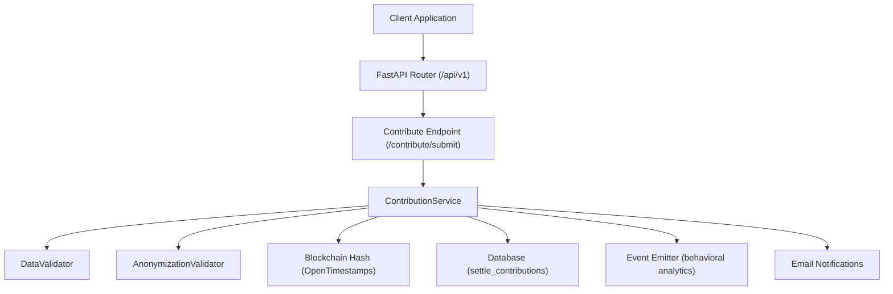

**Diagram sources**
- [router.py:10-24](file://app/api/v1/router.py#L10-L24)
- [contribute.py:51-125](file://app/api/v1/endpoints/contribute.py#L51-L125)
- [contributor.py:31-125](file://app/services/contributor.py#L31-L125)
- [validator.py:25-138](file://app/services/validator.py#L25-L138)
- [anonymizer.py:17-180](file://app/services/anonymizer.py#L17-L180)
- [settle_supabase.sql:31-114](file://database/schemas/settle_supabase.sql#L31-L114)

**Section sources**
- [router.py:1-26](file://app/api/v1/router.py#L1-L26)
- [contribute.py:1-164](file://app/api/v1/endpoints/contribute.py#L1-L164)

## Core Components
- Contribution Endpoint: Handles submission requests, authentication, and emits behavioral events.
- ContributionService: Orchestrates validation, anonymization, blockchain hashing, persistence, and moderation actions.
- DataValidator: Enforces required fields, value ranges, dropdown selections, and outlier detection.
- AnonymizationValidator: Ensures contributions are fully anonymized and bar-compliant.
- Models: Define request/response shapes and validation constants for contributions.
- Database Schema: Defines the persistent model for contributions and related entities.
- Event Emitter: Emits behavioral events to the SaaS Admin platform.
- Email Service: Sends notifications for Founding Member onboarding and other updates.

**Section sources**
- [contribute.py:51-125](file://app/api/v1/endpoints/contribute.py#L51-L125)
- [contributor.py:31-125](file://app/services/contributor.py#L31-L125)
- [validator.py:25-138](file://app/services/validator.py#L25-L138)
- [anonymizer.py:17-180](file://app/services/anonymizer.py#L17-L180)
- [case_bank.py:141-203](file://app/models/case_bank.py#L141-L203)
- [settle_supabase.sql:31-114](file://database/schemas/settle_supabase.sql#L31-L114)

## Architecture Overview
The system follows a layered architecture:
- API Layer: Exposes endpoints and handles authentication.
- Service Layer: Implements business logic for validation, anonymization, moderation, and persistence.
- Persistence Layer: Uses Supabase schema with row-level security and indexes optimized for analytics.
- Integration Layer: Emits events and sends notifications.

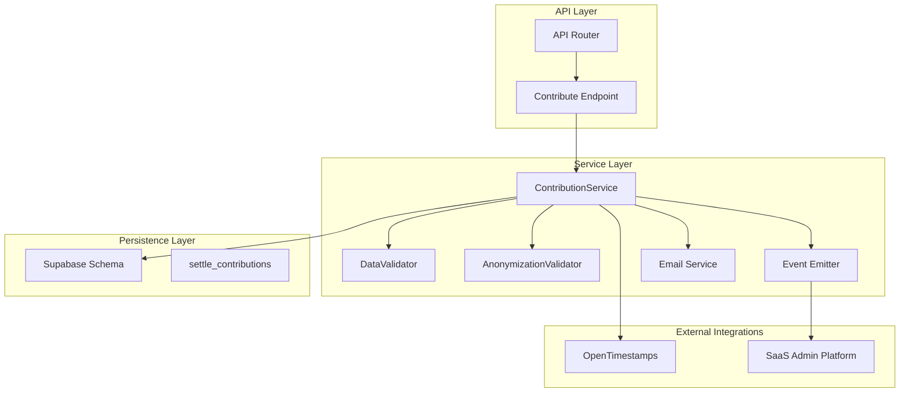

**Diagram sources**
- [router.py:10-24](file://app/api/v1/router.py#L10-L24)
- [contribute.py:51-125](file://app/api/v1/endpoints/contribute.py#L51-L125)
- [contributor.py:31-125](file://app/services/contributor.py#L31-L125)
- [validator.py:25-138](file://app/services/validator.py#L25-L138)
- [anonymizer.py:17-180](file://app/services/anonymizer.py#L17-L180)
- [event_emitter.py:44-87](file://app/core/event_emitter.py#L44-L87)
- [email_service.py:15-221](file://app/services/notifications/email_service.py#L15-L221)
- [settle_supabase.sql:31-114](file://database/schemas/settle_supabase.sql#L31-L114)

## Detailed Component Analysis

### Contribution Submission Endpoint
The endpoint validates authentication, initializes the ContributionService, and executes the submission workflow. It logs audit information, emits behavioral events, and returns a structured response containing the contribution ID, blockchain hash, and status.

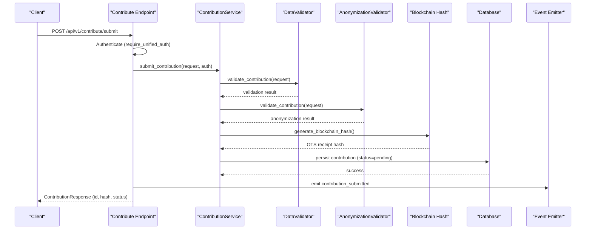

**Diagram sources**
- [contribute.py:51-125](file://app/api/v1/endpoints/contribute.py#L51-L125)
- [contributor.py:55-125](file://app/services/contributor.py#L55-L125)
- [validator.py:52-138](file://app/services/validator.py#L52-L138)
- [anonymizer.py:92-180](file://app/services/anonymizer.py#L92-L180)
- [event_emitter.py:56-87](file://app/core/event_emitter.py#L56-L87)

**Section sources**
- [contribute.py:51-125](file://app/api/v1/endpoints/contribute.py#L51-L125)

### ContributionService Orchestration
ContributionService coordinates:
- Data validation via DataValidator
- Anonymization checks via AnonymizationValidator
- Blockchain hash generation using OpenTimestamps
- Persistence to the database
- Founding Member stats tracking
- Moderation actions (approve/reject/flag)

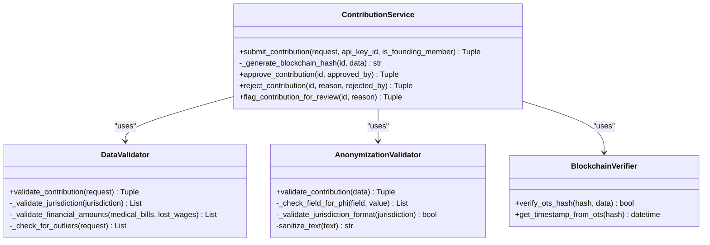

**Diagram sources**
- [contributor.py:31-294](file://app/services/contributor.py#L31-L294)
- [validator.py:25-327](file://app/services/validator.py#L25-L327)
- [anonymizer.py:17-340](file://app/services/anonymizer.py#L17-L340)

**Section sources**
- [contributor.py:31-294](file://app/services/contributor.py#L31-L294)

### Data Validation Pipeline
DataValidator enforces:
- Jurisdiction format and state code
- Required fields and dropdown selections
- Financial amount ranges
- Outlier detection to flag anomalies

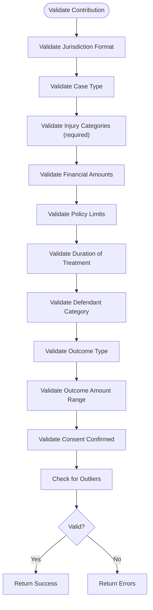

**Diagram sources**
- [validator.py:52-138](file://app/services/validator.py#L52-L138)
- [validator.py:140-224](file://app/services/validator.py#L140-L224)
- [validator.py:226-262](file://app/services/validator.py#L226-L262)

**Section sources**
- [validator.py:25-327](file://app/services/validator.py#L25-L327)

### Anonymization Workflow and Compliance
AnonymizationValidator ensures:
- No PHI/PII (SSN, DOB, phone, email, addresses, MRN)
- No free-text narratives or specific identifiers
- Jurisdiction format compliance
- Drop-down selections from allowed lists
- Financial reasonableness checks
- Liability language detection

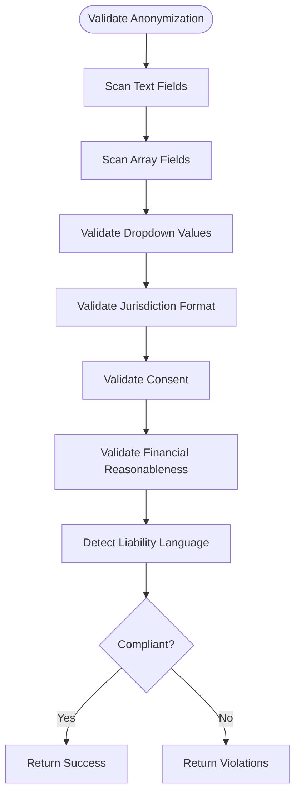

**Diagram sources**
- [anonymizer.py:92-180](file://app/services/anonymizer.py#L92-L180)
- [anonymizer.py:182-215](file://app/services/anonymizer.py#L182-L215)
- [anonymizer.py:217-261](file://app/services/anonymizer.py#L217-L261)
- [anonymizer.py:303-338](file://app/services/anonymizer.py#L303-L338)

**Section sources**
- [anonymizer.py:17-340](file://app/services/anonymizer.py#L17-L340)

### Blockchain Timestamp Integration (OpenTimestamps)
ContributionService generates a deterministic canonical representation of the contribution, computes a SHA-256 hash, and produces an OTS receipt hash. Timestamp verification and extraction are provided by BlockchainVerifier utilities.

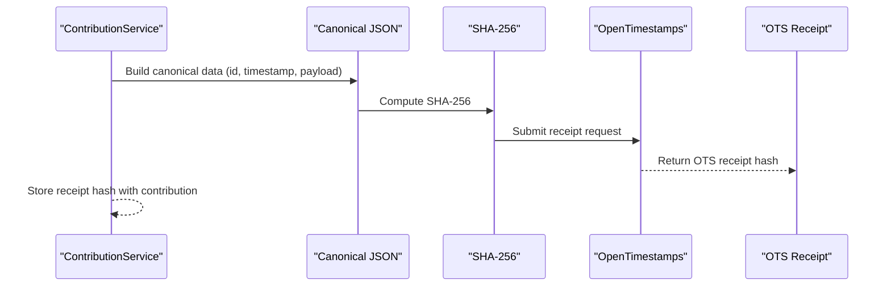

**Diagram sources**
- [contributor.py:127-173](file://app/services/contributor.py#L127-L173)
- [contributor.py:300-338](file://app/services/contributor.py#L300-L338)

**Section sources**
- [contributor.py:127-173](file://app/services/contributor.py#L127-L173)
- [contributor.py:300-338](file://app/services/contributor.py#L300-L338)

### Contribution Moderation and Lifecycle Management
Moderation actions include approval, rejection, and flagging for manual review. Status tracking supports pending, approved, rejected, and flagged states. The system logs moderation actions for audit trails.

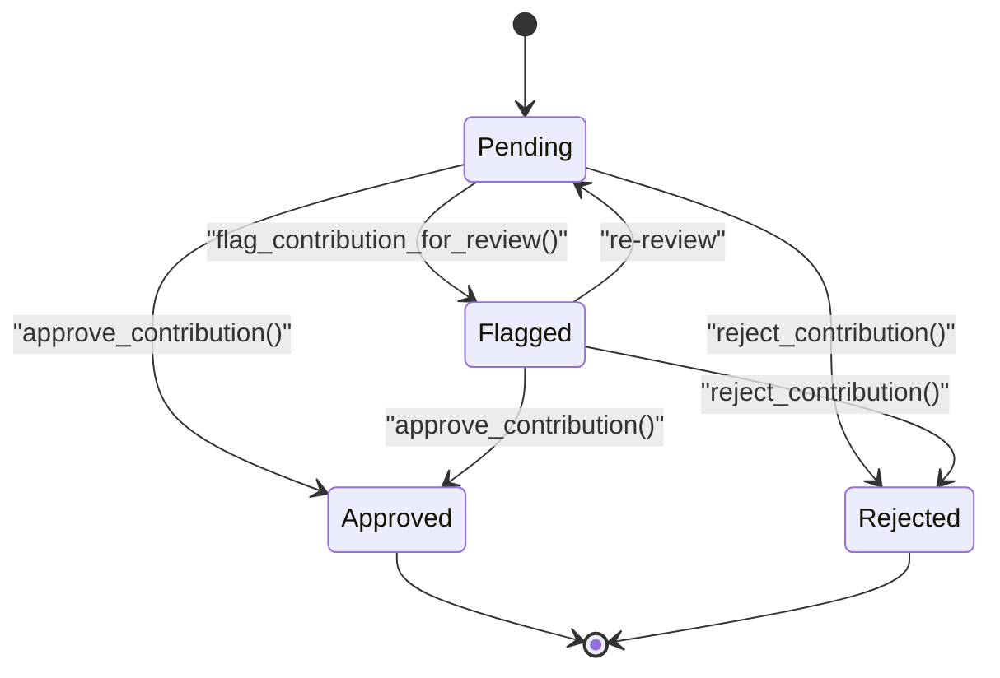

**Diagram sources**
- [contributor.py:219-294](file://app/services/contributor.py#L219-L294)

**Section sources**
- [contributor.py:219-294](file://app/services/contributor.py#L219-L294)

### Database Schema and Indexes
The schema defines settle_contributions with constraints, indexes, and row-level security. It includes fields for jurisdiction, case type, injury categories, financial data, outcome, compliance, contributor tracking, metadata, and data quality flags.

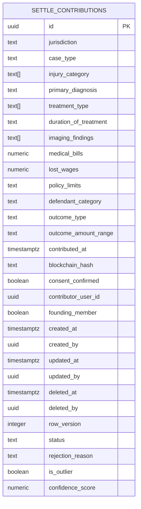

**Diagram sources**
- [settle_supabase.sql:31-114](file://database/schemas/settle_supabase.sql#L31-L114)
- [CREATE_SETTLE_DATABASE.sql:32-114](file://database/CREATE_SETTLE_DATABASE.sql#L32-L114)

**Section sources**
- [settle_supabase.sql:31-114](file://database/schemas/settle_supabase.sql#L31-L114)
- [CREATE_SETTLE_DATABASE.sql:32-114](file://database/CREATE_SETTLE_DATABASE.sql#L32-L114)

### Integration with External Services and Notifications
- Event Emitter: Emits behavioral events to the SaaS Admin platform for analytics.
- Email Service: Sends Founding Member onboarding and waitlist update emails via Resend.
- DRAFT Service Integration: Attempts to grant leverage rewards upon successful submission.

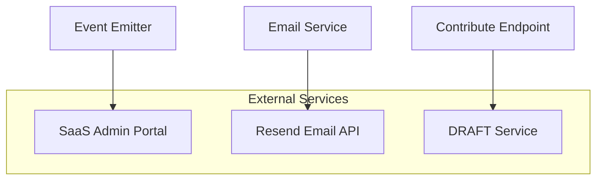

**Diagram sources**
- [event_emitter.py:56-87](file://app/core/event_emitter.py#L56-L87)
- [email_service.py:26-80](file://app/services/notifications/email_service.py#L26-L80)
- [contribute.py:22-46](file://app/api/v1/endpoints/contribute.py#L22-L46)

**Section sources**
- [event_emitter.py:44-87](file://app/core/event_emitter.py#L44-L87)
- [email_service.py:15-221](file://app/services/notifications/email_service.py#L15-L221)
- [contribute.py:22-46](file://app/api/v1/endpoints/contribute.py#L22-L46)

## Dependency Analysis
The system exhibits clear separation of concerns:
- API endpoints depend on ContributionService for orchestration.
- ContributionService depends on DataValidator and AnonymizationValidator for compliance.
- Persistence is handled by Supabase schema with indexes and constraints.
- External integrations are isolated via event emission and HTTP clients.

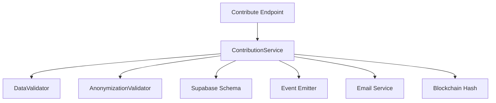

**Diagram sources**
- [contribute.py:51-125](file://app/api/v1/endpoints/contribute.py#L51-L125)
- [contributor.py:31-125](file://app/services/contributor.py#L31-L125)
- [validator.py:25-138](file://app/services/validator.py#L25-L138)
- [anonymizer.py:17-180](file://app/services/anonymizer.py#L17-L180)
- [settle_supabase.sql:31-114](file://database/schemas/settle_supabase.sql#L31-L114)

**Section sources**
- [contribute.py:51-125](file://app/api/v1/endpoints/contribute.py#L51-L125)
- [contributor.py:31-125](file://app/services/contributor.py#L31-L125)

## Performance Considerations
- Indexes on jurisdiction, case_type, injury_category, outcome_range, status, created_at, and medical_bills enable efficient querying.
- Row-level security and composite indexes optimize analytics while maintaining data isolation.
- Asynchronous event emission and email delivery prevent blocking the main contribution flow.
- Canonical JSON serialization and SHA-256 hashing are lightweight operations suitable for high throughput.

[No sources needed since this section provides general guidance]

## Troubleshooting Guide
Common issues and resolutions:
- Validation failures: Review required fields, dropdown values, and financial ranges. Correct the submission payload according to validation messages.
- Anonymization violations: Remove PHI/PII, avoid free-text narratives, and use only allowed dropdown values. Ensure jurisdiction format is "County, ST".
- Blockchain hash generation: Confirm canonical JSON construction and sorting keys. Implement OpenTimestamps integration for production.
- Moderation actions: Use approve/reject/flag endpoints with appropriate reasons. Monitor status transitions and audit logs.
- Event emission failures: Verify SaaS Admin URL and API key configuration. Inspect logs for HTTP client exceptions.
- Email delivery failures: Check Resend API key and network connectivity. Validate recipient email format.

**Section sources**
- [validator.py:52-138](file://app/services/validator.py#L52-L138)
- [anonymizer.py:92-180](file://app/services/anonymizer.py#L92-L180)
- [contributor.py:127-173](file://app/services/contributor.py#L127-L173)
- [contributor.py:219-294](file://app/services/contributor.py#L219-L294)
- [event_emitter.py:56-87](file://app/core/event_emitter.py#L56-L87)
- [email_service.py:26-80](file://app/services/notifications/email_service.py#L26-L80)

## Conclusion
The Data Contribution System provides a robust, bar-compliant framework for collecting settlement intelligence. It enforces strict validation and anonymization, integrates blockchain timestamps for integrity, and supports moderation and lifecycle management. The modular design enables extensibility for additional compliance rules, richer moderation workflows, and deeper analytics.