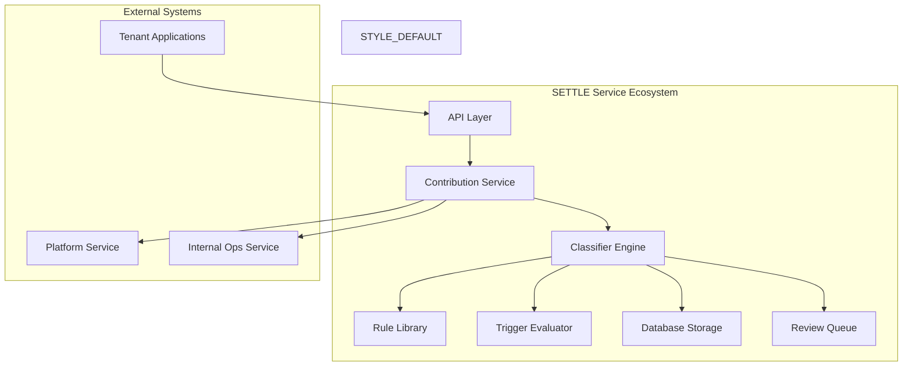
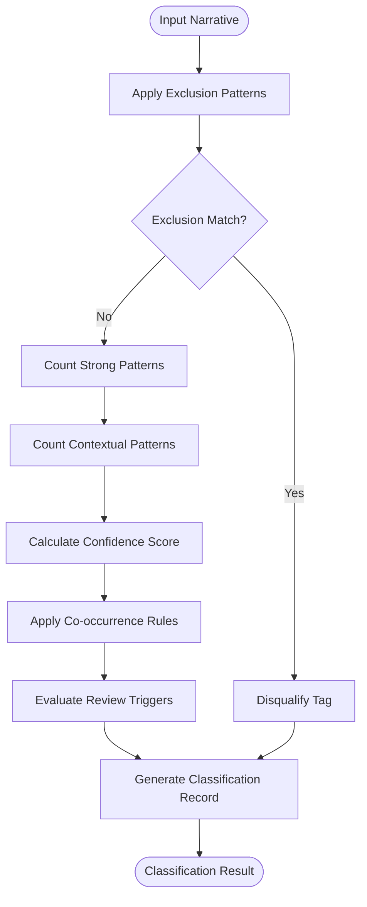
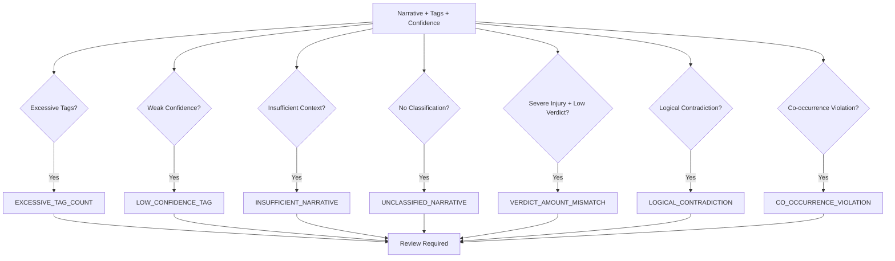
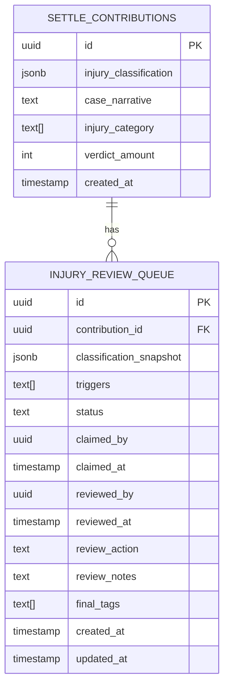

# Deterministic 17-Tag Injury Classification System

<cite>
**Referenced Files in This Document**
- [README.md](file://README.md)
- [ADR_20260513_deterministic_injury_classifier.md](file://docs/01-main/adr/ADR_20260513_deterministic_injury_classifier.md)
- [__init__.py](file://app/services/injury_classifier/__init__.py)
- [engine.py](file://app/services/injury_classifier/engine.py)
- [schema.py](file://app/services/injury_classifier/schema.py)
- [rules.py](file://app/services/injury_classifier/rules.py)
- [triggers.py](file://app/services/injury_classifier/triggers.py)
- [version.py](file://app/services/injury_classifier/version.py)
- [synth.py](file://app/services/injury_classifier/synth.py)
- [add_injury_classifier_schema.py](file://alembic/versions/ed2900358f69_add_injury_classifier_schema.py)
- [test_engine.py](file://tests/services/injury_classifier/test_engine.py)
</cite>

## Table of Contents
1. [Introduction](#introduction)
2. [System Architecture](#system-architecture)
3. [Core Components](#core-components)
4. [Injury Classification Taxonomy](#injury-classification-taxonomy)
5. [Rule Engine Implementation](#rule-engine-implementation)
6. [Review Trigger System](#review-trigger-system)
7. [Data Schema and Storage](#data-schema-and-storage)
8. [Integration Points](#integration-points)
9. [Quality Assurance](#quality-assurance)
10. [Version Management](#version-management)
11. [Performance Characteristics](#performance-charactersitics)
12. [Troubleshooting Guide](#troubleshooting-guide)
13. [Conclusion](#conclusion)

## Introduction

The Deterministic 17-Tag Injury Classification System represents a revolutionary approach to personal injury classification within the SETTLE legal database platform. Unlike traditional machine learning-based systems that rely on probabilistic models and neural networks, this system employs a purely deterministic rule-based engine that guarantees reproducible, auditable, and legally defensible results.

The system was developed to address critical limitations in the previous LLM-driven multi-tag classification approach, particularly the inconsistent performance observed in specialized domains like Orange County FL Premises Liability soft_tissue cases. By eliminating artificial intelligence dependencies and adopting a closed-set taxonomy of 17 carefully curated injury categories, the system ensures that identical input narratives consistently produce identical output classifications.

This architecture prioritizes legal defensibility, auditability, and reproducibility over statistical accuracy, making it suitable for attorney-facing applications where consistency and traceability are paramount. The system maintains backward compatibility with existing infrastructure while introducing comprehensive audit trails and review mechanisms.

## System Architecture

The injury classification system follows a modular, service-oriented architecture designed for integration within the broader SETTLE ecosystem. The system consists of several interconnected components that work together to provide deterministic injury classification capabilities.

**Diagram sources**
- [__init__.py:1-42](file://app/services/injury_classifier/__init__.py#L1-L42)
- [engine.py:1-227](file://app/services/injury_classifier/engine.py#L1-L227)

The architecture emphasizes separation of concerns with distinct modules handling classification logic, rule management, trigger evaluation, and data persistence. The system maintains loose coupling between components while ensuring tight integration with the SETTLE platform's existing infrastructure.

**Section sources**
- [README.md:1-297](file://README.md#L1-L297)
- [ADR_20260513_deterministic_injury_classifier.md:1-140](file://docs/01-main/adr/ADR_20260513_deterministic_injury_classifier.md#L1-L140)

## Core Components

The system comprises five fundamental components that work together to provide comprehensive injury classification capabilities:

### Public API Interface

The system exposes a clean, well-defined public API through the `__init__.py` module, providing access to classification functions, enumerations, and supporting utilities. The API supports both individual and batch classification operations, making it suitable for various integration scenarios.

### Classification Engine

The core classification engine (`engine.py`) implements the deterministic algorithm that processes narrative text through a series of rule-based evaluations. The engine applies exclusion patterns, counts strong and contextual pattern matches, calculates confidence scores using predefined thresholds, and enforces co-occurrence requirements.

### Rule Library

The rule library (`rules.py`) contains 17 comprehensive TagRule definitions, each representing a specific injury category. Each rule includes strong patterns (guaranteeing high confidence), contextual patterns (supporting lower confidence), exclusion patterns (disqualifying matches), and co-occurrence constraints that ensure logical consistency between related injuries.

### Trigger Evaluation System

The trigger system (`triggers.py`) implements seven deterministic review triggers that identify cases requiring human intervention. These triggers include excessive tag counts, low-confidence classifications, insufficient narrative context, unclassified narratives, verdict amount mismatches, logical contradictions, and co-occurrence violations.

### Data Schema and Storage

The system integrates seamlessly with the SETTLE database through comprehensive schema modifications that add JSONB storage for classification results and support for structured field synthesis. The schema includes dedicated tables for review queue management and maintains referential integrity with existing contribution records.

**Section sources**
- [__init__.py:1-42](file://app/services/injury_classifier/__init__.py#L1-L42)
- [engine.py:1-227](file://app/services/injury_classifier/engine.py#L1-L227)
- [rules.py:1-501](file://app/services/injury_classifier/rules.py#L1-L501)
- [triggers.py:1-99](file://app/services/injury_classifier/triggers.py#L1-L99)

## Injury Classification Taxonomy

The system employs a closed-set taxonomy of 17 injury categories, each carefully selected for legal defensibility and attorney usability. The taxonomy balances granularity with practicality, ensuring that attorneys can effectively filter and analyze cases while maintaining sufficient specificity for meaningful comparisons.

### Primary Injury Categories

The 17 injury categories are organized into distinct medical and legal domains:

**Soft Tissue and Musculoskeletal Injuries:**
- Soft tissue injuries (whiplash, strains, sprains)
- Fractures (various bone types and locations)
- Spinal injuries (disc herniation, compression fractures)
- Paralysis (complete and partial motor deficits)

**Traumatic Brain and Nervous System Injuries:**
- Traumatic brain injury (TBI) and concussions
- Burns (degrees and surface area coverage)
- Scarring and disfigurement
- Vision and hearing loss

**Other Serious Injuries:**
- Internal organ injuries requiring surgery
- Amputation and limb loss
- Psychological injuries (PTSD, depression)
- Chronic pain conditions
- Reproductive system injuries
- Dental injuries
- Death (wrongful death cases)

### Taxonomy Design Principles

The taxonomy adheres to strict design principles that prioritize legal defensibility and auditability:

- **Closed-set nature**: No new categories can be added without major version increments
- **Granular specificity**: Categories designed for meaningful attorney filtering
- **Legal terminology alignment**: Terms aligned with common legal and medical vocabulary
- **Co-occurrence logic**: Rules enforce logical relationships between related injuries
- **Audit trail requirements**: Every classification includes detailed provenance information

**Section sources**
- [ADR_20260513_deterministic_injury_classifier.md:41-45](file://docs/01-main/adr/ADR_20260513_deterministic_injury_classifier.md#L41-L45)
- [rules.py:22-53](file://app/services/injury_classifier/rules.py#L22-L53)

## Rule Engine Implementation

The rule engine implements a sophisticated deterministic algorithm that processes narrative text through multiple stages of evaluation. The engine ensures reproducible results while maintaining flexibility for rule updates and refinements.

### Algorithm Architecture

The classification process follows a systematic approach:

1. **Exclusion Pattern Processing**: Immediate disqualification for narratives containing exclusion patterns
2. **Pattern Matching**: Comprehensive scanning for strong and contextual pattern matches
3. **Confidence Calculation**: Deterministic scoring using predefined thresholds
4. **Co-occurrence Enforcement**: Logical consistency checks between related injuries
5. **Audit Trail Generation**: Complete provenance documentation for legal review

**Diagram sources**
- [engine.py:47-94](file://app/services/injury_classifier/engine.py#L47-L94)

### Confidence Scoring System

The engine employs a fixed confidence schedule that eliminates probabilistic interpretation:

- **0.99**: Two or more strong pattern matches
- **0.95**: One strong pattern match  
- **0.80**: Three or more contextual pattern matches
- **0.70**: Two contextual pattern matches
- **0.60**: One contextual pattern match
- **0.00**: No matches or exclusion pattern match

Confidence thresholds determine automatic application versus review requirements, ensuring consistent classification decisions across all cases.

### Co-occurrence Enforcement

The system enforces logical consistency between related injuries through co-occurrence rules:

- **Paralysis requires spinal injury**: If paralysis is detected, spinal injury must also be present
- **Death pathway requirements**: Fatal injuries typically require proximate cause injuries
- **Forbidden combinations**: Certain injury pairs cannot logically coexist

**Section sources**
- [engine.py:31-45](file://app/services/injury_classifier/engine.py#L31-L45)
- [engine.py:112-227](file://app/services/injury_classifier/engine.py#L112-L227)
- [rules.py:166-183](file://app/services/injury_classifier/rules.py#L166-L183)

## Review Trigger System

The review trigger system implements seven deterministic criteria that automatically identify cases requiring human intervention. Each trigger represents a specific red flag or anomaly that warrants attorney review.

### Trigger Categories

The seven review triggers cover different types of classification anomalies:

1. **Excessive Tag Count**: Narratives with more than four simultaneous injuries
2. **Low-Confidence Tags**: Presence of tags in the 0.60-0.70 confidence range
3. **Insufficient Narrative**: Very short narratives lacking adequate context
4. **Unclassified Narratives**: Narratives that fail to match any injury rules
5. **Verdict Amount Mismatch**: Severe injuries with unexpectedly low compensation amounts
6. **Logical Contradictions**: Death without identifiable proximate cause
7. **Co-occurrence Violations**: Forbidden injury combinations

### Trigger Configuration

Each trigger operates independently with specific thresholds and conditions:

- **Narrative length thresholds**: Different requirements for single vs. multi-tag classifications
- **Confidence band specification**: Precise 0.60-0.70 range for weak confidence detection
- **Severe injury thresholds**: $50,000 cutoff for severe injury verdict review
- **Co-occurrence enforcement**: Real-time validation of logical consistency

**Diagram sources**
- [triggers.py:28-99](file://app/services/injury_classifier/triggers.py#L28-L99)

**Section sources**
- [triggers.py:1-99](file://app/services/injury_classifier/triggers.py#L1-L99)

## Data Schema and Storage

The system introduces comprehensive database schema modifications that enable audit trail storage and review queue management while maintaining backward compatibility with existing infrastructure.

### Database Modifications

The Alembic migration script introduces three key schema changes:

1. **Injury Classification Column**: JSONB column on `settle_contributions` table for storing classification results
2. **Case Narrative Text**: Nullable TEXT column for future narrative acquisition integration
3. **Review Queue Table**: Dedicated table for managing human review workflows

### Classification Data Structure

The injury classification data is stored as JSONB with comprehensive audit trail information:

**Diagram sources**
- [add_injury_classifier_schema.py:22-99](file://alembic/versions/ed2900358f69_add_injury_classifier_schema.py#L22-L99)

### Audit Trail Features

The classification records include extensive provenance information:

- **Tag confidence scores**: Per-tag probability assessments
- **Matched text spans**: Exact text fragments triggering each classification
- **Source attribution**: Classification methodology and confidence level
- **Version tracking**: Classifier version for historical reprocessing
- **Review history**: Complete audit trail of human interventions

**Section sources**
- [add_injury_classifier_schema.py:1-106](file://alembic/versions/ed2900358f69_add_injury_classifier_schema.py#L1-L106)
- [schema.py:88-147](file://app/services/injury_classifier/schema.py#L88-L147)

## Integration Points

The injury classification system integrates seamlessly with the broader SETTLE ecosystem through well-defined interfaces and service communication patterns.

### API Integration

The system provides RESTful API endpoints for classification services, supporting both individual and batch processing operations. Integration requires proper authentication using SETTLE API keys and adherence to service-to-service communication protocols.

### Service Communication

Integration with other SETTLE services follows established patterns:

- **Platform Service**: API key provisioning and usage tracking
- **Tenant Service**: Case query and contribution submission workflows  
- **Internal Ops Service**: Activity logging and task creation for review workflows

### Data Flow Integration

The classification system participates in several data flow scenarios:

1. **Contribution Processing**: Automatic classification during case contribution submission
2. **Query Enhancement**: Classification data used to improve settlement range queries
3. **Report Generation**: Classification results incorporated into professional PDF reports
4. **Review Workflow**: Triggered cases routed to human review queues

**Section sources**
- [README.md:184-253](file://README.md#L184-L253)

## Quality Assurance

The system implements comprehensive quality assurance measures including extensive testing, deterministic validation, and continuous monitoring capabilities.

### Test Suite Architecture

The test suite covers multiple aspects of system functionality:

1. **Canonical Fixture Tests**: Regression testing against 15 carefully curated case examples
2. **Determinism Validation**: Verification that identical inputs produce identical outputs
3. **Edge Case Handling**: Testing of boundary conditions and error scenarios
4. **Trigger Validation**: Comprehensive testing of all seven review trigger conditions

### Canonical Fixture Testing

The fixture-driven test suite ensures system stability across rule changes:

- **Expected Tag Verification**: Confirms correct injury classification for each fixture
- **Review Requirement Validation**: Ensures appropriate human review routing
- **Regression Prevention**: Maintains consistency across system updates

### Deterministic Behavior Validation

The system's deterministic nature is rigorously tested:

- **Repeatability Testing**: Multiple classifications of identical narratives
- **Byte-identical Results**: Confirmation of consistent output formatting
- **Stability Across Versions**: Validation that rule changes don't affect determinism

**Section sources**
- [test_engine.py:1-164](file://tests/services/injury_classifier/test_engine.py#L1-L164)

## Version Management

The system employs strict semantic versioning discipline that governs all changes to the classification logic and taxonomy.

### Versioning Philosophy

The version management system follows these principles:

- **Major Version Changes**: Addition or removal of injury categories
- **Minor Version Changes**: Rule modifications and threshold adjustments  
- **Patch Version Changes**: Bug fixes and regex corrections

### Version Impact Matrix

Different types of changes trigger different version increments:

| Change Type | Impact Level | Version Bump |
|-------------|--------------|--------------|
| New injury category | Major | MAJOR |
| Removed injury category | Major | MAJOR |
| Added keyword to rule | Minor | MINOR |
| Modified confidence threshold | Minor | MINOR |
| Regex bug fix | Patch | PATCH |

### Historical Classification Tracking

Every classification record includes version information, enabling:

- **Historical Re-processing**: Ability to reclassify old data with new rules
- **Change Impact Analysis**: Understanding of classification evolution over time
- **Audit Trail Completeness**: Complete traceability of classification methodology

**Section sources**
- [version.py:1-18](file://app/services/injury_classifier/version.py#L1-L18)

## Performance Characteristics

The deterministic nature of the system provides predictable performance characteristics that benefit both throughput and resource utilization.

### Processing Characteristics

The classification engine demonstrates consistent performance:

- **Linear Complexity**: Processing time scales linearly with narrative length
- **Memory Efficiency**: Minimal memory footprint due to rule-based processing
- **CPU Utilization**: Predictable CPU usage patterns across different input types
- **Scalability**: Well-suited for batch processing and concurrent operations

### Throughput Capabilities

The system can handle substantial classification volumes:

- **Batch Processing**: Efficient batch classification for large datasets
- **Concurrent Operations**: Support for multiple simultaneous classification requests
- **Resource Predictability**: Consistent resource consumption patterns
- **Latency Characteristics**: Sub-second response times for typical narratives

### Resource Optimization

Performance optimization strategies include:

- **Compiled Regular Expressions**: Pre-compiled patterns for efficient matching
- **Early Termination**: Immediate exit upon exclusion pattern matches
- **Minimal Memory Allocation**: Optimized data structures for classification results
- **Efficient String Processing**: Optimized text scanning and pattern matching

## Troubleshooting Guide

Common issues and their resolution strategies for the injury classification system.

### Classification Issues

**Problem**: Narratives not matching expected categories
- **Cause**: Insufficient text content or missing key terminology
- **Solution**: Verify narrative completeness and check rule keyword coverage
- **Prevention**: Implement narrative quality checks before classification

**Problem**: Unexpected classification confidence scores  
- **Cause**: Ambiguous text patterns or rule conflicts
- **Solution**: Review matched text spans and adjust rule patterns if necessary
- **Prevention**: Monitor classification distribution and identify edge cases

### Integration Issues

**Problem**: API integration failures
- **Cause**: Authentication errors or service connectivity issues
- **Solution**: Verify API key validity and service endpoint accessibility
- **Prevention**: Implement retry logic and health checks

**Problem**: Database schema conflicts
- **Cause**: Migration execution errors or schema version mismatches
- **Solution**: Run Alembic migrations and verify table structure
- **Prevention**: Automated schema validation in deployment pipelines

### Review Queue Issues

**Problem**: Review queue bottlenecks
- **Cause**: High volume of trigger-generated cases
- **Solution**: Optimize trigger thresholds and implement queue prioritization
- **Prevention**: Monitor trigger rates and adjust parameters proactively

**Section sources**
- [triggers.py:1-99](file://app/services/injury_classifier/triggers.py#L1-L99)
- [engine.py:1-227](file://app/services/injury_classifier/engine.py#L1-L227)

## Conclusion

The Deterministic 17-Tag Injury Classification System represents a significant advancement in legal technology, providing attorneys with reliable, auditable, and reproducible injury classification capabilities. By eliminating artificial intelligence dependencies and adopting a closed-set taxonomy with comprehensive rule-based processing, the system achieves the legal defensibility and consistency required for professional practice.

The system's architecture ensures seamless integration with existing SETTLE infrastructure while providing comprehensive audit trails and review mechanisms. The deterministic nature of the classification process guarantees that identical inputs consistently produce identical outputs, meeting the highest standards for legal defensibility and professional responsibility.

Through careful attention to design principles, comprehensive testing, and strict version management, the system establishes a foundation for continued evolution while maintaining the reliability and consistency that legal professionals require. The integration of structured field synthesis capabilities further enhances the system's utility by providing classification support even when narrative text is unavailable.

This classification system positions SETTLE as a leader in ethical legal technology, providing attorneys with the tools they need to make informed decisions about case selection, settlement negotiations, and client counseling while maintaining the highest standards of professional integrity and legal compliance.