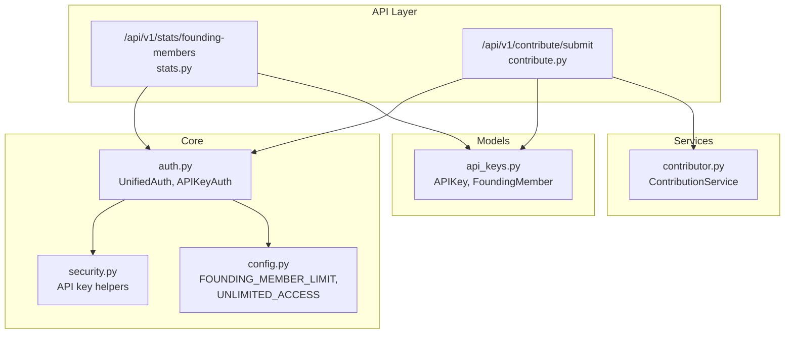
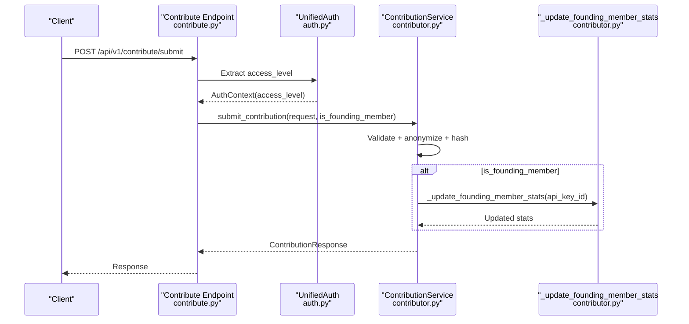
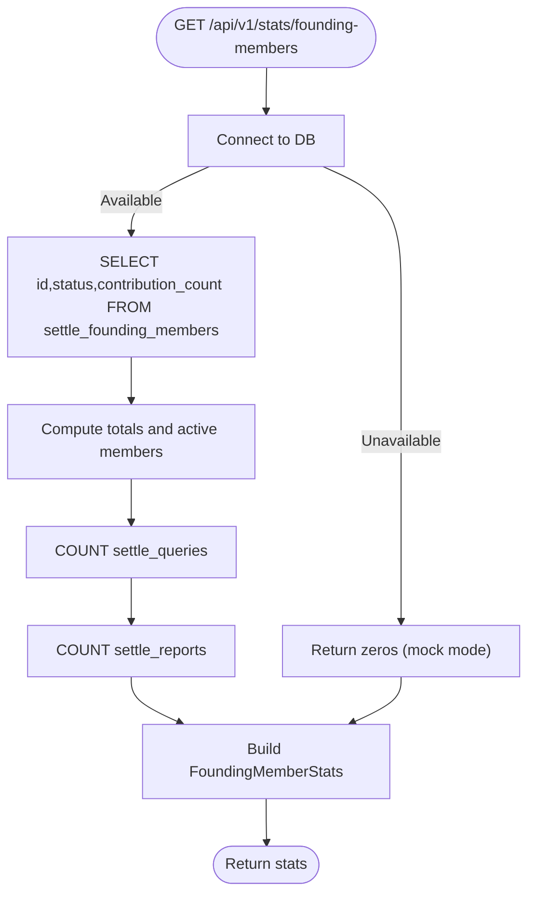
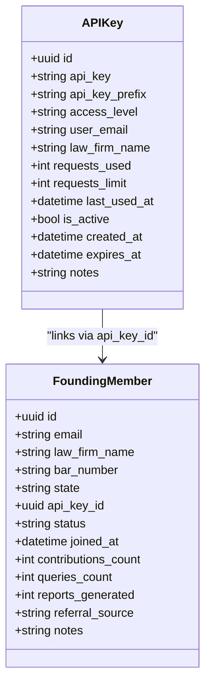
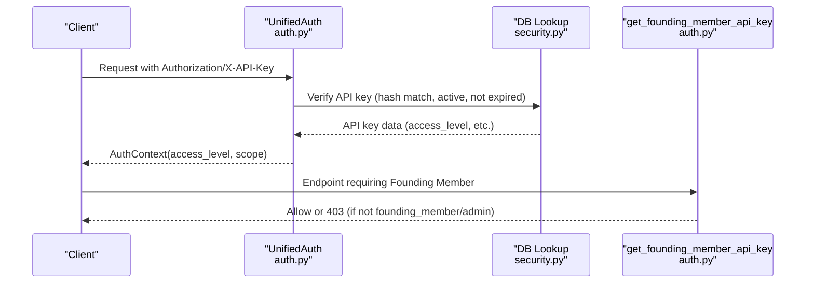
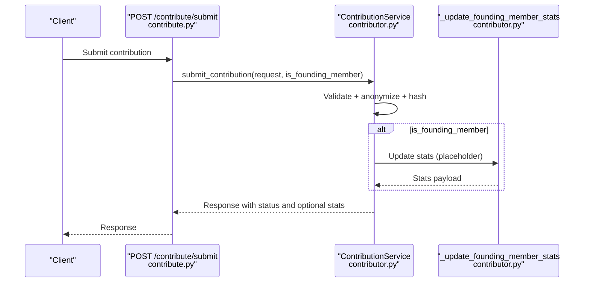
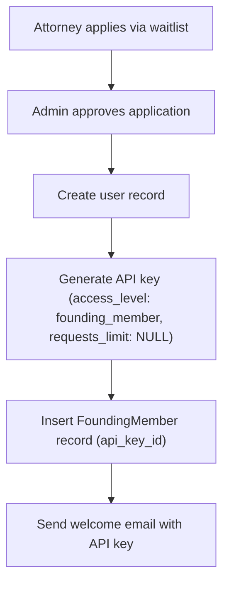
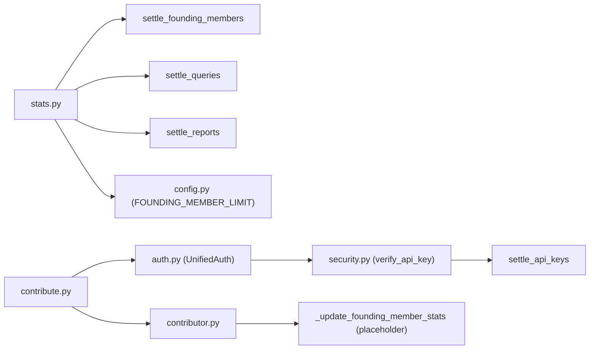

# Founding Member Privileges

<cite>
**Referenced Files in This Document**
- [stats.py](file://app/api/v1/endpoints/stats.py)
- [api_keys.py](file://app/models/api_keys.py)
- [auth.py](file://app/core/auth.py)
- [security.py](file://app/core/security.py)
- [contribute.py](file://app/api/v1/endpoints/contribute.py)
- [contributor.py](file://app/services/contributor.py)
- [config.py](file://app/core/config.py)
- [SETTLE_ADMIN_ARCHITECTURE.md](file://docs/architecture/SETTLE_ADMIN_ARCHITECTURE.md)
- [test_automated_integration.py](file://tests/test_automated_integration.py)
- [test_customer_scenarios.py](file://tests/test_customer_scenarios.py)
</cite>

## Table of Contents
1. [Introduction](#introduction)
2. [Project Structure](#project-structure)
3. [Core Components](#core-components)
4. [Architecture Overview](#architecture-overview)
5. [Detailed Component Analysis](#detailed-component-analysis)
6. [Dependency Analysis](#dependency-analysis)
7. [Performance Considerations](#performance-considerations)
8. [Troubleshooting Guide](#troubleshooting-guide)
9. [Conclusion](#conclusion)

## Introduction
This document describes the Founding Member privilege system, focusing on how membership is validated, how contribution activity is tracked, and how privileges are enforced. It explains the integration with API key systems, membership validation, and privilege escalation processes. It also documents the data structures used to store member statistics, query counts, and contribution metrics, and provides guidance on performance and caching for real-time stats updates.

## Project Structure
The Founding Member privilege system spans several modules:
- Authentication and authorization: unified API key and JWT handling
- API endpoints: stats retrieval and contribution submission
- Data models: API keys and Founding Member records
- Services: contribution workflow and blockchain hashing
- Configuration: limits and flags for Founding Member behavior
- Tests: integration scenarios validating membership checks and stats

**Diagram sources**
- [stats.py:41-107](file://app/api/v1/endpoints/stats.py#L41-L107)
- [contribute.py:51-125](file://app/api/v1/endpoints/contribute.py#L51-L125)
- [auth.py:340-484](file://app/core/auth.py#L340-L484)
- [security.py:39-207](file://app/core/security.py#L39-L207)
- [config.py:192-198](file://app/core/config.py#L192-L198)
- [api_keys.py:11-147](file://app/models/api_keys.py#L11-L147)
- [contributor.py:31-126](file://app/services/contributor.py#L31-L126)

**Section sources**
- [stats.py:41-107](file://app/api/v1/endpoints/stats.py#L41-L107)
- [contribute.py:51-125](file://app/api/v1/endpoints/contribute.py#L51-L125)
- [auth.py:340-484](file://app/core/auth.py#L340-L484)
- [security.py:39-207](file://app/core/security.py#L39-L207)
- [config.py:192-198](file://app/core/config.py#L192-L198)
- [api_keys.py:11-147](file://app/models/api_keys.py#L11-L147)
- [contributor.py:31-126](file://app/services/contributor.py#L31-L126)

## Core Components
- Founding Member statistics endpoint: aggregates total members, active members, remaining slots, and totals for contributions, queries, and reports.
- API key models: define API key attributes and Founding Member record fields including counters for contributions, queries, and reports.
- Authentication: unified auth supports both API key and JWT; Founding Member access is enforced via access level checks.
- Contribution service: validates, anonymizes, hashes, and tracks contributions; includes a placeholder for updating Founding Member stats.
- Configuration: defines membership capacity and unlimited access behavior.

**Section sources**
- [stats.py:20-107](file://app/api/v1/endpoints/stats.py#L20-L107)
- [api_keys.py:11-147](file://app/models/api_keys.py#L11-L147)
- [auth.py:340-484](file://app/core/auth.py#L340-L484)
- [contributor.py:31-126](file://app/services/contributor.py#L31-L126)
- [config.py:192-198](file://app/core/config.py#L192-L198)

## Architecture Overview
The Founding Member privilege system integrates authentication, API endpoints, and data models to enforce membership-based privileges and track contribution activity.

**Diagram sources**
- [contribute.py:51-125](file://app/api/v1/endpoints/contribute.py#L51-L125)
- [auth.py:340-484](file://app/core/auth.py#L340-L484)
- [contributor.py:55-126](file://app/services/contributor.py#L55-L126)

## Detailed Component Analysis

### Founding Member Statistics Endpoint
- Purpose: Public endpoint to expose Founding Member program stats.
- Data sources:
  - Membership: reads settle_founding_members for counts and statuses.
  - Totals: counts settle_queries and settle_reports.
- Behavior:
  - Uses FOUNDING_MEMBER_LIMIT from settings for capacity.
  - Returns zeros and logs errors if database is unavailable (mock mode fallback).
- Output model: FoundingMemberStats with total_members, active_members, slots_remaining, total_capacity, total_contributions, total_queries, total_reports.

**Diagram sources**
- [stats.py:41-107](file://app/api/v1/endpoints/stats.py#L41-L107)

**Section sources**
- [stats.py:20-107](file://app/api/v1/endpoints/stats.py#L20-L107)
- [config.py:192-198](file://app/core/config.py#L192-L198)

### API Key and Founding Member Data Models
- APIKey: stores hashed key, access level, usage tracking (requests_used, requests_limit), timestamps, and status.
- FoundingMember: stores personal info, API key linkage, status, join date, and counters for contributions, queries, and reports generated.
- Access levels include founding_member, standard, premium, admin, external.

**Diagram sources**
- [api_keys.py:11-147](file://app/models/api_keys.py#L11-L147)

**Section sources**
- [api_keys.py:11-147](file://app/models/api_keys.py#L11-L147)

### Authentication and Privilege Enforcement
- UnifiedAuth supports:
  - API Key: Bearer settle_xxx or X-API-Key header.
  - JWT: Bearer eyJ... with scope and role validation.
- Founding Member access:
  - Enforced via access_level checks; endpoints can require founding_member or admin.
  - get_founding_member_api_key dependency restricts endpoints to Founding Members or admins.

**Diagram sources**
- [auth.py:340-484](file://app/core/auth.py#L340-L484)
- [auth.py:765-795](file://app/core/auth.py#L765-L795)
- [security.py:39-207](file://app/core/security.py#L39-L207)

**Section sources**
- [auth.py:340-484](file://app/core/auth.py#L340-L484)
- [auth.py:765-795](file://app/core/auth.py#L765-L795)
- [security.py:39-207](file://app/core/security.py#L39-L207)

### Contribution Workflow and Founding Member Stats Update
- ContributionService handles:
  - Validation and anonymization.
  - Blockchain hash generation (placeholder for OpenTimestamps).
  - Storage and status management.
  - Founding Member stats update via _update_founding_member_stats (placeholder).
- Contribute endpoint:
  - Extracts AuthContext and passes is_founding_member flag to service.
  - Emits behavioral events asynchronously.

**Diagram sources**
- [contribute.py:51-125](file://app/api/v1/endpoints/contribute.py#L51-L125)
- [contributor.py:55-126](file://app/services/contributor.py#L55-L126)

**Section sources**
- [contribute.py:51-125](file://app/api/v1/endpoints/contribute.py#L51-L125)
- [contributor.py:55-126](file://app/services/contributor.py#L55-L126)

### Membership Validation and Privilege Escalation
- Membership creation flow:
  - Waitlist application is reviewed by admin.
  - Upon approval, a user record is created, an API key is generated with access_level founding_member and unlimited requests_limit, and a FoundingMember record is inserted.
- Privilege escalation:
  - Founding Members gain unlimited access (requests_limit: None) and special endpoint access via get_founding_member_api_key.

**Diagram sources**
- [SETTLE_ADMIN_ARCHITECTURE.md:330-374](file://docs/architecture/SETTLE_ADMIN_ARCHITECTURE.md#L330-L374)

**Section sources**
- [SETTLE_ADMIN_ARCHITECTURE.md:330-374](file://docs/architecture/SETTLE_ADMIN_ARCHITECTURE.md#L330-L374)

### Examples and Workflows

- Stats updates:
  - The stats endpoint aggregates counts from settle_founding_members, settle_queries, and settle_reports. In mock mode, it returns zeros and logs the operation.
  - Example path: [stats.py:41-107](file://app/api/v1/endpoints/stats.py#L41-L107)

- Membership verification:
  - API key verification resolves access_level and other attributes from settle_api_keys. Founding Member endpoints use get_founding_member_api_key to enforce access.
  - Example paths:
    - [auth.py:340-484](file://app/core/auth.py#L340-L484)
    - [auth.py:765-795](file://app/core/auth.py#L765-L795)
    - [security.py:629-707](file://app/core/security.py#L629-L707)

- Privilege enforcement:
  - Tests demonstrate retrieving Founding Member status and checking thresholds (e.g., approved_contributions >= 10).
  - Example paths:
    - [test_automated_integration.py:118-140](file://tests/test_automated_integration.py#L118-L140)
    - [test_customer_scenarios.py:212-222](file://tests/test_customer_scenarios.py#L212-L222)

**Section sources**
- [stats.py:41-107](file://app/api/v1/endpoints/stats.py#L41-L107)
- [auth.py:340-484](file://app/core/auth.py#L340-L484)
- [auth.py:765-795](file://app/core/auth.py#L765-L795)
- [security.py:629-707](file://app/core/security.py#L629-L707)
- [test_automated_integration.py:118-140](file://tests/test_automated_integration.py#L118-L140)
- [test_customer_scenarios.py:212-222](file://tests/test_customer_scenarios.py#L212-L222)

## Dependency Analysis
- Founding Member stats depend on:
  - settle_founding_members for membership counts and statuses
  - settle_queries and settle_reports for global totals
  - settings.FOUNDING_MEMBER_LIMIT for capacity
- API key verification depends on:
  - settle_api_keys for hashed key lookup, active status, expiration, and usage tracking
- Contribution flow depends on:
  - AuthContext access_level to decide whether to update Founding Member stats
  - Asynchronous event emission for behavioral analytics

**Diagram sources**
- [stats.py:41-107](file://app/api/v1/endpoints/stats.py#L41-L107)
- [config.py:192-198](file://app/core/config.py#L192-L198)
- [auth.py:340-484](file://app/core/auth.py#L340-L484)
- [security.py:629-707](file://app/core/security.py#L629-L707)
- [contribute.py:51-125](file://app/api/v1/endpoints/contribute.py#L51-L125)
- [contributor.py:194-217](file://app/services/contributor.py#L194-L217)

**Section sources**
- [stats.py:41-107](file://app/api/v1/endpoints/stats.py#L41-L107)
- [auth.py:340-484](file://app/core/auth.py#L340-L484)
- [security.py:629-707](file://app/core/security.py#L629-L707)
- [contribute.py:51-125](file://app/api/v1/endpoints/contribute.py#L51-L125)
- [contributor.py:194-217](file://app/services/contributor.py#L194-L217)

## Performance Considerations
- Real-time stats updates:
  - The stats endpoint performs three table scans (members, queries, reports). For high traffic, consider:
    - Denormalized summary tables updated by triggers on write operations
    - Periodic aggregation jobs with caching (Redis/Memcached) for public stats
- Cache invalidation:
  - Invalidate caches on settle_founding_members, settle_queries, settle_reports inserts/updates
  - Use cache tags keyed by resource IDs to invalidate only affected partitions
- API key verification:
  - Hashed key lookup is O(1) with index on api_key_hash; ensure indexes exist on settle_api_keys
  - Background updates for last_used_at reduce latency of primary request path
- Contribution pipeline:
  - Asynchronous event emission prevents blocking contribution submission
  - Consider batching stats updates for Founding Members to reduce DB load

[No sources needed since this section provides general guidance]

## Troubleshooting Guide
- Stats endpoint returns zeros:
  - Indicates database unavailability or mock mode. Check database connectivity and settings.FOUNDING_MEMBER_LIMIT.
  - Reference: [stats.py:55-107](file://app/api/v1/endpoints/stats.py#L55-L107)
- API key verification fails:
  - Ensure key format (settle_xxx), active status, and non-expired state. Check settle_api_keys rows and hashed key lookup.
  - Reference: [security.py:629-707](file://app/core/security.py#L629-L707)
- Founding Member access denied:
  - Confirm access_level is founding_member or admin. Use get_founding_member_api_key dependency.
  - Reference: [auth.py:765-795](file://app/core/auth.py#L765-L795)
- Contribution stats not updating:
  - Founding Member stats update is currently a placeholder. Implement _update_founding_member_stats to increment counters in settle_founding_members.
  - Reference: [contributor.py:194-217](file://app/services/contributor.py#L194-L217)

**Section sources**
- [stats.py:55-107](file://app/api/v1/endpoints/stats.py#L55-L107)
- [security.py:629-707](file://app/core/security.py#L629-L707)
- [auth.py:765-795](file://app/core/auth.py#L765-L795)
- [contributor.py:194-217](file://app/services/contributor.py#L194-L217)

## Conclusion
The Founding Member privilege system combines unified authentication, API key management, and contribution tracking to enforce membership-based access and measure engagement. While the stats endpoint and Founding Member stats update are placeholders, the underlying models and dependencies provide a clear path to implement robust, real-time tracking with appropriate caching and performance strategies.