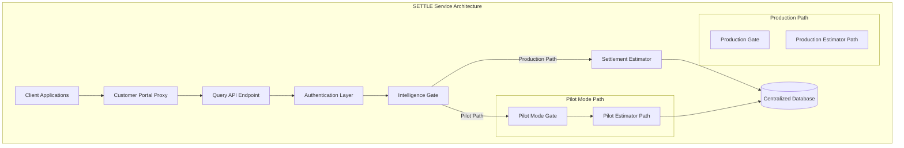
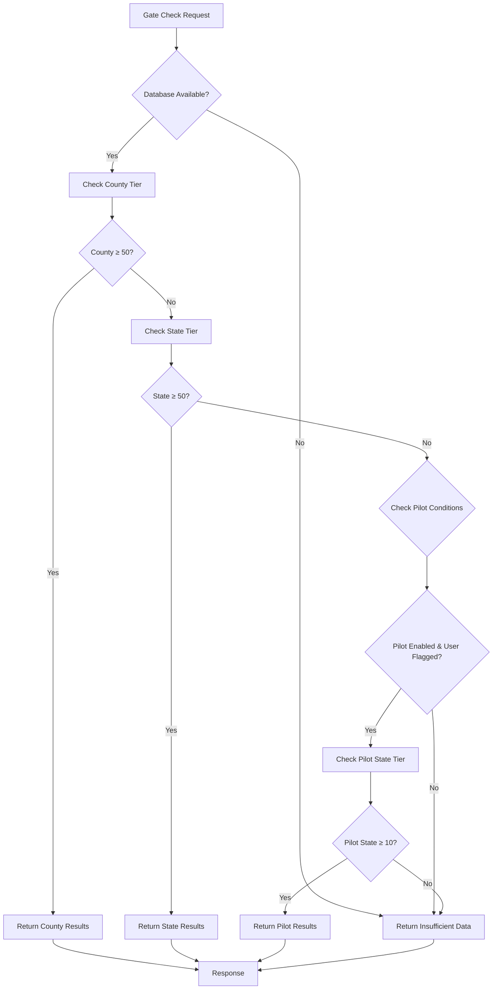
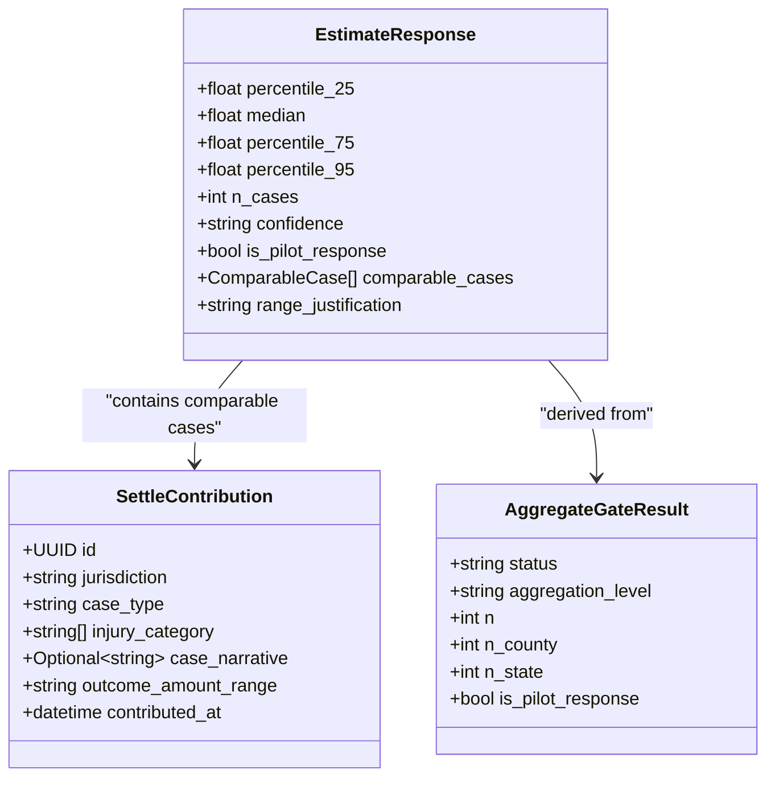
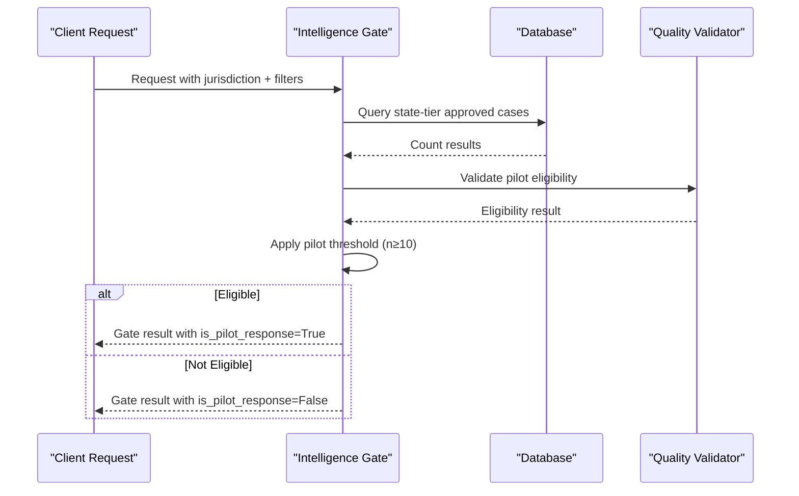
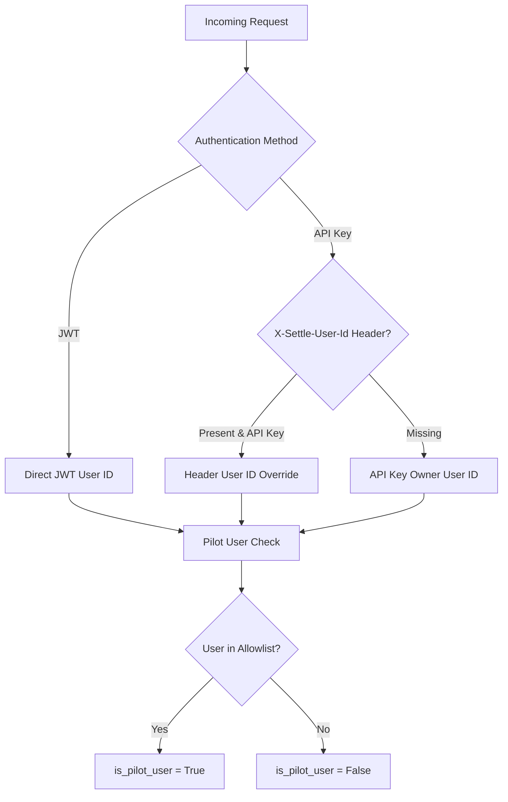
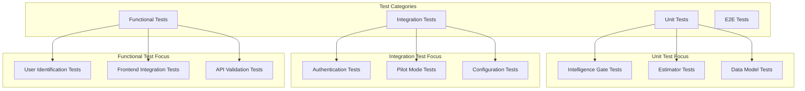

# Pilot Mode Transparency System (ADR S-2 v2)

<cite>
**Referenced Files in This Document**
- [README.md](file://README.md)
- [ADR_20260516_pilot_mode_gate_threshold.md](file://docs/01-main/adr/ADR_20260516_pilot_mode_gate_threshold.md)
- [estimator.py](file://app/services/estimator.py)
- [query.py](file://app/api/v1/endpoints/query.py)
- [auth.py](file://app/core/auth.py)
- [config.py](file://app/core/config.py)
- [intelligence_gate.py](file://app/services/intelligence_gate.py)
- [case_bank.py](file://app/models/case_bank.py)
- [test_estimator.py](file://tests/test_estimator.py)
- [test_functional.py](file://tests/test_functional.py)
- [COHORT_V_FRONT_DIRECTIVE.md](file://docs/01-main/COHORT_V_FRONT_DIRECTIVE.md)
</cite>

## Table of Contents
1. [Introduction](#introduction)
2. [System Architecture](#system-architecture)
3. [Pilot Mode Core Components](#pilot-mode-core-components)
4. [Three-Layer Transparency System](#three-layer-transparency-system)
5. [Implementation Details](#implementation-details)
6. [Frontend Integration](#frontend-integration)
7. [Testing and Validation](#testing-and-validation)
8. [Operational Procedures](#operational-procedures)
9. [Troubleshooting Guide](#troubleshooting-guide)
10. [Conclusion](#conclusion)

## Introduction

The Pilot Mode Transparency System (ADR S-2 v2) represents a sophisticated three-layer transparency mechanism designed to deliver real settlement estimates to a controlled pilot cohort while maintaining the highest standards of data quality and transparency. This system introduces a fail-closed, configurable pilot mode that operates alongside the existing "Never Sell Empty Dashboards" principle, ensuring that no estimates are generated from insufficient data pools.

The system addresses the challenge of demonstrating product value to early adopters when aggregate data coverage is limited but not ready for full production release. By implementing strict quality gates and transparent disclosure mechanisms, the pilot mode maintains ethical standards while enabling product validation in real-world conditions.

## System Architecture

The Pilot Mode Transparency System operates within the TrueVow SETTLE Service ecosystem as part of the broader 5-Service Enterprise Model. The system maintains strict separation between production and pilot pathways while sharing common infrastructure and data sources.



**Diagram sources**
- [query.py:20-132](file://app/api/v1/endpoints/query.py#L20-L132)
- [intelligence_gate.py:158-309](file://app/services/intelligence_gate.py#L158-L309)
- [estimator.py:71-287](file://app/services/estimator.py#L71-L287)

The architecture ensures that pilot mode operates as a transparent overlay rather than a fundamental change to the core system, maintaining backward compatibility while providing enhanced functionality for authorized users.

## Pilot Mode Core Components

### Intelligence Gate Enhancement

The Intelligence Gate serves as the foundation for the pilot mode system, introducing three distinct operational modes:

1. **Production Mode**: Maintains the standard MIN_AGGREGATE_N = 50 requirement for both county and state tiers
2. **Pilot Mode**: Implements relaxed thresholds with additional quality controls
3. **Fallback Mode**: Handles edge cases and error conditions



**Diagram sources**
- [intelligence_gate.py:158-309](file://app/services/intelligence_gate.py#L158-L309)

### Pilot Mode Configuration

The pilot mode system relies on four key configuration parameters:

| Parameter | Default Value | Purpose | Impact |
|-----------|---------------|---------|---------|
| `SETTLE_PILOT_MODE` | `False` | Master switch for pilot functionality | Controls whether pilot mode is active |
| `SETTLE_PILOT_GATE_FLOOR` | `10` | State-tier threshold for pilot mode | Lowered from production 50 to 10 |
| `SETTLE_PILOT_NARRATIVE_FLOOR` | `5` | Minimum narrative-bearing cases required | Ensures quality of displayed cases |
| `SETTLE_PILOT_USER_IDS` | `""` | Comma-separated pilot user identifier list | Controls pilot user authorization |

**Section sources**
- [config.py:241-250](file://app/core/config.py#L241-L250)
- [ADR_20260516_pilot_mode_gate_threshold.md:82-90](file://docs/01-main/adr/ADR_20260516_pilot_mode_gate_threshold.md#L82-L90)

### Data Model Extensions

The pilot mode introduces minimal but crucial data model extensions to support transparency reporting:



**Diagram sources**
- [case_bank.py:117-189](file://app/models/case_bank.py#L117-L189)
- [case_bank.py:15-70](file://app/models/case_bank.py#L15-L70)
- [intelligence_gate.py:65-113](file://app/services/intelligence_gate.py#L65-L113)

**Section sources**
- [case_bank.py:64-70](file://app/models/case_bank.py#L64-L70)
- [intelligence_gate.py:105-112](file://app/services/intelligence_gate.py#L105-L112)

## Three-Layer Transparency System

The pilot mode implements a comprehensive three-layer transparency system designed to prevent any relaxation of data quality standards while enabling controlled access to estimates.

### Layer 1: State-Tier Threshold Relaxation

The first layer introduces a strategic relaxation of the aggregation threshold from 50 to 10 cases for pilot users. This relaxation is specifically targeted at state-tier aggregations and maintains the strict 50-case requirement for county-level precision.



**Diagram sources**
- [intelligence_gate.py:264-294](file://app/services/intelligence_gate.py#L264-L294)

### Layer 2: Sentinel Injury Tag Exclusion

The second layer implements a comprehensive exclusion mechanism for sentinel/unclassified injury categories that do not meet pilot quality standards. This layer ensures that only cases with meaningful injury classifications contribute to pilot aggregations.

| Sentinel Category | Purpose |
|------------------|---------|
| `general_personal_injury` | Scraper fallback for unclassified cases |
| `motor_vehicle_accident` | Case-type leakage into injury field |
| `Unspecified/unspecified/UNSPECIFIED` | Phase 3.B scrub targets |
| `Unknown/unknown` | Unclassified data |
| `N/A/n/a` | Not applicable entries |

The exclusion mechanism operates at the database query level, filtering out rows that contain only sentinel injury categories while preserving legitimate cases with proper injury classifications.

### Layer 3: Displayable Cases Secondary Gate

The third layer implements a strict quality gate requiring a minimum of 5 narrative-bearing cases to be included in pilot responses. This ensures that all cases presented to users contain substantial descriptive content rather than minimal data entries.

**Section sources**
- [ADR_20260516_pilot_mode_gate_threshold.md:30-53](file://docs/01-main/adr/ADR_20260516_pilot_mode_gate_threshold.md#L30-L53)
- [intelligence_gate.py:133-148](file://app/services/intelligence_gate.py#L133-L148)
- [estimator.py:196-242](file://app/services/estimator.py#L196-L242)

## Implementation Details

### Authentication and User Identification

The pilot mode system implements a robust user identification mechanism that prioritizes JWT-based authentication while providing a secure bridge for proxy environments.



**Diagram sources**
- [query.py:90-116](file://app/api/v1/endpoints/query.py#L90-L116)

The system implements a fail-closed approach to user identification, ensuring that anonymous or service-token traffic cannot trigger pilot relaxation. The X-Settle-User-Id header bridge provides a controlled pathway for customer portal integration while maintaining security boundaries.

### Estimator Modifications

The Settlement Estimator receives minimal but crucial modifications to support pilot mode functionality:

1. **Pilot Response Flagging**: The estimator sets `is_pilot_response=True` when pilot mode conditions are met
2. **Narrative-Based Filtering**: Pilot responses exclude cases without case narratives from display
3. **Enhanced Justification**: Pilot responses include explicit transparency disclosures

The estimator maintains strict separation between statistical confidence calculations and pilot mode indicators, ensuring that downstream consumers continue to receive consistent confidence metrics.

**Section sources**
- [estimator.py:71-103](file://app/services/estimator.py#L71-L103)
- [estimator.py:196-242](file://app/services/estimator.py#L196-L242)
- [estimator.py:573-623](file://app/services/estimator.py#L573-L623)

### Database Integration

The pilot mode system leverages the existing centralized database infrastructure with minimal schema modifications. The system primarily relies on query-time filtering and post-processing rather than permanent data structure changes.

Key database considerations include:
- State-tier query optimization for pilot eligibility filtering
- Injury category validation against the InjuryTag enumeration
- Case narrative quality assessment for display filtering

## Frontend Integration

### Pilot Mode Banner Component

The frontend implementation centers around a dedicated PilotModeBanner component that provides clear visual indication of pilot mode activation:

```typescript
// PilotModeBanner.tsx
interface PilotModeBannerProps {
  comparableCases?: number;
}

export function PilotModeBanner({ comparableCases }: PilotModeBannerProps) {
  return (
    <div role="alert" className="border-l-4 border-amber-500 bg-amber-50 text-amber-900 px-4 py-3 rounded-md mb-4">
      <div className="flex items-start gap-2">
        <span aria-hidden="true">⚠️</span>
        <div>
          <strong className="font-semibold">PILOT MODE — Limited Data</strong>
          <p className="text-sm mt-1">
            This estimate is based on a smaller-than-production dataset
            {typeof comparableCases === 'number' ? ` (${comparableCases} comparable cases)` : ''}.
            Use as a directional reference; not a confidence-graded production estimate.
          </p>
        </div>
      </div>
    </div>
  );
}
```

### Integration Requirements

Frontend integration requires coordination between the customer portal and the SETTLE service:

1. **Live Data Integration**: Replace MOCK_INTEL fixtures with actual `settleClient.getEstimate(request)` calls
2. **State Management**: Implement loading, error, and response state handling
3. **Conditional Rendering**: Display pilot banner when `response.is_pilot_response === true`
4. **UI Branching**: Handle insufficient_data responses with appropriate messaging

**Section sources**
- [COHORT_V_FRONT_DIRECTIVE.md:188-237](file://docs/01-main/COHORT_V_FRONT_DIRECTIVE.md#L188-L237)

## Testing and Validation

### Test Suite Coverage

The pilot mode system includes comprehensive test coverage validating all three transparency layers and user identification mechanisms:



**Diagram sources**
- [test_estimator.py:165-289](file://tests/test_estimator.py#L165-L289)
- [test_functional.py:18-200](file://tests/test_functional.py#L18-L200)

### Key Test Scenarios

The test suite validates critical pilot mode behaviors:

1. **Displayable Cases Gate**: Ensures pilot suppression when narrative count < 5
2. **Confidence Preservation**: Validates that statistical confidence is not overridden
3. **Justification Disclosure**: Confirms explicit pilot mode transparency copy
4. **User Identification**: Tests X-Settle-User-Id header bridge functionality

**Section sources**
- [test_estimator.py:170-202](file://tests/test_estimator.py#L170-L202)
- [test_estimator.py:204-231](file://tests/test_estimator.py#L204-L231)
- [test_estimator.py:233-257](file://tests/test_estimator.py#L233-L257)
- [test_functional.py:218-224](file://tests/test_functional.py#L218-L224)

## Operational Procedures

### Pilot Mode Activation

Pilot mode activation follows a carefully controlled process:

1. **Configuration Update**: Set `SETTLE_PILOT_MODE = True` in environment variables
2. **User Enrollment**: Add pilot users to `SETTLE_PILOT_USER_IDS` comma-separated list
3. **Monitoring**: Deploy monitoring and alerting for pilot mode usage
4. **Graduation Planning**: Establish criteria for automatic pilot mode deactivation

### Graduation Criteria

The system implements automatic graduation criteria to ensure pilot mode transitions to production seamlessly:

- **State-Level Graduation**: Disable pilot mode per state when real-tag, narrative-bearing case count reaches 50+
- **Manual Graduation**: Remove users from pilot allowlist as data coverage improves
- **Full System Deactivation**: Set `SETTLE_PILOT_MODE = False` when all pilot users graduate

### Monitoring and Metrics

Key operational metrics for pilot mode monitoring include:

- Number of pilot requests processed
- Distribution of pilot vs production responses
- Case count distributions by tier
- User engagement with pilot mode disclosures
- Quality metrics for pilot cases (narrative completeness)

**Section sources**
- [ADR_20260516_pilot_mode_gate_threshold.md:140-147](file://docs/01-main/adr/ADR_20260516_pilot_mode_gate_threshold.md#L140-L147)

## Troubleshooting Guide

### Common Issues and Solutions

**Issue**: Pilot mode not activating despite configuration
- **Cause**: Missing or incorrect `SETTLE_PILOT_USER_IDS` configuration
- **Solution**: Verify comma-separated user ID format and ensure users are properly enrolled

**Issue**: Pilot responses showing insufficient data
- **Cause**: Narrative-bearing cases below pilot threshold (5 cases minimum)
- **Solution**: Monitor case narrative completion rates and ensure adequate data quality

**Issue**: Frontend not displaying pilot banner
- **Cause**: Missing `is_pilot_response` handling in frontend logic
- **Solution**: Implement conditional rendering based on response flag

**Issue**: Authentication failures for pilot users
- **Cause**: Incorrect user identification or proxy configuration issues
- **Solution**: Verify X-Settle-User-Id header usage and authentication method

### Diagnostic Commands

```bash
# Check pilot mode configuration
echo "Pilot Mode: $SETTLE_PILOT_MODE"
echo "Pilot Users: $SETTLE_PILOT_USER_IDS"

# Monitor pilot response distribution
curl -s https://settle-api.truevow.law/api/v1/query/health | jq '.'

# Test pilot user identification
curl -s -H "X-Settle-User-Id: pilot_user_123" \
  -H "Authorization: Bearer settle_your_key" \
  https://settle-api.truevow.law/api/v1/query/estimate
```

**Section sources**
- [query.py:90-116](file://app/api/v1/endpoints/query.py#L90-L116)
- [config.py:241-250](file://app/core/config.py#L241-L250)

## Conclusion

The Pilot Mode Transparency System (ADR S-2 v2) represents a sophisticated balance between product demonstration capabilities and ethical data governance. By implementing three independent transparency layers—state-tier threshold relaxation, sentinel injury tag exclusion, and displayable cases quality gates—the system maintains the highest standards of data quality while enabling controlled access to settlement estimates for pilot users.

The system's design emphasizes fail-closed security, transparent disclosure, and automatic graduation mechanisms. The minimal code changes required for implementation, combined with comprehensive testing and monitoring capabilities, ensure that pilot mode can be safely deployed and managed throughout its lifecycle.

Key benefits of the pilot mode system include:

- **Maintained Ethical Standards**: Never compromise on data quality or transparency
- **Controlled Experimentation**: Enable real-world testing with qualified participants
- **Automatic Scaling**: Seamless transition from pilot to production as data coverage improves
- **Transparent Operations**: Clear disclosure of pilot status and limitations
- **Robust Security**: Fail-closed user identification prevents unauthorized access

The system provides a model for responsible innovation in the legal technology space, demonstrating how transparency and ethical considerations can coexist with commercial viability and user value creation.