# Service Architecture & Patterns

<cite>
**Referenced Files in This Document**
- [app/main.py](file://app/main.py)
- [app/core/service_registry.py](file://app/core/service_registry.py)
- [app/core/monitoring.py](file://app/core/monitoring.py)
- [app/core/database.py](file://app/core/database.py)
- [app/core/config.py](file://app/core/config.py)
- [app/api/v1/router.py](file://app/api/v1/router.py)
- [app/api/v1/endpoints/query.py](file://app/api/v1/endpoints/query.py)
- [app/api/v1/endpoints/contribute.py](file://app/api/v1/endpoints/contribute.py)
- [app/api/v1/endpoints/reports.py](file://app/api/v1/endpoints/reports.py)
- [app/services/__init__.py](file://app/services/__init__.py)
- [app/services/billing_event_service.py](file://app/services/billing_event_service.py)
- [app/services/contribution_service.py](file://app/services/contribution_service.py)
- [app/services/credit_ledger_service.py](file://app/services/credit_ledger_service.py)
- [app/services/negotiation_service.py](file://app/services/negotiation_service.py)
</cite>

## Table of Contents
1. [Introduction](#introduction)
2. [Project Structure](#project-structure)
3. [Core Components](#core-components)
4. [Architecture Overview](#architecture-overview)
5. [Detailed Component Analysis](#detailed-component-analysis)
6. [Dependency Analysis](#dependency-analysis)
7. [Performance Considerations](#performance-considerations)
8. [Troubleshooting Guide](#troubleshooting-guide)
9. [Conclusion](#conclusion)
10. [Appendices](#appendices)

## Introduction
This document describes the service architecture and design patterns of the SETTLE service. It focuses on the service layer, dependency injection architecture, service registration and discovery, inter-service communication, clean architecture principles, repository-style persistence abstractions, service lifecycle management, error propagation, performance monitoring, modularity and extensibility, and integration points with external systems. It also provides guidelines for implementing new services while maintaining architectural consistency.

## Project Structure
The service is organized around a FastAPI application with a layered architecture:
- Core: configuration, database abstraction, monitoring, service registry, and security helpers
- API v1: routers and endpoints grouped by domain
- Services: domain services implementing business logic and workflows
- Models: request/response DTOs and domain models
- Integrations: external service clients and webhook handlers

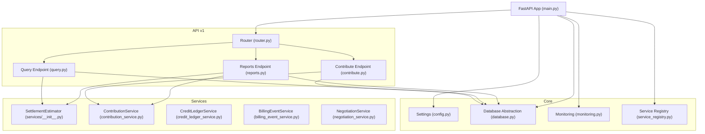

**Diagram sources**
- [app/main.py](file://app/main.py)
- [app/api/v1/router.py](file://app/api/v1/router.py)
- [app/api/v1/endpoints/query.py](file://app/api/v1/endpoints/query.py)
- [app/api/v1/endpoints/contribute.py](file://app/api/v1/endpoints/contribute.py)
- [app/api/v1/endpoints/reports.py](file://app/api/v1/endpoints/reports.py)
- [app/core/config.py](file://app/core/config.py)
- [app/core/database.py](file://app/core/database.py)
- [app/core/monitoring.py](file://app/core/monitoring.py)
- [app/core/service_registry.py](file://app/core/service_registry.py)
- [app/services/__init__.py](file://app/services/__init__.py)
- [app/services/contribution_service.py](file://app/services/contribution_service.py)
- [app/services/credit_ledger_service.py](file://app/services/credit_ledger_service.py)
- [app/services/billing_event_service.py](file://app/services/billing_event_service.py)
- [app/services/negotiation_service.py](file://app/services/negotiation_service.py)

**Section sources**
- [app/main.py](file://app/main.py)
- [app/api/v1/router.py](file://app/api/v1/router.py)
- [app/core/config.py](file://app/core/config.py)
- [app/core/database.py](file://app/core/database.py)

## Core Components
- Configuration and environment management: centralized settings with provider-agnostic database keys and multi-service integration URLs
- Database abstraction: a lightweight REST client that mimics a Supabase client, enabling dependency-free operations and retry logic
- Monitoring: Sentry integration for error tracking, performance monitoring, and breadcrumbs
- Service registry: registration, heartbeat, discovery, and integration contract management
- API routing: modular router composition grouping endpoints by domain

Key responsibilities:
- Settings encapsulate environment-driven behavior, including service-to-service integration endpoints and timeouts
- Database abstraction centralizes HTTP-based access to Supabase, with retry decorators and health checks
- Monitoring integrates error capture, filtering, and breadcrumb trails
- Service registry enables service discovery, module registration, and heartbeat management
- API router composes domain-specific endpoints

**Section sources**
- [app/core/config.py](file://app/core/config.py)
- [app/core/database.py](file://app/core/database.py)
- [app/core/monitoring.py](file://app/core/monitoring.py)
- [app/core/service_registry.py](file://app/core/service_registry.py)
- [app/api/v1/router.py](file://app/api/v1/router.py)

## Architecture Overview
The system follows a layered clean architecture:
- Presentation: FastAPI endpoints
- Application: API routers and endpoint handlers
- Domain: Business services implementing workflows
- Infrastructure: Database abstraction, monitoring, and service registry

Inter-service communication is achieved via:
- HTTP calls to other services (e.g., leverage reward fire-and-forget invocation)
- Service Registry for discovery and heartbeat
- Behavioral event emission to SaaS Admin

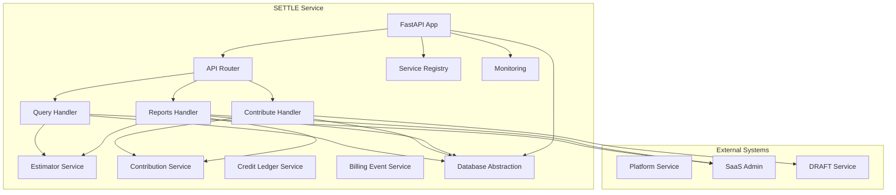

**Diagram sources**
- [app/main.py](file://app/main.py)
- [app/api/v1/endpoints/query.py](file://app/api/v1/endpoints/query.py)
- [app/api/v1/endpoints/contribute.py](file://app/api/v1/endpoints/contribute.py)
- [app/api/v1/endpoints/reports.py](file://app/api/v1/endpoints/reports.py)
- [app/services/contribution_service.py](file://app/services/contribution_service.py)
- [app/core/service_registry.py](file://app/core/service_registry.py)
- [app/core/monitoring.py](file://app/core/monitoring.py)
- [app/core/database.py](file://app/core/database.py)

## Detailed Component Analysis

### Clean Architecture and Service Layer Separation
- Presentation layer: FastAPI endpoints accept requests, validate inputs, and orchestrate service calls
- Application layer: Routers compose endpoints; handlers depend on services and infrastructure
- Domain layer: Services encapsulate business logic (estimation, contributions, credits, billing, negotiation)
- Infrastructure layer: Database abstraction, monitoring, and service registry

Implementation highlights:
- Endpoints depend on services and database abstraction, not on persistence internals
- Services encapsulate workflows and maintain domain purity
- Configuration and monitoring are injected via settings and initialization routines

**Section sources**
- [app/api/v1/endpoints/query.py](file://app/api/v1/endpoints/query.py)
- [app/api/v1/endpoints/contribute.py](file://app/api/v1/endpoints/contribute.py)
- [app/api/v1/endpoints/reports.py](file://app/api/v1/endpoints/reports.py)
- [app/services/contribution_service.py](file://app/services/contribution_service.py)
- [app/services/credit_ledger_service.py](file://app/services/credit_ledger_service.py)
- [app/services/billing_event_service.py](file://app/services/billing_event_service.py)
- [app/services/negotiation_service.py](file://app/services/negotiation_service.py)

### Dependency Injection Architecture and Service Registration
- Service registration: on startup, the app registers itself with the Service Registry, starts a heartbeat task, and registers modules and integrations
- Heartbeat: periodic keep-alive to the registry
- Discovery: convenience function to require a service by name and fail-fast if unavailable

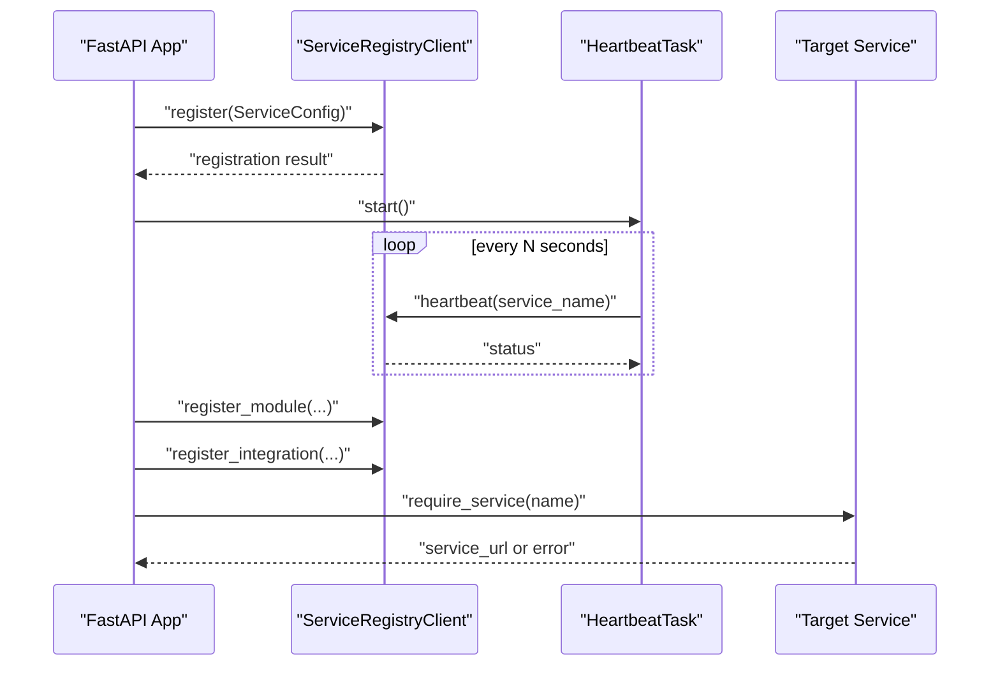

**Diagram sources**
- [app/main.py](file://app/main.py)
- [app/core/service_registry.py](file://app/core/service_registry.py)

**Section sources**
- [app/main.py](file://app/main.py)
- [app/core/service_registry.py](file://app/core/service_registry.py)

### Inter-Service Communication Mechanisms
- Fire-and-forget integration: contribution endpoint triggers a reward on another service asynchronously with a short timeout and non-fatal failure handling
- Behavioral event emission: endpoints emit events to SaaS Admin for analytics and compliance
- Service-to-service HTTP calls: configured via settings with timeouts and API keys

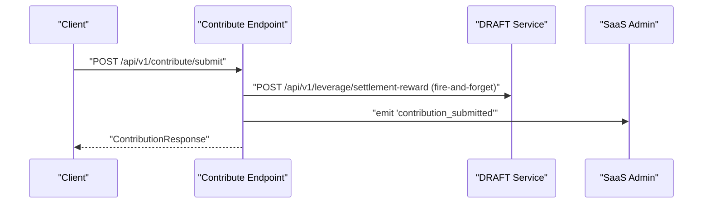

**Diagram sources**
- [app/api/v1/endpoints/contribute.py](file://app/api/v1/endpoints/contribute.py)
- [app/core/event_emitter.py](file://app/core/event_emitter.py)

**Section sources**
- [app/api/v1/endpoints/contribute.py](file://app/api/v1/endpoints/contribute.py)
- [app/core/config.py](file://app/core/config.py)

### Repository Pattern Usage and Persistence Abstraction
- The database abstraction exposes a REST client that mimics a Supabase client, with a fluent query builder and insert/update/delete builders
- Retry decorators and health checks wrap operations
- Services construct queries via the builder and execute them against the REST API

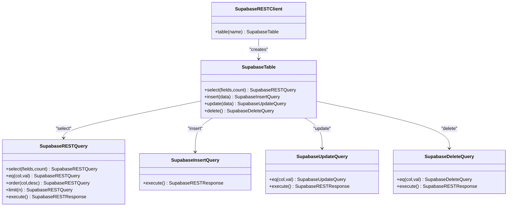

**Diagram sources**
- [app/core/database.py](file://app/core/database.py)

**Section sources**
- [app/core/database.py](file://app/core/database.py)

### Service Lifecycle Management
- Application lifecycle: startup and shutdown hooks manage registration, heartbeat, and graceful teardown
- Heartbeat task: runs in the background to keep the service alive in the registry
- Graceful shutdown: stops heartbeat and closes resources

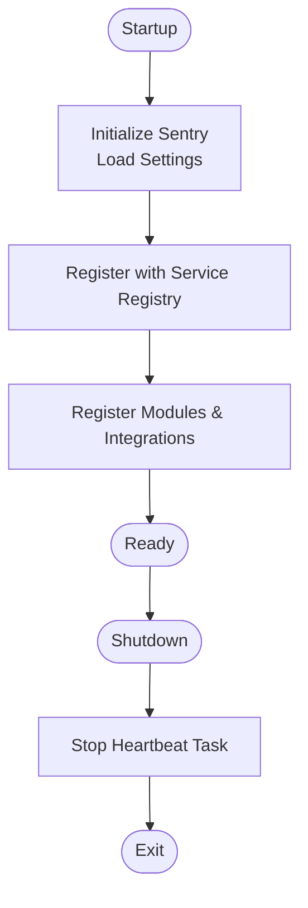

**Diagram sources**
- [app/main.py](file://app/main.py)
- [app/core/service_registry.py](file://app/core/service_registry.py)
- [app/core/monitoring.py](file://app/core/monitoring.py)

**Section sources**
- [app/main.py](file://app/main.py)
- [app/core/service_registry.py](file://app/core/service_registry.py)

### Error Propagation Strategies and Monitoring Integration
- Sentry integration: automatic error capture, performance monitoring, and breadcrumb trails
- Filtering: sensitive data redaction in captured events
- Logging: structured logs with request IDs and correlation
- Health checks: database connectivity verification

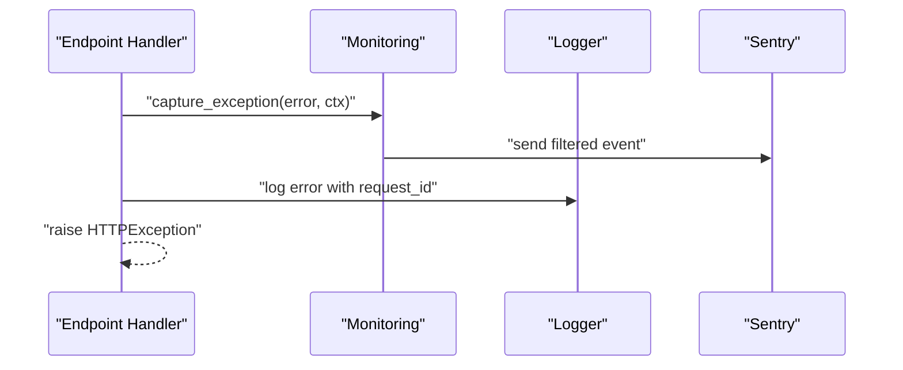

**Diagram sources**
- [app/core/monitoring.py](file://app/core/monitoring.py)
- [app/main.py](file://app/main.py)

**Section sources**
- [app/core/monitoring.py](file://app/core/monitoring.py)
- [app/main.py](file://app/main.py)

### Modular Service Design and Extensibility Patterns
- Modular endpoints: API router composes domain-specific routers
- Service exports: services module exposes public service classes
- Configuration-driven integrations: service URLs and API keys are environment-configured
- Event-driven extensibility: behavioral events enable decoupled downstream consumers

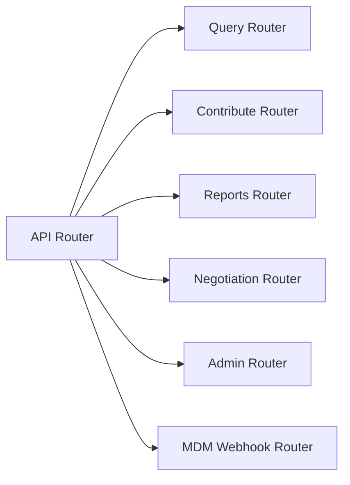

**Diagram sources**
- [app/api/v1/router.py](file://app/api/v1/router.py)
- [app/services/__init__.py](file://app/services/__init__.py)

**Section sources**
- [app/api/v1/router.py](file://app/api/v1/router.py)
- [app/services/__init__.py](file://app/services/__init__.py)

### Integration Points with External Systems
- Service Registry: registration, heartbeat, discovery, and integration contracts
- SaaS Admin: behavioral event emission for analytics
- Other SETTLE services: HTTP calls with API keys and timeouts
- Payment and storage integrations: services for Stripe and S3 are present in the services package

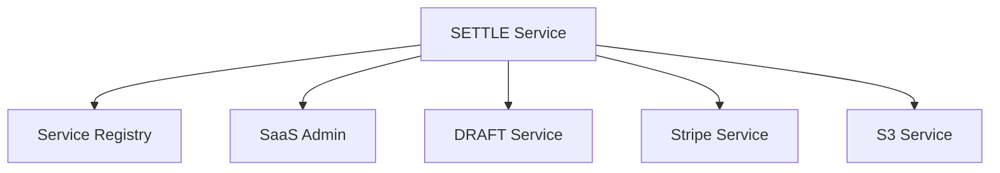

**Diagram sources**
- [app/core/service_registry.py](file://app/core/service_registry.py)
- [app/api/v1/endpoints/contribute.py](file://app/api/v1/endpoints/contribute.py)
- [app/services/billing_event_service.py](file://app/services/billing_event_service.py)
- [app/services/storage/s3_service.py](file://app/services/storage/s3_service.py)
- [app/services/billing/stripe_service.py](file://app/services/billing/stripe_service.py)

**Section sources**
- [app/core/service_registry.py](file://app/core/service_registry.py)
- [app/api/v1/endpoints/contribute.py](file://app/api/v1/endpoints/contribute.py)
- [app/services/billing_event_service.py](file://app/services/billing_event_service.py)

### Service Discovery, Load Balancing, and Fault Tolerance
- Service discovery: require_service function retrieves active service URLs from the registry
- Heartbeat: ensures registry awareness of liveness
- Fault tolerance: fire-and-forget integrations avoid blocking on downstream failures; retry decorators on database operations

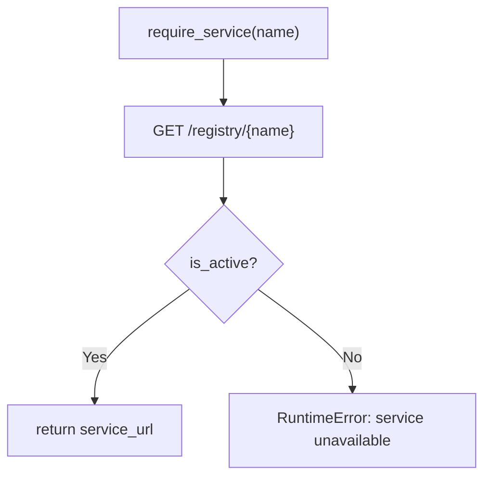

**Diagram sources**
- [app/core/service_registry.py](file://app/core/service_registry.py)

**Section sources**
- [app/core/service_registry.py](file://app/core/service_registry.py)
- [app/api/v1/endpoints/contribute.py](file://app/api/v1/endpoints/contribute.py)
- [app/core/database.py](file://app/core/database.py)

### Guidelines for Implementing New Services and Maintaining Consistency
- Define a service class under app/services with a clear responsibility boundary
- Use the database abstraction for persistence; avoid direct client dependencies
- Emit behavioral events for observability and cross-service coordination
- Respect configuration-driven integration endpoints and timeouts
- Apply retry decorators for transient failures
- Keep endpoints thin: validate, delegate to services, and return structured responses
- Add health endpoints for operational visibility
- Document module and integration contracts for registry registration

**Section sources**
- [app/services/contribution_service.py](file://app/services/contribution_service.py)
- [app/services/credit_ledger_service.py](file://app/services/credit_ledger_service.py)
- [app/services/billing_event_service.py](file://app/services/billing_event_service.py)
- [app/services/negotiation_service.py](file://app/services/negotiation_service.py)
- [app/core/database.py](file://app/core/database.py)
- [app/core/config.py](file://app/core/config.py)

## Dependency Analysis
The service exhibits low coupling and high cohesion:
- Endpoints depend on services and database abstraction
- Services depend on database abstraction and configuration
- Monitoring and registry are injected at application startup
- External integrations are configured via settings and invoked via HTTP

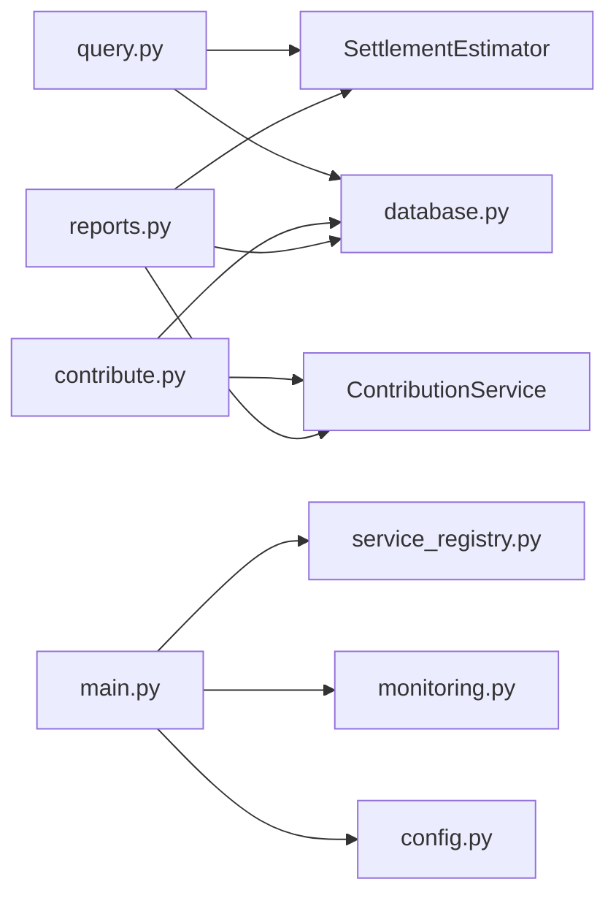

**Diagram sources**
- [app/api/v1/endpoints/query.py](file://app/api/v1/endpoints/query.py)
- [app/api/v1/endpoints/contribute.py](file://app/api/v1/endpoints/contribute.py)
- [app/api/v1/endpoints/reports.py](file://app/api/v1/endpoints/reports.py)
- [app/services/contribution_service.py](file://app/services/contribution_service.py)
- [app/services/credit_ledger_service.py](file://app/services/credit_ledger_service.py)
- [app/services/billing_event_service.py](file://app/services/billing_event_service.py)
- [app/services/negotiation_service.py](file://app/services/negotiation_service.py)
- [app/core/database.py](file://app/core/database.py)
- [app/core/service_registry.py](file://app/core/service_registry.py)
- [app/core/monitoring.py](file://app/core/monitoring.py)
- [app/core/config.py](file://app/core/config.py)
- [app/main.py](file://app/main.py)

**Section sources**
- [app/api/v1/endpoints/query.py](file://app/api/v1/endpoints/query.py)
- [app/api/v1/endpoints/contribute.py](file://app/api/v1/endpoints/contribute.py)
- [app/api/v1/endpoints/reports.py](file://app/api/v1/endpoints/reports.py)
- [app/core/database.py](file://app/core/database.py)
- [app/core/service_registry.py](file://app/core/service_registry.py)
- [app/core/monitoring.py](file://app/core/monitoring.py)
- [app/core/config.py](file://app/core/config.py)
- [app/main.py](file://app/main.py)

## Performance Considerations
- Database operations: retry decorators and health checks mitigate transient failures
- Monitoring: Sentry sampling rates configurable per environment
- Timeouts: service-to-service calls use bounded timeouts
- Response targets: configuration defines maximum response times for queries and reports

Recommendations:
- Monitor p95 latency for endpoints and optimize slow queries
- Tune Sentry sampling for production to balance cost and insight
- Use pagination and selective field selection in queries
- Cache infrequent reads where appropriate

**Section sources**
- [app/core/database.py](file://app/core/database.py)
- [app/core/monitoring.py](file://app/core/monitoring.py)
- [app/core/config.py](file://app/core/config.py)

## Troubleshooting Guide
Common issues and resolutions:
- Database connectivity: use health check endpoint and verify credentials in settings
- Sentry initialization: confirm DSN presence and environment configuration
- Service registry failures: verify registry URL and API key; inspect heartbeat logs
- Cross-service failures: inspect fire-and-forget invocations and timeouts; ensure API keys are set
- Authentication: confirm AUTH_MODE and API key configuration in production

Operational checks:
- Health endpoints for each service module
- Request ID propagation for tracing
- Error logs with breadcrumbs for debugging

**Section sources**
- [app/core/database.py](file://app/core/database.py)
- [app/core/monitoring.py](file://app/core/monitoring.py)
- [app/core/service_registry.py](file://app/core/service_registry.py)
- [app/api/v1/endpoints/contribute.py](file://app/api/v1/endpoints/contribute.py)
- [app/main.py](file://app/main.py)

## Conclusion
The SETTLE service demonstrates a clean, modular architecture with strong separation of concerns. It leverages configuration-driven integrations, robust monitoring, and a registry-based discovery mechanism. The service layer encapsulates business logic behind a repository-style abstraction, enabling testability and maintainability. Following the documented patterns ensures consistent evolution and reliable operation across environments.

## Appendices
- Implementation references:
  - [app/main.py](file://app/main.py)
  - [app/core/config.py](file://app/core/config.py)
  - [app/core/database.py](file://app/core/database.py)
  - [app/core/monitoring.py](file://app/core/monitoring.py)
  - [app/core/service_registry.py](file://app/core/service_registry.py)
  - [app/api/v1/router.py](file://app/api/v1/router.py)
  - [app/api/v1/endpoints/query.py](file://app/api/v1/endpoints/query.py)
  - [app/api/v1/endpoints/contribute.py](file://app/api/v1/endpoints/contribute.py)
  - [app/api/v1/endpoints/reports.py](file://app/api/v1/endpoints/reports.py)
  - [app/services/__init__.py](file://app/services/__init__.py)
  - [app/services/contribution_service.py](file://app/services/contribution_service.py)
  - [app/services/credit_ledger_service.py](file://app/services/credit_ledger_service.py)
  - [app/services/billing_event_service.py](file://app/services/billing_event_service.py)
  - [app/services/negotiation_service.py](file://app/services/negotiation_service.py)