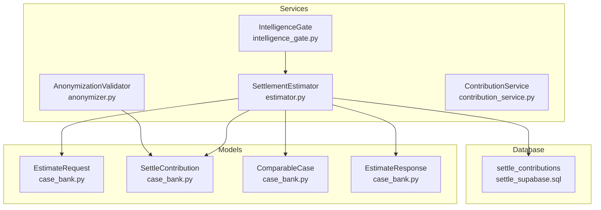
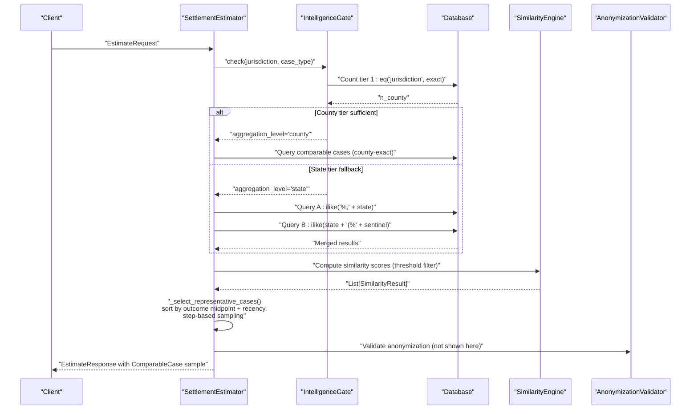
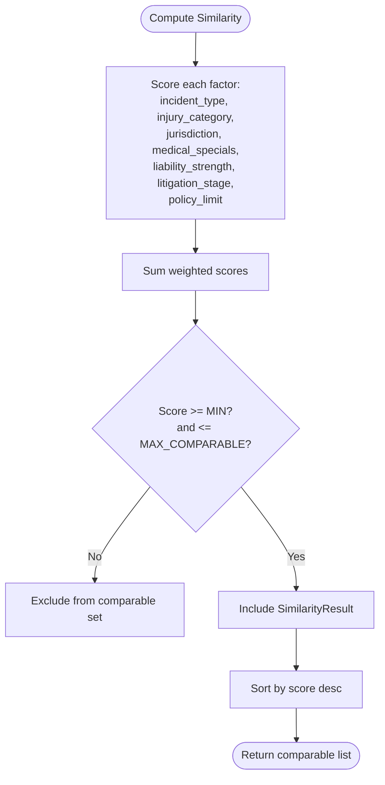
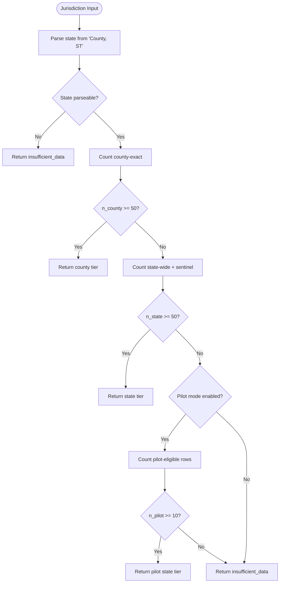
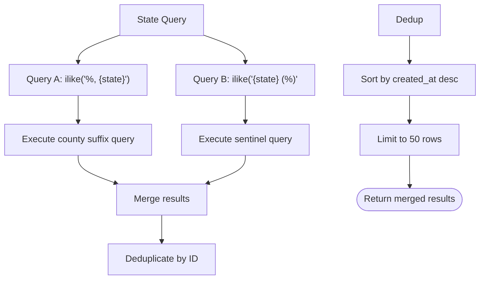
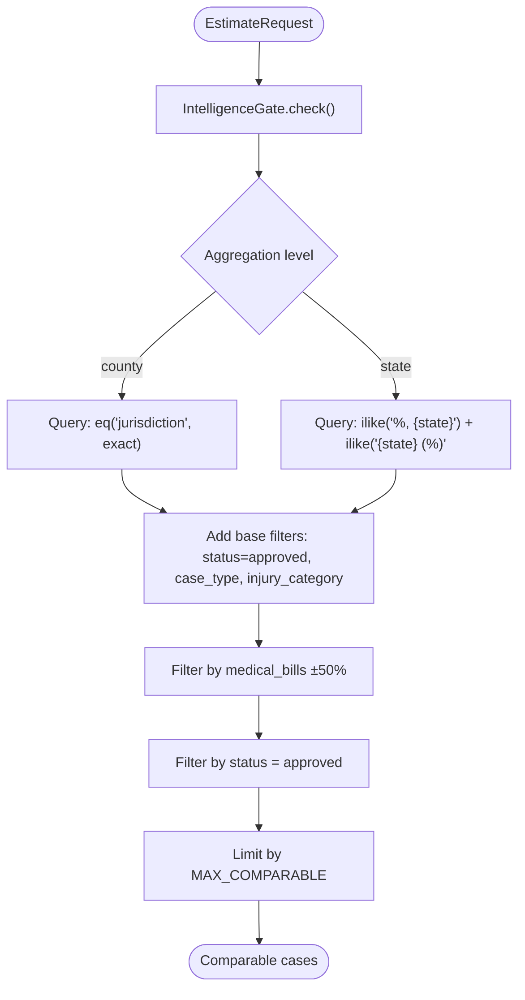
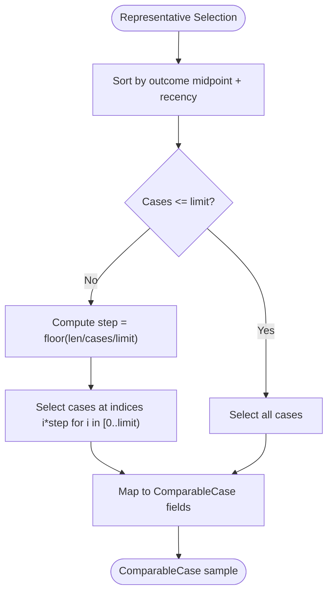
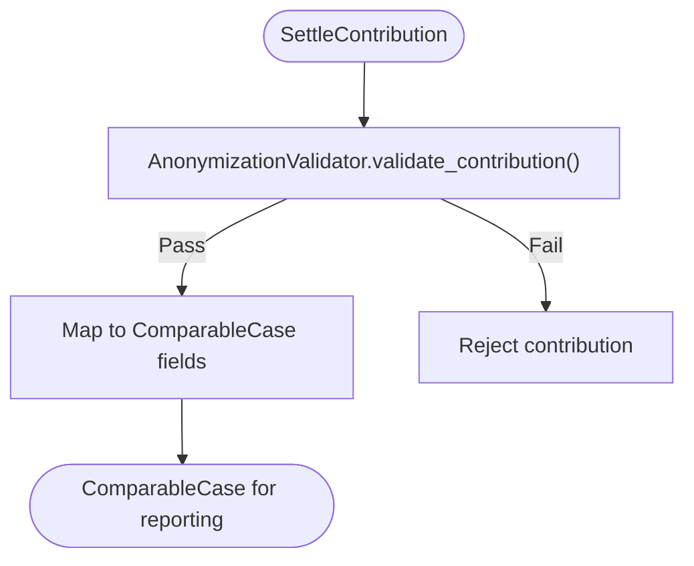
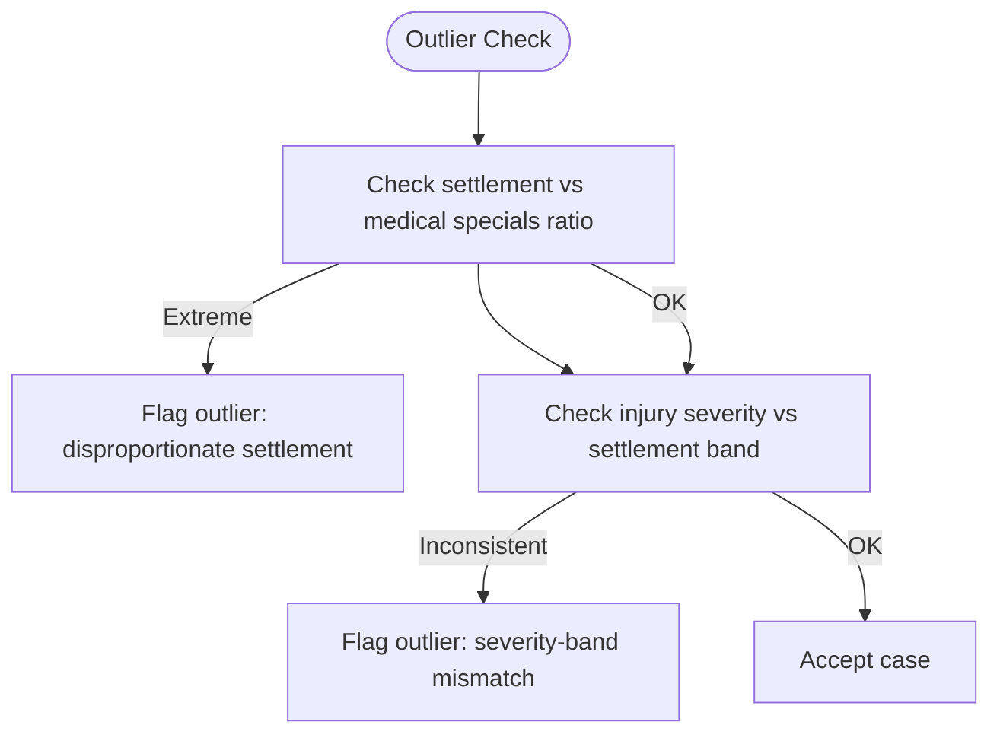
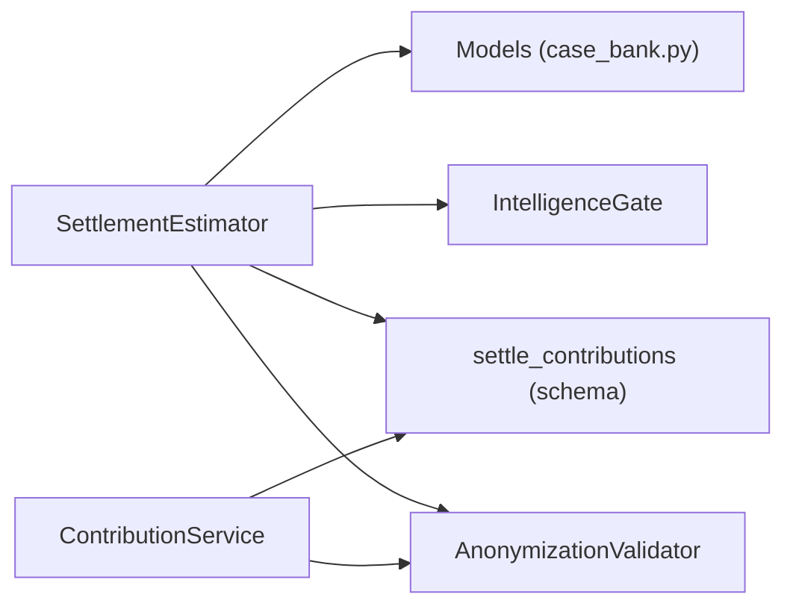

# Comparable Case Selection Strategy

<cite>
**Referenced Files in This Document**
- [estimator.py](file://app/services/estimator.py)
- [intelligence_gate.py](file://app/services/intelligence_gate.py)
- [anonymizer.py](file://app/services/anonymizer.py)
- [case_bank.py](file://app/models/case_bank.py)
- [contribution_service.py](file://app/services/contribution_service.py)
- [settle_supabase.sql](file://database/schemas/settle_supabase.sql)
- [test_estimator.py](file://tests/test_estimator.py)
- [test_anonymizer.py](file://tests/test_anonymizer.py)
- [test_intelligence_gate.py](file://tests/test_intelligence_gate.py)
- [_phase2x_b3_url_sanity.py](file://scripts/_phase2x_b3_url_sanity.py)
</cite>

## Update Summary
**Changes Made**
- Updated jurisdiction fallback mechanism documentation to reflect the new hierarchical system
- Added detailed explanation of chained .ilike() filters replacing comma-separated jurisdiction lists
- Enhanced state-tier fallback documentation with new pattern matching approach
- Updated implementation examples to show the new state parsing and matching logic
- Added URL encoding validation for jurisdiction filters

## Table of Contents
1. [Introduction](#introduction)
2. [Project Structure](#project-structure)
3. [Core Components](#core-components)
4. [Architecture Overview](#architecture-overview)
5. [Detailed Component Analysis](#detailed-component-analysis)
6. [Dependency Analysis](#dependency-analysis)
7. [Performance Considerations](#performance-considerations)
8. [Troubleshooting Guide](#troubleshooting-guide)
9. [Conclusion](#conclusion)

## Introduction
This document explains the comparable case selection strategy used to identify representative cases for settlement estimation. It covers the multi-criteria matching algorithm that prioritizes cases by jurisdiction, case type, injury category, and medical bill range (±50%), the representative selection process that spreads selections across the settlement range while prioritizing recent cases, and the anonymization pipeline that transforms raw SettleContribution objects into ComparableCase objects for reporting. Implementation examples demonstrate handling missing data, outlier detection, and step-based selection for large case pools. Performance optimization techniques for sorting and sampling are included.

**Updated** The jurisdiction fallback mechanism now uses a hierarchical system with chained .ilike() filters instead of comma-separated jurisdiction lists, providing more reliable matching for state-tier queries.

## Project Structure
The comparable case selection spans several modules:
- Estimator service: orchestrates querying, percentile/multiplier estimation, representative sampling, and anonymization.
- Intelligence Gate: manages hierarchical jurisdiction fallback with state-tier aggregation.
- Anonymizer: validates and sanitizes contributions to ensure zero PHI/PII.
- Data models: define SettleContribution, ComparableCase, EstimateRequest, and EstimateResponse.
- Contribution service: manages contributions, duplicate detection, and outlier checks.
- Database schema: defines settle_contributions with indexes supporting efficient querying.

**Diagram sources**
- [estimator.py:32-734](file://app/services/estimator.py#L32-L734)
- [intelligence_gate.py:119-487](file://app/services/intelligence_gate.py#L119-L487)
- [anonymizer.py:17-340](file://app/services/anonymizer.py#L17-L340)
- [case_bank.py:15-139](file://app/models/case_bank.py#L15-L139)
- [contribution_service.py:69-314](file://app/services/contribution_service.py#L69-L314)
- [settle_supabase.sql:31-128](file://database/schemas/settle_supabase.sql#L31-L128)

**Section sources**
- [estimator.py:32-734](file://app/services/estimator.py#L32-L734)
- [intelligence_gate.py:119-487](file://app/services/intelligence_gate.py#L119-L487)
- [anonymizer.py:17-340](file://app/services/anonymizer.py#L17-L340)
- [case_bank.py:15-139](file://app/models/case_bank.py#L15-L139)
- [contribution_service.py:69-314](file://app/services/contribution_service.py#L69-L314)
- [settle_supabase.sql:31-128](file://database/schemas/settle_supabase.sql#L31-L128)

## Core Components
- Multi-criteria matching: SimilarityEngine computes weighted similarity scores across jurisdiction, case type, injury category, medical specials band, liability strength, litigation stage, and policy limit band. Threshold filtering ensures only sufficiently similar records are considered.
- Query and filtering: SettlementEstimator's query function matches jurisdiction, case type, injury category, and medical bill range (±50%) with status = approved.
- Hierarchical jurisdiction fallback: IntelligenceGate implements a three-tier system (county-exact, state-wide + sentinel, pilot-mode) with chained .ilike() filters for reliable state matching.
- Representative selection: Cases are sorted by outcome range midpoint and recency, then sampled evenly across the range using a step-size mechanism to ensure spread across low, medium, and high settlements while favoring recent cases.
- Anonymization: SettleContribution objects are converted to ComparableCase with only permitted fields retained, ensuring zero PHI/PII.
- Outlier detection: ContributionService includes rules to flag extreme ratios and inconsistency between injury severity and settlement band.

**Updated** The jurisdiction fallback system now uses a hierarchical approach with state parsing and chained .ilike() filters for county suffix and sentinel bucket matching.

**Section sources**
- [intelligence_gate.py:9-23](file://app/services/intelligence_gate.py#L9-L23)
- [intelligence_gate.py:311-369](file://app/services/intelligence_gate.py#L311-L369)
- [estimator.py:289-367](file://app/services/estimator.py#L289-L367)
- [estimator.py:381-426](file://app/services/estimator.py#L381-L426)
- [anonymizer.py:92-180](file://app/services/anonymizer.py#L92-L180)
- [contribution_service.py:321-387](file://app/services/contribution_service.py#L321-L387)

## Architecture Overview
The comparable case selection pipeline integrates similarity scoring, filtering, hierarchical jurisdiction fallback, representative sampling, and anonymization.

**Diagram sources**
- [estimator.py:71-287](file://app/services/estimator.py#L71-L287)
- [intelligence_gate.py:158-309](file://app/services/intelligence_gate.py#L158-L309)
- [case_bank.py:15-107](file://app/models/case_bank.py#L15-L107)

## Detailed Component Analysis

### Multi-Criteria Matching Algorithm
The SimilarityEngine applies deterministic weights to seven factors:
- Incident type: exact match yields maximum points; relatedness matrix provides partial credit.
- Injury category: adjacency scoring based on predefined levels.
- Jurisdiction: exact county, same state, neighboring state, or different region with decreasing weights.
- Medical specials band: exact match or adjacent bands yield partial points.
- Liability strength: adjacency scoring across ordered levels.
- Litigation stage: adjacency scoring across ordered stages.
- Policy limit band: exact match or adjacent bands yield partial points.

Threshold filtering retains only results meeting a minimum similarity threshold and sorts by score, limiting to a maximum number of comparable cases.

**Diagram sources**
- [intelligence_gate.py:201-309](file://app/services/intelligence_gate.py#L201-L309)

**Section sources**
- [intelligence_gate.py:201-309](file://app/services/intelligence_gate.py#L201-L309)

### Hierarchical Jurisdiction Fallback System
The IntelligenceGate implements a three-tier hierarchy with chained .ilike() filters:

**Tier 1: County-Exact**
- Direct equality match on full jurisdiction string
- Returns immediately if count ≥ 50

**Tier 2: State-Wide + Sentinel**
- Parses state from "County, ST" format using `_parse_state()`
- Two separate .ilike() queries combined:
  - County suffix: `%, {state}` (matches all counties in state)
  - Sentinel bucket: `{state} (%` (Unknown County bucket)
- Results merged and deduplicated by ID

**Tier 3: Pilot-Mode State-Tier**
- Special path for flagged pilot users with feature flag enabled
- Excludes sentinel/legacy injury tags from eligibility count
- Uses different thresholds (n≥10 vs n≥50)

**Diagram sources**
- [intelligence_gate.py:158-309](file://app/services/intelligence_gate.py#L158-L309)
- [intelligence_gate.py:456-465](file://app/services/intelligence_gate.py#L456-L465)

**Section sources**
- [intelligence_gate.py:9-23](file://app/services/intelligence_gate.py#L9-L23)
- [intelligence_gate.py:158-309](file://app/services/intelligence_gate.py#L158-L309)
- [intelligence_gate.py:456-465](file://app/services/intelligence_gate.py#L456-L465)

### State-Tier Query Implementation
The state-tier implementation uses chained .ilike() filters with proper URL encoding:

**County Suffix Query:**
- Pattern: `%, {state}` 
- Matches all counties in the specified state
- Example: `"%, FL"` matches "Miami-Dade County, FL"

**Sentinel Bucket Query:**
- Pattern: `{state} (%`
- Matches Unknown County sentinel bucket
- Example: `"FL (%"` matches "FL (Unknown County)"

**URL Encoding Validation:**
- Commas encoded as `%2C` in URL filters
- Percent wildcards encoded as `%25` in URL filters  
- Underscore wildcards preserved as `_` (not encoded)
- Regression tests verify proper encoding behavior

**Diagram sources**
- [estimator.py:391-426](file://app/services/estimator.py#L391-L426)
- [intelligence_gate.py:345-348](file://app/services/intelligence_gate.py#L345-L348)
- [_phase2x_b3_url_sanity.py:69-176](file://scripts/_phase2x_b3_url_sanity.py#L69-L176)

**Section sources**
- [estimator.py:391-426](file://app/services/estimator.py#L391-L426)
- [intelligence_gate.py:345-348](file://app/services/intelligence_gate.py#L345-L348)
- [_phase2x_b3_url_sanity.py:69-176](file://scripts/_phase2x_b3_url_sanity.py#L69-L176)

### Query and Filtering Strategy
SettlementEstimator's query function implements a strict multi-criteria filter:
- Jurisdiction (county + state) with hierarchical fallback
- Case type (if provided)
- Injury category/type
- Medical bills within ±50% of the target
- Status = approved

Indexes on jurisdiction, case_type, injury_category, outcome_range, status, created_at, and medical_bills support efficient retrieval.

**Diagram sources**
- [estimator.py:289-367](file://app/services/estimator.py#L289-L367)
- [intelligence_gate.py:158-309](file://app/services/intelligence_gate.py#L158-L309)

**Section sources**
- [estimator.py:289-367](file://app/services/estimator.py#L289-L367)
- [intelligence_gate.py:158-309](file://app/services/intelligence_gate.py#L158-L309)

### Representative Case Selection Process
The selection algorithm:
- Sorts cases by outcome amount range midpoint (ascending) and recency (descending).
- If the number of cases ≤ limit, returns all.
- Otherwise, selects cases at regular step intervals across the sorted list to ensure spread across low, medium, and high settlements.
- Converts each selected SettleContribution to ComparableCase for reporting.

**Diagram sources**
- [estimator.py:519-571](file://app/services/estimator.py#L519-L571)
- [case_bank.py:95-107](file://app/models/case_bank.py#L95-L107)

**Section sources**
- [estimator.py:519-571](file://app/services/estimator.py#L519-L571)
- [case_bank.py:95-107](file://app/models/case_bank.py#L95-L107)

### Anonymization Pipeline
AnonymizationValidator enforces strict compliance:
- Prohibits PHI/PII patterns (SSN, DOB, phone, email, addresses).
- Restricts free-text narratives and specific identifiers.
- Validates drop-down values and jurisdiction format.
- Flags forbidden liability language.

ComparableCase is produced by mapping only permitted fields from SettleContribution, ensuring zero PHI/PII in reports.

**Diagram sources**
- [anonymizer.py:92-180](file://app/services/anonymizer.py#L92-L180)
- [case_bank.py:95-107](file://app/models/case_bank.py#L95-L107)

**Section sources**
- [anonymizer.py:92-180](file://app/services/anonymizer.py#L92-L180)
- [case_bank.py:95-107](file://app/models/case_bank.py#L95-L107)

### Outlier Detection and Handling
OutlierDetector applies two rules:
- Settlement significantly greater than medical specials band (e.g., extreme ratios).
- Inconsistent settlement band relative to injury severity (e.g., minor injuries with very high bands).

These checks help maintain data quality and improve estimation reliability.

**Diagram sources**
- [contribution_service.py:330-357](file://app/services/contribution_service.py#L330-L357)

**Section sources**
- [contribution_service.py:330-357](file://app/services/contribution_service.py#L330-L357)

### Implementation Examples

#### Handling Missing Data
- Medical specials band and policy limit band may be optional; scoring functions return neutral or minimal points when missing, preventing penalization of otherwise strong matches.
- Jurisdiction format validation ensures "County, ST" format; otherwise, the contribution is rejected during anonymization.

**Section sources**
- [intelligence_gate.py:456-465](file://app/services/intelligence_gate.py#L456-L465)
- [anonymizer.py:217-245](file://app/services/anonymizer.py#L217-L245)

#### State-Tier Fallback Mechanism
- When county tier fails (n_county < 50), IntelligenceGate attempts state-tier fallback using `_parse_state()` to extract state code.
- Two chained .ilike() queries combine county suffix and sentinel bucket results.
- Proper URL encoding ensures commas are encoded as `%2C` and wildcards as `%25`.

**Section sources**
- [intelligence_gate.py:221-262](file://app/services/intelligence_gate.py#L221-L262)
- [estimator.py:391-426](file://app/services/estimator.py#L391-L426)
- [_phase2x_b3_url_sanity.py:69-176](file://scripts/_phase2x_b3_url_sanity.py#L69-L176)

#### Step-Based Selection for Large Pools
- For N > limit, step = floor(N / limit); selected indices are i*step for i in [0..limit). This guarantees spread across the settlement range and avoids bias toward any segment.

**Section sources**
- [estimator.py:549-554](file://app/services/estimator.py#L549-L554)

## Dependency Analysis
The estimator depends on:
- Data models for typed requests, responses, and anonymized cases.
- IntelligenceGate for hierarchical jurisdiction fallback.
- Database schema for indexing and filtering.
- AnonymizationValidator for compliance.
- ContributionService for outlier detection and duplicate prevention.

**Diagram sources**
- [estimator.py:15-20](file://app/services/estimator.py#L15-L20)
- [intelligence_gate.py:18-26](file://app/services/intelligence_gate.py#L18-L26)
- [case_bank.py:15-139](file://app/models/case_bank.py#L15-L139)
- [contribution_service.py:69-77](file://app/services/contribution_service.py#L69-L77)
- [settle_supabase.sql:31-128](file://database/schemas/settle_supabase.sql#L31-L128)

**Section sources**
- [estimator.py:15-20](file://app/services/estimator.py#L15-L20)
- [intelligence_gate.py:18-26](file://app/services/intelligence_gate.py#L18-L26)
- [case_bank.py:15-139](file://app/models/case_bank.py#L15-L139)
- [contribution_service.py:69-77](file://app/services/contribution_service.py#L69-L77)
- [settle_supabase.sql:31-128](file://database/schemas/settle_supabase.sql#L31-L128)

## Performance Considerations
- Sorting cost: Sorting by outcome midpoint and recency is O(n log n). For large pools, consider maintaining pre-sorted partitions by outcome range buckets to reduce sort overhead.
- Sampling cost: Step-based sampling is O(limit) and efficient; ensure limit remains bounded (default 10) to avoid large report payloads.
- Database filtering: Leverage composite indexes on jurisdiction, case_type, and status to minimize scan costs.
- Hierarchical queries: State-tier queries use two separate .ilike() operations plus merge/dedupe; this is more reliable than complex OR conditions across the client stack.
- URL encoding: Proper encoding reduces query errors and improves reliability of jurisdiction matching.
- Similarity scoring: Current implementation is O(n) per target; batching targets or caching frequent patterns can reduce repeated computation.
- Memory: Representative selection materializes a short sample; keep sample size small and avoid loading unnecessary fields from the database.

## Troubleshooting Guide
- Low comparable count: If fewer than the medium threshold, the estimator falls back to multipliers. Verify jurisdiction coverage and ensure contributions are approved.
- Poor representative spread: Confirm step-based sampling is applied and that sorting considers both outcome midpoint and recency.
- Anonymization failures: Review forbidden patterns and jurisdiction format; update contributions to allowed drop-down values.
- Outliers affecting estimates: Investigate flagged cases and adjust inclusion criteria if necessary.
- State-tier fallback issues: Verify jurisdiction format follows "County, ST" pattern and state parsing succeeds.
- URL encoding problems: Check that commas are encoded as `%2C` and wildcards as `%25` in jurisdiction filters.
- Empty state-tier results: Ensure both county suffix and sentinel queries return expected results for the given state.

**Section sources**
- [estimator.py:79-90](file://app/services/estimator.py#L79-L90)
- [test_estimator.py:14-33](file://tests/test_estimator.py#L14-L33)
- [anonymizer.py:92-180](file://app/services/anonymizer.py#L92-L180)
- [contribution_service.py:330-357](file://app/services/contribution_service.py#L330-L357)
- [test_intelligence_gate.py:263-280](file://tests/test_intelligence_gate.py#L263-280)
- [_phase2x_b3_url_sanity.py:69-176](file://scripts/_phase2x_b3_url_sanity.py#L69-L176)

## Conclusion
The comparable case selection strategy combines deterministic similarity matching, strict filtering by jurisdiction, case type, injury category, and medical bill range, and a robust representative sampling mechanism that favors recent cases while spreading across the settlement range. The new hierarchical jurisdiction fallback system provides reliable state-tier aggregation using chained .ilike() filters, replacing the previous comma-separated jurisdiction list approach. Anonymization ensures zero PHI/PII in reports, and outlier detection improves data quality. Together, these components deliver accurate, transparent, and legally compliant settlement estimates with improved reliability and maintainability.