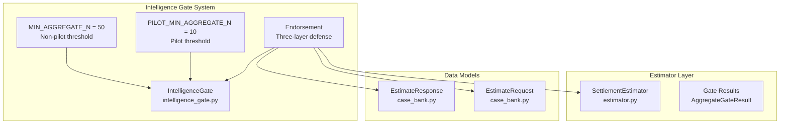
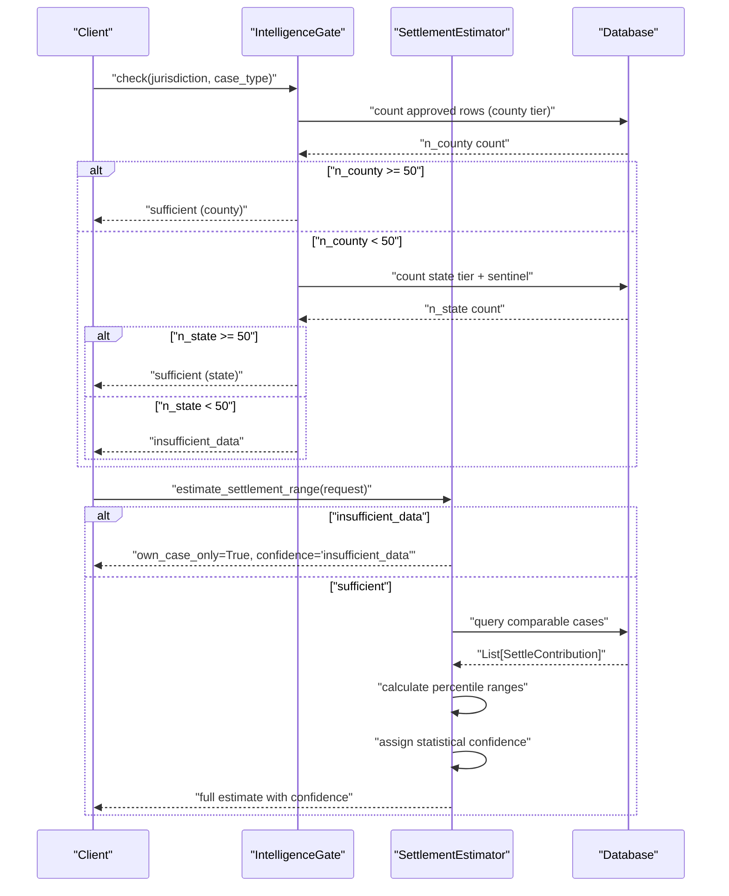
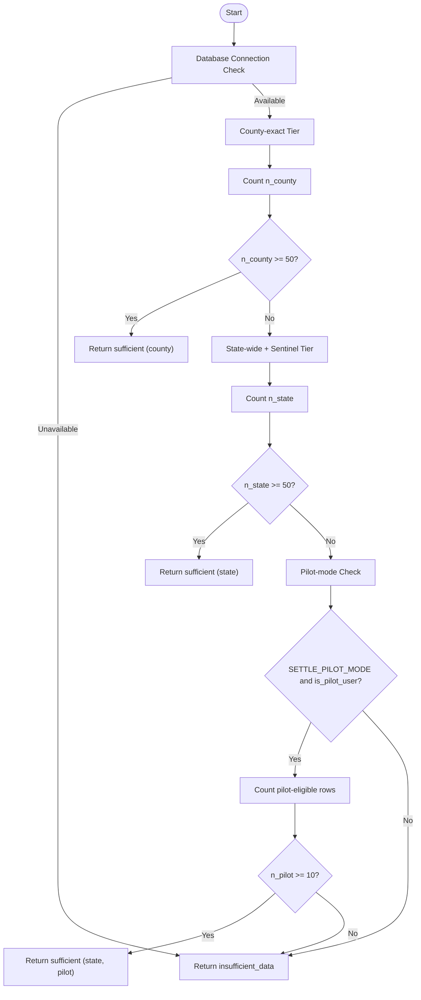
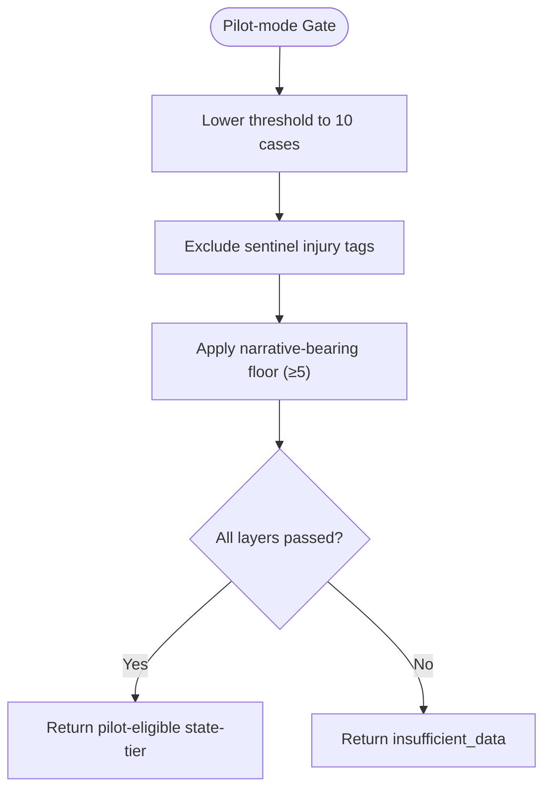
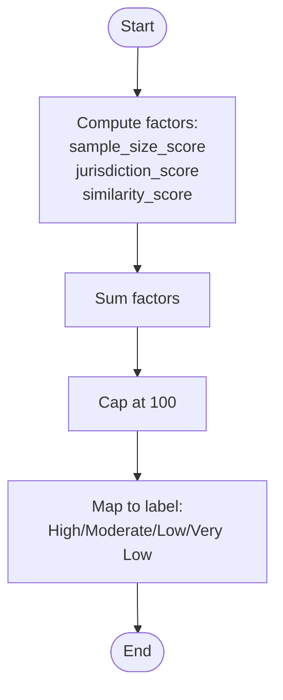
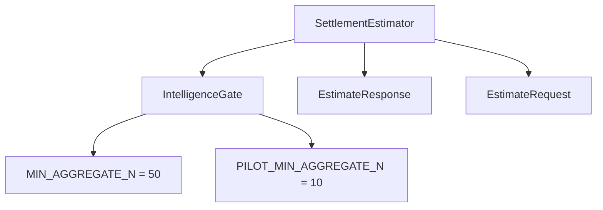

# Confidence Scoring System

<cite>
**Referenced Files in This Document**
- [estimator.py](file://app/services/estimator.py)
- [intelligence_gate.py](file://app/services/intelligence_gate.py)
- [case_bank.py](file://app/models/case_bank.py)
- [test_estimator.py](file://tests/test_estimator.py)
- [ADR_20260516_pilot_mode_gate_threshold.md](file://docs/01-main/adr/ADR_20260516_pilot_mode_gate_threshold.md)
</cite>

## Update Summary
**Changes Made**
- Updated confidence scoring system to reflect the new IntelligenceGate-based approach
- Removed the old three-tier system (low, medium, high) with sample size thresholds
- Added new system using MIN_AGGREGATE_N threshold (50 for non-pilot, 10 for pilot)
- Updated confidence labels to include 'insufficient_data' as alternative response
- Revised methodology to focus on gate-level decisions rather than percentile calculations
- Updated examples and diagrams to reflect the new architecture

## Table of Contents
1. [Introduction](#introduction)
2. [Project Structure](#project-structure)
3. [Core Components](#core-components)
4. [Architecture Overview](#architecture-overview)
5. [Detailed Component Analysis](#detailed-component-analysis)
6. [Dependency Analysis](#dependency-analysis)
7. [Performance Considerations](#performance-considerations)
8. [Troubleshooting Guide](#troubleshooting-guide)
9. [Conclusion](#conclusion)

## Introduction
This document explains the confidence scoring system that determines the reliability of settlement estimates based on the IntelligenceGate's MIN_AGGREGATE_N threshold. The system has evolved from a three-tier confidence model to a gate-driven approach that prioritizes data quality and statistical rigor over arbitrary sample size thresholds.

Key aspects of the current system:
- Single confidence threshold: MIN_AGGREGATE_N = 50 for non-pilot users, 10 for pilot users
- Alternative response: 'insufficient_data' when thresholds are not met
- No multiplier fallback: synthesis of ranges from sub-threshold data is prevented
- Pilot mode exceptions: three-layer defense-in-depth for pilot users
- Statistical confidence within passing cohorts: 'high' (n >= 30) or 'medium' (n < 30)

## Project Structure
The confidence scoring system centers around the IntelligenceGate with supporting estimator and model components:

**Diagram sources**
- [intelligence_gate.py:42-45](file://app/services/intelligence_gate.py#L42-L45)
- [intelligence_gate.py:126-131](file://app/services/intelligence_gate.py#L126-L131)
- [estimator.py:32-51](file://app/services/estimator.py#L32-L51)
- [case_bank.py:117-189](file://app/models/case_bank.py#L117-L189)

**Section sources**
- [intelligence_gate.py:1-487](file://app/services/intelligence_gate.py#L1-L487)
- [estimator.py:1-734](file://app/services/estimator.py#L1-L734)
- [case_bank.py:1-347](file://app/models/case_bank.py#L1-L347)

## Core Components

### IntelligenceGate Threshold System
The IntelligenceGate enforces a hard threshold for data credibility:

- **Production threshold (non-pilot)**: MIN_AGGREGATE_N = 50 cases per tier
- **Pilot threshold**: PILOT_MIN_AGGREGATE_N = 10 cases (three-layer defense)
- **Alternative response**: 'insufficient_data' when thresholds are not met
- **Hierarchical tiers**: county-exact → state-wide + sentinel → none

### Confidence Labels and Responses
The system produces four distinct confidence states:

1. **'sufficient'** with aggregation_level:
   - 'county': n_county >= 50
   - 'state': n_state >= 50 (state-wide + sentinel)
   - 'none': neither tier >= 50

2. **'insufficient_data'**:
   - Own case only response
   - All aggregate widgets suppressed
   - No percentile calculations performed

3. **Statistical confidence within passing cohorts**:
   - 'high': n >= 30 cases (within passing cohort)
   - 'medium': n < 30 cases (within passing cohort)

**Section sources**
- [intelligence_gate.py:42-45](file://app/services/intelligence_gate.py#L42-L45)
- [intelligence_gate.py:126-131](file://app/services/intelligence_gate.py#L126-L131)
- [estimator.py:49-57](file://app/services/estimator.py#L49-L57)
- [case_bank.py:128](file://app/models/case_bank.py#L128)

## Architecture Overview
The system follows a strict gate-first approach where data availability determines whether percentile calculations can proceed:

**Diagram sources**
- [intelligence_gate.py:158-309](file://app/services/intelligence_gate.py#L158-L309)
- [estimator.py:71-287](file://app/services/estimator.py#L71-L287)

## Detailed Component Analysis

### IntelligenceGate Decision Logic
The IntelligenceGate implements a three-tier hierarchical system with hard thresholds:

**Diagram sources**
- [intelligence_gate.py:158-309](file://app/services/intelligence_gate.py#L158-L309)

**Section sources**
- [intelligence_gate.py:158-309](file://app/services/intelligence_gate.py#L158-L309)

### Pilot-Mode Three-Layer Defense
Pilot mode introduces three independent layers of defense:

1. **State-tier-only relaxation**: Lower threshold from 50 to 10 cases
2. **Sentinel injury-tag exclusion**: Exclude rows with sentinel/unclassified injury tags
3. **Displayable-cases secondary gate**: Require minimum number of narrative-bearing cases

**Diagram sources**
- [intelligence_gate.py:264-294](file://app/services/intelligence_gate.py#L264-L294)
- [ADR_20260516_pilot_mode_gate_threshold.md:25-53](file://docs/01-main/adr/ADR_20260516_pilot_mode_gate_threshold.md#L25-L53)

**Section sources**
- [intelligence_gate.py:126-148](file://app/services/intelligence_gate.py#L126-L148)
- [ADR_20260516_pilot_mode_gate_threshold.md:25-80](file://docs/01-main/adr/ADR_20260516_pilot_mode_gate_threshold.md#L25-L80)

### Estimator Confidence Assignment
Within passing cohorts, the estimator assigns statistical confidence based on case count:

- **'high' confidence**: n >= 30 cases (within passing cohort)
- **'medium' confidence**: n < 30 cases (within passing cohort)
- **'insufficient_data'**: when gate returns insufficient_data

**Section sources**
- [estimator.py:49-57](file://app/services/estimator.py#L49-L57)
- [estimator.py:474-490](file://app/services/estimator.py#L474-L490)

### Confidence Scoring for Query Expansion
The calculator computes a composite confidence score (0–100) from three factors:
- Sample size: 0–40 points
  - 20–40 points between 20 and 200 cases (linear interpolation)
  - 0–20 points below 20 cases
- Jurisdiction match: 0–30 points
  - County: 30, State: 25, Regional: 15, National: 5
- Average similarity: 0–30 points
  - Scaled from 60–100 average similarity score

**Diagram sources**
- [settlement_calculator.py:117-142](file://app/services/settlement_calculator.py#L117-L142)
- [settlement_calculator.py:144-155](file://app/services/settlement_calculator.py#L144-L155)
- [settlement_calculator.py:157-165](file://app/services/settlement_calculator.py#L157-L165)
- [settlement_calculator.py:167-180](file://app/services/settlement_calculator.py#L167-L180)
- [settlement_calculator.py:182-191](file://app/services/settlement_calculator.py#L182-L191)

**Section sources**
- [settlement_calculator.py:48-56](file://app/services/settlement_calculator.py#L48-L56)
- [settlement_calculator.py:117-142](file://app/services/settlement_calculator.py#L117-L142)
- [settlement_calculator.py:144-155](file://app/services/settlement_calculator.py#L144-L155)
- [settlement_calculator.py:157-165](file://app/services/settlement_calculator.py#L157-L165)
- [settlement_calculator.py:167-180](file://app/services/settlement_calculator.py#L167-L180)
- [settlement_calculator.py:182-191](file://app/services/settlement_calculator.py#L182-L191)

### Confidence Levels and Their Implications
**Updated** The system now operates on gate-level decisions rather than arbitrary sample size thresholds:

- **'sufficient' responses**: Percentile calculation proceeds with aggregation_level signal
- **'insufficient_data' responses**: Own case only, all aggregate widgets suppressed
- **Statistical confidence within cohorts**: 'high' (n >= 30) or 'medium' (n < 30)
- **Pilot mode**: Three-layer defense allows limited estimates with transparency

**Section sources**
- [estimator.py:104-134](file://app/services/estimator.py#L104-L134)
- [estimator.py:474-490](file://app/services/estimator.py#L474-L490)

### Examples: Confidence Changes with Sample Sizes
**Updated** Examples now reflect the gate-driven approach:

- Example 1: n >= 50 cases (non-pilot)
  - Gate: sufficient (county or state tier)
  - Confidence: 'high' or 'medium' (statistical)
  - Rationale: Gate threshold met, percentile calculation proceeds

- Example 2: 10-49 cases (pilot mode)
  - Gate: pilot-mode sufficient (state tier with sentinel exclusion)
  - Confidence: 'high' or 'medium' (statistical)
  - Rationale: Three-layer defense allows limited estimates

- Example 3: <10 cases (pilot mode)
  - Gate: insufficient_data
  - Confidence: 'insufficient_data'
  - Rationale: Pilot threshold not met, no estimates produced

**Section sources**
- [test_estimator.py:109-288](file://tests/test_estimator.py#L109-L288)
- [intelligence_gate.py:264-294](file://app/services/intelligence_gate.py#L264-L294)

### Relationship Between Confidence and Justification Text
The justification text communicates methodology and uncertainty:

- **'insufficient_data'**: Emphasizes lack of credible data, no percentile ranges
- **'sufficient'**: Emphasizes analysis of credible comparable cases
- **Statistical confidence**: 'high' (n >= 30) or 'medium' (n < 30) within passing cohort
- **Pilot mode**: Explicit disclosure of limited data, statewide aggregation, narrative requirements

**Section sources**
- [estimator.py:573-679](file://app/services/estimator.py#L573-L679)

## Dependency Analysis
The IntelligenceGate-based system creates clear dependencies:

**Diagram sources**
- [intelligence_gate.py:42-45](file://app/services/intelligence_gate.py#L42-L45)
- [intelligence_gate.py:126-131](file://app/services/intelligence_gate.py#L126-L131)
- [estimator.py:59-69](file://app/services/estimator.py#L59-L69)

**Section sources**
- [intelligence_gate.py:1-487](file://app/services/intelligence_gate.py#L1-L487)
- [estimator.py:1-734](file://app/services/estimator.py#L1-L734)

## Performance Considerations
- **Response time targets**: Tests enforce sub-second response times for estimation requests
- **Gate-first optimization**: Prevents unnecessary database queries when data is insufficient
- **Pilot-mode filtering**: Additional filtering reduces processing overhead for pilot responses
- **Memory efficiency**: No percentile calculations when gate returns insufficient_data

**Section sources**
- [test_estimator.py:84-102](file://tests/test_estimator.py#L84-L102)
- [estimator.py:104-134](file://app/services/estimator.py#L104-L134)

## Troubleshooting Guide
- **Insufficient data issues**:
  - Symptom: 'insufficient_data' response with own_case_only=True
  - Action: Verify jurisdiction has sufficient approved cases, check pilot mode configuration
- **Unexpected confidence label**:
  - Verify gate threshold (50 for non-pilot, 10 for pilot) and jurisdiction expansion
  - Check pilot-mode three-layer requirements (state-tier, sentinel exclusion, narrative floor)
- **Pilot mode not working**:
  - Verify SETTLE_PILOT_MODE flag is enabled
  - Check pilot user ID is in SETTLE_PILOT_USER_IDS
  - Ensure injury_category contains valid tags (excludes sentinel values)

**Section sources**
- [intelligence_gate.py:264-294](file://app/services/intelligence_gate.py#L264-L294)
- [ADR_20260516_pilot_mode_gate_threshold.md:82-101](file://docs/01-main/adr/ADR_20260516_pilot_mode_gate_threshold.md#L82-L101)

## Conclusion
The confidence scoring system now prioritizes data quality and statistical rigor over arbitrary sample size thresholds. The IntelligenceGate enforces hard thresholds (50 for non-pilot, 10 for pilot) with 'insufficient_data' as the alternative response when thresholds are not met. This approach prevents the synthesis of unreliable estimates from sparse data while allowing for transparent pilot-mode operation with three-layer defense. The system maintains statistical confidence labeling ('high'/'medium') within passing cohorts while communicating uncertainty through explicit gate-level decisions and justification text.