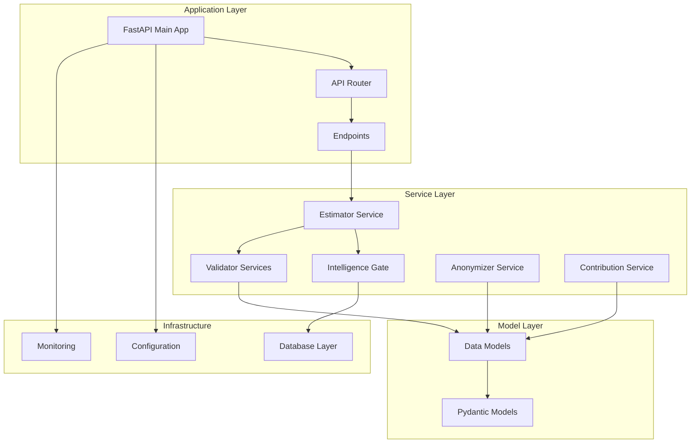
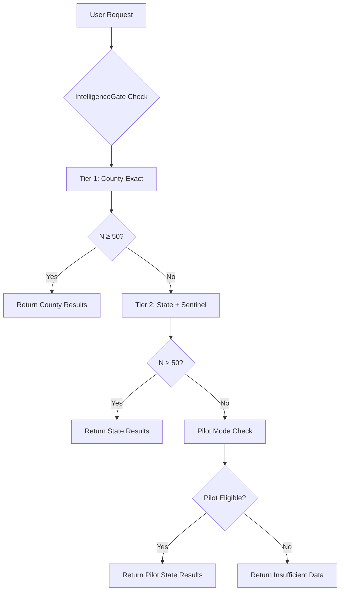
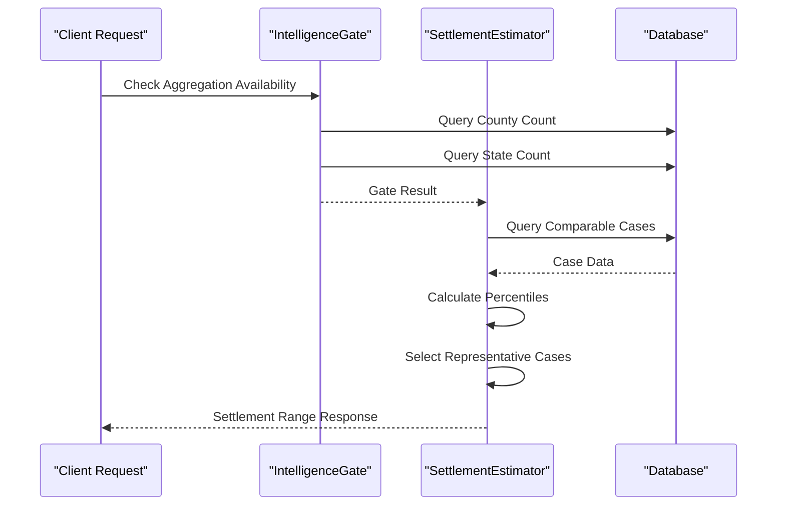
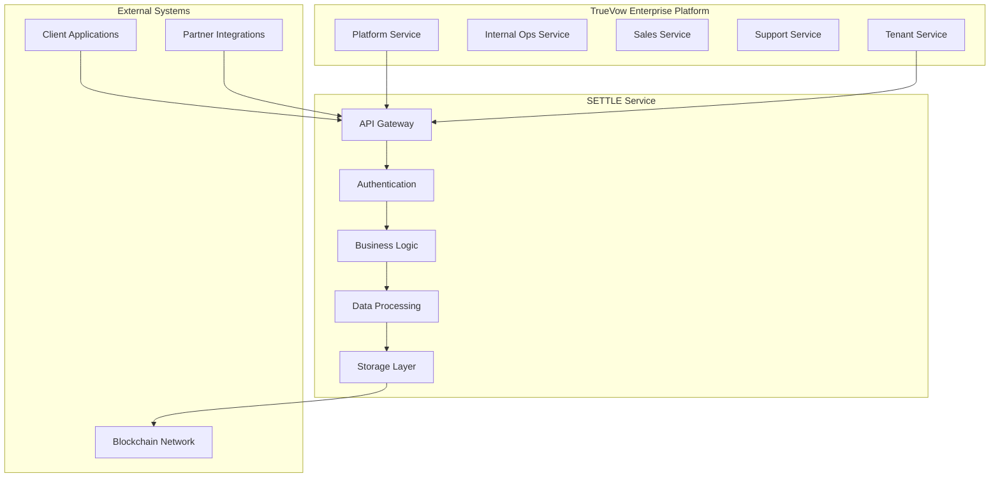
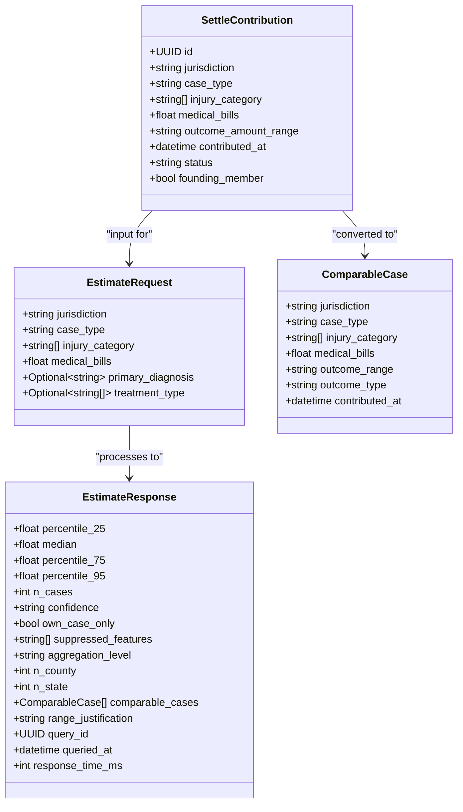
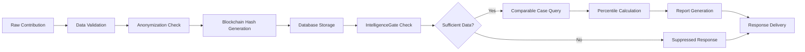
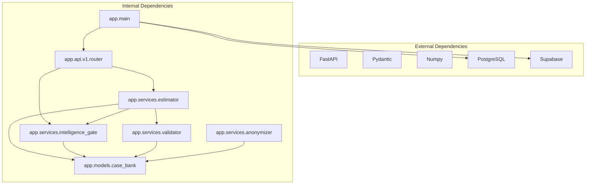

# IntelligenceGate Settlement Intelligence Engine

<cite>
**Referenced Files in This Document**
- [README.md](file://README.md)
- [app/main.py](file://app/main.py)
- [app/core/config.py](file://app/core/config.py)
- [app/api/v1/router.py](file://app/api/v1/router.py)
- [docs/API_DOCUMENTATION.md](file://docs/API_DOCUMENTATION.md)
- [app/services/estimator.py](file://app/services/estimator.py)
- [app/models/case_bank.py](file://app/models/case_bank.py)
- [app/api/v1/endpoints/query.py](file://app/api/v1/endpoints/query.py)
- [app/api/v1/endpoints/contribute.py](file://app/api/v1/endpoints/contribute.py)
- [app/services/intelligence_gate.py](file://app/services/intelligence_gate.py)
- [app/services/contributor.py](file://app/services/contributor.py)
- [app/services/anonymizer.py](file://app/services/anonymizer.py)
- [app/services/validator.py](file://app/services/validator.py)
</cite>

## Table of Contents
1. [Introduction](#introduction)
2. [Project Structure](#project-structure)
3. [Core Components](#core-components)
4. [Architecture Overview](#architecture-overview)
5. [Detailed Component Analysis](#detailed-component-analysis)
6. [Dependency Analysis](#dependency-analysis)
7. [Performance Considerations](#performance-considerations)
8. [Troubleshooting Guide](#troubleshooting-guide)
9. [Conclusion](#conclusion)

## Introduction

The IntelligenceGate Settlement Intelligence Engine is a sophisticated ethical settlement intelligence service designed to empower plaintiff attorneys with real-time settlement data for improved negotiation outcomes. Built as part of TrueVow's 5-service enterprise architecture, this centralized service provides instant settlement range estimates, anonymous case contribution capabilities, and blockchain-verified reporting.

The system operates on a revolutionary "Never Sell Empty Dashboards" principle, implementing a strict minimum aggregation threshold of 50 approved cases before displaying any comparative statistics. This approach ensures data quality while maintaining transparency about jurisdictional coverage limitations.

**Key Features:**
- ✅ 3-minute case entry form with zero PHI/PII collection
- ✅ Instant settlement range estimates (<1 second response time)
- ✅ County-specific comparable case analysis
- ✅ Bar-compliant design across all 50 states
- ✅ Blockchain verification using OpenTimestamps
- ✅ Founding Member program with lifetime free access
- ✅ Professional 4-page PDF report generation
- ✅ API-first design for seamless integration

## Project Structure

The IntelligenceGate service follows a clean, modular architecture organized around domain-driven principles:

**Diagram sources**
- [app/main.py:1-87](file://app/main.py#L1-L87)
- [app/api/v1/router.py:1-22](file://app/api/v1/router.py#L1-L22)

The service is structured into several key layers:

- **Application Layer**: FastAPI framework with comprehensive middleware and routing
- **Service Layer**: Business logic services for intelligence processing and data validation
- **Model Layer**: Pydantic-based data models ensuring type safety and validation
- **Infrastructure Layer**: Database connectivity, configuration management, and monitoring

**Section sources**
- [README.md:89-114](file://README.md#L89-L114)
- [app/main.py:46-66](file://app/main.py#L46-L66)

## Core Components

### IntelligenceGate - Credibility Enforcement System

The IntelligenceGate serves as the cornerstone of the settlement intelligence system, implementing the "Never Sell Empty Dashboards" policy through a hierarchical jurisdiction fallback mechanism.

**Key Functionality:**
- **Hierarchical Aggregation**: Checks county-exact matches first, then state-wide plus sentinel buckets
- **Minimum Threshold Enforcement**: Requires 50+ approved cases at each tier before enabling aggregate displays
- **Pilot Mode Support**: Specialized pathways for flagged pilot users with reduced thresholds
- **Feature Suppression**: Dynamically disables dashboard widgets when data is insufficient

**Algorithm Flow:**

**Diagram sources**
- [app/services/intelligence_gate.py:158-309](file://app/services/intelligence_gate.py#L158-L309)

### SettlementEstimator - Advanced Analytics Engine

The SettlementEstimator implements sophisticated percentile-based calculations with comprehensive jurisdictional fallback mechanisms.

**Advanced Features:**
- **Hierarchical Jurisdiction Routing**: County-exact vs state-wide aggregation based on gate decisions
- **Percentile Calculation Method**: 25th, median, 75th, and 95th percentile computations
- **Medical Bill Adjustment**: Proportional scaling when current case differs significantly from cohort
- **Confidence Scoring**: High (≥30 cases), medium (15-29 cases), and insufficient data states
- **Representative Case Selection**: Strategic sampling for report presentation

**Statistical Processing:**

**Diagram sources**
- [app/services/estimator.py:71-287](file://app/services/estimator.py#L71-L287)
- [app/services/intelligence_gate.py:158-309](file://app/services/intelligence_gate.py#L158-L309)

### Data Validation and Anonymization

The system implements comprehensive validation and anonymization processes to ensure bar-compliance and data integrity.

**Validation Layers:**
- **DataValidator**: Ensures correct formats, value ranges, and business logic constraints
- **AnonymizationValidator**: Prevents PHI/PII exposure through pattern matching and forbidden word detection
- **Compliance Checking**: Validates jurisdiction formats, drop-down selections, and ethical guidelines

**Section sources**
- [app/services/intelligence_gate.py:119-487](file://app/services/intelligence_gate.py#L119-L487)
- [app/services/estimator.py:32-734](file://app/services/estimator.py#L32-L734)
- [app/services/anonymizer.py:17-340](file://app/services/anonymizer.py#L17-L340)
- [app/services/validator.py:25-327](file://app/services/validator.py#L25-L327)

## Architecture Overview

The IntelligenceGate service operates within TrueVow's enterprise ecosystem as a centralized shared service:

**Diagram sources**
- [README.md:26-88](file://README.md#L26-L88)
- [app/main.py:15-32](file://app/main.py#L15-L32)

**Service Characteristics:**
- **Centralized Architecture**: Single database shared across all users
- **API-First Design**: Comprehensive RESTful API with OpenAPI documentation
- **Service-to-Service Integration**: Secure communication with other TrueVow services
- **Scalable Infrastructure**: Designed for high availability and performance

**Section sources**
- [README.md:75-88](file://README.md#L75-L88)
- [app/core/config.py:266-331](file://app/core/config.py#L266-L331)

## Detailed Component Analysis

### API Endpoint Architecture

The service exposes a comprehensive set of RESTful endpoints organized by functional domains:

**Public Endpoints:**
- `/api/v1/waitlist/join` - Waitlist management for founding members
- `/api/v1/stats/founding-members` - Public founding member statistics
- `/api/v1/stats/database` - Database growth and coverage metrics

**Authenticated Endpoints:**
- `/api/v1/query/estimate` - Settlement range estimation
- `/api/v1/contribute/submit` - Anonymous settlement data contribution
- `/api/v1/reports/generate` - Professional PDF report generation

**Admin Endpoints:**
- `/api/v1/admin/contributions/pending` - Pending contribution review
- `/api/v1/admin/founding-members` - Founding member management
- `/api/v1/admin/analytics/dashboard` - Administrative analytics

**Section sources**
- [docs/API_DOCUMENTATION.md:74-800](file://docs/API_DOCUMENTATION.md#L74-L800)
- [app/api/v1/router.py:10-21](file://app/api/v1/router.py#L10-L21)

### Data Model Architecture

The system employs a robust data model hierarchy ensuring type safety and comprehensive validation:

**Diagram sources**
- [app/models/case_bank.py:15-190](file://app/models/case_bank.py#L15-L190)

### Intelligence Processing Pipeline

The settlement intelligence processing follows a sophisticated pipeline ensuring accuracy and compliance:

**Diagram sources**
- [app/services/contributor.py:55-125](file://app/services/contributor.py#L55-L125)
- [app/services/estimator.py:71-287](file://app/services/estimator.py#L71-L287)

**Section sources**
- [app/models/case_bank.py:15-347](file://app/models/case_bank.py#L15-L347)
- [app/services/contributor.py:31-339](file://app/services/contributor.py#L31-L339)

## Dependency Analysis

The IntelligenceGate service maintains clean separation of concerns through well-defined dependencies:

**Diagram sources**
- [app/main.py:9-13](file://app/main.py#L9-L13)
- [app/api/v1/router.py:5-6](file://app/api/v1/router.py#L5-L6)

**Dependency Characteristics:**
- **Low Coupling**: Services are loosely coupled through well-defined interfaces
- **High Cohesion**: Each service focuses on a specific domain responsibility
- **Testable Architecture**: Clear separation enables comprehensive unit testing
- **Extensible Design**: Modular structure supports future enhancements

**Section sources**
- [app/core/config.py:9-32](file://app/core/config.py#L9-L32)
- [app/services/estimator.py:11-27](file://app/services/estimator.py#L11-L27)

## Performance Considerations

The IntelligenceGate service is optimized for high-performance settlement intelligence processing:

**Response Time Targets:**
- Settlement range estimation: <1 second (p95)
- Database queries: <500ms average
- Report generation: <2 seconds (PDF)

**Optimization Strategies:**
- **Hierarchical Query Strategy**: County-exact queries first, state fallback only when needed
- **Efficient Percentile Calculation**: Vectorized operations using NumPy
- **Connection Pooling**: Optimized database connections for concurrent requests
- **Caching Strategy**: IntelligenceGate results cached upstream by query cache service

**Scalability Features:**
- **Horizontal Scaling**: Stateless service design supports load balancing
- **Database Optimization**: Proper indexing on jurisdiction and case_type fields
- **Memory Management**: Efficient data structures for case comparison
- **Monitoring Integration**: Comprehensive logging and performance metrics

## Troubleshooting Guide

### Common Issues and Solutions

**IntelligenceGate Insufficient Data Responses:**
- **Cause**: Fewer than 50 approved cases in target jurisdiction
- **Solution**: Broaden case_type filters or wait for data accumulation
- **Prevention**: Monitor `n_county` and `n_state` fields in response

**Validation Errors:**
- **Common Patterns**: Invalid jurisdiction format, missing required fields
- **Resolution**: Ensure "County, ST" format and complete required fields
- **Debugging**: Check validation error messages for specific field issues

**Database Connectivity Issues:**
- **Symptoms**: IntelligenceGate failing closed with insufficient data
- **Diagnosis**: Verify DATABASE_URL configuration and connection status
- **Remediation**: Check network connectivity and database availability

**Performance Degradation:**
- **Indicators**: Response times exceeding targets
- **Investigation**: Monitor query execution plans and database load
- **Improvement**: Optimize indexes and consider query cache implementation

**Section sources**
- [app/services/intelligence_gate.py:182-199](file://app/services/intelligence_gate.py#L182-L199)
- [app/services/validator.py:286-325](file://app/services/validator.py#L286-L325)

## Conclusion

The IntelligenceGate Settlement Intelligence Engine represents a paradigm shift in legal technology, providing plaintiff attorneys with unprecedented access to reliable settlement data while maintaining the highest standards of ethical compliance and data protection. Through its innovative IntelligenceGate system, the service ensures that only credible, statistically significant data informs legal decision-making.

The modular architecture, comprehensive validation systems, and blockchain-verified reporting establish a foundation for trust and transparency in the legal profession. The service's commitment to bar-compliant design, with zero PHI collection and descriptive-only statistics, positions it as a responsible alternative to traditional legal research tools.

As the settlement intelligence database continues to grow, the IntelligenceGate system's hierarchical aggregation approach will enable increasingly precise local insights while maintaining the integrity of comparative analysis. The pilot mode capabilities demonstrate the system's adaptability to emerging needs in legal technology innovation.

This service stands as a testament to the power of ethical technology design, proving that legal innovation can advance without compromising professional standards or client confidentiality.