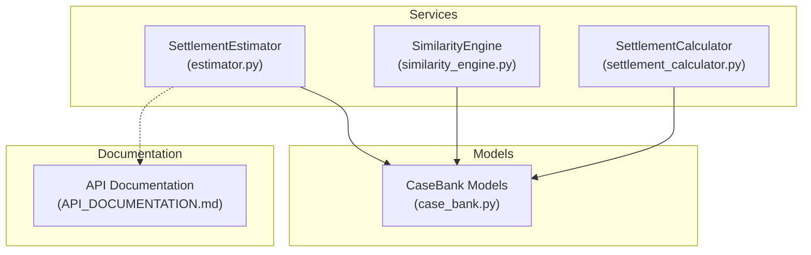
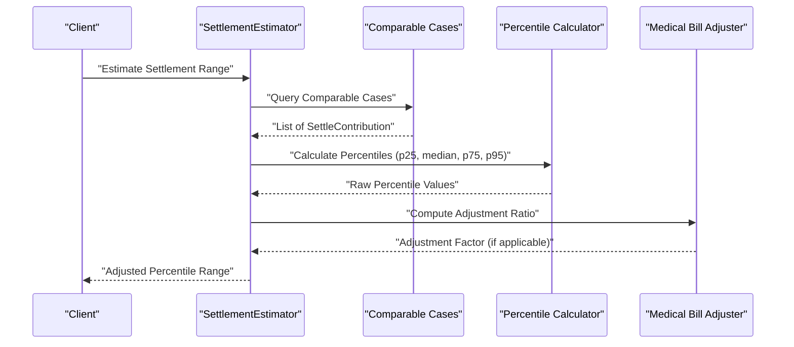
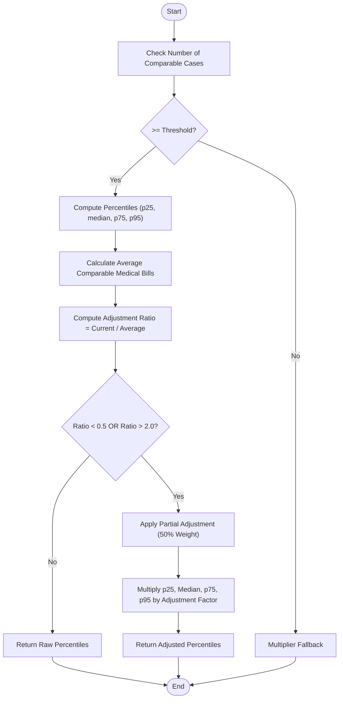
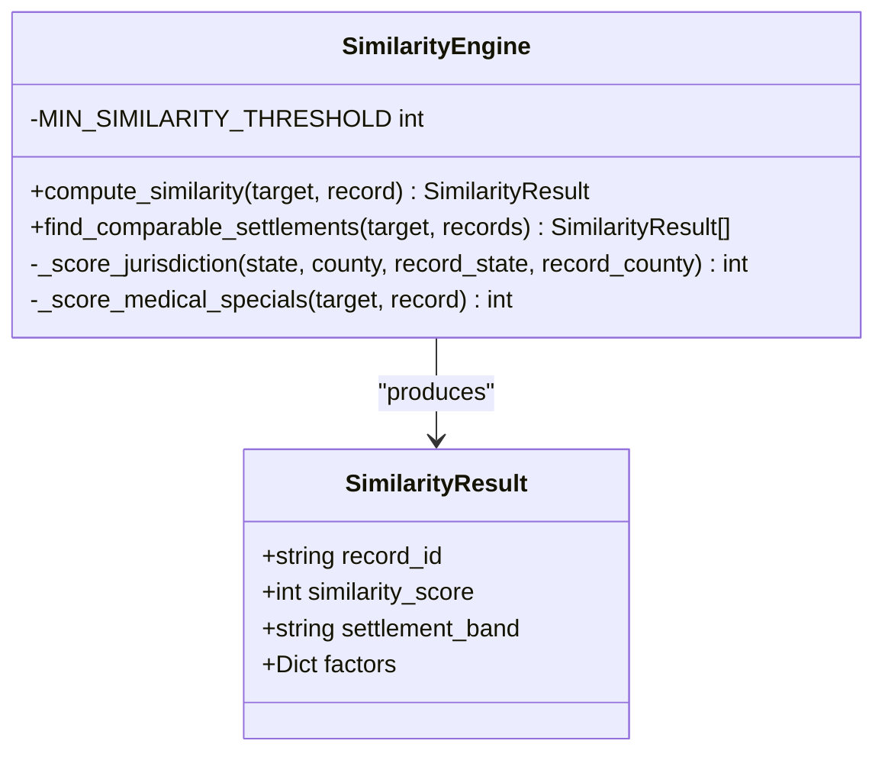
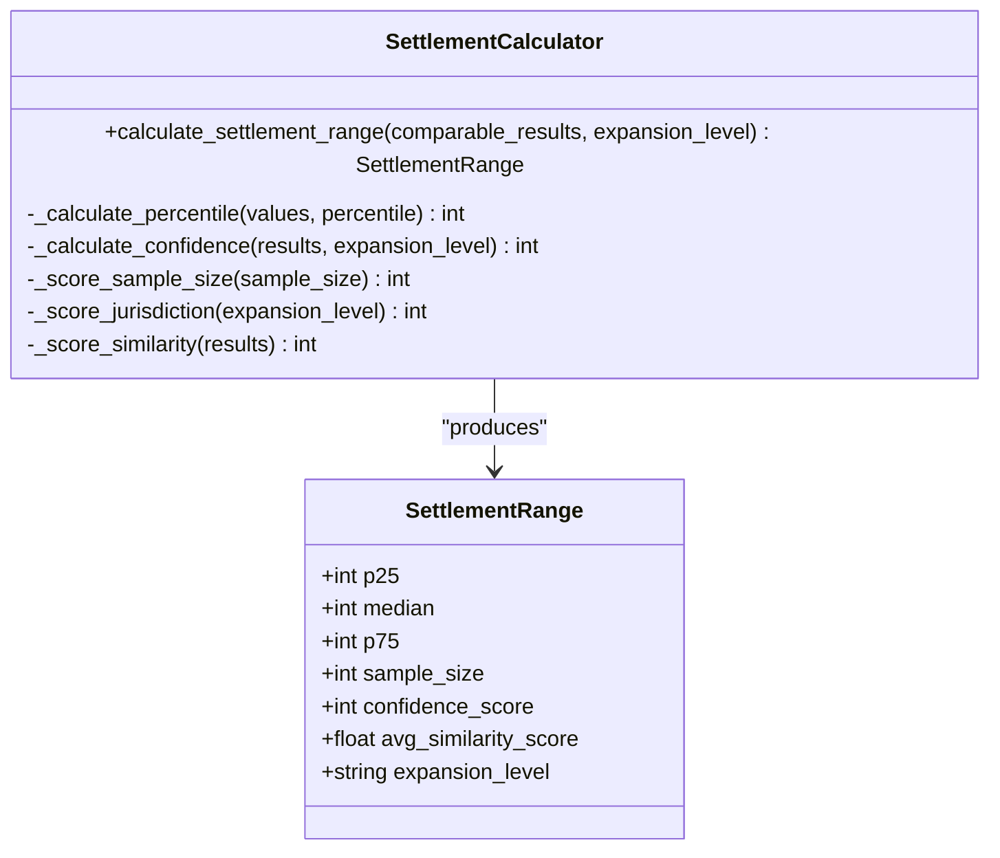
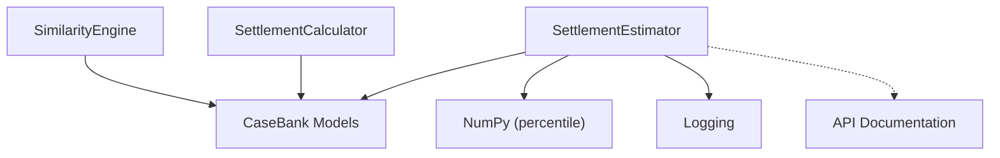

# Medical Bill Adjustment Algorithm

<cite>
**Referenced Files in This Document**
- [estimator.py](file://app/services/estimator.py)
- [similarity_engine.py](file://app/services/similarity_engine.py)
- [settlement_calculator.py](file://app/services/settlement_calculator.py)
- [case_bank.py](file://app/models/case_bank.py)
- [API_DOCUMENTATION.md](file://docs/API_DOCUMENTATION.md)
</cite>

## Table of Contents
1. [Introduction](#introduction)
2. [Project Structure](#project-structure)
3. [Core Components](#core-components)
4. [Architecture Overview](#architecture-overview)
5. [Detailed Component Analysis](#detailed-component-analysis)
6. [Dependency Analysis](#dependency-analysis)
7. [Performance Considerations](#performance-considerations)
8. [Troubleshooting Guide](#troubleshooting-guide)
9. [Conclusion](#conclusion)

## Introduction
This document explains the medical bill adjustment algorithm used to normalize settlement ranges when a case's medical expenses significantly differ from the comparable case pool. The algorithm calculates an adjustment ratio using the formula: current medical bills divided by the average comparable medical bills, with thresholds of less than 0.5 or greater than 2.0 triggering adjustments. When triggered, the algorithm applies a partial adjustment (50% weight) to all percentile values (p25, median, p75, p95) to maintain proportional relationships while accommodating individual case variations.

## Project Structure
The medical bill adjustment algorithm is implemented within the settlement estimation service alongside related components for similarity scoring and settlement calculation.

**Diagram sources**
- [estimator.py:1-443](file://app/services/estimator.py#L1-L443)
- [similarity_engine.py:1-441](file://app/services/similarity_engine.py#L1-L441)
- [settlement_calculator.py:1-257](file://app/services/settlement_calculator.py#L1-L257)
- [case_bank.py:1-269](file://app/models/case_bank.py#L1-L269)
- [API_DOCUMENTATION.md:175-231](file://docs/API_DOCUMENTATION.md#L175-L231)

**Section sources**
- [estimator.py:1-443](file://app/services/estimator.py#L1-L443)
- [similarity_engine.py:1-441](file://app/services/similarity_engine.py#L1-L441)
- [settlement_calculator.py:1-257](file://app/services/settlement_calculator.py#L1-L257)
- [case_bank.py:1-269](file://app/models/case_bank.py#L1-L269)
- [API_DOCUMENTATION.md:175-231](file://docs/API_DOCUMENTATION.md#L175-L231)

## Core Components
- SettlementEstimator: Implements the percentile-based calculation and applies the medical bill adjustment when the current case differs significantly from the comparable pool.
- SimilarityEngine: Provides similarity scoring for case matching and comparable case selection.
- SettlementCalculator: Computes percentile distributions and confidence scores for settlement ranges.
- CaseBank Models: Defines data structures for requests, responses, and comparable cases.

**Section sources**
- [estimator.py:25-443](file://app/services/estimator.py#L25-L443)
- [similarity_engine.py:188-441](file://app/services/similarity_engine.py#L188-L441)
- [settlement_calculator.py:41-209](file://app/services/settlement_calculator.py#L41-L209)
- [case_bank.py:15-139](file://app/models/case_bank.py#L15-L139)

## Architecture Overview
The settlement estimation pipeline integrates data collection, similarity matching, percentile calculation, and adjustment logic.

**Diagram sources**
- [estimator.py:60-116](file://app/services/estimator.py#L60-L116)
- [estimator.py:148-210](file://app/services/estimator.py#L148-L210)

## Detailed Component Analysis

### Medical Bill Adjustment Algorithm
The adjustment mechanism normalizes settlement ranges when the current case's medical bills significantly deviate from the comparable pool average.

**Diagram sources**
- [estimator.py:148-210](file://app/services/estimator.py#L148-L210)

#### Adjustment Ratio Calculation
- Formula: adjustment_ratio = current_medical_bills / average_comparable_medical_bills
- Thresholds: triggers when ratio < 0.5 or ratio > 2.0
- Rationale: detects cases with significantly lower or higher medical expenses compared to the pool

#### Partial Adjustment Mechanism
- Adjustment factor: adjustment_factor = 1.0 + (adjustment_ratio - 1.0) × 0.5
- Effect: scales percentile values proportionally while limiting the magnitude of change
- Purpose: maintains statistical validity while accommodating individual case variations

#### Mathematical Transformation
- All percentile values (p25, median, p75, p95) undergo the same proportional transformation
- Maintains the relative spacing between percentiles
- Preserves the shape of the distribution curve

**Section sources**
- [estimator.py:179-193](file://app/services/estimator.py#L179-L193)

### Example Scenarios

#### Scenario A: Significantly Higher Medical Expenses
- Current case: $200,000 medical bills
- Pool average: $100,000
- Ratio: 2.0
- Adjustment: 50% upward scaling of all percentiles
- Result: Distribution shifts upward while preserving shape

#### Scenario B: Significantly Lower Medical Expenses  
- Current case: $25,000 medical bills
- Pool average: $100,000
- Ratio: 0.25
- Adjustment: 50% downward scaling of all percentiles
- Result: Distribution shifts downward while preserving shape

#### Scenario C: Within Normal Range
- Current case: $75,000 medical bills
- Pool average: $100,000
- Ratio: 0.75
- Adjustment: No change (threshold not met)
- Result: Raw percentiles returned unchanged

**Section sources**
- [estimator.py:183-192](file://app/services/estimator.py#L183-L192)

### Related Components

#### Similarity Engine Integration
The similarity engine identifies comparable cases used in percentile calculations.

**Diagram sources**
- [similarity_engine.py:188-418](file://app/services/similarity_engine.py#L188-L418)

#### Settlement Calculator Integration
The settlement calculator computes percentile distributions and confidence scores.

**Diagram sources**
- [settlement_calculator.py:41-209](file://app/services/settlement_calculator.py#L41-L209)

**Section sources**
- [similarity_engine.py:188-418](file://app/services/similarity_engine.py#L188-L418)
- [settlement_calculator.py:41-209](file://app/services/settlement_calculator.py#L41-L209)

## Dependency Analysis
The medical bill adjustment algorithm depends on:
- Comparable case selection and similarity scoring
- Percentile calculation from settlement amounts
- Confidence scoring for result reliability

**Diagram sources**
- [estimator.py:10-22](file://app/services/estimator.py#L10-L22)
- [similarity_engine.py:10-15](file://app/services/similarity_engine.py#L10-L15)
- [settlement_calculator.py:8-18](file://app/services/settlement_calculator.py#L8-L18)
- [API_DOCUMENTATION.md:175-231](file://docs/API_DOCUMENTATION.md#L175-L231)

**Section sources**
- [estimator.py:10-22](file://app/services/estimator.py#L10-L22)
- [similarity_engine.py:10-15](file://app/services/similarity_engine.py#L10-L15)
- [settlement_calculator.py:8-18](file://app/services/settlement_calculator.py#L8-L18)
- [API_DOCUMENTATION.md:175-231](file://docs/API_DOCUMENTATION.md#L175-L231)

## Performance Considerations
- The adjustment computation is O(n) where n is the number of comparable cases
- NumPy percentile calculations are efficient for typical sample sizes
- Confidence scoring adds minimal overhead
- Database queries for comparable cases are the primary performance bottleneck

## Troubleshooting Guide
Common issues and resolutions:
- Zero or negative average medical bills: The algorithm checks for positive averages before computing ratios
- Insufficient comparable cases: Falls back to multiplier-based ranges when below threshold
- Extreme outliers: The 50% partial adjustment prevents extreme distortions
- Confidence scoring: Ensure sufficient comparable cases for high-confidence results

**Section sources**
- [estimator.py:182-183](file://app/services/estimator.py#L182-L183)
- [estimator.py:79-90](file://app/services/estimator.py#L79-L90)

## Conclusion
The medical bill adjustment algorithm provides a robust mechanism to normalize settlement ranges while preserving statistical validity. By applying proportional adjustments with 50% weighting, it accommodates individual case variations without distorting the underlying distribution shape. The algorithm complements the broader settlement estimation system by ensuring fair comparisons across diverse medical expense scenarios.