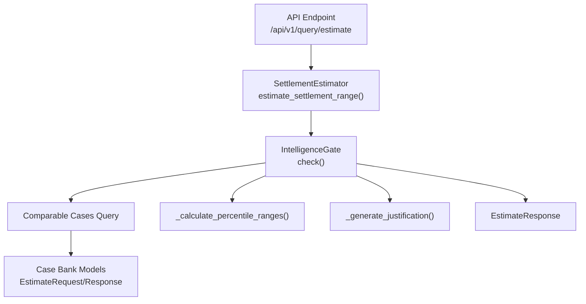
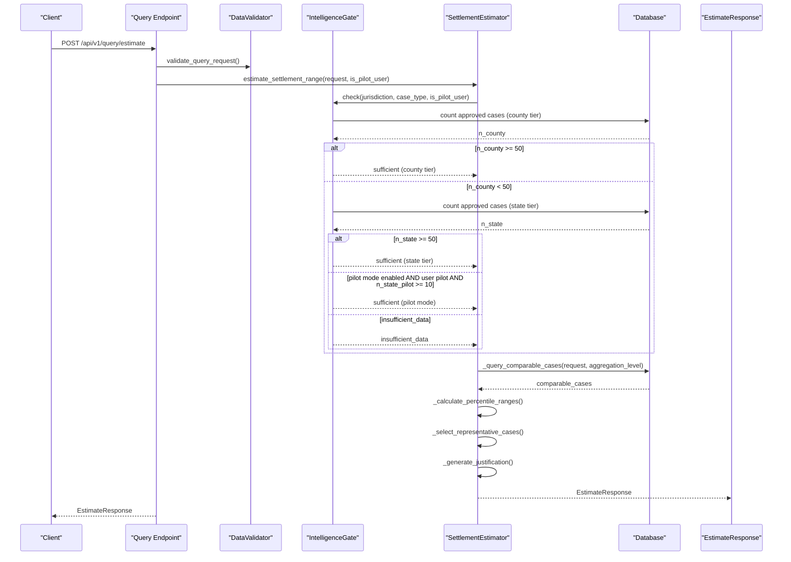
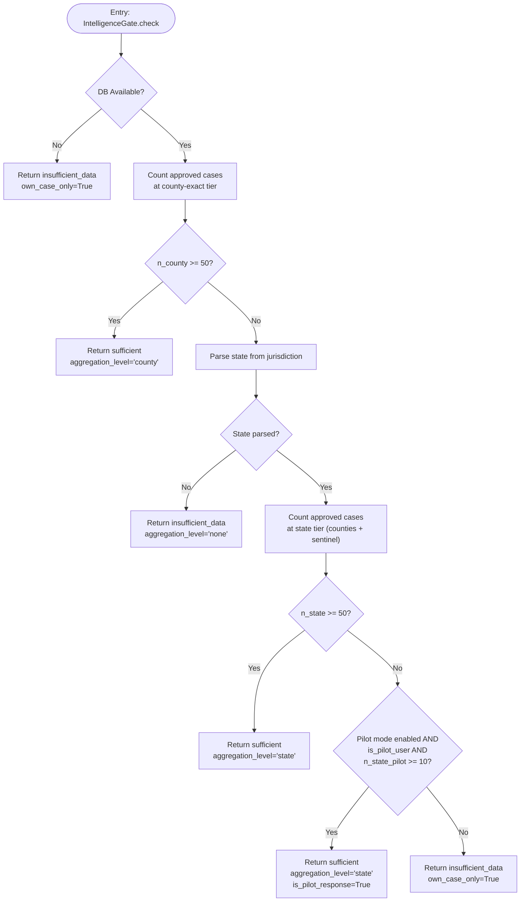
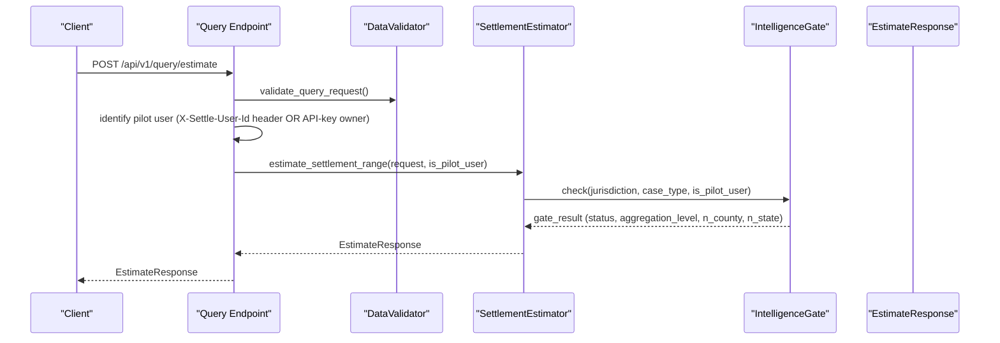
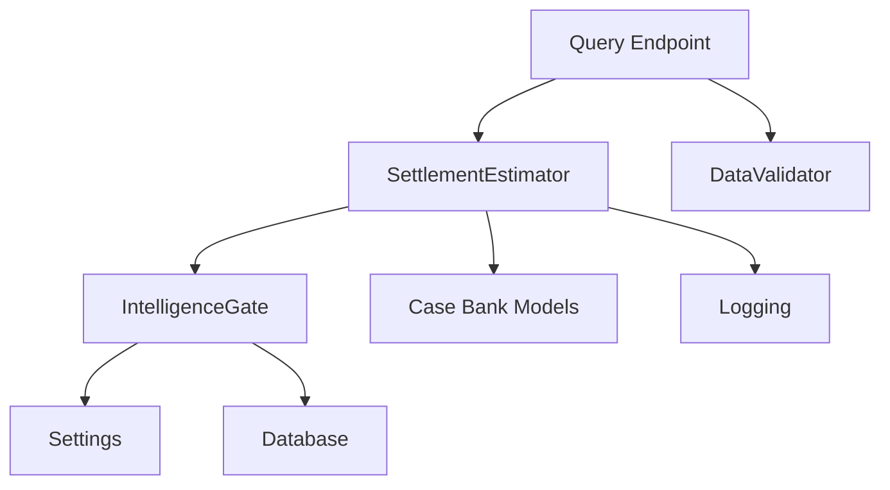

# Multiplier Fallback System

<cite>
**Referenced Files in This Document**
- [estimator.py](file://app/services/estimator.py)
- [intelligence_gate.py](file://app/services/intelligence_gate.py)
- [case_bank.py](file://app/models/case_bank.py)
- [query.py](file://app/api/v1/endpoints/query.py)
- [config.py](file://app/core/config.py)
- [TESTING_GUIDE.md](file://docs/TESTING_GUIDE.md)
</cite>

## Update Summary
**Changes Made**
- Complete replacement of the old Multiplier Fallback System with IntelligenceGate
- Updated to reflect new 'Never Sell Empty Dashboards' principle with MIN_AGGREGATE_N threshold of 50
- Removed all references to multiplier fallback, 95th percentile calculations, and case count thresholds
- Added comprehensive documentation for the new IntelligenceGate system
- Updated confidence scoring to be based solely on gate sufficiency
- Added pilot mode functionality with reduced thresholds (10 for pilot vs 50 for production)

## Table of Contents
1. [Introduction](#introduction)
2. [Project Structure](#project-structure)
3. [Core Components](#core-components)
4. [Architecture Overview](#architecture-overview)
5. [Detailed Component Analysis](#detailed-component-analysis)
6. [Dependency Analysis](#dependency-analysis)
7. [Performance Considerations](#performance-considerations)
8. [Troubleshooting Guide](#troubleshooting-guide)
9. [Conclusion](#conclusion)

## Introduction
This document explains the IntelligenceGate system that replaced the old Multiplier Fallback System in the Settlement Estimator. The new system enforces the "Never Sell Empty Dashboards" principle with a hard credibility floor of MIN_AGGREGATE_N = 50 approved cases. When insufficient comparable cases are available, the system returns a suppressed response rather than attempting to synthesize estimates from sub-threshold data. The system now uses a hierarchical jurisdiction fallback (county → state → none) and provides pilot mode functionality for limited data scenarios.

## Project Structure
The IntelligenceGate system resides in the Settlement Estimator service and interacts with the IntelligenceGate service, API endpoints, data models, and configuration settings.

**Diagram sources**
- [query.py:20-98](file://app/api/v1/endpoints/query.py#L20-L98)
- [estimator.py:60-116](file://app/services/estimator.py#L60-L116)
- [intelligence_gate.py:158-309](file://app/services/intelligence_gate.py#L158-L309)
- [case_bank.py:69-139](file://app/models/case_bank.py#L69-L139)

**Section sources**
- [query.py:20-98](file://app/api/v1/endpoints/query.py#L20-L98)
- [estimator.py:60-116](file://app/services/estimator.py#L60-L116)
- [intelligence_gate.py:158-309](file://app/services/intelligence_gate.py#L158-L309)
- [case_bank.py:69-139](file://app/models/case_bank.py#L69-L139)

## Core Components
- **IntelligenceGate with Never Sell Empty Dashboards Principle**:
  - Hard credibility floor: MIN_AGGREGATE_N = 50 approved cases required
  - Hierarchical fallback: county tier → state tier → none (insufficient data)
  - Own-case-only mode: when insufficient data, UI renders only user's own case
- **Suppressed Features**: Dashboard widgets that must be hidden when own_case_only=True
- **Pilot Mode Functionality**:
  - Reduced thresholds: PILOT_MIN_AGGREGATE_N = 10, PILOT_NARRATIVE_FLOOR = 5
  - Pilot eligibility: only for explicitly enrolled pilot users
  - State-tier fallback with sentinel exclusion and narrative quality filtering
- **Confidence Scoring**:
  - `insufficient_data` — gate floor not met
  - `high` — gate passed AND n >= 30 (production-reachable)
  - `medium` — gate passed AND n < 30 (only reachable under pilot mode)

**Section sources**
- [intelligence_gate.py:42-58](file://app/services/intelligence_gate.py#L42-L58)
- [intelligence_gate.py:119-132](file://app/services/intelligence_gate.py#L119-L132)
- [estimator.py:53-57](file://app/services/estimator.py#L53-L57)
- [estimator.py:104-134](file://app/services/estimator.py#L104-L134)

## Architecture Overview
The system orchestrates a request through the API endpoint into the IntelligenceGate service, which enforces the credibility floor and determines aggregation level. The estimator then either returns a suppressed response or proceeds with percentile-based calculation using the appropriate aggregation tier.

**Diagram sources**
- [query.py:20-98](file://app/api/v1/endpoints/query.py#L20-L98)
- [estimator.py:60-116](file://app/services/estimator.py#L60-L116)
- [intelligence_gate.py:158-309](file://app/services/intelligence_gate.py#L158-L309)
- [estimator.py:118-146](file://app/services/estimator.py#L118-L146)
- [estimator.py:148-210](file://app/services/estimator.py#L148-L210)
- [estimator.py:212-262](file://app/services/estimator.py#L212-L262)

## Detailed Component Analysis

### IntelligenceGate Algorithm
The IntelligenceGate enforces the Never Sell Empty Dashboards principle with a hard credibility floor of 50 approved cases. It implements hierarchical fallback and pilot mode functionality.

**Diagram sources**
- [intelligence_gate.py:158-309](file://app/services/intelligence_gate.py#L158-L309)

**Section sources**
- [intelligence_gate.py:158-309](file://app/services/intelligence_gate.py#L158-L309)

### IntelligenceGate Constants and Configuration
The system uses configurable constants for thresholds and pilot mode settings.

**Section sources**
- [intelligence_gate.py:42-45](file://app/services/intelligence_gate.py#L42-L45)
- [intelligence_gate.py:126-131](file://app/services/intelligence_gate.py#L126-L131)
- [config.py:241-250](file://app/core/config.py#L241-L250)

### Confidence Scoring and Thresholds
Confidence levels are assigned based on gate sufficiency rather than case counts:
- `insufficient_data` — gate floor not met (own_case_only=True)
- `high` — gate passed AND n >= 30 (production-reachable)
- `medium` — gate passed AND n < 30 (only reachable under pilot mode)

The estimator sets confidence accordingly and generates a justification that reflects the chosen method and sample size.

**Section sources**
- [estimator.py:44-49](file://app/services/estimator.py#L44-L49)
- [estimator.py:79-90](file://app/services/estimator.py#L79-L90)
- [estimator.py:194-209](file://app/services/estimator.py#L194-L209)
- [estimator.py:345-388](file://app/services/estimator.py#L345-L388)

### API Integration and Request Flow
The API endpoint validates the request, identifies pilot users, initializes the estimator with pilot mode awareness, and returns an EstimateResponse containing percentile ranges, confidence, comparable cases, and justification text. It also handles pilot mode user identification and feature flag checking.

**Diagram sources**
- [query.py:20-98](file://app/api/v1/endpoints/query.py#L20-L98)
- [estimator.py:60-116](file://app/services/estimator.py#L60-L116)
- [intelligence_gate.py:158-309](file://app/services/intelligence_gate.py#L158-L309)

**Section sources**
- [query.py:20-98](file://app/api/v1/endpoints/query.py#L20-L98)
- [estimator.py:60-116](file://app/services/estimator.py#L60-L116)
- [query.py:110-115](file://app/api/v1/endpoints/query.py#L110-L115)

### Data Models and Response Structure
The EstimateResponse includes statistical ranges, metadata, comparable cases, and justification text. The EstimateRequest defines the input parameters used to trigger the IntelligenceGate evaluation.

**Section sources**
- [case_bank.py:110-139](file://app/models/case_bank.py#L110-L139)
- [case_bank.py:69-93](file://app/models/case_bank.py#L69-L93)

## Dependency Analysis
The estimator depends on:
- IntelligenceGate service for credibility enforcement
- Data models for request/response validation
- Database connectivity for querying comparable cases
- Configuration settings for pilot mode parameters
- Logging for warnings and informational messages

**Diagram sources**
- [estimator.py:15-20](file://app/services/estimator.py#L15-L20)
- [query.py:58-76](file://app/api/v1/endpoints/query.py#L58-L76)
- [intelligence_gate.py:150-156](file://app/services/intelligence_gate.py#L150-L156)

**Section sources**
- [estimator.py:15-20](file://app/services/estimator.py#L15-L20)
- [query.py:58-76](file://app/api/v1/endpoints/query.py#L58-L76)
- [intelligence_gate.py:150-156](file://app/services/intelligence_gate.py#L150-L156)

## Performance Considerations
- Response time targets are under 1 second for p95 percentile.
- IntelligenceGate performs efficient database counts with minimal overhead.
- Representative case selection ensures reports remain useful even with limited data.
- Pilot mode introduces additional filtering complexity but maintains performance targets.

## Troubleshooting Guide
Common scenarios and resolutions:
- **Insufficient comparable cases (<50)**: The IntelligenceGate returns insufficient_data with own_case_only=True. The system automatically suppresses aggregate widgets and renders only the user's own case data.
- **Pilot mode not activating**: Verify SETTLE_PILOT_MODE is True, user_id is in SETTLE_PILOT_USER_IDS, and state-tier pilot-eligible count meets the reduced threshold of 10.
- **Unexpected confidence level**: Confirm the IntelligenceGate status and n_county/n_state values meet the thresholds.
- **Incorrect aggregation level**: Verify the jurisdiction format follows "County, ST" and state parsing succeeds.

**Section sources**
- [estimator.py:79-90](file://app/services/estimator.py#L79-L90)
- [estimator.py:258-262](file://app/services/estimator.py#L258-L262)
- [intelligence_gate.py:206-209](file://app/services/intelligence_gate.py#L206-L209)
- [intelligence_gate.py:249-252](file://app/services/intelligence_gate.py#L249-L252)

## Conclusion
The IntelligenceGate system provides a robust, hard-credibility approach to settlement range estimation that prevents the synthesis of unreliable estimates from insufficient data. By enforcing MIN_AGGREGATE_N = 50 approved cases and implementing hierarchical fallback, the system maintains data quality while providing transparent governance. The "Never Sell Empty Dashboards" principle ensures attorneys receive meaningful insights rather than potentially misleading estimates. Pilot mode functionality enables limited data scenarios for vetted users while preserving production guarantees. Confidence scoring now reflects gate sufficiency rather than arbitrary case counts, providing clearer communication of data quality and reliability.