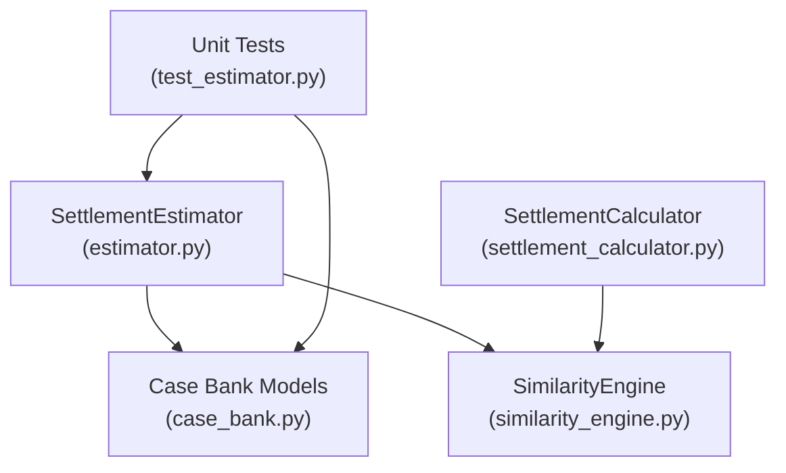
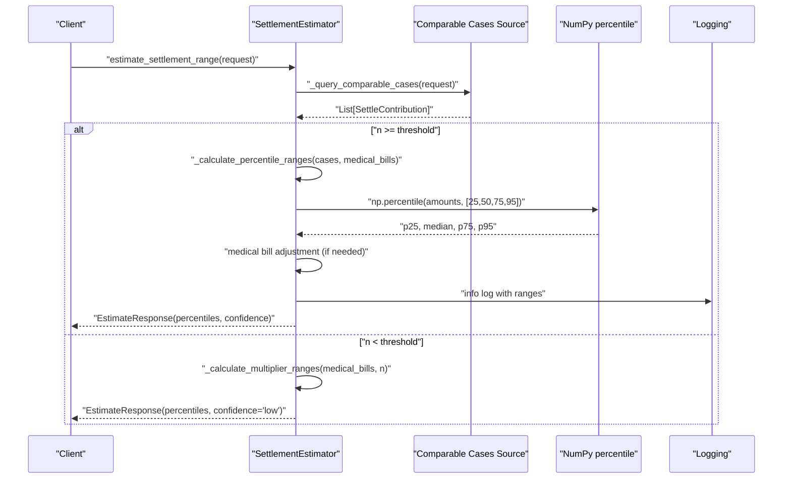
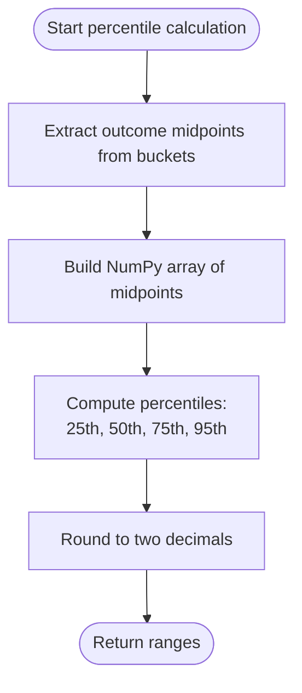
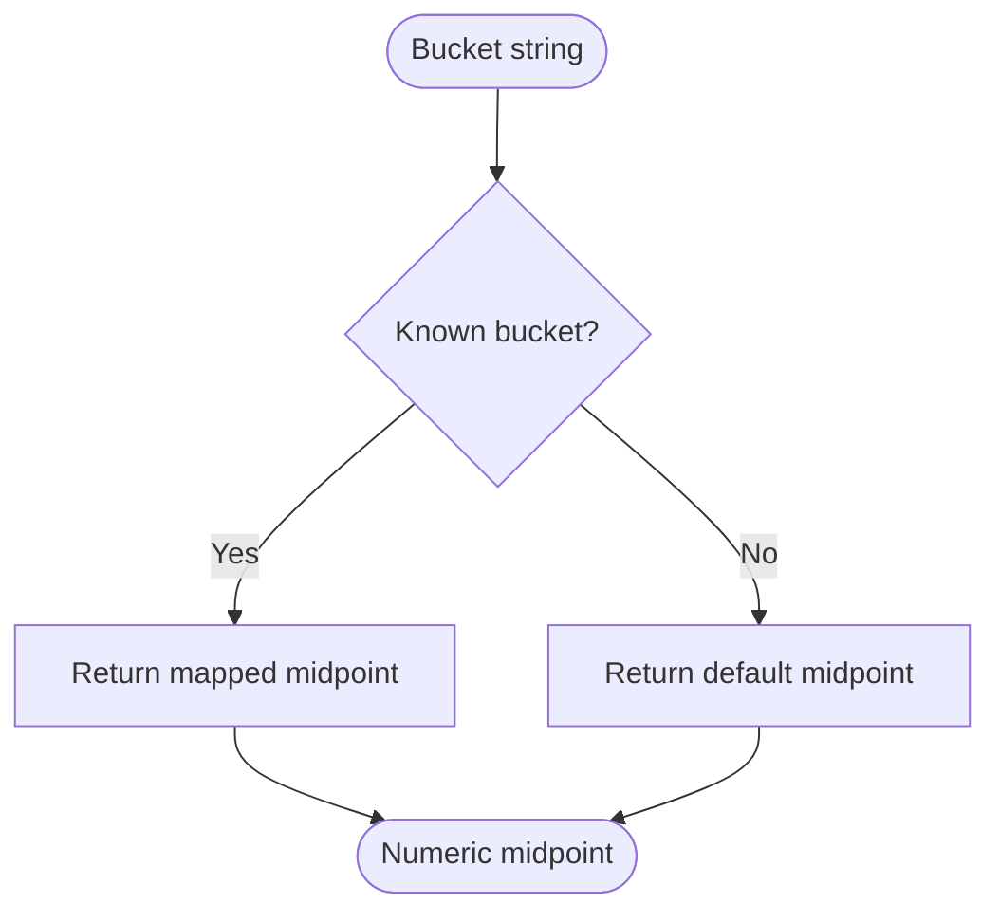
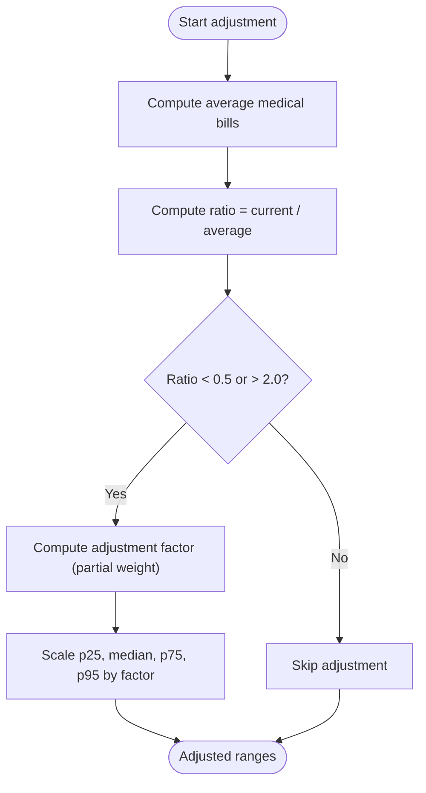
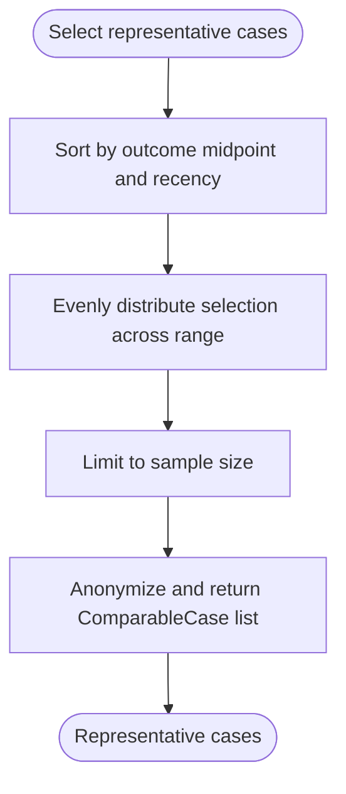
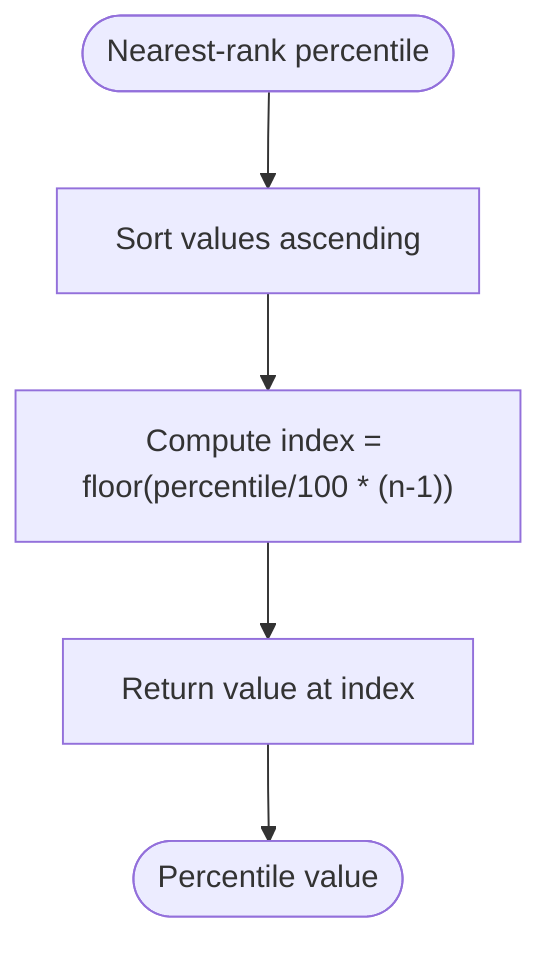
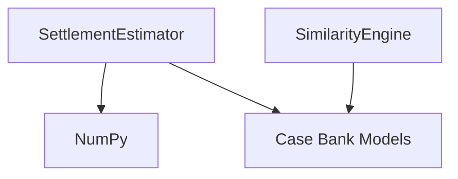

# Percentile Calculation Algorithm

<cite>
**Referenced Files in This Document**
- [estimator.py](file://app/services/estimator.py)
- [settlement_calculator.py](file://app/services/settlement_calculator.py)
- [similarity_engine.py](file://app/services/similarity_engine.py)
- [case_bank.py](file://app/models/case_bank.py)
- [test_estimator.py](file://tests/test_estimator.py)
</cite>

## Table of Contents
1. [Introduction](#introduction)
2. [Project Structure](#project-structure)
3. [Core Components](#core-components)
4. [Architecture Overview](#architecture-overview)
5. [Detailed Component Analysis](#detailed-component-analysis)
6. [Dependency Analysis](#dependency-analysis)
7. [Performance Considerations](#performance-considerations)
8. [Troubleshooting Guide](#troubleshooting-guide)
9. [Conclusion](#conclusion)

## Introduction
This document explains the percentile calculation algorithm component of the Settlement Intelligence Engine. It covers:
- Mathematical foundations for computing the 25th, median (50th), 75th, and 95th percentiles using NumPy’s percentile function.
- Bucket-to-midpoint conversion for outcome amount ranges, including conservative estimates for “$1M+” buckets.
- Medical bill adjustment algorithm that applies proportional adjustments when the current case’s medical bills differ significantly from the average (thresholds of less than 0.5 or greater than 2.0 ratios).
- Implementation examples showing how the algorithm processes different case distributions, handles edge cases with small sample sizes, and maintains numerical precision.
- Performance considerations and optimization techniques for large datasets.

## Project Structure
The percentile calculation algorithm resides primarily in the estimator service and interacts with supporting modules for similarity scoring and data models.

**Diagram sources**
- [estimator.py:60-116](file://app/services/estimator.py#L60-L116)
- [settlement_calculator.py:57-103](file://app/services/settlement_calculator.py#L57-L103)
- [similarity_engine.py:188-418](file://app/services/similarity_engine.py#L188-L418)
- [case_bank.py:15-139](file://app/models/case_bank.py#L15-L139)
- [test_estimator.py:13-102](file://tests/test_estimator.py#L13-L102)

**Section sources**
- [estimator.py:60-116](file://app/services/estimator.py#L60-L116)
- [settlement_calculator.py:57-103](file://app/services/settlement_calculator.py#L57-L103)
- [similarity_engine.py:188-418](file://app/services/similarity_engine.py#L188-L418)
- [case_bank.py:15-139](file://app/models/case_bank.py#L15-L139)
- [test_estimator.py:13-102](file://tests/test_estimator.py#L13-L102)

## Core Components
- SettlementEstimator: Implements the percentile-based algorithm, bucket-to-midpoint conversion, and medical bill adjustment. It selects representative comparable cases and generates a justification for the estimate.
- SettlementCalculator: Alternative calculator that computes percentiles using a nearest-rank method and confidence scoring based on sample size, jurisdiction match, and average similarity.
- SimilarityEngine: Provides settlement band midpoint conversion utilities used by SettlementCalculator.
- Case Bank Models: Define data structures for requests, responses, and comparable case samples.

Key responsibilities:
- Percentile computation using NumPy for robust handling of large arrays.
- Bucket-to-midpoint mapping with conservative estimates for “$1M+”.
- Proportional adjustment of percentile ranges when current medical bills significantly differ from the average.
- Confidence assignment based on sample size thresholds.

**Section sources**
- [estimator.py:25-59](file://app/services/estimator.py#L25-L59)
- [settlement_calculator.py:41-56](file://app/services/settlement_calculator.py#L41-L56)
- [similarity_engine.py:425-440](file://app/services/similarity_engine.py#L425-L440)
- [case_bank.py:69-139](file://app/models/case_bank.py#L69-L139)

## Architecture Overview
The percentile calculation algorithm follows a two-tier approach:
- Percentile method: Used when sufficient comparable cases are available.
- Multiplier fallback: Used when sample sizes are small.

**Diagram sources**
- [estimator.py:60-116](file://app/services/estimator.py#L60-L116)
- [estimator.py:148-210](file://app/services/estimator.py#L148-L210)
- [estimator.py:212-262](file://app/services/estimator.py#L212-L262)

## Detailed Component Analysis

### Percentile Calculation with NumPy
The estimator computes the 25th, median (50th), 75th, and 95th percentiles using NumPy’s percentile function on an array of outcome amount midpoints derived from bucketed ranges.

Implementation highlights:
- Outcome amount extraction: Converts each case’s outcome amount range to a midpoint value using a predefined mapping.
- Array construction: Builds a NumPy array of midpoints for efficient percentile computation.
- Percentile computation: Calls NumPy’s percentile for 25, 50, 75, and 95 percentiles.
- Rounding: Rounds results to two decimal places for currency representation.

**Diagram sources**
- [estimator.py:169-177](file://app/services/estimator.py#L169-L177)
- [estimator.py:201-206](file://app/services/estimator.py#L201-L206)

**Section sources**
- [estimator.py:169-177](file://app/services/estimator.py#L169-L177)
- [estimator.py:201-206](file://app/services/estimator.py#L201-L206)

### Bucket-to-Midpoint Conversion
Outcome amount ranges are mapped to numeric midpoints for percentile computation. The conversion includes conservative estimates for the highest bucket.

Mapping details:
- Buckets: “$0–$50k”, “$50k–$100k”, “$100k–$150k”, “$150k–$225k”, “$225k–$300k”, “$300k–$600k”, “$600k–$1M”, “$1M+”
- Conservative estimate: “$1M+” mapped to a midpoint value to reflect upper bound while maintaining numerical stability.

Edge cases:
- Unknown buckets default to a safe midpoint to prevent invalid computations.

**Diagram sources**
- [estimator.py:264-289](file://app/services/estimator.py#L264-L289)

**Section sources**
- [estimator.py:264-289](file://app/services/estimator.py#L264-L289)

### Medical Bill Adjustment Algorithm
When the current case’s medical bills significantly differ from the average among comparable cases, the algorithm applies a proportional adjustment to the computed percentiles.

Adjustment logic:
- Compute average medical bills across comparable cases.
- Calculate the ratio of current medical bills to average.
- If the ratio is below 0.5 or above 2.0, apply a partial adjustment (50% weighting) to all percentiles.
- The adjustment factor is derived from the ratio to proportionally scale the percentiles.

**Diagram sources**
- [estimator.py:182-192](file://app/services/estimator.py#L182-L192)

**Section sources**
- [estimator.py:182-192](file://app/services/estimator.py#L182-L192)

### Confidence Assignment and Representative Case Selection
Confidence levels are assigned based on sample size thresholds:
- High: 30+ cases
- Medium: 15–29 cases
- Low: fewer than 15 cases (fallback to multipliers)

Representative comparable cases are selected to include across the settlement range and prioritize recency.

**Diagram sources**
- [estimator.py:291-343](file://app/services/estimator.py#L291-L343)

**Section sources**
- [estimator.py:194-199](file://app/services/estimator.py#L194-L199)
- [estimator.py:291-343](file://app/services/estimator.py#L291-L343)

### Alternative Calculator: Nearest-Rank Method
SettlementCalculator computes percentiles using a nearest-rank method on a sorted list of settlement band midpoints. It also calculates a confidence score based on sample size, jurisdiction match, and average similarity.

**Diagram sources**
- [settlement_calculator.py:105-115](file://app/services/settlement_calculator.py#L105-L115)
- [similarity_engine.py:435-440](file://app/services/similarity_engine.py#L435-L440)

**Section sources**
- [settlement_calculator.py:105-115](file://app/services/settlement_calculator.py#L105-L115)
- [similarity_engine.py:425-440](file://app/services/similarity_engine.py#L425-L440)

## Dependency Analysis
The percentile calculation algorithm depends on:
- NumPy for efficient percentile computation.
- Case bank models for request/response structures and comparable case data.
- Similarity engine utilities for settlement band midpoint conversions in the alternative calculator.

**Diagram sources**
- [estimator.py:10](file://app/services/estimator.py#L10)
- [case_bank.py:15-139](file://app/models/case_bank.py#L15-L139)
- [similarity_engine.py:13-16](file://app/services/similarity_engine.py#L13-L16)

**Section sources**
- [estimator.py:10](file://app/services/estimator.py#L10)
- [case_bank.py:15-139](file://app/models/case_bank.py#L15-L139)
- [similarity_engine.py:13-16](file://app/services/similarity_engine.py#L13-L16)

## Performance Considerations
- NumPy percentile: Efficiently computes multiple percentiles in a single pass over the data, minimizing overhead for large arrays.
- Early exit conditions: Confidence thresholds and representative case selection reduce unnecessary computation when sample sizes are small.
- Representative sampling: Evenly distributing selected cases across the settlement range reduces bias and improves interpretability without excessive overhead.
- Response time targets: Unit tests enforce sub-second response times for typical workloads.

Optimization techniques:
- Precompute midpoints once per case set to avoid repeated conversions.
- Use vectorized operations (NumPy) for percentile calculations.
- Limit representative case selection to a fixed number to cap post-processing cost.
- Consider caching frequently accessed bucket mappings if reused across requests.

[No sources needed since this section provides general guidance]

## Troubleshooting Guide
Common issues and resolutions:
- Empty or insufficient comparable cases:
  - Use the multiplier fallback path when sample size is below the threshold.
  - Verify that the query logic retrieves cases within acceptable jurisdiction and similarity bounds.
- Unexpected percentile ordering:
  - Ensure bucket-to-midpoint mapping is consistent and that “$1M+” uses a conservative estimate.
  - Confirm that NumPy percentile is invoked with the correct percentiles and that rounding does not introduce unintended ties.
- Medical bill adjustment anomalies:
  - Validate that the average medical bills is greater than zero before computing the ratio.
  - Confirm that the adjustment factor is derived from the ratio and applied uniformly to all percentiles.
- Numerical precision:
  - Round results to two decimal places for currency display.
  - For extremely large datasets, consider using higher-precision data types if necessary, though NumPy’s default double precision is generally sufficient.

**Section sources**
- [estimator.py:182-192](file://app/services/estimator.py#L182-L192)
- [estimator.py:264-289](file://app/services/estimator.py#L264-L289)
- [estimator.py:201-206](file://app/services/estimator.py#L201-L206)
- [test_estimator.py:84-102](file://tests/test_estimator.py#L84-L102)

## Conclusion
The percentile calculation algorithm combines robust statistical computation with practical safeguards for real-world case data. By converting outcome buckets to midpoints, leveraging NumPy for efficient percentile computation, and applying proportional adjustments based on medical bills, the system produces reliable settlement range estimates. Representative case selection and confidence scoring ensure transparency and interpretability. The alternative nearest-rank method provides a deterministic fallback for small sample sizes, while performance optimizations keep response times predictable.