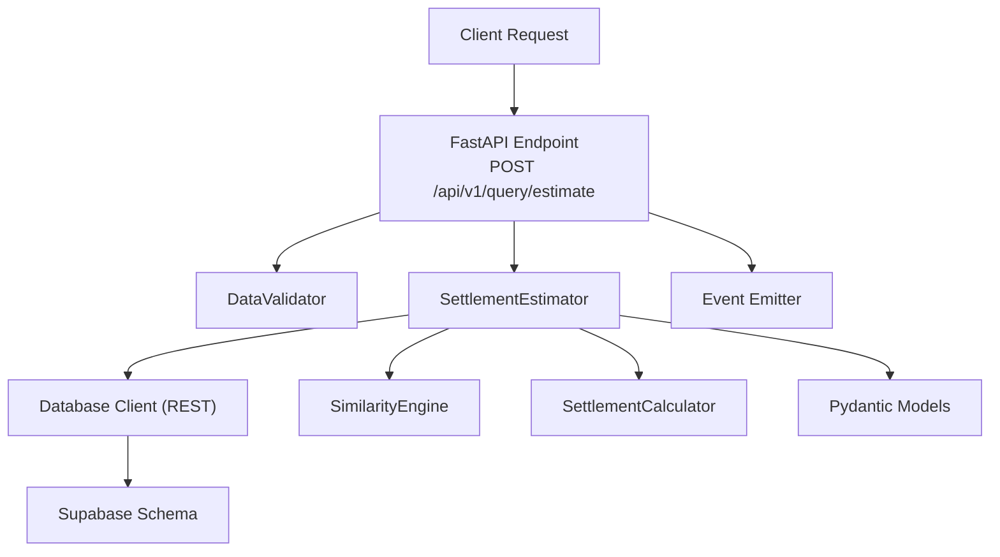
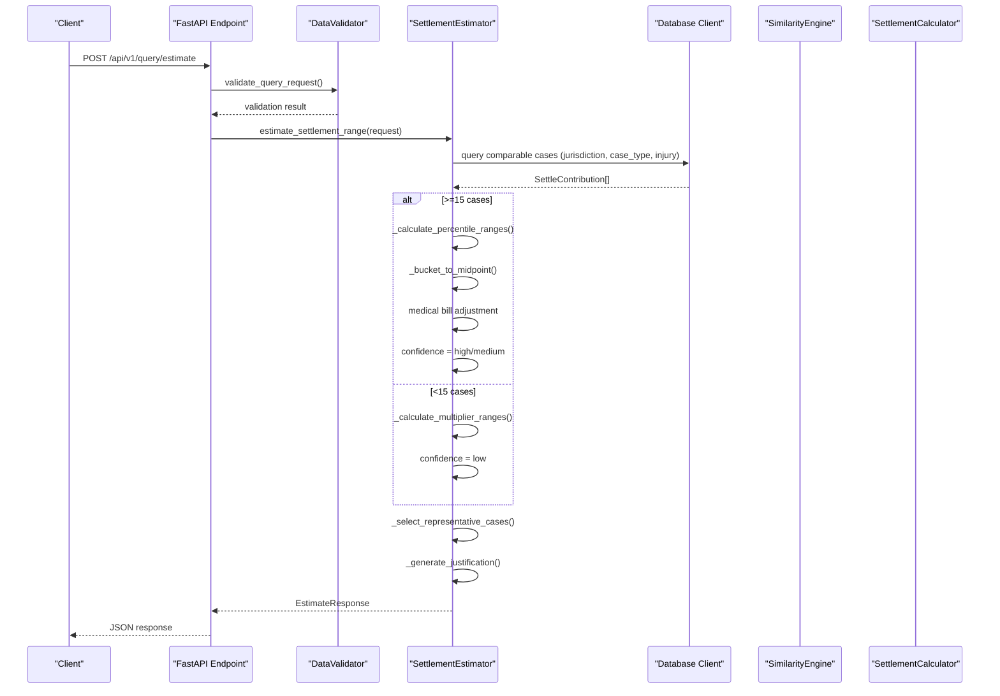
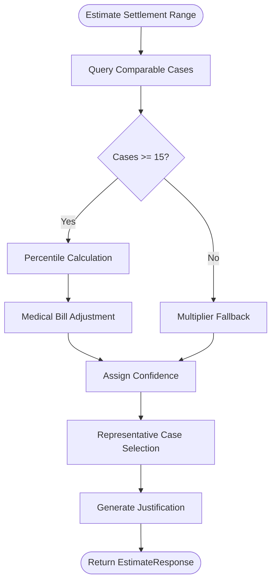
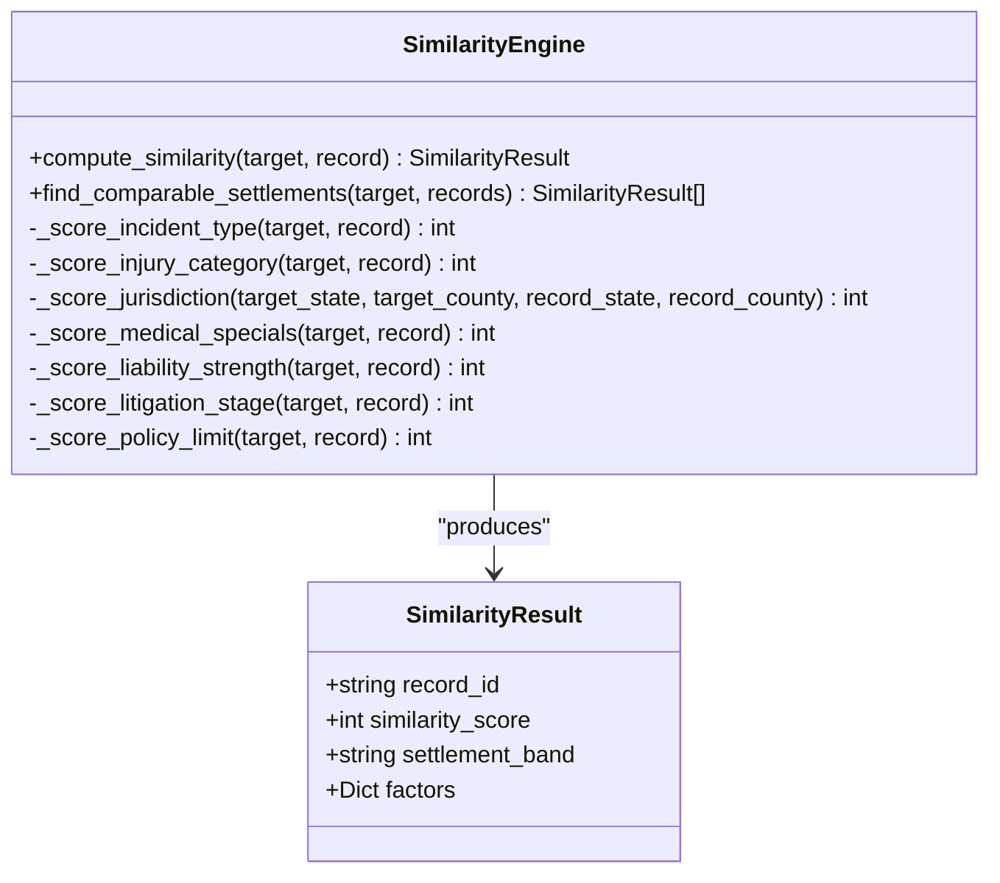
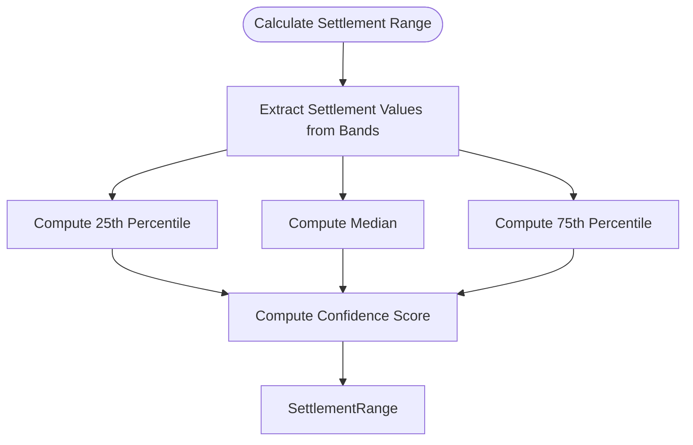
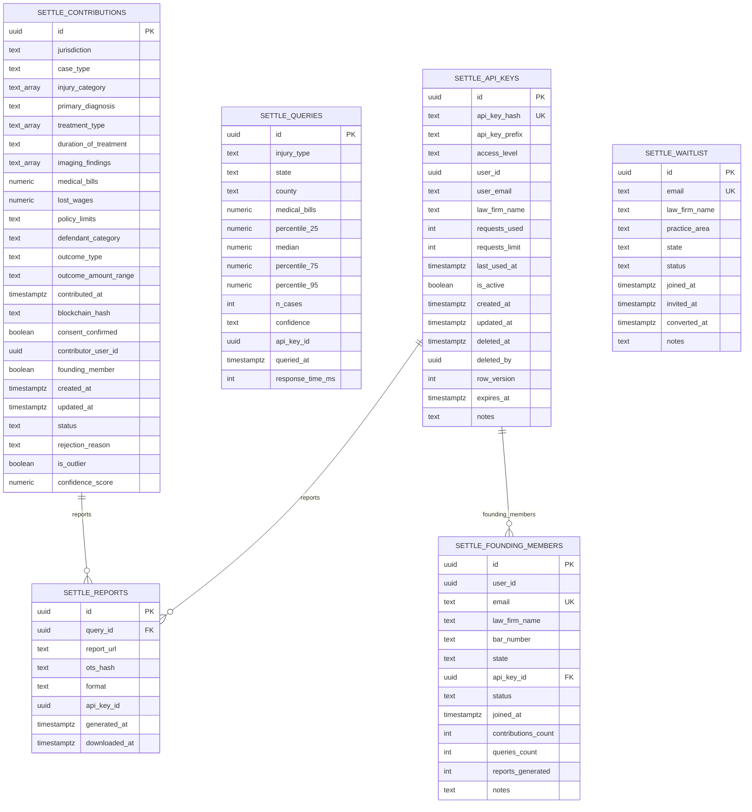
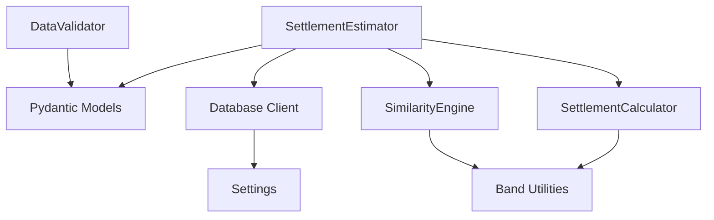

# Settlement Intelligence Engine

<cite>
**Referenced Files in This Document**
- [estimator.py](file://app/services/estimator.py)
- [settlement_calculator.py](file://app/services/settlement_calculator.py)
- [similarity_engine.py](file://app/services/similarity_engine.py)
- [case_bank.py](file://app/models/case_bank.py)
- [query.py](file://app/api/v1/endpoints/query.py)
- [database.py](file://app/core/database.py)
- [validator.py](file://app/services/validator.py)
- [settle_supabase.sql](file://database/schemas/settle_supabase.sql)
- [33175e3b6200_add_settlement_records_table.py](file://alembic/versions/33175e3b6200_add_settlement_records_table.py)
- [6244ebfd45df_add_settle_case_snapshots_table.py](file://alembic/versions/6244ebfd45df_add_settle_case_snapshots_table.py)
- [test_estimator.py](file://tests/test_estimator.py)
</cite>

## Table of Contents
1. [Introduction](#introduction)
2. [Project Structure](#project-structure)
3. [Core Components](#core-components)
4. [Architecture Overview](#architecture-overview)
5. [Detailed Component Analysis](#detailed-component-analysis)
6. [Dependency Analysis](#dependency-analysis)
7. [Performance Considerations](#performance-considerations)
8. [Troubleshooting Guide](#troubleshooting-guide)
9. [Conclusion](#conclusion)
10. [Appendices](#appendices)

## Introduction
The Settlement Intelligence Engine provides percentile-based settlement range estimation using a dual methodology:
- Comparable case analysis: Percentile calculation (25th, median, 75th, 95th) when sufficient comparable cases are available.
- Multiplier fallback: Industry-standard multipliers applied to medical bills when comparable cases are insufficient.

It also includes:
- Confidence threshold system: High (30+ cases), Medium (15–29), Low (<15).
- Medical bill adjustment algorithm: Proportional adjustments when the current case’s medical bills differ significantly from the comparable group average.
- Representative case selection process: Stratified sampling across the settlement range and recency.
- Robust data validation and database integration patterns.

## Project Structure
The engine is organized around services, models, API endpoints, and database schema:
- Services: Estimator, Similarity Engine, Settlement Calculator, Validator, Database client.
- Models: Pydantic models for requests, responses, and database entities.
- API: FastAPI endpoint for settlement range estimation.
- Database: Supabase schema with indexes and views for efficient querying.

**Diagram sources**
- [query.py:20-98](file://app/api/v1/endpoints/query.py#L20-L98)
- [estimator.py:60-116](file://app/services/estimator.py#L60-L116)
- [database.py:412-463](file://app/core/database.py#L412-L463)
- [similarity_engine.py:188-418](file://app/services/similarity_engine.py#L188-L418)
- [settlement_calculator.py:41-103](file://app/services/settlement_calculator.py#L41-L103)
- [case_bank.py:69-139](file://app/models/case_bank.py#L69-L139)
- [settle_supabase.sql:31-146](file://database/schemas/settle_supabase.sql#L31-L146)

**Section sources**
- [query.py:1-119](file://app/api/v1/endpoints/query.py#L1-L119)
- [estimator.py:1-443](file://app/services/estimator.py#L1-L443)
- [database.py:1-549](file://app/core/database.py#L1-L549)
- [settle_supabase.sql:1-505](file://database/schemas/settle_supabase.sql#L1-L505)

## Core Components
- SettlementEstimator: Orchestrates percentile vs multiplier fallback, confidence assignment, representative case selection, and justification generation.
- SimilarityEngine: Computes deterministic similarity scores between a target case and historical settlement records.
- SettlementCalculator: Calculates percentile-based ranges and confidence scores with weighted factors.
- DataValidator: Validates query and contribution requests against strict business rules.
- Database Client: REST-based client to Supabase for querying and inserting data.
- Pydantic Models: Strong typing for requests, responses, and database entities.

Key responsibilities:
- Estimator: Query comparable cases, compute ranges, adjust for medical bills, select representative cases, and generate justification.
- SimilarityEngine: Weighted scoring across jurisdiction, injury category, incident type, medical specials band, liability strength, litigation stage, and policy limits.
- SettlementCalculator: Percentile computation and confidence scoring with sample size, jurisdiction match, and average similarity.
- Validator: Jurisdiction format, financial bounds, outcome ranges, and outlier detection.
- Database: REST client abstraction with retry logic and health checks.

**Section sources**
- [estimator.py:25-116](file://app/services/estimator.py#L25-L116)
- [similarity_engine.py:188-418](file://app/services/similarity_engine.py#L188-L418)
- [settlement_calculator.py:41-103](file://app/services/settlement_calculator.py#L41-L103)
- [validator.py:25-326](file://app/services/validator.py#L25-L326)
- [database.py:412-463](file://app/core/database.py#L412-L463)
- [case_bank.py:15-139](file://app/models/case_bank.py#L15-L139)

## Architecture Overview
The system integrates FastAPI endpoints, validators, estimators, similarity engines, calculators, and the database layer. It supports two estimation modes:
- Percentile-based: When ≥15 comparable cases are found.
- Multiplier fallback: When <15 comparable cases are found.

**Diagram sources**
- [query.py:20-98](file://app/api/v1/endpoints/query.py#L20-L98)
- [estimator.py:60-116](file://app/services/estimator.py#L60-L116)
- [similarity_engine.py:396-418](file://app/services/similarity_engine.py#L396-L418)
- [settlement_calculator.py:57-103](file://app/services/settlement_calculator.py#L57-L103)

## Detailed Component Analysis

### SettlementEstimator
- Dual methodology:
  - Percentile calculation: Extract midpoints from outcome buckets, compute 25th, median, 75th, 95th percentiles, adjust for medical bills if significantly different, assign confidence.
  - Multiplier fallback: Determine severity by medical bills, apply industry multipliers, and produce conservative ranges.
- Confidence thresholds: High (≥30), Medium (15–29), Low (<15).
- Medical bill adjustment: If the ratio of current medical bills to average is <0.5 or >2.0, apply a partial proportional adjustment (50% weight).
- Representative case selection: Sort by outcome midpoint ascending and recency descending, then sample evenly across the range.
- Justification generation: Human-readable explanation based on methodology and confidence.

**Diagram sources**
- [estimator.py:60-116](file://app/services/estimator.py#L60-L116)
- [estimator.py:148-210](file://app/services/estimator.py#L148-L210)
- [estimator.py:212-262](file://app/services/estimator.py#L212-L262)
- [estimator.py:291-343](file://app/services/estimator.py#L291-L343)
- [estimator.py:345-388](file://app/services/estimator.py#L345-L388)

**Section sources**
- [estimator.py:25-116](file://app/services/estimator.py#L25-L116)
- [estimator.py:148-210](file://app/services/estimator.py#L148-L210)
- [estimator.py:212-262](file://app/services/estimator.py#L212-L262)
- [estimator.py:264-289](file://app/services/estimator.py#L264-L289)
- [estimator.py:291-343](file://app/services/estimator.py#L291-L343)
- [estimator.py:345-388](file://app/services/estimator.py#L345-L388)

### SimilarityEngine
- Deterministic similarity scoring across seven factors with fixed weights:
  - Incident type: exact match (25), relatedness (18), otherwise 0.
  - Injury category: exact match (20), adjacent levels (10), otherwise 0.
  - Jurisdiction: exact county (20), same state (12), neighboring state (6), different region (0).
  - Medical specials band: exact match (15), adjacent bands (7), otherwise 0.
  - Liability strength: exact match (10), adjacent levels (5), otherwise 0.
  - Litigation stage: exact match (5), adjacent stages (3), otherwise 0.
  - Policy limit band: exact match (5), adjacent bands (3), otherwise 0.
- Threshold: Only records with similarity ≥60 are included.
- Output: SimilarityResult with record_id, similarity_score, settlement_band, and factor breakdown.

**Diagram sources**
- [similarity_engine.py:188-418](file://app/services/similarity_engine.py#L188-L418)
- [similarity_engine.py:109-115](file://app/services/similarity_engine.py#L109-L115)

**Section sources**
- [similarity_engine.py:188-418](file://app/services/similarity_engine.py#L188-L418)

### SettlementCalculator
- Percentile calculation: Uses nearest-rank method on sorted settlement values derived from bands.
- Confidence scoring: Weighted components:
  - Sample size: 40 points (min 20, ideal 40).
  - Jurisdiction match: 30 points (county=30, state=25, regional=15, national=5).
  - Average similarity: 30 points scaled from 60–100.
- Output: SettlementRange with p25, median, p75, sample_size, confidence_score, avg_similarity_score, expansion_level.

**Diagram sources**
- [settlement_calculator.py:57-103](file://app/services/settlement_calculator.py#L57-L103)
- [settlement_calculator.py:105-116](file://app/services/settlement_calculator.py#L105-L116)
- [settlement_calculator.py:117-181](file://app/services/settlement_calculator.py#L117-L181)

**Section sources**
- [settlement_calculator.py:41-103](file://app/services/settlement_calculator.py#L41-L103)
- [settlement_calculator.py:105-181](file://app/services/settlement_calculator.py#L105-L181)

### Data Validation
- Query validation enforces:
  - Required fields: jurisdiction, case_type, injury_category, medical_bills.
  - Jurisdiction format: “County, ST” with valid 2-letter state code.
  - Medical bills range: within allowed bounds.
- Contribution validation adds:
  - Case type, injury category, outcome type, outcome range from predefined lists.
  - Policy limits, duration of treatment, defendant category from predefined lists.
  - Consent confirmation required.
  - Outlier detection: extremely high medical bills or implausible multipliers.

**Section sources**
- [validator.py:286-326](file://app/services/validator.py#L286-L326)
- [validator.py:52-139](file://app/services/validator.py#L52-L139)
- [validator.py:140-182](file://app/services/validator.py#L140-L182)
- [validator.py:183-224](file://app/services/validator.py#L183-L224)
- [validator.py:226-262](file://app/services/validator.py#L226-L262)

### Database Integration
- REST client abstraction:
  - SupabaseRESTClient, SupabaseRESTQuery, SupabaseTable, and builders for select/insert/update/delete.
  - Retry decorator with exponential backoff.
  - Health check via a simple select.
- Schema:
  - settle_contributions: anonymized settlement contributions with indexes for jurisdiction, case_type, injury_category, outcome_range, status, created_at, medical_bills, and composite query pattern.
  - Additional tables: settlement_records, settle_case_snapshots, settle_queries, settle_reports, settle_api_keys, settle_founding_members, settle_waitlist.
- Indexes and constraints ensure fast querying and data integrity.

**Diagram sources**
- [settle_supabase.sql:31-146](file://database/schemas/settle_supabase.sql#L31-L146)
- [settle_supabase.sql:246-310](file://database/schemas/settle_supabase.sql#L246-L310)
- [settle_supabase.sql:139-197](file://database/schemas/settle_supabase.sql#L139-L197)
- [settle_supabase.sql:200-243](file://database/schemas/settle_supabase.sql#L200-L243)
- [settle_supabase.sql:318-351](file://database/schemas/settle_supabase.sql#L318-L351)

**Section sources**
- [database.py:220-372](file://app/core/database.py#L220-L372)
- [database.py:374-409](file://app/core/database.py#L374-L409)
- [database.py:412-463](file://app/core/database.py#L412-L463)
- [database.py:491-506](file://app/core/database.py#L491-L506)
- [database.py:509-539](file://app/core/database.py#L509-L539)
- [settle_supabase.sql:1-505](file://database/schemas/settle_supabase.sql#L1-L505)

### API Endpoint Integration
- Endpoint: POST /api/v1/query/estimate
- Authentication: Supports API Key and Clerk JWT.
- Workflow: Validate request, get DB connection, initialize estimator, compute response, emit behavioral event, return EstimateResponse.

**Section sources**
- [query.py:20-98](file://app/api/v1/endpoints/query.py#L20-L98)

## Dependency Analysis
- Estimator depends on:
  - Pydantic models for requests/responses and database entities.
  - Database client for querying comparable cases.
  - SimilarityEngine and SettlementCalculator for alternative methodologies.
- SimilarityEngine depends on:
  - Enumerations and band mappings for scoring.
- SettlementCalculator depends on:
  - SimilarityEngine’s settlement_band_to_midpoint utility.
- Validator depends on:
  - Model constants for dropdown options.
- Database client depends on:
  - Settings for Supabase URL and service key.
  - httpx for REST calls.

**Diagram sources**
- [estimator.py:15-20](file://app/services/estimator.py#L15-L20)
- [similarity_engine.py:13-16](file://app/services/similarity_engine.py#L13-L16)
- [settlement_calculator.py:13-16](file://app/services/settlement_calculator.py#L13-L16)
- [validator.py:12-20](file://app/services/validator.py#L12-L20)
- [database.py:432-458](file://app/core/database.py#L432-L458)

**Section sources**
- [estimator.py:1-443](file://app/services/estimator.py#L1-L443)
- [similarity_engine.py:1-441](file://app/services/similarity_engine.py#L1-L441)
- [settlement_calculator.py:1-257](file://app/services/settlement_calculator.py#L1-L257)
- [validator.py:1-327](file://app/services/validator.py#L1-L327)
- [database.py:1-549](file://app/core/database.py#L1-L549)

## Performance Considerations
- Percentile calculation:
  - Uses vectorized NumPy percentile for speed; ensure comparable_cases is bounded (e.g., limit to 200).
- Query expansion:
  - SimilarityEngine supports progressive expansion (county → state → regional → national) to increase sample size.
- Database indexing:
  - Composite index on jurisdiction, case_type, status for approved records.
  - Indexes on outcome_range, created_at, medical_bills, and GIN on injury_category.
- Response time:
  - Target <1 second; estimator measures response time and logs it.
- Retry logic:
  - Database client includes retry with exponential backoff to handle transient failures.

[No sources needed since this section provides general guidance]

## Troubleshooting Guide
Common issues and resolutions:
- Validation errors:
  - Jurisdiction format incorrect or invalid state code.
  - Medical bills out of range or missing.
  - Outcome range not in allowed buckets.
- Database connectivity:
  - Missing Supabase URL or service key.
  - Health check indicates degraded or unhealthy status.
- Estimator timeouts:
  - Reduce comparable_cases limit or improve database indexes.
- Multiplier fallback confidence:
  - Expect low confidence when <15 cases; consider expanding jurisdiction or case type filters.

**Section sources**
- [validator.py:140-182](file://app/services/validator.py#L140-L182)
- [validator.py:286-326](file://app/services/validator.py#L286-L326)
- [database.py:509-539](file://app/core/database.py#L509-L539)
- [test_estimator.py:13-102](file://tests/test_estimator.py#L13-L102)

## Conclusion
The Settlement Intelligence Engine combines deterministic percentile-based estimation with a robust multiplier fallback system. Its dual methodology ensures reliable estimates across jurisdictions and injury categories while maintaining transparency through confidence scoring, representative case selection, and detailed justifications. The system’s modular design, strong validation, and database-first schema enable scalable, compliant, and auditable settlement intelligence.

## Appendices

### Implementation Examples
- Percentile-based estimation:
  - Input: jurisdiction, case_type, injury_category, medical_bills.
  - Output: percentile_25, median, percentile_75, percentile_95, n_cases, confidence, comparable_cases, range_justification, response_time_ms.
- Multiplier fallback:
  - Severity determined by medical bills; multipliers applied to produce conservative ranges; confidence set to low.

**Section sources**
- [estimator.py:60-116](file://app/services/estimator.py#L60-L116)
- [estimator.py:212-262](file://app/services/estimator.py#L212-L262)
- [test_estimator.py:13-102](file://tests/test_estimator.py#L13-L102)

### Edge Cases and Error Handling
- Insufficient comparable cases:
  - Switches to multiplier fallback with low confidence.
- Medical bill mismatch:
  - Applies partial proportional adjustment when ratio <0.5 or >2.0.
- Representative case selection:
  - Evenly samples across settlement range and prioritizes recent cases.
- Validation:
  - Strict checks on jurisdiction format, financial bounds, and outcome ranges.

**Section sources**
- [estimator.py:79-90](file://app/services/estimator.py#L79-L90)
- [estimator.py:182-192](file://app/services/estimator.py#L182-L192)
- [estimator.py:291-343](file://app/services/estimator.py#L291-L343)
- [validator.py:140-182](file://app/services/validator.py#L140-L182)

### Database Layer Integration Patterns
- REST client usage:
  - SupabaseRESTQuery builder for select, filters, ordering, limit, offset.
  - Retry decorator for transient failures.
- Schema and indexes:
  - settle_contributions with composite query index and GIN index on injury_category.
  - Additional tables for API keys, founding members, queries, and reports.

**Section sources**
- [database.py:32-185](file://app/core/database.py#L32-L185)
- [database.py:374-409](file://app/core/database.py#L374-L409)
- [settle_supabase.sql:115-146](file://database/schemas/settle_supabase.sql#L115-L146)
- [33175e3b6200_add_settlement_records_table.py:21-43](file://alembic/versions/33175e3b6200_add_settlement_records_table.py#L21-L43)
- [6244ebfd45df_add_settle_case_snapshots_table.py:21-40](file://alembic/versions/6244ebfd45df_add_settle_case_snapshots_table.py#L21-L40)