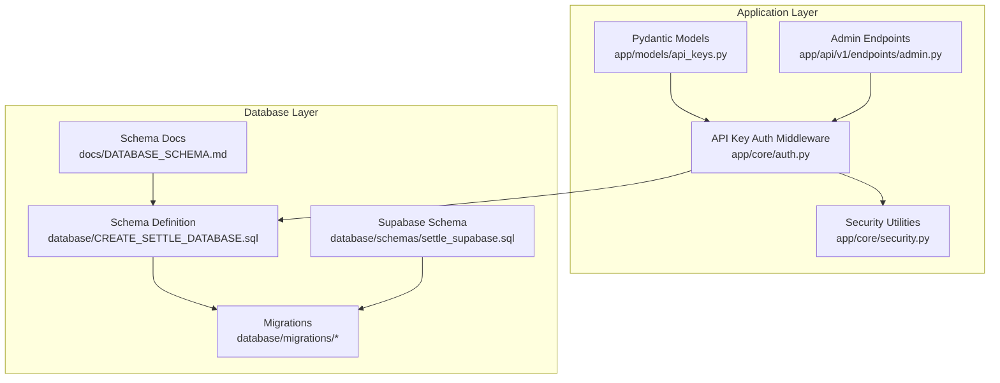
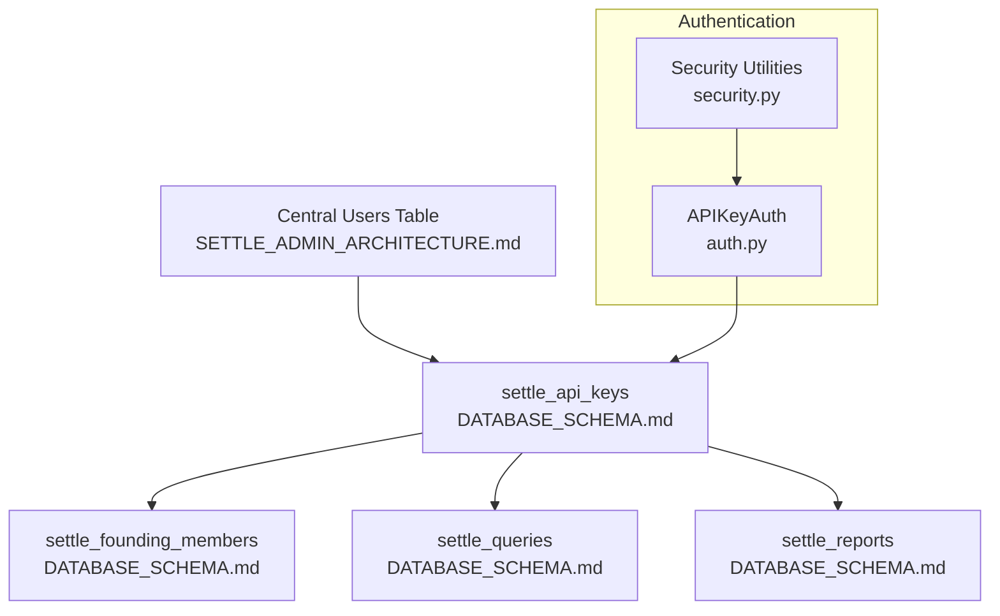
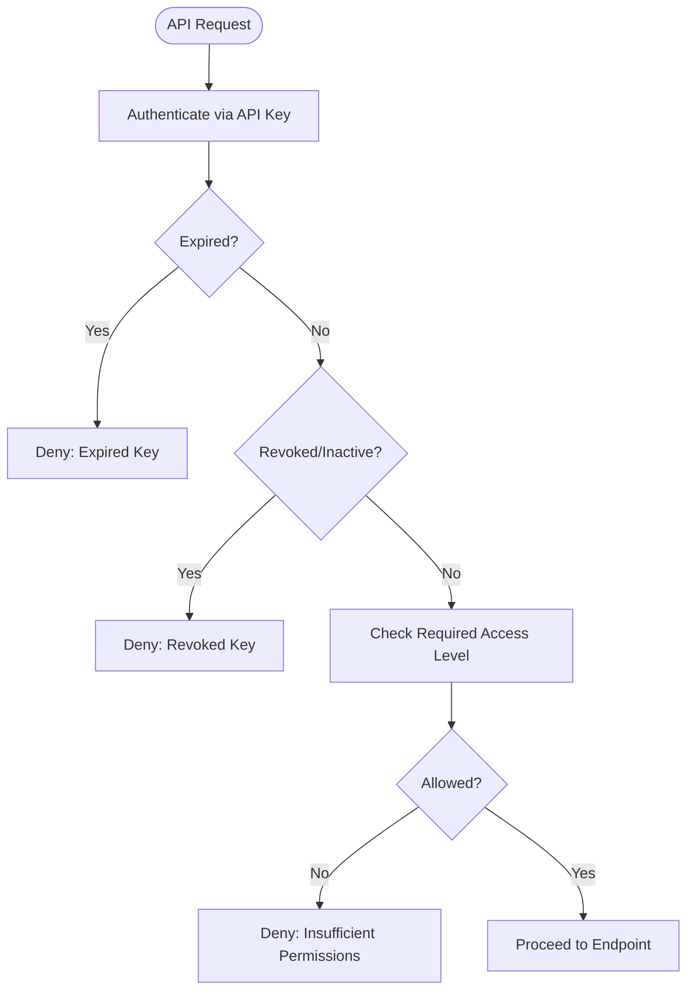
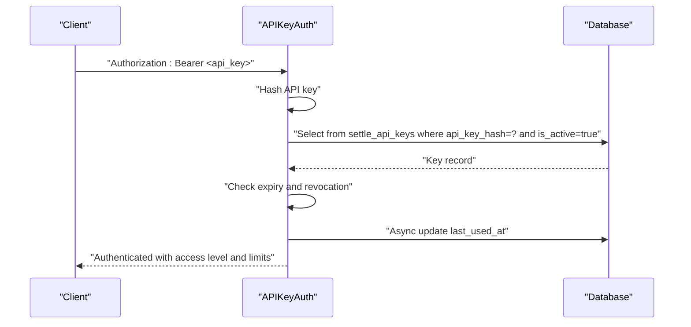
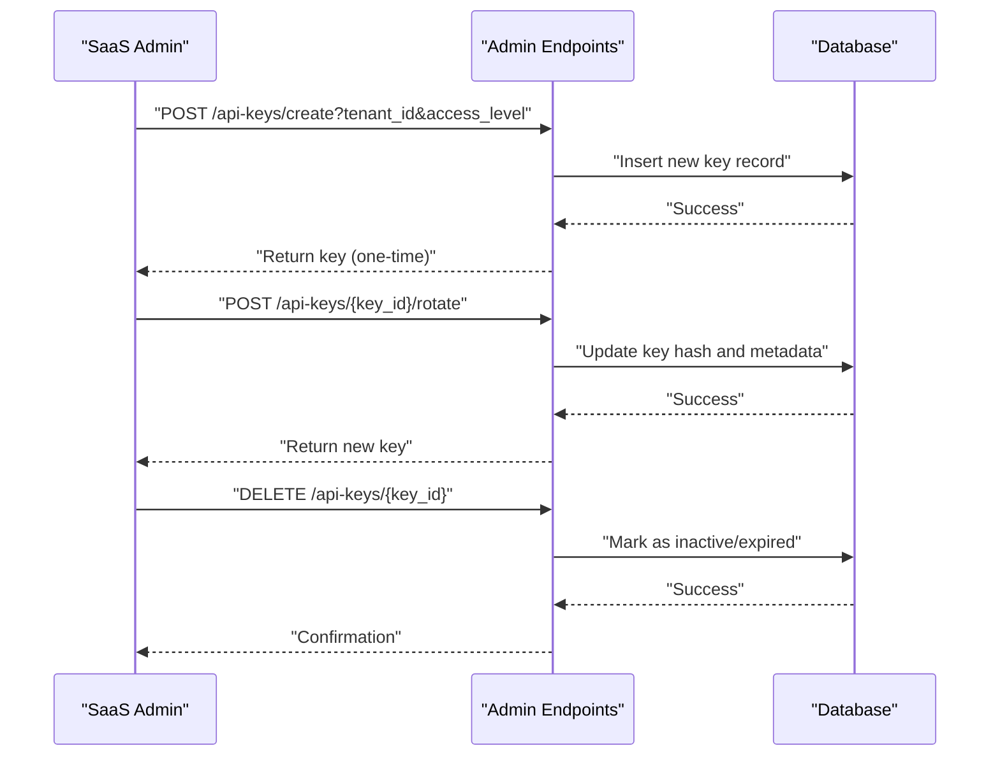
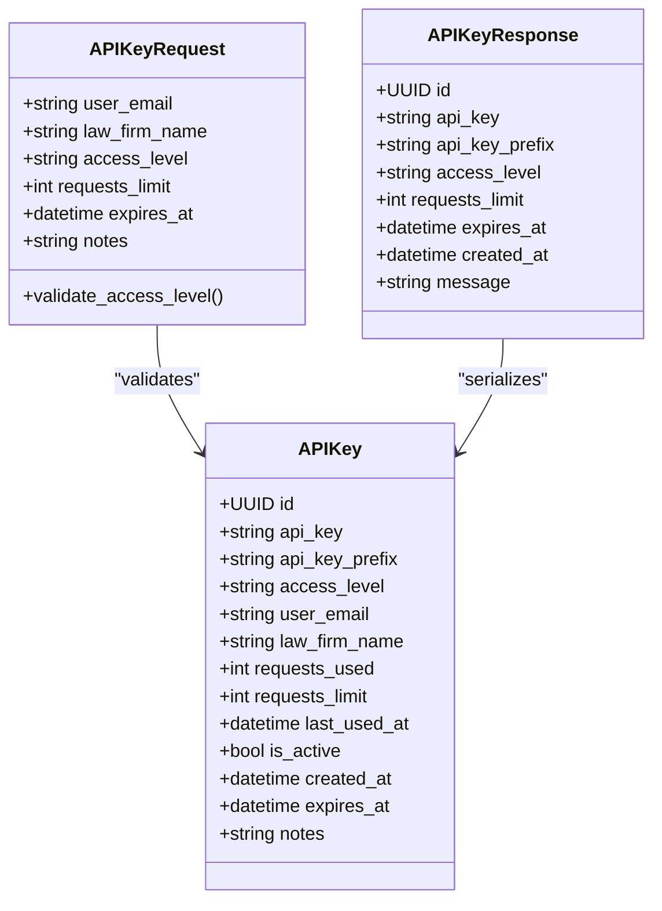
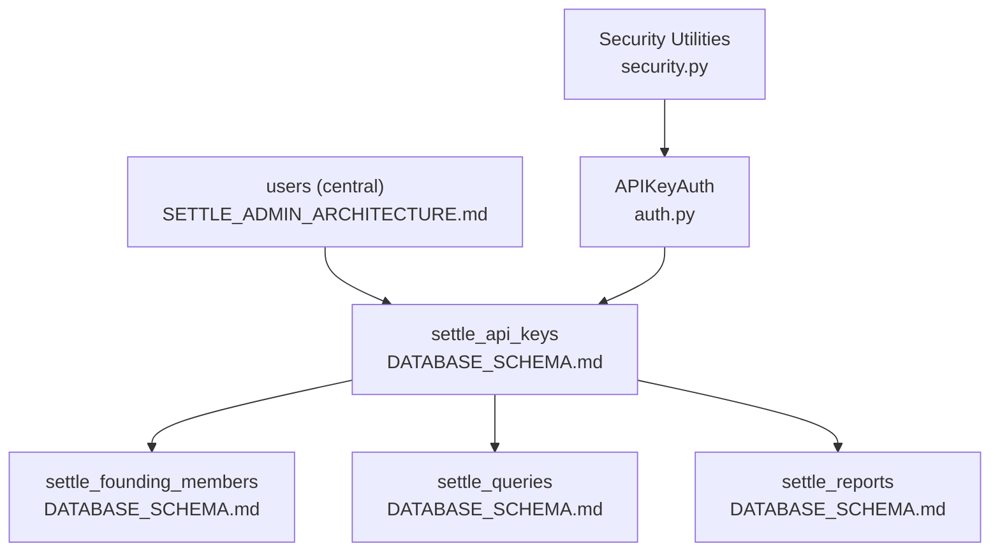

# API Keys

<cite>
**Referenced Files in This Document**
- [api_keys.py](file://app/models/api_keys.py)
- [auth.py](file://app/core/auth.py)
- [security.py](file://app/core/security.py)
- [admin.py](file://app/api/v1/endpoints/admin.py)
- [CREATE_SETTLE_DATABASE.sql](file://database/CREATE_SETTLE_DATABASE.sql)
- [settle_supabase.sql](file://database/schemas/settle_supabase.sql)
- [add_auth_audit_log.sql](file://database/migrations/20260302_add_auth_audit_log.sql)
- [add_audit_columns.sql](file://database/migrations/20260302_add_audit_columns.sql)
- [add_tenant_id.sql](file://database/migrations/20260302_add_tenant_id.sql)
- [DATABASE_SCHEMA.md](file://docs/DATABASE_SCHEMA.md)
- [SETTLE_DUAL_AUTH_ARCHITECTURE.md](file://docs/architecture/SETTLE_DUAL_AUTH_ARCHITECTURE.md)
- [SETTLE_ADMIN_ARCHITECTURE.md](file://docs/architecture/SETTLE_ADMIN_ARCHITECTURE.md)
</cite>

## Table of Contents
1. [Introduction](#introduction)
2. [Project Structure](#project-structure)
3. [Core Components](#core-components)
4. [Architecture Overview](#architecture-overview)
5. [Detailed Component Analysis](#detailed-component-analysis)
6. [Dependency Analysis](#dependency-analysis)
7. [Performance Considerations](#performance-considerations)
8. [Troubleshooting Guide](#troubleshooting-guide)
9. [Conclusion](#conclusion)

## Introduction
This document provides comprehensive documentation for the settle_api_keys table that manages API key lifecycle and access control. It covers the complete schema, including api_key_hash (SHA-256 hashed keys), api_key_prefix (first 8 characters for display), access_level field with values 'founding_member', 'standard', 'premium', 'admin', 'external', user references (user_id, user_email, law_firm_name), usage tracking (requests_used, requests_limit with NULL for unlimited), temporal fields (last_used_at, expires_at), status management (is_active with soft-delete capability), and metadata (notes). It also explains the access level hierarchy, Row Level Security policies, indexes, constraints, and relationships with the central users table. Finally, it outlines practical examples for API key generation, rotation, and access control scenarios.

## Project Structure
The API key functionality spans several layers:
- Data models define Pydantic models for API key creation, validation, and responses.
- Authentication middleware verifies API keys against the database and enforces access levels.
- Endpoints expose administrative operations for API key lifecycle management.
- Database schema defines the settle_api_keys table, constraints, indexes, and migration steps.
- Documentation describes the schema and architecture decisions.

**Diagram sources**
- [api_keys.py:11-147](file://app/models/api_keys.py#L11-L147)
- [auth.py:359-724](file://app/core/auth.py#L359-L724)
- [security.py:99-141](file://app/core/security.py#L99-L141)
- [admin.py:425-550](file://app/api/v1/endpoints/admin.py#L425-L550)
- [CREATE_SETTLE_DATABASE.sql:150-199](file://database/CREATE_SETTLE_DATABASE.sql#L150-L199)
- [settle_supabase.sql:160-182](file://database/schemas/settle_supabase.sql#L160-L182)
- [add_tenant_id.sql:34-84](file://database/migrations/20260302_add_tenant_id.sql#L34-L84)
- [DATABASE_SCHEMA.md:182-265](file://docs/DATABASE_SCHEMA.md#L182-L265)

**Section sources**
- [api_keys.py:11-147](file://app/models/api_keys.py#L11-L147)
- [auth.py:359-724](file://app/core/auth.py#L359-L724)
- [admin.py:425-550](file://app/api/v1/endpoints/admin.py#L425-L550)
- [CREATE_SETTLE_DATABASE.sql:150-199](file://database/CREATE_SETTLE_DATABASE.sql#L150-L199)
- [DATABASE_SCHEMA.md:182-265](file://docs/DATABASE_SCHEMA.md#L182-L265)

## Core Components
- settle_api_keys table: Centralized API key storage with hashed keys, access levels, usage tracking, and status.
- Pydantic models: APIKey, APIKeyRequest, APIKeyResponse for validation and serialization.
- Authentication middleware: APIKeyAuth validates keys, checks expiry and revocation, and enforces access level requirements.
- Endpoints: Administrative operations for creating, retrieving, rotating, and revoking API keys.
- Constraints and indexes: Enforce data integrity and optimize queries by access_level, is_active, api_key_prefix, user_id, and user_email.

**Section sources**
- [DATABASE_SCHEMA.md:182-265](file://docs/DATABASE_SCHEMA.md#L182-L265)
- [api_keys.py:11-76](file://app/models/api_keys.py#L11-L76)
- [auth.py:580-724](file://app/core/auth.py#L580-L724)
- [admin.py:425-550](file://app/api/v1/endpoints/admin.py#L425-L550)

## Architecture Overview
The API key system integrates with the central users table via user_id references. Access control is enforced through access_level values and middleware validation. The system supports soft deletes and audit trails, and includes indexes for efficient querying. Administrative endpoints manage lifecycle operations while the authentication layer ensures secure access.

**Diagram sources**
- [SETTLE_ADMIN_ARCHITECTURE.md:142-184](file://docs/architecture/SETTLE_ADMIN_ARCHITECTURE.md#L142-L184)
- [DATABASE_SCHEMA.md:182-379](file://docs/DATABASE_SCHEMA.md#L182-L379)
- [auth.py:629-724](file://app/core/auth.py#L629-L724)
- [security.py:99-141](file://app/core/security.py#L99-L141)

## Detailed Component Analysis

### settle_api_keys Schema
- Identity and hashing: id (UUID), api_key_hash (SHA-256), api_key_prefix (first 8 characters).
- Access control: access_level with enumerated values and constraints.
- User linkage: user_id (references central users), user_email, law_firm_name.
- Usage tracking: requests_used (non-negative), requests_limit (NULL means unlimited), last_used_at.
- Status and lifecycle: is_active (boolean), created_at, updated_at, deleted_at/deleted_by (soft delete), row_version (optimistic locking), expires_at.
- Metadata: notes.
- Constraints: valid_access_level, valid_requests_used, valid_requests_limit.
- Indexes: access_level, is_active, api_key_prefix, user_id, user_email; plus soft-delete indexes.

**Section sources**
- [DATABASE_SCHEMA.md:182-265](file://docs/DATABASE_SCHEMA.md#L182-L265)
- [CREATE_SETTLE_DATABASE.sql:150-199](file://database/CREATE_SETTLE_DATABASE.sql#L150-L199)
- [settle_supabase.sql:160-182](file://database/schemas/settle_supabase.sql#L160-L182)
- [add_audit_columns.sql:35-51](file://database/migrations/20260302_add_audit_columns.sql#L35-L51)

### Access Level Hierarchy and Privilege Escalation
- Access levels: 'founding_member', 'standard', 'premium', 'admin', 'external'.
- The system enforces access levels during authentication and can restrict endpoints to specific levels.
- Administrative privileges are enforced via dedicated dependencies and middleware checks.

**Diagram sources**
- [auth.py:580-627](file://app/core/auth.py#L580-L627)

**Section sources**
- [api_keys.py:52-59](file://app/models/api_keys.py#L52-L59)
- [auth.py:602-618](file://app/core/auth.py#L602-L618)

### Row Level Security and Policies
- The schema enables Row Level Security for related tables (RLS-enabled tables are defined in migrations).
- Policies grant service_role full access and restrict authenticated users to their own key information.
- These policies ensure tenant isolation and secure access patterns.

**Section sources**
- [add_tenant_id.sql:81-84](file://database/migrations/20260302_add_tenant_id.sql#L81-L84)
- [add_auth_audit_log.sql:33-37](file://database/migrations/20260302_add_auth_audit_log.sql#L33-L37)

### Authentication and Verification Flow
- API key verification hashes the incoming key and queries settle_api_keys with filters for active keys and matching hash.
- On successful verification, the system updates last_used_at asynchronously and returns user context including access level and limits.
- Expiration and revocation checks prevent unauthorized use.

**Diagram sources**
- [auth.py:629-724](file://app/core/auth.py#L629-L724)
- [security.py:124-141](file://app/core/security.py#L124-L141)

**Section sources**
- [auth.py:629-724](file://app/core/auth.py#L629-L724)
- [security.py:124-141](file://app/core/security.py#L124-L141)

### Administrative Lifecycle Management
- Create API key for tenant: Generates a new key with specified access level and returns the key once.
- Retrieve tenant API key: Allows administrative inspection of a tenant's key.
- Rotate API key: Regenerates a key for security or maintenance.
- Revoke API key: Deactivates a key for compliance or security reasons.

**Diagram sources**
- [admin.py:425-550](file://app/api/v1/endpoints/admin.py#L425-L550)

**Section sources**
- [admin.py:425-550](file://app/api/v1/endpoints/admin.py#L425-L550)

### Data Model Classes

**Diagram sources**
- [api_keys.py:11-76](file://app/models/api_keys.py#L11-L76)

**Section sources**
- [api_keys.py:11-76](file://app/models/api_keys.py#L11-L76)

## Dependency Analysis
- Central users table: settle_api_keys references users.user_id for authentication and tracking.
- Founding members: settle_founding_members links to settle_api_keys via api_key_id.
- Queries and reports: settle_queries and settle_reports reference settle_api_keys for usage tracking and billing.
- Authentication depends on database connectivity and security utilities for hashing and verification.

**Diagram sources**
- [SETTLE_ADMIN_ARCHITECTURE.md:142-184](file://docs/architecture/SETTLE_ADMIN_ARCHITECTURE.md#L142-L184)
- [DATABASE_SCHEMA.md:182-379](file://docs/DATABASE_SCHEMA.md#L182-L379)
- [auth.py:629-724](file://app/core/auth.py#L629-L724)
- [security.py:99-141](file://app/core/security.py#L99-L141)

**Section sources**
- [SETTLE_ADMIN_ARCHITECTURE.md:142-184](file://docs/architecture/SETTLE_ADMIN_ARCHITECTURE.md#L142-L184)
- [DATABASE_SCHEMA.md:182-379](file://docs/DATABASE_SCHEMA.md#L182-L379)
- [auth.py:629-724](file://app/core/auth.py#L629-L724)
- [security.py:99-141](file://app/core/security.py#L99-L141)

## Performance Considerations
- Indexes: access_level, is_active, api_key_prefix, user_id, user_email enable efficient filtering and lookups.
- Soft-delete indexing: deleted_at and deleted_by indexes support audit and recovery workflows.
- Asynchronous updates: last_used_at updates occur in the background to minimize latency.
- Constraints: CHECK constraints enforce data validity at rest.

[No sources needed since this section provides general guidance]

## Troubleshooting Guide
- Authentication failures:
  - Invalid or missing Authorization header: Ensure proper Bearer token format.
  - Expired key: Renew or regenerate the key.
  - Revoked key: Reissue a new key.
  - Insufficient permissions: Verify access_level meets endpoint requirements.
- Database connectivity:
  - If database unavailable, verification returns None; ensure DB is reachable.
- Soft delete and audit:
  - Use deleted_at and deleted_by indexes for recovery and auditing.

**Section sources**
- [auth.py:580-627](file://app/core/auth.py#L580-L627)
- [auth.py:652-707](file://app/core/auth.py#L652-L707)
- [add_audit_columns.sql:44-51](file://database/migrations/20260302_add_audit_columns.sql#L44-L51)

## Conclusion
The settle_api_keys table provides a robust foundation for API key lifecycle management and access control. Its schema, constraints, indexes, and middleware integration ensure secure, auditable, and performant operation. Administrative endpoints facilitate key creation, rotation, and revocation, while the central users table integration maintains consistent identity across systems. The planned dual-auth architecture further strengthens security and scalability.