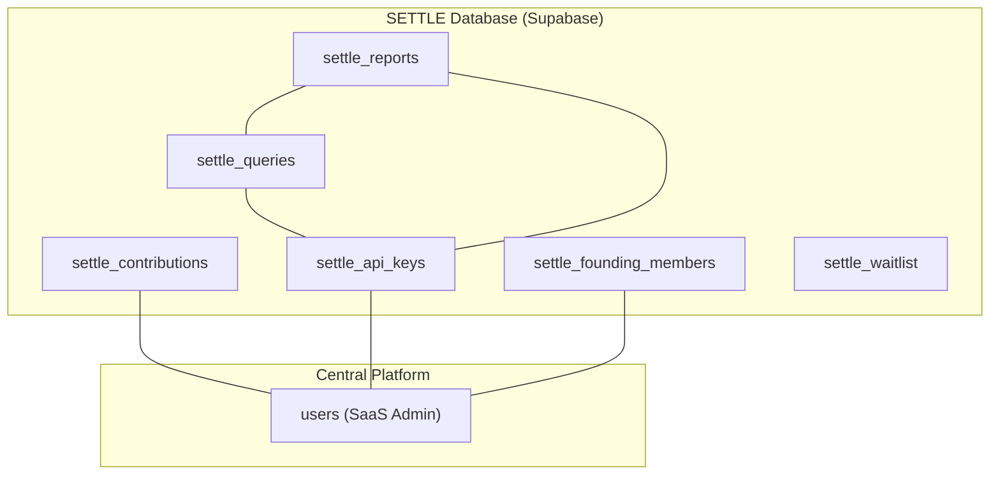
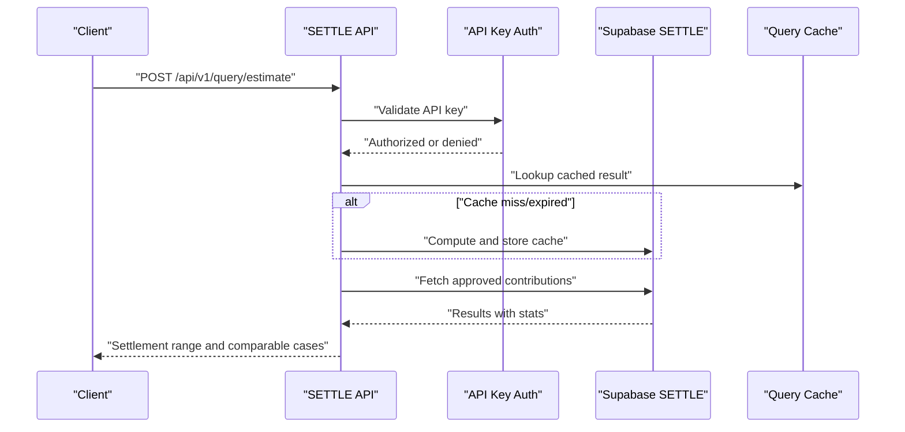
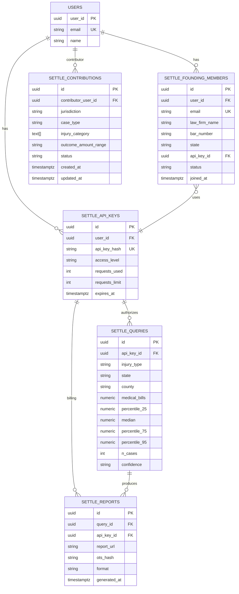

# Core Tables

<cite>
**Referenced Files in This Document**
- [settle_supabase.sql](file://database/schemas/settle_supabase.sql)
- [CREATE_SETTLE_DATABASE.sql](file://database/CREATE_SETTLE_DATABASE.sql)
- [add_waitlist_table.sql](file://database/migrations/add_waitlist_table.sql)
- [settle_api_keys.py](file://app/models/api_keys.py)
- [settle_case_bank.py](file://app/models/case_bank.py)
- [settle_reports.py](file://app/models/reports.py)
- [settle_waitlist.py](file://app/models/waitlist.py)
- [contribution_service.py](file://app/services/contribution_service.py)
- [query_cache_service.py](file://app/services/query_cache_service.py)
- [SUPABASE_SETUP_GUIDE.md](file://database/SUPABASE_SETUP_GUIDE.md)
- [DATABASE_SCHEMA.md](file://docs/DATABASE_SCHEMA.md)
- [579516014f19_add_settlement_reports_and_query_cache_.py](file://alembic/versions/579516014f19_add_settlement_reports_and_query_cache_.py)
- [33175e3b6200_add_settlement_records_table.py](file://alembic/versions/33175e3b6200_add_settlement_records_table.py)
- [ffd820027e8c_add_contribution_type_to_settlement_.py](file://alembic/versions/ffd820027e8c_add_contribution_type_to_settlement_.py)
</cite>

## Table of Contents
1. [Introduction](#introduction)
2. [Project Structure](#project-structure)
3. [Core Components](#core-components)
4. [Architecture Overview](#architecture-overview)
5. [Detailed Component Analysis](#detailed-component-analysis)
6. [Dependency Analysis](#dependency-analysis)
7. [Performance Considerations](#performance-considerations)
8. [Troubleshooting Guide](#troubleshooting-guide)
9. [Conclusion](#conclusion)

## Introduction
This document provides a comprehensive analysis of the core SETTLE Service database tables that power the shared settlement intelligence platform. It focuses on six tables: settle_contributions (data contributions), settle_api_keys (access control), settle_founding_members (membership tracking), settle_queries (analytics), settle_reports (reporting), and settle_waitlist (lead management). For each table, we document purpose, fields, data types, constraints, validation rules, defaults, indexing strategies, composite indexes, and business logic. We also explain the rationale for multi-select arrays, bucketed data structures, and the decision to avoid strict foreign key constraints for cross-database flexibility.

## Project Structure
The database schema is defined in SQL files and supplemented by Pydantic models in the application layer. The schema references a central users table from the SaaS Admin platform and enforces row-level security on sensitive tables. Additional migration files introduce supporting tables and columns for advanced caching and reporting.

**Diagram sources**
- [settle_supabase.sql:27-351](file://database/schemas/settle_supabase.sql#L27-L351)
- [settle_supabase.sql:200-244](file://database/schemas/settle_supabase.sql#L200-L244)
- [settle_supabase.sql:246-285](file://database/schemas/settle_supabase.sql#L246-L285)
- [settle_supabase.sql:287-316](file://database/schemas/settle_supabase.sql#L287-L316)
- [settle_supabase.sql:318-351](file://database/schemas/settle_supabase.sql#L318-L351)

**Section sources**
- [settle_supabase.sql:1-505](file://database/schemas/settle_supabase.sql#L1-L505)
- [CREATE_SETTLE_DATABASE.sql:1-507](file://database/CREATE_SETTLE_DATABASE.sql#L1-L507)
- [SUPABASE_SETUP_GUIDE.md:298-317](file://database/SUPABASE_SETUP_GUIDE.md#L298-L317)

## Core Components
This section summarizes the six core tables and their roles in the SETTLE ecosystem.

- settle_contributions: Stores anonymized settlement data contributions with multi-select arrays, bucketed outcome ranges, and quality flags. Indexed for fast filtering and composite indexes for common query patterns.
- settle_api_keys: Manages API key lifecycle, access levels, usage tracking, and soft-deletion metadata. Enforces constraints on access levels and usage limits.
- settle_founding_members: Tracks the Founding Member program with lifetime free access, stats counters, and a logical foreign key to settle_api_keys.
- settle_queries: Captures query parameters and results for settlement range analytics, linked to API keys for usage tracking.
- settle_reports: Stores generated report metadata, links to queries, and OpenTimestamps hashes for integrity.
- settle_waitlist: Pre-launch lead management with enhanced fields for firm and contact information, practice areas as arrays, and status lifecycle.

**Section sources**
- [settle_supabase.sql:27-351](file://database/schemas/settle_supabase.sql#L27-L351)
- [settle_api_keys.py:11-147](file://app/models/api_keys.py#L11-L147)
- [settle_case_bank.py:15-63](file://app/models/case_bank.py#L15-L63)
- [settle_reports.py:11-121](file://app/models/reports.py#L11-L121)
- [settle_waitlist.py:11-57](file://app/models/waitlist.py#L11-L57)
- [add_waitlist_table.sql:1-61](file://database/migrations/add_waitlist_table.sql#L1-L61)

## Architecture Overview
The SETTLE Service operates as a shared settlement database accessed by multiple tenants. It references the central SaaS Admin users table for attorney identities while maintaining logical relationships without enforced foreign keys. Row-level security protects sensitive tables, and application services handle caching and duplicate detection.

**Diagram sources**
- [settle_supabase.sql:246-285](file://database/schemas/settle_supabase.sql#L246-L285)
- [query_cache_service.py:64-154](file://app/services/query_cache_service.py#L64-L154)
- [settle_case_bank.py:110-139](file://app/models/case_bank.py#L110-L139)

**Section sources**
- [settle_supabase.sql:402-436](file://database/schemas/settle_supabase.sql#L402-L436)
- [query_cache_service.py:1-238](file://app/services/query_cache_service.py#L1-L238)
- [contribution_service.py:1-388](file://app/services/contribution_service.py#L1-L388)

## Detailed Component Analysis

### settle_contributions
Purpose
- Anonymous settlement data contributions with zero PHI, bar-compliant design using drop-downs and bucketed amounts.

Fields and Types
- id: UUID (primary key)
- jurisdiction: TEXT (e.g., "Maricopa County, AZ")
- case_type: TEXT
- injury_category: TEXT[] (multi-select)
- primary_diagnosis: TEXT
- treatment_type: TEXT[] (multi-select)
- duration_of_treatment: TEXT
- imaging_findings: TEXT[] (multi-select)
- medical_bills: NUMERIC
- lost_wages: NUMERIC
- policy_limits: TEXT
- defendant_category: TEXT
- outcome_type: TEXT
- outcome_amount_range: TEXT (bucketed)
- contributed_at: TIMESTAMPTZ
- blockchain_hash: TEXT
- consent_confirmed: BOOLEAN
- contributor_user_id: UUID (logical reference to central users)
- founding_member: BOOLEAN
- created_at/updated_at: TIMESTAMPTZ
- status: TEXT (pending, approved, rejected, flagged)
- rejection_reason: TEXT
- is_outlier: BOOLEAN
- confidence_score: NUMERIC
- deleted_at/deleted_by: TIMESTAMPTZ/UUID (soft delete)
- created_by/updated_by: UUID
- row_version: INTEGER (optimistic locking)
- created_by/updated_by/deleted_by: UUID

Constraints and Validation
- Outcome range bucket enumeration
- Status enumeration
- Medical bills bounds
- Confidence score bounds

Indexes and Composite Indexes
- Single-column: jurisdiction, case_type, outcome_amount_range, status, created_at, medical_bills, contributor_user_id
- GIN on injury_category for multi-select queries
- Composite index: (jurisdiction, case_type, status) WHERE status = 'approved'
- Soft-delete index: deleted_at IS NULL

Business Logic and Design Decisions
- Multi-select arrays enable flexible filtering across multiple injuries/treatments/imaging findings.
- Bucketed outcome ranges reduce granularity and protect privacy.
- Soft delete with row_version supports optimistic concurrency.
- Logical foreign key avoids cross-database enforcement but maintains referential intent.

**Section sources**
- [settle_supabase.sql:31-139](file://database/schemas/settle_supabase.sql#L31-L139)
- [DATABASE_SCHEMA.md:50-114](file://docs/DATABASE_SCHEMA.md#L50-L114)
- [settle_case_bank.py:15-63](file://app/models/case_bank.py#L15-L63)

### settle_api_keys
Purpose
- API key management and access control with usage tracking and soft deletion.

Fields and Types
- id: UUID (primary key)
- api_key_hash: TEXT (unique, SHA-256)
- api_key_prefix: TEXT
- access_level: TEXT (enumeration)
- user_id: UUID (logical reference to central users)
- user_email: TEXT
- law_firm_name: TEXT
- requests_used: INTEGER
- requests_limit: INTEGER
- last_used_at: TIMESTAMPTZ
- is_active: BOOLEAN
- created_at/updated_at: TIMESTAMPTZ
- expires_at: TIMESTAMPTZ
- notes: TEXT
- deleted_at/deleted_by: TIMESTAMPTZ/UUID (soft delete)
- created_by/updated_by: UUID
- row_version: INTEGER (optimistic locking)

Constraints and Validation
- Access level enumeration
- Requests used non-negative
- Requests limit either NULL or positive

Indexes
- access_level, is_active, api_key_prefix, user_id, user_email
- Soft-delete indexes on deleted_at and deleted_by

Business Logic and Design Decisions
- SHA-256 hashed keys stored; prefix cached for display.
- Access levels drive entitlements; founding members may have unlimited requests.
- Soft delete with row_version enables safe archival.

**Section sources**
- [settle_supabase.sql:142-198](file://database/schemas/settle_supabase.sql#L142-L198)
- [settle_api_keys.py:11-76](file://app/models/api_keys.py#L11-L76)

### settle_founding_members
Purpose
- Track Founding Member program (2,100 attorneys, free forever) with stats and status.

Fields and Types
- id: UUID (primary key)
- user_id: UUID (logical reference to central users)
- email: TEXT (unique)
- law_firm_name: TEXT
- bar_number: TEXT
- state: TEXT
- api_key_id: UUID (REFERENCES settle_api_keys.id)
- status: TEXT (active, inactive, revoked)
- joined_at: TIMESTAMPTZ
- contributions_count: INTEGER
- queries_count: INTEGER
- reports_generated: INTEGER
- referral_source: TEXT
- notes: TEXT

Constraints and Validation
- Status enumeration
- Non-negative counters

Indexes
- email, status, joined_at, user_id, api_key_id

Business Logic and Design Decisions
- api_key_id links to settle_api_keys for unified access control.
- Counters track engagement and usage for governance.

**Section sources**
- [settle_supabase.sql:203-244](file://database/schemas/settle_supabase.sql#L203-L244)
- [settle_api_keys.py:78-147](file://app/models/api_keys.py#L78-L147)

### settle_queries
Purpose
- Track settlement range queries for analytics and billing.

Fields and Types
- id: UUID (primary key)
- injury_type: TEXT
- state: TEXT
- county: TEXT
- medical_bills: NUMERIC
- percentile_25/median/percentile_75/percentile_95: NUMERIC
- n_cases: INTEGER
- confidence: TEXT ('low', 'medium', 'high')
- api_key_id: UUID (REFERENCES settle_api_keys.id)
- queried_at: TIMESTAMPTZ
- response_time_ms: INTEGER

Constraints and Validation
- Confidence enumeration
- Non-negative response time

Indexes
- injury_type, state, queried_at, api_key_id

Business Logic and Design Decisions
- Results capture statistical percentiles and sample size.
- Linked to api_key_id for usage attribution and billing.

**Section sources**
- [settle_supabase.sql:249-285](file://database/schemas/settle_supabase.sql#L249-L285)
- [settle_reports.py:11-38](file://app/models/reports.py#L11-L38)

### settle_reports
Purpose
- Track generated SETTLE reports with metadata and integrity hashes.

Fields and Types
- id: UUID (primary key)
- query_id: UUID (REFERENCES settle_queries.id)
- report_url: TEXT
- ots_hash: TEXT (OpenTimestamps)
- format: TEXT ('pdf', 'json', 'html')
- api_key_id: UUID (REFERENCES settle_api_keys.id)
- generated_at: TIMESTAMPTZ
- downloaded_at: TIMESTAMPTZ

Constraints and Validation
- Format enumeration

Indexes
- query_id, api_key_id, generated_at

Business Logic and Design Decisions
- Links to settle_queries for provenance.
- OpenTimestamps hash ensures integrity and immutability.

**Section sources**
- [settle_supabase.sql:290-316](file://database/schemas/settle_supabase.sql#L290-L316)
- [settle_reports.py:40-55](file://app/models/reports.py#L40-L55)

### settle_waitlist
Purpose
- Pre-launch waitlist for non-customers with enhanced fields and lifecycle.

Fields and Types
- id: UUID (primary key)
- email: TEXT (unique)
- law_firm_name: TEXT (renamed to firm_name)
- practice_area: TEXT (renamed to practice_areas)
- state: TEXT (renamed to jurisdiction)
- status: TEXT ('pending', 'approved', 'invited', 'converted', 'rejected')
- joined_at: TIMESTAMPTZ
- invited_at: TIMESTAMPTZ
- converted_at: TIMESTAMPTZ
- referral_source: TEXT
- notes: TEXT
- firm_name: TEXT (new)
- contact_name: TEXT (new)
- phone: TEXT (new)
- practice_areas: TEXT[] (new)
- jurisdiction: TEXT (new)
- reviewed_at: TIMESTAMPTZ (new)
- reviewed_by: TEXT (new)

Constraints and Validation
- Status enumeration extended with 'rejected'
- Email format validation

Indexes
- email, status, joined_at

Business Logic and Design Decisions
- Enhanced fields support richer lead qualification and segmentation.
- Multi-select practice areas enable flexible categorization.
- Extended status includes rejection for administrative workflows.

**Section sources**
- [settle_supabase.sql:321-351](file://database/schemas/settle_supabase.sql#L321-L351)
- [add_waitlist_table.sql:1-61](file://database/migrations/add_waitlist_table.sql#L1-L61)
- [settle_waitlist.py:11-57](file://app/models/waitlist.py#L11-L57)

## Dependency Analysis
Relationships and Foreign Keys
- settle_contributions.contributor_user_id → central users.user_id (logical reference)
- settle_api_keys.user_id → central users.user_id (logical reference)
- settle_founding_members.user_id → central users.user_id (logical reference)
- settle_founding_members.api_key_id → settle_api_keys.id (foreign key)
- settle_queries.api_key_id → settle_api_keys.id (foreign key)
- settle_reports.query_id → settle_queries.id (foreign key)
- settle_reports.api_key_id → settle_api_keys.id (foreign key)

Decision to Avoid Strict Foreign Key Constraints
- Cross-database flexibility: SETTLE references central users without enforcing foreign keys at the database level.
- Logical relationships maintained via application logic and documentation.
- Enables independent evolution of SETTLE and central platform schemas.

**Diagram sources**
- [settle_supabase.sql:27-351](file://database/schemas/settle_supabase.sql#L27-L351)
- [SUPABASE_SETUP_GUIDE.md:298-317](file://database/SUPABASE_SETUP_GUIDE.md#L298-L317)

**Section sources**
- [settle_supabase.sql:1-505](file://database/schemas/settle_supabase.sql#L1-L505)
- [SUPABASE_SETUP_GUIDE.md:298-317](file://database/SUPABASE_SETUP_GUIDE.md#L298-L317)

## Performance Considerations
Indexing Strategy
- Single-column indexes on frequently filtered columns (e.g., jurisdiction, case_type, status, outcome_amount_range, created_at, medical_bills, contributor_user_id).
- GIN index on multi-select arrays (e.g., injury_category) to accelerate containment queries.
- Composite index on (jurisdiction, case_type, status) WHERE status = 'approved' to optimize common approved-query patterns.
- Soft-delete selective indexes on deleted_at IS NULL and deleted_by to efficiently manage archived rows.

Bucketed and Array Fields
- Bucketed outcome ranges reduce cardinality and improve query performance and privacy.
- Multi-select arrays enable flexible filtering but require GIN indexes for optimal performance.

Application-Level Caching
- Query cache service stores normalized query results with SHA-256 hash keys and TTL to reduce database load.
- Settlement records table (external to core six tables) uses fingerprint hashing for duplicate detection and includes contribution_type for categorization.

**Section sources**
- [settle_supabase.sql:116-137](file://database/schemas/settle_supabase.sql#L116-L137)
- [query_cache_service.py:48-154](file://app/services/query_cache_service.py#L48-L154)
- [33175e3b6200_add_settlement_records_table.py:22-43](file://alembic/versions/33175e3b6200_add_settlement_records_table.py#L22-L43)
- [ffd820027e8c_add_contribution_type_to_settlement_.py:22-26](file://alembic/versions/ffd820027e8c_add_contribution_type_to_settlement_.py#L22-L26)

## Troubleshooting Guide
Common Issues and Resolutions
- Permission Denied for Tables: Ensure grants are applied to anon, authenticated, and service_role for all settle_* tables.
- Missing settle_contributions Relation: Verify schema execution and confirm table existence in the public schema.
- Cross-database Relationship Not Enforced: By design, logical references to central users are not enforced; rely on application validation and documentation.

RLS and Policies
- RLS enabled on settle_api_keys and settle_founding_members.
- Service role has full access; authenticated users can read their own API key info via JWT-based policy.

**Section sources**
- [SUPABASE_SETUP_GUIDE.md:372-407](file://database/SUPABASE_SETUP_GUIDE.md#L372-L407)
- [settle_supabase.sql:402-436](file://database/schemas/settle_supabase.sql#L402-L436)

## Conclusion
The SETTLE Service core tables form a privacy-preserving, performance-optimized foundation for settlement intelligence. Multi-select arrays and bucketed data structures balance analytical fidelity with privacy. Strategic indexing and composite indexes accelerate common queries, while application-level caching further improves responsiveness. Logical foreign keys maintain cross-database flexibility without sacrificing referential clarity. Together, these design choices support scalable, secure, and compliant operations across the shared settlement platform.