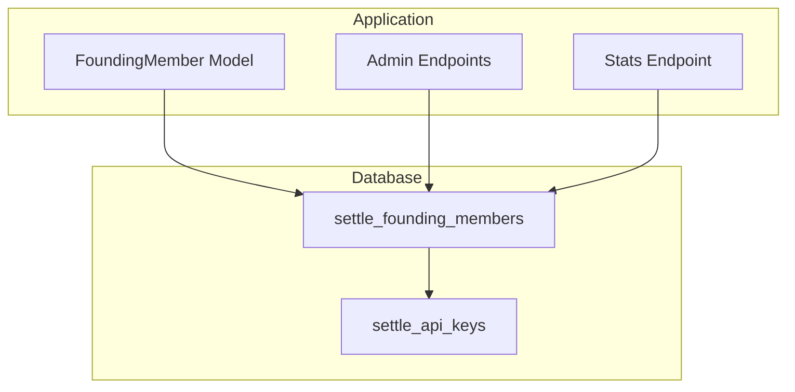
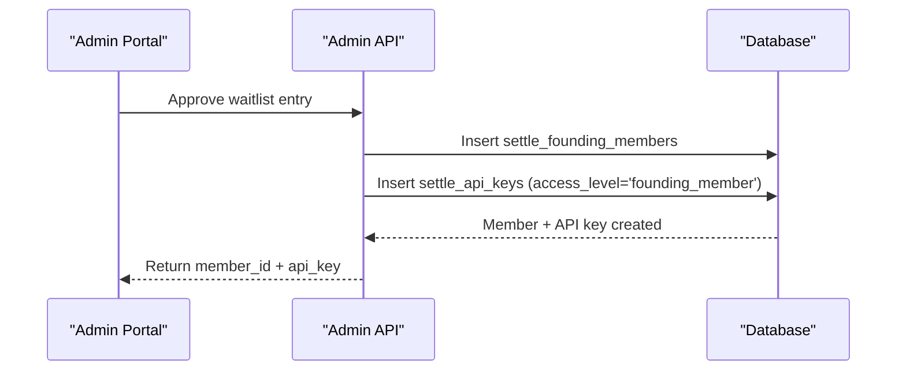
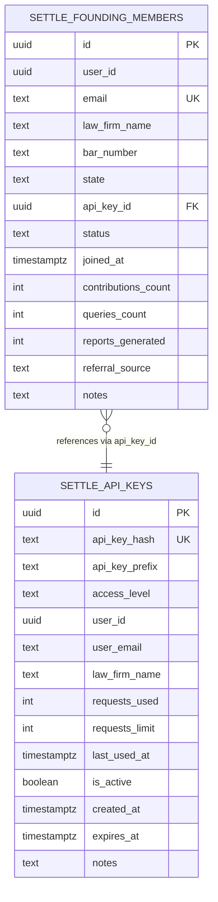
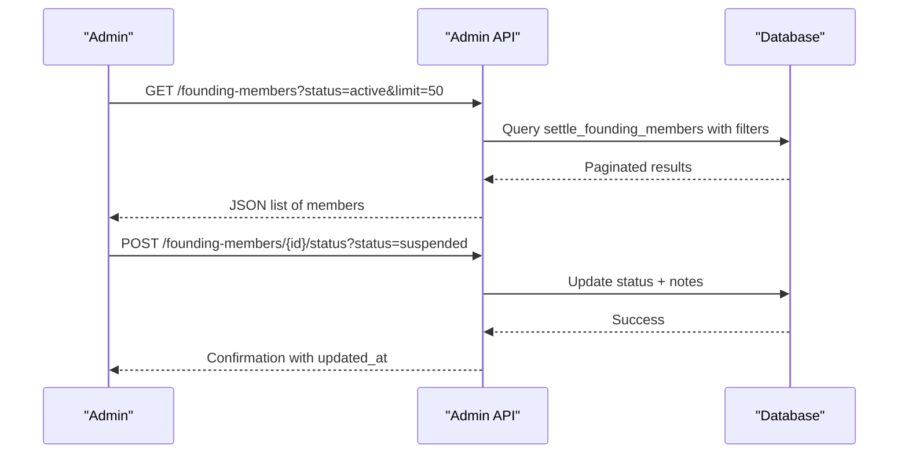
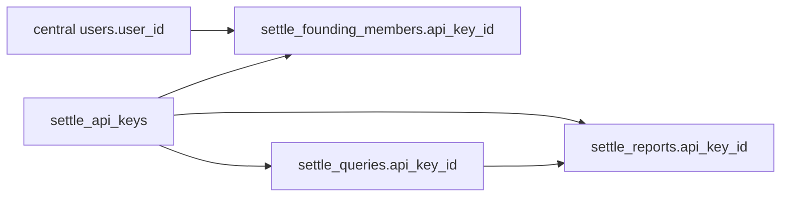

# Founding Members

<cite>
**Referenced Files in This Document**
- [settle_supabase.sql](file://database/schemas/settle_supabase.sql)
- [DATABASE_SCHEMA.md](file://docs/DATABASE_SCHEMA.md)
- [api_keys.py](file://app/models/api_keys.py)
- [admin.py](file://app/api/v1/endpoints/admin.py)
- [API_DOCUMENTATION.md](file://docs/API_DOCUMENTATION.md)
- [stats.py](file://app/api/v1/endpoints/stats.py)
</cite>

## Table of Contents
1. [Introduction](#introduction)
2. [Project Structure](#project-structure)
3. [Core Components](#core-components)
4. [Architecture Overview](#architecture-overview)
5. [Detailed Component Analysis](#detailed-component-analysis)
6. [Dependency Analysis](#dependency-analysis)
7. [Performance Considerations](#performance-considerations)
8. [Troubleshooting Guide](#troubleshooting-guide)
9. [Conclusion](#conclusion)

## Introduction
The Founding Member program grants 2,100 attorneys lifetime free access to the SETTLE service. The program is tracked in the settle_founding_members table, which ties members to their central user identity, assigns API keys for access, and maintains contribution analytics and membership lifecycle metadata. This document explains the schema, relationships, constraints, indexes, and administrative capabilities, and outlines workflows for onboarding, status management, and analytics reporting.

## Project Structure
The Founding Member program spans database schema definitions, Pydantic models, API endpoints, and documentation. The authoritative schema is defined in the Supabase SQL file, with supporting documentation and API contracts.

**Diagram sources**
- [settle_supabase.sql:200-243](file://database/schemas/settle_supabase.sql#L200-L243)
- [api_keys.py:78-101](file://app/models/api_keys.py#L78-L101)
- [admin.py:282-388](file://app/api/v1/endpoints/admin.py#L282-L388)
- [stats.py:52-81](file://app/api/v1/endpoints/stats.py#L52-L81)

**Section sources**
- [settle_supabase.sql:200-243](file://database/schemas/settle_supabase.sql#L200-L243)
- [DATABASE_SCHEMA.md:266-323](file://docs/DATABASE_SCHEMA.md#L266-L323)
- [api_keys.py:78-101](file://app/models/api_keys.py#L78-L101)
- [admin.py:282-388](file://app/api/v1/endpoints/admin.py#L282-L388)
- [stats.py:52-81](file://app/api/v1/endpoints/stats.py#L52-L81)

## Core Components
- settle_founding_members: Tracks Founding Members with user identity, API key linkage, status, membership timeline, and contribution analytics.
- settle_api_keys: Manages API keys and links them to Founding Members.
- FoundingMember model: Pydantic model representing Founding Member records in the application layer.
- Admin endpoints: Provide listing, status updates, and analytics for Founding Members.
- Stats endpoint: Aggregates Founding Member metrics for dashboards.

**Section sources**
- [settle_supabase.sql:200-243](file://database/schemas/settle_supabase.sql#L200-L243)
- [api_keys.py:78-101](file://app/models/api_keys.py#L78-L101)
- [admin.py:282-388](file://app/api/v1/endpoints/admin.py#L282-L388)
- [stats.py:52-81](file://app/api/v1/endpoints/stats.py#L52-L81)

## Architecture Overview
The Founding Member program integrates the following flows:
- Onboarding: Waitlist approval creates a Founding Member and an associated API key.
- Usage: Founding Members consume queries and generate reports via their API key.
- Analytics: Contribution counts and usage are tracked and exposed via views and endpoints.
- Administration: Admin endpoints manage member lists, status changes, and analytics.

**Diagram sources**
- [API_DOCUMENTATION.md:665-696](file://docs/API_DOCUMENTATION.md#L665-L696)
- [settle_supabase.sql:200-243](file://database/schemas/settle_supabase.sql#L200-L243)

## Detailed Component Analysis

### settle_founding_members table
- Purpose: Track Founding Members with lifetime free access.
- Key attributes:
  - user_id: Links to central users table (via SaaS Admin).
  - email: Unique identifier for the member.
  - law_firm_name, bar_number, state: Member profile and bar details.
  - api_key_id: References settle_api_keys; ON DELETE SET NULL preserves membership record while unlinking the key.
  - status: 'active', 'inactive', 'revoked' with a check constraint.
  - joined_at: Membership enrollment timestamp.
  - contributions_count, queries_count, reports_generated: Usage analytics counters with non-negative constraints.
  - referral_source, notes: Administrative metadata.
- Indexes: email, status, joined_at, user_id, api_key_id for efficient filtering and reporting.
- RLS: Enabled for privacy protection.

**Diagram sources**
- [settle_supabase.sql:200-243](file://database/schemas/settle_supabase.sql#L200-L243)
- [settle_supabase.sql:139-182](file://database/schemas/settle_supabase.sql#L139-L182)

**Section sources**
- [settle_supabase.sql:200-243](file://database/schemas/settle_supabase.sql#L200-L243)
- [DATABASE_SCHEMA.md:266-323](file://docs/DATABASE_SCHEMA.md#L266-L323)

### settle_api_keys table (program integration)
- Purpose: Manage API keys and associate them with Founding Members.
- Access level: 'founding_member' indicates lifetime free access.
- Usage tracking: requests_used, requests_limit (NULL means unlimited), last_used_at.
- RLS: Enabled for controlled access.

**Section sources**
- [settle_supabase.sql:139-182](file://database/schemas/settle_supabase.sql#L139-L182)
- [DATABASE_SCHEMA.md:182-263](file://docs/DATABASE_SCHEMA.md#L182-L263)

### FoundingMember model (application layer)
- Purpose: Pydantic model for Founding Member records in the API layer.
- Fields: Matches settle_founding_members with validated constraints (e.g., status defaults, non-negative counters).
- Benefits: Defines the response payload for Founding Member enrollment and operations.

**Section sources**
- [api_keys.py:78-101](file://app/models/api_keys.py#L78-L101)

### Admin endpoints for Founding Members
- List Founding Members: Retrieve paginated lists filtered by status.
- Get Founding Member details: Fetch member details for administrative review.
- Update status: Change status to active, inactive, or suspended with a reason.
- Analytics: Provide Founding Member statistics for dashboards.

**Diagram sources**
- [admin.py:282-388](file://app/api/v1/endpoints/admin.py#L282-L388)
- [API_DOCUMENTATION.md:589-625](file://docs/API_DOCUMENTATION.md#L589-L625)

**Section sources**
- [admin.py:282-388](file://app/api/v1/endpoints/admin.py#L282-L388)
- [API_DOCUMENTATION.md:589-625](file://docs/API_DOCUMENTATION.md#L589-L625)

### Usage tracking and analytics
- Contribution analytics: contributions_count increments with approved contributions.
- Query analytics: queries_count tracks settlement range queries per member.
- Report analytics: reports_generated counts generated reports.
- Stats endpoint: aggregates totals and counts from settle_founding_members and related tables.

**Section sources**
- [stats.py:52-81](file://app/api/v1/endpoints/stats.py#L52-L81)
- [DATABASE_SCHEMA.md:627-651](file://docs/DATABASE_SCHEMA.md#L627-L651)

### Membership tiers and benefits
- Founding Member tier: Unlimited access, free forever, with explicit benefits documented in the FoundingMemberResponse model.
- Integration: Access level 'founding_member' in settle_api_keys defines unlimited usage.

**Section sources**
- [api_keys.py:121-147](file://app/models/api_keys.py#L121-L147)
- [DATABASE_SCHEMA.md:182-263](file://docs/DATABASE_SCHEMA.md#L182-L263)

### Automatic API key assignment process
- On waitlist approval, the system creates a Founding Member record and an API key with access_level='founding_member'.
- The Founding Member record stores api_key_id, enabling usage tracking and analytics.

**Section sources**
- [API_DOCUMENTATION.md:665-696](file://docs/API_DOCUMENTATION.md#L665-L696)
- [settle_supabase.sql:200-243](file://database/schemas/settle_supabase.sql#L200-L243)

### Administrative oversight features
- Status management: Active, inactive, suspended states with reasons.
- Capacity tracking: Maximum of 2,100 members enforced by program design.
- Analytics dashboard: Provides total members, active members, and contribution totals.

**Section sources**
- [admin.py:282-388](file://app/api/v1/endpoints/admin.py#L282-L388)
- [stats.py:52-81](file://app/api/v1/endpoints/stats.py#L52-L81)

## Dependency Analysis
- settle_founding_members depends on:
  - settle_api_keys (foreign key via api_key_id with ON DELETE SET NULL).
  - central users table (referenced by user_id; no foreign key constraint to allow cross-database flexibility).
- settle_queries and settle_reports reference settle_api_keys for usage tracking.
- FoundingMember model aligns with settle_founding_members schema.

**Diagram sources**
- [settle_supabase.sql:200-243](file://database/schemas/settle_supabase.sql#L200-L243)
- [settle_supabase.sql:139-182](file://database/schemas/settle_supabase.sql#L139-L182)

**Section sources**
- [settle_supabase.sql:200-243](file://database/schemas/settle_supabase.sql#L200-L243)
- [DATABASE_SCHEMA.md:547-599](file://docs/DATABASE_SCHEMA.md#L547-L599)

## Performance Considerations
- Indexes on settle_founding_members:
  - email: Fast lookups by member email.
  - status: Efficient filtering by membership status.
  - joined_at: Sorting and cohort analysis over time.
  - user_id: Linkage to central users table.
  - api_key_id: Fast joins to API keys for usage analytics.
- Check constraints prevent negative counters and invalid statuses, ensuring data integrity and predictable analytics.

**Section sources**
- [settle_supabase.sql:238-243](file://database/schemas/settle_supabase.sql#L238-L243)
- [DATABASE_SCHEMA.md:692-696](file://docs/DATABASE_SCHEMA.md#L692-L696)

## Troubleshooting Guide
- Status validation failures: Ensure status values are one of 'active', 'inactive', 'revoked'.
- Negative counter anomalies: Verify that contributions_count, queries_count, and reports_generated are non-negative.
- API key linkage issues: Confirm api_key_id references a valid settle_api_keys record; ON DELETE SET NULL preserves membership records when keys are removed.
- Privacy and access: RLS policies grant service_role full access and authenticated users read access to their own API key info.

**Section sources**
- [settle_supabase.sql:229-236](file://database/schemas/settle_supabase.sql#L229-L236)
- [settle_supabase.sql:402-435](file://database/schemas/settle_supabase.sql#L402-L435)

## Conclusion
The settle_founding_members table provides a robust foundation for managing the Founding Member program. Its schema enforces data integrity, integrates seamlessly with settle_api_keys for access control and usage tracking, and supports administrative oversight through indexes, constraints, and dedicated endpoints. Together with the FoundingMember model and admin APIs, it enables scalable onboarding, status management, and analytics for up to 2,100 attorneys receiving lifetime free access.