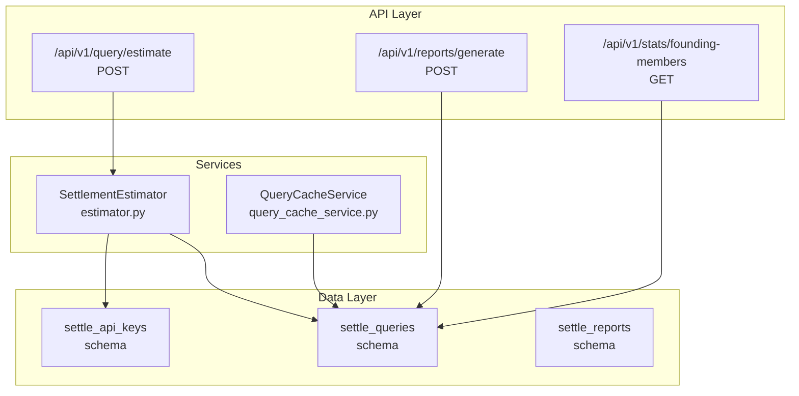
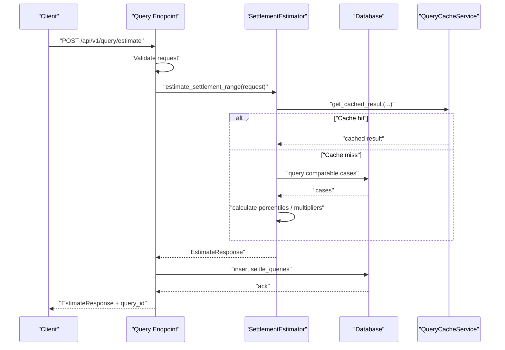
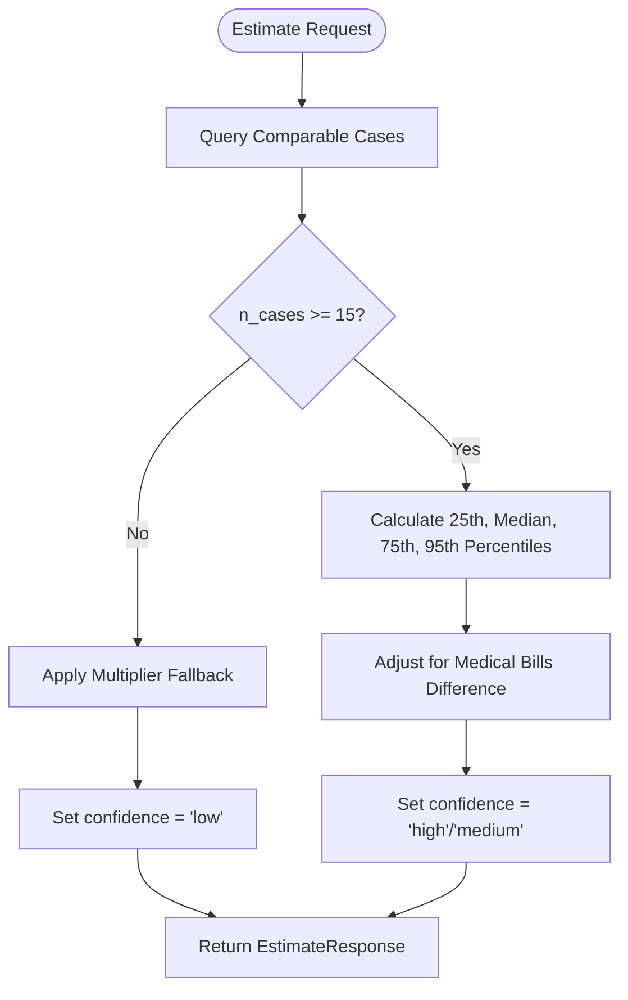
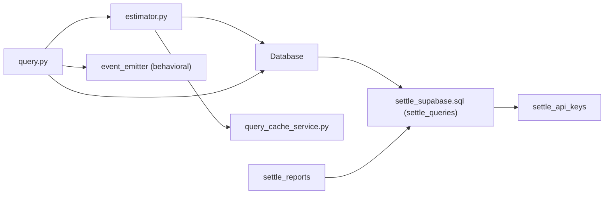

# Queries

<cite>
**Referenced Files in This Document**
- [settle_supabase.sql](file://database/schemas/settle_supabase.sql)
- [CREATE_SETTLE_DATABASE.sql](file://database/CREATE_SETTLE_DATABASE.sql)
- [query.py](file://app/api/v1/endpoints/query.py)
- [estimator.py](file://app/services/estimator.py)
- [query_cache_service.py](file://app/services/query_cache_service.py)
- [case_bank.py](file://app/models/case_bank.py)
- [stats.py](file://app/api/v1/endpoints/stats.py)
- [reports.py](file://app/api/v1/endpoints/reports.py)
- [DATABASE_SCHEMA.md](file://docs/DATABASE_SCHEMA.md)
- [INTEGRATION_GUIDE.md](file://docs/INTEGRATION_GUIDE.md)
</cite>

## Table of Contents
1. [Introduction](#introduction)
2. [Project Structure](#project-structure)
3. [Core Components](#core-components)
4. [Architecture Overview](#architecture-overview)
5. [Detailed Component Analysis](#detailed-component-analysis)
6. [Dependency Analysis](#dependency-analysis)
7. [Performance Considerations](#performance-considerations)
8. [Troubleshooting Guide](#troubleshooting-guide)
9. [Conclusion](#conclusion)
10. [Appendices](#appendices)

## Introduction
This document describes the settle_queries table used to track settlement range estimation queries for analytics and billing. It covers the schema, query parameter structure, analytical results, confidence scoring, performance metrics, indexes, constraints, and billing implications through API key association. It also outlines query execution patterns, result interpretation, and analytics reporting workflows.

## Project Structure
The settle_queries table is part of the central Supabase schema and is complemented by:
- API endpoints that accept estimation requests and return percentile-based results
- An estimator service that calculates ranges and assigns confidence
- A query cache service that improves performance for repeated queries
- Statistics and reporting endpoints that leverage settle_queries for analytics and billing

**Diagram sources**
- [query.py:20-98](file://app/api/v1/endpoints/query.py#L20-L98)
- [estimator.py:60-116](file://app/services/estimator.py#L60-L116)
- [query_cache_service.py:64-154](file://app/services/query_cache_service.py#L64-L154)
- [settle_supabase.sql:249-284](file://database/schemas/settle_supabase.sql#L249-L284)

**Section sources**
- [settle_supabase.sql:249-284](file://database/schemas/settle_supabase.sql#L249-L284)
- [query.py:20-98](file://app/api/v1/endpoints/query.py#L20-L98)
- [estimator.py:60-116](file://app/services/estimator.py#L60-L116)
- [query_cache_service.py:64-154](file://app/services/query_cache_service.py#L64-L154)
- [stats.py:76-82](file://app/api/v1/endpoints/stats.py#L76-L82)
- [reports.py:82-99](file://app/api/v1/endpoints/reports.py#L82-L99)

## Core Components
- settle_queries: Stores query parameters, percentile-based results, confidence, API key association, timestamps, and response time for analytics and billing.
- API endpoints: Accept estimation requests, validate inputs, compute results, and persist query records.
- Estimator service: Implements percentile-based calculation and multiplier fallback, assigning confidence levels.
- Query cache service: Caches results for 24 hours keyed by normalized parameters to reduce latency and load.
- Statistics and reporting: Use settle_queries for analytics dashboards and billing events.

**Section sources**
- [settle_supabase.sql:249-284](file://database/schemas/settle_supabase.sql#L249-L284)
- [query.py:20-98](file://app/api/v1/endpoints/query.py#L20-L98)
- [estimator.py:60-116](file://app/services/estimator.py#L60-L116)
- [query_cache_service.py:64-154](file://app/services/query_cache_service.py#L64-L154)
- [stats.py:76-82](file://app/api/v1/endpoints/stats.py#L76-L82)
- [reports.py:82-99](file://app/api/v1/endpoints/reports.py#L82-L99)

## Architecture Overview
The query lifecycle:
1. Client sends an estimation request to the API endpoint.
2. Request is validated and passed to the estimator service.
3. Estimator computes percentile ranges and confidence, optionally using cached results.
4. The service persists a settle_queries record with parameters, results, confidence, response time, and API key.
5. Reporting and statistics endpoints consume settle_queries for analytics and billing.

**Diagram sources**
- [query.py:20-98](file://app/api/v1/endpoints/query.py#L20-L98)
- [estimator.py:60-116](file://app/services/estimator.py#L60-L116)
- [query_cache_service.py:64-154](file://app/services/query_cache_service.py#L64-L154)
- [settle_supabase.sql:249-284](file://database/schemas/settle_supabase.sql#L249-L284)

## Detailed Component Analysis

### settle_queries Schema
- Purpose: Track settlement range queries for analytics and billing.
- Primary key: id (UUID).
- Query parameters:
  - injury_type: Text (NOT NULL)
  - state: Text (NOT NULL)
  - county: Text (nullable)
  - medical_bills: Numeric (nullable)
- Analytical results:
  - percentile_25: Numeric
  - median: Numeric
  - percentile_75: Numeric
  - percentile_95: Numeric
  - n_cases: Integer
  - confidence: Text ('low', 'medium', 'high')
- API key association:
  - api_key_id: UUID referencing settle_api_keys.id with ON DELETE SET NULL
- Performance metrics:
  - queried_at: TIMESTAMPTZ (default now)
  - response_time_ms: Integer (non-negative)
- Constraints:
  - valid_confidence: CHECK (confidence IN ('low','medium','high'))
  - valid_response_time: CHECK (response_time_ms >= 0)
- Indexes:
  - idx_settle_queries_injury
  - idx_settle_queries_state
  - idx_settle_queries_queried_at
  - idx_settle_queries_api_key

**Section sources**
- [settle_supabase.sql:249-284](file://database/schemas/settle_supabase.sql#L249-L284)
- [DATABASE_SCHEMA.md:349-421](file://docs/DATABASE_SCHEMA.md#L349-L421)

### Query Parameter Structure
- Jurisdiction: county + state (e.g., "Maricopa County, AZ"), validated by the API request model.
- Case type: Drop-down selection.
- Injury categories: Multi-select list.
- Medical bills: Numeric amount used for percentile adjustments and multiplier fallback.
- Optional filters: primary_diagnosis, treatment_type, duration_of_treatment, imaging_findings, lost_wages, policy_limits, defendant_category.

These parameters are used to match comparable cases and compute settlement ranges.

**Section sources**
- [case_bank.py:69-93](file://app/models/case_bank.py#L69-L93)
- [estimator.py:118-146](file://app/services/estimator.py#L118-L146)

### Analytical Results and Percentile-Based Format
- Percentile-based results:
  - percentile_25, median, percentile_75, percentile_95
- Case count aggregation: n_cases indicates the number of comparable cases used.
- Confidence scoring:
  - high: 30+ cases
  - medium: 15–29 cases
  - low: <15 cases (fallback to multipliers)
- Adjustment logic:
  - If current case’s medical bills differ significantly from the average, apply a proportional adjustment (partial weighting) to percentiles.

**Diagram sources**
- [estimator.py:79-116](file://app/services/estimator.py#L79-L116)
- [estimator.py:148-210](file://app/services/estimator.py#L148-L210)
- [estimator.py:212-262](file://app/services/estimator.py#L212-L262)

**Section sources**
- [estimator.py:79-116](file://app/services/estimator.py#L79-L116)
- [estimator.py:148-210](file://app/services/estimator.py#L148-L210)
- [estimator.py:212-262](file://app/services/estimator.py#L212-L262)

### Confidence Scoring Methodology
- Thresholds:
  - high: ≥30 cases
  - medium: 15–29 cases
  - low: <15 cases (fallback to multipliers)
- Multiplier fallback:
  - Severity levels derived from medical bills
  - Multipliers applied to medical bills to produce conservative ranges

**Section sources**
- [estimator.py:44-49](file://app/services/estimator.py#L44-L49)
- [estimator.py:212-262](file://app/services/estimator.py#L212-L262)

### Performance Metrics and Tracking
- Response time tracking:
  - response_time_ms is captured during estimation and persisted to settle_queries.
- Performance indicators:
  - Average response time and sample size are used in analytics views.
- Query cache:
  - QueryCacheService caches results for 24 hours keyed by normalized parameters to reduce latency and database load.

**Section sources**
- [estimator.py:103-104](file://app/services/estimator.py#L103-L104)
- [query_cache_service.py:43](file://app/services/query_cache_service.py#L43)
- [query_cache_service.py:64-154](file://app/services/query_cache_service.py#L64-L154)

### API Key Association and Billing Implications
- api_key_id links queries to API keys for usage tracking and billing attribution.
- ON DELETE SET NULL ensures historical query records remain intact even if the API key is deleted.
- Billing events:
  - settlement_query_run billing event emitted with sample size and confidence for usage accounting.

**Section sources**
- [settle_supabase.sql:267](file://database/schemas/settle_supabase.sql#L267)
- [query.py:84-97](file://app/api/v1/endpoints/query.py#L84-L97)
- [billing_event_service.py:271-285](file://app/services/billing_event_service.py#L271-L285)

### Indexes and Query Patterns
- Indexes:
  - injury_type, state, queried_at, api_key_id
- Typical analytics queries:
  - Daily aggregation by injury_type and state
  - Confidence distribution over time
  - Average response time and sample size trends

**Section sources**
- [settle_supabase.sql:281-284](file://database/schemas/settle_supabase.sql#L281-L284)
- [DATABASE_SCHEMA.md:386-399](file://docs/DATABASE_SCHEMA.md#L386-L399)

### Constraint Validation
- Confidence values constrained to ('low','medium','high').
- Response time constrained to be non-negative.
- Jurisdiction format validated at the API boundary.

**Section sources**
- [settle_supabase.sql:274-277](file://database/schemas/settle_supabase.sql#L274-L277)
- [case_bank.py:86-92](file://app/models/case_bank.py#L86-L92)

### Analytics Reporting Workflows
- Statistics endpoint:
  - Counts total queries from settle_queries for public stats.
- Reports endpoint:
  - Retrieves settle_queries data to populate report metadata when generating reports.

**Section sources**
- [stats.py:76-82](file://app/api/v1/endpoints/stats.py#L76-L82)
- [reports.py:82-99](file://app/api/v1/endpoints/reports.py#L82-L99)

## Dependency Analysis
- API endpoint depends on:
  - DataValidator for request validation
  - SettlementEstimator for computation
  - SettleEventEmitter for behavioral events
- Estimator depends on:
  - Database connection to query comparable cases
  - QueryCacheService for caching
- settle_queries depends on:
  - settle_api_keys for api_key_id foreign key
  - settle_reports via foreign key for report linkage

**Diagram sources**
- [query.py:20-98](file://app/api/v1/endpoints/query.py#L20-L98)
- [estimator.py:60-116](file://app/services/estimator.py#L60-L116)
- [query_cache_service.py:64-154](file://app/services/query_cache_service.py#L64-L154)
- [settle_supabase.sql:249-284](file://database/schemas/settle_supabase.sql#L249-L284)

**Section sources**
- [query.py:20-98](file://app/api/v1/endpoints/query.py#L20-L98)
- [estimator.py:60-116](file://app/services/estimator.py#L60-L116)
- [query_cache_service.py:64-154](file://app/services/query_cache_service.py#L64-L154)
- [settle_supabase.sql:249-284](file://database/schemas/settle_supabase.sql#L249-L284)

## Performance Considerations
- Use indexes on frequently filtered columns (injury_type, state, queried_at, api_key_id) to speed up analytics queries.
- Leverage the 24-hour query cache to reduce repeated computations and database load.
- Monitor response_time_ms to identify slow queries and optimize estimator logic or caching strategy.
- Consider partitioning or materialized views for heavy analytics workloads.

[No sources needed since this section provides general guidance]

## Troubleshooting Guide
- Validation failures:
  - Ensure jurisdiction format follows "County, ST".
  - Confirm injury_category is non-empty and medical_bills is non-negative.
- Missing comparable cases:
  - Expect low confidence and multiplier fallback when n_cases < 15.
- Cache misses:
  - Verify normalized parameters match (case/state normalization).
- Analytics discrepancies:
  - Check indexes exist and are up-to-date.
  - Confirm queried_at timezone alignment for daily aggregations.

**Section sources**
- [case_bank.py:86-92](file://app/models/case_bank.py#L86-L92)
- [estimator.py:212-262](file://app/services/estimator.py#L212-L262)
- [query_cache_service.py:64-154](file://app/services/query_cache_service.py#L64-L154)

## Conclusion
The settle_queries table provides a robust foundation for tracking settlement range estimation queries, enabling analytics, performance monitoring, and billing attribution. Its schema, combined with percentile-based estimation and confidence scoring, supports reliable insights for legal professionals. Proper indexing, caching, and validation ensure scalability and accuracy.

[No sources needed since this section summarizes without analyzing specific files]

## Appendices

### Example Execution Patterns
- Typical request payload:
  - jurisdiction: "Maricopa County, AZ"
  - case_type: "Motor Vehicle Accident"
  - injury_category: ["Spinal Injury"]
  - medical_bills: 85000.00
- Response fields:
  - percentile_25, median, percentile_75, percentile_95, n_cases, confidence, response_time_ms

**Section sources**
- [INTEGRATION_GUIDE.md:900-942](file://docs/INTEGRATION_GUIDE.md#L900-L942)
- [case_bank.py:69-93](file://app/models/case_bank.py#L69-L93)

### Result Interpretation Guidelines
- High confidence (n_cases ≥ 30): Percentile ranges reflect actual comparable cases.
- Medium confidence (15–29 cases): Percentile ranges with moderate reliability.
- Low confidence (<15 cases): Multiplier-derived ranges; use cautiously and note limitations.

**Section sources**
- [estimator.py:44-49](file://app/services/estimator.py#L44-L49)
- [estimator.py:194-200](file://app/services/estimator.py#L194-L200)