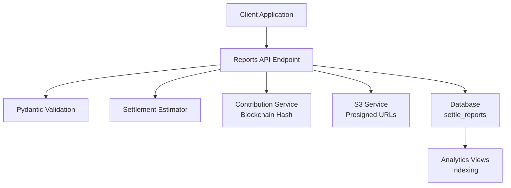
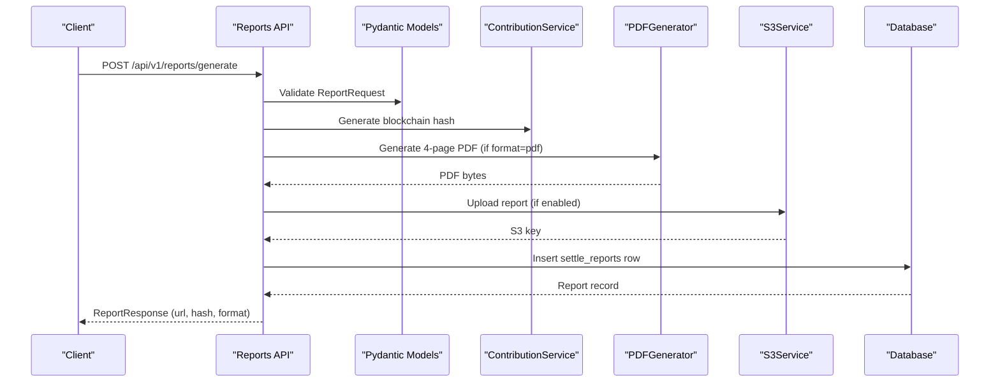
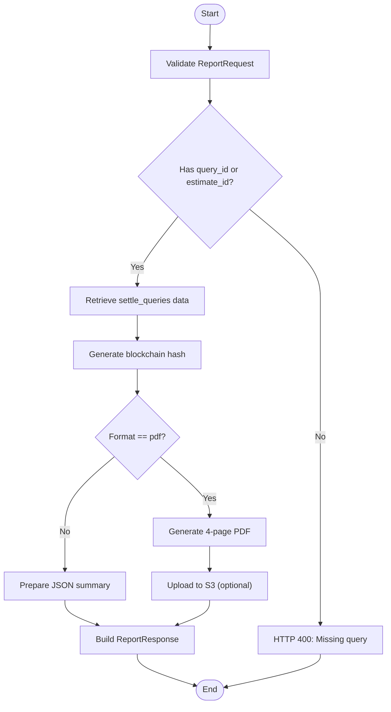
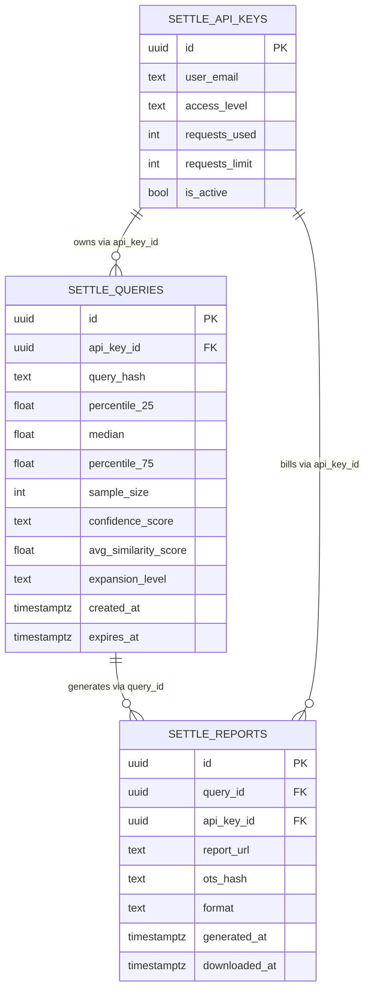

# Reports

<cite>
**Referenced Files in This Document**
- [reports.py](file://app/models/reports.py)
- [reports.py](file://app/api/v1/endpoints/reports.py)
- [pdf_generator.py](file://app/services/reports/pdf_generator.py)
- [s3_service.py](file://app/services/storage/s3_service.py)
- [reports.py](file://alembic/versions/579516014f19_add_settlement_reports_and_query_cache_.py)
- [CREATE_SETTLE_DATABASE.sql](file://database/CREATE_SETTLE_DATABASE.sql)
- [DATABASE_SCHEMA.md](file://docs/DATABASE_SCHEMA.md)
- [billing_event_service.py](file://app/services/billing_event_service.py)
- [api_keys.py](file://app/models/api_keys.py)
</cite>

## Table of Contents
1. [Introduction](#introduction)
2. [Project Structure](#project-structure)
3. [Core Components](#core-components)
4. [Architecture Overview](#architecture-overview)
5. [Detailed Component Analysis](#detailed-component-analysis)
6. [Dependency Analysis](#dependency-analysis)
7. [Performance Considerations](#performance-considerations)
8. [Troubleshooting Guide](#troubleshooting-guide)
9. [Conclusion](#conclusion)

## Introduction
This document describes the settle_reports table and the end-to-end report generation system for professional delivery. It covers the complete schema, query associations, report delivery, blockchain verification, multi-format outputs, billing integration, and analytics indexing. It also documents the relationships with settle_queries and settle_api_keys, and provides examples of report generation workflows, delivery mechanisms, and verification processes.

## Project Structure
The report system spans several layers:
- API endpoints define the contract and orchestrate report generation.
- Pydantic models define request/response schemas and validation.
- Services handle PDF generation, storage, and blockchain hashing.
- Database schema defines the settle_reports table and indexes.
- Billing events track usage for API key billing.

**Diagram sources**
- [reports.py:23-198](file://app/api/v1/endpoints/reports.py#L23-L198)
- [reports.py:57-100](file://app/models/reports.py#L57-L100)
- [pdf_generator.py:18-86](file://app/services/reports/pdf_generator.py#L18-L86)
- [s3_service.py:60-155](file://app/services/storage/s3_service.py#L60-L155)
- [CREATE_SETTLE_DATABASE.sql:291-316](file://database/CREATE_SETTLE_DATABASE.sql#L291-L316)

**Section sources**
- [reports.py:1-259](file://app/api/v1/endpoints/reports.py#L1-L259)
- [reports.py:1-121](file://app/models/reports.py#L1-L121)
- [pdf_generator.py:1-622](file://app/services/reports/pdf_generator.py#L1-L622)
- [s3_service.py:1-317](file://app/services/storage/s3_service.py#L1-L317)
- [CREATE_SETTLE_DATABASE.sql:285-319](file://database/CREATE_SETTLE_DATABASE.sql#L285-L319)

## Core Components
- settle_reports table: Stores generated reports with query linkage, delivery URL, blockchain hash, format, billing association, timestamps, and indexes.
- ReportRequest/ReportResponse models: Define input/output contracts and enforce format validation.
- PDFGenerator: Produces 4-page PDFs with compliance and blockchain verification.
- S3Service: Handles upload, presigned URL generation, and lifecycle cleanup.
- Reports API: Orchestrates generation, emits billing events, and returns delivery metadata.

**Section sources**
- [DATABASE_SCHEMA.md:425-463](file://docs/DATABASE_SCHEMA.md#L425-L463)
- [CREATE_SETTLE_DATABASE.sql:291-316](file://database/CREATE_SETTLE_DATABASE.sql#L291-L316)
- [reports.py:40-100](file://app/models/reports.py#L40-L100)
- [pdf_generator.py:18-86](file://app/services/reports/pdf_generator.py#L18-L86)
- [s3_service.py:60-155](file://app/services/storage/s3_service.py#L60-L155)
- [reports.py:23-198](file://app/api/v1/endpoints/reports.py#L23-L198)

## Architecture Overview
The report generation pipeline integrates query data, blockchain hashing, PDF generation, and secure delivery.

**Diagram sources**
- [reports.py:23-198](file://app/api/v1/endpoints/reports.py#L23-L198)
- [reports.py:57-100](file://app/models/reports.py#L57-L100)
- [pdf_generator.py:41-86](file://app/services/reports/pdf_generator.py#L41-L86)
- [s3_service.py:60-155](file://app/services/storage/s3_service.py#L60-L155)
- [CREATE_SETTLE_DATABASE.sql:291-316](file://database/CREATE_SETTLE_DATABASE.sql#L291-L316)

## Detailed Component Analysis

### settle_reports Schema
- Primary key: id (UUID)
- Foreign keys:
  - query_id → settle_queries(id) with ON DELETE SET NULL
  - api_key_id → settle_api_keys(id) with ON DELETE SET NULL
- Columns:
  - report_url: TEXT (delivery location)
  - ots_hash: TEXT (OpenTimestamps hash for immutable verification)
  - format: TEXT with default 'pdf' and CHECK constraint for values 'pdf', 'json', 'html'
  - generated_at: TIMESTAMPTZ (default now())
  - downloaded_at: TIMESTAMPTZ (nullable)
- Indexes:
  - idx_settle_reports_query on query_id
  - idx_settle_reports_api_key on api_key_id
  - idx_settle_reports_generated on generated_at

Constraints and relationships ensure referential integrity and enable efficient analytics.

**Section sources**
- [DATABASE_SCHEMA.md:425-463](file://docs/DATABASE_SCHEMA.md#L425-L463)
- [DATABASE_SCHEMA.md:567-597](file://docs/DATABASE_SCHEMA.md#L567-L597)
- [CREATE_SETTLE_DATABASE.sql:291-316](file://database/CREATE_SETTLE_DATABASE.sql#L291-L316)

### ReportRequest and ReportResponse Models
- ReportRequest enforces format validation to 'pdf', 'json', or 'html'.
- ReportResponse includes report_id, query_id, report_url, ots_hash, format, generated_at, and optional summary for JSON format.

These models govern API input/output contracts and validation.

**Section sources**
- [reports.py:57-100](file://app/models/reports.py#L57-L100)

### Multi-format Report Generation
- PDF: 4-page professional report with compliance and blockchain verification.
- JSON: Structured summary payload for programmatic consumption.
- HTML: Not generated by the current implementation; format defaults to 'pdf'.

The system supports flexible delivery based on client needs while maintaining a consistent schema.

**Section sources**
- [reports.py:49-99](file://app/models/reports.py#L49-L99)
- [pdf_generator.py:18-86](file://app/services/reports/pdf_generator.py#L18-L86)

### Blockchain Timestamp Integration (OpenTimestamps)
- The ContributionService generates a blockchain hash for each report using a canonical JSON representation and SHA-256 hashing.
- The resulting ots_hash is embedded in the PDF and returned in the response.
- The PDF includes a QR code and hash display for verification via opentimestamps.org.

Note: The current implementation uses a placeholder hash; production would integrate with OpenTimestamps for immutable verification.

**Section sources**
- [reports.py:126-135](file://app/api/v1/endpoints/reports.py#L126-L135)
- [pdf_generator.py:471-481](file://app/services/reports/pdf_generator.py#L471-L481)
- [contributor.py:127-173](file://app/services/contributor.py#L127-L173)

### Storage Architecture and Delivery
- S3Service uploads reports with date-based folder structure and encryption at rest.
- Presigned URLs are generated with 7-day expiration for secure delivery.
- Lifecycle management includes automatic cleanup of old reports and storage statistics.

This ensures scalable, secure, and auditable report delivery.

**Section sources**
- [s3_service.py:60-155](file://app/services/storage/s3_service.py#L60-L155)
- [s3_service.py:183-262](file://app/services/storage/s3_service.py#L183-L262)

### Download Tracking and Billing Implications
- The settle_reports schema includes generated_at and downloaded_at for tracking.
- Billing events are emitted for report generation, enabling API key billing attribution.
- The api_key_id column links reports to billing records for analytics and monetization.

**Section sources**
- [DATABASE_SCHEMA.md:425-463](file://docs/DATABASE_SCHEMA.md#L425-L463)
- [billing_event_service.py:288-302](file://app/services/billing_event_service.py#L288-L302)
- [api_keys.py:11-40](file://app/models/api_keys.py#L11-L40)

### Report Generation Workflow
- Client submits ReportRequest with either query_id or legacy estimate_id.
- The API retrieves query data and constructs an estimate response.
- A blockchain hash is generated for immutable verification.
- For PDF format, the PDFGenerator produces a 4-page report; JSON returns structured summary.
- The API returns ReportResponse with report_url and ots_hash.

**Diagram sources**
- [reports.py:23-198](file://app/api/v1/endpoints/reports.py#L23-L198)
- [reports.py:57-100](file://app/models/reports.py#L57-L100)
- [pdf_generator.py:41-86](file://app/services/reports/pdf_generator.py#L41-L86)
- [s3_service.py:60-155](file://app/services/storage/s3_service.py#L60-L155)

**Section sources**
- [reports.py:23-198](file://app/api/v1/endpoints/reports.py#L23-L198)

### Delivery Mechanisms
- For PDF: S3Service uploads and returns a presigned URL with 7-day expiry.
- For JSON: Response includes summary payload without storage requirement.
- The report_url column stores the delivery location for auditing and analytics.

**Section sources**
- [s3_service.py:112-155](file://app/services/storage/s3_service.py#L112-L155)
- [reports.py:80-99](file://app/models/reports.py#L80-L99)

### Verification Processes
- The PDF embeds a QR code and blockchain hash for verification.
- Clients can scan the QR code or paste the hash into opentimestamps.org to verify immutability.
- The ots_hash is stored in settle_reports for auditability.

**Section sources**
- [pdf_generator.py:471-481](file://app/services/reports/pdf_generator.py#L471-L481)
- [reports.py:48-86](file://app/models/reports.py#L48-L86)

## Dependency Analysis
The report system depends on:
- settle_queries: Provides query context for estimates and formatting.
- settle_api_keys: Links reports to billing and usage tracking.
- S3 storage: Handles secure delivery and lifecycle management.
- OpenTimestamps: Provides immutable verification (placeholder implementation).

**Diagram sources**
- [DATABASE_SCHEMA.md:567-597](file://docs/DATABASE_SCHEMA.md#L567-L597)
- [CREATE_SETTLE_DATABASE.sql:291-316](file://database/CREATE_SETTLE_DATABASE.sql#L291-L316)

**Section sources**
- [DATABASE_SCHEMA.md:547-597](file://docs/DATABASE_SCHEMA.md#L547-L597)
- [CREATE_SETTLE_DATABASE.sql:291-316](file://database/CREATE_SETTLE_DATABASE.sql#L291-L316)

## Performance Considerations
- Indexes on query_id, api_key_id, and generated_at enable efficient filtering and analytics.
- PDF generation is CPU-bound; consider offloading to dedicated workers for scale.
- S3 uploads and presigned URL generation are network-bound; tune concurrency and retry policies.
- JSON format avoids storage overhead, reducing latency and cost.

[No sources needed since this section provides general guidance]

## Troubleshooting Guide
- Format validation errors: Ensure format is one of 'pdf', 'json', 'html'.
- Missing query: Provide either query_id or estimate_id; otherwise, the API returns HTTP 400.
- S3 disabled: If AWS credentials are missing, uploads are mocked; presigned URLs are simulated.
- Blockchain hash placeholder: The current implementation returns a placeholder; integrate OpenTimestamps for production verification.
- Billing events: Confirm billing event emission for report generation to ensure accurate API key billing.

**Section sources**
- [reports.py:70-77](file://app/models/reports.py#L70-L77)
- [reports.py:119-124](file://app/api/v1/endpoints/reports.py#L119-L124)
- [s3_service.py:27-58](file://app/services/storage/s3_service.py#L27-L58)
- [contributor.py:164-173](file://app/services/contributor.py#L164-L173)
- [billing_event_service.py:288-302](file://app/services/billing_event_service.py#L288-L302)

## Conclusion
The settle_reports table and associated services provide a robust, scalable, and compliant report generation system. It supports multi-format outputs, secure delivery, immutable verification, and billing attribution. The schema and indexes enable efficient analytics, while the modular design allows for future enhancements such as HTML generation and production OpenTimestamps integration.