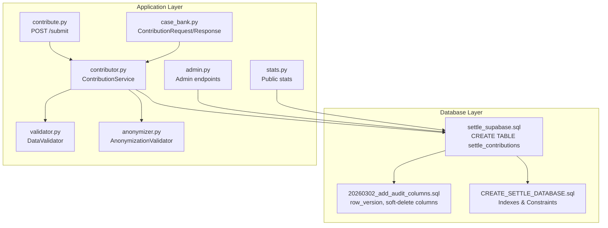
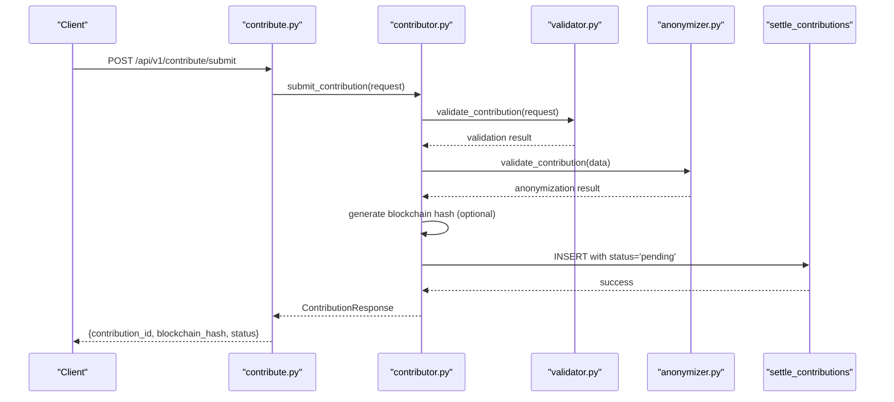
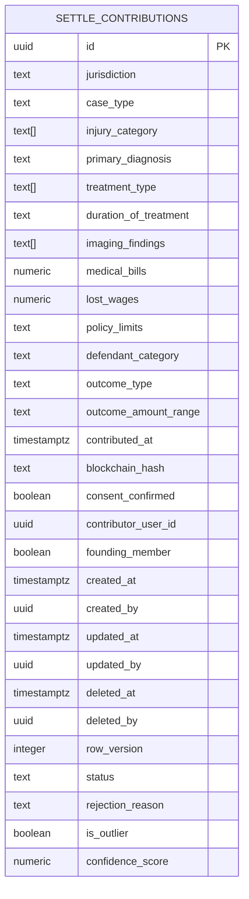
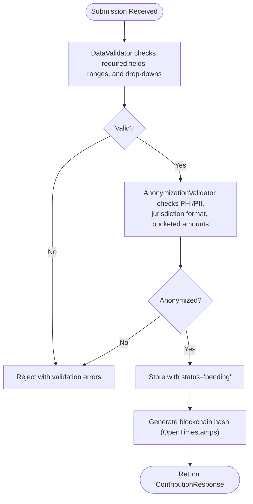
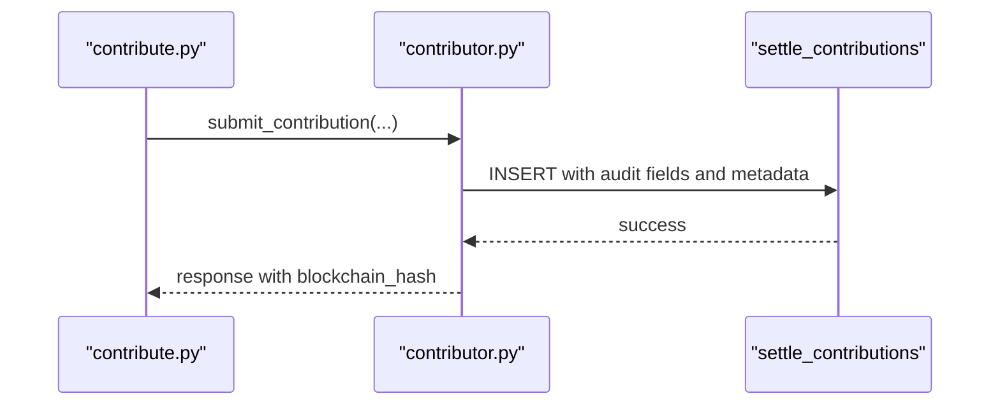
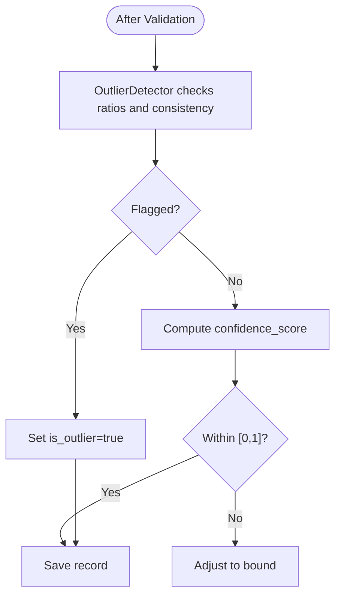
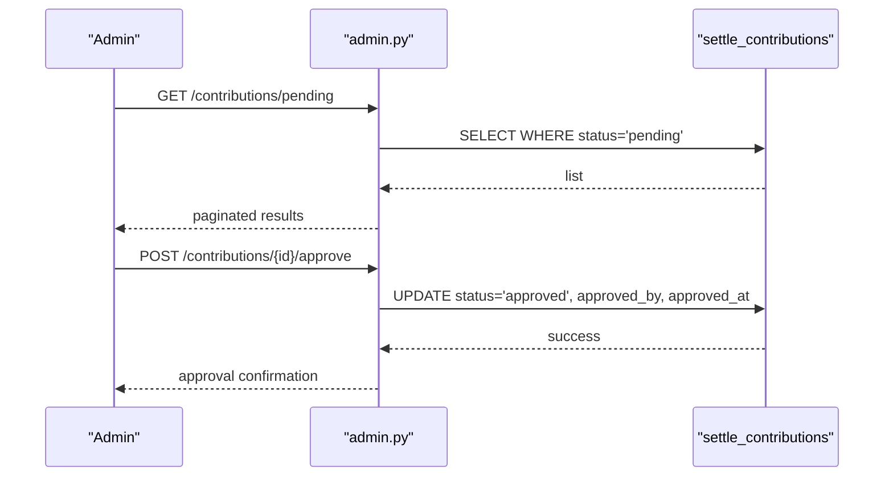
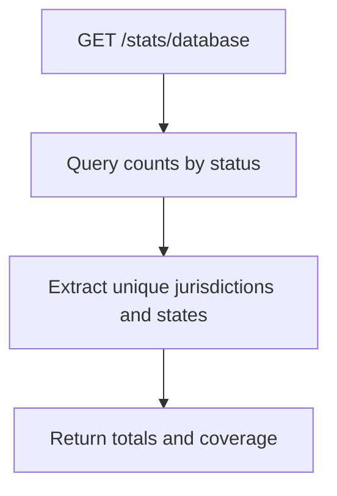
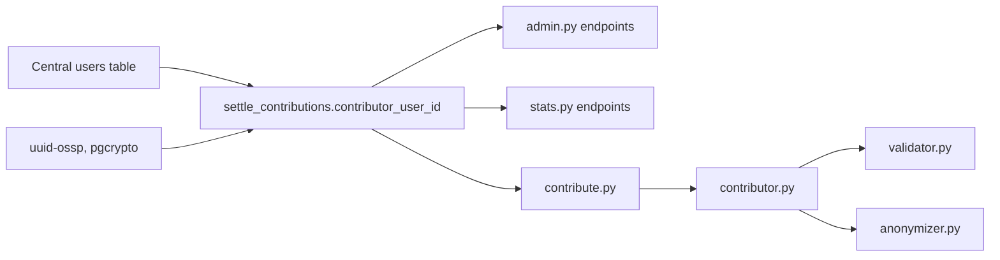

# Settle Contributions

<cite>
**Referenced Files in This Document**
- [settle_supabase.sql](file://database/schemas/settle_supabase.sql)
- [CREATE_SETTLE_DATABASE.sql](file://database/CREATE_SETTLE_DATABASE.sql)
- [20260302_add_audit_columns.sql](file://database/migrations/20260302_add_audit_columns.sql)
- [SUPABASE_SETUP_GUIDE.md](file://database/SUPABASE_SETUP_GUIDE.md)
- [DATABASE_SCHEMA.md](file://docs/DATABASE_SCHEMA.md)
- [contribute.py](file://app/api/v1/endpoints/contribute.py)
- [admin.py](file://app/api/v1/endpoints/admin.py)
- [stats.py](file://app/api/v1/endpoints/stats.py)
- [contributor.py](file://app/services/contributor.py)
- [validator.py](file://app/services/validator.py)
- [anonymizer.py](file://app/services/anonymizer.py)
- [case_bank.py](file://app/models/case_bank.py)
</cite>

## Table of Contents
1. [Introduction](#introduction)
2. [Project Structure](#project-structure)
3. [Core Components](#core-components)
4. [Architecture Overview](#architecture-overview)
5. [Detailed Component Analysis](#detailed-component-analysis)
6. [Dependency Analysis](#dependency-analysis)
7. [Performance Considerations](#performance-considerations)
8. [Troubleshooting Guide](#troubleshooting-guide)
9. [Conclusion](#conclusion)
10. [Appendices](#appendices)

## Introduction
This document provides comprehensive documentation for the settle_contributions table, the core data repository for anonymous settlement data submissions. It explains the complete schema, compliance architecture ensuring zero PHI/PII, audit and contributor tracking, metadata and soft-delete mechanisms, indexes and constraints, and typical contribution workflows including data quality controls and filtering processes.

## Project Structure
The settle_contributions table is defined in the database schema and integrated with FastAPI endpoints and services that enforce anonymization, validation, and compliance. Supporting files include:
- Database schema and migration scripts
- API endpoints for contribution submission and administrative workflows
- Services for validation, anonymization, and blockchain hashing
- Pydantic models for request/response validation

**Diagram sources**
- [settle_supabase.sql:31-113](file://database/schemas/settle_supabase.sql#L31-L113)
- [CREATE_SETTLE_DATABASE.sql:116-137](file://database/CREATE_SETTLE_DATABASE.sql#L116-L137)
- [20260302_add_audit_columns.sql:134-150](file://database/migrations/20260302_add_audit_columns.sql#L134-L150)
- [contribute.py:51-125](file://app/api/v1/endpoints/contribute.py#L51-L125)
- [admin.py:31-197](file://app/api/v1/endpoints/admin.py#L31-L197)
- [stats.py:110-180](file://app/api/v1/endpoints/stats.py#L110-L180)
- [contributor.py:31-125](file://app/services/contributor.py#L31-L125)
- [validator.py:52-138](file://app/services/validator.py#L52-L138)
- [anonymizer.py:92-180](file://app/services/anonymizer.py#L92-L180)
- [case_bank.py:141-203](file://app/models/case_bank.py#L141-L203)

**Section sources**
- [settle_supabase.sql:27-137](file://database/schemas/settle_supabase.sql#L27-L137)
- [CREATE_SETTLE_DATABASE.sql:27-137](file://database/CREATE_SETTLE_DATABASE.sql#L27-L137)
- [20260302_add_audit_columns.sql:134-150](file://database/migrations/20260302_add_audit_columns.sql#L134-L150)
- [contribute.py:51-125](file://app/api/v1/endpoints/contribute.py#L51-L125)
- [admin.py:31-197](file://app/api/v1/endpoints/admin.py#L31-L197)
- [stats.py:110-180](file://app/api/v1/endpoints/stats.py#L110-L180)
- [contributor.py:31-125](file://app/services/contributor.py#L31-L125)
- [validator.py:52-138](file://app/services/validator.py#L52-L138)
- [anonymizer.py:92-180](file://app/services/anonymizer.py#L92-L180)
- [case_bank.py:141-203](file://app/models/case_bank.py#L141-L203)

## Core Components
- settle_contributions table: Stores anonymized settlement data with strict constraints and indexes for performance and compliance.
- API endpoints: Submission workflow and administrative review.
- Services: Validation, anonymization, and optional blockchain hashing.
- Pydantic models: Strong typing and validation for request/response payloads.

Key schema highlights:
- Fields: jurisdiction, case_type, injury_category (multi-select), primary_diagnosis, treatment_type (multi-select), duration_of_treatment, imaging_findings (multi-select), financial snapshot (medical_bills, lost_wages, policy_limits), defendant_category, outcome (outcome_type, outcome_amount_range), compliance and audit (contributed_at, blockchain_hash, consent_confirmed), contributor tracking (contributor_user_id, founding_member), metadata (created_at, created_by, updated_at, updated_by, deleted_at, deleted_by, row_version), and data quality controls (is_outlier, confidence_score).
- Constraints: outcome ranges, status values, medical bill limits, confidence score bounds.
- Indexes: jurisdiction, case_type, injury_category GIN, outcome_range, status, created_at, medical_bills, contributor_user_id, composite index for approved records, and soft-delete optimized indexes.

**Section sources**
- [settle_supabase.sql:31-113](file://database/schemas/settle_supabase.sql#L31-L113)
- [CREATE_SETTLE_DATABASE.sql:116-137](file://database/CREATE_SETTLE_DATABASE.sql#L116-L137)
- [20260302_add_audit_columns.sql:134-150](file://database/migrations/20260302_add_audit_columns.sql#L134-L150)
- [DATABASE_SCHEMA.md:48-148](file://docs/DATABASE_SCHEMA.md#L48-L148)

## Architecture Overview
The contribution workflow enforces zero PHI/PII and compliance:
- Client submits a ContributionRequest via POST /submit.
- DataValidator ensures required fields, value ranges, and drop-down selections.
- AnonymizationValidator rejects PHI/PII patterns and verifies bucketed amounts and jurisdiction format.
- Optional blockchain hash generation (OpenTimestamps) produces a cryptographic receipt.
- Record stored with status='pending' and contributor_user_id tracked.
- Admin endpoints allow reviewing, approving, and flagging contributions.
- Public stats endpoints expose database metrics.

**Diagram sources**
- [contribute.py:51-125](file://app/api/v1/endpoints/contribute.py#L51-L125)
- [contributor.py:55-125](file://app/services/contributor.py#L55-L125)
- [validator.py:52-138](file://app/services/validator.py#L52-L138)
- [anonymizer.py:92-180](file://app/services/anonymizer.py#L92-L180)
- [settle_supabase.sql:31-113](file://database/schemas/settle_supabase.sql#L31-L113)

## Detailed Component Analysis

### settle_contributions Schema
- Jurisdiction and case type: Enforce structured location and case classification.
- Injury and treatment snapshot: Multi-select arrays for injury_category, treatment_type, and imaging_findings; categorical fields for primary_diagnosis and duration_of_treatment.
- Financial snapshot: medical_bills (required), lost_wages (optional), policy_limits (bucketed).
- Defendant category: categorical classification.
- Outcome: outcome_type and outcome_amount_range (bucketed).
- Compliance and audit: contributed_at, blockchain_hash, consent_confirmed.
- Contributor tracking: contributor_user_id referencing central users table; founding_member flag.
- Metadata: created_at, created_by, updated_at, updated_by, deleted_at, deleted_by, row_version.
- Data quality: is_outlier, confidence_score.
- Constraints: outcome ranges, status values, medical bill limits, confidence score bounds.
- Indexes: jurisdiction, case_type, injury_category GIN, outcome_range, status, created_at, medical_bills, contributor_user_id, composite index for approved records, soft-delete optimized indexes.

**Diagram sources**
- [settle_supabase.sql:31-113](file://database/schemas/settle_supabase.sql#L31-L113)

**Section sources**
- [settle_supabase.sql:31-113](file://database/schemas/settle_supabase.sql#L31-L113)
- [CREATE_SETTLE_DATABASE.sql:116-137](file://database/CREATE_SETTLE_DATABASE.sql#L116-L137)
- [20260302_add_audit_columns.sql:134-150](file://database/migrations/20260302_add_audit_columns.sql#L134-L150)
- [DATABASE_SCHEMA.md:48-148](file://docs/DATABASE_SCHEMA.md#L48-L148)

### Compliance Architecture (Zero PHI/PII)
- Drop-down selections for all categorical fields.
- Bucketed monetary ranges for outcome_amount_range and policy_limits.
- Strict anonymization checks: forbidden patterns (SSN, DOB, phone, email, case numbers, MRN, addresses), prohibited liability language, and jurisdiction format enforcement.
- Consent confirmation required.

**Diagram sources**
- [validator.py:52-138](file://app/services/validator.py#L52-L138)
- [anonymizer.py:92-180](file://app/services/anonymizer.py#L92-L180)
- [contributor.py:55-125](file://app/services/contributor.py#L55-L125)
- [settle_supabase.sql:101-113](file://database/schemas/settle_supabase.sql#L101-L113)

**Section sources**
- [validator.py:52-138](file://app/services/validator.py#L52-L138)
- [anonymizer.py:92-180](file://app/services/anonymizer.py#L92-L180)
- [contributor.py:55-125](file://app/services/contributor.py#L55-L125)
- [case_bank.py:141-189](file://app/models/case_bank.py#L141-L189)

### Audit Trail and Contributor Tracking
- Audit fields: contributed_at, blockchain_hash, consent_confirmed.
- Contributor tracking: contributor_user_id references central users table; founding_member flag.
- Metadata: created_at, created_by, updated_at, updated_by, deleted_at, deleted_by, row_version.
- Soft-delete optimization: indexes on deleted_at (WHERE deleted_at IS NULL) and deleted_by.

**Diagram sources**
- [contributor.py:117-173](file://app/services/contributor.py#L117-L173)
- [settle_supabase.sql:71-93](file://database/schemas/settle_supabase.sql#L71-L93)
- [20260302_add_audit_columns.sql:134-150](file://database/migrations/20260302_add_audit_columns.sql#L134-L150)

**Section sources**
- [contributor.py:117-173](file://app/services/contributor.py#L117-L173)
- [settle_supabase.sql:71-93](file://database/schemas/settle_supabase.sql#L71-L93)
- [20260302_add_audit_columns.sql:134-150](file://database/migrations/20260302_add_audit_columns.sql#L134-L150)
- [SUPABASE_SETUP_GUIDE.md:298-317](file://database/SUPABASE_SETUP_GUIDE.md#L298-L317)

### Data Quality Controls
- Outlier detection: statistical anomalies flagged via is_outlier and warnings logged.
- Confidence scoring: numeric score bounded [0.0, 1.0] for data quality assessment.
- Constraint validations: database-level CHECK constraints for outcome ranges, status values, medical bill limits, and confidence score bounds.

**Diagram sources**
- [validator.py:226-262](file://app/services/validator.py#L226-L262)
- [settle_supabase.sql:98-113](file://database/schemas/settle_supabase.sql#L98-L113)

**Section sources**
- [validator.py:226-262](file://app/services/validator.py#L226-L262)
- [settle_supabase.sql:98-113](file://database/schemas/settle_supabase.sql#L98-L113)

### Administrative Review and Approval
- Pending contributions retrieval and details inspection.
- Approve endpoint updates status to 'approved' with audit trail fields.
- Admin analytics endpoints for compliance monitoring and data quality metrics.

**Diagram sources**
- [admin.py:31-197](file://app/api/v1/endpoints/admin.py#L31-L197)

**Section sources**
- [admin.py:31-197](file://app/api/v1/endpoints/admin.py#L31-L197)

### Public Statistics and Metrics
- Database stats endpoint aggregates counts by status and jurisdiction/state coverage.
- Founding member stats endpoint provides program capacity and activity metrics.

**Diagram sources**
- [stats.py:110-180](file://app/api/v1/endpoints/stats.py#L110-L180)

**Section sources**
- [stats.py:110-180](file://app/api/v1/endpoints/stats.py#L110-L180)

## Dependency Analysis
- settle_contributions depends on:
  - Central users table via contributor_user_id (logical reference).
  - Database extensions (uuid-ossp, pgcrypto).
  - Row-level security policies on related tables.
- Application services depend on:
  - DataValidator and AnonymizationValidator for input quality.
  - Pydantic models for request/response contracts.
  - Database schema for storage and indexes.

**Diagram sources**
- [settle_supabase.sql:78-80](file://database/schemas/settle_supabase.sql#L78-L80)
- [SUPABASE_SETUP_GUIDE.md:298-317](file://database/SUPABASE_SETUP_GUIDE.md#L298-L317)
- [admin.py:31-197](file://app/api/v1/endpoints/admin.py#L31-L197)
- [stats.py:110-180](file://app/api/v1/endpoints/stats.py#L110-L180)
- [contribute.py:51-125](file://app/api/v1/endpoints/contribute.py#L51-L125)
- [contributor.py:31-125](file://app/services/contributor.py#L31-L125)
- [validator.py:52-138](file://app/services/validator.py#L52-L138)
- [anonymizer.py:92-180](file://app/services/anonymizer.py#L92-L180)

**Section sources**
- [settle_supabase.sql:78-80](file://database/schemas/settle_supabase.sql#L78-L80)
- [SUPABASE_SETUP_GUIDE.md:298-317](file://database/SUPABASE_SETUP_GUIDE.md#L298-L317)
- [admin.py:31-197](file://app/api/v1/endpoints/admin.py#L31-L197)
- [stats.py:110-180](file://app/api/v1/endpoints/stats.py#L110-L180)
- [contribute.py:51-125](file://app/api/v1/endpoints/contribute.py#L51-L125)
- [contributor.py:31-125](file://app/services/contributor.py#L31-L125)
- [validator.py:52-138](file://app/services/validator.py#L52-L138)
- [anonymizer.py:92-180](file://app/services/anonymizer.py#L92-L180)

## Performance Considerations
- GIN index on injury_category supports efficient multi-select queries.
- Composite index on (jurisdiction, case_type, status) with WHERE status='approved' optimizes common approved-query patterns.
- Soft-delete indexes on deleted_at (WHERE deleted_at IS NULL) and deleted_by improve filtered scans.
- Dedicated indexes on high-cardinality fields (jurisdiction, case_type, outcome_range, status, created_at, medical_bills, contributor_user_id) enhance query performance.

[No sources needed since this section provides general guidance]

## Troubleshooting Guide
Common issues and resolutions:
- Validation failures: Ensure jurisdiction format, required fields present, outcome_amount_range and policy_limits from allowed lists, and financial amounts within bounds.
- Anonymization violations: Remove PHI/PII patterns, avoid free-text narratives, use only drop-down selections and bucketed amounts.
- Status transitions: Use admin endpoints to approve or reject contributions; pending contributions require manual review.
- Compliance monitoring: Use admin analytics endpoints to track anonymization verification and blockchain hash generation.

**Section sources**
- [validator.py:52-138](file://app/services/validator.py#L52-L138)
- [anonymizer.py:92-180](file://app/services/anonymizer.py#L92-L180)
- [admin.py:31-197](file://app/api/v1/endpoints/admin.py#L31-L197)

## Conclusion
The settle_contributions table enforces a robust, bar-compliant, and privacy-preserving architecture for anonymous settlement data. Through strict validation, anonymization, and indexing strategies, it supports scalable ingestion, reliable audit trails, and efficient querying for analytics and reporting.

## Appendices

### Indexes Summary
- jurisdiction
- case_type
- injury_category (GIN)
- outcome_amount_range
- status
- created_at
- medical_bills
- contributor_user_id
- Composite index: (jurisdiction, case_type, status) WHERE status='approved'
- Soft-delete indexes: deleted_at (WHERE deleted_at IS NULL), deleted_by

**Section sources**
- [CREATE_SETTLE_DATABASE.sql:116-137](file://database/CREATE_SETTLE_DATABASE.sql#L116-L137)
- [settle_supabase.sql:115-137](file://database/schemas/settle_supabase.sql#L115-L137)

### Constraints Summary
- outcome_amount_range: bucketed values
- status: pending, approved, rejected, flagged
- medical_bills: [0, 10000000]
- confidence_score: [0.0, 1.0]

**Section sources**
- [settle_supabase.sql:101-113](file://database/schemas/settle_supabase.sql#L101-L113)