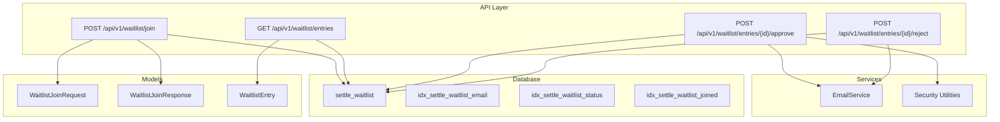
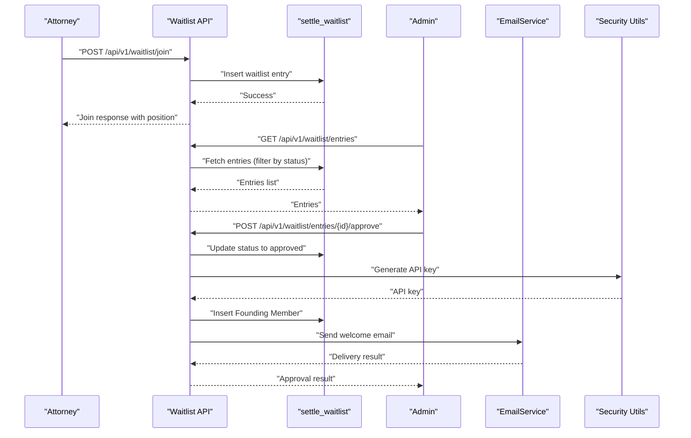
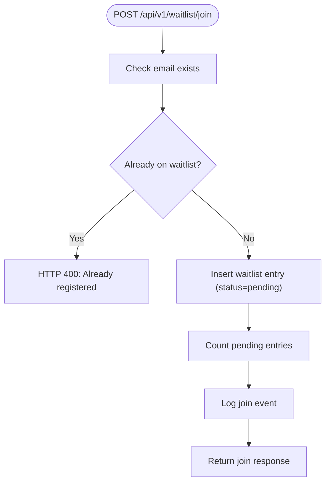
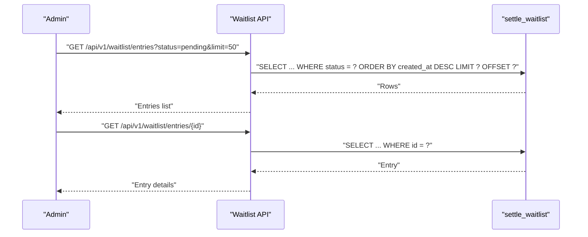
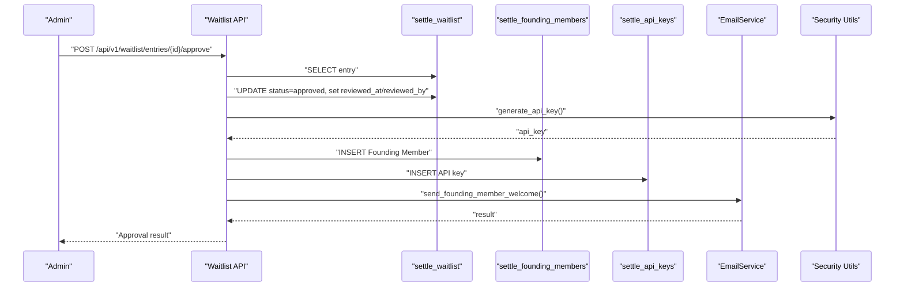
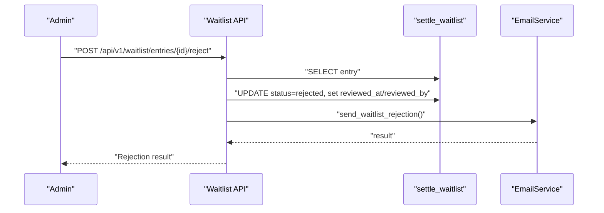
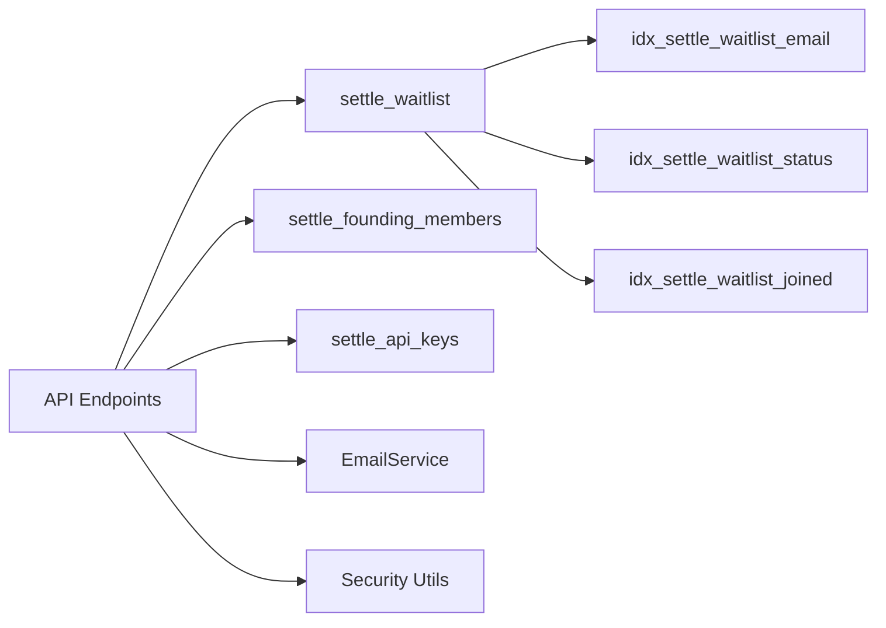

# Waitlist

<cite>
**Referenced Files in This Document**
- [add_waitlist_table.sql](file://database/migrations/add_waitlist_table.sql)
- [CREATE_SETTLE_DATABASE.sql](file://database/CREATE_SETTLE_DATABASE.sql)
- [settle_supabase.sql](file://database/schemas/settle_supabase.sql)
- [waitlist.py](file://app/models/waitlist.py)
- [waitlist.py](file://app/api/v1/endpoints/waitlist.py)
- [email_service.py](file://app/services/notifications/email_service.py)
- [security.py](file://app/core/security.py)
- [config.py](file://app/core/config.py)
- [DATABASE_SCHEMA.md](file://docs/DATABASE_SCHEMA.md)
</cite>

## Table of Contents
1. [Introduction](#introduction)
2. [Project Structure](#project-structure)
3. [Core Components](#core-components)
4. [Architecture Overview](#architecture-overview)
5. [Detailed Component Analysis](#detailed-component-analysis)
6. [Dependency Analysis](#dependency-analysis)
7. [Performance Considerations](#performance-considerations)
8. [Troubleshooting Guide](#troubleshooting-guide)
9. [Conclusion](#conclusion)

## Introduction
This document describes the settle_waitlist table and associated workflows that manage pre-launch lead capture for non-customer attorneys. It covers the complete schema, constraints, indexes, and the end-to-end funnel from initial sign-up through invitation and conversion to customer status. It also documents integration points with marketing and sales processes, lead nurturing workflows, and conversion analytics.

## Project Structure
The waitlist feature spans database schema, API endpoints, Pydantic models, and notification services:
- Database: settle_waitlist table with indexes and constraints
- API: public join endpoint and admin endpoints for listing, reviewing, and approving/rejecting entries
- Models: Pydantic models for request/response validation
- Notifications: email service for approvals and rejections
- Security: API key generation and hashing utilities

**Diagram sources**
- [waitlist.py:62-126](file://app/api/v1/endpoints/waitlist.py#L62-L126)
- [waitlist.py:129-179](file://app/api/v1/endpoints/waitlist.py#L129-L179)
- [waitlist.py:224-345](file://app/api/v1/endpoints/waitlist.py#L224-L345)
- [waitlist.py:347-417](file://app/api/v1/endpoints/waitlist.py#L347-L417)
- [CREATE_SETTLE_DATABASE.sql:322-351](file://database/CREATE_SETTLE_DATABASE.sql#L322-L351)
- [email_service.py:15-221](file://app/services/notifications/email_service.py#L15-L221)
- [security.py:23-66](file://app/core/security.py#L23-L66)

**Section sources**
- [CREATE_SETTLE_DATABASE.sql:317-351](file://database/CREATE_SETTLE_DATABASE.sql#L317-L351)
- [waitlist.py:62-126](file://app/api/v1/endpoints/waitlist.py#L62-L126)
- [waitlist.py:129-179](file://app/api/v1/endpoints/waitlist.py#L129-L179)
- [waitlist.py:224-417](file://app/api/v1/endpoints/waitlist.py#L224-L417)

## Core Components
- settle_waitlist table: stores attorney leads with contact info, status, timestamps, and metadata
- API endpoints: public join endpoint and admin endpoints for listing, retrieving, and approving/rejecting entries
- Pydantic models: validation for request/response payloads and state formatting
- Email service: sends welcome and rejection notifications
- Security utilities: generate and hash API keys during approval

**Section sources**
- [CREATE_SETTLE_DATABASE.sql:322-346](file://database/CREATE_SETTLE_DATABASE.sql#L322-L346)
- [waitlist.py:62-126](file://app/api/v1/endpoints/waitlist.py#L62-L126)
- [waitlist.py:129-179](file://app/api/v1/endpoints/waitlist.py#L129-L179)
- [waitlist.py:224-417](file://app/api/v1/endpoints/waitlist.py#L224-L417)
- [email_service.py:82-202](file://app/services/notifications/email_service.py#L82-L202)
- [security.py:23-66](file://app/core/security.py#L23-L66)

## Architecture Overview
The waitlist funnel integrates public sign-ups with admin review and customer onboarding:
- Public: attorney submits application via public endpoint
- Admin: reviews applications and approves or rejects
- On approval: creates a Founding Member record and generates an API key; sends welcome email
- Analytics: indexes and views enable segmentation and reporting

**Diagram sources**
- [waitlist.py:62-126](file://app/api/v1/endpoints/waitlist.py#L62-L126)
- [waitlist.py:129-179](file://app/api/v1/endpoints/waitlist.py#L129-L179)
- [waitlist.py:224-345](file://app/api/v1/endpoints/waitlist.py#L224-L345)
- [email_service.py:82-150](file://app/services/notifications/email_service.py#L82-L150)
- [security.py:23-66](file://app/core/security.py#L23-L66)

## Detailed Component Analysis

### settle_waitlist Table Schema
- Primary key: id (UUID)
- Contact information:
  - email: unique, not null
  - law_firm_name: optional
  - practice_area: optional
  - state: optional
- Status management:
  - status: defaults to pending; constrained to specific values
  - joined_at: timestamp with timezone (used as created_at)
  - invited_at: optional
  - converted_at: optional
- Acquisition and administrative:
  - referral_source: optional
  - notes: optional
- Constraints:
  - valid_waitlist_status: restricts status values
  - valid_email: enforces email format
- Indexes:
  - idx_settle_waitlist_email
  - idx_settle_waitlist_status
  - idx_settle_waitlist_joined

Notes on schema evolution:
- A later migration adds firm_name, contact_name, phone, practice_areas (array), jurisdiction, reviewed_at, reviewed_by
- The status constraint is expanded to include rejected
- NOT NULL enforced on firm_name and contact_name
- Index on joined_at added

**Section sources**
- [CREATE_SETTLE_DATABASE.sql:322-351](file://database/CREATE_SETTLE_DATABASE.sql#L322-L351)
- [settle_supabase.sql:321-345](file://database/schemas/settle_supabase.sql#L321-L345)
- [add_waitlist_table.sql:7-48](file://database/migrations/add_waitlist_table.sql#L7-L48)
- [add_waitlist_table.sql:37-40](file://database/migrations/add_waitlist_table.sql#L37-L40)

### API Endpoints and Workflows

#### Public Join Endpoint
- Endpoint: POST /api/v1/waitlist/join
- Validates uniqueness of email
- Inserts a new waitlist entry with status pending and joined_at timestamp
- Calculates position by counting pending entries
- Logs activity and returns a join response

**Diagram sources**
- [waitlist.py:62-126](file://app/api/v1/endpoints/waitlist.py#L62-L126)

**Section sources**
- [waitlist.py:62-126](file://app/api/v1/endpoints/waitlist.py#L62-L126)

#### Admin Listing and Retrieval
- GET /api/v1/waitlist/entries: lists entries with optional status filter, ordered by created_at desc
- GET /api/v1/waitlist/entries/{entry_id}: retrieves a specific entry

**Diagram sources**
- [waitlist.py:129-179](file://app/api/v1/endpoints/waitlist.py#L129-L179)

**Section sources**
- [waitlist.py:129-179](file://app/api/v1/endpoints/waitlist.py#L129-L179)

#### Approval Workflow
- POST /api/v1/waitlist/entries/{id}/approve:
  - Validates entry exists and status is pending
  - Updates status to approved and records reviewed_at and reviewed_by
  - Creates a Founding Member record
  - Generates an API key and inserts into settle_api_keys
  - Sends welcome email with API key
  - Returns approval result including member_id, tenant_id, and api_key (shown once)

**Diagram sources**
- [waitlist.py:224-345](file://app/api/v1/endpoints/waitlist.py#L224-L345)
- [email_service.py:82-150](file://app/services/notifications/email_service.py#L82-L150)
- [security.py:23-66](file://app/core/security.py#L23-L66)

**Section sources**
- [waitlist.py:224-345](file://app/api/v1/endpoints/waitlist.py#L224-L345)

#### Rejection Workflow
- POST /api/v1/waitlist/entries/{id}/reject:
  - Validates entry exists and status is pending
  - Updates status to rejected and records reviewed_at and reviewed_by
  - Sends rejection email
  - Returns rejection result

**Diagram sources**
- [waitlist.py:347-417](file://app/api/v1/endpoints/waitlist.py#L347-L417)
- [email_service.py:152-202](file://app/services/notifications/email_service.py#L152-L202)

**Section sources**
- [waitlist.py:347-417](file://app/api/v1/endpoints/waitlist.py#L347-L417)

### Data Models and Validation
- WaitlistJoinRequest: validates state as 2-letter uppercase code when provided
- WaitlistEntry: response model for listing and retrieval
- WaitlistRequest/Response: legacy models with email, law_firm_name, practice_area, state, referral_source

Validation highlights:
- State validator ensures 2-letter uppercase codes
- Email is validated at the API level and enforced at DB level via unique and format constraints

**Section sources**
- [waitlist.py:31-47](file://app/models/waitlist.py#L31-L47)
- [waitlist.py:11-29](file://app/models/waitlist.py#L11-L29)

### Email Integration
- EmailService: Resend API integration for sending HTML-formatted emails
- Welcome email: sent upon approval with API key
- Rejection email: sent upon rejection with reason
- Fire-and-forget pattern: email failures do not block approval/rejection

**Section sources**
- [email_service.py:15-221](file://app/services/notifications/email_service.py#L15-L221)
- [waitlist.py:315-331](file://app/api/v1/endpoints/waitlist.py#L315-L331)
- [waitlist.py:390-406](file://app/api/v1/endpoints/waitlist.py#L390-L406)

### Security and API Keys
- API key generation and hashing utilities
- Used during approval to create API keys for Founding Members
- API key header format: Bearer <api_key>

**Section sources**
- [security.py:23-66](file://app/core/security.py#L23-L66)

## Dependency Analysis
- API endpoints depend on:
  - Database for persistence (settle_waitlist, settle_founding_members, settle_api_keys)
  - EmailService for notifications
  - Security utilities for API key generation
- Models depend on Pydantic for validation
- Database depends on:
  - Unique email constraint
  - Status check constraint
  - Email format check constraint
  - Indexes for efficient filtering and sorting

**Diagram sources**
- [waitlist.py:62-126](file://app/api/v1/endpoints/waitlist.py#L62-L126)
- [waitlist.py:129-179](file://app/api/v1/endpoints/waitlist.py#L129-L179)
- [waitlist.py:224-417](file://app/api/v1/endpoints/waitlist.py#L224-L417)
- [CREATE_SETTLE_DATABASE.sql:322-351](file://database/CREATE_SETTLE_DATABASE.sql#L322-L351)

**Section sources**
- [waitlist.py:62-417](file://app/api/v1/endpoints/waitlist.py#L62-L417)
- [CREATE_SETTLE_DATABASE.sql:322-351](file://database/CREATE_SETTLE_DATABASE.sql#L322-L351)

## Performance Considerations
- Indexes:
  - idx_settle_waitlist_email: supports unique lookups and filtering by email
  - idx_settle_waitlist_status: enables filtering by status for admin dashboards
  - idx_settle_waitlist_joined: supports chronological ordering and pagination
- Query patterns:
  - Admin listing filters by status and orders by joined_at desc
  - Join endpoint checks email uniqueness and counts pending entries for position
- Recommendations:
  - Use status and joined_at indexes for efficient admin queries
  - Consider partitioning or materialized views for large-scale analytics
  - Monitor query performance on pending counts and admin filters

**Section sources**
- [CREATE_SETTLE_DATABASE.sql:348-351](file://database/CREATE_SETTLE_DATABASE.sql#L348-L351)
- [add_waitlist_table.sql:47-48](file://database/migrations/add_waitlist_table.sql#L47-L48)
- [waitlist.py:129-179](file://app/api/v1/endpoints/waitlist.py#L129-L179)
- [waitlist.py:108-111](file://app/api/v1/endpoints/waitlist.py#L108-L111)

## Troubleshooting Guide
Common issues and resolutions:
- Duplicate email on join:
  - Symptom: HTTP 400 indicating email already on waitlist
  - Cause: Unique constraint violation
  - Resolution: Prompt user to use another email or check status
- Entry not found:
  - Symptom: HTTP 404 when retrieving or updating an entry
  - Cause: Invalid entry_id
  - Resolution: Verify entry_id and existence
- Entry not pending:
  - Symptom: HTTP 400 when trying to approve/reject non-pending entry
  - Cause: Status mismatch
  - Resolution: Check current status and handle accordingly
- Email delivery failures:
  - Symptom: Warning logs about failed email send
  - Cause: Missing or invalid Resend API key
  - Resolution: Configure RESEND_* settings and retry
- API key generation:
  - Symptom: Approval succeeds but API key not generated
  - Cause: Security utilities not configured or exceptions
  - Resolution: Verify security settings and logs

**Section sources**
- [waitlist.py:78-82](file://app/api/v1/endpoints/waitlist.py#L78-L82)
- [waitlist.py:200-201](file://app/api/v1/endpoints/waitlist.py#L200-L201)
- [waitlist.py:251-255](file://app/api/v1/endpoints/waitlist.py#L251-L255)
- [email_service.py:46-48](file://app/services/notifications/email_service.py#L46-L48)
- [email_service.py:315-331](file://app/services/notifications/email_service.py#L315-L331)

## Conclusion
The settle_waitlist table and associated endpoints provide a robust foundation for pre-launch lead capture and customer onboarding. The schema enforces data quality through unique and format constraints, while indexes enable efficient admin workflows. The approval process seamlessly integrates Founding Member creation, API key generation, and email notifications, forming a complete funnel from sign-up to customer activation. The documented constraints, indexes, and workflows support scalable lead management, marketing segmentation, and conversion analytics.