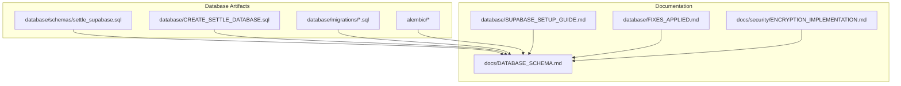
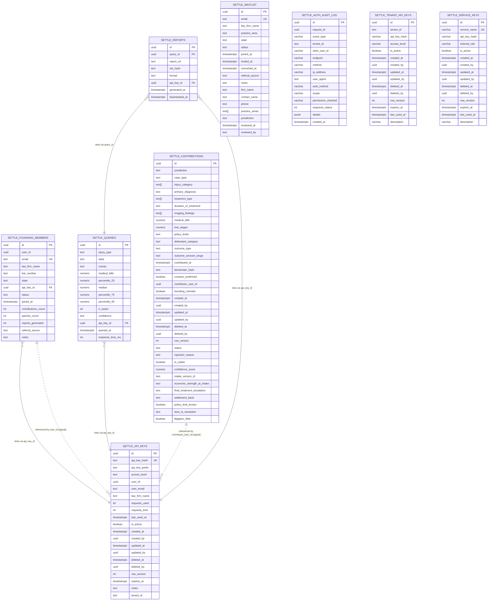
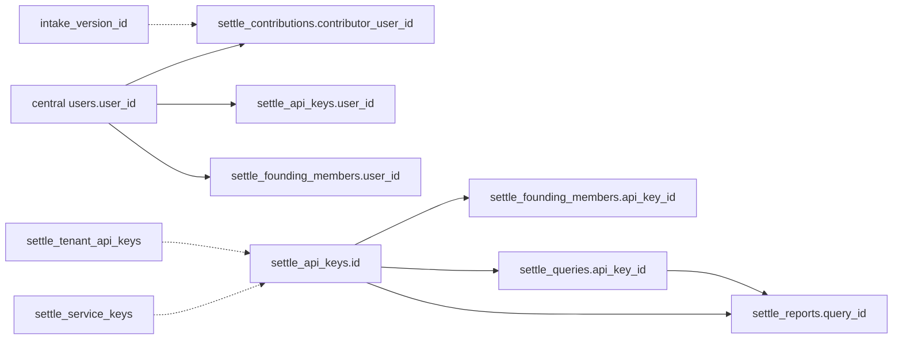

# Database Design

<cite>
**Referenced Files in This Document**
- [settle_supabase.sql](file://database/schemas/settle_supabase.sql)
- [CREATE_SETTLE_DATABASE.sql](file://database/CREATE_SETTLE_DATABASE.sql)
- [DATABASE_SCHEMA.md](file://docs/DATABASE_SCHEMA.md)
- [SUPABASE_SETUP_GUIDE.md](file://database/SUPABASE_SETUP_GUIDE.md)
- [FIXES_APPLIED.md](file://database/FIXES_APPLIED.md)
- [20260302_add_audit_columns.sql](file://database/migrations/20260302_add_audit_columns.sql)
- [20260302_add_auth_audit_log.sql](file://database/migrations/20260302_add_auth_audit_log.sql)
- [20260302_add_tenant_id.sql](file://database/migrations/20260302_add_tenant_id.sql)
- [add_waitlist_table.sql](file://database/migrations/add_waitlist_table.sql)
- [add_intake_v2_columns.sql](file://database/migrations/add_intake_v2_columns.sql)
- [env.py](file://alembic/env.py)
- [script.py.mako](file://alembic/script.py.mako)
- [alembic.ini](file://alembic.ini)
- [ENCRYPTION_IMPLEMENTATION.md](file://docs/security/ENCRYPTION_IMPLEMENTATION.md)
</cite>

## Update Summary
**Changes Made**
- Updated audit columns section to reflect comprehensive audit infrastructure including deleted_at, deleted_by, created_by, updated_by, and row_version
- Added Year-2 Mandatory 8-field Intake implementation with validation constraints and version-scoped completeness checks
- Enhanced soft-delete functionality documentation with selective indexes and lifecycle management
- Updated migration management section to include new intake v2 schema migration
- Expanded security and compliance section to cover optimistic concurrency control

## Table of Contents
1. [Introduction](#introduction)
2. [Project Structure](#project-structure)
3. [Core Components](#core-components)
4. [Architecture Overview](#architecture-overview)
5. [Detailed Component Analysis](#detailed-component-analysis)
6. [Dependency Analysis](#dependency-analysis)
7. [Performance Considerations](#performance-considerations)
8. [Troubleshooting Guide](#troubleshooting-guide)
9. [Conclusion](#conclusion)
10. [Appendices](#appendices)

## Introduction
This document provides comprehensive database design documentation for the SETTLE Service, focusing on the production-ready Supabase schema and related operational artifacts. It covers entity relationships, field definitions, data types, constraints, indexes, views, triggers, row-level security (RLS), migration management, indexing strategies, performance characteristics, and security/compliance posture. The schema supports anonymous settlement data contributions, API key management, founding member tracking, query analytics, report generation, pre-launch waitlists, and the Year-2 Mandatory 8-field Intake implementation with comprehensive validation constraints.

## Project Structure
The database design is primarily defined by a single production-ready SQL script and supporting migration scripts. Operational documentation and setup guides complement the schema definition.

**Diagram sources**
- [settle_supabase.sql:1-505](file://database/schemas/settle_supabase.sql#L1-L505)
- [CREATE_SETTLE_DATABASE.sql:1-507](file://database/CREATE_SETTLE_DATABASE.sql#L1-L507)
- [DATABASE_SCHEMA.md:1-901](file://docs/DATABASE_SCHEMA.md#L1-L901)
- [SUPABASE_SETUP_GUIDE.md:1-445](file://database/SUPABASE_SETUP_GUIDE.md#L1-L445)
- [FIXES_APPLIED.md:1-319](file://database/FIXES_APPLIED.md#L1-L319)
- [20260302_add_audit_columns.sql:1-157](file://database/migrations/20260302_add_audit_columns.sql#L1-L157)
- [20260302_add_auth_audit_log.sql:1-38](file://database/migrations/20260302_add_auth_audit_log.sql#L1-L38)
- [20260302_add_tenant_id.sql:1-86](file://database/migrations/20260302_add_tenant_id.sql#L1-L86)
- [add_waitlist_table.sql:1-61](file://database/migrations/add_waitlist_table.sql#L1-L61)
- [add_intake_v2_columns.sql:1-62](file://database/migrations/add_intake_v2_columns.sql#L1-L62)
- [alembic.ini:1-120](file://alembic.ini#L1-L120)

**Section sources**
- [settle_supabase.sql:1-505](file://database/schemas/settle_supabase.sql#L1-L505)
- [CREATE_SETTLE_DATABASE.sql:1-507](file://database/CREATE_SETTLE_DATABASE.sql#L1-L507)
- [DATABASE_SCHEMA.md:1-901](file://docs/DATABASE_SCHEMA.md#L1-L901)
- [SUPABASE_SETUP_GUIDE.md:1-445](file://database/SUPABASE_SETUP_GUIDE.md#L1-L445)
- [FIXES_APPLIED.md:1-319](file://database/FIXES_APPLIED.md#L1-L319)

## Core Components
The schema defines six core tables and supporting views, functions, and policies, with comprehensive audit infrastructure and Year-2 Mandatory 8-field Intake implementation:

- settle_contributions: Anonymous settlement data contributions with multi-select arrays, bucketed outcomes, audit metadata, and Year-2 Mandatory 8-field Intake validation.
- settle_api_keys: API key management with access levels, usage tracking, tenant scoping, and comprehensive audit columns.
- settle_founding_members: Founding Member program tracking linked to API keys.
- settle_queries: Query analytics and usage tracking.
- settle_reports: Report generation and distribution.
- settle_waitlist: Pre-launch waitlist for non-customers with enhanced field support.

Additional components:
- settle_approved_contributions: View filtering approved contributions.
- settle_founding_member_stats: Aggregated stats view.
- settle_api_usage_by_level: Usage analytics by access level.
- settle_update_updated_at_column: Function and triggers for auto-updated timestamps.
- Row-Level Security (RLS) policies on sensitive tables.
- settle_auth_audit_log: Comprehensive authentication audit logging.

**Section sources**
- [settle_supabase.sql:31-137](file://database/schemas/settle_supabase.sql#L31-L137)
- [settle_supabase.sql:142-182](file://database/schemas/settle_supabase.sql#L142-L182)
- [settle_supabase.sql:203-236](file://database/schemas/settle_supabase.sql#L203-L236)
- [settle_supabase.sql:249-278](file://database/schemas/settle_supabase.sql#L249-L278)
- [settle_supabase.sql:290-310](file://database/schemas/settle_supabase.sql#L290-L310)
- [settle_supabase.sql:318-345](file://database/schemas/settle_supabase.sql#L318-L345)
- [settle_supabase.sql:356-379](file://database/schemas/settle_supabase.sql#L356-L379)
- [settle_supabase.sql:385-400](file://database/schemas/settle_supabase.sql#L385-L400)
- [settle_supabase.sql:405-435](file://database/schemas/settle_supabase.sql#L405-L435)

## Architecture Overview
The database architecture centers on a single Supabase project with prefixed tables and RLS-enabled sensitive tables. Cross-database references to the central SaaS Admin users table are logical (not enforced foreign keys) to maintain flexibility across databases. Tenant scoping is introduced via dedicated tables and indexes. Comprehensive audit infrastructure provides full lifecycle tracking with soft-delete capabilities and optimistic concurrency control.

**Diagram sources**
- [settle_supabase.sql:31-137](file://database/schemas/settle_supabase.sql#L31-L137)
- [settle_supabase.sql:142-182](file://database/schemas/settle_supabase.sql#L142-L182)
- [settle_supabase.sql:203-236](file://database/schemas/settle_supabase.sql#L203-L236)
- [settle_supabase.sql:249-278](file://database/schemas/settle_supabase.sql#L249-L278)
- [settle_supabase.sql:290-310](file://database/schemas/settle_supabase.sql#L290-L310)
- [settle_supabase.sql:318-345](file://database/schemas/settle_supabase.sql#L318-L345)
- [settle_supabase.sql:405-435](file://database/schemas/settle_supabase.sql#L405-L435)
- [20260302_add_tenant_id.sql:34-75](file://database/migrations/20260302_add_tenant_id.sql#L34-L75)
- [20260302_add_auth_audit_log.sql:6-31](file://database/migrations/20260302_add_auth_audit_log.sql#L6-L31)
- [add_intake_v2_columns.sql:14-21](file://database/migrations/add_intake_v2_columns.sql#L14-L21)

## Detailed Component Analysis

### settle_contributions
- Purpose: Store anonymous settlement data with multi-select arrays, bucketed outcomes, audit metadata, and Year-2 Mandatory 8-field Intake validation.
- Primary key: id (UUID).
- Notable fields: jurisdiction, case_type, injury_category (TEXT[]), primary_diagnosis, treatment_type (TEXT[]), duration_of_treatment, imaging_findings (TEXT[]), medical_bills, lost_wages, policy_limits, defendant_category, outcome_type, outcome_amount_range, contributed_at, blockchain_hash, consent_confirmed, contributor_user_id, founding_member, intake_version_id, economic_strength_at_intake, final_treatment_escalation, settlement_band, policy_limit_known, time_to_resolution, litigation_filed.
- Audit columns: created_by, updated_by, deleted_by, row_version for comprehensive lifecycle tracking and optimistic concurrency control.
- Validation constraints: Outcome range enumeration, status enumeration, medical_bills bounds, confidence_score bounds, and comprehensive Year-2 Mandatory 8-field Intake validation with version-scoped completeness checks.
- Indexes: jurisdiction, case_type, injury_category (GIN), outcome_amount_range, status, created_at, medical_bills, contributor_user_id; composite index for approved query pattern; soft-delete and deletion authorship indexes; intake_version_id index for cohort segmentation.
- Triggers: auto-update updated_at on edits.
- Notes: contributor_user_id references central users.user_id (logical, not enforced foreign key).

**Updated** Enhanced with Year-2 Mandatory 8-field Intake implementation including comprehensive validation constraints and version-scoped completeness checks.

**Section sources**
- [settle_supabase.sql:31-137](file://database/schemas/settle_supabase.sql#L31-L137)
- [settle_supabase.sql:385-400](file://database/schemas/settle_supabase.sql#L385-L400)
- [add_intake_v2_columns.sql:1-62](file://database/migrations/add_intake_v2_columns.sql#L1-L62)

### settle_api_keys
- Purpose: API key management with access levels, usage tracking, tenant scoping, and comprehensive audit infrastructure.
- Primary key: id (UUID).
- Notable fields: api_key_hash (UNIQUE), api_key_prefix, access_level, user_id, user_email, law_firm_name, requests_used, requests_limit, last_used_at, is_active, created_at, updated_at, deleted_at, deleted_by, row_version, expires_at, notes, tenant_id.
- Audit columns: created_by, updated_by, deleted_by, row_version for comprehensive lifecycle tracking and optimistic concurrency control.
- Constraints: Access level enumeration, requests_used non-negative, requests_limit either NULL or positive.
- Indexes: access_level, is_active, api_key_prefix, user_id, user_email; tenant_id scoping; soft-delete and deletion authorship indexes.
- Triggers: auto-update updated_at on edits.
- Notes: user_id references central users.user_id (logical); tenant_id enables multi-tenant support.

**Updated** Enhanced with comprehensive audit columns including created_by, updated_by, deleted_by, and row_version for optimistic concurrency control.

**Section sources**
- [settle_supabase.sql:142-182](file://database/schemas/settle_supabase.sql#L142-L182)
- [20260302_add_tenant_id.sql:7-26](file://database/migrations/20260302_add_tenant_id.sql#L7-L26)
- [settle_supabase.sql:385-400](file://database/schemas/settle_supabase.sql#L385-L400)

### settle_founding_members
- Purpose: Track Founding Member program (2,100 attorneys, free forever).
- Primary key: id (UUID).
- Notable fields: user_id, email (UNIQUE), law_firm_name, bar_number, state, api_key_id (FK to settle_api_keys), status, joined_at, contributions_count, queries_count, reports_generated, referral_source, notes.
- Constraints: Status enumeration, non-negative counters.
- Indexes: email, status, joined_at, user_id, api_key_id.
- Notes: api_key_id links to tenant-scoped API keys; user_id references central users.user_id (logical).

**Section sources**
- [settle_supabase.sql:203-236](file://database/schemas/settle_supabase.sql#L203-L236)
- [20260302_add_tenant_id.sql:34-51](file://database/migrations/20260302_add_tenant_id.sql#L34-L51)

### settle_queries
- Purpose: Track settlement range queries and analytics.
- Primary key: id (UUID).
- Notable fields: injury_type, state, county, medical_bills, percentile_25, median, percentile_75, percentile_95, n_cases, confidence, api_key_id (FK), queried_at, response_time_ms.
- Constraints: Confidence enumeration, non-negative response_time_ms.
- Indexes: injury_type, state, queried_at, api_key_id.

**Section sources**
- [settle_supabase.sql:249-278](file://database/schemas/settle_supabase.sql#L249-L278)

### settle_reports
- Purpose: Track generated reports and download events.
- Primary key: id (UUID).
- Notable fields: query_id (FK), report_url, ots_hash, format, api_key_id (FK), generated_at, downloaded_at.
- Constraints: Format enumeration.

**Section sources**
- [settle_supabase.sql:290-310](file://database/schemas/settle_supabase.sql#L290-L310)

### settle_waitlist
- Purpose: Pre-launch waitlist for non-customers with enhanced field support.
- Primary key: id (UUID).
- Notable fields: email (UNIQUE), law_firm_name, practice_area, state, status, joined_at, invited_at, converted_at, referral_source, notes, firm_name, contact_name, phone, practice_areas (TEXT[]), jurisdiction, reviewed_at, reviewed_by.
- Enhanced fields: firm_name, contact_name, phone, practice_areas, jurisdiction, reviewed_at, reviewed_by for comprehensive waitlist management.
- Constraints: Status enumeration, enhanced with rejected status; email validation.
- Indexes: email, status, joined_at, firm_name, contact_name, jurisdiction.

**Updated** Enhanced with new fields for improved waitlist management including firm_name, contact_name, phone, practice_areas, jurisdiction, reviewed_at, and reviewed_by.

**Section sources**
- [settle_supabase.sql:318-345](file://database/schemas/settle_supabase.sql#L318-L345)
- [add_waitlist_table.sql:6-61](file://database/migrations/add_waitlist_table.sql#L6-L61)

### Views and Functions
- settle_approved_contributions: Filters contributions by status = 'approved'.
- settle_founding_member_stats: Aggregates total members, active members, and totals of contributions, queries, and reports.
- settle_api_usage_by_level: Aggregates API key usage by access level.
- settle_update_updated_at_column: Function to update updated_at on edits; triggers applied to key tables.

**Section sources**
- [settle_supabase.sql:356-379](file://database/schemas/settle_supabase.sql#L356-L379)
- [settle_supabase.sql:385-400](file://database/schemas/settle_supabase.sql#L385-L400)

### Audit and Security Enhancements
- Comprehensive audit columns: deleted_at, deleted_by, created_by, updated_by, row_version added across core tables for full lifecycle tracking.
- Optimistic concurrency control: row_version column with default value 1 for concurrent update protection.
- Soft-delete functionality: deleted_at and deleted_by columns with selective indexes enabling soft-deletion without physical removal.
- Auth audit log: settle_auth_audit_log for tenant, user, endpoint, method, IP, user agent, scopes, response status, and details.
- Tenant-scoped API keys: settle_tenant_api_keys and settle_service_keys for multi-tenancy.
- RLS policies: service_role full access; authenticated users can read their own API key info.

**Updated** Comprehensive audit infrastructure including optimistic concurrency control, soft-delete functionality, and enhanced auth audit logging.

**Section sources**
- [20260302_add_audit_columns.sql:1-157](file://database/migrations/20260302_add_audit_columns.sql#L1-L157)
- [20260302_add_auth_audit_log.sql:1-38](file://database/migrations/20260302_add_auth_audit_log.sql#L1-L38)
- [20260302_add_tenant_id.sql:1-86](file://database/migrations/20260302_add_tenant_id.sql#L1-L86)
- [settle_supabase.sql:405-435](file://database/schemas/settle_supabase.sql#L405-L435)

### Year-2 Mandatory 8-field Intake Implementation
- Purpose: Implement comprehensive data collection framework for enhanced settlement analysis and reporting.
- Fields: intake_version_id (tracking data collection version), economic_strength_at_intake, final_treatment_escalation, settlement_band, policy_limit_known, time_to_resolution, litigation_filed.
- Validation: Version-scoped completeness checks ensuring v2 rows populate all mandatory fields with valid enum values.
- Backfill: Legacy rows automatically tagged with intake_version_id = 'v1' for backward compatibility.
- Indexing: Dedicated index on intake_version_id for cohort segmentation and analytics.

**New** Comprehensive Year-2 Mandatory 8-field Intake implementation with validation constraints and version management.

**Section sources**
- [add_intake_v2_columns.sql:1-62](file://database/migrations/add_intake_v2_columns.sql#L1-L62)

## Dependency Analysis
- Logical relationships to central users table: settle_contributions.contributor_user_id, settle_api_keys.user_id, settle_founding_members.user_id.
- Foreign key relationships:
  - settle_founding_members.api_key_id → settle_api_keys.id
  - settle_queries.api_key_id → settle_api_keys.id
  - settle_reports.query_id → settle_queries.id
  - settle_reports.api_key_id → settle_api_keys.id
- Tenant scoping introduces separate tables: settle_tenant_api_keys, settle_service_keys.
- Intake version tracking: intake_version_id field enables version-specific validation and cohort analysis.

**Diagram sources**
- [settle_supabase.sql:64-81](file://database/schemas/settle_supabase.sql#L64-L81)
- [settle_supabase.sql:214-215](file://database/schemas/settle_supabase.sql#L214-L215)
- [settle_supabase.sql:267-268](file://database/schemas/settle_supabase.sql#L267-L268)
- [settle_supabase.sql:295-301](file://database/schemas/settle_supabase.sql#L295-L301)
- [settle_supabase.sql:282-282](file://database/schemas/settle_supabase.sql#L282-L282)
- [20260302_add_tenant_id.sql:34-75](file://database/migrations/20260302_add_tenant_id.sql#L34-L75)
- [add_intake_v2_columns.sql:14-21](file://database/migrations/add_intake_v2_columns.sql#L14-L21)

**Section sources**
- [settle_supabase.sql:64-81](file://database/schemas/settle_supabase.sql#L64-L81)
- [settle_supabase.sql:214-215](file://database/schemas/settle_supabase.sql#L214-L215)
- [settle_supabase.sql:267-268](file://database/schemas/settle_supabase.sql#L267-L268)
- [settle_supabase.sql:295-301](file://database/schemas/settle_supabase.sql#L295-L301)
- [20260302_add_tenant_id.sql:34-75](file://database/migrations/20260302_add_tenant_id.sql#L34-L75)
- [add_intake_v2_columns.sql:14-21](file://database/migrations/add_intake_v2_columns.sql#L14-L21)

## Performance Considerations
- Indexing strategy:
  - Multi-column composite index on settle_contributions for common query pattern (jurisdiction, case_type, status) with status filter.
  - GIN index on multi-select arrays (injury_category, treatment_type, imaging_findings).
  - Soft-delete selective indexes on deleted_at and deleted_by for efficient filtering.
  - Tenant scoping indexes on settle_api_keys (tenant_id, is_active) and settle_tenant_api_keys.
  - Intake version index for cohort segmentation and analytics.
- Triggers: Auto-update updated_at reduces application-level boilerplate and ensures consistent audit timestamps.
- Data types: UUID for globally unique identifiers, TEXT[] for multi-selects, NUMERIC for precise financial calculations, TIMESTAMPTZ for timezone-aware timestamps.
- Query targets: Settlement range estimation under 1 second; contribution submission under 500 ms; report generation under 2 seconds; API key validation under 50 ms.
- Optimistic concurrency: row_version column enables concurrent update handling with automatic version incrementing.

**Updated** Enhanced with intake version indexing and optimistic concurrency control considerations.

**Section sources**
- [settle_supabase.sql:116-137](file://database/schemas/settle_supabase.sql#L116-L137)
- [settle_supabase.sql:185-198](file://database/schemas/settle_supabase.sql#L185-L198)
- [settle_supabase.sql:281-285](file://database/schemas/settle_supabase.sql#L281-L285)
- [settle_supabase.sql:313-316](file://database/schemas/settle_supabase.sql#L313-L316)
- [settle_supabase.sql:348-351](file://database/schemas/settle_supabase.sql#L348-L351)
- [DATABASE_SCHEMA.md:814-845](file://docs/DATABASE_SCHEMA.md#L814-L845)
- [add_intake_v2_columns.sql:52-54](file://database/migrations/add_intake_v2_columns.sql#L52-L54)

## Troubleshooting Guide
Common issues and resolutions:
- Tables not found: Verify schema execution and table existence in Supabase SQL Editor.
- Permission denied: Grant appropriate privileges to anon, authenticated, and service_role.
- Missing credentials: Ensure .env contains SUPABASE_URL, SUPABASE_KEY, SUPABASE_SERVICE_KEY.
- Setup checklist: Confirm Supabase project creation, schema execution, table verification, credentials copied, connection tested, service started, endpoints responding, and absence of duplicate contacts table.
- Audit column issues: Verify audit columns exist and have proper default values for created_by, updated_by, deleted_by, and row_version.
- Intake validation failures: Check intake_version_id values and ensure v2 rows populate all mandatory fields with valid enum values.

**Updated** Added troubleshooting guidance for audit columns and intake validation issues.

**Section sources**
- [SUPABASE_SETUP_GUIDE.md:372-408](file://database/SUPABASE_SETUP_GUIDE.md#L372-L408)
- [FIXES_APPLIED.md:165-224](file://database/FIXES_APPLIED.md#L165-L224)

## Conclusion
The SETTLE Service database schema is production-ready, zero-PHI, bar-compliant, and designed for scalability and security. It leverages Supabase's managed infrastructure, enforces RLS, and provides comprehensive indexing, constraints, and audit capabilities. Tenant scoping and multi-tenant API key tables enable future growth. The migration and documentation artifacts ensure reproducible deployments and operational clarity. The comprehensive audit infrastructure including soft-delete functionality, optimistic concurrency control, and Year-2 Mandatory 8-field Intake implementation provides robust data governance and enhanced analytical capabilities.

## Appendices

### Migration Management
- Alembic configuration and environment:
  - alembic.ini defines SQLAlchemy URL and logging configuration.
  - env.py orchestrates offline/online migrations with target_metadata unset.
  - script.py.mako is the Jinja template for revision scripts.
- Migration scripts:
  - 20260302_add_audit_columns.sql: Adds lifecycle audit columns and indexes; adds row_version; ensures updated_at triggers.
  - 20260302_add_auth_audit_log.sql: Creates settle_auth_audit_log with indexes and RLS policy.
  - 20260302_add_tenant_id.sql: Introduces tenant_id on settle_api_keys; creates settle_tenant_api_keys and settle_service_keys; adds indexes and RLS.
  - add_waitlist_table.sql: Adds settle_waitlist table and indexes with enhanced field support.
  - add_intake_v2_columns.sql: Implements Year-2 Mandatory 8-field Intake with validation constraints and version management.
- Notes:
  - Alembic versions directory missing; migrations are provided as SQL scripts in database/migrations/.
  - Use Supabase SQL Editor to execute migration scripts in order.

**Updated** Added Year-2 Mandatory 8-field Intake migration to comprehensive migration management.

**Section sources**
- [alembic.ini:1-120](file://alembic.ini#L1-L120)
- [env.py:1-106](file://alembic/env.py#L1-L106)
- [script.py.mako:1-27](file://alembic/script.py.mako#L1-L27)
- [20260302_add_audit_columns.sql:1-157](file://database/migrations/20260302_add_audit_columns.sql#L1-L157)
- [20260302_add_auth_audit_log.sql:1-38](file://database/migrations/20260302_add_auth_audit_log.sql#L1-L38)
- [20260302_add_tenant_id.sql:1-86](file://database/migrations/20260302_add_tenant_id.sql#L1-L86)
- [add_waitlist_table.sql:1-61](file://database/migrations/add_waitlist_table.sql#L1-L61)
- [add_intake_v2_columns.sql:1-62](file://database/migrations/add_intake_v2_columns.sql#L1-L62)

### Data Lifecycle and Retention
- Soft delete pattern: deleted_at and deleted_by columns with selective indexes enable soft-deletion without physical removal.
- Row versioning: row_version supports optimistic concurrency control with automatic incrementing.
- Audit trail: created_by, updated_by, deleted_by capture lifecycle ownership.
- Intake version management: intake_version_id enables version-specific validation and cohort analysis.
- Recommendations:
  - Define retention policies for settle_auth_audit_log and settle_reports based on compliance requirements.
  - Archive historical settle_queries and settle_reports periodically to manage growth.
  - Monitor intake_version_id distribution for analytics and reporting purposes.

**Updated** Enhanced with intake version management and optimistic concurrency control considerations.

**Section sources**
- [20260302_add_audit_columns.sql:11-157](file://database/migrations/20260302_add_audit_columns.sql#L11-L157)
- [20260302_add_auth_audit_log.sql:6-31](file://database/migrations/20260302_add_auth_audit_log.sql#L6-L31)
- [add_intake_v2_columns.sql:23-50](file://database/migrations/add_intake_v2_columns.sql#L23-L50)

### Security and Compliance
- Encryption:
  - TLS 1.3 in transit and AES-256-GCM at rest via managed platforms (Supabase, AWS RDS, GCP Cloud SQL).
  - File encryption for reports using AES-256-GCM with secure key management (environment variables, AWS Secrets Manager, HashiCorp Vault).
- Access control:
  - RLS policies on settle_api_keys and settle_founding_members.
  - Authenticated users can read their own API key info; service_role has full access.
- Compliance:
  - Zero PHI/PII, bar-compliant design, blockchain verification via OpenTimestamps receipts.
  - Audit logging and data integrity mechanisms.
  - Comprehensive validation constraints for Year-2 Mandatory 8-field Intake.
- Audit infrastructure:
  - Full lifecycle tracking with created_by, updated_by, deleted_by columns.
  - Optimistic concurrency control with row_version.
  - Soft-delete functionality with selective indexes.

**Updated** Enhanced with comprehensive audit infrastructure and Year-2 Mandatory 8-field Intake validation compliance.

**Section sources**
- [ENCRYPTION_IMPLEMENTATION.md:1-814](file://docs/security/ENCRYPTION_IMPLEMENTATION.md#L1-L814)
- [settle_supabase.sql:405-435](file://database/schemas/settle_supabase.sql#L405-L435)
- [DATABASE_SCHEMA.md:848-868](file://docs/DATABASE_SCHEMA.md#L848-L868)
- [add_intake_v2_columns.sql:26-48](file://database/migrations/add_intake_v2_columns.sql#L26-L48)