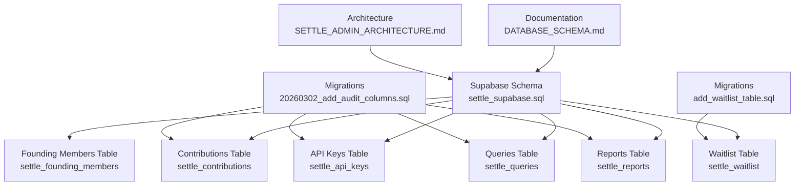
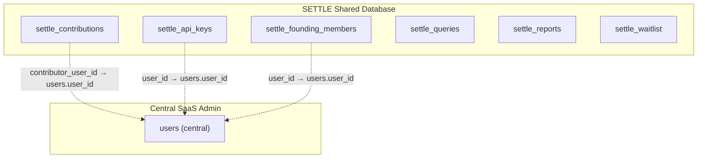
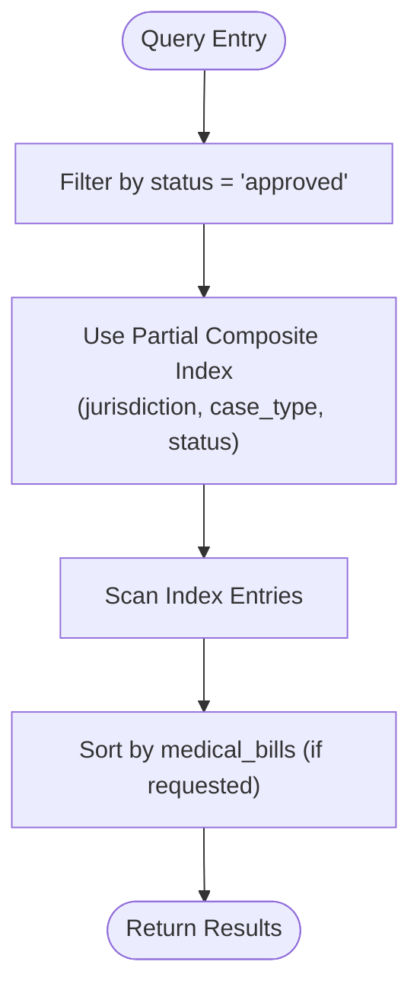
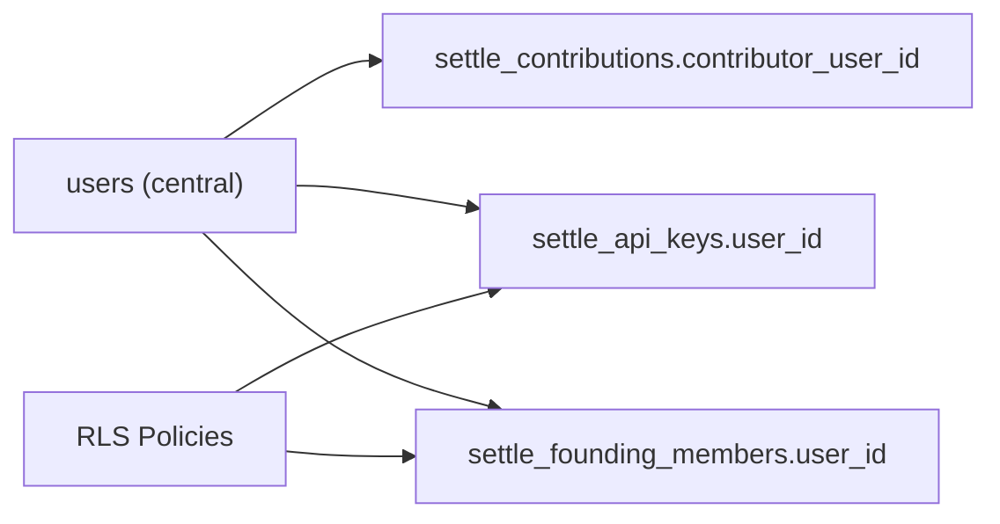

# Indexes & Constraints

<cite>
**Referenced Files in This Document**
- [CREATE_SETTLE_DATABASE.sql](file://database/CREATE_SETTLE_DATABASE.sql)
- [settle_supabase.sql](file://database/schemas/settle_supabase.sql)
- [20260302_add_audit_columns.sql](file://database/migrations/20260302_add_audit_columns.sql)
- [add_waitlist_table.sql](file://database/migrations/add_waitlist_table.sql)
- [DATABASE_SCHEMA.md](file://docs/DATABASE_SCHEMA.md)
- [SETTLE_ADMIN_ARCHITECTURE.md](file://docs/architecture/SETTLE_ADMIN_ARCHITECTURE.md)
</cite>

## Table of Contents
1. [Introduction](#introduction)
2. [Project Structure](#project-structure)
3. [Core Components](#core-components)
4. [Architecture Overview](#architecture-overview)
5. [Detailed Component Analysis](#detailed-component-analysis)
6. [Dependency Analysis](#dependency-analysis)
7. [Performance Considerations](#performance-considerations)
8. [Troubleshooting Guide](#troubleshooting-guide)
9. [Conclusion](#conclusion)

## Introduction
This document explains the database indexing and constraint strategies implemented in the SETTLE Service. It covers:
- Single-column indexes for frequently filtered and sorted columns
- GIN indexes for multi-select arrays
- Composite indexes optimized for common query patterns
- Soft-delete optimized indexes
- Constraint types enforcing enumerated values, numeric ranges, and business rules
- Design rationale for balancing query performance and data integrity

## Project Structure
The database schema and indexes are defined in the Supabase-ready schema file and reinforced by migration scripts. The documentation also provides performance guidance and architectural context.



**Diagram sources**
- [settle_supabase.sql:19-351](file://database/schemas/settle_supabase.sql#L19-L351)
- [20260302_add_audit_columns.sql:1-157](file://database/migrations/20260302_add_audit_columns.sql#L1-L157)
- [add_waitlist_table.sql:1-61](file://database/migrations/add_waitlist_table.sql#L1-L61)
- [DATABASE_SCHEMA.md:1-901](file://docs/DATABASE_SCHEMA.md#L1-L901)
- [SETTLE_ADMIN_ARCHITECTURE.md:90-138](file://docs/architecture/SETTLE_ADMIN_ARCHITECTURE.md#L90-L138)

**Section sources**
- [settle_supabase.sql:19-351](file://database/schemas/settle_supabase.sql#L19-L351)
- [DATABASE_SCHEMA.md:1-901](file://docs/DATABASE_SCHEMA.md#L1-L901)
- [SETTLE_ADMIN_ARCHITECTURE.md:90-138](file://docs/architecture/SETTLE_ADMIN_ARCHITECTURE.md#L90-L138)

## Core Components
- settle_contributions: Stores anonymous settlement data with multi-select arrays, enumerated statuses, and numeric ranges. Includes indexes for jurisdiction, case_type, outcome_amount_range, status, created_at, medical_bills, contributor_user_id, and a composite index for approved contributions.
- settle_api_keys: Manages API keys with access levels and usage tracking, plus indexes on access_level, is_active, api_key_prefix, user_id, and user_email.
- settle_founding_members: Tracks Founding Member program with indexes on email, status, joined_at, user_id, and api_key_id.
- settle_queries: Tracks settlement range queries with indexes on injury_type, state, queried_at, and api_key_id.
- settle_reports: Tracks generated reports with indexes on query_id, api_key_id, and generated_at.
- settle_waitlist: Pre-launch waitlist with indexes on email, status, and joined_at.

**Section sources**
- [settle_supabase.sql:31-351](file://database/schemas/settle_supabase.sql#L31-L351)
- [DATABASE_SCHEMA.md:44-543](file://docs/DATABASE_SCHEMA.md#L44-L543)

## Architecture Overview
The SETTLE Service uses a shared database for all tenants, with logical references to the central SaaS Admin users table. Row-level security is enabled on sensitive tables, and constraints enforce data integrity.



**Diagram sources**
- [settle_supabase.sql:78-80](file://database/schemas/settle_supabase.sql#L78-L80)
- [settle_supabase.sql:153-154](file://database/schemas/settle_supabase.sql#L153-L154)
- [settle_supabase.sql:207-208](file://database/schemas/settle_supabase.sql#L207-L208)
- [SETTLE_ADMIN_ARCHITECTURE.md:119-123](file://docs/architecture/SETTLE_ADMIN_ARCHITECTURE.md#L119-L123)

**Section sources**
- [settle_supabase.sql:406-435](file://database/schemas/settle_supabase.sql#L406-L435)
- [SETTLE_ADMIN_ARCHITECTURE.md:119-123](file://docs/architecture/SETTLE_ADMIN_ARCHITECTURE.md#L119-L123)

## Detailed Component Analysis

### settle_contributions: Indexes and Constraints
- Single-column indexes:
  - jurisdiction
  - case_type
  - outcome_amount_range
  - status
  - created_at
  - medical_bills
  - contributor_user_id
- GIN index on injury_category for efficient multi-select filtering
- Composite index on (jurisdiction, case_type, status) with a predicate WHERE status = 'approved'
- Soft-delete optimized indexes:
  - deleted_at with WHERE deleted_at IS NULL
  - deleted_by
- Constraints:
  - valid_outcome_range: enumerated buckets
  - valid_status: enumerated values
  - valid_medical_bills: numeric range
  - valid_confidence_score: numeric range

Rationale:
- GIN index on injury_category supports efficient containment queries for multi-select arrays.
- Composite index on jurisdiction, case_type, and status optimizes the common query pattern for approved contributions.
- Soft-delete index on deleted_at WHERE deleted_at IS NULL ensures visibility of active records without scanning tombstoned rows.

**Section sources**
- [settle_supabase.sql:115-137](file://database/schemas/settle_supabase.sql#L115-L137)
- [settle_supabase.sql:102-113](file://database/schemas/settle_supabase.sql#L102-L113)
- [20260302_add_audit_columns.sql:21-28](file://database/migrations/20260302_add_audit_columns.sql#L21-L28)
- [20260302_add_audit_columns.sql:44-47](file://database/migrations/20260302_add_audit_columns.sql#L44-L47)
- [DATABASE_SCHEMA.md:818-835](file://docs/DATABASE_SCHEMA.md#L818-L835)

### settle_api_keys: Indexes and Constraints
- Single-column indexes:
  - access_level
  - is_active
  - api_key_prefix
  - user_id
  - user_email
- Soft-delete optimized indexes:
  - deleted_at with WHERE deleted_at IS NULL
  - deleted_by
- Constraints:
  - valid_access_level: enumerated values
  - valid_requests_used: non-negative
  - valid_requests_limit: positive or NULL

**Section sources**
- [settle_supabase.sql:184-198](file://database/schemas/settle_supabase.sql#L184-L198)
- [settle_supabase.sql:176-182](file://database/schemas/settle_supabase.sql#L176-L182)
- [20260302_add_audit_columns.sql:34-51](file://database/migrations/20260302_add_audit_columns.sql#L34-L51)

### settle_founding_members: Indexes and Constraints
- Single-column indexes:
  - email
  - status
  - joined_at
  - user_id
  - api_key_id
- Constraints:
  - valid_founding_member_status: enumerated values
  - valid_contributions_count: non-negative
  - valid_queries_count: non-negative
  - valid_reports_generated: non-negative

**Section sources**
- [settle_supabase.sql:237-244](file://database/schemas/settle_supabase.sql#L237-L244)
- [settle_supabase.sql:229-236](file://database/schemas/settle_supabase.sql#L229-L236)

### settle_queries: Indexes and Constraints
- Single-column indexes:
  - injury_type
  - state
  - queried_at
  - api_key_id
- Constraints:
  - valid_confidence: enumerated values
  - valid_response_time: non-negative

**Section sources**
- [settle_supabase.sql:278-285](file://database/schemas/settle_supabase.sql#L278-L285)
- [settle_supabase.sql:273-278](file://database/schemas/settle_supabase.sql#L273-L278)

### settle_reports: Indexes and Constraints
- Single-column indexes:
  - query_id
  - api_key_id
  - generated_at
- Constraints:
  - valid_format: enumerated values

**Section sources**
- [settle_supabase.sql:311-316](file://database/schemas/settle_supabase.sql#L311-L316)
- [settle_supabase.sql:306-310](file://database/schemas/settle_supabase.sql#L306-L310)

### settle_waitlist: Indexes and Constraints
- Single-column indexes:
  - email
  - status
  - joined_at
- Additional constraints and indexes introduced via migration:
  - firm_name, contact_name NOT NULL after migration
  - practice_areas TEXT[] index via migration
  - valid_waitlist_status extended to include 'rejected'

**Section sources**
- [settle_supabase.sql:346-351](file://database/schemas/settle_supabase.sql#L346-L351)
- [add_waitlist_table.sql:37-40](file://database/migrations/add_waitlist_table.sql#L37-L40)
- [add_waitlist_table.sql:47-48](file://database/migrations/add_waitlist_table.sql#L47-L48)

### Composite Index on Approved Contributions
A partial index on (jurisdiction, case_type, status) with WHERE status = 'approved' optimizes queries that filter by approved contributions. This reduces index size and improves selectivity.



**Diagram sources**
- [settle_supabase.sql:125-129](file://database/schemas/settle_supabase.sql#L125-L129)
- [DATABASE_SCHEMA.md:818-835](file://docs/DATABASE_SCHEMA.md#L818-L835)

**Section sources**
- [settle_supabase.sql:125-129](file://database/schemas/settle_supabase.sql#L125-L129)
- [DATABASE_SCHEMA.md:818-835](file://docs/DATABASE_SCHEMA.md#L818-L835)

### Soft-Delete Indexing Strategy
Soft-delete columns are present across key tables. Dedicated indexes improve visibility of active records:
- deleted_at with WHERE deleted_at IS NULL
- deleted_by

This design avoids scanning tombstoned rows during normal operations and keeps queries focused on live data.

**Section sources**
- [20260302_add_audit_columns.sql:21-28](file://database/migrations/20260302_add_audit_columns.sql#L21-L28)
- [20260302_add_audit_columns.sql:44-47](file://database/migrations/20260302_add_audit_columns.sql#L44-L47)
- [20260302_add_audit_columns.sql:96-101](file://database/migrations/20260302_add_audit_columns.sql#L96-L101)

### GIN Indexes for Multi-Select Arrays
Multi-select fields (e.g., injury_category, treatment_type, imaging_findings, practice_areas) are modeled as arrays. A GIN index enables efficient containment and overlap operations, crucial for multi-value filtering.

```mermaid
erDiagram
SETTLE_CONTRIBUTIONS {
text[] injury_category
text[] treatment_type
text[] imaging_findings
}
GIN_INDEX {
gin_idx_injury_category
}
SETTLE_CONTRIBUTIONS ||--o{ GIN_INDEX : "uses"
```

**Diagram sources**
- [settle_supabase.sql:44-48](file://database/schemas/settle_supabase.sql#L44-L48)
- [settle_supabase.sql:118-118](file://database/schemas/settle_supabase.sql#L118-L118)
- [add_waitlist_table.sql:11-11](file://database/migrations/add_waitlist_table.sql#L11-L11)

**Section sources**
- [settle_supabase.sql:44-48](file://database/schemas/settle_supabase.sql#L44-L48)
- [settle_supabase.sql:118-118](file://database/schemas/settle_supabase.sql#L118-L118)
- [add_waitlist_table.sql:11-11](file://database/migrations/add_waitlist_table.sql#L11-L11)

### Constraint Types and Business Rule Enforcement
- Enumerated value constraints: valid_outcome_range, valid_status, valid_access_level, valid_founding_member_status, valid_confidence, valid_format, valid_waitlist_status
- Numeric range constraints: valid_medical_bills, valid_confidence_score, valid_requests_used, valid_requests_limit, valid_response_time
- Positive/limit constraints: non-negative counters and limits
- Unique constraints: api_key_hash, founding_members.email, waitlist.email

These constraints ensure data integrity at rest and prevent invalid states.

**Section sources**
- [settle_supabase.sql:102-113](file://database/schemas/settle_supabase.sql#L102-L113)
- [settle_supabase.sql:176-182](file://database/schemas/settle_supabase.sql#L176-L182)
- [settle_supabase.sql:229-236](file://database/schemas/settle_supabase.sql#L229-L236)
- [settle_supabase.sql:273-278](file://database/schemas/settle_supabase.sql#L273-L278)
- [settle_supabase.sql:306-310](file://database/schemas/settle_supabase.sql#L306-L310)
- [settle_supabase.sql:340-345](file://database/schemas/settle_supabase.sql#L340-L345)

## Dependency Analysis
- Logical relationships to central users table are defined via contributor_user_id, user_id fields without enforced foreign keys to preserve cross-database flexibility.
- Row-level security policies restrict access to sensitive tables.
- Migrations add audit columns and indexes consistently across tables.



**Diagram sources**
- [settle_supabase.sql:78-80](file://database/schemas/settle_supabase.sql#L78-L80)
- [settle_supabase.sql:153-154](file://database/schemas/settle_supabase.sql#L153-L154)
- [settle_supabase.sql:207-208](file://database/schemas/settle_supabase.sql#L207-L208)
- [settle_supabase.sql:406-435](file://database/schemas/settle_supabase.sql#L406-L435)

**Section sources**
- [settle_supabase.sql:78-80](file://database/schemas/settle_supabase.sql#L78-L80)
- [settle_supabase.sql:153-154](file://database/schemas/settle_supabase.sql#L153-L154)
- [settle_supabase.sql:207-208](file://database/schemas/settle_supabase.sql#L207-L208)
- [settle_supabase.sql:406-435](file://database/schemas/settle_supabase.sql#L406-L435)

## Performance Considerations
- Composite index on (jurisdiction, case_type, status) WHERE status = 'approved' targets the most common query pattern for approved contributions.
- GIN index on multi-select arrays accelerates containment queries typical in filtering scenarios.
- Numeric and enumerated constraints reduce runtime validation overhead and improve query plans.
- Soft-delete partial indexes minimize index maintenance costs by excluding tombstoned rows.

**Section sources**
- [DATABASE_SCHEMA.md:818-845](file://docs/DATABASE_SCHEMA.md#L818-L845)
- [settle_supabase.sql:125-129](file://database/schemas/settle_supabase.sql#L125-L129)
- [settle_supabase.sql:118-118](file://database/schemas/settle_supabase.sql#L118-L118)

## Troubleshooting Guide
- If queries against approved contributions are slow, verify the partial composite index exists and is being used by the query planner.
- For multi-select filtering on arrays, ensure GIN indexes are present and consider rewriting queries to leverage array operators.
- When soft-deleting records, confirm that deleted_at is NULL for active rows and that the soft-delete index is utilized.
- For API key and waitlist queries, confirm single-column indexes align with filter predicates.

**Section sources**
- [settle_supabase.sql:125-129](file://database/schemas/settle_supabase.sql#L125-L129)
- [settle_supabase.sql:118-118](file://database/schemas/settle_supabase.sql#L118-L118)
- [20260302_add_audit_columns.sql:21-28](file://database/migrations/20260302_add_audit_columns.sql#L21-L28)
- [DATABASE_SCHEMA.md:818-845](file://docs/DATABASE_SCHEMA.md#L818-L845)

## Conclusion
The SETTLE Service employs a balanced indexing and constraints strategy:
- Single-column indexes for frequent filters and sorts
- GIN indexes for multi-select arrays
- Composite and partial indexes for common query patterns
- Soft-delete optimized indexes for visibility and performance
- Comprehensive constraints to enforce enumerated values, numeric ranges, and business rules

This foundation ensures strong query performance while maintaining robust data integrity and compliance.