# Migration Management

<cite>
**Referenced Files in This Document**
- [alembic.ini](file://alembic.ini)
- [env.py](file://alembic/env.py)
- [README](file://alembic/README)
- [2a2b34987e9e_add_billing_events_table.py](file://alembic/versions/2a2b34987e9e_add_billing_events_table.py)
- [33175e3b6200_add_settlement_records_table.py](file://alembic/versions/33175e3b6200_add_settlement_records_table.py)
- [20260302_add_audit_columns.sql](file://database/migrations/20260302_add_audit_columns.sql)
- [20260302_add_auth_audit_log.sql](file://database/migrations/20260302_add_auth_audit_log.sql)
- [20260302_add_tenant_id.sql](file://database/migrations/20260302_add_tenant_id.sql)
- [add_source_documents_table.sql](file://database/migrations/add_source_documents_table.sql)
- [add_case_provenance_table.sql](file://database/migrations/add_case_provenance_table.sql)
- [add_waitlist_table.sql](file://database/migrations/add_waitlist_table.sql)
- [settle_supabase.sql](file://database/schemas/settle_supabase.sql)
- [README.md](file://database/schemas/README.md)
- [SUPABASE_SETUP_GUIDE.md](file://database/SUPABASE_SETUP_GUIDE.md)
- [FIXES_APPLIED.md](file://database/FIXES_APPLIED.md)
- [test_supabase_connection.py](file://scripts/test_supabase_connection.py)
- [database.py](file://app/core/database.py)
- [config.py](file://app/core/config.py)
- [CREATE_SETTLE_DATABASE.sql](file://database/CREATE_SETTLE_DATABASE.sql)
</cite>

## Update Summary
**Changes Made**
- Added comprehensive documentation for new three-table defense-in-depth architecture
- Updated migration patterns to include case provenance tracking and source documents
- Enhanced tenant ID implementation documentation with dedicated API key tables
- Expanded authentication audit logging capabilities
- Updated migration execution procedures to handle new schema requirements
- Added detailed coverage of audit column migrations and RLS policies

## Table of Contents
1. [Introduction](#introduction)
2. [Project Structure](#project-structure)
3. [Core Components](#core-components)
4. [Architecture Overview](#architecture-overview)
5. [Detailed Component Analysis](#detailed-component-analysis)
6. [Dependency Analysis](#dependency-analysis)
7. [Performance Considerations](#performance-considerations)
8. [Troubleshooting Guide](#troubleshooting-guide)
9. [Conclusion](#conclusion)

## Introduction
This document explains the database migration management strategy for SETTLE Service, focusing on the comprehensive Alembic framework setup, version control approach, and the deployment workflow integrated with Supabase. The system now implements a three-table defense-in-depth architecture for data privacy and audit compliance, with enhanced tenant ID support and comprehensive authentication audit logging.

Key migration capabilities include:
- Alembic configuration and environment integration with enhanced security
- Migration structure with numbered versions and Python-based migrations
- Comprehensive SQL migrations for audit columns, tenant ID implementation, and specialized tables
- Case provenance tracking with separate audit-only tables
- Authentication audit logging with comprehensive event tracking
- Deployment to Supabase with RLS policies and security enforcement
- Best practices for maintaining database schema evolution across environments

## Project Structure
SETTLE Service organizes migrations across multiple complementary mechanisms with a focus on privacy and audit compliance:

- **Alembic Python migrations** under alembic/versions for structured, versioned schema changes
- **SQL migrations** under database/migrations for database-native updates including audit columns, tenant ID implementation, and specialized tables
- **Three-table defense-in-depth architecture** for privacy compliance
- **Authentication audit logging** for comprehensive security tracking

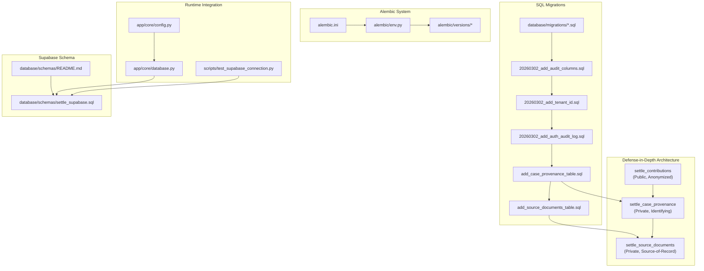

**Diagram sources**
- [alembic.ini:1-120](file://alembic.ini#L1-L120)
- [env.py:1-106](file://alembic/env.py#L1-L106)
- [20260302_add_audit_columns.sql:1-157](file://database/migrations/20260302_add_audit_columns.sql#L1-L157)
- [20260302_add_tenant_id.sql:1-86](file://database/migrations/20260302_add_tenant_id.sql#L1-L86)
- [20260302_add_auth_audit_log.sql:1-38](file://database/migrations/20260302_add_auth_audit_log.sql#L1-L38)
- [add_case_provenance_table.sql:1-304](file://database/migrations/add_case_provenance_table.sql#L1-L304)
- [add_source_documents_table.sql:1-333](file://database/migrations/add_source_documents_table.sql#L1-L333)
- [settle_supabase.sql:1-505](file://database/schemas/settle_supabase.sql#L1-L505)

**Section sources**
- [alembic.ini:1-120](file://alembic.ini#L1-L120)
- [env.py:1-106](file://alembic/env.py#L1-L106)
- [README:1-1](file://alembic/README#L1-L1)
- [settle_supabase.sql:1-505](file://database/schemas/settle_supabase.sql#L1-L505)
- [README.md:1-211](file://database/schemas/README.md#L1-L211)
- [config.py:1-351](file://app/core/config.py#L1-L351)
- [database.py:1-549](file://app/core/database.py#L1-L549)
- [test_supabase_connection.py:1-175](file://scripts/test_supabase_connection.py#L1-L175)

## Core Components
The migration system now encompasses several advanced components for comprehensive database management:

- **Enhanced Alembic configuration and runtime**:
  - alembic.ini defines script_location, version_locations, and SQLAlchemy URL for Supabase
  - env.py implements offline and online migration runners with environment variable injection
  - Supports target_metadata for autogenerate and enhanced security configurations

- **Comprehensive Alembic Python migrations**:
  - alembic/versions contain numbered revision files with upgrade/downgrade functions
  - Examples include billing events table and settlement records table with tenant ID support

- **Advanced SQL migrations**:
  - **Audit columns migration**: Adds soft-delete and lifecycle audit columns across multiple tables
  - **Tenant ID implementation**: Comprehensive tenant support with dedicated API key tables
  - **Authentication audit logging**: Complete audit trail for security events
  - **Case provenance tracking**: Separate audit-only table for identifying case information
  - **Source documents storage**: Private table for cryptographic verification of source materials

- **Three-table defense-in-depth architecture**:
  - **settle_contributions**: Public, anonymized data for general use
  - **settle_case_provenance**: Private, identifying data for audit purposes only
  - **settle_source_documents**: Private, source-of-record bytes for legal compliance

- **Enhanced Supabase schema**:
  - database/schemas/settle_supabase.sql defines production-ready tables with RLS policies
  - Comprehensive security enforcement with service_role access restrictions

- **Runtime integration**:
  - app/core/config.py abstracts provider-agnostic database credentials
  - app/core/database.py provides REST client with enhanced security features
  - scripts/test_supabase_connection.py validates connectivity and table availability

**Section sources**
- [alembic.ini:1-120](file://alembic.ini#L1-L120)
- [env.py:1-106](file://alembic/env.py#L1-L106)
- [2a2b34987e9e_add_billing_events_table.py:1-44](file://alembic/versions/2a2b34987e9e_add_billing_events_table.py#L1-L44)
- [33175e3b6200_add_settlement_records_table.py:1-48](file://alembic/versions/33175e3b6200_add_settlement_records_table.py#L1-L48)
- [20260302_add_audit_columns.sql:1-157](file://database/migrations/20260302_add_audit_columns.sql#L1-L157)
- [20260302_add_tenant_id.sql:1-86](file://database/migrations/20260302_add_tenant_id.sql#L1-L86)
- [20260302_add_auth_audit_log.sql:1-38](file://database/migrations/20260302_add_auth_audit_log.sql#L1-L38)
- [add_case_provenance_table.sql:1-304](file://database/migrations/add_case_provenance_table.sql#L1-L304)
- [add_source_documents_table.sql:1-333](file://database/migrations/add_source_documents_table.sql#L1-L333)
- [settle_supabase.sql:1-505](file://database/schemas/settle_supabase.sql#L1-L505)

## Architecture Overview
The enhanced migration architecture implements a comprehensive three-table defense-in-depth system for privacy compliance, combined with Alembic-managed Python migrations and database-native SQL migrations.

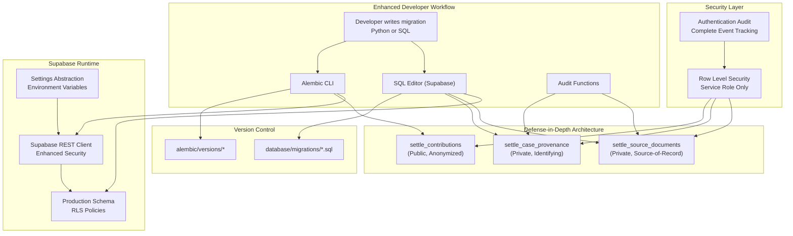

**Diagram sources**
- [alembic.ini:1-120](file://alembic.ini#L1-L120)
- [env.py:1-106](file://alembic/env.py#L1-L106)
- [add_case_provenance_table.sql:1-304](file://database/migrations/add_case_provenance_table.sql#L1-L304)
- [add_source_documents_table.sql:1-333](file://database/migrations/add_source_documents_table.sql#L1-L333)
- [20260302_add_auth_audit_log.sql:1-38](file://database/migrations/20260302_add_auth_audit_log.sql#L1-L38)
- [config.py:1-351](file://app/core/config.py#L1-L351)
- [database.py:1-549](file://app/core/database.py#L1-L549)

## Detailed Component Analysis

### Enhanced Alembic Configuration and Environment
The Alembic configuration now supports enhanced security and environment variable injection:

- **alembic.ini**:
  - script_location points to alembic directory
  - version_locations defaults to alembic/versions
  - sqlalchemy.url configured via environment variables for security
  - Enhanced logging configuration with INFO level for alembic logger
  - Support for multiple version locations and recursive searches

- **env.py**:
  - Implements offline mode with URL configuration without Engine
  - Supports online mode with enhanced connection handling from config
  - Environment variable injection with priority order: session pooler URL > pooler connection URL > database URL
  - ConfigParser escaping for Supabase password compatibility
  - Transaction-based migration execution for safety

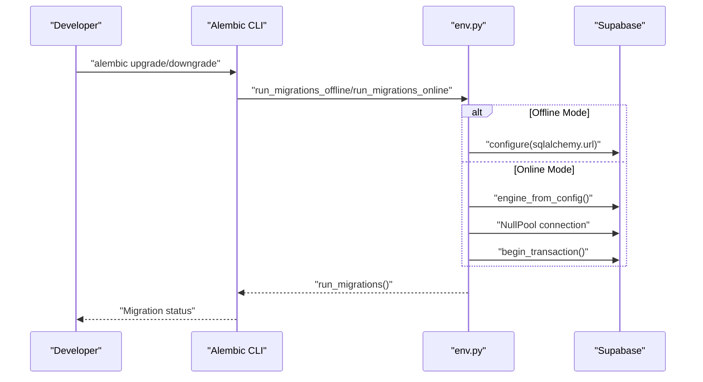

**Diagram sources**
- [alembic.ini:1-120](file://alembic.ini#L1-L120)
- [env.py:1-106](file://alembic/env.py#L1-L106)

**Section sources**
- [alembic.ini:1-120](file://alembic.ini#L1-L120)
- [env.py:1-106](file://alembic/env.py#L1-L106)

### Advanced Alembic Python Migrations
The Python migration system now handles complex schema changes with tenant ID support:

- **Structure**:
  - Each migration file contains numbered revision with proper identifiers
  - upgrade() defines schema changes with tenant_id and foreign key relationships
  - downgrade() provides complete rollback capabilities

- **Examples**:
  - **Billing Events Table**: Includes tenant_id indexing and comprehensive metadata storage
  - **Settlement Records Table**: Features fingerprint hashing and multi-dimensional indexing

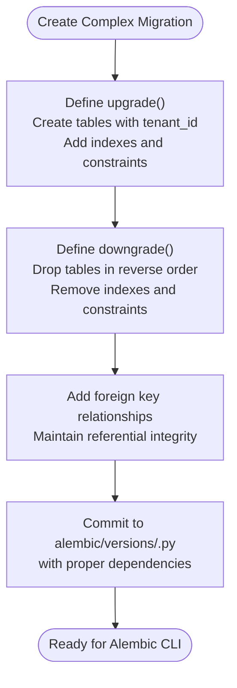

**Diagram sources**
- [2a2b34987e9e_add_billing_events_table.py:1-44](file://alembic/versions/2a2b34987e9e_add_billing_events_table.py#L1-L44)
- [33175e3b6200_add_settlement_records_table.py:1-48](file://alembic/versions/33175e3b6200_add_settlement_records_table.py#L1-L48)

**Section sources**
- [2a2b34987e9e_add_billing_events_table.py:1-44](file://alembic/versions/2a2b34987e9e_add_billing_events_table.py#L1-L44)
- [33175e3b6200_add_settlement_records_table.py:1-48](file://alembic/versions/33175e3b6200_add_settlement_records_table.py#L1-L48)

### Comprehensive SQL Migrations and Advanced Patterns

#### Audit Columns Migration
The audit columns migration implements comprehensive soft-delete and lifecycle tracking:

- **Soft-delete Implementation**:
  - Adds deleted_at TIMESTAMPTZ and deleted_by UUID columns
  - Creates selective indexes on deleted_at WHERE deleted_at IS NULL
  - Implements row_version for optimistic locking

- **Audit Trail Enhancement**:
  - Adds created_by and updated_by UUID columns
  - Creates comprehensive indexes for audit queries
  - Includes DO $$ ... $$ blocks for conditional table additions

- **Trigger Automation**:
  - Creates settle_update_updated_at_column() function
  - Applies triggers to all relevant tables
  - Ensures consistent timestamp updates

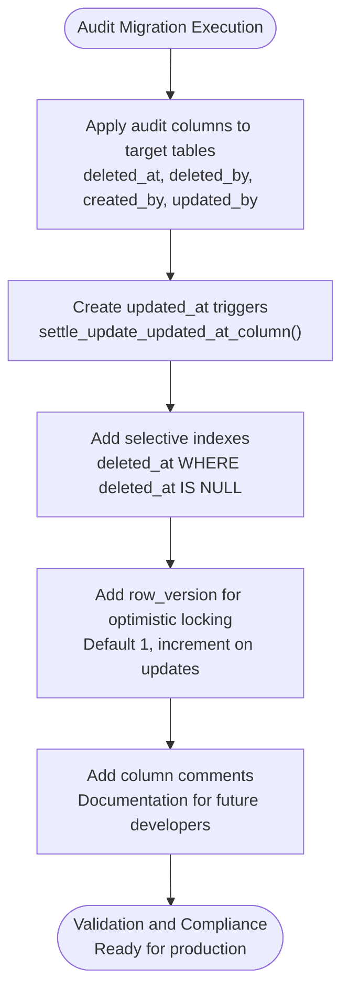

**Diagram sources**
- [20260302_add_audit_columns.sql:1-157](file://database/migrations/20260302_add_audit_columns.sql#L1-L157)

#### Tenant ID Implementation
The tenant ID migration introduces comprehensive multi-tenant support:

- **Core Tenant Support**:
  - Adds tenant_id column to settle_api_keys table
  - Creates tenant-scoped API keys table (settle_tenant_api_keys)
  - Implements service keys table (settle_service_keys) for internal services

- **Indexing Strategy**:
  - Creates tenant_id index for fast lookups
  - Implements composite indexes for active tenant keys
  - Adds selective indexes for soft-delete filtering

- **Security Implementation**:
  - Enables Row Level Security on tenant tables
  - Creates service_role policies for access control
  - Implements comprehensive uniqueness constraints

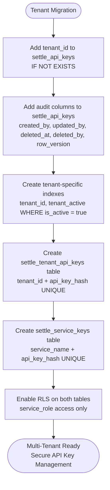

**Diagram sources**
- [20260302_add_tenant_id.sql:1-86](file://database/migrations/20260302_add_tenant_id.sql#L1-L86)

#### Authentication Audit Logging
The authentication audit logging system provides comprehensive security event tracking:

- **Audit Log Table**:
  - settle_auth_audit_log with comprehensive event tracking
  - Request correlation with request_id for traceability
  - Tenant and user identification fields

- **Indexing and Security**:
  - Multiple indexes for efficient querying (tenant, user, request, event type)
  - Row Level Security enabled with service_role access
  - Comprehensive policy definitions for security enforcement

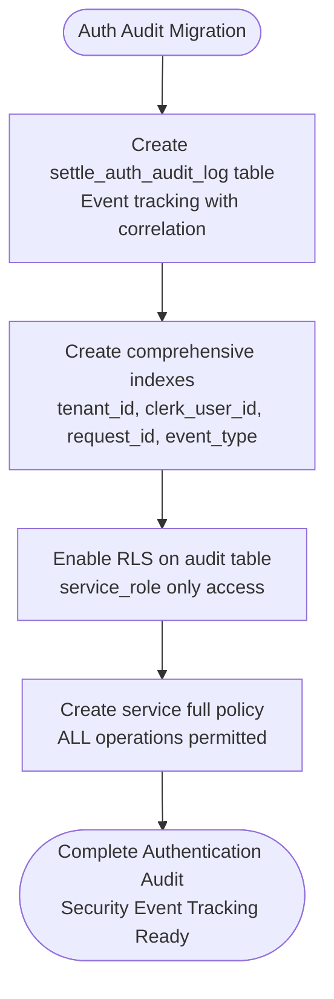

**Diagram sources**
- [20260302_add_auth_audit_log.sql:1-38](file://database/migrations/20260302_add_auth_audit_log.sql#L1-L38)

#### Case Provenance Tracking
The case provenance table implements privacy-compliant data separation:

- **Privacy Architecture**:
  - Separate audit-only table for identifying case information
  - 1:1 relationship with settle_contributions via foreign key
  - Comprehensive identifying fields (case_name, case_citation, docket_number, etc.)

- **Audit Controls**:
  - Helper function settle_audit_lookup_provenance() for controlled access
  - Automatic access logging with last_audit_access and last_audit_accessor
  - Administrative view for operational needs

- **Security Implementation**:
  - Row Level Security with service_role access only
  - Explicit revocation from public roles
  - Comprehensive constraints for data validation

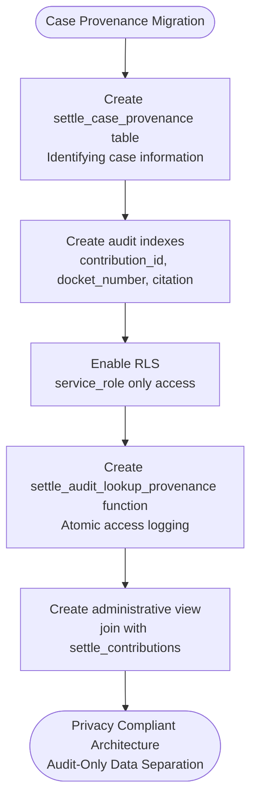

**Diagram sources**
- [add_case_provenance_table.sql:1-304](file://database/migrations/add_case_provenance_table.sql#L1-L304)

#### Source Documents Storage
The source documents table implements cryptographic verification and legal compliance:

- **Legal Archive Architecture**:
  - Private, source-of-record storage for legal evidence
  - Cryptographic verification with SHA-256 integrity checking
  - Full-text search capability with PostgreSQL GIN indexes

- **Security and Compliance**:
  - Service role only access with explicit revocations
  - Audit trail with last_accessed and last_accessor tracking
  - Helper functions for controlled access and search

- **Technical Implementation**:
  - Raw bytes stored in Supabase Storage with path references
  - Extracted text with full-text search vector
  - Comprehensive constraints for data validation

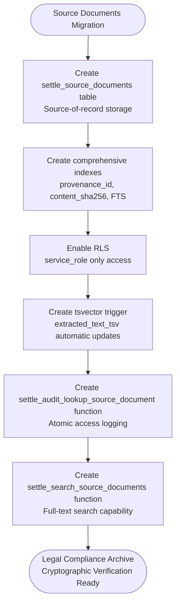

**Diagram sources**
- [add_source_documents_table.sql:1-333](file://database/migrations/add_source_documents_table.sql#L1-L333)

**Section sources**
- [20260302_add_audit_columns.sql:1-157](file://database/migrations/20260302_add_audit_columns.sql#L1-L157)
- [20260302_add_tenant_id.sql:1-86](file://database/migrations/20260302_add_tenant_id.sql#L1-L86)
- [20260302_add_auth_audit_log.sql:1-38](file://database/migrations/20260302_add_auth_audit_log.sql#L1-L38)
- [add_case_provenance_table.sql:1-304](file://database/migrations/add_case_provenance_table.sql#L1-L304)
- [add_source_documents_table.sql:1-333](file://database/migrations/add_source_documents_table.sql#L1-L333)

### Enhanced Supabase Schema and Deployment
The production schema now implements comprehensive security and privacy controls:

- **Production-ready schema**:
  - settle_supabase.sql defines six tables with constraints, indexes, views, and functions
  - Enables RLS on sensitive tables with service_role access policies
  - Defines comprehensive policies for authenticated users and service_role

- **Enhanced security implementation**:
  - Service role policies for full access to audit tables
  - Public role restrictions with explicit revocations
  - Administrative views with controlled access

- **Setup and validation**:
  - SUPABASE_SETUP_GUIDE.md provides step-by-step instructions
  - test_supabase_connection.py validates connectivity, table existence, and enhanced security features

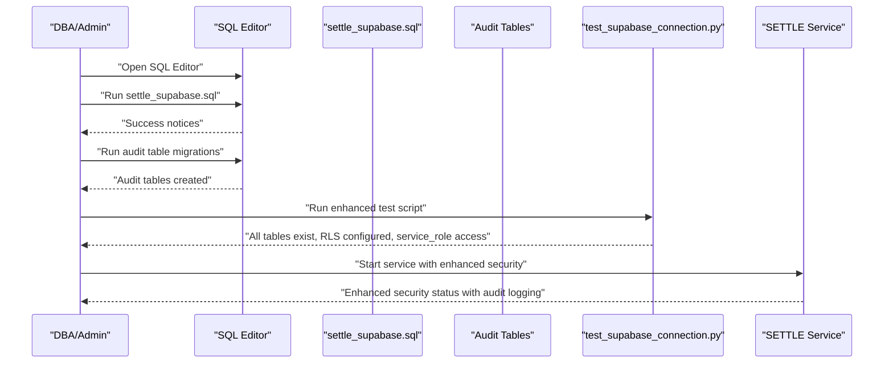

**Diagram sources**
- [settle_supabase.sql:1-505](file://database/schemas/settle_supabase.sql#L1-L505)
- [add_case_provenance_table.sql:1-304](file://database/migrations/add_case_provenance_table.sql#L1-L304)
- [add_source_documents_table.sql:1-333](file://database/migrations/add_source_documents_table.sql#L1-L333)
- [SUPABASE_SETUP_GUIDE.md:1-445](file://database/SUPABASE_SETUP_GUIDE.md#L1-L445)
- [test_supabase_connection.py:1-175](file://scripts/test_supabase_connection.py#L1-L175)

**Section sources**
- [settle_supabase.sql:1-505](file://database/schemas/settle_supabase.sql#L1-L505)
- [README.md:1-211](file://database/schemas/README.md#L1-L211)
- [SUPABASE_SETUP_GUIDE.md:1-445](file://database/SUPABASE_SETUP_GUIDE.md#L1-L445)
- [test_supabase_connection.py:1-175](file://scripts/test_supabase_connection.py#L1-L175)

### Enhanced Runtime Integration and Health Checks
The runtime integration now supports comprehensive security and audit capabilities:

- **Enhanced settings abstraction**:
  - config.py supports provider-agnostic and provider-specific credential names
  - Enhanced environment variable resolution with priority ordering
  - Improved error handling for database connection issues

- **Advanced REST client**:
  - database.py implements enhanced REST client with security features
  - Includes retry logic and comprehensive health checks
  - Supports service role authentication for audit operations

- **Comprehensive connection testing**:
  - test_supabase_connection.py validates all settle_ tables and enhanced security features
  - Tests RLS policies and service role access
  - Verifies audit table accessibility and functionality

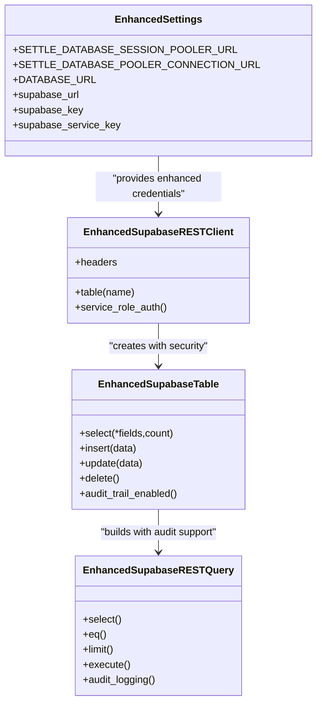

**Diagram sources**
- [config.py:1-351](file://app/core/config.py#L1-L351)
- [database.py:1-549](file://app/core/database.py#L1-L549)

**Section sources**
- [config.py:1-351](file://app/core/config.py#L1-L351)
- [database.py:1-549](file://app/core/database.py#L1-L549)
- [test_supabase_connection.py:1-175](file://scripts/test_supabase_connection.py#L1-L175)

## Dependency Analysis
The enhanced migration system creates complex interdependencies between components:

- **Alembic depends on**:
  - alembic.ini for configuration and enhanced SQLAlchemy URL
  - env.py for secure runtime migration execution with environment injection
  - alembic/versions for comprehensive revision history

- **SQL migrations depend on**:
  - database/schemas/settle_supabase.sql for baseline schema foundation
  - database/migrations/20260302_add_audit_columns.sql for audit infrastructure
  - database/migrations/20260302_add_tenant_id.sql for multi-tenant support
  - Supabase SQL Editor for execution with enhanced security

- **Defense-in-depth architecture depends on**:
  - Case provenance table for identifying data separation
  - Source documents table for cryptographic verification
  - Authentication audit logging for comprehensive security tracking

- **Runtime integration depends on**:
  - app/core/config.py for enhanced credential management
  - app/core/database.py for secure REST client with audit capabilities
  - scripts/test_supabase_connection.py for comprehensive validation

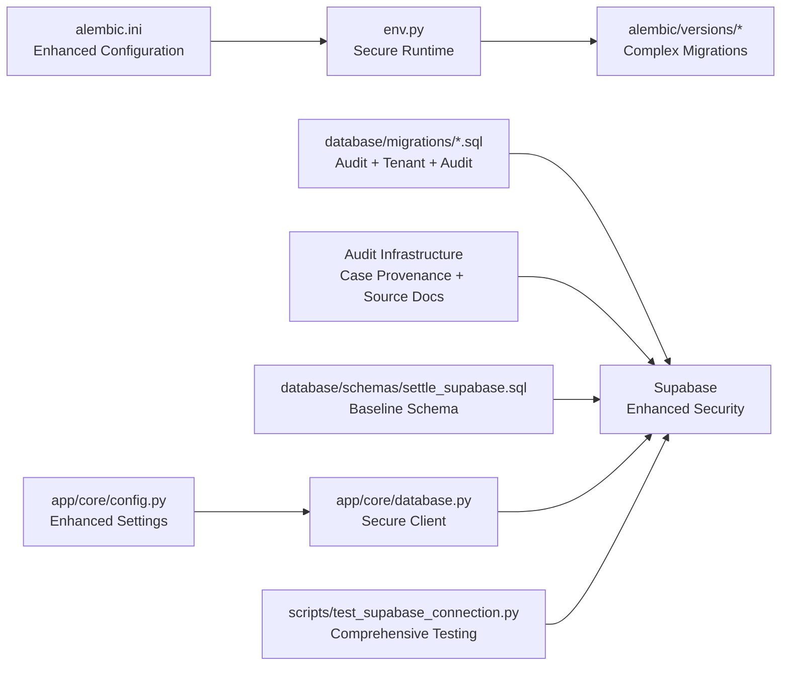

**Diagram sources**
- [alembic.ini:1-120](file://alembic.ini#L1-L120)
- [env.py:1-106](file://alembic/env.py#L1-L106)
- [20260302_add_audit_columns.sql:1-157](file://database/migrations/20260302_add_audit_columns.sql#L1-L157)
- [20260302_add_tenant_id.sql:1-86](file://database/migrations/20260302_add_tenant_id.sql#L1-L86)
- [add_case_provenance_table.sql:1-304](file://database/migrations/add_case_provenance_table.sql#L1-L304)
- [add_source_documents_table.sql:1-333](file://database/migrations/add_source_documents_table.sql#L1-L333)
- [settle_supabase.sql:1-505](file://database/schemas/settle_supabase.sql#L1-L505)
- [config.py:1-351](file://app/core/config.py#L1-L351)
- [database.py:1-549](file://app/core/database.py#L1-L549)
- [test_supabase_connection.py:1-175](file://scripts/test_supabase_connection.py#L1-L175)

**Section sources**
- [alembic.ini:1-120](file://alembic.ini#L1-L120)
- [env.py:1-106](file://alembic/env.py#L1-L106)
- [settle_supabase.sql:1-505](file://database/schemas/settle_supabase.sql#L1-L505)
- [config.py:1-351](file://app/core/config.py#L1-L351)
- [database.py:1-549](file://app/core/database.py#L1-L549)
- [test_supabase_connection.py:1-175](file://scripts/test_supabase_connection.py#L1-L175)

## Performance Considerations
The enhanced migration system implements sophisticated performance optimization strategies:

- **Advanced indexing strategy**:
  - Audit columns migrations add selective indexes on deleted_at and deleted_by for efficient filtering
  - Tenant ID migrations implement composite indexes for multi-tenant queries
  - Case provenance and source documents include specialized indexes for audit queries
  - Full-text search indexes with GIN for source document search performance

- **Trigger and auto-update optimization**:
  - updated_at triggers reduce application-side boilerplate with minimal overhead
  - Automatic tsvector updates for full-text search with efficient storage
  - Optimistic locking with row_version reduces conflict resolution overhead

- **Security and access control**:
  - RLS policies enable fine-grained access control with minimal performance impact
  - Service role access minimizes authorization checks for internal operations
  - Comprehensive indexing for audit queries balances performance with security

- **Storage and retrieval optimization**:
  - Separate tables for public and private data minimize query complexity
  - Cryptographic verification enables efficient integrity checking
  - Audit trail logging implemented with atomic operations for consistency

## Troubleshooting Guide
The enhanced system requires specialized troubleshooting approaches:

- **Enhanced Alembic offline/online mode**:
  - Ensure alembic.ini sqlalchemy.url points to correct Supabase connection with proper escaping
  - Verify env.py environment variable injection with priority ordering
  - Check transaction-based migration execution for safety

- **Complex SQL migration failures**:
  - Confirm prerequisite migrations are applied in correct order
  - Verify audit infrastructure exists before applying tenant migrations
  - Use DO $$ ... $$ blocks for conditional additions with proper error handling
  - Check RLS policy conflicts and service role access requirements

- **Defense-in-depth architecture issues**:
  - Verify case provenance table exists before creating source documents
  - Ensure foreign key relationships are properly established
  - Check audit function dependencies and trigger configurations

- **Enhanced Supabase connectivity**:
  - Use scripts/test_supabase_connection.py to validate enhanced security features
  - Test service role access to audit tables separately from public access
  - Verify RLS policies and policy inheritance across dependent tables

- **Rollback procedures**:
  - Prefer Alembic downgrade() for Python migrations with proper dependency handling
  - For complex SQL migrations, maintain reversible statements with proper comments
  - Implement staged rollbacks for multi-table dependencies
  - Test rollback procedures in staging environment first

**Section sources**
- [alembic.ini:1-120](file://alembic.ini#L1-L120)
- [env.py:1-106](file://alembic/env.py#L1-L106)
- [20260302_add_audit_columns.sql:1-157](file://database/migrations/20260302_add_audit_columns.sql#L1-L157)
- [20260302_add_tenant_id.sql:1-86](file://database/migrations/20260302_add_tenant_id.sql#L1-L86)
- [add_case_provenance_table.sql:1-304](file://database/migrations/add_case_provenance_table.sql#L1-L304)
- [add_source_documents_table.sql:1-333](file://database/migrations/add_source_documents_table.sql#L1-L333)
- [test_supabase_connection.py:1-175](file://scripts/test_supabase_connection.py#L1-L175)
- [SUPABASE_SETUP_GUIDE.md:1-445](file://database/SUPABASE_SETUP_GUIDE.md#L1-L445)

## Conclusion
SETTLE Service employs a comprehensive, security-focused dual-migration strategy that implements industry-leading privacy and compliance standards:

- **Alembic Python migrations** for structured, versioned schema changes with enhanced security
- **Advanced SQL migrations** for database-native enhancements including audit infrastructure, tenant ID implementation, and specialized audit tables
- **Three-table defense-in-depth architecture** for privacy compliance with separate public, private, and source-of-record data layers
- **Comprehensive authentication audit logging** for legal and regulatory compliance
- **Production-ready Supabase schema** with enhanced RLS, constraints, and security policies
- **Enhanced runtime integration** via secure REST client with audit capabilities and comprehensive health checks

The system now supports sophisticated multi-tenant operations, comprehensive audit trails, and legal compliance requirements while maintaining reliable connectivity and performance. Adhering to the enhanced documented patterns and validation steps ensures schema consistency across environments and simplifies deployment and rollback procedures for complex database changes.