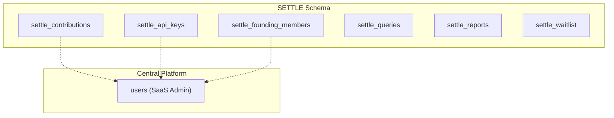
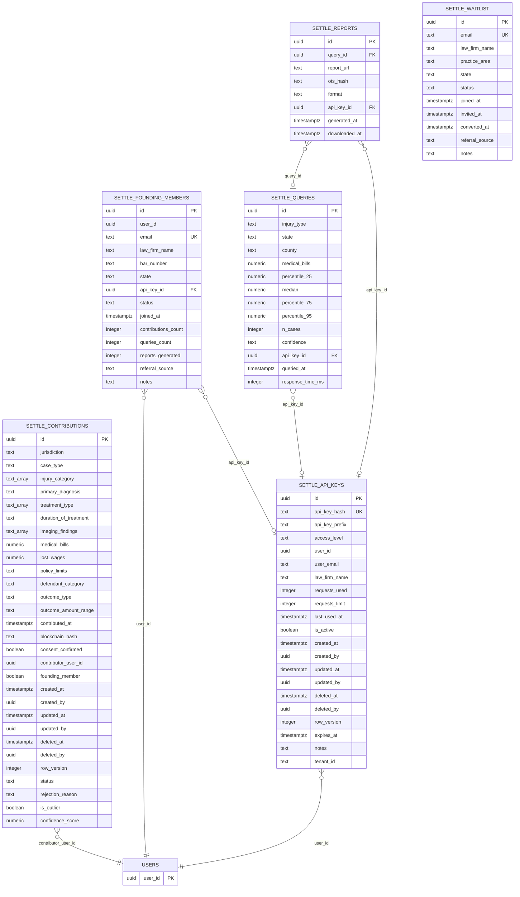
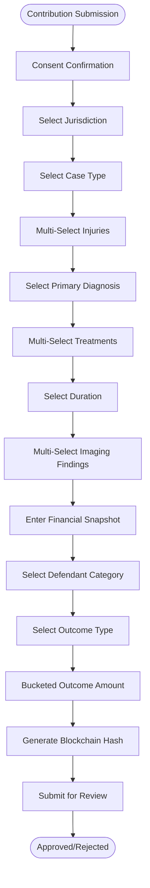
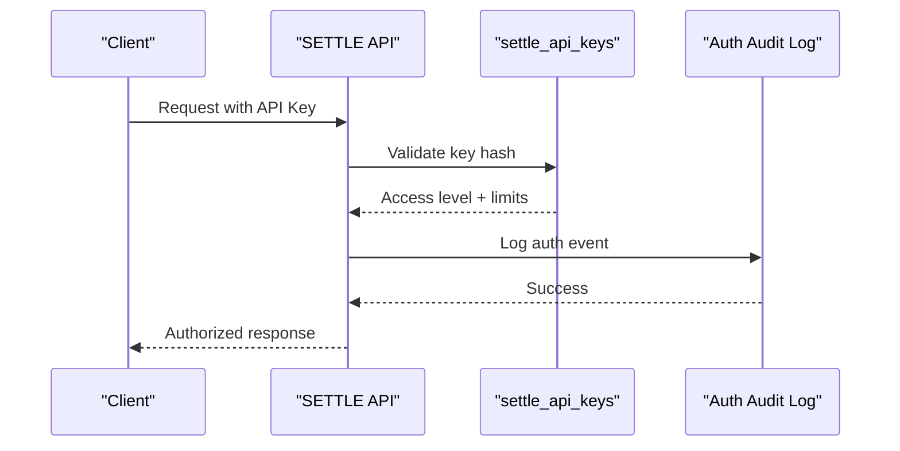
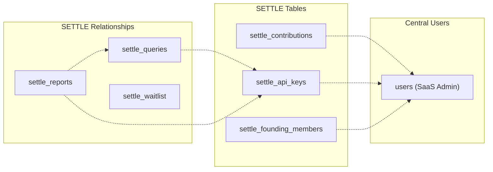

# Schema Overview

<cite>
**Referenced Files in This Document**
- [CREATE_SETTLE_DATABASE.sql](file://database/CREATE_SETTLE_DATABASE.sql)
- [settle_supabase.sql](file://database/schemas/settle_supabase.sql)
- [DATABASE_SCHEMA.md](file://docs/DATABASE_SCHEMA.md)
- [FIXES_APPLIED.md](file://database/FIXES_APPLIED.md)
- [SUPABASE_SETUP_GUIDE.md](file://database/SUPABASE_SETUP_GUIDE.md)
- [add_waitlist_table.sql](file://database/migrations/add_waitlist_table.sql)
- [20260302_add_audit_columns.sql](file://database/migrations/20260302_add_audit_columns.sql)
- [20260302_add_auth_audit_log.sql](file://database/migrations/20260302_add_auth_audit_log.sql)
- [20260302_add_tenant_id.sql](file://database/migrations/20260302_add_tenant_id.sql)
- [SETTLE_DUAL_AUTH_ARCHITECTURE.md](file://docs/architecture/SETTLE_DUAL_AUTH_ARCHITECTURE.md)
- [ENCRYPTION_IMPLEMENTATION.md](file://docs/security/ENCRYPTION_IMPLEMENTATION.md)
- [env.py](file://alembic/env.py)
</cite>

## Table of Contents
1. [Introduction](#introduction)
2. [Project Structure](#project-structure)
3. [Core Components](#core-components)
4. [Architecture Overview](#architecture-overview)
5. [Detailed Component Analysis](#detailed-component-analysis)
6. [Dependency Analysis](#dependency-analysis)
7. [Performance Considerations](#performance-considerations)
8. [Troubleshooting Guide](#troubleshooting-guide)
9. [Conclusion](#conclusion)
10. [Appendices](#appendices)

## Introduction
This document provides a comprehensive overview of the SETTLE Service database schema, focusing on the zero-PHI compliance approach, bar-compliant data collection methodology, ethical data handling principles, and the legal technology application design. It explains the overall database architecture, table relationships, and design philosophy, including the use of settle_ prefixes, UUID primary keys, centralized user table references, database extensions, row-level security (RLS), and audit trail design.

## Project Structure
The database schema is delivered as a production-ready Supabase schema with clear separation of concerns and strong security foundations. The schema is organized around six core tables under the settle_ namespace, with supporting views, functions, and policies for analytics and access control.

**Diagram sources**
- [settle_supabase.sql:27-113](file://database/schemas/settle_supabase.sql#L27-L113)
- [settle_supabase.sql:139-182](file://database/schemas/settle_supabase.sql#L139-L182)
- [settle_supabase.sql:200-236](file://database/schemas/settle_supabase.sql#L200-L236)
- [settle_supabase.sql:246-278](file://database/schemas/settle_supabase.sql#L246-L278)
- [settle_supabase.sql:287-310](file://database/schemas/settle_supabase.sql#L287-L310)
- [settle_supabase.sql:318-345](file://database/schemas/settle_supabase.sql#L318-L345)

**Section sources**
- [settle_supabase.sql:15-25](file://database/schemas/settle_supabase.sql#L15-L25)
- [DATABASE_SCHEMA.md:24-40](file://docs/DATABASE_SCHEMA.md#L24-L40)

## Core Components
- settle_contributions: Anonymous settlement data contributions with zero PHI, using drop-down selections and bucketed amounts.
- settle_api_keys: API key management with access levels and usage tracking.
- settle_founding_members: Founding Member program tracking with contribution and query statistics.
- settle_queries: Settlement range query tracking for analytics and billing.
- settle_reports: Generated SETTLE reports with OpenTimestamps hashing.
- settle_waitlist: Pre-launch waitlist for non-customers with enhanced fields and statuses.

Each table uses UUID primary keys, centralized user references, and includes audit and quality control fields. Row-level security is enabled on sensitive tables, and comprehensive indexes optimize query performance.

**Section sources**
- [settle_supabase.sql:31-113](file://database/schemas/settle_supabase.sql#L31-L113)
- [settle_supabase.sql:142-182](file://database/schemas/settle_supabase.sql#L142-L182)
- [settle_supabase.sql:203-236](file://database/schemas/settle_supabase.sql#L203-L236)
- [settle_supabase.sql:249-278](file://database/schemas/settle_supabase.sql#L249-L278)
- [settle_supabase.sql:290-310](file://database/schemas/settle_supabase.sql#L290-L310)
- [settle_supabase.sql:321-345](file://database/schemas/settle_supabase.sql#L321-L345)

## Architecture Overview
The SETTLE Service schema follows a centralized design that references the central SaaS Admin users table for attorney accounts while maintaining strict privacy and compliance. The schema emphasizes:

- Zero PHI/PII data collection through controlled vocabularies and bucketed amounts
- Bar-compliant methodology ensuring legal applicability across jurisdictions
- Ethical data handling with transparent consent and audit trails
- Strong security through UUIDs, RLS, and cryptographic extensions

**Diagram sources**
- [settle_supabase.sql:31-113](file://database/schemas/settle_supabase.sql#L31-L113)
- [settle_supabase.sql:142-182](file://database/schemas/settle_supabase.sql#L142-L182)
- [settle_supabase.sql:203-236](file://database/schemas/settle_supabase.sql#L203-L236)
- [settle_supabase.sql:249-278](file://database/schemas/settle_supabase.sql#L249-L278)
- [settle_supabase.sql:290-310](file://database/schemas/settle_supabase.sql#L290-L310)
- [settle_supabase.sql:321-345](file://database/schemas/settle_supabase.sql#L321-L345)

## Detailed Component Analysis

### settle_contributions: Zero-PHI Anonymized Data Collection
The contributions table embodies the core zero-PHI design philosophy:
- Controlled vocabularies for all categorical fields
- Bucketed monetary ranges instead of precise amounts
- Multi-select arrays for injuries and treatments
- Explicit consent and blockchain hashing for integrity
- Centralized user reference without duplicating contact data

**Diagram sources**
- [settle_supabase.sql:32-114](file://database/schemas/settle_supabase.sql#L32-L114)

**Section sources**
- [settle_supabase.sql:28-31](file://database/schemas/settle_supabase.sql#L28-L31)
- [settle_supabase.sql:38-67](file://database/schemas/settle_supabase.sql#L38-L67)
- [settle_supabase.sql:71-74](file://database/schemas/settle_supabase.sql#L71-L74)
- [settle_supabase.sql:78-81](file://database/schemas/settle_supabase.sql#L78-L81)

### settle_api_keys: Access Control and Usage Tracking
The API key system provides tiered access with comprehensive tracking:
- SHA-256 hashed keys for security
- Access levels from founding_member to external
- Usage limits and expiration controls
- Tenant scoping for customer portal integration
- Audit trail with created_by/updated_by patterns

**Diagram sources**
- [settle_supabase.sql:142-182](file://database/schemas/settle_supabase.sql#L142-L182)
- [20260302_add_auth_audit_log.sql:6-38](file://database/migrations/20260302_add_auth_audit_log.sql#L6-L38)

**Section sources**
- [settle_supabase.sql:146-151](file://database/schemas/settle_supabase.sql#L146-L151)
- [settle_supabase.sql:158-161](file://database/schemas/settle_supabase.sql#L158-L161)
- [settle_supabase.sql:163-171](file://database/schemas/settle_supabase.sql#L163-L171)

### settle_founding_members: Program Management
The founding member program tracks 2,100 attorneys with comprehensive metrics:
- Email-based membership with unique constraints
- State and bar number tracking
- Contribution, query, and report generation statistics
- Status management (active, inactive, revoked)

**Section sources**
- [settle_supabase.sql:207-212](file://database/schemas/settle_supabase.sql#L207-L212)
- [settle_supabase.sql:221-224](file://database/schemas/settle_supabase.sql#L221-L224)
- [settle_supabase.sql:217-218](file://database/schemas/settle_supabase.sql#L217-L218)

### settle_queries and settle_reports: Analytics and Reporting
Query and reporting infrastructure supports analytics and billing:
- Percentile calculations with confidence indicators
- Response time tracking for performance monitoring
- Report generation with OpenTimestamps hashing
- Tenant scoping for customer portal integration

**Section sources**
- [settle_supabase.sql:253-265](file://database/schemas/settle_supabase.sql#L253-L265)
- [settle_supabase.sql:294-297](file://database/schemas/settle_supabase.sql#L294-L297)

### settle_waitlist: Enhanced Pre-Launch Management
The waitlist table has been enhanced with comprehensive fields:
- Firm and contact information
- Practice area arrays and jurisdiction mapping
- Review tracking with admin metadata
- Expanded status options including rejected

**Section sources**
- [add_waitlist_table.sql:7-14](file://database/migrations/add_waitlist_table.sql#L7-L14)
- [add_waitlist_table.sql:38-40](file://database/migrations/add_waitlist_table.sql#L38-L40)

## Dependency Analysis
The schema maintains logical relationships to the central users table without enforcing foreign key constraints, enabling cross-database flexibility while preserving referential integrity at the application level.

**Diagram sources**
- [settle_supabase.sql:78-79](file://database/schemas/settle_supabase.sql#L78-L79)
- [settle_supabase.sql:153-154](file://database/schemas/settle_supabase.sql#L153-L154)
- [settle_supabase.sql:207-208](file://database/schemas/settle_supabase.sql#L207-L208)
- [settle_supabase.sql:267-268](file://database/schemas/settle_supabase.sql#L267-L268)
- [settle_supabase.sql:294-295](file://database/schemas/settle_supabase.sql#L294-L295)

**Section sources**
- [settle_supabase.sql:406-407](file://database/schemas/settle_supabase.sql#L406-L407)
- [settle_supabase.sql:406-407](file://database/schemas/settle_supabase.sql#L406-L407)

## Performance Considerations
The schema incorporates extensive indexing strategies for optimal query performance:

- GIN indexes on multi-select arrays for injury categories and treatment types
- Composite indexes for common query patterns (jurisdiction, case_type, status)
- Soft-delete indexes with filtered WHERE clauses for efficient querying
- Performance indexes on frequently queried columns (medical_bills, created_at, etc.)
- Tenant-scoped indexes for customer portal integration

**Section sources**
- [settle_supabase.sql:116-129](file://database/schemas/settle_supabase.sql#L116-L129)
- [settle_supabase.sql:185-198](file://database/schemas/settle_supabase.sql#L185-L198)
- [settle_supabase.sql:281-285](file://database/schemas/settle_supabase.sql#L281-L285)
- [settle_supabase.sql:313-316](file://database/schemas/settle_supabase.sql#L313-L316)
- [settle_supabase.sql:348-351](file://database/schemas/settle_supabase.sql#L348-L351)

## Troubleshooting Guide
Common issues and resolutions for the SETTLE Service database:

### Schema Creation Issues
- **Problem**: Tables not found after schema execution
- **Solution**: Verify Supabase SQL Editor executed the settle_supabase.sql file and check for the settle_ prefix

### Permission Issues
- **Problem**: "permission denied for table" errors
- **Solution**: Ensure RLS policies are properly configured and grant appropriate permissions to service_role

### Connection Issues
- **Problem**: "relation settle_contributions does not exist"
- **Solution**: Confirm the schema file was executed and verify table existence in the SQL Editor

**Section sources**
- [SUPABASE_SETUP_GUIDE.md:372-407](file://database/SUPABASE_SETUP_GUIDE.md#L372-L407)
- [FIXES_APPLIED.md:165-207](file://database/FIXES_APPLIED.md#L165-L207)

## Conclusion
The SETTLE Service database schema represents a mature, production-ready design that balances legal technology requirements with strong privacy and security principles. Through zero-PHI data collection, bar-compliant methodologies, ethical handling practices, and robust technical foundations—including UUID primary keys, centralized user references, comprehensive indexing, row-level security, and audit trails—the schema provides a solid foundation for scalable, compliant legal analytics services.

## Appendices

### Database Extensions and Security Features
The schema leverages essential PostgreSQL extensions and security measures:

- uuid-ossp: Universally unique identifier generation
- pgcrypto: Cryptographic functions for API key hashing
- Row-Level Security: Protection for sensitive tables
- Check Constraints: Data validation and integrity
- Audit Columns: Complete lifecycle tracking

**Section sources**
- [settle_supabase.sql:24-25](file://database/schemas/settle_supabase.sql#L24-L25)
- [settle_supabase.sql:406-407](file://database/schemas/settle_supabase.sql#L406-L407)
- [settle_supabase.sql:101-113](file://database/schemas/settle_supabase.sql#L101-L113)

### Migration and Evolution
The schema continues to evolve with structured migrations supporting:
- Enhanced audit capabilities with soft-delete patterns
- Customer portal integration with tenant scoping
- Comprehensive authentication audit logging
- Waitlist table enhancements for operational needs

**Section sources**
- [20260302_add_audit_columns.sql:1-157](file://database/migrations/20260302_add_audit_columns.sql#L1-L157)
- [20260302_add_tenant_id.sql:1-86](file://database/migrations/20260302_add_tenant_id.sql#L1-L86)
- [20260302_add_auth_audit_log.sql:1-38](file://database/migrations/20260302_add_auth_audit_log.sql#L1-L38)