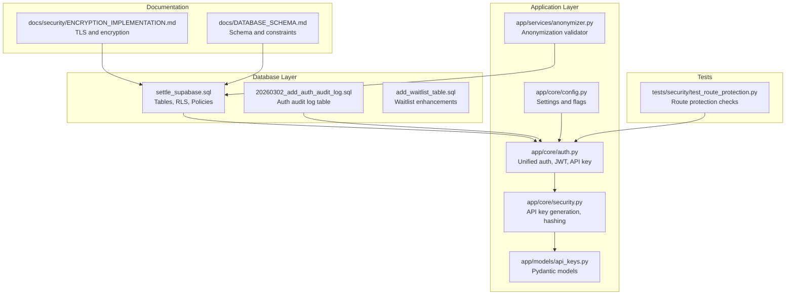
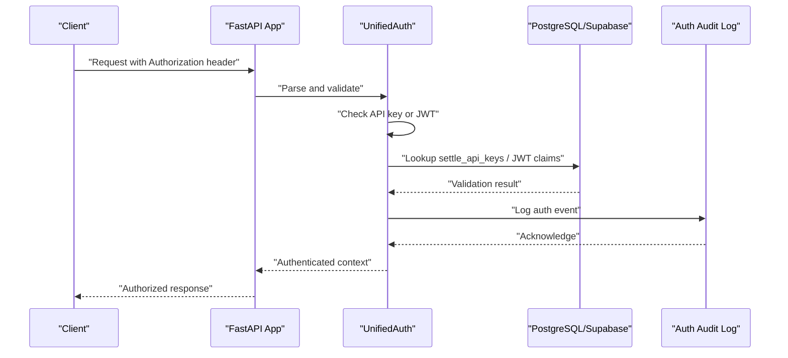
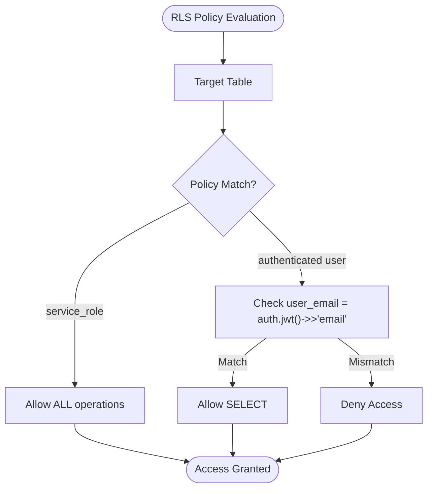
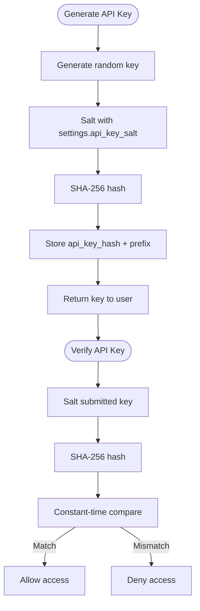
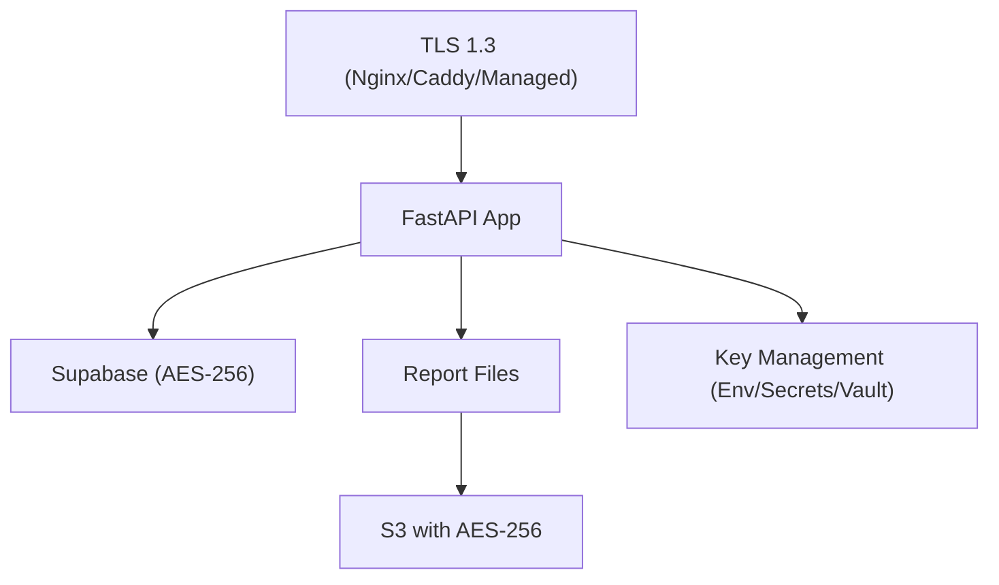
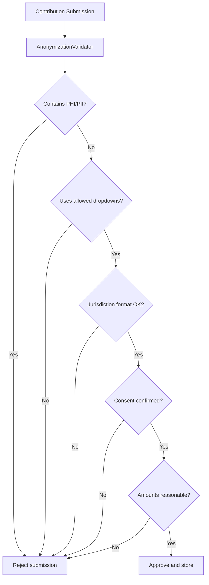
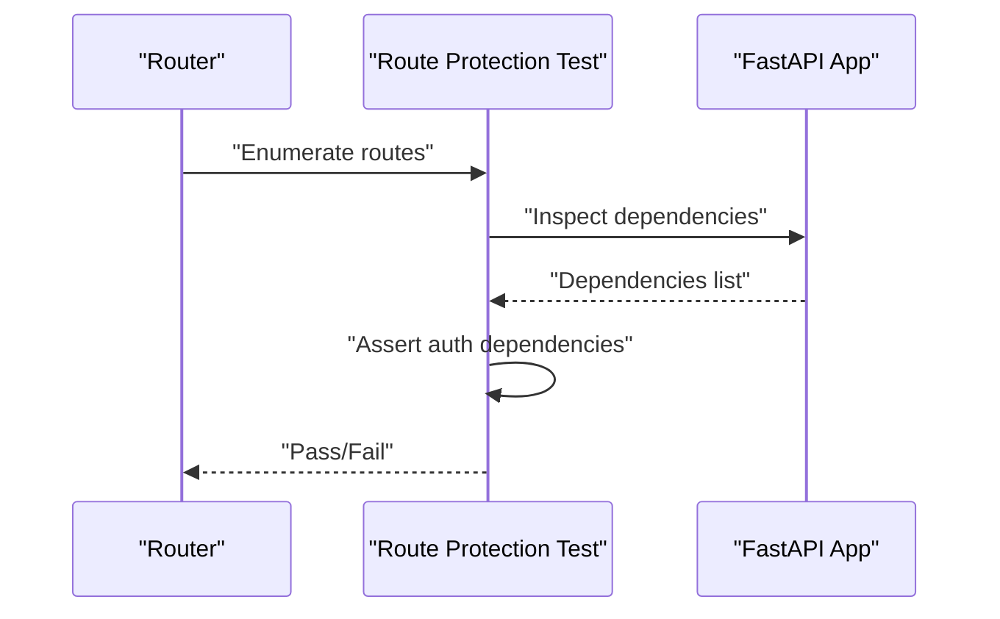
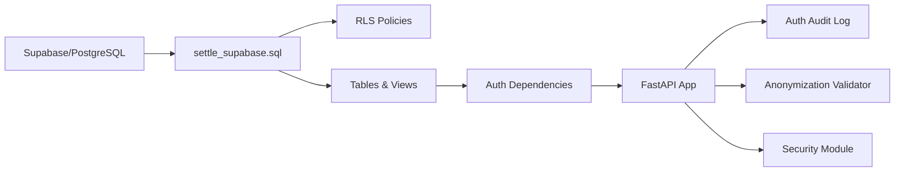

# Security & Compliance

<cite>
**Referenced Files in This Document**
- [settle_supabase.sql](file://database/schemas/settle_supabase.sql)
- [ENCRYPTION_IMPLEMENTATION.md](file://docs/security/ENCRYPTION_IMPLEMENTATION.md)
- [api_keys.py](file://app/models/api_keys.py)
- [security.py](file://app/core/security.py)
- [auth.py](file://app/core/auth.py)
- [config.py](file://app/core/config.py)
- [anonymizer.py](file://app/services/anonymizer.py)
- [DATABASE_SCHEMA.md](file://docs/DATABASE_SCHEMA.md)
- [add_waitlist_table.sql](file://database/migrations/add_waitlist_table.sql)
- [20260302_add_auth_audit_log.sql](file://database/migrations/20260302_add_auth_audit_log.sql)
- [test_route_protection.py](file://tests/security/test_route_protection.py)
</cite>

## Table of Contents
1. [Introduction](#introduction)
2. [Project Structure](#project-structure)
3. [Core Components](#core-components)
4. [Architecture Overview](#architecture-overview)
5. [Detailed Component Analysis](#detailed-component-analysis)
6. [Dependency Analysis](#dependency-analysis)
7. [Performance Considerations](#performance-considerations)
8. [Troubleshooting Guide](#troubleshooting-guide)
9. [Conclusion](#conclusion)
10. [Appendices](#appendices)

## Introduction
This document provides comprehensive coverage of database security and compliance measures in SETTLE Service. It focuses on row-level security (RLS) policies for sensitive tables, encryption implementation using the pgcrypto extension, API key hashing with SHA-256, and the zero-PHI/PII data handling approach. It also outlines the compliance framework, bar-compliant data collection, ethical data contribution workflows, privacy-preserving data structures, and security best practices that enable legal technology operations while maintaining strict confidentiality requirements.

## Project Structure
SETTLE Service organizes security and compliance across:
- Database schema and RLS policies
- Encryption documentation and implementation
- Authentication and authorization modules
- Data anonymization validators
- Configuration and audit logging
- Testing and validation of route protection

**Diagram sources**
- [settle_supabase.sql:402-437](file://database/schemas/settle_supabase.sql#L402-L437)
- [20260302_add_auth_audit_log.sql:1-38](file://database/migrations/20260302_add_auth_audit_log.sql#L1-L38)
- [add_waitlist_table.sql:1-61](file://database/migrations/add_waitlist_table.sql#L1-L61)
- [auth.py:1-120](file://app/core/auth.py#L1-L120)
- [security.py:1-120](file://app/core/security.py#L1-L120)
- [api_keys.py:1-147](file://app/models/api_keys.py#L1-L147)
- [anonymizer.py:1-120](file://app/services/anonymizer.py#L1-L120)
- [config.py:1-120](file://app/core/config.py#L1-L120)
- [ENCRYPTION_IMPLEMENTATION.md:1-120](file://docs/security/ENCRYPTION_IMPLEMENTATION.md#L1-L120)
- [DATABASE_SCHEMA.md:1-120](file://docs/DATABASE_SCHEMA.md#L1-L120)
- [test_route_protection.py:1-120](file://tests/security/test_route_protection.py#L1-L120)

**Section sources**
- [settle_supabase.sql:1-120](file://database/schemas/settle_supabase.sql#L1-L120)
- [auth.py:1-120](file://app/core/auth.py#L1-L120)
- [security.py:1-120](file://app/core/security.py#L1-L120)
- [ENCRYPTION_IMPLEMENTATION.md:1-120](file://docs/security/ENCRYPTION_IMPLEMENTATION.md#L1-L120)
- [DATABASE_SCHEMA.md:1-120](file://docs/DATABASE_SCHEMA.md#L1-L120)
- [test_route_protection.py:1-120](file://tests/security/test_route_protection.py#L1-L120)

## Core Components
- Row-level security (RLS) policies for settle_api_keys and settle_founding_members
- API key hashing with SHA-256 and secure generation
- Encryption implementation using pgcrypto extension and layered encryption
- Zero-PHI/PII anonymization validator and bar-compliant data structures
- Auth audit logging and route protection testing
- Configuration flags for security modes and permissions

**Section sources**
- [settle_supabase.sql:402-437](file://database/schemas/settle_supabase.sql#L402-L437)
- [security.py:23-66](file://app/core/security.py#L23-L66)
- [ENCRYPTION_IMPLEMENTATION.md:297-470](file://docs/security/ENCRYPTION_IMPLEMENTATION.md#L297-L470)
- [anonymizer.py:17-180](file://app/services/anonymizer.py#L17-L180)
- [20260302_add_auth_audit_log.sql:1-38](file://database/migrations/20260302_add_auth_audit_log.sql#L1-L38)
- [test_route_protection.py:22-110](file://tests/security/test_route_protection.py#L22-L110)

## Architecture Overview
The security architecture integrates database-level RLS, application-level authentication, encryption, and audit logging to enforce strict confidentiality and compliance.

**Diagram sources**
- [auth.py:340-485](file://app/core/auth.py#L340-L485)
- [security.py:68-122](file://app/core/security.py#L68-L122)
- [20260302_add_auth_audit_log.sql:6-22](file://database/migrations/20260302_add_auth_audit_log.sql#L6-L22)

## Detailed Component Analysis

### Row-Level Security (RLS) Policies
- RLS is enabled on settle_api_keys and settle_founding_members.
- Policies:
  - service_role has full access to both tables.
  - Authenticated users can read their own API key info via a policy using JWT claims.

**Diagram sources**
- [settle_supabase.sql:402-437](file://database/schemas/settle_supabase.sql#L402-L437)

**Section sources**
- [settle_supabase.sql:402-437](file://database/schemas/settle_supabase.sql#L402-L437)

### API Key Hashing and Generation
- Secure API key generation using cryptographically strong randomness.
- SHA-256 hashing with a configurable salt from settings.
- Verified using constant-time comparison to prevent timing attacks.
- API key prefix stored for display; full key shown only once upon creation.

**Diagram sources**
- [security.py:23-66](file://app/core/security.py#L23-L66)
- [config.py:167-183](file://app/core/config.py#L167-L183)

**Section sources**
- [security.py:23-66](file://app/core/security.py#L23-L66)
- [config.py:167-183](file://app/core/config.py#L167-L183)
- [api_keys.py:11-76](file://app/models/api_keys.py#L11-L76)

### Encryption Implementation
- TLS 1.3 in transit using reverse proxies or managed platforms.
- AES-256-GCM at rest via:
  - Supabase automatic encryption
  - Optional pgcrypto extension for selective column encryption
  - File-level encryption for reports and backups
- Key management via environment variables, AWS Secrets Manager, or HashiCorp Vault.

**Diagram sources**
- [ENCRYPTION_IMPLEMENTATION.md:18-220](file://docs/security/ENCRYPTION_IMPLEMENTATION.md#L18-L220)
- [ENCRYPTION_IMPLEMENTATION.md:297-470](file://docs/security/ENCRYPTION_IMPLEMENTATION.md#L297-L470)

**Section sources**
- [ENCRYPTION_IMPLEMENTATION.md:1-220](file://docs/security/ENCRYPTION_IMPLEMENTATION.md#L1-L220)
- [ENCRYPTION_IMPLEMENTATION.md:297-470](file://docs/security/ENCRYPTION_IMPLEMENTATION.md#L297-L470)

### Zero-PHI/PII Data Handling and Bar Compliance
- All contributions are anonymized and use drop-down values and bucketed ranges.
- Anonymization validator enforces:
  - No PHI/PII patterns (SSN, DOB, phone, email, addresses)
  - No free-text narratives or specific identifiers
  - Jurisdiction format “County, ST”
  - Consent confirmation required
  - Reasonable financial amounts
- Bar-compliant data collection and ethical contribution workflows.

**Diagram sources**
- [anonymizer.py:92-180](file://app/services/anonymizer.py#L92-L180)
- [DATABASE_SCHEMA.md:44-114](file://docs/DATABASE_SCHEMA.md#L44-L114)

**Section sources**
- [anonymizer.py:17-180](file://app/services/anonymizer.py#L17-L180)
- [DATABASE_SCHEMA.md:24-48](file://docs/DATABASE_SCHEMA.md#L24-L48)

### Auth Audit Logging and Route Protection
- Auth audit log table with RLS and service_role full access.
- Runtime tests verify that all non-public routes have explicit authentication dependencies.
- Security contract requirements enforced via configuration flags.

**Diagram sources**
- [test_route_protection.py:22-110](file://tests/security/test_route_protection.py#L22-L110)
- [20260302_add_auth_audit_log.sql:6-37](file://database/migrations/20260302_add_auth_audit_log.sql#L6-L37)

**Section sources**
- [20260302_add_auth_audit_log.sql:1-38](file://database/migrations/20260302_add_auth_audit_log.sql#L1-L38)
- [test_route_protection.py:22-110](file://tests/security/test_route_protection.py#L22-L110)

### Waitlist Enhancements and Privacy
- Enhanced settle_waitlist with additional fields for improved privacy and governance.
- Constraints and indexes updated to support new schema.

**Section sources**
- [add_waitlist_table.sql:1-61](file://database/migrations/add_waitlist_table.sql#L1-L61)

## Dependency Analysis
- Database schema depends on pgcrypto extension for encryption capabilities.
- Application authentication depends on Supabase/JWT and API key storage.
- Audit logging depends on database migrations and RLS policies.
- Anonymization validator depends on predefined allowed lists and regex patterns.

**Diagram sources**
- [settle_supabase.sql:15-17](file://database/schemas/settle_supabase.sql#L15-L17)
- [auth.py:1-120](file://app/core/auth.py#L1-L120)
- [20260302_add_auth_audit_log.sql:1-38](file://database/migrations/20260302_add_auth_audit_log.sql#L1-L38)
- [anonymizer.py:1-120](file://app/services/anonymizer.py#L1-L120)
- [security.py:1-120](file://app/core/security.py#L1-L120)

**Section sources**
- [settle_supabase.sql:15-17](file://database/schemas/settle_supabase.sql#L15-L17)
- [auth.py:1-120](file://app/core/auth.py#L1-L120)
- [20260302_add_auth_audit_log.sql:1-38](file://database/migrations/20260302_add_auth_audit_log.sql#L1-L38)
- [anonymizer.py:1-120](file://app/services/anonymizer.py#L1-L120)
- [security.py:1-120](file://app/core/security.py#L1-L120)

## Performance Considerations
- RLS evaluation adds minimal overhead; ensure indexes on filtered columns (e.g., user_email, api_key_hash).
- Use composite indexes for frequent query patterns (e.g., jurisdiction, case_type, status).
- Offload heavy encryption to managed services (Supabase) to reduce CPU overhead.
- Asynchronous updates for request counters to avoid blocking requests.

[No sources needed since this section provides general guidance]

## Troubleshooting Guide
- If API key verification fails, confirm:
  - API key format starts with “settle_”.
  - Database connectivity and settle_api_keys table availability.
  - Correct salt configuration in settings.
- If RLS denies access:
  - Verify service_role privileges and policy existence.
  - Ensure authenticated user’s email matches JWT claim.
- If encryption issues occur:
  - Confirm pgcrypto extension is enabled.
  - Verify TLS 1.3 configuration and certificate installation.
- If anonymization rejects submissions:
  - Review forbidden patterns and allowed dropdown lists.
  - Ensure jurisdiction format and consent confirmation.

**Section sources**
- [auth.py:513-708](file://app/core/auth.py#L513-L708)
- [security.py:68-122](file://app/core/security.py#L68-L122)
- [settle_supabase.sql:402-437](file://database/schemas/settle_supabase.sql#L402-L437)
- [ENCRYPTION_IMPLEMENTATION.md:265-294](file://docs/security/ENCRYPTION_IMPLEMENTATION.md#L265-L294)
- [anonymizer.py:92-180](file://app/services/anonymizer.py#L92-L180)

## Conclusion
SETTLE Service implements a robust, defense-in-depth security posture combining database-level RLS, application-level authentication, encryption, and comprehensive audit logging. The zero-PHI/PII approach, bar-compliant data structures, and rigorous anonymization validation ensure legal technology operations remain compliant while preserving strict confidentiality. Adhering to the documented policies, configurations, and best practices enables secure scaling and ongoing compliance.

[No sources needed since this section summarizes without analyzing specific files]

## Appendices
- Compliance checklist and verification steps are documented in the encryption guide and security contract requirements.

[No sources needed since this section provides general guidance]