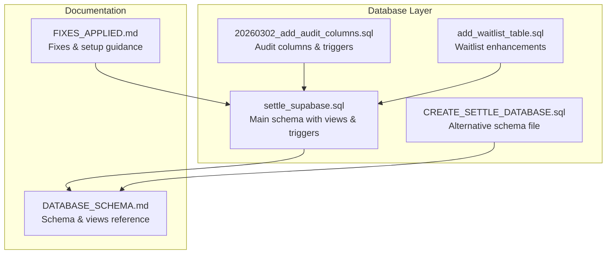
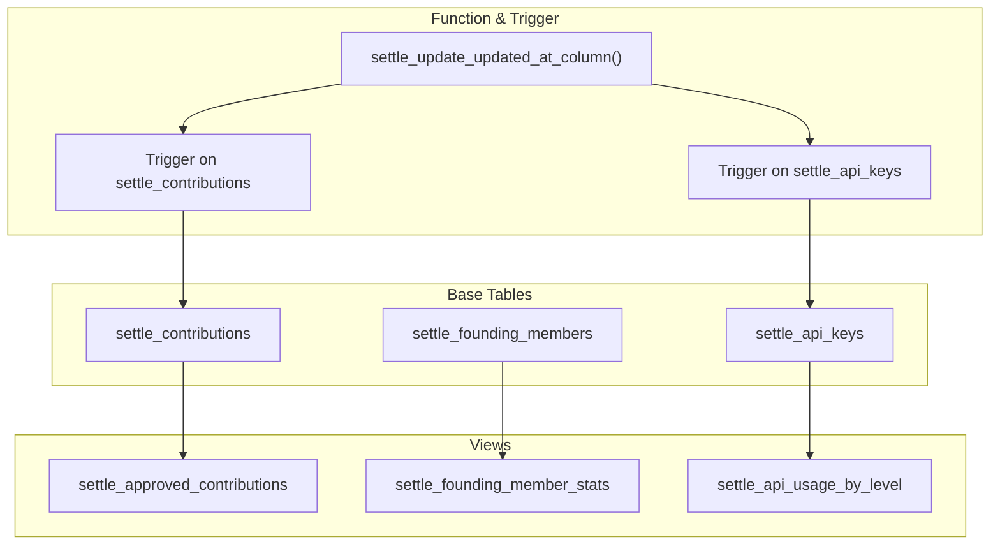
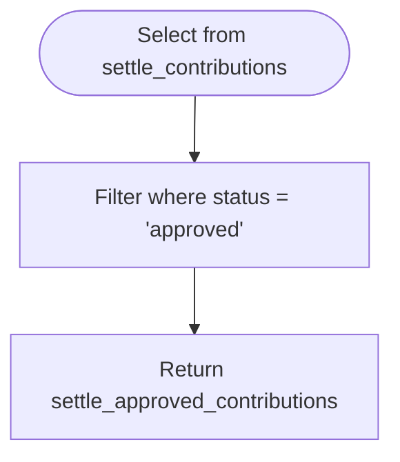
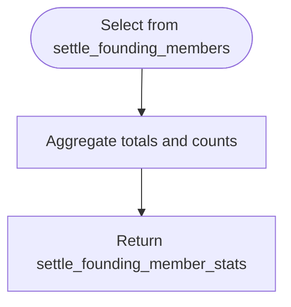
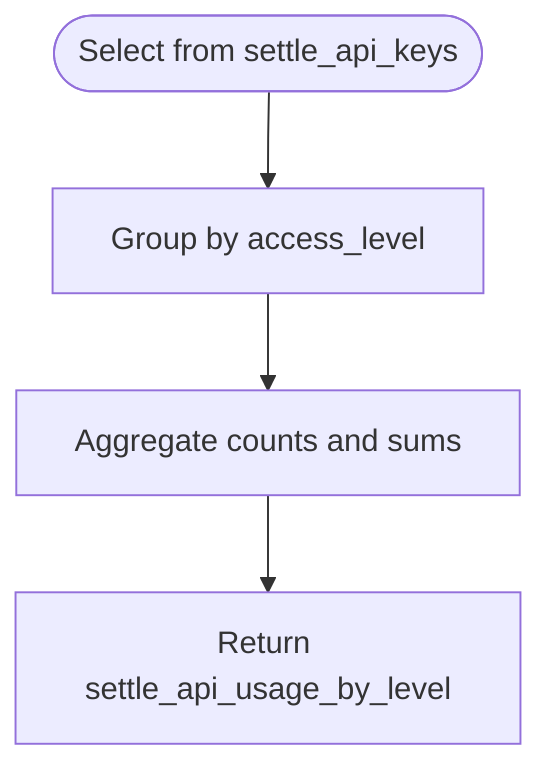
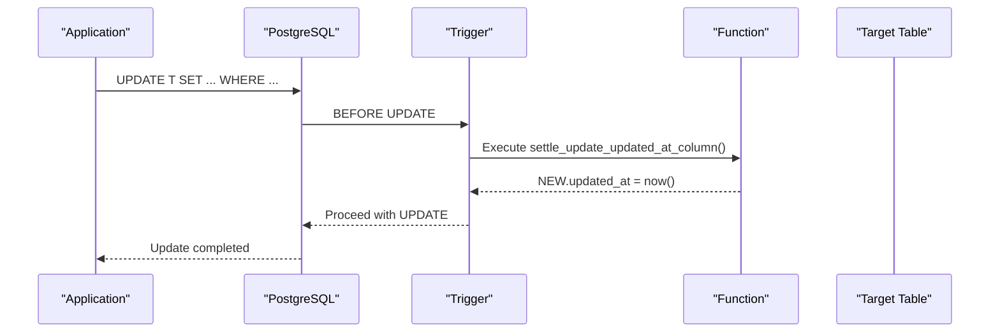
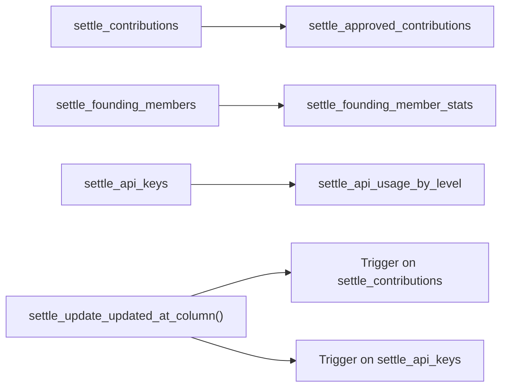

# Views & Functions

<cite>
**Referenced Files in This Document**
- [settle_supabase.sql](file://database/schemas/settle_supabase.sql)
- [CREATE_SETTLE_DATABASE.sql](file://database/CREATE_SETTLE_DATABASE.sql)
- [20260302_add_audit_columns.sql](file://database/migrations/20260302_add_audit_columns.sql)
- [add_waitlist_table.sql](file://database/migrations/add_waitlist_table.sql)
- [DATABASE_SCHEMA.md](file://docs/DATABASE_SCHEMA.md)
- [FIXES_APPLIED.md](file://database/FIXES_APPLIED.md)
</cite>

## Table of Contents
1. [Introduction](#introduction)
2. [Project Structure](#project-structure)
3. [Core Components](#core-components)
4. [Architecture Overview](#architecture-overview)
5. [Detailed Component Analysis](#detailed-component-analysis)
6. [Dependency Analysis](#dependency-analysis)
7. [Performance Considerations](#performance-considerations)
8. [Troubleshooting Guide](#troubleshooting-guide)
9. [Conclusion](#conclusion)

## Introduction
This document focuses on the database views and functions that power analytical insights and operational metadata maintenance in the SETTLE Service. It covers:
- Three analytical views: settle_approved_contributions, settle_founding_member_stats, and settle_api_usage_by_level
- The settle_update_updated_at_column function and its trigger implementation for automatic timestamp updates
- Creation process, security model, and how these objects support reporting, analytics, and operational workflows

## Project Structure
The database schema and related artifacts are organized under the database directory. The primary schema definition resides in a Supabase-ready SQL file, with migration scripts adding audit columns and triggers, and documentation that outlines the views and constraints.

**Diagram sources**
- [settle_supabase.sql:352-401](file://database/schemas/settle_supabase.sql#L352-L401)
- [CREATE_SETTLE_DATABASE.sql:352-401](file://database/CREATE_SETTLE_DATABASE.sql#L352-L401)
- [20260302_add_audit_columns.sql:109-131](file://database/migrations/20260302_add_audit_columns.sql#L109-L131)
- [add_waitlist_table.sql:1-61](file://database/migrations/add_waitlist_table.sql#L1-L61)
- [DATABASE_SCHEMA.md:603-654](file://docs/DATABASE_SCHEMA.md#L603-L654)
- [FIXES_APPLIED.md:100-134](file://database/FIXES_APPLIED.md#L100-L134)

**Section sources**
- [settle_supabase.sql:352-401](file://database/schemas/settle_supabase.sql#L352-L401)
- [CREATE_SETTLE_DATABASE.sql:352-401](file://database/CREATE_SETTLE_DATABASE.sql#L352-L401)
- [20260302_add_audit_columns.sql:109-131](file://database/migrations/20260302_add_audit_columns.sql#L109-L131)
- [add_waitlist_table.sql:1-61](file://database/migrations/add_waitlist_table.sql#L1-L61)
- [DATABASE_SCHEMA.md:603-654](file://docs/DATABASE_SCHEMA.md#L603-L654)
- [FIXES_APPLIED.md:100-134](file://database/FIXES_APPLIED.md#L100-L134)

## Core Components
- settle_approved_contributions: A filtered view exposing only approved contributions for safe analytics and reporting.
- settle_founding_member_stats: An aggregated view summarizing Founding Member participation and activity.
- settle_api_usage_by_level: An aggregated view grouping API keys by access level and usage metrics.
- settle_update_updated_at_column: A reusable function to automatically refresh updated_at on updates.
- Triggers: Automatic invocation of the function on specific tables to maintain metadata consistency.

These components collectively enable:
- Operational visibility (metadata freshness)
- Analytical dashboards (filtered and aggregated data)
- Secure access control (RLS policies on sensitive tables)

**Section sources**
- [settle_supabase.sql:356-380](file://database/schemas/settle_supabase.sql#L356-L380)
- [settle_supabase.sql:386-400](file://database/schemas/settle_supabase.sql#L386-L400)
- [20260302_add_audit_columns.sql:109-131](file://database/migrations/20260302_add_audit_columns.sql#L109-L131)

## Architecture Overview
The views and function are part of the Postgres layer that underpins the SETTLE Service. They rely on:
- Base tables with audit columns and indexes
- Row-Level Security (RLS) policies on sensitive tables
- Triggers to enforce consistent metadata updates

**Diagram sources**
- [settle_supabase.sql:356-380](file://database/schemas/settle_supabase.sql#L356-L380)
- [settle_supabase.sql:386-400](file://database/schemas/settle_supabase.sql#L386-L400)
- [20260302_add_audit_columns.sql:118-131](file://database/migrations/20260302_add_audit_columns.sql#L118-L131)

## Detailed Component Analysis

### settle_approved_contributions
- Purpose: Provide a read-only, filtered dataset containing only approved contributions for analytics and reporting.
- Filtering: Restricts records where status equals approved.
- Usage: Ideal for dashboards, export jobs, and reports that must exclude pending or rejected data.

**Diagram sources**
- [settle_supabase.sql:356-360](file://database/schemas/settle_supabase.sql#L356-L360)

**Section sources**
- [settle_supabase.sql:356-360](file://database/schemas/settle_supabase.sql#L356-L360)

### settle_founding_member_stats
- Purpose: Summarize Founding Member program metrics across total members, active members, and aggregated usage counters.
- Aggregations:
  - Total members
  - Active members
  - Total contributions
  - Total queries
  - Total reports
- Use cases: Executive dashboards, program health, and resource planning.

**Diagram sources**
- [settle_supabase.sql:362-370](file://database/schemas/settle_supabase.sql#L362-L370)

**Section sources**
- [settle_supabase.sql:362-370](file://database/schemas/settle_supabase.sql#L362-L370)

### settle_api_usage_by_level
- Purpose: Provide usage analytics grouped by access level, including key counts and total requests.
- Grouping: access_level
- Metrics:
  - total_keys
  - active_keys
  - total_requests
- Use cases: Billing analytics, access-level segmentation, and capacity planning.

**Diagram sources**
- [settle_supabase.sql:372-380](file://database/schemas/settle_supabase.sql#L372-L380)

**Section sources**
- [settle_supabase.sql:372-380](file://database/schemas/settle_supabase.sql#L372-L380)

### settle_update_updated_at_column Function and Triggers
- Function: Automatically sets updated_at to the current timestamp on row updates.
- Triggers:
  - Applies to settle_contributions
  - Applies to settle_api_keys
- Benefits:
  - Ensures metadata consistency without application-level boilerplate
  - Supports audit trails and lifecycle tracking

**Diagram sources**
- [settle_supabase.sql:386-400](file://database/schemas/settle_supabase.sql#L386-L400)
- [20260302_add_audit_columns.sql:109-131](file://database/migrations/20260302_add_audit_columns.sql#L109-L131)

**Section sources**
- [settle_supabase.sql:386-400](file://database/schemas/settle_supabase.sql#L386-L400)
- [20260302_add_audit_columns.sql:109-131](file://database/migrations/20260302_add_audit_columns.sql#L109-L131)

## Dependency Analysis
- Views depend on base tables:
  - settle_approved_contributions depends on settle_contributions
  - settle_founding_member_stats depends on settle_founding_members
  - settle_api_usage_by_level depends on settle_api_keys
- Triggers depend on the function settle_update_updated_at_column
- Security model:
  - RLS enabled on settle_api_keys and settle_founding_members
  - Policies grant service_role full access and restrict authenticated users to their own API key info

**Diagram sources**
- [settle_supabase.sql:356-380](file://database/schemas/settle_supabase.sql#L356-L380)
- [settle_supabase.sql:386-400](file://database/schemas/settle_supabase.sql#L386-L400)

**Section sources**
- [settle_supabase.sql:406-436](file://database/schemas/settle_supabase.sql#L406-L436)

## Performance Considerations
- Indexes on base tables support efficient filtering and aggregation:
  - settle_contributions: composite index on jurisdiction, case_type, status where status = 'approved'
  - settle_api_keys: indexes on access_level, is_active, api_key_prefix, user_id, user_email
- Views leverage these indexes for fast reads:
  - settle_approved_contributions benefits from the composite index
  - settle_api_usage_by_level benefits from access_level and is_active indexes
- Triggers incur minimal overhead on UPDATE operations; they only set updated_at and return the row unchanged.

[No sources needed since this section provides general guidance]

## Troubleshooting Guide
Common issues and resolutions:
- Views not returning expected rows
  - Confirm filters and statuses align with base data (e.g., approved contributions only)
- Missing updated_at timestamps
  - Ensure triggers are present and functioning on target tables
  - Verify the function exists and is owned by the correct role
- Permission errors on sensitive tables
  - Confirm RLS policies are enabled and roles are configured correctly
- Migration inconsistencies
  - Re-run the audit columns migration to apply triggers consistently

**Section sources**
- [settle_supabase.sql:406-436](file://database/schemas/settle_supabase.sql#L406-L436)
- [20260302_add_audit_columns.sql:118-131](file://database/migrations/20260302_add_audit_columns.sql#L118-L131)

## Conclusion
The three analytical views and the updated_at automation function form a cohesive foundation for data-driven operations and reporting in SETTLE Service:
- settle_approved_contributions ensures analysts query only approved data
- settle_founding_member_stats and settle_api_usage_by_level deliver actionable summaries for program and usage analytics
- The settle_update_updated_at_column function and its triggers maintain consistent metadata across updates
- RLS policies protect sensitive data while enabling targeted access

Together, these components support compliance, performance, and operational excellence.