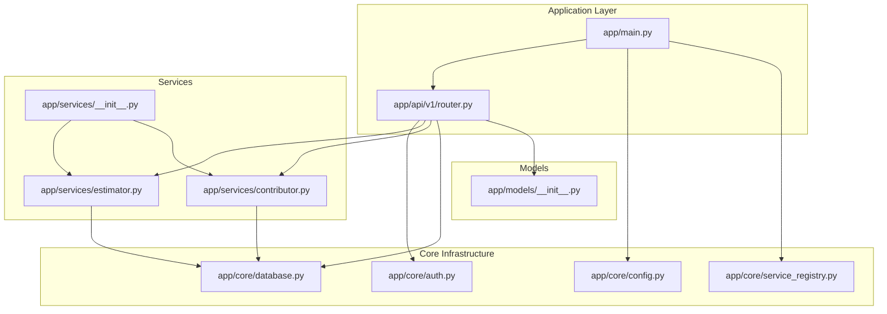
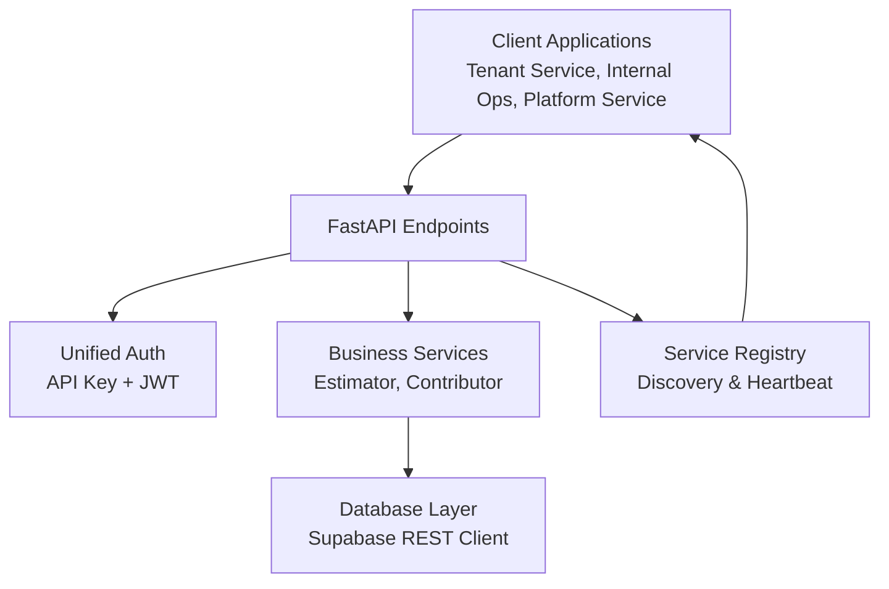
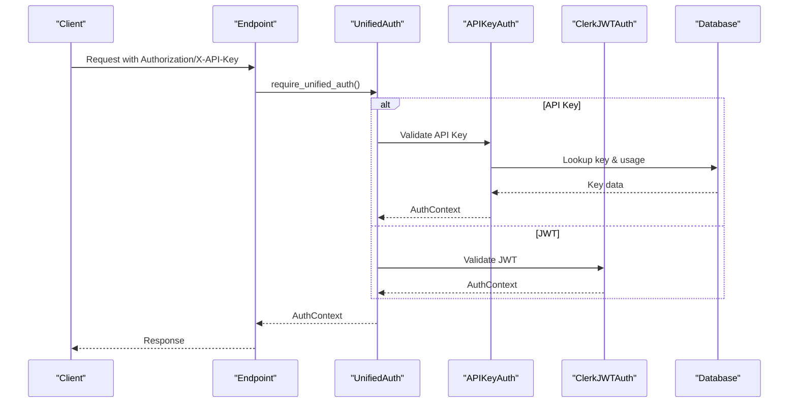
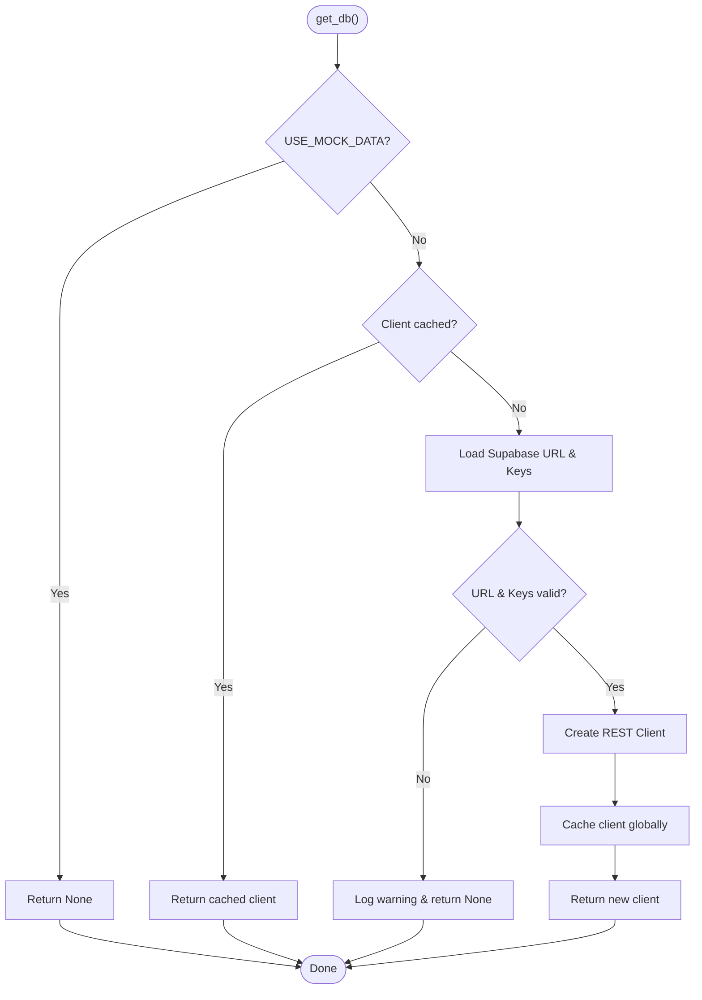
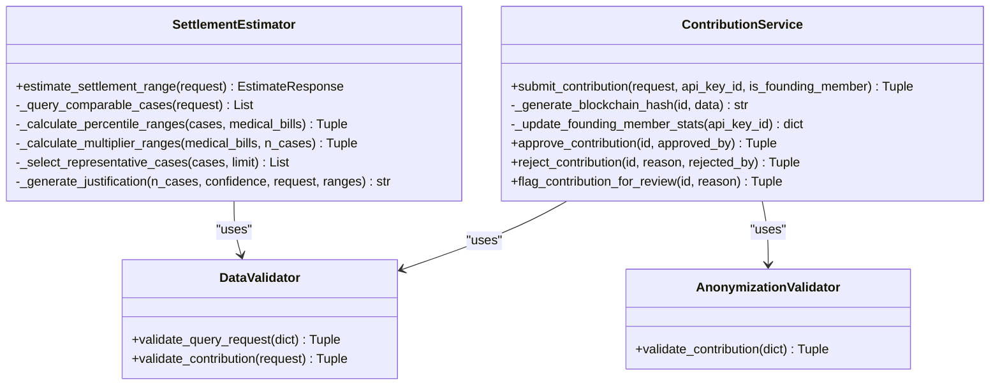
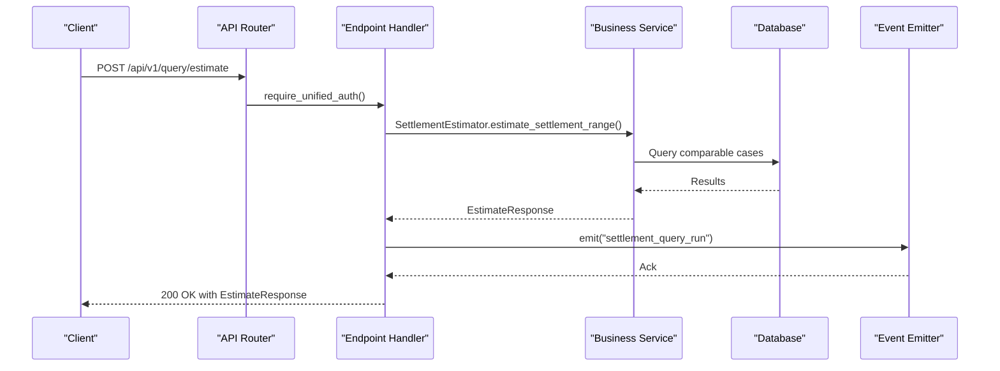
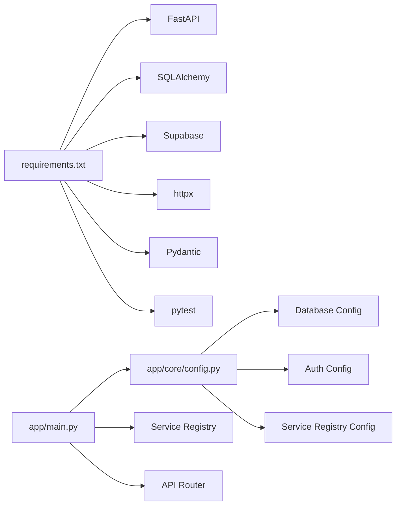

# Development Guidelines

<cite>
**Referenced Files in This Document**
- [README.md](file://README.md)
- [requirements.txt](file://requirements.txt)
- [app/main.py](file://app/main.py)
- [app/core/config.py](file://app/core/config.py)
- [app/core/database.py](file://app/core/database.py)
- [app/core/auth.py](file://app/core/auth.py)
- [app/core/service_registry.py](file://app/core/service_registry.py)
- [app/api/v1/router.py](file://app/api/v1/router.py)
- [app/api/v1/endpoints/query.py](file://app/api/v1/endpoints/query.py)
- [app/api/v1/endpoints/contribute.py](file://app/api/v1/endpoints/contribute.py)
- [app/services/__init__.py](file://app/services/__init__.py)
- [app/services/estimator.py](file://app/services/estimator.py)
- [app/services/contributor.py](file://app/services/contributor.py)
- [app/models/__init__.py](file://app/models/__init__.py)
- [docs/API_DOCUMENTATION.md](file://docs/API_DOCUMENTATION.md)
</cite>

## Table of Contents
1. [Introduction](#introduction)
2. [Project Structure](#project-structure)
3. [Core Components](#core-components)
4. [Architecture Overview](#architecture-overview)
5. [Detailed Component Analysis](#detailed-component-analysis)
6. [Dependency Analysis](#dependency-analysis)
7. [Performance Considerations](#performance-considerations)
8. [Troubleshooting Guide](#troubleshooting-guide)
9. [Development Environment Setup](#development-environment-setup)
10. [Coding Standards and Naming Conventions](#coding-standards-and-naming-conventions)
11. [Documentation Requirements](#documentation-requirements)
12. [Debugging Procedures](#debugging-procedures)
13. [Code Review Process](#code-review-process)
14. [Contribution Guidelines](#contribution-guidelines)
15. [Pull Request Workflow](#pull-request-workflow)
16. [Release Management](#release-management)
17. [Architectural Decision Records and Design Patterns](#architectural-decision-records-and-design-patterns)
18. [Conclusion](#conclusion)

## Introduction
This document provides comprehensive development guidelines for contributors working on the SETTLE Service. It covers code standards, architectural patterns, dependency injection, service layer organization, development workflows, environment setup, debugging, code review, contribution processes, and release management. The SETTLE Service follows a layered FastAPI architecture with a focus on clean architecture, separation of concerns, and robust service-to-service integration.

## Project Structure
The repository is organized around a FastAPI application with clear separation of concerns:
- app/main.py: Application entry point and lifecycle management
- app/core/: Core infrastructure (configuration, database, authentication, monitoring)
- app/api/v1/: API versioning and routing
- app/api/v1/endpoints/: Endpoint handlers grouped by domain
- app/services/: Business logic services and validators
- app/models/: Pydantic models for request/response validation
- database/: Database schema and migration assets
- docs/: API and system documentation
- tests/: Unit and integration tests
- scripts/: Operational and maintenance scripts

**Diagram sources**
- [app/main.py:1-157](file://app/main.py#L1-L157)
- [app/api/v1/router.py:1-26](file://app/api/v1/router.py#L1-L26)
- [app/core/config.py:1-351](file://app/core/config.py#L1-L351)
- [app/core/database.py:1-549](file://app/core/database.py#L1-L549)
- [app/core/auth.py:1-867](file://app/core/auth.py#L1-L867)
- [app/core/service_registry.py:1-355](file://app/core/service_registry.py#L1-L355)
- [app/services/estimator.py:1-443](file://app/services/estimator.py#L1-L443)
- [app/services/contributor.py:1-339](file://app/services/contributor.py#L1-L339)
- [app/services/__init__.py:1-17](file://app/services/__init__.py#L1-L17)
- [app/models/__init__.py:1-32](file://app/models/__init__.py#L1-L32)

**Section sources**
- [README.md:89-114](file://README.md#L89-L114)
- [app/main.py:102-136](file://app/main.py#L102-L136)
- [app/api/v1/router.py:5-25](file://app/api/v1/router.py#L5-L25)

## Core Components
- Configuration Management: Centralized settings with provider-agnostic database abstraction and service-to-service integration configuration.
- Database Layer: Provider-agnostic REST client for Supabase with retry logic and health checks.
- Authentication: Dual-mode authentication supporting API keys and Clerk JWT with unified context and audit logging.
- Service Registry: Service discovery and registration for the TrueVow 5-service ecosystem.
- Service Layer: Business logic services for settlement estimation and contribution handling.
- API Endpoints: Versioned endpoints for query, contribution, reports, admin, and public operations.

**Section sources**
- [app/core/config.py:23-349](file://app/core/config.py#L23-L349)
- [app/core/database.py:25-549](file://app/core/database.py#L25-L549)
- [app/core/auth.py:96-800](file://app/core/auth.py#L96-L800)
- [app/core/service_registry.py:24-355](file://app/core/service_registry.py#L24-L355)
- [app/services/estimator.py:25-443](file://app/services/estimator.py#L25-L443)
- [app/services/contributor.py:31-339](file://app/services/contributor.py#L31-L339)

## Architecture Overview
The SETTLE Service adheres to a layered architecture:
- Presentation Layer: FastAPI endpoints with unified authentication
- Application Layer: Request/response validation and orchestration
- Domain Layer: Business services implementing core algorithms
- Infrastructure Layer: Database connectivity, authentication, and monitoring

**Diagram sources**
- [app/main.py:102-136](file://app/main.py#L102-L136)
- [app/core/auth.py:340-485](file://app/core/auth.py#L340-L485)
- [app/services/estimator.py:60-117](file://app/services/estimator.py#L60-L117)
- [app/services/contributor.py:55-126](file://app/services/contributor.py#L55-L126)
- [app/core/database.py:412-489](file://app/core/database.py#L412-L489)
- [app/core/service_registry.py:64-108](file://app/core/service_registry.py#L64-L108)

## Detailed Component Analysis

### Authentication and Authorization
The authentication system supports dual modes:
- API Key Authentication: Legacy integration support with access levels and audit logging
- Clerk JWT Authentication: Modern tenant/internal scopes with role-based access
- Unified Authentication: Single dependency that accepts either method

**Diagram sources**
- [app/core/auth.py:340-485](file://app/core/auth.py#L340-L485)
- [app/core/auth.py:487-796](file://app/core/auth.py#L487-L796)
- [app/api/v1/endpoints/query.py:20-98](file://app/api/v1/endpoints/query.py#L20-L98)

**Section sources**
- [app/core/auth.py:96-160](file://app/core/auth.py#L96-L160)
- [app/core/auth.py:340-485](file://app/core/auth.py#L340-L485)
- [app/api/v1/endpoints/query.py:20-98](file://app/api/v1/endpoints/query.py#L20-L98)

### Database Connectivity and Retry Logic
The database layer provides:
- Provider-agnostic Supabase REST client
- Retry decorator for transient failures
- Health checks and connection caching
- Mock mode support for development

**Diagram sources**
- [app/core/database.py:412-463](file://app/core/database.py#L412-L463)
- [app/core/database.py:374-409](file://app/core/database.py#L374-L409)

**Section sources**
- [app/core/database.py:25-549](file://app/core/database.py#L25-L549)
- [app/core/config.py:92-162](file://app/core/config.py#L92-L162)

### Service Layer Organization
The service layer encapsulates business logic:
- SettlementEstimator: Percentile-based settlement range calculation with fallback logic
- ContributionService: Data validation, anonymization, blockchain hashing, and contribution lifecycle
- Validators: Data validation and anonymization utilities

**Diagram sources**
- [app/services/estimator.py:25-443](file://app/services/estimator.py#L25-L443)
- [app/services/contributor.py:31-339](file://app/services/contributor.py#L31-L339)

**Section sources**
- [app/services/estimator.py:25-443](file://app/services/estimator.py#L25-L443)
- [app/services/contributor.py:31-339](file://app/services/contributor.py#L31-L339)
- [app/services/__init__.py:5-17](file://app/services/__init__.py#L5-L17)

### API Endpoints and Routing
Endpoints are organized by domain and authentication requirements:
- Public endpoints: Waitlist and statistics
- Authenticated endpoints: Query estimation, contribution submission, report generation
- Admin endpoints: Contribution moderation and administrative analytics

**Diagram sources**
- [app/api/v1/router.py:5-25](file://app/api/v1/router.py#L5-L25)
- [app/api/v1/endpoints/query.py:20-98](file://app/api/v1/endpoints/query.py#L20-L98)
- [app/services/estimator.py:60-117](file://app/services/estimator.py#L60-L117)

**Section sources**
- [app/api/v1/router.py:5-25](file://app/api/v1/router.py#L5-L25)
- [app/api/v1/endpoints/query.py:20-98](file://app/api/v1/endpoints/query.py#L20-L98)
- [app/api/v1/endpoints/contribute.py:51-135](file://app/api/v1/endpoints/contribute.py#L51-L135)

## Dependency Analysis
The application manages dependencies through:
- Centralized configuration with provider-agnostic database settings
- Service registry for inter-service communication
- Modular service initialization and lifecycle management
- Explicit imports and lazy loading for optional components

**Diagram sources**
- [requirements.txt:1-53](file://requirements.txt#L1-L53)
- [app/core/config.py:23-349](file://app/core/config.py#L23-L349)
- [app/main.py:13-22](file://app/main.py#L13-L22)

**Section sources**
- [requirements.txt:1-53](file://requirements.txt#L1-L53)
- [app/core/config.py:23-349](file://app/core/config.py#L23-L349)
- [app/main.py:13-22](file://app/main.py#L13-L22)

## Performance Considerations
- Response time targets: Settlement estimation under 1 second (p95)
- Database connection pooling and caching
- Asynchronous operations for external integrations
- Health checks and monitoring integration
- Rate limiting configuration for API protection

## Troubleshooting Guide
Common issues and resolutions:
- Authentication failures: Verify API key format and validity; check JWT claims and scope
- Database connectivity: Confirm Supabase URL and service key; verify network access
- Service registry errors: Validate registry URL and API key; check service heartbeat
- Endpoint errors: Review request validation; check audit logs for detailed error messages

**Section sources**
- [app/core/auth.py:34-90](file://app/core/auth.py#L34-L90)
- [app/core/database.py:509-539](file://app/core/database.py#L509-L539)
- [app/core/service_registry.py:83-98](file://app/core/service_registry.py#L83-L98)

## Development Environment Setup
Prerequisites and setup steps:
- Python 3.11+, PostgreSQL 15+, FastAPI
- Virtual environment activation
- Dependency installation via requirements.txt
- Database schema creation and migrations
- Environment variable configuration (.env.local or .env)

**Section sources**
- [README.md:148-181](file://README.md#L148-L181)
- [requirements.txt:1-53](file://requirements.txt#L1-L53)

## Coding Standards and Naming Conventions
- File naming: snake_case for modules, PascalCase for classes
- Function naming: snake_case for functions, UPPER_CASE for constants
- Class naming: PascalCase for classes and services
- Variable naming: descriptive names with clear intent
- Module organization: feature-based grouping under app/services and app/api/v1/endpoints
- Error handling: structured HTTPException with appropriate status codes
- Logging: consistent structured logging with contextual information

## Documentation Requirements
- API documentation: Complete endpoint specifications with request/response examples
- Data models: Clear Pydantic model definitions and validation rules
- Architecture documentation: System overview and component interactions
- Integration guides: Service-to-service communication patterns
- Security documentation: Authentication, authorization, and compliance requirements

**Section sources**
- [docs/API_DOCUMENTATION.md:1-800](file://docs/API_DOCUMENTATION.md#L1-L800)

## Debugging Procedures
Recommended debugging approaches:
- Enable debug logging in development environment
- Use structured logging with request IDs for traceability
- Implement health checks for all major components
- Utilize database connection health checks
- Monitor service registry heartbeat and service discovery
- Leverage audit logs for authentication and authorization events

**Section sources**
- [app/main.py:24-41](file://app/main.py#L24-L41)
- [app/core/database.py:509-539](file://app/core/database.py#L509-L539)
- [app/core/auth.py:34-90](file://app/core/auth.py#L34-L90)

## Code Review Process
Review checklist:
- Adherence to coding standards and naming conventions
- Proper error handling and logging
- Security considerations and authentication validation
- Database connectivity and transaction handling
- Performance implications and resource management
- Test coverage and validation
- Documentation completeness

## Contribution Guidelines
Guidelines for contributors:
- Fork and branch from the main branch
- Follow coding standards and naming conventions
- Write comprehensive tests for new functionality
- Update documentation for API changes
- Ensure backward compatibility
- Perform local testing before submission

## Pull Request Workflow
PR workflow:
- Create feature branches from main
- Include relevant tests and documentation updates
- Reference related issues and documentation
- Request reviews from maintainers
- Address feedback promptly
- Merge using squash or rebase strategy

## Release Management
Release procedures:
- Tag releases with semantic versioning
- Update changelog and release notes
- Verify all tests pass in CI environment
- Deploy to staging for validation
- Promote to production with rollback plan
- Monitor service health and error rates

## Architectural Decision Records and Design Patterns
Design patterns and decisions:
- Clean Architecture: Separation of concerns across presentation, application, domain, and infrastructure layers
- Dependency Injection: Services receive dependencies through constructor parameters
- Factory Pattern: Service instantiation with configurable dependencies
- Observer Pattern: Event emission for behavioral analytics
- Strategy Pattern: Multiple authentication methods with unified interface
- Repository Pattern: Database abstraction through REST client
- Circuit Breaker Pattern: Retry logic with exponential backoff for transient failures

**Section sources**
- [app/services/estimator.py:25-443](file://app/services/estimator.py#L25-L443)
- [app/services/contributor.py:31-339](file://app/services/contributor.py#L31-L339)
- [app/core/database.py:374-409](file://app/core/database.py#L374-L409)

## Conclusion
These guidelines establish a comprehensive framework for developing and maintaining the SETTLE Service. By following the outlined standards, patterns, and processes, contributors can ensure consistent, secure, and maintainable code that aligns with the TrueVow enterprise architecture and meets the service's performance and compliance requirements.