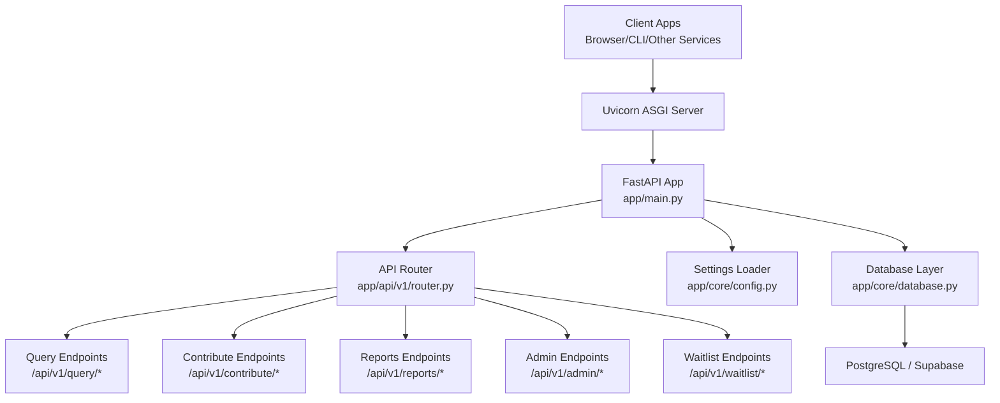

# Getting Started

<cite>
**Referenced Files in This Document**
- [README.md](file://README.md)
- [requirements.txt](file://requirements.txt)
- [env.template](file://env.template)
- [app/main.py](file://app/main.py)
- [app/core/config.py](file://app/core/config.py)
- [app/api/v1/router.py](file://app/api/v1/router.py)
- [app/api/v1/endpoints/query.py](file://app/api/v1/endpoints/query.py)
- [app/api/v1/endpoints/contribute.py](file://app/api/v1/endpoints/contribute.py)
- [app/core/database.py](file://app/core/database.py)
- [database/schemas/settle_supabase.sql](file://database/schemas/settle_supabase.sql)
- [database/CREATE_SETTLE_DATABASE.sql](file://database/CREATE_SETTLE_DATABASE.sql)
- [docs/API_DOCUMENTATION.md](file://docs/API_DOCUMENTATION.md)
- [docs/DATABASE_SCHEMA.md](file://docs/DATABASE_SCHEMA.md)
- [scripts/check_env.py](file://scripts/check_env.py)
- [scripts/comprehensive_api_test.py](file://scripts/comprehensive_api_test.py)
</cite>

## Table of Contents
1. [Introduction](#introduction)
2. [Prerequisites](#prerequisites)
3. [Installation](#installation)
4. [Environment Configuration](#environment-configuration)
5. [Database Setup](#database-setup)
6. [Development Server Startup](#development-server-startup)
7. [Initial API Testing](#initial-api-testing)
8. [Basic Usage Patterns](#basic-usage-patterns)
9. [Architecture Overview](#architecture-overview)
10. [Troubleshooting Guide](#troubleshooting-guide)
11. [Conclusion](#conclusion)

## Introduction
This guide helps you set up and run the SETTLE Service locally for development. You will configure a Python virtual environment, install dependencies, set up the database (PostgreSQL or Supabase), configure environment variables, and start the FastAPI server. You will also test the API endpoints and learn basic usage patterns.

## Prerequisites
- Python 3.11 or newer
- PostgreSQL 15 or newer
- Git (to clone the repository)
- A terminal or command prompt

These are the required libraries and frameworks used by the service:
- FastAPI and Uvicorn for the web server
- SQLAlchemy and asyncpg for database connectivity
- Alembic for database migrations
- Supabase client for database operations
- Pydantic and pydantic-settings for configuration
- httpx for HTTP client needs
- structlog, passlib, python-jose for security/logging
- opentimestamps for blockchain verification
- sendgrid, weasyprint, pillow, qrcode for email and PDF features (phase 2)
- boto3/botocore for S3 storage (phase 2)
- stripe for payment processing (phase 2)
- sentry-sdk for monitoring (phase 2)
- python-dotenv and pytz for utilities
- pytest and pytest-asyncio for testing

**Section sources**
- [README.md:148-154](file://README.md#L148-L154)
- [requirements.txt:1-53](file://requirements.txt#L1-L53)

## Installation
Follow these steps to install the service locally:

1. Create a virtual environment
   - Linux/macOS/Windows (PowerShell):
     ```bash
     python -m venv .venv
     source .venv/bin/activate  # On Windows: .venv\Scripts\activate
     ```

2. Upgrade pip
   ```bash
   pip install --upgrade pip
   ```

3. Install dependencies
   ```bash
   pip install -r requirements.txt
   ```

Notes:
- The repository includes a pre-created virtual environment folder (.venv). You can activate it directly if you prefer.
- Ensure your shell properly activates the virtual environment before proceeding.

**Section sources**
- [README.md:155-164](file://README.md#L155-L164)
- [requirements.txt:1-53](file://requirements.txt#L1-L53)

## Environment Configuration
The service loads configuration from environment variables. You can use either .env.local or .env (with .env.local taking precedence). The template file provides comprehensive defaults.

Steps:
1. Copy the template to .env.local (preferred) or .env
   ```bash
   cp env.template .env.local
   ```
2. Edit .env.local to set your values (see sections below).

Key configuration areas:
- Service configuration (name, port, version, environment, debug)
- Database configuration (PostgreSQL URL or Supabase)
- Redis caching and rate limiting
- Security and authentication (keys, JWT)
- Service-to-service integration URLs and API keys
- Email, AWS S3, Stripe, OpenTimestamps
- Feature flags, CORS, logging, monitoring
- Performance tuning and testing options

Important notes:
- The service enforces AUTH_MODE in production; development allows local mode while production requires clerk mode.
- The configuration supports both SETTLE_-prefixed and unprefixed variable names for backwards compatibility.

Verification script:
- Use the environment checker to confirm which variables are loaded and validated:
  ```bash
  python scripts/check_env.py
  ```

**Section sources**
- [env.template:1-201](file://env.template#L1-L201)
- [app/core/config.py:14-31](file://app/core/config.py#L14-L31)
- [app/core/config.py:23-31](file://app/core/config.py#L23-L31)
- [app/main.py:42-49](file://app/main.py#L42-L49)
- [scripts/check_env.py:1-169](file://scripts/check_env.py#L1-L169)

## Database Setup
The service supports two database backends: PostgreSQL directly and Supabase (PostgreSQL with extensions). Choose one approach.

Option A: PostgreSQL (Direct)
1. Create a database (e.g., settle_service_db)
2. Apply the schema:
   - Use the provided SQL file to create tables and indexes
   - Run the SQL script against your database

Option B: Supabase
1. Create a new Supabase project named "settle-production"
2. Open the SQL Editor in the Supabase dashboard
3. Paste and run the entire CREATE_SETTLE_DATABASE.sql script
4. Ensure the project has UUID and pgcrypto extensions enabled

Schema highlights:
- Centralized tables for contributions, API keys, and related metadata
- Extensive indexes optimized for common queries
- Constraints ensuring data quality and compliance

**Section sources**
- [README.md:166-174](file://README.md#L166-L174)
- [database/CREATE_SETTLE_DATABASE.sql:1-200](file://database/CREATE_SETTLE_DATABASE.sql#L1-L200)
- [database/schemas/settle_supabase.sql:1-200](file://database/schemas/settle_supabase.sql#L1-L200)
- [docs/DATABASE_SCHEMA.md:24-40](file://docs/DATABASE_SCHEMA.md#L24-L40)

## Development Server Startup
Start the development server using Uvicorn with hot reload on port 8002:

```bash
uvicorn app.main:app --reload --port 8002
```

What happens at startup:
- Logging is configured
- Sentry monitoring initializes in staging/production environments
- AUTH_MODE validation runs in production
- Service registers with the Service Registry (heartbeat, modules, integrations)
- CORS middleware is applied
- Request ID middleware adds X-Request-ID headers
- API routes are mounted under /api/v1

Health checks:
- Root endpoint: /
- Health endpoint: /health
- Query service health: /api/v1/query/health
- Contribution service health: /api/v1/contribute/health

**Section sources**
- [README.md:176-180](file://README.md#L176-L180)
- [app/main.py:1-157](file://app/main.py#L1-L157)
- [app/api/v1/router.py:1-26](file://app/api/v1/router.py#L1-L26)
- [app/api/v1/endpoints/query.py:110-119](file://app/api/v1/endpoints/query.py#L110-L119)
- [app/api/v1/endpoints/contribute.py:155-164](file://app/api/v1/endpoints/contribute.py#L155-L164)

## Initial API Testing
Run the comprehensive API test suite to validate your setup:

```bash
python scripts/comprehensive_api_test.py
```

The test suite covers:
- Health checks
- Waitlist operations
- Settlement estimation (requires API key)
- Contribution submissions
- Report generation
- Admin operations
- Founding member statistics

Expected outcomes:
- All tests should pass after successful setup
- If connection fails, ensure the server is running on port 8002

Manual testing tips:
- Use curl or Postman to hit endpoints documented in the API reference
- For authenticated endpoints, include the Authorization header with your API key
- Verify CORS settings match your frontend origin

**Section sources**
- [scripts/comprehensive_api_test.py:1-200](file://scripts/comprehensive_api_test.py#L1-L200)
- [docs/API_DOCUMENTATION.md:1-200](file://docs/API_DOCUMENTATION.md#L1-L200)

## Basic Usage Patterns
Common workflows you can test locally:

1. Join the waitlist (public endpoint)
   - POST /api/v1/waitlist/join
   - No authentication required

2. Estimate a settlement range (authenticated)
   - POST /api/v1/query/estimate
   - Requires API key in Authorization header

3. Submit a settlement contribution (authenticated)
   - POST /api/v1/contribute/submit
   - Requires API key in Authorization header

4. Get public statistics
   - GET /api/v1/stats/founding-members
   - GET /api/v1/stats/database

Authentication:
- API Key: Bearer settle_xxxxxxxxxxxxxxxxxxxxxxxxxxxxx
- Service-to-service headers: X-Service-Name, X-Request-ID, X-Request-Timestamp

**Section sources**
- [docs/API_DOCUMENTATION.md:45-72](file://docs/API_DOCUMENTATION.md#L45-L72)
- [docs/API_DOCUMENTATION.md:92-171](file://docs/API_DOCUMENTATION.md#L92-L171)
- [docs/API_DOCUMENTATION.md:173-200](file://docs/API_DOCUMENTATION.md#L173-L200)

## Architecture Overview
High-level runtime architecture during development:



**Diagram sources**
- [app/main.py:1-157](file://app/main.py#L1-L157)
- [app/api/v1/router.py:1-26](file://app/api/v1/router.py#L1-L26)
- [app/core/config.py:1-351](file://app/core/config.py#L1-L351)
- [app/core/database.py:1-200](file://app/core/database.py#L1-L200)

## Troubleshooting Guide
Common setup issues and resolutions:

1. Port conflicts
   - Problem: Port 8002 already in use
   - Solution: Change SERVICE_PORT in .env.local or stop the conflicting process

2. Missing environment variables
   - Symptom: Configuration errors or startup failures
   - Action: Run the environment checker and ensure required variables are present
     ```bash
     python scripts/check_env.py
     ```

3. Database connection failures
   - Symptom: Operational errors when accessing endpoints
   - Action:
     - Verify DATABASE_URL or Supabase credentials in .env.local
     - Confirm database is reachable and schema is applied
     - Check that UUID and pgcrypto extensions are enabled (Supabase)

4. Authentication errors
   - Symptom: 401/403 responses on authenticated endpoints
   - Action: Ensure Authorization header includes a valid API key

5. CORS issues
   - Symptom: Browser errors when calling from frontend
   - Action: Adjust CORS_ORIGINS in .env.local to include your frontend origin

6. Production mode restrictions
   - Symptom: Startup error about AUTH_MODE
   - Action: Set AUTH_MODE=clerk in production-like environments

7. Health check failures
   - Symptom: /health returns error
   - Action: Confirm server is running and database connectivity is healthy

**Section sources**
- [scripts/check_env.py:1-169](file://scripts/check_env.py#L1-L169)
- [app/main.py:42-49](file://app/main.py#L42-L49)
- [app/core/config.py:23-31](file://app/core/config.py#L23-L31)
- [app/core/database.py:1-200](file://app/core/database.py#L1-L200)

## Conclusion
You now have the SETTLE Service running locally with a proper Python environment, database schema, and configuration. Use the comprehensive API test suite to validate your setup, and refer to the API documentation for endpoint details. For production deployments, ensure secure configuration of secrets, enable monitoring, and follow the service-to-service integration patterns outlined in the documentation.