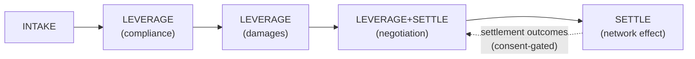
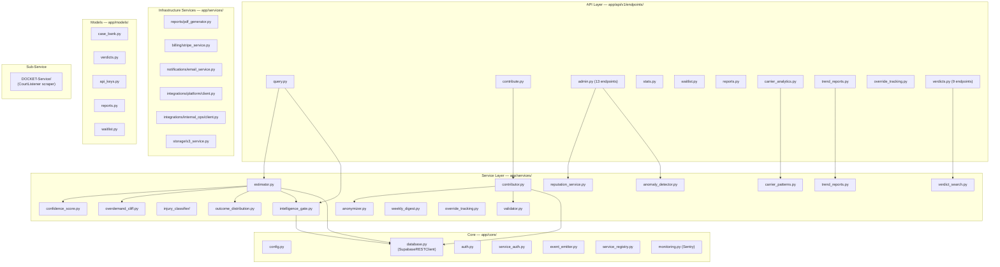
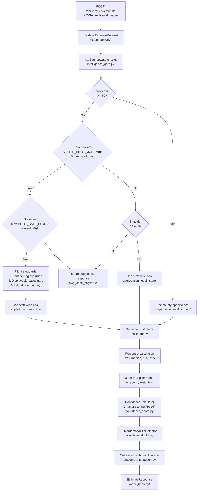
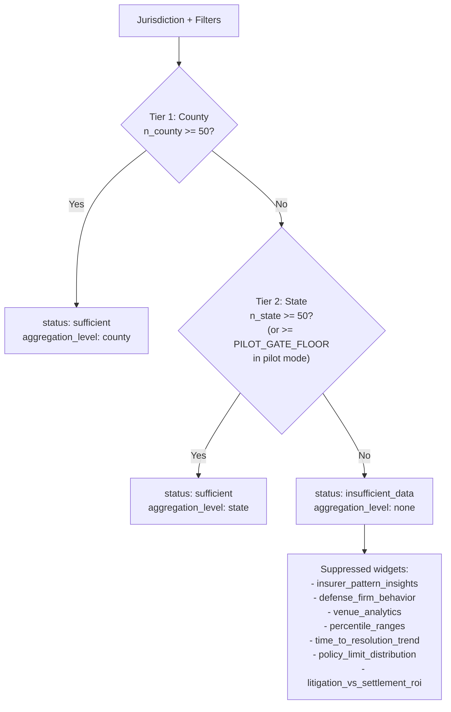
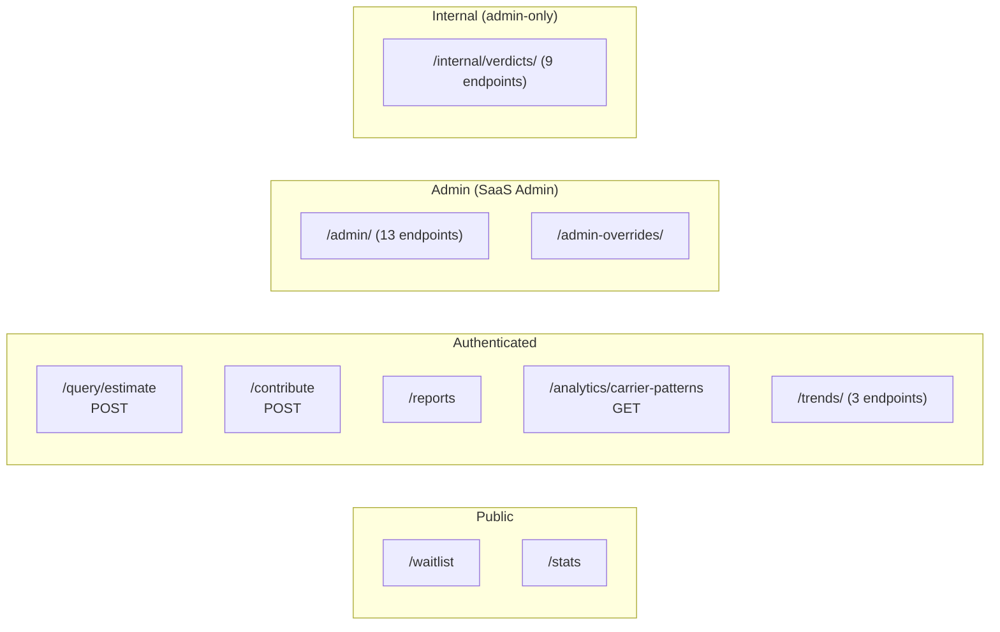
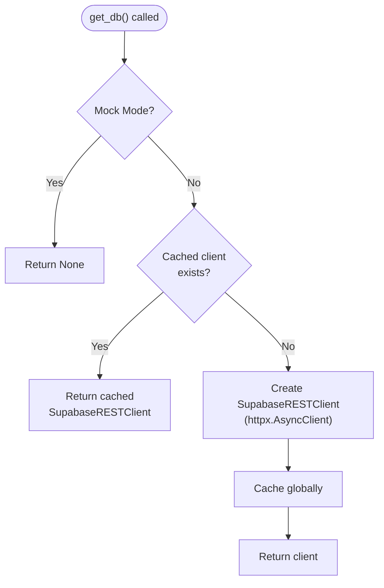
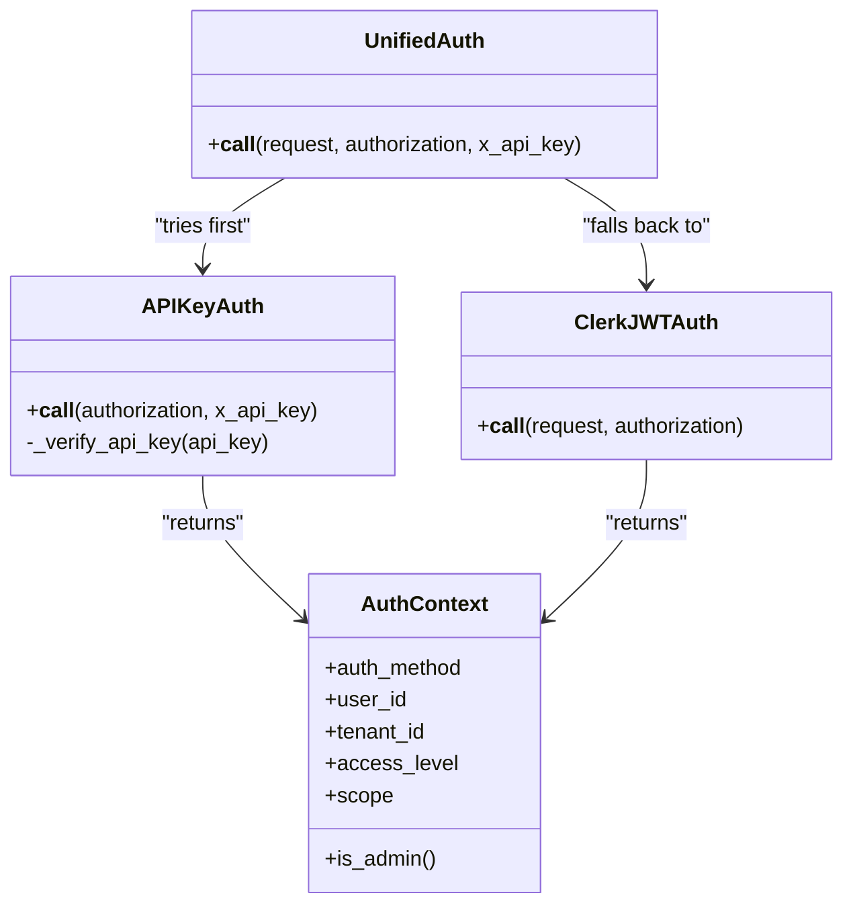
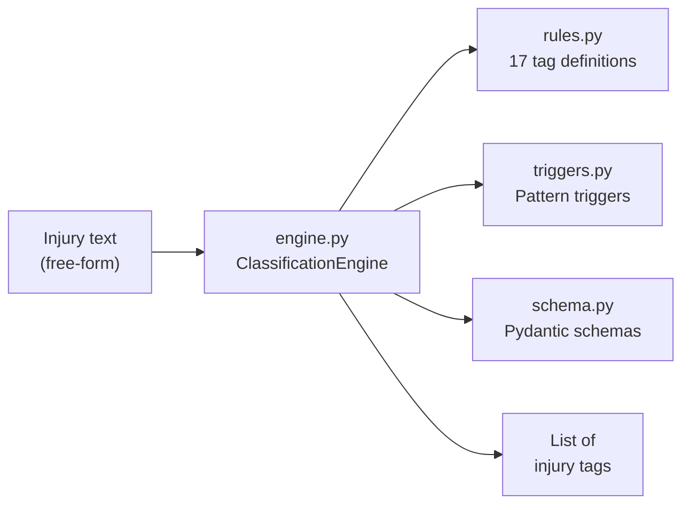
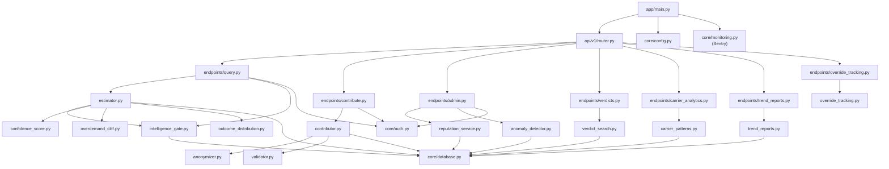

# Architecture Overview

<cite>
**Referenced Files in This Document**
- [app/main.py](file://app/main.py)
- [app/api/v1/router.py](file://app/api/v1/router.py)
- [app/core/config.py](file://app/core/config.py)
- [app/core/database.py](file://app/core/database.py)
- [app/core/auth.py](file://app/core/auth.py)
- [app/core/service_auth.py](file://app/core/service_auth.py)
- [app/core/event_emitter.py](file://app/core/event_emitter.py)
- [app/core/service_registry.py](file://app/core/service_registry.py)
- [app/core/monitoring.py](file://app/core/monitoring.py)
- [app/services/estimator.py](file://app/services/estimator.py)
- [app/services/intelligence_gate.py](file://app/services/intelligence_gate.py)
- [app/services/confidence_score.py](file://app/services/confidence_score.py)
- [app/services/contributor.py](file://app/services/contributor.py)
- [app/services/carrier_patterns.py](file://app/services/carrier_patterns.py)
- [app/services/outcome_distribution.py](file://app/services/outcome_distribution.py)
- [app/services/overdemand_cliff.py](file://app/services/overdemand_cliff.py)
- [app/services/override_tracking.py](file://app/services/override_tracking.py)
- [app/services/reputation_service.py](file://app/services/reputation_service.py)
- [app/services/anomaly_detector.py](file://app/services/anomaly_detector.py)
- [app/services/trend_reports.py](file://app/services/trend_reports.py)
- [app/services/weekly_digest.py](file://app/services/weekly_digest.py)
- [app/services/verdict_search.py](file://app/services/verdict_search.py)
- [app/services/anonymizer.py](file://app/services/anonymizer.py)
- [app/services/validator.py](file://app/services/validator.py)
- [app/services/injury_classifier/engine.py](file://app/services/injury_classifier/engine.py)
- [app/services/injury_classifier/rules.py](file://app/services/injury_classifier/rules.py)
- [app/services/injury_classifier/schema.py](file://app/services/injury_classifier/schema.py)
- [app/services/reports/pdf_generator.py](file://app/services/reports/pdf_generator.py)
- [app/services/billing/stripe_service.py](file://app/services/billing/stripe_service.py)
- [app/services/notifications/email_service.py](file://app/services/notifications/email_service.py)
- [app/services/integrations/platform/client.py](file://app/services/integrations/platform/client.py)
- [app/services/integrations/internal_ops/client.py](file://app/services/integrations/internal_ops/client.py)
- [app/services/storage/s3_service.py](file://app/services/storage/s3_service.py)
- [app/models/case_bank.py](file://app/models/case_bank.py)
- [app/models/verdicts.py](file://app/models/verdicts.py)
- [app/api/v1/endpoints/query.py](file://app/api/v1/endpoints/query.py)
- [app/api/v1/endpoints/contribute.py](file://app/api/v1/endpoints/contribute.py)
- [app/api/v1/endpoints/admin.py](file://app/api/v1/endpoints/admin.py)
- [app/api/v1/endpoints/verdicts.py](file://app/api/v1/endpoints/verdicts.py)
- [DOCKET-Service/app/main.py](file://DOCKET-Service/app/main.py)
- [README.md](file://README.md)
</cite>

## Table of Contents
1. [Introduction](#introduction)
2. [TrueVow 3-Product Ecosystem](#truevow-3-product-ecosystem)
3. [Project Structure](#project-structure)
4. [Estimation Pipeline (End-to-End)](#estimation-pipeline-end-to-end)
5. [Hierarchical Intelligence Gate](#hierarchical-intelligence-gate)
6. [Pilot Mode Infrastructure](#pilot-mode-infrastructure)
7. [Service Layer Reference](#service-layer-reference)
8. [API Endpoints Reference](#api-endpoints-reference)
9. [Data Models](#data-models)
10. [Database Layer](#database-layer)
11. [Authentication and Authorization](#authentication-and-authorization)
12. [Injury Classifier Library](#injury-classifier-library)
13. [DOCKET-Service (Sub-Service)](#docket-service-sub-service)
14. [Dependency Graph](#dependency-graph)
15. [ICP Context (Why Things Are Built This Way)](#icp-context-why-things-are-built-this-way)
16. [Test Coverage](#test-coverage)
17. [Troubleshooting Guide](#troubleshooting-guide)
18. [Appendices](#appendices)

## Introduction

SETTLE is a FastAPI-based settlement intelligence service for plaintiff attorneys. It provides comparable-case matching, settlement range estimation, and community-contributed settlement data. SETTLE is one of three products in the TrueVow ecosystem and operates as a centralized shared resource (not tenant-specific). The service uses a custom httpx-based Supabase REST client, dual authentication (API keys + Clerk JWT), and integrates with Platform and Internal Ops services. It currently has 440 approved contributions, 186/186 passing unit tests, and 14 E2E tests ready.

**Section sources**
- [README.md](file://README.md)
- [app/main.py:46-53](file://app/main.py#L46-L53)

## TrueVow 3-Product Ecosystem

SETTLE does not exist in isolation. Understanding the three products and the attorney journey explains most architectural decisions.

| Product | Purpose | Pricing |
|---------|---------|---------|
| **INTAKE (Benjamin)** | AI receptionist for PI attorneys | $499 / $1,299 / $1,999 per month |
| **LEVERAGE** | 50-state PI Case Intelligence (34 API endpoints). Damages calculator, SOL tracker, compliance checks. | $99/mo with INTAKE |
| **SETTLE** | Settlement Intelligence Network. Comparable case matching, community-contributed data. | Subscription TBD |

The **5-stage attorney journey** drives data flow between products:



Settlement outcomes from LEVERAGE feed back into SETTLE via a consent-gated settlement-details endpoint. This creates a flywheel: attorneys who use LEVERAGE to negotiate contribute outcomes back to SETTLE, enriching the comparable-case pool for all users.

**Section sources**
- [README.md](file://README.md)

## Project Structure



**Diagram sources**
- [app/api/v1/router.py:5-27](file://app/api/v1/router.py#L5-L27)
- [app/services/estimator.py:24-31](file://app/services/estimator.py#L24-L31)

**Section sources**
- [app/api/v1/router.py:5-27](file://app/api/v1/router.py#L5-L27)

## Estimation Pipeline (End-to-End)

This is the most important flow in the codebase. When a user hits `POST /api/v1/query/estimate`, this is what happens:



Key points for troubleshooting:
- If a user gets `own_case_only: true`, the Intelligence Gate blocked the request because there aren't enough comparable cases. Check `n_county` and `n_state` in the response.
- If `is_pilot_response: true`, the response used the relaxed pilot gate (n >= 10 instead of n >= 50). The `X-Settle-User-Id` header must match an ID in `SETTLE_PILOT_USER_IDS`.
- The `active_method` field tells you whether `percentile` or `multiplier` drove the primary estimate.

**Diagram sources**
- [app/services/estimator.py:35-54](file://app/services/estimator.py#L35-L54)
- [app/services/intelligence_gate.py:9-22](file://app/services/intelligence_gate.py#L9-L22)
- [app/api/v1/endpoints/query.py](file://app/api/v1/endpoints/query.py)

**Section sources**
- [app/services/estimator.py:35-60](file://app/services/estimator.py#L35-L60)
- [app/services/intelligence_gate.py:1-58](file://app/services/intelligence_gate.py#L1-L58)
- [app/models/case_bank.py:184-279](file://app/models/case_bank.py#L184-L279)

## Hierarchical Intelligence Gate

The Intelligence Gate is the "Never Sell Empty Dashboards" guardrail. It determines data sufficiency BEFORE any estimation runs. This is a **hard gate** at each tier, not a soft confidence downgrade.



The gate returns an `AggregateGateResult` with:
- `status` — `"sufficient"` or `"insufficient_data"`
- `aggregation_level` — `"county"`, `"state"`, or `"none"`
- `n_county` / `n_state` — raw counts at each tier
- `suppressed_features` — list of dashboard widgets the caller MUST hide
- `own_case_only` — if `true`, UI must suppress all aggregate charts

The `MIN_AGGREGATE_N` constant (default 50) is defined in `intelligence_gate.py:45`. Do not lower this without a written credibility rationale.

**Section sources**
- [app/services/intelligence_gate.py:1-100](file://app/services/intelligence_gate.py#L1-L100)

## Pilot Mode Infrastructure

Pilot mode relaxes the Intelligence Gate floor to `n >= 10` at the state tier for allowlisted users. It exists to let early users see settlement data in jurisdictions that haven't yet hit the production threshold of 50 comparable cases.

**Env vars controlling pilot mode:**
| Variable | Default | Purpose |
|----------|---------|---------|
| `SETTLE_PILOT_MODE` | `false` | Master switch |
| `SETTLE_PILOT_USER_IDS` | `""` | Comma-separated Clerk user IDs allowed into pilot |
| `SETTLE_PILOT_GATE_FLOOR` | `10` | Minimum n for state-tier pass in pilot mode |
| `SETTLE_PILOT_NARRATIVE_FLOOR` | `5` | Minimum displayable cases with real prose narratives |

**Three pilot safeguards:**
1. **Sentinel-tag exclusion** — Cases tagged `INJURY_PILOT_INELIGIBLE` are excluded from pilot cohorts.
2. **Displayable-cases secondary gate** — At least `SETTLE_PILOT_NARRATIVE_FLOOR` cases must have real prose `case_narrative` values. Cases without narratives pass production gates but are excluded from the pilot response's `comparable_cases` list.
3. **Explicit pilot disclosure** — `is_pilot_response: true` is set on the response. The UI MUST render a pilot-phase disclosure banner.

**How the user ID flows:**
The customer portal (Next.js) authenticates via Clerk. The Clerk `userId` is forwarded as the `X-Settle-User-Id` header through the API proxy to SETTLE. The `query.py` endpoint reads this header and passes it to the Intelligence Gate.

**Section sources**
- [app/services/intelligence_gate.py](file://app/services/intelligence_gate.py)
- [app/api/v1/endpoints/query.py](file://app/api/v1/endpoints/query.py)
- [app/models/case_bank.py:227-238](file://app/models/case_bank.py#L227-L238)

## Service Layer Reference

All services live under `app/services/`. Here is what each one does and when you'd touch it:

### Core Estimation Services

| Module | Purpose | Key Details |
|--------|---------|-------------|
| `estimator.py` | Settlement range estimation | Percentile-based (p25/median/p75/p95) + 3-tier multiplier model + recency weighting. Pilot-mode aware. Main class: `SettlementEstimator`. |
| `intelligence_gate.py` | Data sufficiency gate | Hierarchical: county (n>=50) -> state (n>=50, or n>=10 in pilot) -> suppressed. Class: `IntelligenceGate`. |
| `confidence_score.py` | 7-factor confidence scoring | Weighted score clamped 10-95. Factors: comp set depth (20%), reputation distribution (15%), jurisdiction coverage (15%), injury type specificity (15%), outlier rate (15%), data recency (10%), completeness (10%). |
| `overdemand_cliff.py` | Overdemand cliff detection | Detects demand amounts above which settlement rates drop sharply. Returns threshold + rates. |
| `outcome_distribution.py` | Litigation outcome distribution | Phase 4. Descriptive statistics on settlement vs. plaintiff verdict vs. defense verdict rates. |

### Injury Classifier Library

| Module | Purpose |
|--------|---------|
| `injury_classifier/engine.py` | Deterministic classification engine |
| `injury_classifier/rules.py` | 17-tag classification rule definitions |
| `injury_classifier/schema.py` | Pydantic schemas for tags |
| `injury_classifier/synth.py` | Synthetic data generation for testing |
| `injury_classifier/triggers.py` | Trigger definitions for tag matching |
| `injury_classifier/version.py` | Classifier version tracking |

### Analytics and Intelligence Services

| Module | Purpose |
|--------|---------|
| `carrier_patterns.py` | Carrier/defendant category analytics (which carriers lowball, etc.) |
| `trend_reports.py` | Quarterly trend and market intelligence reports |
| `weekly_digest.py` | Weekly intelligence digest emails |
| `verdict_search.py` | Internal 17-filter verdict search engine (Phase 1) |
| `override_tracking.py` | Settlement override tracking + analytics |
| `reputation_service.py` | Contributor reputation scoring (0-1 scale) |
| `anomaly_detector.py` | Contribution anomaly detection (flags suspicious submissions) |

### Data Pipeline Services

| Module | Purpose |
|--------|---------|
| `contributor.py` | Contribution submission workflow (validate -> fingerprint -> deduplicate -> store) |
| `anonymizer.py` | PHI/PII anonymization before storage |
| `validator.py` | Input validation rules |

### Infrastructure Services

| Module | Purpose |
|--------|---------|
| `reports/pdf_generator.py` | 4-page PDF report generation |
| `billing/stripe_service.py` | Stripe billing integration |
| `notifications/email_service.py` | Email delivery via Resend |
| `integrations/platform/client.py` | Platform service integration client |
| `integrations/internal_ops/client.py` | Internal Ops service integration client |
| `storage/s3_service.py` | AWS S3 file storage |

**Section sources**
- [app/services/estimator.py:1-60](file://app/services/estimator.py#L1-L60)
- [app/services/intelligence_gate.py:1-58](file://app/services/intelligence_gate.py#L1-L58)
- [app/services/confidence_score.py:1-60](file://app/services/confidence_score.py#L1-L60)
- [app/services/contributor.py](file://app/services/contributor.py)

## API Endpoints Reference

All routes are registered in `app/api/v1/router.py` and prefixed with `/api/v1`.



### Endpoint Details

| File | Route(s) | Auth | Purpose |
|------|----------|------|---------|
| `query.py` | `POST /api/v1/query/estimate` | API key or JWT | Settlement estimation. Reads `X-Settle-User-Id` for pilot bridge. |
| `contribute.py` | `POST /api/v1/contribute` | API key or JWT | Submit settlement contributions. |
| `admin.py` | 13 endpoints under `/api/v1/admin/` | Admin JWT | Contribution review, member management, analytics dashboards. |
| `stats.py` | `GET /api/v1/stats/` | Public | Aggregate statistics (contribution count, etc.). |
| `waitlist.py` | `/api/v1/waitlist/` | Public | Founding member waitlist signup. |
| `reports.py` | `/api/v1/reports/` | API key or JWT | PDF report generation and retrieval. |
| `carrier_analytics.py` | `GET /api/v1/analytics/carrier-patterns` | API key or JWT | Carrier/defendant analytics. |
| `trend_reports.py` | 3 endpoints under `/api/v1/trends/` | API key or JWT | Quarterly trend reports. |
| `override_tracking.py` | `/api/v1/admin-overrides/` | Admin JWT | Override tracking admin endpoints. |
| `verdicts.py` | 9 endpoints under `/api/v1/internal/verdicts/` | Admin JWT | Internal verdict CRUD and search (17 filters). |

**Section sources**
- [app/api/v1/router.py:1-27](file://app/api/v1/router.py#L1-L27)
- [app/api/v1/endpoints/query.py](file://app/api/v1/endpoints/query.py)
- [app/api/v1/endpoints/admin.py](file://app/api/v1/endpoints/admin.py)
- [app/api/v1/endpoints/verdicts.py](file://app/api/v1/endpoints/verdicts.py)

## Data Models

All Pydantic models live under `app/models/`.

### case_bank.py — Core Models

This is the most important model file. It contains:

**`EstimateRequest`** — The request to `POST /query/estimate`. Key fields:
- Required: `jurisdiction` (format: `"County Name, STATE"`), `case_type`, `injury_category` (list), `medical_bills`
- Standard filters: `primary_diagnosis`, `treatment_type`, `duration_of_treatment`, `imaging_findings`, `lost_wages`, `policy_limits`, `defendant_category`
- Rich filters (Cohort W): `insurance_carrier`, `injury_severity`, `court_level`, `is_verdict`
- Advanced filters (Phase 2.2): `outcome_type`, `date_range_from`, `date_range_to`, `medical_bills_min`, `medical_bills_max`, `exclude_outliers`, `min_reputation_score`, `comparative_negligence_min`, `comparative_negligence_max`

**`EstimateResponse`** — The estimation result. Key fields:
- Percentiles: `percentile_25`, `median`, `percentile_75`, `percentile_95`
- Gate signals: `own_case_only`, `suppressed_features`, `aggregation_level`, `n_county`, `n_state`
- Pilot signal: `is_pilot_response`
- Phase 2.1: `confidence_score` (7-factor, clamped 10-95)
- Phase 3.1: `multiplier_method`, `active_method`
- Phase 3.2: `overdemand_cliff`
- Phase 4: `outcome_distribution`
- Display: `comparable_cases`, `range_justification`

**`ComparableCase`** — Anonymized comparable case. 7 rich fields from Cohort W: `insurance_carrier`, `injury_severity`, `court_level`, `is_verdict`, `exact_outcome_amount`, `comparative_negligence_pct`, `date_of_verdict`.

**`SettleContribution`** — Database model for approved contributions. Includes 3 tiers of rich fields (Cohort W, 2026-05-17): Tier 1 (high impact), Tier 2 (filtering), Tier 3 (nice-to-have). Also includes `case_narrative` (Phase 3.5) for pilot displayable-cases gate.

### Other Model Files

| File | Models |
|------|--------|
| `verdicts.py` | 10 Pydantic models for verdict search/CRUD operations |
| `api_keys.py` | API key management models |
| `reports.py` | PDF report request/response models |
| `waitlist.py` | Waitlist signup models |

**Section sources**
- [app/models/case_bank.py:1-279](file://app/models/case_bank.py#L1-L279)
- [app/models/verdicts.py](file://app/models/verdicts.py)

## Database Layer

SETTLE uses a **custom `SupabaseRESTClient`** built on `httpx` — NOT the standard Supabase Python client, NOT asyncpg. This decision was made to avoid dependency conflicts with the Supabase client library.

The client lives in `app/core/database.py` and provides a chainable query builder:

```python
db = get_db()
result = await (
    db.table("contributions")
    .select("*")
    .eq("status", "approved")
    .ilike("jurisdiction", "%Florida%")
    .cs("injury_category", ["Soft Tissue"])
    .order("contributed_at", desc=True)
    .limit(50)
    .execute()
)
```

Key classes:
- `SupabaseRESTClient` — the HTTP client wrapper
- `SupabaseRESTQuery` — chainable query builder with `.select()`, `.eq()`, `.ilike()`, `.cs()`, `.order()`, `.limit()`, `.offset()`, `.execute()`
- `SupabaseRESTResponse` — wraps response data with `.data` and `.count` attributes
- `get_db()` — factory function with caching and mock-mode support

The database currently holds **440 approved contributions**.



**Diagram sources**
- [app/core/database.py:25-60](file://app/core/database.py#L25-L60)

**Section sources**
- [app/core/database.py:1-60](file://app/core/database.py#L1-L60)

## Authentication and Authorization

SETTLE supports dual authentication:

1. **API Key auth** — For service-to-service calls and external integrations. Key sent via `X-API-Key` header or `Authorization: Bearer <key>`.
2. **Clerk JWT auth** — For customer-portal users. JWT validated against Clerk's JWKS endpoint. Scope enforcement and role-based access control.



Service-to-service auth uses `app/core/service_auth.py` which validates `X-Service-Name` headers against an authorized service list and requires matching API keys.

**Section sources**
- [app/core/auth.py](file://app/core/auth.py)
- [app/core/service_auth.py](file://app/core/service_auth.py)

## Injury Classifier Library

The injury classifier is a deterministic 17-tag classifier library at `app/services/injury_classifier/`. It does NOT use ML — it uses rule-based pattern matching to classify injury descriptions into standardized tags.



Modules:
- `engine.py` — Orchestrates classification. Entry point: `ClassificationEngine.classify(text)`
- `rules.py` — 17 tag definitions with match patterns
- `schema.py` — Pydantic schemas for classification input/output
- `synth.py` — Synthetic data generator for testing the classifier
- `triggers.py` — Trigger pattern definitions for each tag
- `version.py` — Semantic version tracking for the ruleset

**Section sources**
- [app/services/injury_classifier/engine.py](file://app/services/injury_classifier/engine.py)
- [app/services/injury_classifier/rules.py](file://app/services/injury_classifier/rules.py)

## DOCKET-Service (Sub-Service)

The DOCKET-Service is a separate FastAPI sub-service that lives at `DOCKET-Service/` within this repo. It scrapes court docket data from CourtListener.

Structure:
- `DOCKET-Service/app/main.py` — FastAPI app
- `DOCKET-Service/app/services/scraping/courtlistener_scraper.py` — CourtListener scraper
- `DOCKET-Service/app/services/docket_search.py` — Docket search service
- `DOCKET-Service/app/api/v1/endpoints/dockets.py` — Docket API endpoints
- `DOCKET-Service/app/models/docket.py` — Docket data models
- `DOCKET-Service/tests/` — 23/24 tests passing

This is a standalone service with its own database config, models, and API. It does not share code with the main SETTLE service.

**Section sources**
- [DOCKET-Service/app/main.py](file://DOCKET-Service/app/main.py)
- [DOCKET-Service/app/services/scraping/courtlistener_scraper.py](file://DOCKET-Service/app/services/scraping/courtlistener_scraper.py)

## Dependency Graph

This diagram shows the runtime dependency flow between major modules. The key insight: the estimation pipeline is a linear chain, and all services ultimately depend on `database.py` for data access.



**Diagram sources**
- [app/main.py:1-66](file://app/main.py#L1-L66)
- [app/api/v1/router.py:1-27](file://app/api/v1/router.py#L1-L27)
- [app/services/estimator.py:18-31](file://app/services/estimator.py#L18-L31)

**Section sources**
- [app/services/estimator.py:18-31](file://app/services/estimator.py#L18-L31)
- [app/api/v1/router.py:1-27](file://app/api/v1/router.py#L1-L27)

## ICP Context (Why Things Are Built This Way)

Understanding the Ideal Customer Profile explains why the architecture makes certain tradeoffs.

**Market size:** 50,435 PI firms in the US, ~20,000 addressable.

**Persona A — Solo PI Attorney:**
- Median ~52 years old
- 59% don't budget for technology
- Fear unpredictable billing
- Need tools that work out-of-box (they don't configure things)

**Persona B — Small PI Firm (2-5 attorneys):**
- $500K-$2.5M gross revenue
- Want efficiency gains, not more complexity

**Architectural implications:**
- **Descriptive-not-predictive framing** — The system explicitly avoids "predicting" settlement values. It reports "historical patterns show..." This addresses bar complaint fears. You'll see this language in `outcome_distribution.py` (Phase 4) and throughout response model descriptions.
- **Confidence labeling** — The 7-factor confidence score (clamped 10-95) exists because attorneys need to trust the data before using it in negotiations. A score of 95 is the ceiling because no historical data should claim certainty.
- **Intelligence Gate** — The n >= 50 floor exists because showing unreliable data to attorneys who will use it in court is worse than showing nothing. "Never Sell Empty Dashboards."
- **Zero-configuration** — SETTLE must work with just an API key. No onboarding wizard, no tenant setup.

**Section sources**
- [app/services/confidence_score.py:1-16](file://app/services/confidence_score.py#L1-L16)
- [app/services/intelligence_gate.py:1-23](file://app/services/intelligence_gate.py#L1-L23)

## Test Coverage

| Suite | Status |
|-------|--------|
| SETTLE unit tests | 186/186 PASS |
| DOCKET-Service tests | 23/24 PASS |
| E2E tests | 14 ready |

Tests are colocated in a `tests/` directory at the repo root. Run with `pytest`.

[No sources needed since this summarizes test results]

## Troubleshooting Guide

### "User sees own_case_only: true"
**Cause:** Intelligence Gate blocked the request — not enough comparable cases at any tier.
**Debug:**
1. Check `n_county` and `n_state` in the response.
2. Query the database directly: how many approved contributions match the jurisdiction + case_type + injury_category filters?
3. If n is close to 50, contributions may be pending approval. Check `admin.py` endpoints.

### "User should be in pilot mode but isn't getting pilot responses"
**Debug:**
1. Is `SETTLE_PILOT_MODE=true` in env?
2. Is the user's Clerk ID in `SETTLE_PILOT_USER_IDS`?
3. Is the `X-Settle-User-Id` header being forwarded by the API proxy?
4. Check `SETTLE_PILOT_GATE_FLOOR` — default is 10. Does n_state meet this floor?
5. Check `SETTLE_PILOT_NARRATIVE_FLOOR` — are there enough cases with `case_narrative` values?

### "Confidence score seems wrong"
**Debug:**
1. Check which of the 7 factors is dragging the score down — the response includes a `factors` breakdown.
2. Factor weights are in `confidence_score.py:52-59` (FACTOR_WEIGHTS dict).
3. Score is clamped 10-95 — it can never be 0 or 100.

### "Database queries failing"
**Debug:**
1. `SupabaseRESTClient` uses httpx, not asyncpg. Errors will be HTTP-level (4xx/5xx), not connection-level.
2. Check `SUPABASE_URL` and `SUPABASE_KEY` env vars.
3. The client caches globally — if credentials changed, restart the service.
4. Look at `app/core/database.py` for retry logic.

### "Service registry / heartbeat errors"
**Debug:**
1. Check `SERVICE_REGISTRY_URL` and `SERVICE_REGISTRY_API_KEY` env vars.
2. Registry client is in `app/core/service_registry.py`.
3. Heartbeat runs as a background task — check logs for `HeartbeatTask` entries.

### "Event emission failing"
**Debug:**
1. Event emitter is fire-and-forget — failures are logged but don't block requests.
2. Check `app/core/event_emitter.py` for the target URL (SaaS Admin analytics endpoint).
3. Look for 4xx/5xx responses in logs.

### "Sentry not reporting errors"
**Debug:**
1. Sentry only initializes in `staging` or `production` environments (`app/main.py:23-31`).
2. Check `app/core/monitoring.py` for DSN configuration.
3. `traces_sample_rate` is 0.1 in production, 0.5 in staging.

**Section sources**
- [app/services/intelligence_gate.py:38-58](file://app/services/intelligence_gate.py#L38-L58)
- [app/services/confidence_score.py:51-59](file://app/services/confidence_score.py#L51-L59)
- [app/core/database.py:1-60](file://app/core/database.py#L1-L60)
- [app/main.py:22-31](file://app/main.py#L22-L31)
- [app/core/service_registry.py](file://app/core/service_registry.py)
- [app/core/event_emitter.py](file://app/core/event_emitter.py)

## Appendices

### A. Environment Variables Quick Reference

| Variable | Purpose |
|----------|---------|
| `SUPABASE_URL` | Database REST API URL |
| `SUPABASE_KEY` | Database API key |
| `ENVIRONMENT` | `development`, `staging`, or `production` |
| `SETTLE_PILOT_MODE` | Enable pilot mode (`true`/`false`) |
| `SETTLE_PILOT_USER_IDS` | Comma-separated Clerk user IDs for pilot |
| `SETTLE_PILOT_GATE_FLOOR` | Pilot gate minimum n (default 10) |
| `SETTLE_PILOT_NARRATIVE_FLOOR` | Pilot narrative minimum (default 5) |
| `SERVICE_REGISTRY_URL` | Service registry endpoint |
| `SERVICE_REGISTRY_API_KEY` | Service registry auth key |
| `STRIPE_SECRET_KEY` | Stripe billing key |
| `RESEND_API_KEY` | Resend email API key |
| `AWS_S3_BUCKET` | S3 bucket for file storage |
| `SENTRY_DSN` | Sentry error reporting DSN |

### B. Key File Locations

| What you're looking for | Where to find it |
|------------------------|-----------------|
| Estimation algorithm | `app/services/estimator.py` |
| Data sufficiency rules | `app/services/intelligence_gate.py` |
| Confidence scoring weights | `app/services/confidence_score.py:52-59` |
| Injury tag definitions | `app/services/injury_classifier/rules.py` |
| Database query builder | `app/core/database.py` |
| API route registration | `app/api/v1/router.py` |
| Request/response models | `app/models/case_bank.py` |
| Verdict search models | `app/models/verdicts.py` |
| Auth logic | `app/core/auth.py` |
| App bootstrap | `app/main.py` |
| CourtListener scraper | `DOCKET-Service/app/services/scraping/courtlistener_scraper.py` |

**Section sources**
- [app/core/config.py](file://app/core/config.py)
- [app/main.py](file://app/main.py)
