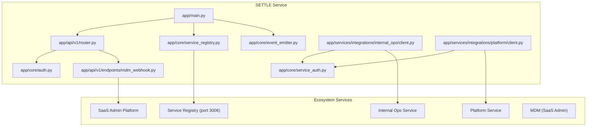
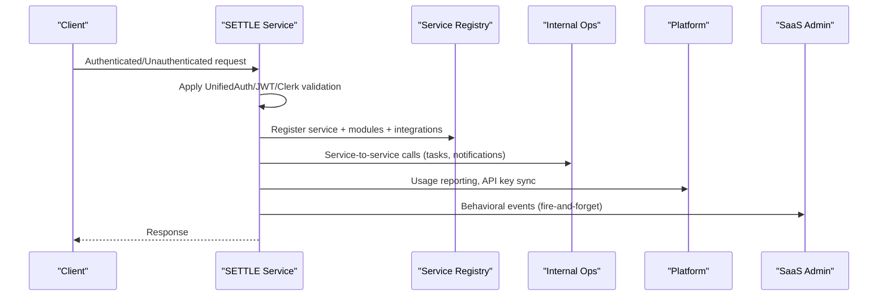
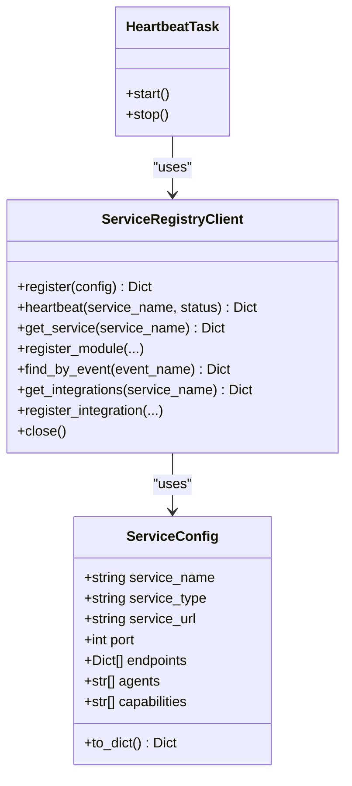
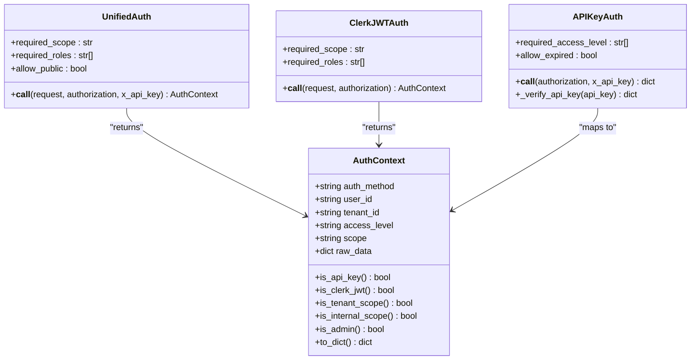
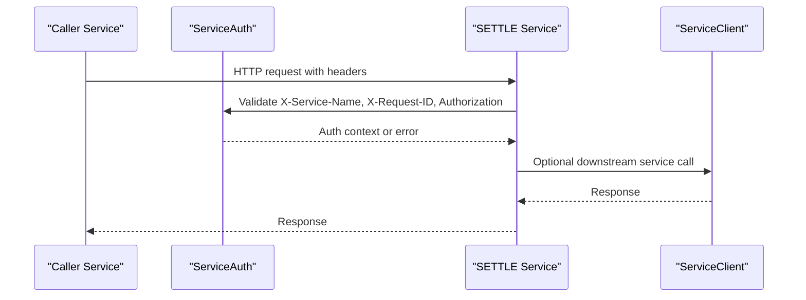
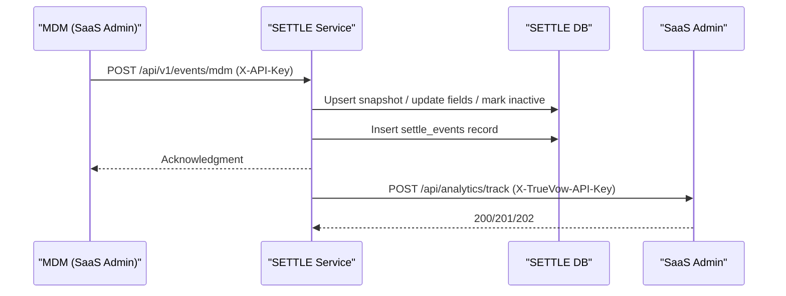
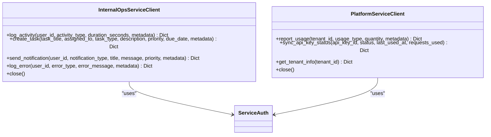
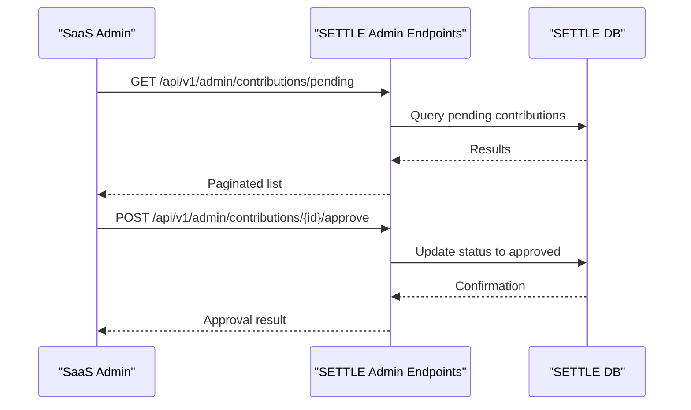
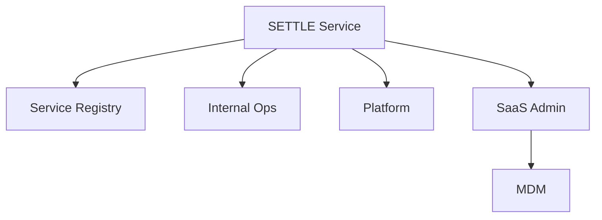

# Ecosystem Integration

<cite>
**Referenced Files in This Document**
- [app/main.py](file://app/main.py)
- [app/core/service_registry.py](file://app/core/service_registry.py)
- [app/core/auth.py](file://app/core/auth.py)
- [app/core/service_auth.py](file://app/core/service_auth.py)
- [app/core/event_emitter.py](file://app/core/event_emitter.py)
- [app/api/v1/router.py](file://app/api/v1/router.py)
- [app/api/v1/endpoints/mdm_webhook.py](file://app/api/v1/endpoints/mdm_webhook.py)
- [app/services/integrations/internal_ops/client.py](file://app/services/integrations/internal_ops/client.py)
- [app/services/integrations/platform/client.py](file://app/services/integrations/platform/client.py)
- [docs/architecture/SETTLE_DUAL_AUTH_ARCHITECTURE.md](file://docs/architecture/SETTLE_DUAL_AUTH_ARCHITECTURE.md)
- [docs/architecture/SETTLE_ADMIN_ARCHITECTURE.md](file://docs/architecture/SETTLE_ADMIN_ARCHITECTURE.md)
- [docs/API_DOCUMENTATION.md](file://docs/API_DOCUMENTATION.md)
- [docs/integration/SAAS_ADMIN_API_CONTRACT.md](file://docs/integration/SAAS_ADMIN_API_CONTRACT.md)
- [app/core/config.py](file://app/core/config.py)
</cite>

## Table of Contents
1. [Introduction](#introduction)
2. [Project Structure](#project-structure)
3. [Core Components](#core-components)
4. [Architecture Overview](#architecture-overview)
5. [Detailed Component Analysis](#detailed-component-analysis)
6. [Dependency Analysis](#dependency-analysis)
7. [Performance Considerations](#performance-considerations)
8. [Troubleshooting Guide](#troubleshooting-guide)
9. [Conclusion](#conclusion)
10. [Appendices](#appendices)

## Introduction
This document explains how the SETTLE Service integrates into the TrueVow ecosystem as a shared service enabling collaboration across tenant organizations. It covers the service registry architecture for discovery and communication, the event-driven integration with MDM and SaaS Admin, the dual authentication system integrating with TrueVow’s identity management, and the service-to-service authentication for Internal Ops and Platform coordination. It also documents webhook implementations, API contracts, and data exchange protocols that enable seamless interoperability.

## Project Structure
The SETTLE Service is organized around a FastAPI application with modular components for authentication, service registry integration, event emission, and integration clients for Internal Ops and Platform services. The API router groups endpoints by category (public, authenticated, admin), while documentation outlines the ecosystem contracts and integration patterns.

**Diagram sources**
- [app/main.py:52-100](file://app/main.py#L52-L100)
- [app/api/v1/router.py:1-26](file://app/api/v1/router.py#L1-L26)
- [app/core/service_registry.py:47-214](file://app/core/service_registry.py#L47-L214)
- [app/core/event_emitter.py:44-88](file://app/core/event_emitter.py#L44-L88)
- [app/api/v1/endpoints/mdm_webhook.py:73-114](file://app/api/v1/endpoints/mdm_webhook.py#L73-L114)
- [app/services/integrations/internal_ops/client.py:19-244](file://app/services/integrations/internal_ops/client.py#L19-L244)
- [app/services/integrations/platform/client.py:19-146](file://app/services/integrations/platform/client.py#L19-L146)

**Section sources**
- [app/main.py:102-136](file://app/main.py#L102-L136)
- [app/api/v1/router.py:1-26](file://app/api/v1/router.py#L1-L26)

## Core Components
- Service Registry integration: Registers the service, publishes modules and integrations, and maintains heartbeats for discovery and orchestration.
- Dual authentication: Supports both API keys (legacy) and Clerk JWT (new) for tenant and internal access.
- Service-to-service authentication: Enforces secure inter-service calls among TrueVow services.
- Event emission: Fire-and-forget behavioral event emitter for SaaS Admin analytics.
- Webhooks: MDM webhook endpoint for case lifecycle events and snapshot synchronization.
- Integration clients: Clients for Internal Ops (tasks, notifications, activity logging) and Platform (usage reporting, API key sync, tenant info).

**Section sources**
- [app/core/service_registry.py:47-354](file://app/core/service_registry.py#L47-L354)
- [app/core/auth.py:12-800](file://app/core/auth.py#L12-L800)
- [app/core/service_auth.py:20-376](file://app/core/service_auth.py#L20-L376)
- [app/core/event_emitter.py:44-88](file://app/core/event_emitter.py#L44-L88)
- [app/api/v1/endpoints/mdm_webhook.py:73-326](file://app/api/v1/endpoints/mdm_webhook.py#L73-L326)
- [app/services/integrations/internal_ops/client.py:19-244](file://app/services/integrations/internal_ops/client.py#L19-L244)
- [app/services/integrations/platform/client.py:19-146](file://app/services/integrations/platform/client.py#L19-L146)

## Architecture Overview
SETTLE operates as a shared service within the TrueVow 5-service architecture. It registers itself with the Service Registry, emits behavioral events to SaaS Admin, receives MDM webhooks for case snapshots, and communicates with Internal Ops and Platform services using service-to-service authentication. The authentication layer supports both legacy API keys and modern Clerk JWTs, with audit logging for security compliance.

**Diagram sources**
- [app/main.py:52-100](file://app/main.py#L52-L100)
- [app/core/service_registry.py:64-207](file://app/core/service_registry.py#L64-L207)
- [app/core/service_auth.py:53-180](file://app/core/service_auth.py#L53-L180)
- [app/core/event_emitter.py:56-87](file://app/core/event_emitter.py#L56-L87)
- [app/services/integrations/internal_ops/client.py:30-198](file://app/services/integrations/internal_ops/client.py#L30-L198)
- [app/services/integrations/platform/client.py:30-122](file://app/services/integrations/platform/client.py#L30-L122)

## Detailed Component Analysis

### Service Registry Integration
SETTLE registers itself with the Service Registry, publishes module capabilities and integration contracts, and runs periodic heartbeats. It exposes convenience functions for service discovery and fail-fast resolution.

**Diagram sources**
- [app/core/service_registry.py:24-214](file://app/core/service_registry.py#L24-L214)
- [app/core/service_registry.py:216-244](file://app/core/service_registry.py#L216-L244)

**Section sources**
- [app/core/service_registry.py:47-354](file://app/core/service_registry.py#L47-L354)
- [app/main.py:52-99](file://app/main.py#L52-L99)

### Dual Authentication System
The dual authentication system supports:
- API Key Authentication: Legacy integration with access levels and audit logging.
- Clerk JWT Authentication: Modern integration with tenant and internal scopes, role-based access, and audit trails.

**Diagram sources**
- [app/core/auth.py:96-158](file://app/core/auth.py#L96-L158)
- [app/core/auth.py:340-485](file://app/core/auth.py#L340-L485)
- [app/core/auth.py:165-334](file://app/core/auth.py#L165-L334)
- [app/core/auth.py:487-795](file://app/core/auth.py#L487-L795)

**Section sources**
- [app/core/auth.py:12-800](file://app/core/auth.py#L12-L800)
- [docs/architecture/SETTLE_DUAL_AUTH_ARCHITECTURE.md:1-274](file://docs/architecture/SETTLE_DUAL_AUTH_ARCHITECTURE.md#L1-L274)

### Service-to-Service Authentication
Service-to-service calls are validated using headers and API keys. The client enforces required headers, validates service names, and performs API key verification. It also provides standardized headers for outgoing requests.

**Diagram sources**
- [app/core/service_auth.py:53-180](file://app/core/service_auth.py#L53-L180)
- [app/core/service_auth.py:183-321](file://app/core/service_auth.py#L183-L321)

**Section sources**
- [app/core/service_auth.py:20-376](file://app/core/service_auth.py#L20-L376)

### Event-Driven Integration with MDM and SaaS Admin
- MDM Webhook: Receives case lifecycle events (created, updated, settled), updates snapshots, and records events.
- Behavioral Events: Emits fire-and-forget events to SaaS Admin for analytics.

**Diagram sources**
- [app/api/v1/endpoints/mdm_webhook.py:73-292](file://app/api/v1/endpoints/mdm_webhook.py#L73-L292)
- [app/core/event_emitter.py:56-87](file://app/core/event_emitter.py#L56-L87)

**Section sources**
- [app/api/v1/endpoints/mdm_webhook.py:73-326](file://app/api/v1/endpoints/mdm_webhook.py#L73-L326)
- [app/core/event_emitter.py:44-88](file://app/core/event_emitter.py#L44-L88)

### Integration Clients: Internal Ops and Platform
- Internal Ops Client: Logs activities, creates tasks, sends notifications, and logs errors.
- Platform Client: Reports usage, syncs API key status, and fetches tenant info.

**Diagram sources**
- [app/services/integrations/internal_ops/client.py:19-244](file://app/services/integrations/internal_ops/client.py#L19-L244)
- [app/services/integrations/platform/client.py:19-146](file://app/services/integrations/platform/client.py#L19-L146)

**Section sources**
- [app/services/integrations/internal_ops/client.py:19-244](file://app/services/integrations/internal_ops/client.py#L19-L244)
- [app/services/integrations/platform/client.py:19-146](file://app/services/integrations/platform/client.py#L19-L146)

### Administrative Integration with SaaS Admin
Administrative workflows are orchestrated by SaaS Admin and executed via SETTLE admin endpoints. The API contract defines endpoints for contribution review, founding member management, API key operations, and analytics.

**Diagram sources**
- [docs/integration/SAAS_ADMIN_API_CONTRACT.md:40-172](file://docs/integration/SAAS_ADMIN_API_CONTRACT.md#L40-L172)
- [app/api/v1/endpoints/admin.py:31-271](file://app/api/v1/endpoints/admin.py#L31-L271)

**Section sources**
- [docs/integration/SAAS_ADMIN_API_CONTRACT.md:1-297](file://docs/integration/SAAS_ADMIN_API_CONTRACT.md#L1-L297)
- [app/api/v1/endpoints/admin.py:1-756](file://app/api/v1/endpoints/admin.py#L1-L756)

### API Contracts and Data Exchange Protocols
- API Documentation: Defines base URLs, authentication, endpoints, data models, rate limiting, and integration examples.
- Configuration: Centralizes service URLs, timeouts, and API keys for Internal Ops, Platform, and SaaS Admin.

**Section sources**
- [docs/API_DOCUMENTATION.md:1-800](file://docs/API_DOCUMENTATION.md#L1-L800)
- [app/core/config.py:254-314](file://app/core/config.py#L254-L314)

## Dependency Analysis
SETTLE depends on the Service Registry for discovery and orchestration, on Internal Ops and Platform for administrative and operational functions, and on MDM/SaaS Admin for data synchronization and analytics. The authentication layer ensures secure access across all integration points.

**Diagram sources**
- [app/main.py:52-100](file://app/main.py#L52-L100)
- [app/core/service_registry.py:47-214](file://app/core/service_registry.py#L47-L214)
- [app/services/integrations/internal_ops/client.py:30-198](file://app/services/integrations/internal_ops/client.py#L30-L198)
- [app/services/integrations/platform/client.py:30-122](file://app/services/integrations/platform/client.py#L30-L122)

**Section sources**
- [app/core/service_registry.py:47-354](file://app/core/service_registry.py#L47-L354)
- [app/core/config.py:254-314](file://app/core/config.py#L254-L314)

## Performance Considerations
- Asynchronous HTTP clients: Service clients and registry client use async HTTPX to minimize latency.
- Fire-and-forget events: Behavioral event emitter avoids blocking main operations.
- Heartbeat intervals: Configurable intervals reduce registry overhead.
- Audit logging: Non-blocking audit logging prevents auth failures from impacting user requests.

[No sources needed since this section provides general guidance]

## Troubleshooting Guide
- Service Registry connectivity: Use the provided test scripts to verify registry health and service visibility.
- Authentication failures: Validate API key format and Clerk JWT claims; check audit logs for detailed reasons.
- Webhook delivery: Confirm X-API-Key header and payload structure; inspect event recording in settle_events.
- Service-to-service errors: Verify required headers, API key validity, and target service availability.

**Section sources**
- [test_registry.py:1-27](file://test_registry.py#L1-L27)
- [test_registry2.py:1-33](file://test_registry2.py#L1-L33)
- [app/api/v1/endpoints/mdm_webhook.py:86-113](file://app/api/v1/endpoints/mdm_webhook.py#L86-L113)
- [app/core/auth.py:34-90](file://app/core/auth.py#L34-L90)

## Conclusion
SETTLE integrates deeply into the TrueVow ecosystem as a shared settlement intelligence service. Its service registry integration, event-driven MDM synchronization, dual authentication system, and secure service-to-service communications form a robust foundation for cross-tenant collaboration. Administrative workflows through SaaS Admin and operational integrations with Internal Ops and Platform ensure efficient governance and execution across the ecosystem.

[No sources needed since this section summarizes without analyzing specific files]

## Appendices
- Administrative Architecture: Clarifies the relationship between SETTLE, SaaS Admin, and tenant databases.
- Dual Authentication Architecture: Outlines migration path and security considerations for JWT and API key support.

**Section sources**
- [docs/architecture/SETTLE_ADMIN_ARCHITECTURE.md:1-913](file://docs/architecture/SETTLE_ADMIN_ARCHITECTURE.md#L1-L913)
- [docs/architecture/SETTLE_DUAL_AUTH_ARCHITECTURE.md:1-274](file://docs/architecture/SETTLE_DUAL_AUTH_ARCHITECTURE.md#L1-L274)