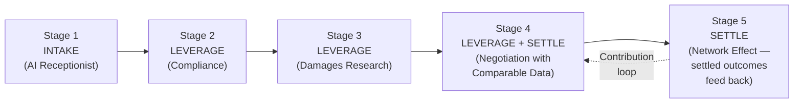
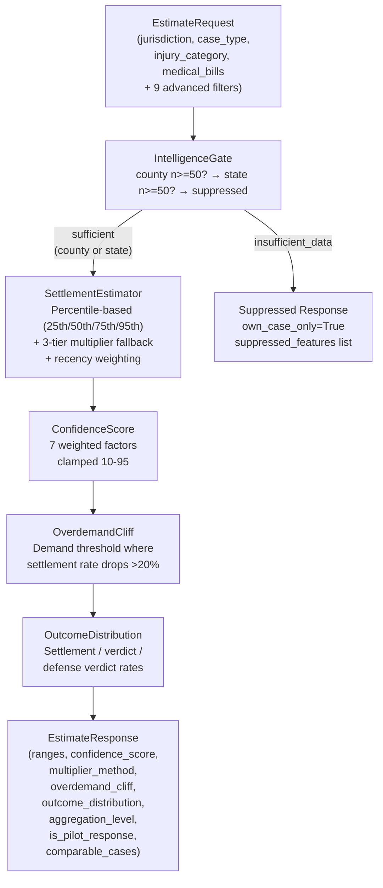
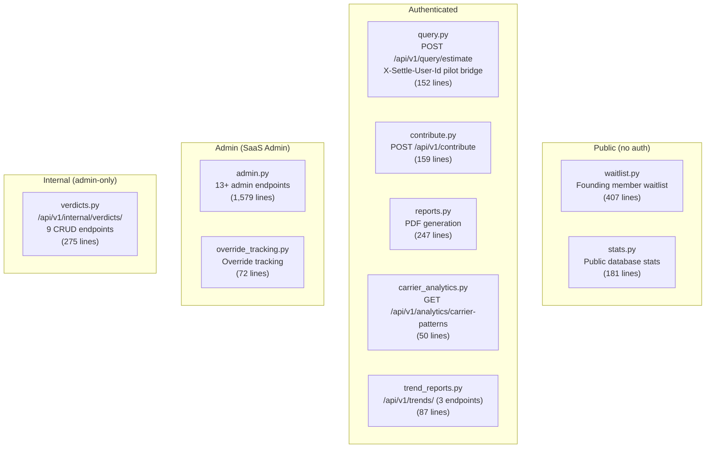
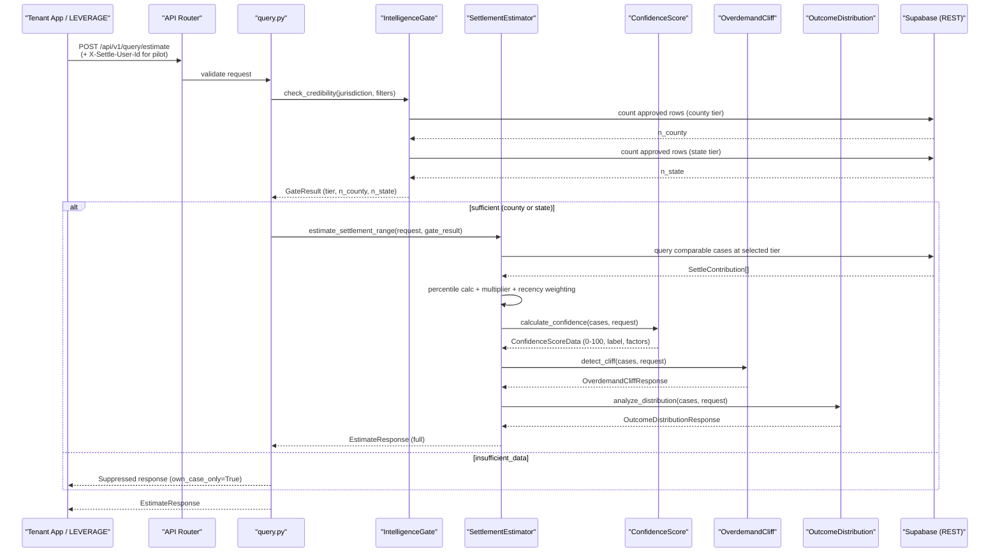
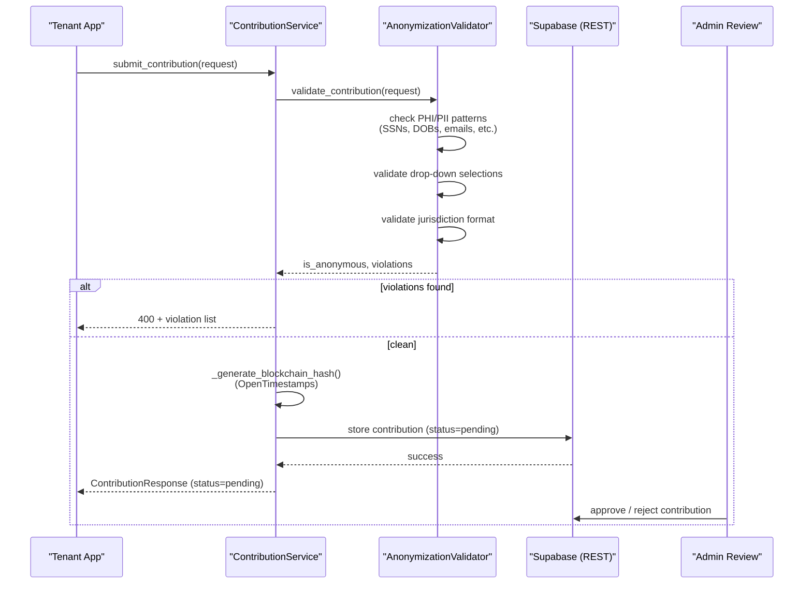
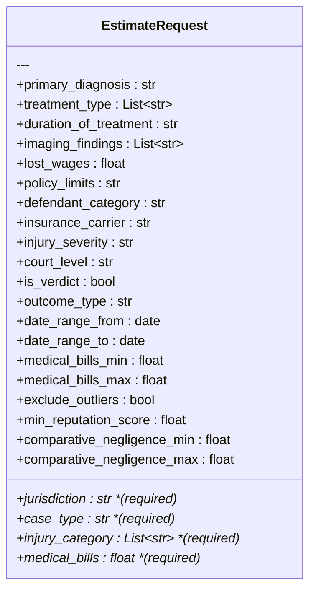
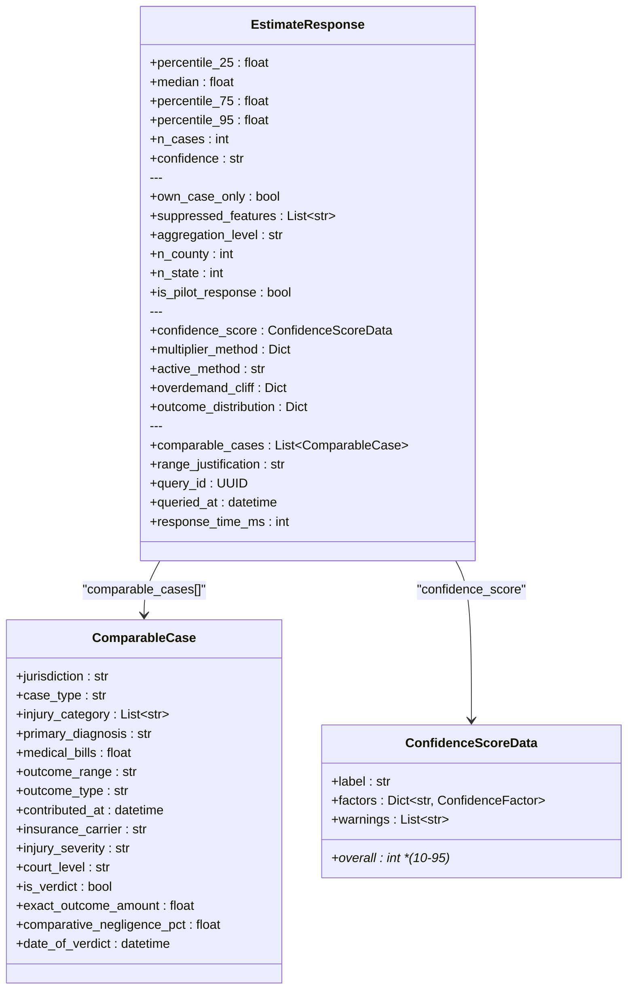

# Introduction

<cite>
**Referenced Files in This Document**
- [README.md](file://README.md)
- [app/main.py](file://app/main.py)
- [app/core/config.py](file://app/core/config.py)
- [app/core/database.py](file://app/core/database.py)
- [app/api/v1/router.py](file://app/api/v1/router.py)
- [app/api/v1/endpoints/query.py](file://app/api/v1/endpoints/query.py)
- [app/api/v1/endpoints/contribute.py](file://app/api/v1/endpoints/contribute.py)
- [app/api/v1/endpoints/admin.py](file://app/api/v1/endpoints/admin.py)
- [app/api/v1/endpoints/stats.py](file://app/api/v1/endpoints/stats.py)
- [app/api/v1/endpoints/waitlist.py](file://app/api/v1/endpoints/waitlist.py)
- [app/api/v1/endpoints/reports.py](file://app/api/v1/endpoints/reports.py)
- [app/api/v1/endpoints/verdicts.py](file://app/api/v1/endpoints/verdicts.py)
- [app/api/v1/endpoints/carrier_analytics.py](file://app/api/v1/endpoints/carrier_analytics.py)
- [app/api/v1/endpoints/trend_reports.py](file://app/api/v1/endpoints/trend_reports.py)
- [app/api/v1/endpoints/override_tracking.py](file://app/api/v1/endpoints/override_tracking.py)
- [app/services/estimator.py](file://app/services/estimator.py)
- [app/services/intelligence_gate.py](file://app/services/intelligence_gate.py)
- [app/services/confidence_score.py](file://app/services/confidence_score.py)
- [app/services/injury_classifier/engine.py](file://app/services/injury_classifier/engine.py)
- [app/services/carrier_patterns.py](file://app/services/carrier_patterns.py)
- [app/services/outcome_distribution.py](file://app/services/outcome_distribution.py)
- [app/services/overdemand_cliff.py](file://app/services/overdemand_cliff.py)
- [app/services/override_tracking.py](file://app/services/override_tracking.py)
- [app/services/reputation_service.py](file://app/services/reputation_service.py)
- [app/services/anomaly_detector.py](file://app/services/anomaly_detector.py)
- [app/services/trend_reports.py](file://app/services/trend_reports.py)
- [app/services/weekly_digest.py](file://app/services/weekly_digest.py)
- [app/services/verdict_search.py](file://app/services/verdict_search.py)
- [app/services/contributor.py](file://app/services/contributor.py)
- [app/services/anonymizer.py](file://app/services/anonymizer.py)
- [app/services/validator.py](file://app/services/validator.py)
- [app/services/reports/pdf_generator.py](file://app/services/reports/pdf_generator.py)
- [app/services/billing/stripe_service.py](file://app/services/billing/stripe_service.py)
- [app/services/notifications/email_service.py](file://app/services/notifications/email_service.py)
- [app/services/storage/s3_service.py](file://app/services/storage/s3_service.py)
- [app/models/case_bank.py](file://app/models/case_bank.py)
- [app/models/verdicts.py](file://app/models/verdicts.py)
</cite>

## Table of Contents
1. [What Is SETTLE?](#what-is-settle)
2. [Where SETTLE Fits in the TrueVow Ecosystem](#where-settle-fits-in-the-truevow-ecosystem)
3. [Why SETTLE Is Built This Way (ICP Context)](#why-settle-is-built-this-way-icp-context)
4. [Project Structure](#project-structure)
5. [Estimation Pipeline (How the Pieces Fit Together)](#estimation-pipeline-how-the-pieces-fit-together)
6. [Service Layer (17+ Modules)](#service-layer-17-modules)
7. [API Layer (10 Files, 40+ Endpoints)](#api-layer-10-files-40-endpoints)
8. [Data Models](#data-models)
9. [Database Layer (SupabaseRESTClient)](#database-layer-supabaserestclient)
10. [Pilot Mode](#pilot-mode)
11. [DOCKET-Service (Sub-Service)](#docket-service-sub-service)
12. [Testing](#testing)
13. [Dependency Analysis](#dependency-analysis)
14. [Performance and Monitoring](#performance-and-monitoring)
15. [Troubleshooting Guide](#troubleshooting-guide)

## What Is SETTLE?

SETTLE is a **Settlement Intelligence Network** — a settlement-range estimator for plaintiff attorneys. Attorneys contribute anonymized settlement outcomes; SETTLE matches comparable cases and returns percentile-based settlement ranges with confidence scoring, overdemand cliff detection, and litigation outcome distributions. Zero PHI/PII is collected. Blockchain verification (OpenTimestamps) guarantees data integrity. The entire system uses **descriptive-not-predictive framing** to maintain bar compliance across all 50 states ("Historical data shows..." never "AI predicts...").

Key capabilities:
- **Settlement range estimation** — percentile-based (25th/median/75th/95th) with 3-tier multiplier fallback and recency weighting
- **Hierarchical Intelligence Gate** — refuses to emit aggregate statistics when data is thin (county n>=50 -> state n>=50 -> suppressed)
- **7-factor confidence scoring** — clamped 10-95, labels: Very Strong / Strong / Moderate / Cautious / Insufficient Data
- **Deterministic injury classification** — 17-tag regex-based classifier, zero LLM, full audit trail
- **Carrier/defendant analytics** — settlement rates, lowball indicators (plaintiff-side equivalent of defense tools like SigmaSight/CLARA)
- **Overdemand cliff detection** — identifies the demand threshold where settlement rate drops
- **Community contribution workflow** — anonymization validation, blockchain hash, admin review pipeline
- **Professional 4-page PDF reports** — jurisdictional summaries, comparable cases, methodology, compliance verification

**Section sources**
- [README.md](file://README.md)
- [app/services/estimator.py:1-50](file://app/services/estimator.py#L1-L50)
- [app/services/intelligence_gate.py:1-23](file://app/services/intelligence_gate.py#L1-L23)

## Where SETTLE Fits in the TrueVow Ecosystem

TrueVow is a 3-product ecosystem for plaintiff attorneys:

| # | Product | What It Does | Pricing |
|---|---------|-------------|---------|
| 1 | **INTAKE (Benjamin)** | AI receptionist for law firms | $499 / $1,299 / $1,999 per month |
| 2 | **LEVERAGE** | 50-state PI Case Intelligence (34 API endpoints) | $99/mo ecosystem, $349/mo standalone |
| 3 | **SETTLE** | Settlement Intelligence Network — community-contributed anonymized data + comparable case matching | TBD (Founding Member program: lifetime free for first 2,100 attorneys) |

SETTLE sits at **Stages 4-5** of a 5-stage attorney journey:



The critical insight: SETTLE becomes more valuable as attorneys contribute outcomes. Settled cases feed back into the network, improving estimates for the next attorney. This is the **network effect moat** that competitors cannot replicate.

**Section sources**
- [README.md](file://README.md)
- [app/main.py:46-49](file://app/main.py#L46-L49)

## Why SETTLE Is Built This Way (ICP Context)

Understanding the Ideal Customer Profile explains almost every architectural decision:

- **50,435 PI firms** in the US, ~20K addressable
- **Solo PI attorneys (Persona A)** fear unpredictable billing — 59% don't budget for tech
- **SETTLE must work out-of-the-box** — attorneys don't configure tools, they abandon them
- **Descriptive-not-predictive framing** is mandatory for bar compliance (cannot say "you should demand X")
- **Confidence labeling** is critical for trust — attorneys won't use a tool that feels like a black box
- **Zero PHI/PII** is a hard requirement — attorneys cannot risk client data exposure
- The **Intelligence Gate** ("Never Sell Empty Dashboards") exists because showing thin-data estimates would destroy trust with exactly the skeptical solo attorneys we need to win

These constraints drive the architecture: drop-down-only inputs (no free text), strict anonymization, clamped confidence scores (never 0 or 100), hierarchical jurisdiction fallback, and the hard n>=50 credibility floor.

**Section sources**
- [app/services/intelligence_gate.py:1-23](file://app/services/intelligence_gate.py#L1-L23)
- [app/services/anonymizer.py:1-339](file://app/services/anonymizer.py#L1-L339)
- [app/services/confidence_score.py:1-16](file://app/services/confidence_score.py#L1-L16)

## Project Structure

SETTLE is a **FastAPI microservice** (port 8002) with a modular architecture. The codebase is organized as:

```
TrueVow_Tenant_SETTLE-Service/
├── app/
│   ├── main.py                          # FastAPI app, CORS, Sentry, lifespan
│   ├── core/
│   │   ├── config.py                    # Environment config (362 lines)
│   │   ├── database.py                  # SupabaseRESTClient (599 lines)
│   │   └── monitoring.py               # Sentry initialization
│   ├── api/v1/
│   │   ├── router.py                   # Route registration (10 endpoint files)
│   │   └── endpoints/
│   │       ├── query.py                # POST /api/v1/query/estimate
│   │       ├── contribute.py           # POST /api/v1/contribute
│   │       ├── admin.py               # 13+ admin endpoints (1,579 lines)
│   │       ├── stats.py               # Public statistics
│   │       ├── waitlist.py            # Founding member waitlist
│   │       ├── reports.py             # PDF generation
│   │       ├── verdicts.py            # Internal verdict CRUD (9 endpoints)
│   │       ├── carrier_analytics.py   # Carrier pattern analytics
│   │       ├── trend_reports.py       # Quarterly trends (3 endpoints)
│   │       └── override_tracking.py   # Override tracking admin
│   ├── services/
│   │   ├── estimator.py               # Core estimation engine (1,112 lines)
│   │   ├── intelligence_gate.py       # Hierarchical data gate (486 lines)
│   │   ├── confidence_score.py        # 7-factor scoring (383 lines)
│   │   ├── carrier_patterns.py        # Carrier analytics (230 lines)
│   │   ├── outcome_distribution.py    # Litigation outcome stats (220 lines)
│   │   ├── overdemand_cliff.py        # Demand threshold detection (197 lines)
│   │   ├── override_tracking.py       # User override tracking (198 lines)
│   │   ├── reputation_service.py      # Contributor reputation (528 lines)
│   │   ├── anomaly_detector.py        # Contribution anomaly detection (602 lines)
│   │   ├── trend_reports.py           # Quarterly market reports (496 lines)
│   │   ├── weekly_digest.py           # Weekly digest emails (189 lines)
│   │   ├── verdict_search.py          # 17-filter verdict search (447 lines)
│   │   ├── contributor.py             # Contribution workflow (485 lines)
│   │   ├── anonymizer.py              # PHI/PII validation (339 lines)
│   │   ├── validator.py               # Input validation (326 lines)
│   │   ├── injury_classifier/         # Deterministic 17-tag classifier
│   │   │   ├── engine.py              # Classification engine (226 lines)
│   │   │   ├── rules.py               # Tag rule registry (500 lines)
│   │   │   ├── schema.py              # Pydantic models (146 lines)
│   │   │   ├── triggers.py            # Trigger patterns (98 lines)
│   │   │   ├── synth.py               # Synthetic data gen (75 lines)
│   │   │   └── version.py             # Classifier version (17 lines)
│   │   ├── reports/pdf_generator.py   # 4-page PDF reports (726 lines)
│   │   ├── billing/stripe_service.py  # Stripe integration (529 lines)
│   │   ├── notifications/email_service.py  # Email service (220 lines)
│   │   └── storage/s3_service.py      # S3 storage (316 lines)
│   └── models/
│       ├── case_bank.py               # Core request/response models (441 lines)
│       ├── verdicts.py                # Verdict CRUD models (388 lines)
│       ├── waitlist.py                # Waitlist models
│       ├── reports.py                 # Report models
│       └── api_keys.py               # API key models
├── tests/                              # 19 test files
├── DOCKET-Service/                     # Sub-service: CourtListener scraper
└── docs/                              # API, DB schema, integration docs
```

**Section sources**
- [app/main.py:1-86](file://app/main.py#L1-L86)
- [app/api/v1/router.py:1-27](file://app/api/v1/router.py#L1-L27)
- [app/core/config.py:1-362](file://app/core/config.py#L1-L362)

## Estimation Pipeline (How the Pieces Fit Together)

This is the core value delivery path — when an attorney submits a case profile, here is what happens:



Key design decisions in this pipeline:
1. **Gate-first**: The IntelligenceGate runs BEFORE any estimation. If data is too thin, we refuse to show aggregate stats rather than showing misleading numbers. This is the "Never Sell Empty Dashboards" guardrail.
2. **Hierarchical fallback**: County-exact data is preferred (highest precision), but if county has <50 approved rows, state-wide data (including "Unknown County" sentinel rows) is used. The `aggregation_level` field ("county" | "state" | "none") tells the UI which tier produced the numbers.
3. **No multiplier-only mode**: When the gate returns insufficient_data, there is NO multiplier fallback. Synthesizing ranges from sub-threshold data is the exact anti-pattern the gate prevents.
4. **Pilot-mode awareness**: When pilot mode is active, the estimator uses relaxed thresholds (n>=10 at state tier) and sets `is_pilot_response=True` so the UI renders a disclosure.

**Diagram sources**
- [app/services/estimator.py:35-50](file://app/services/estimator.py#L35-L50)
- [app/services/intelligence_gate.py:1-23](file://app/services/intelligence_gate.py#L1-L23)
- [app/services/confidence_score.py:1-16](file://app/services/confidence_score.py#L1-L16)
- [app/services/overdemand_cliff.py:1-12](file://app/services/overdemand_cliff.py#L1-L12)
- [app/services/outcome_distribution.py:1-15](file://app/services/outcome_distribution.py#L1-L15)

**Section sources**
- [app/services/estimator.py:1-1112](file://app/services/estimator.py#L1-L1112)
- [app/services/intelligence_gate.py:1-486](file://app/services/intelligence_gate.py#L1-L486)
- [app/models/case_bank.py:184-284](file://app/models/case_bank.py#L184-L284)

## Service Layer (17+ Modules)

Each service is a self-contained module under `app/services/`. Here is what each one does:

### Core Estimation Services

| Service | File | Lines | Purpose |
|---------|------|-------|---------|
| **SettlementEstimator** | `estimator.py` | 1,112 | Percentile-based ranges + 3-tier multiplier + recency weighting. Pilot-mode aware. Orchestrates the full estimation pipeline. |
| **IntelligenceGate** | `intelligence_gate.py` | 486 | Hierarchical credibility gate: county (n>=50) -> state (n>=50) -> suppressed. Hard floor, not a soft confidence downgrade. |
| **ConfidenceScore** | `confidence_score.py` | 383 | 7-factor weighted scoring: comp set depth (20%), reputation distribution (15%), jurisdiction coverage (15%), injury specificity (15%), data recency (10%), outlier rate (15%), completeness (10%). Clamped 10-95. Labels: Very Strong / Strong / Moderate / Cautious / Insufficient Data. |
| **OverdemandCliff** | `overdemand_cliff.py` | 197 | Detects the demand band above which settlement rate drops >20%. Descriptive framing only. |
| **OutcomeDistribution** | `outcome_distribution.py` | 220 | Historical outcome distribution: settlement rate, plaintiff verdict rate, defense verdict rate, dismissal rate, time to resolution. |

### Intelligence & Analytics Services

| Service | File | Lines | Purpose |
|---------|------|-------|---------|
| **CarrierPatterns** | `carrier_patterns.py` | 230 | Carrier/defendant analytics — settlement rates, lowball indicators. Plaintiff-side equivalent of defense tools (SigmaSight, CLARA). |
| **InjuryClassifier** | `injury_classifier/` | 1,062 total | Deterministic 17-tag regex-based classifier. Zero LLM, zero non-determinism. Same input -> same output, always. Full audit trail with matched spans. 6 sub-modules: engine, rules, schema, triggers, synth, version. |
| **VerdictSearch** | `verdict_search.py` | 447 | Internal 17-filter verdict search engine for admin research. |
| **TrendReports** | `trend_reports.py` | 496 | Quarterly market intelligence reports. |
| **WeeklyDigest** | `weekly_digest.py` | 189 | Weekly intelligence digest emails. |

### Data Quality & Trust Services

| Service | File | Lines | Purpose |
|---------|------|-------|---------|
| **ReputationService** | `reputation_service.py` | 528 | Contributor reputation scoring — weighs contribution quality, consistency, volume. |
| **AnomalyDetector** | `anomaly_detector.py` | 602 | Flags suspicious contributions (statistical outliers, gaming patterns). |
| **OverrideTracking** | `override_tracking.py` | 198 | Tracks when a user's actual outcome differs from the SETTLE estimate. Feeds back into accuracy measurement. |

### Contribution & Compliance Services

| Service | File | Lines | Purpose |
|---------|------|-------|---------|
| **Contributor** | `contributor.py` | 485 | Full contribution workflow: validation -> anonymization -> blockchain hash (OpenTimestamps) -> storage with status tracking -> admin review. |
| **Anonymizer** | `anonymizer.py` | 339 | PHI/PII validation — rejects SSNs, DOBs, phone numbers, emails, addresses, free-text narratives. Validates drop-down selections against allowed lists. |
| **Validator** | `validator.py` | 326 | Input validation for all request models. |

### Infrastructure Services

| Service | File | Lines | Purpose |
|---------|------|-------|---------|
| **PDFGenerator** | `reports/pdf_generator.py` | 726 | Professional 4-page PDF reports: settlement range summary, comparable cases table, methodology, compliance/blockchain verification. Uses WeasyPrint with mock fallback. |
| **StripeService** | `billing/stripe_service.py` | 529 | Stripe billing integration. |
| **EmailService** | `notifications/email_service.py` | 220 | Transactional and digest email delivery. |
| **S3Service** | `storage/s3_service.py` | 316 | S3 storage for generated reports and assets. |

**Section sources**
- [app/services/estimator.py:1-1112](file://app/services/estimator.py#L1-L1112)
- [app/services/intelligence_gate.py:1-486](file://app/services/intelligence_gate.py#L1-L486)
- [app/services/confidence_score.py:1-383](file://app/services/confidence_score.py#L1-L383)
- [app/services/injury_classifier/engine.py:1-226](file://app/services/injury_classifier/engine.py#L1-L226)
- [app/services/carrier_patterns.py:1-230](file://app/services/carrier_patterns.py#L1-L230)
- [app/services/contributor.py:1-485](file://app/services/contributor.py#L1-L485)
- [app/services/anonymizer.py:1-339](file://app/services/anonymizer.py#L1-L339)

## API Layer (10 Files, 40+ Endpoints)

All endpoints are registered in `app/api/v1/router.py` (27 lines). The router organizes endpoints into four tiers:



### The Core Query Flow



### The Contribution Flow



**Diagram sources**
- [app/api/v1/router.py:1-27](file://app/api/v1/router.py#L1-L27)
- [app/api/v1/endpoints/query.py:1-152](file://app/api/v1/endpoints/query.py#L1-L152)
- [app/api/v1/endpoints/contribute.py:1-159](file://app/api/v1/endpoints/contribute.py#L1-L159)

**Section sources**
- [app/api/v1/router.py:1-27](file://app/api/v1/router.py#L1-L27)
- [app/api/v1/endpoints/query.py:1-152](file://app/api/v1/endpoints/query.py#L1-L152)
- [app/api/v1/endpoints/admin.py:1-1579](file://app/api/v1/endpoints/admin.py#L1-L1579)
- [app/api/v1/endpoints/verdicts.py:1-275](file://app/api/v1/endpoints/verdicts.py#L1-L275)

## Data Models

Core models live in `app/models/case_bank.py` (441 lines) and `app/models/verdicts.py` (388 lines).

### EstimateRequest (9 Advanced Filters)

The request model accepts 4 required fields + up to 9 optional advanced filters for narrowing the comparable case pool:



### EstimateResponse (Rich Output)

The response carries the full estimation result including gate signals, confidence scoring, multiplier method, overdemand cliff, outcome distribution, and pilot-mode flags:



### SettleContribution (Database Record)

The database record has 3 tiers of rich fields added in Cohort W (2026-05-17):
- **Tier 1 (high impact)**: `insurance_carrier`, `comparative_negligence_pct`, `exact_outcome_amount`, `is_verdict`, `date_of_verdict`
- **Tier 2 (filtering/display)**: `court_level`, `injury_severity`, `policy_limit_amount`, `source_type`
- **Tier 3 (nice-to-have)**: `trial_duration_days`, `appeal_filed`, `appeal_outcome`

### ContributionRequest (Year-2 Mandatory Intake v2)

The contribution request includes 7 mandatory Year-2 intake fields beyond the legacy schema:
`intake_version_id`, `economic_strength_at_intake`, `final_treatment_escalation`, `settlement_band`, `policy_limit_known`, `time_to_resolution`, `litigation_filed`

### Verdict Models

`app/models/verdicts.py` (388 lines) defines 10+ Pydantic models for verdict CRUD operations in the internal verdict search engine.

**Diagram sources**
- [app/models/case_bank.py:101-142](file://app/models/case_bank.py#L101-L142)
- [app/models/case_bank.py:184-284](file://app/models/case_bank.py#L184-L284)
- [app/models/case_bank.py:144-166](file://app/models/case_bank.py#L144-L166)
- [app/models/case_bank.py:168-181](file://app/models/case_bank.py#L168-L181)
- [app/models/case_bank.py:15-95](file://app/models/case_bank.py#L15-L95)

**Section sources**
- [app/models/case_bank.py:1-441](file://app/models/case_bank.py#L1-L441)
- [app/models/verdicts.py:1-388](file://app/models/verdicts.py#L1-L388)

## Database Layer (SupabaseRESTClient)

SETTLE uses a **custom httpx-based REST client** (NOT asyncpg, NOT the Supabase Python SDK). The client is defined in `app/core/database.py` (599 lines) and provides a chainable query builder:

```python
# Chainable query pattern:
db = get_db()
result = await (
    db.table("settle_contributions")
    .select("*")
    .eq("status", "approved")
    .eq("jurisdiction", "Maricopa County, AZ")
    .ilike("case_type", "%Motor Vehicle%")
    .cs("injury_category", ["Soft Tissue"])
    .order("contributed_at", desc=True)
    .limit(100)
    .execute()
)
```

Available chainable methods: `.select()`, `.eq()`, `.neq()`, `.gt()`, `.gte()`, `.lt()`, `.lte()`, `.ilike()`, `.cs()` (contains), `.order()`, `.limit()`, `.execute()`.

Why REST instead of asyncpg? Supabase's hosted Postgres doesn't expose a direct connection string for all plans. The REST client talks to the PostgREST layer, which is always available.

**Section sources**
- [app/core/database.py:1-599](file://app/core/database.py#L1-L599)

## Pilot Mode

Pilot mode is a controlled rollout mechanism with relaxed data thresholds. It is gated by environment variables and a header bridge:

- **`SETTLE_PILOT_MODE`** (env var): Enables pilot-mode code paths globally
- **`SETTLE_PILOT_USER_IDS`** (env var): Comma-separated list of user IDs allowed to use pilot mode
- **`X-Settle-User-Id`** (request header): Identifies the calling user; if the user is in the pilot list and pilot mode is enabled, the estimator uses relaxed thresholds (state-tier n>=10 instead of n>=50)

When a pilot-mode estimate is produced, `is_pilot_response=True` is set on the response and the UI MUST render a pilot-phase disclosure banner.

**Section sources**
- [app/models/case_bank.py:227-238](file://app/models/case_bank.py#L227-L238)
- [app/services/estimator.py:1-50](file://app/services/estimator.py#L1-L50)
- [app/core/config.py:1-362](file://app/core/config.py#L1-L362)

## DOCKET-Service (Sub-Service)

The `DOCKET-Service/` directory contains a sub-service that scrapes verdict and docket data from CourtListener. It has its own FastAPI app, models, database config, and test suite. Data ingested by DOCKET flows into the SETTLE contribution pool as `source_type: "court_docket"` or `"scraped_verdict"` records.

```
DOCKET-Service/
├── app/
│   ├── main.py
│   ├── core/ (config, database)
│   ├── api/v1/endpoints/dockets.py
│   ├── models/docket.py
│   └── services/
│       ├── docket_search.py
│       └── scraping/courtlistener_scraper.py
└── tests/ (test_docket.py, test_scraper.py)
```

**Section sources**
- [DOCKET-Service/app/main.py](file://DOCKET-Service/app/main.py)
- [DOCKET-Service/app/services/scraping/courtlistener_scraper.py](file://DOCKET-Service/app/services/scraping/courtlistener_scraper.py)

## Testing

19 test files covering unit tests, integration tests, and end-to-end scenarios:

| Test File | Coverage Area |
|-----------|---------------|
| `test_estimator.py` | Core estimation engine |
| `test_intelligence_gate.py` | Hierarchical gate logic |
| `test_anonymizer.py` | PHI/PII validation |
| `test_validator.py` | Input validation |
| `test_phase1_phase2.py` | Phase 1-2 features |
| `test_phase2_5.py` | Phase 2.5 features |
| `test_phase3_1.py` | Multiplier model layer |
| `test_phase3_2.py` | Overdemand cliff detection |
| `test_phase3_3.py` | Phase 3.3 features |
| `test_phase3_4_5_6.py` | Phases 3.4-3.6 features |
| `test_phase4.py` | Outcome distribution |
| `test_functional.py` | Functional test suite |
| `test_customer_scenarios.py` | Real-world customer scenarios |
| `test_automated_integration.py` | Automated integration tests |
| `test_e2e_integration.py` | End-to-end integration tests |
| `tests/services/injury_classifier/test_engine.py` | Classifier engine |
| `tests/services/injury_classifier/test_rules.py` | Tag rule registry |
| `tests/services/injury_classifier/test_synth.py` | Synthetic data generation |
| `tests/services/injury_classifier/test_triggers.py` | Trigger patterns |

**Section sources**
- [tests/](file://tests/)

## Dependency Analysis

```mermaid
graph TB
    Main["app/main.py<br/>(FastAPI + Sentry)"] --> Router["app/api/v1/router.py"]
    Main --> Config["app/core/config.py"]
    Router --> QueryEP["endpoints/query.py"]
    Router --> ContribEP["endpoints/contribute.py"]
    Router --> AdminEP["endpoints/admin.py"]
    Router --> StatsEP["endpoints/stats.py"]
    Router --> WaitlistEP["endpoints/waitlist.py"]
    Router --> ReportsEP["endpoints/reports.py"]
    Router --> VerdictsEP["endpoints/verdicts.py"]
    Router --> CarrierEP["endpoints/carrier_analytics.py"]
    Router --> TrendEP["endpoints/trend_reports.py"]
    Router --> OverrideEP["endpoints/override_tracking.py"]

    QueryEP --> Estimator["services/estimator.py"]
    Estimator --> Gate["services/intelligence_gate.py"]
    Estimator --> ConfScore["services/confidence_score.py"]
    Estimator --> Cliff["services/overdemand_cliff.py"]
    Estimator --> Dist["services/outcome_distribution.py"]

    ContribEP --> Contributor["services/contributor.py"]
    Contributor --> Anonymizer["services/anonymizer.py"]
    Contributor --> Validator["services/validator.py"]

    CarrierEP --> CarrierSvc["services/carrier_patterns.py"]
    TrendEP --> TrendSvc["services/trend_reports.py"]
    OverrideEP --> OverrideSvc["services/override_tracking.py"]
    ReportsEP --> PDFGen["services/reports/pdf_generator.py"]
    VerdictsEP --> VerdictSvc["services/verdict_search.py"]

    Gate --> DB["app/core/database.py<br/>(SupabaseRESTClient)"]
    Estimator --> DB
    Contributor --> DB
    CarrierSvc --> DB
    Cliff --> DB
    Dist --> DB
    VerdictSvc --> DB
    TrendSvc --> DB
    OverrideSvc --> DB

    Estimator --> Models["app/models/case_bank.py"]
    Contributor --> Models
    PDFGen --> Models
```



Key architectural properties:
- **FastAPI + Starlette** for routing and middleware
- **Pydantic v2** for all request/response validation (strict mode with `ConfigDict`)
- **httpx** as the HTTP client (for SupabaseRESTClient and service-to-service calls)
- **NumPy** for percentile calculations in the estimator
- **Sentry** for error tracking and performance monitoring (staging + production only)
- **WeasyPrint** for PDF generation (with mock fallback for testing)
- **No ORM** — all database access goes through the custom SupabaseRESTClient

**Diagram sources**
- [app/main.py:1-86](file://app/main.py#L1-L86)
- [app/api/v1/router.py:1-27](file://app/api/v1/router.py#L1-L27)
- [app/services/estimator.py:1-31](file://app/services/estimator.py#L1-L31)
- [app/services/contributor.py:1-485](file://app/services/contributor.py#L1-L485)

**Section sources**
- [app/main.py:1-86](file://app/main.py#L1-L86)
- [app/core/config.py:1-362](file://app/core/config.py#L1-L362)
- [app/core/database.py:1-599](file://app/core/database.py#L1-L599)

## Performance and Monitoring

- **Response time target**: Sub-second for settlement estimation (p95)
- **Rate limiting**: Configurable per access level
- **Database indexing**: Targeted indexes on jurisdiction, case_type, status, contributed_at for fast filtering
- **Sentry integration**: Enabled in staging/production with configurable trace and profile sample rates (10% production, 50% staging)
- **Structured logging**: All services use Python's `logging` module with consistent format

**Section sources**
- [app/main.py:22-31](file://app/main.py#L22-L31)
- [app/core/config.py:1-362](file://app/core/config.py#L1-L362)

## Troubleshooting Guide

Common issues and resolutions:

| Problem | Likely Cause | Fix |
|---------|-------------|-----|
| `own_case_only=True` on every response | IntelligenceGate threshold not met (n<50 at both tiers) | Seed more approved contributions for the target jurisdiction, or enable pilot mode for testing |
| `is_pilot_response=True` unexpectedly | `SETTLE_PILOT_MODE=true` in env and user ID is in `SETTLE_PILOT_USER_IDS` | Check `.env` — pilot mode uses relaxed thresholds (n>=10) |
| Authentication failures | Invalid API key or missing service headers | Verify `Authorization`, `X-Service-Name`, `X-Request-ID`, `X-Request-Timestamp` headers |
| Validation errors on contribution | Input doesn't match drop-down allowed values | Check `VALID_CASE_TYPES`, `VALID_OUTCOME_RANGES`, etc. in `app/models/case_bank.py:382-441` |
| PDF generation fails | WeasyPrint not installed | Install WeasyPrint system dependencies; mock PDF fallback is available for testing |
| Database connectivity | Supabase REST URL or API key misconfigured | Verify `SUPABASE_URL` and `SUPABASE_SERVICE_ROLE_KEY` in env |
| Confidence score always "Cautious" | Low comp set depth or high outlier rate | Check the `factors` breakdown in the response — each factor explains its own score |

**Section sources**
- [app/core/config.py:1-362](file://app/core/config.py#L1-L362)
- [app/models/case_bank.py:382-441](file://app/models/case_bank.py#L382-L441)
- [app/services/intelligence_gate.py:38-56](file://app/services/intelligence_gate.py#L38-L56)
