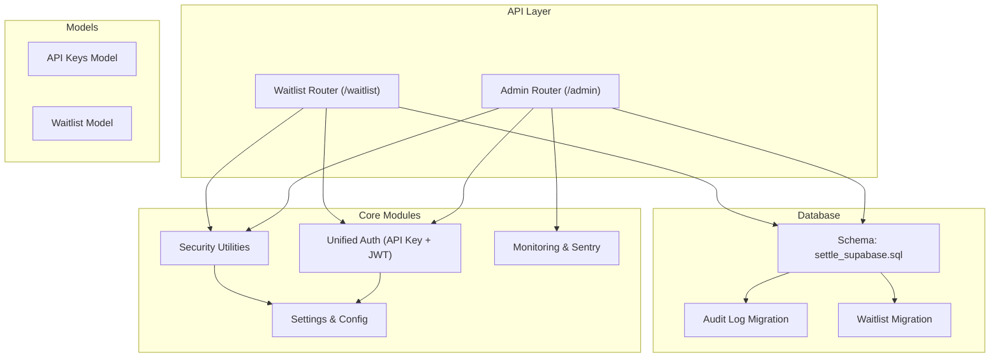
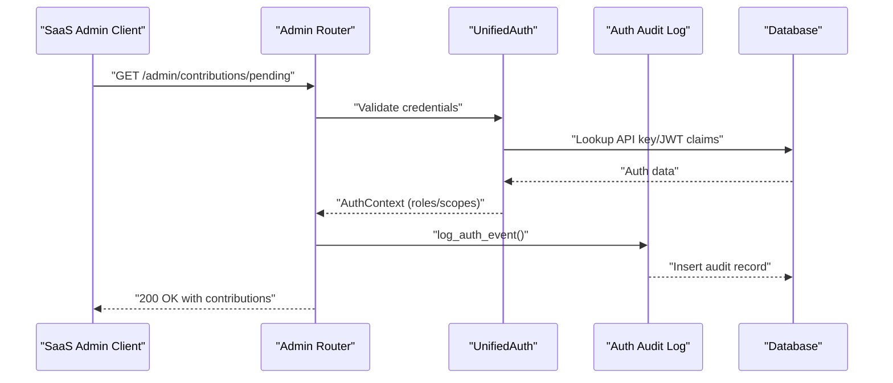
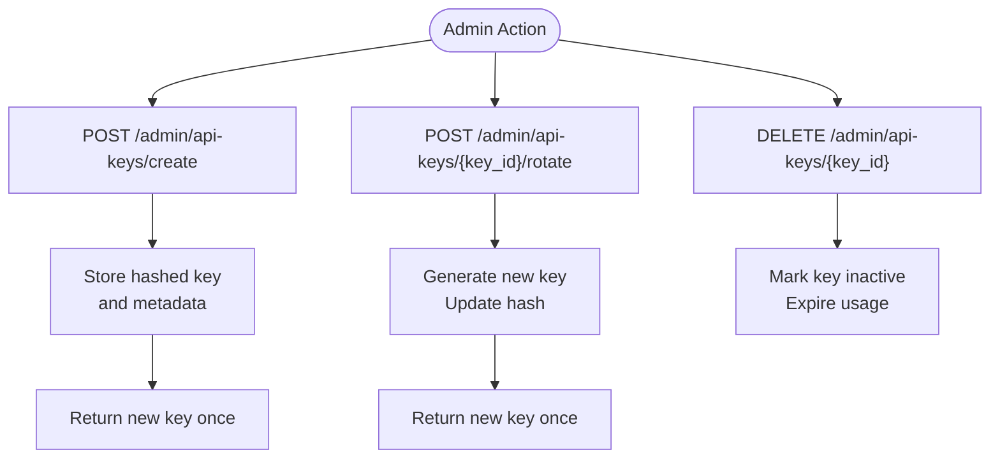
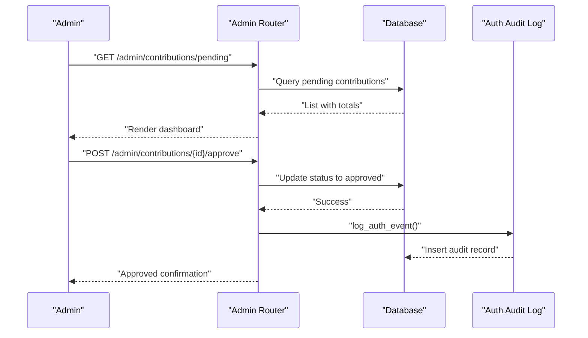
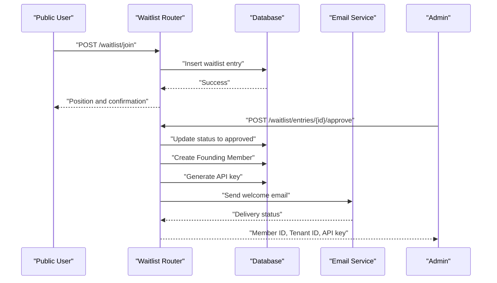
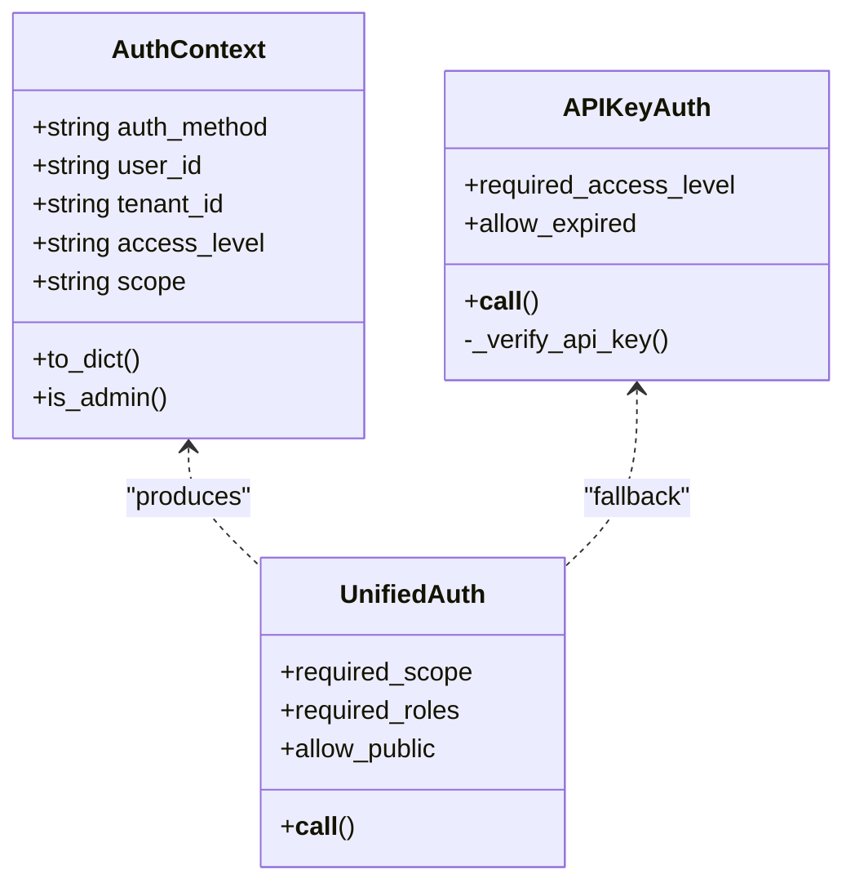
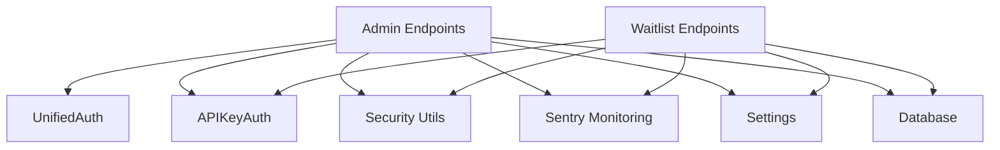

# Administrative Management

<cite>
**Referenced Files in This Document**
- [admin.py](file://app/api/v1/endpoints/admin.py)
- [waitlist.py](file://app/api/v1/endpoints/waitlist.py)
- [api_keys.py](file://app/models/api_keys.py)
- [waitlist.py](file://app/models/waitlist.py)
- [auth.py](file://app/core/auth.py)
- [security.py](file://app/core/security.py)
- [monitoring.py](file://app/core/monitoring.py)
- [router.py](file://app/api/v1/router.py)
- [config.py](file://app/core/config.py)
- [settle_supabase.sql](file://database/schemas/settle_supabase.sql)
- [20260302_add_auth_audit_log.sql](file://database/migrations/20260302_add_auth_audit_log.sql)
- [add_waitlist_table.sql](file://database/migrations/add_waitlist_table.sql)
- [README.md](file://README.md)
</cite>

## Table of Contents
1. [Introduction](#introduction)
2. [Project Structure](#project-structure)
3. [Core Components](#core-components)
4. [Architecture Overview](#architecture-overview)
5. [Detailed Component Analysis](#detailed-component-analysis)
6. [Dependency Analysis](#dependency-analysis)
7. [Performance Considerations](#performance-considerations)
8. [Troubleshooting Guide](#troubleshooting-guide)
9. [Conclusion](#conclusion)
10. [Appendices](#appendices)

## Introduction
This document describes the Administrative Management System for the SETTLE service, focusing on administrative capabilities exposed to the SaaS Admin platform. It covers:
- API key lifecycle management (generation, rotation, revocation)
- Contribution moderation workflows (review, approval, rejection)
- Founding Member administration (status management, compliance tracking)
- Waitlist management for controlled onboarding
- Administrative analytics and reporting
- Role-based access control and audit logging
- Monitoring and compliance considerations

The system supports dual authentication (API keys and Clerk JWT) and integrates comprehensive audit logging and error monitoring.

## Project Structure
Administrative endpoints are organized under a dedicated router and grouped by functional domain:
- Admin endpoints: contribution moderation, API key management, analytics
- Waitlist endpoints: public join and admin review/approval
- Core modules: unified authentication, security utilities, monitoring
- Database schema and migrations define audit trails and waitlist enhancements

**Diagram sources**
- [router.py:1-26](file://app/api/v1/router.py#L1-L26)
- [auth.py:340-485](file://app/core/auth.py#L340-L485)
- [security.py:23-66](file://app/core/security.py#L23-L66)
- [monitoring.py:14-83](file://app/core/monitoring.py#L14-L83)
- [settle_supabase.sql:139-198](file://database/schemas/settle_supabase.sql#L139-L198)
- [20260302_add_auth_audit_log.sql:1-37](file://database/migrations/20260302_add_auth_audit_log.sql#L1-L37)
- [add_waitlist_table.sql:1-61](file://database/migrations/add_waitlist_table.sql#L1-L61)

**Section sources**
- [router.py:1-26](file://app/api/v1/router.py#L1-L26)
- [README.md:241-297](file://README.md#L241-L297)

## Core Components
- Admin endpoints: contribution review, API key lifecycle, analytics, and health checks
- Waitlist endpoints: public join and admin approval/rejection with Founding Member onboarding
- Authentication: unified dependency supporting API keys and Clerk JWT with audit logging
- Security: API key generation, hashing, and verification utilities
- Monitoring: Sentry initialization and filtering for compliance
- Database: schema for contributions, API keys, and audit logging; migrations for waitlist enhancements

**Section sources**
- [admin.py:31-756](file://app/api/v1/endpoints/admin.py#L31-L756)
- [waitlist.py:62-418](file://app/api/v1/endpoints/waitlist.py#L62-L418)
- [auth.py:96-159](file://app/core/auth.py#L96-L159)
- [security.py:23-66](file://app/core/security.py#L23-L66)
- [monitoring.py:14-83](file://app/core/monitoring.py#L14-L83)
- [settle_supabase.sql:139-198](file://database/schemas/settle_supabase.sql#L139-L198)

## Architecture Overview
The administrative system uses a unified authentication layer that accepts either API keys or Clerk JWT. Admin endpoints enforce role-based access and log all authentication events to a dedicated audit table. Monitoring integrates Sentry for error tracking and compliance-aware filtering.

**Diagram sources**
- [auth.py:340-485](file://app/core/auth.py#L340-L485)
- [20260302_add_auth_audit_log.sql:6-31](file://database/migrations/20260302_add_auth_audit_log.sql#L6-L31)

**Section sources**
- [auth.py:340-485](file://app/core/auth.py#L340-L485)
- [20260302_add_auth_audit_log.sql:1-37](file://database/migrations/20260302_add_auth_audit_log.sql#L1-L37)

## Detailed Component Analysis

### API Key Management
Administrative workflows for API key lifecycle:
- Create API key for a tenant with access level selection
- Retrieve tenant’s API key (reference)
- Rotate an API key (regenerate)
- Revoke an API key (deactivate)

**Diagram sources**
- [admin.py:425-550](file://app/api/v1/endpoints/admin.py#L425-L550)
- [api_keys.py:11-40](file://app/models/api_keys.py#L11-L40)
- [security.py:23-66](file://app/core/security.py#L23-L66)

Implementation highlights:
- Access levels include founding_member, standard, premium, admin, external
- API key hashing and verification utilities support secure storage and validation
- Audit logging captures key lifecycle actions

**Section sources**
- [admin.py:425-550](file://app/api/v1/endpoints/admin.py#L425-L550)
- [api_keys.py:11-76](file://app/models/api_keys.py#L11-L76)
- [security.py:23-66](file://app/core/security.py#L23-L66)
- [settle_supabase.sql:139-198](file://database/schemas/settle_supabase.sql#L139-L198)

### Contribution Moderation
Admin workflows for reviewing and governing contributions:
- List pending contributions with pagination
- Fetch contribution details for review
- Approve or reject contributions with reasons
- Track contribution statistics and compliance

**Diagram sources**
- [admin.py:31-272](file://app/api/v1/endpoints/admin.py#L31-L272)
- [auth.py:340-485](file://app/core/auth.py#L340-L485)
- [20260302_add_auth_audit_log.sql:6-31](file://database/migrations/20260302_add_auth_audit_log.sql#L6-L31)

**Section sources**
- [admin.py:31-272](file://app/api/v1/endpoints/admin.py#L31-L272)

### Founding Member Administration
Administrative controls for Founding Members:
- List Founding Members with contribution statistics
- Fetch member details
- Update member status (active, inactive, suspended)
- Track monthly contribution compliance

Note: Current implementation includes placeholders for Founding Member features; actual database queries are marked as TODO.

**Section sources**
- [admin.py:278-419](file://app/api/v1/endpoints/admin.py#L278-L419)

### Waitlist Management
Controls for managing attorney onboarding:
- Public join endpoint (no auth)
- Admin listing and review of entries
- Approve or reject entries
- On approval, create Founding Member and issue API key

**Diagram sources**
- [waitlist.py:62-418](file://app/api/v1/endpoints/waitlist.py#L62-L418)
- [add_waitlist_table.sql:7-40](file://database/migrations/add_waitlist_table.sql#L7-L40)

**Section sources**
- [waitlist.py:62-418](file://app/api/v1/endpoints/waitlist.py#L62-L418)
- [add_waitlist_table.sql:1-61](file://database/migrations/add_waitlist_table.sql#L1-L61)

### Administrative Analytics and Reporting
Admin dashboards and analytics endpoints:
- Dashboard overview (members, contributions, queries, reports)
- Usage analytics (time periods, tenants)
- Contribution analytics (counts, jurisdictions)
- Compliance analytics (PII detections, anonymization, hashes)
- Data quality metrics (outliers, confidence, completeness)

Note: Analytics endpoints currently return placeholder data; actual database queries are marked as TODO.

**Section sources**
- [admin.py:556-736](file://app/api/v1/endpoints/admin.py#L556-L736)

### Role-Based Access Control and Audit Logging
Unified authentication supports:
- API Key authentication with access levels
- Clerk JWT authentication with scopes and roles
- Combined dependency for endpoints requiring admin-level access
- Comprehensive audit logging for all auth events

**Diagram sources**
- [auth.py:96-159](file://app/core/auth.py#L96-L159)
- [auth.py:340-485](file://app/core/auth.py#L340-L485)
- [auth.py:487-730](file://app/core/auth.py#L487-L730)

**Section sources**
- [auth.py:96-159](file://app/core/auth.py#L96-L159)
- [auth.py:340-485](file://app/core/auth.py#L340-L485)
- [auth.py:487-730](file://app/core/auth.py#L487-L730)
- [20260302_add_auth_audit_log.sql:6-31](file://database/migrations/20260302_add_auth_audit_log.sql#L6-L31)

### Monitoring and Compliance Reporting
Monitoring integrates Sentry with:
- Performance monitoring and error tracking
- Before-send hooks to redact sensitive data
- User context setting without PII
- Automatic logging integration for errors

Compliance considerations:
- Audit logs capture all auth events with request context
- Sentry filtering prevents PII exposure
- Database schema enforces row-level security and indexes for audit

**Section sources**
- [monitoring.py:14-83](file://app/core/monitoring.py#L14-L83)
- [monitoring.py:85-133](file://app/core/monitoring.py#L85-L133)
- [20260302_add_auth_audit_log.sql:31-37](file://database/migrations/20260302_add_auth_audit_log.sql#L31-L37)

## Dependency Analysis
Administrative endpoints depend on:
- Unified authentication for access control
- Database access for CRUD operations
- Security utilities for API key hashing and verification
- Monitoring for error tracking and breadcrumbs
- Configuration for service URLs and API keys

**Diagram sources**
- [admin.py:20-21](file://app/api/v1/endpoints/admin.py#L20-L21)
- [waitlist.py:14-15](file://app/api/v1/endpoints/waitlist.py#L14-L15)
- [auth.py:340-485](file://app/core/auth.py#L340-L485)
- [security.py:23-66](file://app/core/security.py#L23-L66)
- [monitoring.py:14-83](file://app/core/monitoring.py#L14-L83)
- [config.py:244-276](file://app/core/config.py#L244-L276)

**Section sources**
- [admin.py:20-21](file://app/api/v1/endpoints/admin.py#L20-L21)
- [waitlist.py:14-15](file://app/api/v1/endpoints/waitlist.py#L14-L15)
- [auth.py:340-485](file://app/core/auth.py#L340-L485)
- [security.py:23-66](file://app/core/security.py#L23-L66)
- [monitoring.py:14-83](file://app/core/monitoring.py#L14-L83)
- [config.py:244-276](file://app/core/config.py#L244-L276)

## Performance Considerations
- API key verification performs a single indexed lookup; consider caching for high-throughput scenarios
- Audit logging is asynchronous to minimize latency; ensure database availability for audit writes
- Analytics endpoints return placeholder data; implement efficient aggregations and indexing on production schema
- Monitoring overhead is configurable via sampling rates; adjust for production environments

[No sources needed since this section provides general guidance]

## Troubleshooting Guide
Common administrative tasks and diagnostics:
- Health checks for admin service endpoints
- Authentication failures: verify API key format and validity; confirm JWT scope and roles
- Audit trail issues: ensure settle_auth_audit_log table exists and is accessible
- Monitoring setup: confirm Sentry DSN and environment configuration

Operational checks:
- Confirm database connectivity and table existence
- Validate service configuration for inter-service communication
- Review logs for authentication and authorization events

**Section sources**
- [admin.py:738-754](file://app/api/v1/endpoints/admin.py#L738-L754)
- [auth.py:340-485](file://app/core/auth.py#L340-L485)
- [20260302_add_auth_audit_log.sql:6-31](file://database/migrations/20260302_add_auth_audit_log.sql#L6-L31)
- [monitoring.py:14-83](file://app/core/monitoring.py#L14-L83)

## Conclusion
The Administrative Management System provides a robust foundation for API key lifecycle management, contribution moderation, Founding Member administration, and waitlist-driven onboarding. Its unified authentication and comprehensive audit logging align with security and compliance requirements. Analytics and monitoring capabilities support operational visibility, while database schema and migrations ensure scalability and integrity.

[No sources needed since this section summarizes without analyzing specific files]

## Appendices

### Administrative Workflows and Examples
- Contribution moderation workflow: review pending contributions, approve or reject with reasons, track outcomes
- API key lifecycle: create for tenant, rotate on schedule or incident, revoke for compliance
- Waitlist onboarding: public join, admin approval creating Founding Member and issuing API key
- Analytics dashboards: overview, usage, contribution, compliance, and data quality metrics

**Section sources**
- [admin.py:31-756](file://app/api/v1/endpoints/admin.py#L31-L756)
- [waitlist.py:62-418](file://app/api/v1/endpoints/waitlist.py#L62-L418)

### Security Considerations and Best Practices
- Enforce production-grade authentication modes and audit logging
- Protect API keys by displaying only prefixes initially and storing hashed values
- Apply rate limits and usage caps for non-unlimited tiers
- Redact sensitive data in monitoring and logs
- Maintain compliance with jurisdictional ethics guidelines

**Section sources**
- [auth.py:340-485](file://app/core/auth.py#L340-L485)
- [security.py:23-66](file://app/core/security.py#L23-L66)
- [monitoring.py:85-133](file://app/core/monitoring.py#L85-L133)
- [README.md:267-282](file://README.md#L267-L282)